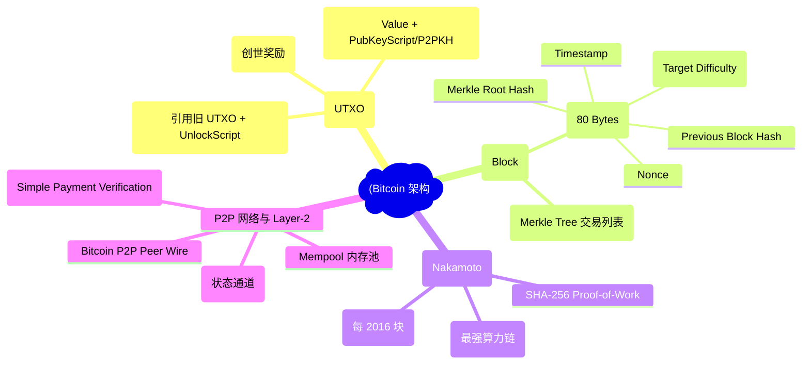
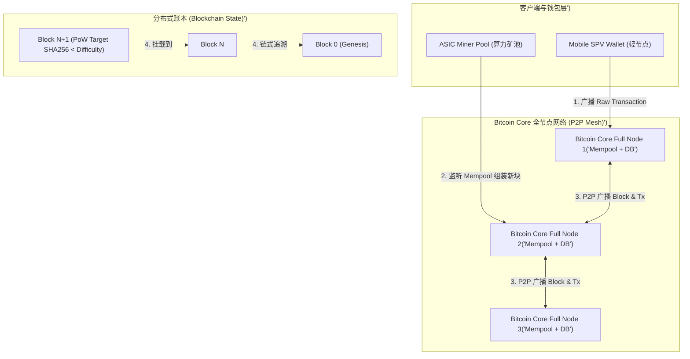
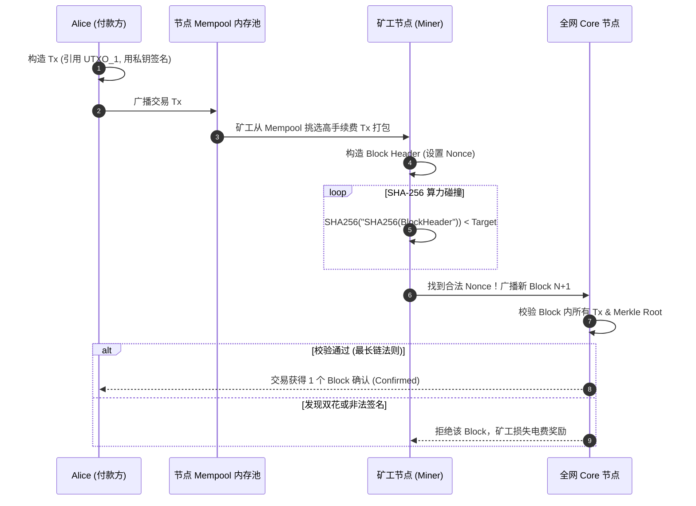
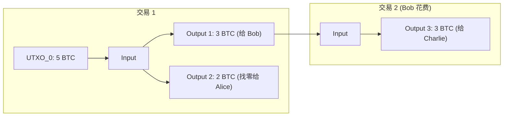
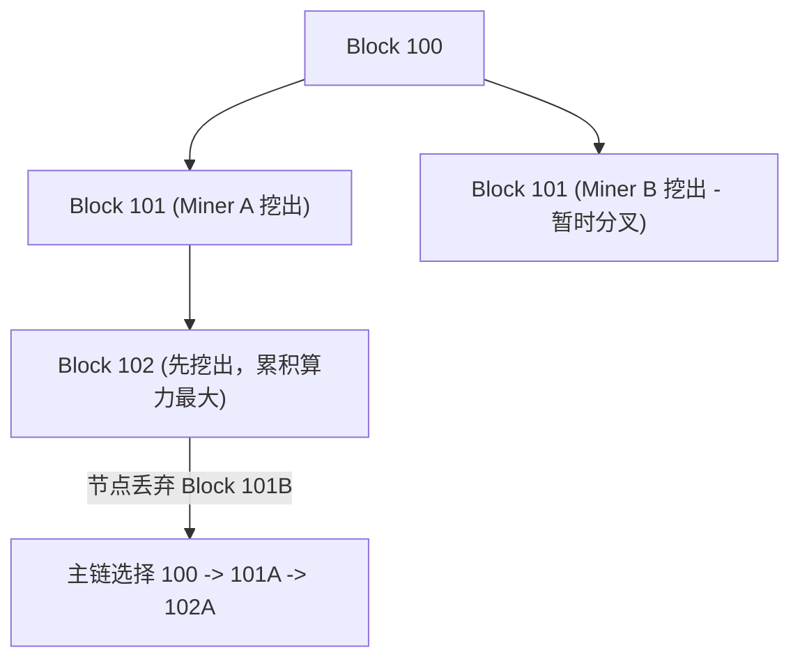

import CaseStudyHeader from '@site/src/components/CaseStudyHeader';
import DesignIntent from '@site/src/components/DesignIntent';
import EvolutionTimeline from '@site/src/components/EvolutionTimeline';
import CompareSlider from '@site/src/components/CompareSlider';
import TradeoffExplorer from '@site/src/components/TradeoffExplorer';
import GuidedExercise from '@site/src/components/GuidedExercise';
import QuizCard from '@site/src/components/QuizCard';
import GlossaryTerm from '@site/src/components/GlossaryTerm';
import ResearchNote from '@site/src/components/ResearchNote';

# Bitcoin：UTXO 模型与 Proof-of-Work 区块链共识架构

<CaseStudyHeader
  oneLiner="比特币 (Bitcoin) 在完全去中心化、无信任第三方的对等网络 (P2P) 中，首次解决了经典分布式系统中的『双花问题 (Double-Spending)』与『拜占庭将军问题』。其核心依赖于 UTXO 状态模型、SHA-256 工作量证明 (PoW) 与 Nakamoto 最长链共识法则。"
  stats={[
    {label: '白皮书发布', value: '2008 年 (Satoshi Nakamoto 中本聪)'},
    {label: '数据记账模型', value: 'UTXO (Unspent Transaction Output)'},
    {label: '共识机制', value: 'Nakamoto Consensus (PoW 工作量证明)'},
    {label: '区块时间目标', value: '约 10 分钟 / Block'},
    {label: '难度调整周期', value: '每 2016 个区块 (约 2 周)'},
    {label: '最大供应量上限', value: '2,100 万枚 (每 210,000 区块减半)'}
  ]}
/>

:::info 对应课程概念
本案例主要映射 [Month 5 分布式核心组件]（分布式共识、拜占庭容错 BFT）及 [Month 3 数据、缓存与队列]（Merkle 树与 WAL 日志）。
:::

## 1. 设计初衷：无信任中介的去中心化电子现金

在比特币出现前，所有数字支付（如 PayPal、银行卡）都依赖中心化机构记录账户余额，否则无法防止用户将同一笔钱使用两次（双花问题）。中本聪的目标是：**构建一个完全去中心化、无需许可、透明可追溯且物理上不可篡改的点对点电子现金系统。**

<DesignIntent
  problem="如何在没有中央服务器、没有管理员且网络中存在恶意节点（拜占庭节点）的环境下，达成全球唯一的分布式交易账本共识？"
  users="全球任何拥有公私钥对的对等节点与交易发起者。"
  devices="矿机 (ASIC)、全节点 (Bitcoin Core Server) 及轻节点 (SPV Mobile Wallet)。"
  goals={[
    '绝对防双花：同一笔 UTXO 绝不可能被成功花费两次',
    '无信任中介拜占庭容错：只要全网诚实算力超过 50%，账本即不可篡改',
    '通缩代币经济学：严格控制发行速度，总量上限固定为 2,100 万枚',
    '状态可验证性：任何新加入节点从创世区块（Genesis Block）开始重放即可恢复确切状态'
  ]}
  constraints={[
    'P2P 网络广播存在秒级延迟，容易产生暂时的区块链分叉 (Fork)',
    '1MB 区块大小限制导致 TPS 仅约 7 次/秒，高并发下交易手续费极贵',
    'PoW 算力竞赛带来巨大的物理电能消耗'
  ]}
  firstStep="设计 UTXO 有向无环图 (DAG) 交易数据模型与 Merkle 树；结合 Hashcash 设计 SHA-256 难度自适应 PoW 挖矿机制。"
/>

## 2. 全景思维导图



## 3. 最新架构总览 (C4 风格)





## 4. 核心机制拆解

### 4a. UTXO 模型 vs 账户模型

与 Ethereum 或银行的账户余额（Account-based）不同，比特币没有"账户"概念，只有 <GlossaryTerm term="UTXO" definition="Unspent Transaction Output，未花费交易输出。比特币账本由无数不可分割的 UTXO 碎片组成。一笔交易消费若干旧 UTXO，并销毁创建若干新 UTXO。">UTXO</GlossaryTerm>：



- **高并发验证**：不同 UTXO 之间的交易完全无状态依赖，节点可以并行验证不同 Tx 的签名，无需全局锁。

### 4b. SHA-256 Proof-of-Work 与难度调整

矿工必须不断寻找一个 32 位随机数 <GlossaryTerm term="Nonce" definition="Number used once，区块头中的随机填空值，矿工通过不断修改 Nonce 尝试寻找满足 SHA-256 难度要求的哈希值。">Nonce</GlossaryTerm>，使得：

```text
SHA256(SHA256(BlockHeader)) < Target
```

为保证无论全球算力如何暴涨暴跌，新块生成速度始终维持在约 10 分钟，比特币每 2016 个区块自动触发 <GlossaryTerm term="难度调整算法" definition="Difficulty Adjustment Algorithm，对比生成最近 2016 个区块实际消耗的时间与预期 2 周 (20160 分钟) 的比例，按比例放大或缩小难度 Target。">难度调整</GlossaryTerm>：

```text
NextTarget = CurrentTarget * (ActualTimeFor2016Blocks / 14 Days)
```

### 4c. Nakamoto 最长链共识与拜占庭容错

当两个矿工几乎同时挖出新块时，网络会出现分叉（Fork）。比特币采用 <GlossaryTerm term="最长链法则" definition="Longest Chain Rule (或 Max Cumulative Work Rule)，节点始终选择累积工作量最大（最长）的链作为唯一合法主链，丢弃较短的竞争链。">最长链法则</GlossaryTerm>：



## 5. 关键数据结构与算法

### Merkle Tree 校验与 SPV 证明

区块体内的所有交易通过二进制 <GlossaryTerm term="Merkle Tree" definition="默克尔树：一种二叉哈希树，叶节点为各笔交易的 TxID。通过根节点 Merkle Root 即可锁定整块交易，且支持 O(log N) 时间复杂度的轻节点 SPV 简易支付验证。">Merkle Tree</GlossaryTerm> 向上两两哈希值汇总：

```text
ParentHash = SHA256(LeftChildHash + RightChildHash)
```

轻钱包（SPV）无需下载数百 GB 的完整区块，只需向全节点索取 `O(log N)` 长度的 Merkle Path，即可在本地验证某笔交易是否已被包含在区块中。

## 6. 架构演进史

<EvolutionTimeline
  events={[
    {
      year: '2009',
      title: '创世区块诞生 (Genesis Block)',
      why: '中本聪运行第一个 C++ 客户端，打包 Block 0，写入泰晤士报头条新闻。',
      change: '奠定 50 BTC 初始奖励、2100 万总量上限与 10 分钟出块地基。'
    },
    {
      year: '2017',
      title: '隔离见证 (SegWit / Segregated Witness) 激活',
      why: '1MB 区块空间不足，且存在交易可变性 (Transaction Malleability) 漏洞。',
      change: '将 ECDSA 签名脚本移出 1MB 基础区块，放入 Witness 数据区，等效扩容至 4MB。'
    },
    {
      year: '2021',
      title: 'Taproot 升级与 Schnorr 签名',
      why: '提升复杂多重签名 (Multisig) 隐私性并降低字节占用。',
      change: '引入 Schnorr 签名算法与 MAST (Merkle Abstract Syntax Tree)，支持高级智能合约。'
    }
  ]}
/>

### 架构演进对比

<CompareSlider
  before={
    <div style={{ padding: '20px', background: '#ffebee', borderRadius: '8px', height: '100%' }}>
      <h3>早期纯 1MB 基础区块 + ECDSA 签名</h3>
      <p>签名与交易体混在一起，每秒仅处理 7 笔交易，多重签名脚本极其臃肿费手续费。</p>
    </div>
  }
  after={
    <div style={{ padding: '20px', background: '#e8f5e9', borderRadius: '8px', height: '100%' }}>
      <h3>SegWit + Taproot + Lightning Network Layer-2</h3>
      <p>签名隔离降低体积，Schnorr 聚合多重签名，闪电网络实现百万级 TPS 秒级小额支付。</p>
    </div>
  }
/>

## 7. 设计模式与课程映射

1. **命令模式 (Command Pattern)**：每笔 UTXO 的 ScriptPubKey 与 ScriptSig 构成图灵不完备的 Stack-based 脚本虚拟机。
2. **组合模式 (Composite Pattern)**：Merkle Tree 的树状节点结构。
3. **映射 [Month 5 分布式核心组件]**：去中心化拜占庭容错共识 (BFT)。

## 8. 架构取舍与权衡

<TradeoffExplorer
  title="Bitcoin 核心架构设计取舍"
  dimensions={['去中心化与安全性', '吞吐量 TPS', '最终确定性延迟', '能源开销']}
  options={[
    {
      name: 'PoW 共识 + 1MB/SegWit 块小容量 (Bitcoin 方案)',
      scores: [5, 1, 2, 1],
      note: '极致的去中心化与物理防篡改抗审查力；但 TPS 极低（仅 7 次/秒），确认延迟需 10-60 分钟，能源消耗巨大。',
      whenToUse: '作为全球去中心化价值存储（数字黄金）与高结算层。'
    },
    {
      name: 'PoS 权益证明 + 快速出块/大块容量 (Ethereum 2.0 / Solana 方案)',
      scores: [4, 5, 4, 5],
      note: '零物理能源消耗，TPS 高达数千；但共识存在富者愈富（Staking Centralization）与无利害关系 (Nothing at Stake) 的权衡。',
      whenToUse: '高频 DeFi 应用、NFT 交易与智能合约应用平台。'
    }
  ]}
/>

## 9. 常见误解与澄清

:::warning 常见误解澄清
- **误解一：比特币数据库里存着每户人家（如 Alice）账户里有多少个比特币。**
  *事实*：比特币系统中压根不存在"账户余额"这个字段。钱包显示的余额，是钱包软件临时搜索全网所有归属于 Alice 公钥的未花费 **UTXO** 并进行加和求出的结果。
- **误解二：51% 算力攻击意味着攻击者可以随意偷走别人的比特币。**
  *事实*：即使攻击者掌握了 51% 算力，也无法凭空伪造密码学私钥签名去偷别人的 UTXO。51% 算力攻击只能做到**双花自己的钱**或**拒绝打包特定交易（审查）**。
:::

## 10. 如果是你来设计 (Guided Exercise)

<GuidedExercise
  title="设计简单 SHA-256 PoW 挖矿模拟器"
  goal="在 Python 中编写 PoW 算力碰撞循环，寻找满足指定难度前缀 0 个数的 Nonce。"
  steps={[
    '步骤 1: 定义区块头字符串 prefix = "Block#100|PrevHash:0000abc|Merkle:1234def"。',
    '步骤 2: 设定目标难度 target_zeros = 4 (要求哈希开头至少有 4 个 0)。',
    '步骤 3: 循环 nonce 从 0 到 10,000,000。',
    '步骤 4: 计算 hash_val = hashlib.sha256((prefix + str(nonce)).encode()).hexdigest()。',
    '步骤 5: 若 `hash_val.startswith("0" * target_zeros)`，打印合格的 Nonce 与 Hash 值并退出。'
  ]}
  hints={[
    '在真实比特币中，算力难度是用 256 位无符号大整数（Bits/Target）精确对比，而非单纯数 0 的个数。'
  ]}
  checks={[
    '增加难度 target_zeros 从 4 到 5，寻找合格 Nonce 的尝试次数是否暴增约 16 倍 (16^1)？',
    '修改 prefix 任意一个字符，原先找到的 Nonce 是否立刻失效？'
  ]}
/>

## 11. 自测题与来源清单

<QuizCard
  questions={[
    {
      q: '比特币选择 UTXO (Unspent Transaction Output) 模型相比传统账户模型 (Account Model) 的主要优势是什么？',
      options: [
        'A. 支持在客户端直接修改余额',
        'B. 无状态依赖，节点能无锁并行验证不同交易签名，且天然具备极强的隐私追踪阻碍能力',
        'C. 占用的硬盘空间固定为 1KB',
        'D. 不需要使用密码学私钥'
      ],
      answer: 1,
      explain: 'UTXO 模型天然解耦，使得并行交易验证与 Merkle 树剪枝变得极其高效。'
    },
    {
      q: '比特币每 2016 个区块（约 2 周）自动调整难度 Target 的主要目的是：',
      options: [
        'A. 提高挖矿手续费',
        'B. 无论全球算力如何暴涨或暴跌，始终将平均出块时间稳定在约 10 分钟',
        'C. 防止磁盘空间不足',
        'D. 自动清空 Mempool'
      ],
      answer: 1,
      explain: '难度自适应调节机制是比特币自我调控代币发行速度与网络安全性的基石。'
    },
    {
      q: '在比特币网络中发生暂时的区块链分叉 (Fork) 时，全节点如何决定哪条链是唯一合法的？',
      options: [
        'A. 投票选择服务器数量最多的那条链',
        'B. 遵循 Nakamoto 最长链法则，选择累积消耗 SHA-256 工作量证明算力最大的那条链',
        'C. 选择最新的那条链',
        'D. 由中本聪手动决定'
      ],
      answer: 1,
      explain: '最长链法则（最大累积算力链）是去中心化无中介拜占庭共识的核心机制。'
    }
  ]}
/>

## 来源

- [Bitcoin: A Peer-to-Peer Electronic Cash System (Satoshi Nakamoto, 2008)](https://bitcoin.org/bitcoin.pdf) —— 比特币奠基白皮书（UTXO / PoW / 最长链）。
- [Bitcoin Improvement Proposals（BIPs, GitHub: bitcoin/bips）](https://github.com/bitcoin/bips) —— 协议演进的一手提案集。

<ResearchNote
  title="比特币创世白皮书"
  source="Nakamoto, S. (2008). Bitcoin: A Peer-to-Peer Electronic Cash System"
  href="https://bitcoin.org/bitcoin.pdf"
  insight="中本聪在短短 9 页论文中阐述了 UTXO、PoW 算力投票、Merkle 树压缩与最长链拜占庭容错数学证明。"
  application="架构借鉴：如何在无信任、高对抗的网络环境中设计绝对防篡改的分布式状态共识系统。"
/>