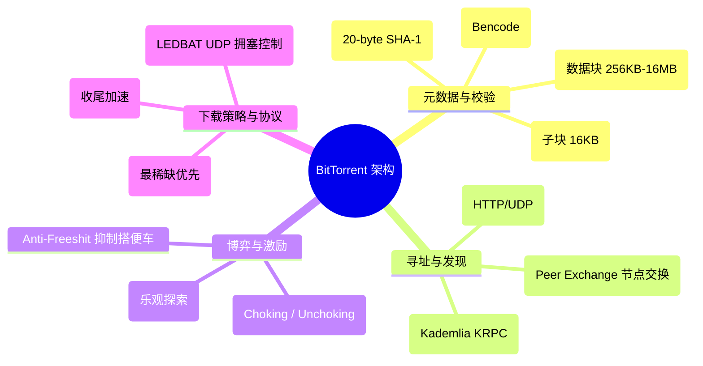
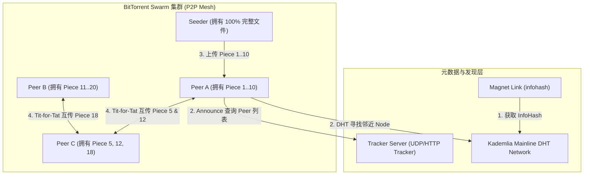
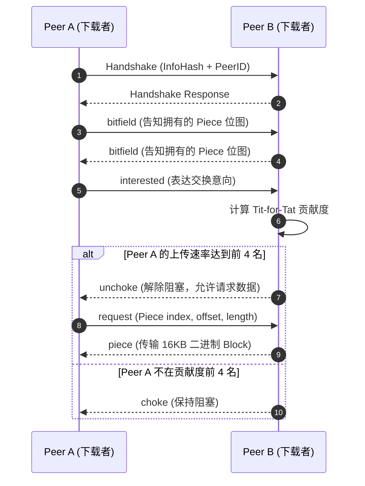
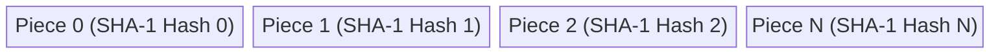

import CaseStudyHeader from '@site/src/components/CaseStudyHeader';
import DesignIntent from '@site/src/components/DesignIntent';
import EvolutionTimeline from '@site/src/components/EvolutionTimeline';
import CompareSlider from '@site/src/components/CompareSlider';
import TradeoffExplorer from '@site/src/components/TradeoffExplorer';
import GuidedExercise from '@site/src/components/GuidedExercise';
import QuizCard from '@site/src/components/QuizCard';
import GlossaryTerm from '@site/src/components/GlossaryTerm';
import ResearchNote from '@site/src/components/ResearchNote';

# BitTorrent：P2P 文件分发与 Tit-for-Tat 激励架构

<CaseStudyHeader
  oneLiner="BitTorrent 颠覆了传统的 HTTP / FTP 服务端-客户端单向分发模式。通过将大文件切分为数百个 Piece、引入 Tit-for-Tat (针锋相对) 博弈论激励算法（谁给我上传越快，我越优先给他上传）以及 Kademlia Mainline DHT，BitTorrent 实现了『下载的人越多，全网下载速度反而越快』的 P2P 奇迹。"
  stats={[
    {label: '创作者', value: 'Bram Cohen (2001 年)'},
    {label: '巅峰网络流量', value: '一度占据全球互联网 35% 流量'},
    {label: '文件切块大小', value: '通常 256 KB - 16 MB (SHA-1 哈希)'},
    {label: '核心博弈算法', value: 'Tit-for-Tat (Choking / Unchoking)'},
    {label: '去中心化索引', value: 'Kademlia Mainline DHT (BEP 5)'},
    {label: '传输协议', value: 'uTP (Micro Transport Protocol / UDP)'}
  ]}
/>

:::info 对应课程概念
本案例主要映射 [Month 5 分布式核心组件]（P2P 网络与 DHT）、[Month 3 数据、缓存与队列]（数据分块与校验）及 [N1. IPFS / Libp2p](./ipfs-libp2p.mdx)。
:::

## 1. 设计初衷：人人为我，我为人人

在传统 HTTP C/S 架构中，一个 10GB 的 Linux 发行版 ISO 镜像如果被 10 万人同时下载，源站需要承受 1000 TB 的巨额回源带宽成本。BitTorrent 的核心原理是：**让每一个正在下载文件的人（Leecher），同时也把已经下载好的数据切块共享上传给其他下载者（Seeder）。**

<DesignIntent
  problem="如何在零服务器高昂带宽成本的前提下，支撑 TB 级超大文件向全球数百万用户同时高速分发？"
  users="开源社区（Linux ISO 分发）、游戏厂商（客户端补丁更新）及全球 P2P 用户。"
  devices="桌面电脑、NAS 设备及边缘服务器。"
  goals={[
    '无限可扩展性：下载节点数量增加时，全网可用上传带宽同步线性增加',
    '防范搭便车（Free-riding）：通过博弈论机制惩罚『只下载不上传』的利己节点',
    '数据完整性：防范恶意节点投毒（篡改文件损坏数据）',
    '无单点依赖：即便 Tracker 调度服务器彻底宕机，依靠 DHT 依然能完成 P2P 寻址'
  ]}
  constraints={[
    '节点动态上下线（Churn）极度频繁，连接不可靠',
    '对称 NAT 与防火墙导致 Peer 之间难以直接建立 TCP 连线',
    '必须优先下载最稀缺的数据块（Rarest First），防止整个网络数据失真死亡'
  ]}
  firstStep="设计 `.torrent` 元数据文件规范与 SHA-1 Piece 哈希校验；编写基于 Choking 状态机的 Tit-for-Tat 算法。"
/>

## 2. 全景思维导图



## 3. 最新架构总览 (C4 风格)





## 4. 核心机制拆解

### 4a. .torrent 文件与 SHA-1 Piece 校验

BitTorrent 将文件分割为固定大小的 <GlossaryTerm term="Piece" definition="BitTorrent 将文件切分的逻辑块（通常 512KB - 4MB）。每个 Piece 计算一个 20 字节的 SHA-1 哈希值并写入 .torrent 文件中。">Piece</GlossaryTerm>，每个 Piece 进一步拆分为 16KB 的 Block 进行传输：



- **防投毒**：每下载完一个完整 Piece，客户端立即用 `.torrent` 内的 SHA-1 哈希校验。若校验失败，抛弃该 Piece 并将提供劣质数据的 Peer 列入黑名单。

### 4b. Tit-for-Tat (针锋相对) 博弈激励机制

为了防止某些节点只下载不上传（Free-rider），BitTorrent 设计了 <GlossaryTerm term="Tit-for-Tat" definition="博弈论中的针锋相对策略。每个节点每隔 10 秒评估所有邻居节点的上传速度，仅对上传速度最快的前 N 个节点解除阻塞（Unchoke），其余节点保持 Choke（不给发送数据）。">Tit-for-Tat</GlossaryTerm> 状态机：

- **Regular Unchoking**：选出过去 20 秒内给本机提供下载速度最快的前 4 个 Peer，对它们敞开上传。
- **Optimistic Unchoking (乐观探索)**：随机挑选 1 个处于 Choke 状态的新 Peer 解除阻塞，持续 30 秒。这既能发现潜在的高速新节点，又给刚加入无任何数据的 Bootstrap 新节点提供了初始启动数据。

### 4c. Rarest-Piece First (最稀缺优先) 策略

如果所有节点都优先下载文件开头的 Piece 0，会导致整个网络中 Piece 0 泛滥，而结尾的 Piece 极其罕见。BitTorrent 强制采用 <GlossaryTerm term="Rarest-Piece First" definition="最稀缺优先算法：客户端统计 Swarm 内所有 Peer 的 Bitfield，优先下载当前集群中存量最少的 Piece，确保整个文件在全网各个分片均匀分布。">Rarest-Piece First</GlossaryTerm> 策略：


## 5. 关键数据结构与算法

### Kademlia Mainline DHT (XOR 距离算法)

在磁力链接（Magnet Link）无 Tracker 模式下，每个节点与 InfoHash 均用 160-bit 空间表示。节点间的距离为：

```text
d(x, y) = x ^ y
```

查找资源时，节点在本地 k-bucket 中查找与目标 InfoHash XOR 距离最近的 8 个 Peer 节点，递归收敛找到数据拥有者。

## 6. 架构演进史

<EvolutionTimeline
  events={[
    {
      year: '2001',
      title: 'BitTorrent 协议发布 (BEP 3)',
      why: '传统 HTTP 无法承载动辄 GB 级别的开源 ISO 与软件大文件分发。',
      change: '推出基于 Bencode 序列化、.torrent 文件与 Tracker 集中调度的 P2P 架构。'
    },
    {
      year: '2005',
      title: 'Mainline DHT 无 Tracker 寻址 (BEP 5)',
      why: '集中式 Tracker 服务器频繁遭 DDOS 攻击或法律风险关停，导致 Swarm 瘫痪。',
      change: '引入基于 Kademlia 算法的 Mainline DHT，实现磁力链接 (Magnet Link) 去中心化寻址。'
    },
    {
      year: '2008',
      title: 'uTP (Micro Transport Protocol) 拥塞控制',
      why: '传统 TCP P2P 流量跑满用户的宽带，导致同局域网网页打不开、游戏高延迟（打爆路由器 Buffer）。',
      change: '推出基于 UDP 的 uTP 协议（LEDBAT 算法），在检测到网络有其他流量时自动退让让出带宽。'
    }
  ]}
/>

### 架构演进对比

<CompareSlider
  before={
    <div style={{ padding: '20px', background: '#ffebee', borderRadius: '8px', height: '100%' }}>
      <h3>早期单点 Tracker + TCP 模式</h3>
      <p>依赖中心化 Tracker 服务器分配 Peer，TCP 流量容易打爆家用路由器 Buffer, 容易被封杀。</p>
    </div>
  }
  after={
    <div style={{ padding: '20px', background: '#e8f5e9', borderRadius: '8px', height: '100%' }}>
      <h3>Magnet 磁力 + Kademlia DHT + uTP 拥塞自适应</h3>
      <p>无需任何中心服务器，磁力链接秒级哈希寻址，uTP 自动退让后台静默高速下载。</p>
    </div>
  }
/>

## 7. 设计模式与课程映射

1. **状态模式 (State Pattern)**：Peer 连接在 Choked / Unchoked 与 Interested / Not Interested 4 种状态间转换。
2. **策略模式 (Strategy Pattern)**：下载策略包含 Regular Rarest-First、Strict Priority 与 End-Game Mode。
3. **映射 [Month 5 分布式核心组件]**：P2P DHT 路由与去中心化哈希表。

## 8. 架构取舍与权衡

<TradeoffExplorer
  title="BitTorrent P2P 核心架构取舍"
  dimensions={['服务端带宽成本', '下载流式体验', '数据去中心化', '冷门文件存活率']}
  options={[
    {
      name: 'Rarest-First + Tit-for-Tat P2P 架构 (BitTorrent 方案)',
      scores: [100, 50, 98, 40],
      note: '服务端带宽成本为 0，热门文件越抢越快；但数据块乱序下载无法做在线视频边下边播，且冷门无人做种文件会永久死亡。',
      whenToUse: '超大文件（ISO/客户端安装包/高精模型）的大规模分发。'
    },
    {
      name: '顺序下载 (Sequential Download) + CDN 托管',
      scores: [20, 100, 20, 95],
      note: '支持视频边下边看，冷门文件由 CDN 兜底；但源站/CDN 带宽成本极度高昂。',
      whenToUse: '在线视频点播 (VOD) 平台。'
    }
  ]}
/>

## 9. 常见误解与澄清

:::warning 常见误解澄清
- **误解一：磁力链接 (Magnet Link) 里面包含了文件的下载下载服务器地址。**
  *事实*：磁力链接（如 `magnet:?xt=urn:btih:4A5...`）本质上只包含文件的 **InfoHash**（20 字节 SHA-1 值），没有任何服务器 IP。客户端是靠这个 InfoHash 在全球 DHT 网络中向邻居节点询问谁有这个文件。
- **误解二：只要我开着 BitTorrent 软件，就一定会被别人抽走全部宽带。**
  *事实*：modern BitTorrent 协议采用了 **uTP (LEDBAT 算法)**。一旦检测到同局域网有人在看视频或玩游戏（延迟增加），uTP 会在毫秒级内自动降低上传速度，主动让出带宽。
:::

## 10. 如果是你来设计 (Guided Exercise)

<GuidedExercise
  title="设计 Bitfield 块位图解析器"
  goal="在 Python 中实现 Bitfield 位图解析，判断特定 Peer 是否拥有指定索引的 Piece。"
  steps={[
    '步骤 1: 假设文件包含 20 个 Piece，Bitfield 占用 3 个字节 (24 bits)。',
    '步骤 2: 收到 Peer 传来的字节流 `bitfield_bytes = b"\xFF\x00\xF0"`。',
    '步骤 3: 编写函数 `has_piece(bitfield_bytes, piece_index)`。',
    '步骤 4: 计算 `byte_index = piece_index // 8`，`bit_offset = 7 - (piece_index % 8)`。',
    '步骤 5: 执行位掩码运算 `(bitfield_bytes[byte_index] >> bit_offset) & 1`，返回 True/False。'
  ]}
  hints={[
    '注意 Bitfield 在 BitTorrent 规范中是大端序 (Most Significant Bit First)，最高位代表 Piece 0。'
  ]}
  checks={[
    'Piece 0 是否对应第一个字节的第 7 位 (0x80)？',
    '当末尾包含 Padding 填充位时，如何防止越界？'
  ]}
/>

## 11. 自测题与来源清单

<QuizCard
  questions={[
    {
      q: 'BitTorrent 协议中的 Tit-for-Tat (针锋相对) 算法主要解决了什么问题？',
      options: [
        'A. 防止文件被黑客加密',
        'B. 防范『只下载不上传』的搭便车 (Free-riding) 节点，通过只向贡献上传速度最快的前 N 个 Peer 开放下载来激励上传',
        'C. 自动加速 DNS 解析',
        'D. 避免硬盘写入过快打爆缓存'
      ],
      answer: 'B',
      explain: 'Tit-for-Tat 是 BitTorrent 的博弈论内核，它将上传带宽作为硬通货，实现了节点间的自我激励与公平交易。'
    },
    {
      q: '为什么 BitTorrent 默认强制要求客户端使用 Rarest-Piece First (最稀缺优先) 策略而不是按顺序从头下载？',
      options: [
        'A. 因为按顺序下载在 C++ 中很难实现',
        'B. 防止开头的数据块过度泛滥而结尾的数据块全网绝版，确保全网 Piece 分布均匀，提高系统生存力',
        'C. 为了节省客户端内存',
        'D. 提升加密强度'
      ],
      answer: 'B',
      explain: '最稀缺优先算法能最大化集群中数据分片的熵，防止因做种者突然离线而导致文件最后几个块永久缺失。'
    },
    {
      q: '磁力链接 (Magnet Link) 能在没有 Tracker 服务器的情况下查找到 Peer 节点，依赖的核心底层技术是：',
      options: [
        'A. Kademlia Mainline DHT (分布式哈希表) 网络',
        'B. BGP Anycast 广播',
        'C. 局域网广播 (UDP Broadcast)',
        'D. HTTP/2 多路复用'
      ],
      answer: 'A',
      explain: 'Mainline DHT 将全球所有 BT 客户端节点连成一张巨大的去中心化哈希网，依靠 160-bit XOR 距离算法定位 InfoHash 的持有者。'
    }
  ]}
/>

<ResearchNote
  title="BitTorrent 协议标准规范 (BEP 3) 与学术论文"
  source="Cohen, B. (2003). Incentives Build Robustness in BitTorrent"
  href="https://www.bittorrent.org/beps/bep_0003.html"
  insight="作者 Bram Cohen 亲自阐述了 BitTorrent 的设计哲学、Bencode 编码、Choking 算法以及算法博弈论在分布式系统中的应用。"
  application="架构借鉴：如何运用博弈论机制设计自激励、去中心化且抗攻击的 P2P 网络。"
/>
