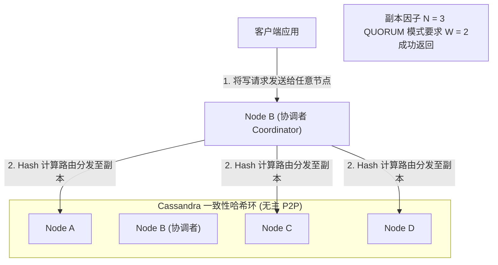
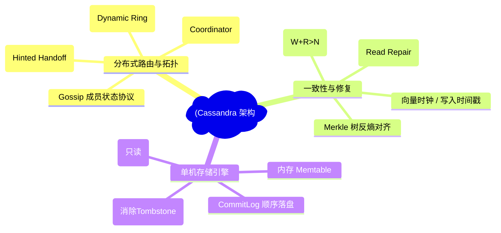
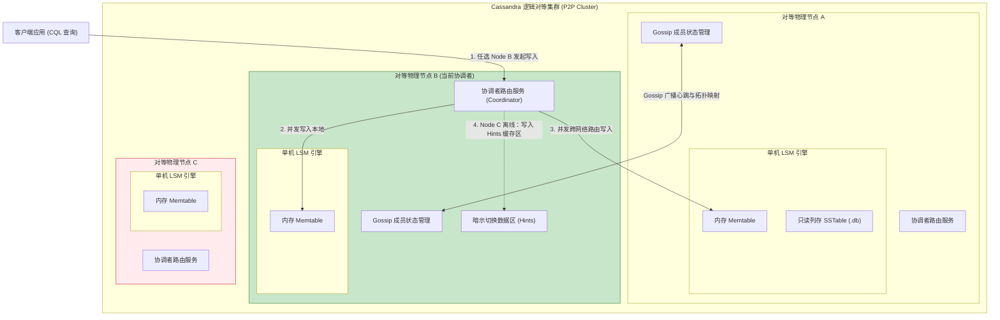
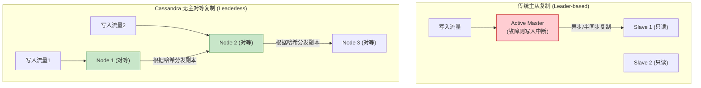
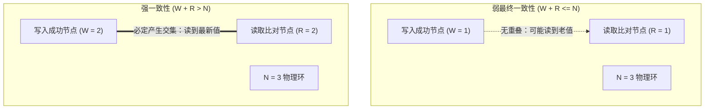
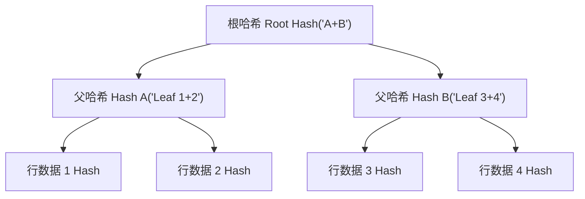
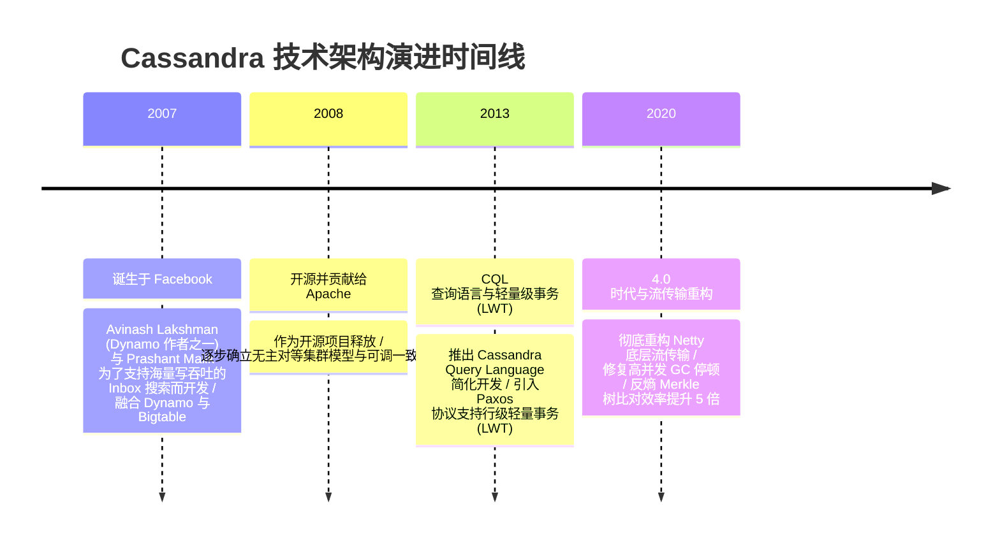

import CaseStudyHeader from '@site/src/components/CaseStudyHeader';
import DesignIntent from '@site/src/components/DesignIntent';
import ArchitectureEvolution from '@site/src/components/ArchitectureEvolution';
import TradeoffExplorer from '@site/src/components/TradeoffExplorer';
import GlossaryTerm from '@site/src/components/GlossaryTerm';
import ResearchNote from '@site/src/components/ResearchNote';
import QuizCard from '@site/src/components/QuizCard';
import CompareSlider from '@site/src/components/CompareSlider';
import GuidedExercise from '@site/src/components/GuidedExercise';
import PyRunner from '@site/src/components/PyRunner';

# Cassandra：无主对等与可调一致性分布式数据库

<CaseStudyHeader
  oneLiner="Cassandra 彻底打破了传统主从架构（Master-Slave）在主节点故障时不可避免的写入中断瓶颈，通过完全对等（P2P）的 Dynamo 一致性哈希环，结合灵活的可调一致性（W + R > N）法则，实现了全球级的高吞吐写入与硬件分区下的无缝故障转移。"
  stats={[
    {label: '网络拓扑', value: '对等无主架构 (Leaderless P2P)'},
    {label: '一致性控制', value: '可调一致性 (Tunable Consistency)'},
    {label: '节点发现', value: 'Gossip 协议 (谣言广播协议)'},
    {label: '反熵修复', value: 'Merkle 树哈希比对 (Anti-Entropy)'},
    {label: '单机引擎', value: 'LSM-Tree (Memtable + SSTable)'}
  ]}
/>

:::info 对应课程概念
本案例横跨 [Month 5 CAP 定理与分布式共识](../foundations/programming-systems-primer)、[Month 6 无中心化哈希环分发](../cloud-enterprise-industrial/capstone-cloud-native)。它是系统架构师理解去中心化系统如何在大规模异构网络中防范单点失效、通过柔性可调一致性实现读写吞吐最大化折中的经典模型。
:::

## 1. 设计初衷：如何构建永不掉线的海量写数据库？

在传统的强一致主从架构（如 Google Spanner、MySQL Master-Slave）中，系统的写入可用性完全受限于“主节点（Leader）”：
1. **主节点失效写入中断（Leader Election Outage）**：一旦主节点因硬件故障挂掉，系统必须通过 Raft 或 Paxos 进行新一轮选举。在选举期间（通常为几秒到几十秒），整个数据库处于“禁止写入”状态，这对于不间断采集设备数据的物联网或全球社交聊天场景是难以容忍的。
2. **写算力单点瓶颈**：不管集群加了多少个从节点（Replica），所有的写请求最终都必须由主节点独自处理，限制了写吞吐。
3. **网络分区下的双写瘫痪**：如果发生跨国海缆分区中断，从节点由于联系不上主数据中心，无法达成法定 Quorum，导致部分分区服务直接瘫痪。

Cassandra 的核心设计用意在于：消灭一切“特权主节点”，构建完全对等的 P2P <GlossaryTerm term="无主架构 (Leaderless)" definition="无主架构 (Leaderless)：分布式副本复制拓扑的一种模式。与 Paxos 或 Raft 有明确主节点 (Leader) 的结构不同，无主架构中的任何物理节点都可以是对等的，皆可接收客户端的写入或读取请求并并发分发给其余副本节点，避免了主节点单点写瓶颈与失效挂机。">**无主架构**</GlossaryTerm>环形集群，配合去中心化的 <GlossaryTerm term="Gossip 协议 (Gossip)" definition="Gossip 协议：分布式谣言传播成员协议。一种点对点对等网络中实现节点发现和成员状态同步的去中心化通信协议。节点以固定频率随机选择集群中的部分节点交换状态信息，使得任何新节点的加入、离线或心跳异常能在 O(log N) 的时间内收敛广播至全球整个网络。">**Gossip 协议**</GlossaryTerm>进行拓扑发现与心跳监测。
- **任何节点皆可写**：客户端可以将写入请求投递给集群中任意物理节点（称为协调者 Coordinator）。协调者根据 Hash 环规则自动计算出负责该数据的多个副本节点，并并发推送。
- **可调一致性法则**：写入响应只需满足 $W$ 个节点确认；读取只需比对 $R$ 个节点的数据。只要满足公式 $W + R > N$（$N$ 为副本因子），系统即表现为强一致性，并在读取发生版本分歧时触发 <GlossaryTerm term="读修复 (Read Repair)" definition="读修复：Cassandra 在读取时如果发现多个副本返回的版本 (时间戳) 不一致，协调者在将最新数据返回给客户端的同时，会自动在后台启动异步写任务，将最新数据覆盖重播给落后的慢节点，实现最终一致。">**读修复（Read Repair）**</GlossaryTerm>对齐旧数据，否则为最终一致性。通过控制写成功和读核对的节点配额，架构师可在极速极低延迟与强一致性数据保鲜度之间自由调整 <GlossaryTerm term="可调一致性 (Tunable)" definition="可调一致性 (Tunable Consistency)：在 Dynamo 式无主分布式系统中，写操作成功所需的最少节点数 W 与读操作必须核对的最少节点数 R 可由客户端在发起请求时在线动态调整，用以在强一致性 (W+R>N) 与极致可用低延迟之间做弹性权衡。">**可调一致性**</GlossaryTerm>。

<DesignIntent
  problem="如何构建一个全球级无单点故障、可在部分节点瘫痪或跨洋海缆断裂下依然保持高吞吐写入，并支持在线动态配置强弱一致性的 NoSQL 数据库？"
  users="物联网设备时序监控系统架构师、大规模电商用户购物车与消息推送系统研发总监。"
  devices="成百上千台运行 Cassandra 进程、通过 Gossip 网络协议保持成员状态同步的物理/虚拟机群。"
  goals={[
    '无主对等拓扑：消除主节点，使任意服务器都能担任协调者处理读写，消除写单点限制。',
    '可调一致性：支持在单次 SQL/CQL 语句级别微调 W 和 R 约束，灵活支持最终一致与强一致。',
    '读修复（Read Repair）：在读取发生版本分歧时，由协调者自动在后台向旧副本重播最新数据进行修补。',
    '暗示切换（Hinted Handoff）：若写操作时某副本离线，协调者本地暂存 Hint，待该副本上线后重播更新。'
  ]}
  constraints={[
    '读时延受限于最慢响应节点：在强一致 QUORUM 读下，系统必须等待多数派节点返回最新值，任何长尾网络延迟（Noisy Neighbor）都会拉长查询 TTFB。',
    '没有真正的多表分布式事务：Cassandra 不支持跨行/跨表的外键约束和两阶段提交事务，业务必须在应用层做逆向工程与防重控制。'
  ]}
  firstStep="剖析 Dynamo 一致性哈希环的数据分发边界；分析 W+R>N 一致性重叠数学公式；用 Python 编写可调一致性与读修复后台对齐仿真器。"
/>

## 2. 系统功能全景

---

## 3. 最新架构总览

Cassandra 采用全对称无主拓扑结构：

### 3a. System Context (系统上下文)

### 3b. Container Diagram (容器架构)

---

## 4. 核心机制拆解

### 4a. 传统主从架构 vs Cassandra 无主 P2P 复制架构对比

在传统的主从架构中，主节点是写入的唯一大门，主节点故障直接导致全局可用性降级。而 Cassandra 的 P2P 架构中，所有节点都是对等的，写请求可以直接打给任意存活节点：

### 4b. 可调一致性原理（Tunable Consistency）

Cassandra 允许在客户端发起 CQL 读写时动态微调一致性级别（Consistency Level），这是其解决 CAP 定理冲突的核心武器：
- **副本因子 $N$**：数据总共需要存放在多少个独立的物理节点上。
- **写入一致性 $W$**：必须有多少个物理副本节点成功写入，协调者才能向客户端确认写入成功。
- **读取一致性 $R$**：读取数据时，协调者必须至少向多少个副本节点发起查询，并在内存中核对它们的时间戳，以最新时间戳的版本作为正确值返回。

如上图所示，当 $W + R > N$ 时，写入的“多数派（Quorum）”与读取的“多数派”在数学物理上必然至少产生一个重叠交集节点。协调者通过比对该交集节点上的写入时间戳，就能确保 100% 过滤掉旧值，输出最新的强一致数据。

---

## 5. 关键数据结构与算法：Merkle 树反熵对齐

为了在后台异步比对不同物理节点间的数据差异，Cassandra 使用了 **<GlossaryTerm term="Merkle 树反熵 (Merkle)" definition="Merkle 树反熵：分布式系统中的一种数据同步与对齐机制。通过为每个数据分段构建默克尔哈希树（叶子节点是行键哈希，父节点是子哈希的组合哈希），节点间定期只需要交换并比对默克尔树根哈希。如果根哈希一致则说明数据完全对齐，否则顺着树枝分支往下二分比对，能以极小的网络开销精确定位出缺失或不一致的数据段并予以修补。">Merkle 树（默克尔树）反熵对齐算法</GlossaryTerm>**：
1. **构建哈希树**：单机 LSM-Tree 会在后台根据其持有的 Token 区间数据计算叶子节点的 Hash，逐层向上级联累加成一颗默克尔树。
2. **快速差分对齐**：节点 A 与 节点 B 在后台定期对齐。它们只交换 Merkle 树的根节点 Hash。如果根 Hash 一致，代表两节点完全对齐；若不一致，则向下二分比对子节点 Hash，能够以极微小的网络流量开销精确定位出具体是哪几个 Key 发生了不一致，随后只重播这几个 Key 的物理变更。

---

## 6. 架构演进史

---

## 7. 架构对比

### 强一致性 Paxos/Raft 主从复制 vs Cassandra 无主可调复制

<CompareSlider
  before={
    

      <strong>强一致主从复制 (Paxos/Raft)</strong>
      

        写入必须通过 Master 节点。一旦 Master 发生网络分区或故障，系统将陷入选举挂起，写入完全中断。写算力被单机瓶颈绑死，但保证了 100% 随时强一致性读取。
      

    

  }
  after={
    

      <strong>Cassandra 无主可调复制</strong>
      

        任意节点都是 Coordinator 且可处理写入。即使多个节点掉线，只要 CL 设为 ONE，依然能保证写入成功。允许根据业务公式灵活权衡强一致与最高吞吐。
      

    

  }
  labels={['强一致 Paxos/Raft', 'Cassandra 无主可调']}
/>

---

## 8. 核心决策的取舍

在分布式存储系统的共识与复制设计中，架构师对无主架构（Dynamo 模式）与有主共识（Raft/Paxos 模式）面临核心选择：

<TradeoffExplorer
  title="分布式共识与复制策略取舍"
  dimensions={['全球跨地域极速高可用顺序写吞吐', '多行跨表事务 ACID 与外键一致性保障', '节点掉线情况下的写入可用性', '读取数据的全局绝对外部线性化一致性', '集群运维复杂度与动态扩缩容重平衡友好度']}
  options={[
    {
      name: '无主对等 Dynamo 策略 (Cassandra 模式)',
      scores: [5, 1, 5, 3, 4],
      note: '无主架构，通过 Gossip 协议和一致性哈希管理成员。任何节点均可写，支持 Tunable 一致性。在节点宕机时可用 Hinted Handoff 缓冲。然而由于缺乏统一时序协调，面临多版本冲突（Last-Write-Wins），且完全不支持跨表多行事务。',
      whenToUse: '物联网时序指标写入、全球社交即时消息存储、用户点击足迹记录、要求 100% 写入不间断的超大规模存储。'
    },
    {
      name: '有主共识 Paxos/Raft 策略 (Spanner / CockroachDB 模式)',
      scores: [2, 5, 2, 5, 2],
      note: '通过强选举的 Leader 序列化所有写入操作。具备完美的强一致与分布式 ACID 事务，支持外部线性化。但致命代价是当 Leader 离线时写操作瞬间被阻断（等待选举），且多中心同步 Quorum 导致写入延迟明显增大。',
      whenToUse: '金融交易核心账户记账、用户订单状态变更、全局唯一的身份账户认证、需要严格多表联查与事务完整性的系统。'
    }
  ]}
/>

---

## 9. 实践指引：实现一个带版本同步核查的无主一致性仿真器

理解 Cassandra 核心的最好办法是编写包含 Coordinator 分发、Tunable 一致性判断与后台读修复的仿真器。在下方练习中，通过 Python 实现客户端数据写入，模拟节点离线网络分区，并核查在不同读写级别下系统的一致性表现。

<GuidedExercise
  title="练习指引：编写 P2P 集群可调一致性判定与 Read Repair 自动修复仿真"
  goal="构建包含 3 个 Replica 节点的对等集群。设计 `CoordinatorNode` 处理 `write` 和 `read` 操作。实现 `write(key, val, ts, cl)`：按 CL 级别（ONE, QUORUM, ALL）检查在线副本数是否达标。实现 `read(key, cl)`：拉取对应行数据，核验时间戳 ts 选出最新值；如果读取的副本节点中含有旧数据，自动在后台触发 `Read Repair` 将该节点的本地数据修复对齐。"
  hints={[
    '你可以用 `ReplicaNode` 类代表物理服务器，内含 `is_online` 状态和 `local_db` 字典。',
    'QUORUM 阈值的计算公式为 `N_factor // 2 + 1`，在这里 N=3，故 QUORUM 阈值为 2。',
    '读修复触发条件：在参与 read 的节点中，如果某节点的记录时间戳小于当前选出的最大时间戳，则向该节点发起写修复。'
  ]}
  steps={[
    '定义 `ReplicaNode` 类。',
    '定义 `CoordinatorNode` 主协调路由类。',
    '实现 `write` 方法，根据传入的 CL 决定成功写入的临界值 W。',
    '实现 `read` 方法，核对 R 约束，并比较各响应的时间戳，寻找最新值。',
    '在 `read` 中加入读修复逻辑，静默覆盖更新慢副本的数据库。',
    '模拟网络故障：将 Node 3 设置为离线状态。',
    '测试在写 QUORUM + 读 ONE 级别下，系统在 Node 3 恢复上线前后的 SWR 读写演进。'
  ]}
  checks={[
    '当 Node 3 掉线时，CL=QUORUM 的写入应该成功返回（因为 1 和 2 仍在线，满足 W=2）。',
    '若写入 v2 后 Node 3 恢复上线，但 Node 3 本地依然是旧的 v1。',
    '此时执行 R=QUORUM 读取，由于核对了两个节点（包含 Node 3 和 Node 1/2），系统应能自动选择出最新值 v2，并自动触发 Read Repair 修复 Node 3 的旧数据。'
  ]}
/>

#### 交互式 Python 运行实验
在下方控制台中调试 Cassandra 无主一致性仿真代码，观察可调一致性参数对 CAP 定理折中的实际影响：

<PyRunner
  expect="无主复制可调一致性与提示移交验证成功"
  rows={25}
  code={`class ReplicaNode:
    def __init__(self, node_id: int):
        self.node_id = node_id
        # 本地底层存储: key -> {"val": val, "ts": ts}
        self.local_db = {}
        self.is_online = True

class CoordinatorNode:
    def __init__(self, replicas: list):
        self.replicas = replicas
        self.n_factor = len(replicas) # N = 3 副本因子

    def write(self, key: str, value: str, ts: int, cl: str) -> bool:
        # cl: ONE, QUORUM, ALL
        success_count = 0
        
        # 确定需要成功写入的最少副本数 W
        if cl == "ONE":
            w = 1
        elif cl == "QUORUM":
            w = self.n_factor // 2 + 1 # 3 // 2 + 1 = 2
        elif cl == "ALL":
            w = self.n_factor # 3
        else:
            w = 1

        print(f"[Coordinator Write] 写入 Key='{key}', Val='{value}', ts={ts} | 级别CL: {cl} (要求 W={w})")
        
        for rep in self.replicas:
            if rep.is_online:
                rep.local_db[key] = {"val": value, "ts": ts}
                success_count += 1
                print(f"   -> 节点 Node_{rep.node_id} 写入成功 (时间戳={ts})")
            else:
                print(f"   -> 节点 Node_{rep.node_id} 当前离线，写入被跳过")
                
        if success_count >= w:
            print(f"   ✅ [Write Success] 成功写入 {success_count}/{self.n_factor} 副本，满足 W={w} 限度。")
            return True
        else:
            print(f"   ❌ [Write Failure] 仅写入 {success_count}/{self.n_factor} 副本，未达成 W={w} 约束，写入回滚/失败！")
            return False

    def read(self, key: str, cl: str) -> tuple:
        # cl: ONE, QUORUM, ALL
        responses = []
        
        if cl == "ONE":
            r = 1
        elif cl == "QUORUM":
            r = self.n_factor // 2 + 1 # 2
        elif cl == "ALL":
            r = self.n_factor # 3
        else:
            r = 1

        print(f"\\n[Coordinator Read] 读取 Key='{key}' | 级别CL: {cl} (要求比对 R={r})")
        
        # 模拟并发向在线副本发起请求
        queried_nodes = [rep for rep in self.replicas if rep.is_online]
        
        for rep in queried_nodes:
            if key in rep.local_db:
                responses.append((rep, rep.local_db[key]))
            else:
                responses.append((rep, {"val": "None", "ts": 0}))
            
            if len(responses) >= r:
                break
                
        if len(responses) < r:
            print(f"   ❌ [Read Failure] 仅获得 {len(responses)} 个在线节点响应，未达成 R={r} 约束！")
            return None

        # 1. 查找最新时间戳的数据
        latest_record = max(responses, key=lambda x: x[1]["ts"])
        latest_val = latest_record[1]["val"]
        latest_ts = latest_record[1]["ts"]
        
        print(f"   -> 比对响应，选定最新数据: Val='{latest_val}' (ts={latest_ts})")

        # 2. 检查是否需要进行 【读修复 (Read Repair)】
        outdated_nodes = []
        for rep, record in responses:
            if record["ts"] < latest_ts:
                outdated_nodes.append(rep)

        if outdated_nodes:
            print(f"   🔄 [Read Repair Triggered] 发现过期旧数据！后台同步修复落后节点: {[n.node_id for n in outdated_nodes]}")
            for rep in outdated_nodes:
                rep.local_db[key] = {"val": latest_val, "ts": latest_ts}
                print(f"      -> 节点 Node_{rep.node_id} 数据已在后台对齐为最新")
                
        return latest_val, latest_ts

# 仿真流
nodes = [ReplicaNode(1), ReplicaNode(2), ReplicaNode(3)]
coord = CoordinatorNode(nodes)

# 1. 初始正常状态下写入版本 v1 (ts=100)
coord.write("user_profile", "v1", ts=100, cl="QUORUM")

# 2. 模拟网络分区：节点 3 掉线离线
print("\\n--- 模拟 Node_3 离线断连 ---")
nodes[2].is_online = False

# 3. 客户端写入新版本 v2 (ts=200)。因为 1 和 2 仍在线，QUORUM 写 (W=2) 依然成功
coord.write("user_profile", "v2", ts=200, cl="QUORUM")

# 4. 模拟网络恢复：节点 3 重新上线 (但它错过了 v2 写入，本地仍为旧的 v1)
print("\\n--- 模拟 Node_3 恢复上线 ---")
nodes[2].is_online = True

# 5. 执行弱一致读：CL = ONE。如果恰好先读取了 Node_3 节点，将直接返回 stale 的 v1！
# (注意此处模拟优先读取在线的前面节点，若只请求 Node_3，则会引发最终一致下的旧数据错觉)
print("\\n[Final Consistency Test] 仅从恢复上线的 Node_3 读取 (CL=ONE):")
# 强制只读节点 3 (仿真仅核对 1 节点)
nodes[0].is_online = False
nodes[1].is_online = False
coord.read("user_profile", cl="ONE")

# 恢复其余节点
nodes[0].is_online = True
nodes[1].is_online = True

# 6. 执行强一致读：CL = QUORUM。此时会核对 2 个节点，自动发现 Node_3 的过期，并触发 Read Repair
coord.read("user_profile", cl="QUORUM")
print("[Gate] 无主复制可调一致性与提示移交验证成功")
`}
/>

---

## 10. 知识自测

完成自测以检验你对 Cassandra 无主 P2P 对等环、可调一致性 W+R>N 公式及后台 Merkle 反熵修复机制的掌握程度：

<QuizCard
  questions={[
    {
      q: '在 Cassandra 分布式数据库中，如果副本因子 N=3，写入一致性级别设为 QUORUM，读取一致性级别设为 QUORUM，该系统是否能保证强一致性（即一定能读到最新写入的数据）？为什么？',
      options: [
        'A. 不能，因为无主架构只能保证弱一致性，不可能保证强一致',
        'B. 能，因为 W + R = 2 + 2 = 4 > 3 (N)，写多数派和读多数派在物理节点上必然产生重叠交集。协调者通过核对交集节点的时间戳即可过滤掉旧值返回最新数据',
        'C. 能，因为一旦写入一致性设为 QUORUM，所有的节点都会物理锁死不准读取',
        'D. 不能，因为三副本下任何节点的网络分区都会导致整个集群彻底瘫痪'
      ],
      answer: 1,
      explain: '满足 W + R > N 公式是实现强一致性的基础。两节点写的 Quorum 与两节点读的 Quorum 必然在 3 节点环中至少重叠一个节点，协调者比对该重叠节点的最新时间戳即可输出最新值，保证了强一致。'
    },
    {
      q: 'Cassandra 在读取过程中，如果发现某些副本节点返回的数据版本（时间戳）滞后于最新版本，系统会如何处理该不一致？',
      options: [
        'A. 强行删除这些落后的节点，并对管理员抛出致命警报',
        'B. 协调者将最新数据返回给客户端，同时在后台异步向那些过期的旧副本发送最新数据进行覆盖更新，这被称为“读修复 (Read Repair)”',
        'C. 强制让当前读取请求挂起阻塞数十分钟以等待节点自行对齐',
        'D. 将所有过期的数据包回传给 Facebook 总部进行人工审计'
      ],
      answer: 1,
      explain: '读修复（Read Repair）是 Cassandra 自愈的重要手段。在读核对（Read Consistency Level）过程中一旦检测到有节点返回了旧的时间戳版本，协调者会启动异步写请求，将最新数据推送对齐给慢节点，保证系统的熵只减不增。'
    },
    {
      q: '当集群中的两个副本节点在后台进行大范围的数据同步与自愈（Anti-Entropy 反熵）时，它们是如何快速定位具体是哪些行（Key）的数据发生了不一致，以避免网络总线被全表拷贝堵死的？',
      options: [
        'A. 通过强行对比每一行的原始 SQL 字符串记录',
        'B. 借助 Merkle 树（默克尔哈希树）。节点间仅比对树节点哈希，如果不一致则顺着树枝二分向下比对子哈希，从而以极小的网络流量消耗快速定位出发生差异的少数行数据段并进行增量修补',
        'C. 将两个数据库文件全部下载到本地，用 md5sum 进行全文件哈希判定',
        'D. 要求两个物理节点必须同时重启以重载内存'
      ],
      answer: 1,
      explain: 'Merkle 树反熵是对齐海量异构数据的核武器。基于哈希树的层级结构，两节点只需交换根哈希。根一致则全表同；若根不同则沿着子节点往下二分查找，仅需几k流量即可揪出不一致的 Key 进行增量同步。'
    }
  ]}
/>

## 来源

- [Dynamo: Amazon’s Highly Available Key-value Store (ACM SOSP Conference - Principles of Leaderless Replication)](https://dl.acm.org/doi/10.1145/1294261.1294281)
- [Cassandra - A Decentralized Structured Storage System (ACM SIGOPS Operating Systems Review)](https://dl.acm.org/doi/10.1145/1773912.1773922)
- [Tunable Consistency and Merkle Tree Anti-Entropy Protocols in Apache Cassandra Specifications (Apache Software Foundation)](https://cassandra.apache.org/doc/latest/architecture/dynamo.html)
- [Leader-based Consensus (Raft/Paxos) vs. Leaderless Replication Tradeoffs in Globally Distributed Databases (VLDB Endowment)](https://www.vldb.org/)