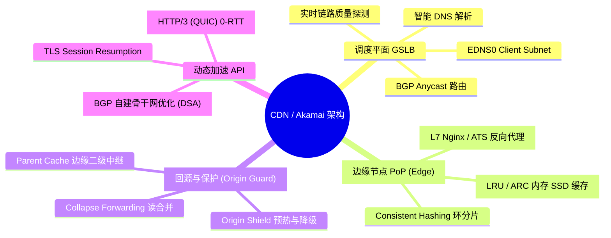
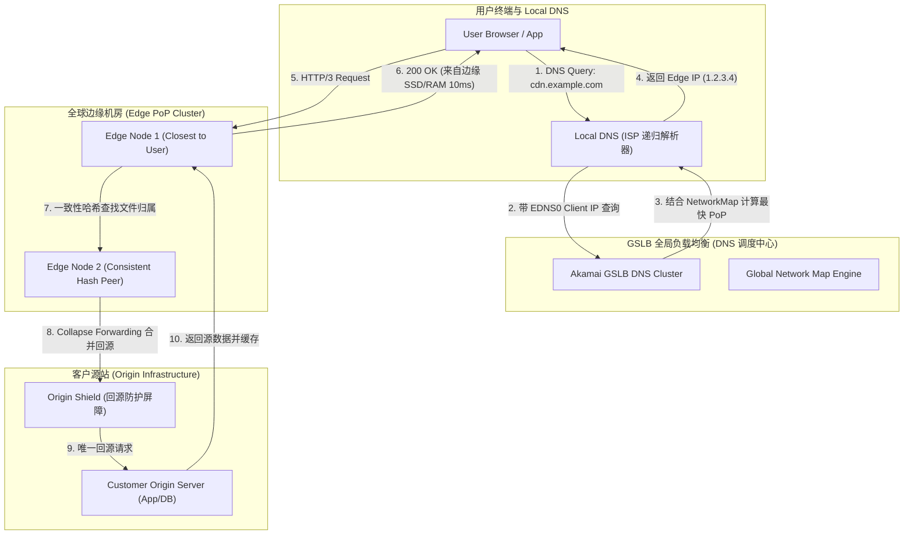
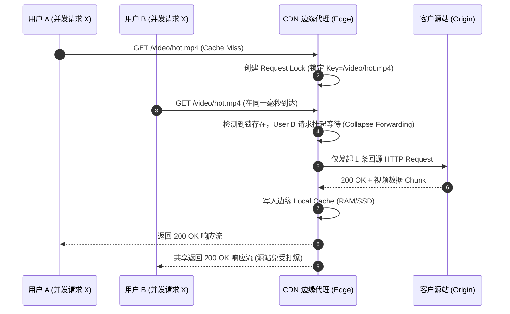
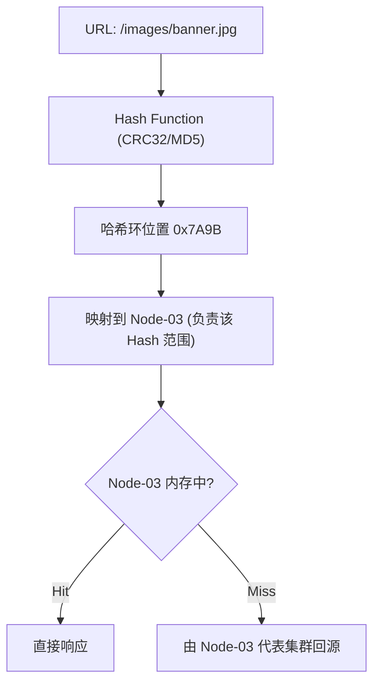

import CaseStudyHeader from '@site/src/components/CaseStudyHeader';
import DesignIntent from '@site/src/components/DesignIntent';
import EvolutionTimeline from '@site/src/components/EvolutionTimeline';
import CompareSlider from '@site/src/components/CompareSlider';
import TradeoffExplorer from '@site/src/components/TradeoffExplorer';
import GuidedExercise from '@site/src/components/GuidedExercise';
import QuizCard from '@site/src/components/QuizCard';
import GlossaryTerm from '@site/src/components/GlossaryTerm';
import ResearchNote from '@site/src/components/ResearchNote';

# CDN 与 Akamai 原理：智能 DNS 路由与全球边缘缓存架构

<CaseStudyHeader
  oneLiner="CDN (内容分发网络) 的本质是『空间换时间』与『边缘置换源站』。通过 GSLB 智能 DNS 调度、EDNS0 客户端子网识别、边缘节点一致性哈希缓存以及回源合并 (Collapse Forwarding)，CDN 将全球网络访问延迟从数百毫秒压缩至 10ms 级。"
  stats={[
    {label: 'Akamai 边缘节点', value: '4,000+ PoP 边缘机房 (遍布 130+ 国家)'},
    {label: '全球流量占比', value: '承载互联网 15% - 30% 流量'},
    {label: '边缘服务器数', value: '350,000+ 台'},
    {label: '核心调度机制', value: 'GSLB (Anycast / DNS CNAME 智能解析)'},
    {label: '回源优化', value: 'Collapse Forwarding (回源坍缩合并)'},
    {label: '传输加速', value: 'HTTP/3 (QUIC) 0-RTT 动态路由'}
  ]}
/>

:::info 对应课程概念
本案例主要映射 [Month 3 数据、缓存与队列]（多级缓存与穿透治理）、[Month 5 分布式核心组件]（一致性哈希与负载均衡）及 [N2. DNS 全球体系](./dns-global-system.mdx)。
:::

## 1. 设计初衷：打破物理光速瓶颈与源站崩塌噩梦

当互联网从文本走向富媒体（图片、4K 视频、软件更新），一个部署于美国东部的源站（Origin Server）在服务东京或伦敦用户时，光在光纤中传输的物理延迟（RTT）就高达 150-250ms。加之突发流量（如黑五促销、突发新闻）会将源站瞬间打垮。

<DesignIntent
  problem="如何在物理光速受限、公网 BGP 拥堵以及突发流量洪峰的现实下，让全球任意地点的用户都能在 10-30ms 内极速加载静态与动态内容？"
  users="全球数十亿网民，以及所有的互联网网站与 App 开发者。"
  devices="所有连接互联网的终端设备。"
  goals={[
    '极致的边缘命中率：静态资产 (JS/CSS/Image) 缓存命中率达到 95% - 99% 以上',
    '精确的就近接入：准确将用户解析至距离其物理位置与 ISP 线路最近的 PoP 节点',
    '源站保护与削峰：热点突发事件下，回源并发数收敛至 $O(1)$',
    '动态 API 加速：对于无法缓存的 API 请求，利用自建中继骨干网与 QUIC 0-RTT 压缩传输时间'
  ]}
  constraints={[
    'Local DNS (LDNS) 的 Recursive 缓存会模糊用户的真实 IP，导致定位偏差',
    '缓存节点内存/SSD 容量有限，不能简单地复制源站所有数据，需按一致性哈希分片',
    '缓存刷新（Purge）必须在数秒内在全球数十万台服务器上同步生效'
  ]}
  firstStep="构建 GSLB 智能 DNS 系统（支持 CNAME 别名重定向与 EDNS0 协议）；部署 Edge Reverse Proxy 代理网关集群。"
/>

## 2. 全景思维导图



## 3. 最新架构总览 (C4 风格)





## 4. 核心机制拆解

### 4a. 智能 DNS (GSLB) 与 EDNS0 调度

传统 DNS 只能看到 LDNS 的 IP，若用户配置了 `8.8.8.8`（Google Public DNS），GSLB 会误以为用户在美国而解析到美东节点。CDN 通过支持 <GlossaryTerm term="EDNS0 Client Subnet" definition="RFC 7871 协议，LDNS 在向 GSLB 发起 DNS 查询时，附带用户客户端 IP 的前缀（如 /24 掩码），使 DNS 服务器能根据用户的真实物理位置精准解析。">EDNS0 (ecs)</GlossaryTerm> 解决了此问题：


### 4b. 边缘 Consistency Hashing 缓存集群

在单个 PoP 机房内部有数十台边缘服务器。如果随机分配请求，会导致每台机器都存储相同的文件，极大降低缓存容量。CDN 采用 <GlossaryTerm term="一致性哈希" definition="Consistent Hashing，将 Cache Key (URL SHA256) 映射到 0~2^32-1 的哈希环上，确保当机房内某台 Cache 节点宕机或扩容时，仅有 1/N 的缓存失效。">一致性哈希</GlossaryTerm> 组织内部分片：



### 4c. 回源合并 (Collapse Forwarding)

当上万名用户同时刷新同一个突发新闻页面时（热点穿透），边缘节点利用 <GlossaryTerm term="Collapse Forwarding" definition="回源坍缩合并：当多个并发请求命中同一个缺失的 Cache Key 时，边缘节点仅允许第一个请求发往源站，其余请求在本地挂起等待，待第一个请求返回后共享结果。">Collapse Forwarding</GlossaryTerm> 机制，将上万次回源请求坍缩为 **1 次**，彻底保护源站。

## 5. 关键数据结构与算法

### 一致性哈希虚拟节点算法

为防止节点硬件差异导致哈希倾斜，每个物理节点分配 K 个虚拟节点（Virtual Nodes）：

```text
VirtualNodeID_{i, j} = Hash(NodeIP_i + "#VNODE-" + j)
```

通过在哈希环（如 SkipList 或 Red-Black Tree）中二分查找 `Upper_Bound(Hash(URL))`，实现 `O(log N)` 时间复杂度的节点检索。

## 6. 架构演进史

<EvolutionTimeline
  events={[
    {
      year: '1998',
      title: 'Akamai 成立与 1.0 静态分发',
      why: '麻省理工学院 (MIT) 团队为了解决 Web 拥堵问题 (World Wide Wait)。',
      change: '提出一致性哈希算法与智能 DNS 重定向，发明了 CDN 行业。'
    },
    {
      year: '2010',
      title: '动态 API 加速 (DSA) 与 HTTPS 普及',
      why: '电商与社交 API 兴起，不可缓存的动态 POST/GET 请求增多。',
      change: '自建私有 BGP 骨干网，利用 TCP 预连接与路由重定向加速 API 传输。'
    },
    {
      year: '2020',
      title: '边缘计算 Worker 与 HTTP/3 (QUIC) 时代',
      why: '无服务器架构 (Serverless) 流行，用户希望在 CDN 边缘运行 JavaScript/WASM。',
      change: '部署 V8 Isolate 边缘运行环境，全面升级 HTTP/3 0-RTT 握手。'
    }
  ]}
/>

### 架构演进对比

<CompareSlider
  before={
    <div style={{ padding: '20px', background: '#ffebee', borderRadius: '8px', height: '100%' }}>
      <h3>早期单级 DNS 轮询 + 简单 HTTP 代理</h3>
      <p>无法定位真实用户 IP，缓存命中率低，热点文件导致源站瞬间被击穿。</p>
    </div>
  }
  after={
    <div style={{ padding: '20px', background: '#e8f5e9', borderRadius: '8px', height: '100%' }}>
      <h3>GSLB EDNS0 + 一致性哈希环 + Collapse Forwarding</h3>
      <p>精确 10ms 边缘接入，机房内内存高效利用，千万人并发抢购源站仅收 1 次请求。</p>
    </div>
  }
/>

## 7. 设计模式与课程映射

1. **代理模式 (Proxy Pattern)**：边缘节点充当 Reverse Proxy，对客户端隐蔽源站物理结构。
2. **享元模式 (Flyweight Pattern)**：Collapse Forwarding 让海量并发请求共享单个回源 Response 对象。
3. **映射 [Month 3 数据、缓存与队列]**：缓存穿透、缓存击穿、缓存雪崩的终极工程解法。

## 8. 架构取舍与权衡

<TradeoffExplorer
  title="CDN 边缘架构核心取舍"
  dimensions={['延迟与体验', '数据一致性', '带宽与算力成本', '系统复杂度']}
  options={[
    {
      name: '边缘强缓存 + 长 TTL + 异步 Purge (CDN 方案)',
      scores: [5, 4, 5, 4],
      note: '延迟极低，源站负载降至 1%；但内容更新存在全球 Purge 传播延迟（约 1-5 秒）。',
      whenToUse: '静态资源、富媒体文件、高并发读多写少的 Web / App 应用。'
    },
    {
      name: '直连源站 + 彻底无边缘缓存',
      scores: [2, 5, 2, 5],
      note: '保证绝对的实时强一致性；但全球延迟高，且源站极易崩溃。',
      whenToUse: '金融核心交易、实时强一致性库存扣减（非查询）接口。'
    }
  ]}
/>

## 9. 常见误解与澄清

:::warning 常见误解澄清
- **误解一：CDN 只能加速静态图片和 JS 文件，对动态 API 毫无作用。**
  *事实*：现代 CDN 均支持**动态加速 (Dynamic Site Accelerator)**。虽然动态 API 响应不能缓存，但 CDN 节点间拥有自建的高速专线、已预建好的长连接池以及 HTTP/3 0-RTT 优化，比公共互联网 BGP 选路快 30%-50%。
- **误解二：只要配置了 CDN，源站就绝对安全不会被冲垮。**
  *事实*：如果未配置 `Cache-Control` 或 Key 带有随机 URL 参数（如 `/api?rand=123`），会导致 Collapse Forwarding 失效，请求将全部穿透至源站（缓存击穿）。
:::

## 10. 如果是你来设计 (Guided Exercise)

<GuidedExercise
  title="设计 Collapse Forwarding 读合并中间件"
  goal="在 Node.js 或 Go 中使用 Singleflight 模式实现简单的回源合并控制。"
  steps={[
    '步骤 1: 创建全局 Map key -> *Group，包含 sync.WaitGroup 与 response 结果。',
    '步骤 2: 当请求到达时，锁定 Map。若 key 已存在，释放 Map 锁并 waitGroup.Wait()。',
    '步骤 3: 若 key 不存在，在 Map 中占位并发起实际回源 HTTP 请求。',
    '步骤 4: 回源成功后，将结果填入 Group，调用 waitGroup.Done() 并从 Map 中删除 key。',
    '步骤 5: 所有挂起的并发请求被唤醒，直接读取共享的 response 返回给客户端。'
  ]}
  hints={[
    'Go 语言标准扩展库 `golang.org/x/sync/singleflight` 正是该模式的经典实现。'
  ]}
  checks={[
    '1000 个并发 Goroutine 同时请求同一个缺失的 Key，实际回源函数是否只被调用了 1 次？',
    '当回源函数发生 Exception 报错时，挂起的其他请求能否正确捕获 Error 而不永久阻塞？'
  ]}
/>

## 11. 自测题与来源清单

<QuizCard
  questions={[
    {
      q: '为什么 CDN 的 GSLB 智能 DNS 需要支持 EDNS0 (Client Subnet) 协议？',
      options: [
        'A. 为了防止 DNS 被 Hacker 篡改',
        'B. 因为传统的 DNS 查询只携带 Local DNS (ISP) 的 IP，使用公共 DNS (如 8.8.8.8) 会导致用户被错误调度到远方节点',
        'C. 为了将 IPv4 地址自动转换为 IPv6',
        'D. 为了加密 DNS 报文'
      ],
      answer: 1,
      explain: 'EDNS0 附带了客户端真实 IP 的前缀，使 GSLB 能精准计算用户与边缘机房的物理距离。'
    },
    {
      q: 'CDN 边缘机房内部多台服务器之间为什么常用『一致性哈希 (Consistent Hashing)』来管理缓存？',
      options: [
        'A. 保证所有服务器存储完全一样的内容以防止单点故障',
        'B. 将文件按 URL 散列分片，防止每台机器重复存储相同文件，同时在节点增减时仅影响 1/N 缓存',
        'C. 为了自动压缩图片尺寸',
        'D. 提升 TLS 握手速度'
      ],
      answer: 1,
      explain: '一致性哈希极大地提高了 PoP 机房整体的有效内存/SSD 利用率，避免了多节点重复缓存造成的浪费。'
    },
    {
      q: '当热点新闻突发导致百万用户同时请求同一个缺失的 URL 时，CDN 靠什么机制防止源站瞬间崩溃？',
      options: [
        'A. Collapse Forwarding (回源坍缩合并)，将所有并发请求挂起，仅发 1 次回源请求后共享结果',
        'B. 直接向所有用户返回 404 错误',
        'C. 强制限制用户打字速度',
        'D. 自动关闭 CDN 所有节点'
      ],
      answer: 0,
      explain: 'Collapse Forwarding 能将并发读穿透收敛为单次写预热，是保护源站的关键关卡。'
    }
  ]}
/>

## 来源

- [The Akamai Network: A Platform for High-Performance Internet Applications (Nygren, Sitaraman & Sun, ACM SIGOPS OSR 2010)](https://dl.acm.org/doi/10.1145/1842733.1842736) —— CDN 分发平台的经典论文。
- [Akamai 论文全文 PDF（Duke CS 镜像）](https://courses.cs.duke.edu/spring23/compsci512/papers/akamai-cdn.pdf) —— 边缘缓存、回源与任播的一手资料。

<ResearchNote
  title="Akamai 经典论文与技术白皮书"
  source="Karger et al. (1997), Consistent Hashing and Random Trees: Distributed Caching Protocols for Relieving Hot Spots on the World Wide Web"
  href="https://dl.acm.org/doi/10.1145/258533.258660"
  insight="这篇创世论文提出了 Consistency Hashing 算法，开创了现代 CDN 行业与分布式哈希表 (DHT) 的先河。"
  application="架构借鉴：如何设计超大规模分布式系统的负载均衡与数据路由分片。"
/>