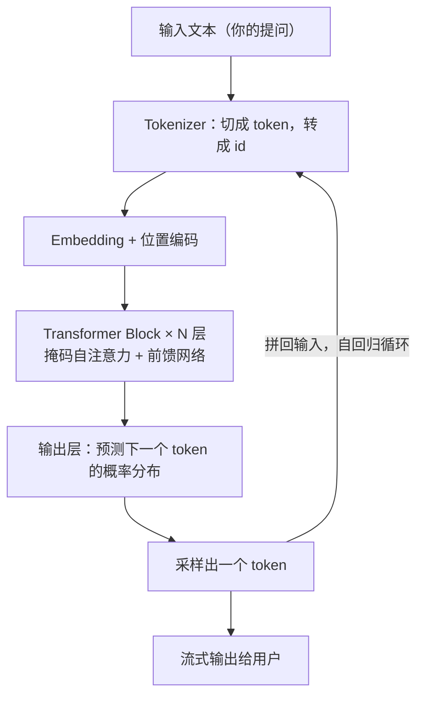
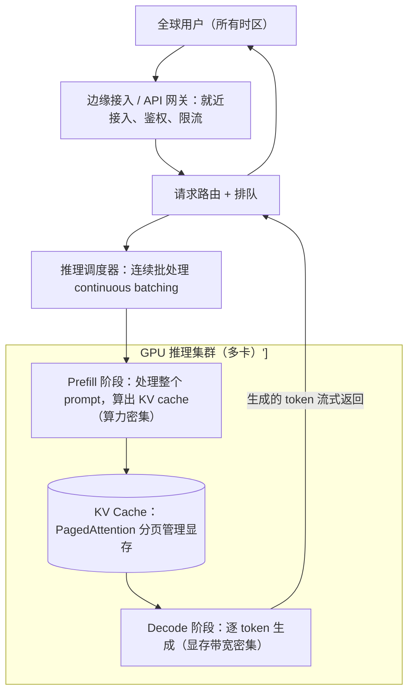
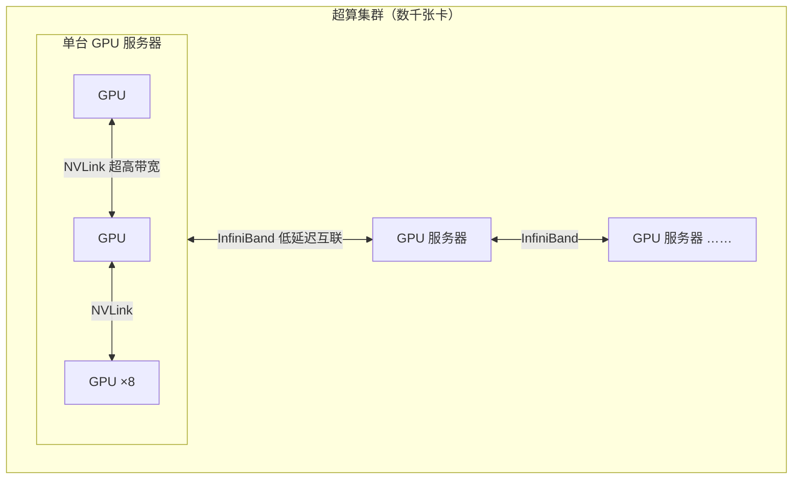

import CaseStudyHeader from '@site/src/components/CaseStudyHeader';
import DesignIntent from '@site/src/components/DesignIntent';
import ArchitectureEvolution from '@site/src/components/ArchitectureEvolution';
import TradeoffExplorer from '@site/src/components/TradeoffExplorer';
import GlossaryTerm from '@site/src/components/GlossaryTerm';
import ResearchNote from '@site/src/components/ResearchNote';
import QuizCard from '@site/src/components/QuizCard';

# ChatGPT：一个模型如何同时回答全世界

<CaseStudyHeader
  oneLiner="ChatGPT 的架构其实是两层叠在一起：底下是『模型架构』（一个巨大的 Transformer 怎么生成文字），上面是『服务架构』（怎么让这个又大又慢又贵的模型，同时为全球上亿人低延迟地回答）。看懂这两层，才看懂大模型应用。"
  stats={[
    {label: '上线时间', value: '2022 年 11 月'},
    {label: '2 个月用户', value: '约 1 亿（史上最快）'},
    {label: 'GPT-3 参数', value: '1750 亿'},
    {label: 'GPT-4 参数（报道未证实）', value: '约 1 万亿 / MoE'},
    {label: '训练超算（2020）', value: '1 万张 V100 + InfiniBand'},
    {label: '推理加速卡', value: 'NVIDIA H100 / NVLink'}
  ]}
/>

:::info 对应课程概念
本案例横跨整门 AI 课：[Month 7 LLM 基础]、[Month 8 RAG]、[Month 11 生产级 AI 平台]。它也强烈回扣基础课——[L1 的延迟数量级与扩展](../foundations/programming-systems-primer)、[L4 的失败与排队](../foundations/error-handling)，以及一个惊喜：管理显存的 PagedAttention，灵感正是来自**操作系统的虚拟内存分页**。
:::

## 1. 设计初衷：从"预测下一个词"到"回答全世界"

大模型不是一开始就想做聊天机器人的。它的源头是一个朴素的研究问题：**能不能让机器学会预测一段文字的下一个词？** 当这个能力被放大到足够规模，"理解语言、按指令做任意语言任务"竟然作为副产品涌现了出来。ChatGPT 则是把这个能力包装成一个所有人都能用的对话产品。

<DesignIntent
  problem="让机器理解并生成自然语言，最终做到：能对话、能按人类指令完成几乎任意语言任务，并且让全球普通人都用得上、用得起、用得快。"
  users="最初是 NLP 研究者；ChatGPT 之后变成全球普通人——开发者、学生、白领、创作者，遍布所有时区。"
  devices="用户侧只是一个瘦客户端（浏览器/App），真正的重量全在云端的 GPU 超算集群。终端几乎不参与计算，只负责把流式 token 显示出来。"
  goals={[
    '回答质量高、且对齐人类意图（不能只是流利地胡说）',
    '低延迟、流式响应：用户希望"边想边说"地看到字蹦出来',
    '全球高并发：同一时刻上亿请求都要被及时服务',
    '算力成本可控：GPU 极贵，吞吐就是生命线'
  ]}
  constraints={[
    '模型巨大，单张 GPU 装不下，必须跨多卡切分',
    'GPU 极其昂贵且稀缺，利用率每提高一点都是巨额成本',
    '生成是逐 token 的、长度不可预测，负载很难预估',
    '既要对齐与安全，又要快——质量、延迟、成本三角永远在拉扯'
  ]}
  firstStep="站在 2017 年的 Transformer 上：先用海量文本做『预测下一个 token』的预训练，得到一个博学但不听话的大模型；再用指令微调 + RLHF 把它调成『听话的助手』；最后用一整套推理服务系统（批处理、显存管理、并行、流式）把它端到全球用户面前。"
/>

## 2. 关键洞察：这里有两个架构，不是一个

初学者常把"大模型架构"当成一件事。其实要分清两层，它们解决完全不同的问题：

| | 模型架构（Model Architecture） | 服务架构（Serving Architecture） |
|---|---|---|
| 解决什么 | 一个模型**怎么把输入变成下一个词** | 怎么让这个模型**同时、快速、便宜地服务全球** |
| 关键词 | Transformer、注意力、token、自回归 | KV cache、连续批处理、并行、GPU 集群 |
| 像什么 | 一台极其聪明但很慢的"翻译机" | 一座要服务全世界的"超大餐厅后厨" |

下面分别拆。

### 2a. 模型架构：一个逐字生成的 Transformer

ChatGPT 背后是 <GlossaryTerm term="Decoder-only Transformer" definition="只用 Transformer 解码器一半的结构，配合掩码自注意力（每个 token 只能看到它前面的 token），专门用于自回归地预测下一个 token。GPT 系列都是这种结构。">解码器结构的 Transformer</GlossaryTerm>。它的工作方式是<GlossaryTerm term="Autoregressive" definition="自回归：一次只生成一个 token，把它拼回输入，再生成下一个，如此循环。这就是为什么 ChatGPT 是一个字一个字蹦出来的。">自回归</GlossaryTerm>的——**一次只吐一个字，再把这个字接回去，预测下一个**：

几个关键概念：<GlossaryTerm term="Token" definition="模型处理文本的最小单位，介于字和词之间。一句话会被切成若干 token，模型实际预测的是下一个 token。计费、上下文长度都是按 token 算的。">Token</GlossaryTerm>是模型处理的最小单位；<GlossaryTerm term="Self-Attention" definition="自注意力：每个 token 在生成时，会『看』上下文里所有相关 token 并加权聚合信息。这是 Transformer 理解长距离依赖的核心机制。">自注意力</GlossaryTerm>让模型在生成每个词时参考全部上下文。

而把一个"博学但不听话"的预训练模型，变成"听话的助手"，靠的是 <GlossaryTerm term="RLHF" definition="基于人类反馈的强化学习。先用人工示范做监督微调（SFT），再训练一个奖励模型来打分，最后用强化学习让模型生成更符合人类偏好的回答。是 ChatGPT 听话的关键。">RLHF</GlossaryTerm>——这是 ChatGPT 区别于"只会续写"的纯语言模型的关键一步。

<ResearchNote
  title="一切的地基：Transformer 与注意力机制"
  source="Vaswani et al. (2017), Attention Is All You Need"
  href="https://arxiv.org/abs/1706.03762"
  insight="这篇论文提出了完全基于注意力机制的 Transformer 架构，抛弃了循环和卷积，使训练可以大规模并行。它是 GPT、BERT、几乎所有现代大模型的共同祖先。"
  application="架构启示：一个能『大规模并行训练』的结构，才可能被堆到千亿参数。Transformer 的可扩展性，是后来『规模即能力』（scaling）路线得以成立的前提。"
/>

<ResearchNote
  title="对齐比单纯变大更重要：RLHF 的威力"
  source="Ouyang et al. (2022), Training language models to follow instructions with human feedback (InstructGPT)"
  href="https://arxiv.org/abs/2203.02155"
  insight="一个 13 亿参数的 InstructGPT，在人类评测中竟比 1750 亿参数的 GPT-3 更受欢迎。原因不是更大，而是用 RLHF 让它更『听话、对齐人类意图』。ChatGPT 正是这套方法的产品化。"
  application="架构启示：质量不只来自规模，还来自对齐。一个 AI 系统的『最后一公里』（让输出真正有用、安全）往往和『把模型做大』同等重要——这是 Month 11 治理与评测的伏笔。"
/>

### 2b. 服务架构：一次请求如何被全球后厨处理

模型再聪明，也只是一台又大又慢又贵的"机器"。真正的工程难题是：**怎么让它同时为上亿人服务还不卡？** 一次请求的完整链路大致是：

注意两个阶段的本质差异：<GlossaryTerm term="Prefill / Decode" definition="推理分两步：Prefill 一次性处理整个输入 prompt、算出 KV cache，是算力密集型；Decode 之后逐个 token 生成，是显存带宽密集型。两者特性不同，常被分开优化甚至分开部署（disaggregation）。">Prefill 和 Decode</GlossaryTerm> 一个吃算力、一个吃显存带宽——这个区别是现代推理优化的核心抓手。

## 3. 关键设计模式 / 设计思维

### (a) KV Cache：空间换时间

自回归每生成一个 token，理论上都要重新计算前面所有 token 的注意力。<GlossaryTerm term="KV Cache" definition="把已经算过的 token 的 Key/Value 向量缓存起来，生成下一个 token 时直接复用，避免重复计算。代价是显存占用随序列长度线性增长——这是大模型推理最核心的资源约束。">KV Cache</GlossaryTerm> 把这些中间结果缓存下来，避免重复计算。代价是：**显存占用随对话长度线性增长**，于是显存成了推理的头号瓶颈（呼应 [L1：缓存是空间换时间的经典权衡](../foundations/programming-systems-primer)）。

### (b) 连续批处理：把 GPU 榨干

生成长度不可预测，传统"凑满一批再一起算"会让先完成的请求干等。<GlossaryTerm term="Continuous Batching" definition="连续批处理：在每一步生成迭代后动态调整批次——完成的请求立即移出、新到的请求立即加入，而不是等整批结束。极大提升 GPU 利用率和吞吐。">连续批处理</GlossaryTerm> 在每一步迭代后动态进出请求，让 GPU 永远不闲着。

<ResearchNote
  title="连续批处理：吞吐量提升一个数量级"
  source="Anyscale: How continuous batching enables 23x throughput in LLM inference"
  href="https://www.anyscale.com/blog/continuous-batching-llm-inference"
  insight="相比静态批处理，连续批处理（源自 Orca 等工作）通过迭代级调度，可带来高达 23 倍的吞吐提升并显著降低 p50 延迟——因为它消灭了『先完成的请求干等整批』的浪费。"
  application="架构启示：当任务时长高度不可预测时，调度的粒度要细到『每一步』而不是『每一批』。这和 [L4 的尾延迟/排队思维](../foundations/error-handling) 一脉相承。"
/>

### (c) PagedAttention：把操作系统的智慧搬进显存

KV cache 大小不可预测，会造成严重的显存碎片。vLLM 的 <GlossaryTerm term="PagedAttention" definition="借鉴操作系统虚拟内存『分页』思想管理 KV cache：把缓存切成固定大小的块，按需非连续分配，用页表映射。大幅减少显存碎片，提升吞吐。">PagedAttention</GlossaryTerm> 直接把**操作系统虚拟内存的分页机制**搬了过来——这是"经典系统智慧跨域复用"的绝佳案例。

<ResearchNote
  title="用虚拟内存的思想管理大模型显存"
  source="Kwon et al. (2023), Efficient Memory Management for LLM Serving with PagedAttention (vLLM)"
  href="https://arxiv.org/abs/2309.06180"
  insight="PagedAttention 把 KV cache 切成固定大小的页、非连续存放、用页表映射（完全类比 OS 虚拟内存），几乎消灭了显存碎片，使 vLLM 相比此前系统获得 2–4 倍吞吐提升。"
  application="架构启示：操作系统几十年沉淀的思想（分页、写时复制）在全新领域依然锋利。学透经典系统，你会在意想不到的地方复用它——这正是本案例库的意义。"
/>

### (d) 模型并行：一个模型住在很多张卡上

千亿参数模型单卡放不下，于是要切分：<GlossaryTerm term="Tensor Parallelism" definition="张量并行：把单层内部的大矩阵运算切开，分到多张 GPU 上同时算，再合并。用于让一个大到单卡放不下的层也能运行。">张量并行</GlossaryTerm>把单层切开分到多卡，<GlossaryTerm term="Pipeline Parallelism" definition="流水线并行：把模型的不同层分到不同 GPU，像流水线一样接力处理，提升整体吞吐。">流水线并行</GlossaryTerm>把不同层分到不同卡接力。若是 <GlossaryTerm term="Mixture of Experts (MoE)" definition="混合专家：模型有很多『专家』子网络，每个 token 只激活其中少数几个，从而在总参数极大的同时，单次计算量可控。GPT-4 被报道（未证实）采用了 MoE。">MoE</GlossaryTerm> 还有专家并行。卡间怎么连，就决定了能不能切得动——这把我们引向算力与网络。

### (e) 流式输出：用感知延迟换体验

token 一生成就立即推给用户（streaming），让用户"边想边说"地看到回答，把**感知延迟**降到最低——即使总耗时不变，体验天差地别。

## 4. 算力与网络拓扑：模型并行的物理基础

为什么"卡间怎么连"如此关键？因为模型并行意味着 GPU 之间要**极其频繁地交换中间结果**。回看 [L1 的延迟表](../foundations/programming-systems-primer)：跨网络通信比本机慢几个数量级。所以大模型集群用两级超高速互联：

- <GlossaryTerm term="NVLink" definition="NVIDIA 的 GPU 间直连高速总线，用于单台服务器内多张 GPU（如 8 卡）之间的超高带宽通信。">NVLink</GlossaryTerm>：服务器**内部**（通常 8 张 GPU）之间直连。
- <GlossaryTerm term="InfiniBand" definition="一种低延迟、高带宽的网络互联技术，用于把成千上万张 GPU 跨服务器连成一个超算集群。OpenAI 选择 Azure 的关键原因之一就是其 InfiniBand 网络。">InfiniBand</GlossaryTerm>：把成千上万张 GPU **跨服务器**连成一个超算。

<ResearchNote
  title="运行 ChatGPT 的物理基础：Azure 上的 GPU 超算"
  source="Microsoft / NVIDIA: Azure AI 基础设施与 ChatGPT"
  href="https://azure.microsoft.com/en-us/blog/azure-previews-powerful-and-scalable-virtual-machine-series-to-accelerate-generative-ai/"
  insight="OpenAI 运行在微软 Azure 上。2020 年为 OpenAI 建的训练超算包含约 1 万张 NVIDIA V100、用 InfiniBand 互联，是当时全球第五大、公有云史上最大的超算。新一代用 H100：单机 8 卡 NVLink 互联，再用 NVIDIA Quantum-2 InfiniBand 扩展到数千卡。微软称 InfiniBand 的性价比是 OpenAI 选择 Azure 的关键原因之一。"
  application="架构启示：到了大模型这个尺度，『网络拓扑』不再是细节，而是架构的脊梁。卡间互联的带宽和延迟，直接决定了你能训练/部署多大的模型——硬件与软件架构在这里彻底融为一体。"
/>

## 5. 架构演进：从 2017 的论文到今天的全球服务

<ArchitectureEvolution
  eras={[
    {
      year: '2017',
      title: 'Transformer 奠基',
      intent: '此前的 RNN 难以并行、难以建模长距离依赖，限制了模型规模。',
      change: 'Google 提出完全基于注意力的 Transformer 架构，可大规模并行训练。',
      why: '只有能大规模并行的结构，才可能被堆到千亿参数——这为后面的『规模即能力』铺平了路。',
      layers: [
        {name: '模型结构', comps: [{label: 'Transformer（自注意力）', isNew: true}]},
        {name: '训练', comps: [{label: '大规模并行训练', isNew: true}]}
      ]
    },
    {
      year: '2018–2020',
      title: 'GPT-1/2/3：把规模堆上去',
      intent: '验证一个假设：只要模型和数据足够大，语言能力会随规模持续增强。',
      change: '解码器结构 + 预测下一个 token 的预训练，参数从 1.17 亿（GPT-1）→ 15 亿（GPT-2）→ 1750 亿（GPT-3）。',
      why: '规模法则被验证：更大的模型 + 更多数据 + 更多算力，能力持续上升，且涌现出 few-shot 等新能力。',
      layers: [
        {name: '模型结构', comps: [{label: 'Decoder-only Transformer', isNew: true}, {label: '自回归预训练', isNew: true}]},
        {name: '规模', comps: [{label: '1.17亿→15亿→1750亿参数', isNew: true}]},
        {name: '算力', comps: [{label: 'GPU 集群预训练', isNew: true}]}
      ]
    },
    {
      year: '2022.01',
      title: 'InstructGPT：学会听话',
      intent: '大模型博学但不听话——会续写、会跑题，不会『按指令好好回答』。',
      change: '引入 RLHF：监督微调（SFT）+ 奖励模型 + 强化学习，让输出对齐人类偏好。',
      why: '一个 13 亿参数的对齐模型竟优于 1750 亿的 GPT-3：对齐比单纯变大更能带来『有用』。',
      layers: [
        {name: '模型结构', comps: [{label: 'Decoder-only Transformer'}]},
        {name: '对齐', comps: [{label: 'SFT 监督微调', isNew: true}, {label: 'RLHF 人类反馈强化学习', isNew: true}]}
      ]
    },
    {
      year: '2022.11',
      title: 'ChatGPT 上线',
      intent: '把对齐后的模型，包装成所有人都能用的对话产品，并扛住爆炸式流量。',
      change: '基于 GPT-3.5 + RLHF 的对话界面上线，2 个月达约 1 亿用户；后端开始面对真正的全球高并发推理压力。',
      why: '产品化让能力触达普通人，也第一次把『大模型推理服务』推到极限规模——服务架构从此和模型架构同等重要。',
      layers: [
        {name: '产品', comps: [{label: '对话式界面', isNew: true}, {label: '流式输出', isNew: true}]},
        {name: '模型', comps: [{label: 'GPT-3.5 + RLHF', isNew: true}]},
        {name: '服务', comps: [{label: 'GPU 推理集群', isNew: true}, {label: '请求排队/路由', isNew: true}]}
      ]
    },
    {
      year: '2023',
      title: 'GPT-4 + 推理服务工业化',
      intent: '更强、多模态的模型更大更贵；同时全球流量要求把推理成本和延迟压到极致。',
      change: 'GPT-4（多模态；据报道为约 1 万亿参数的 MoE，未证实）。服务侧普及连续批处理、PagedAttention、张量/流水线并行、prefill/decode 优化。',
      why: '模型大到单卡放不下→必须模型并行；GPU 太贵→必须靠批处理和显存管理把吞吐榨满。质量、延迟、成本的三角拉扯进入工业化阶段。',
      layers: [
        {name: '模型', comps: [{label: 'GPT-4 多模态', isNew: true}, {label: 'MoE 稀疏激活（报道）', isNew: true}]},
        {name: '服务优化', comps: [{label: '连续批处理', isNew: true}, {label: 'PagedAttention', isNew: true}, {label: 'prefill/decode 分离', isNew: true}]},
        {name: '并行/算力', comps: [{label: '张量并行', isNew: true}, {label: '流水线并行', isNew: true}, {label: 'H100 + InfiniBand', isNew: true}]}
      ]
    },
    {
      year: '2024+',
      title: '多模态实时 + 推理模型 + 降本',
      intent: '要更自然的实时多模态交互，要更强的推理能力，还要让模型更便宜更快。',
      change: 'GPT-4o 等实时多模态（语音/图像/文本统一）；o 系列『推理模型』用测试时计算（多想一会儿）换更强推理；同时用更小模型、蒸馏、量化降本。',
      why: '能力前沿（推理、多模态）与效率前沿（成本、延迟）两条线并进——这正是当下大模型架构的主战场。',
      layers: [
        {name: '能力', comps: [{label: '实时多模态（GPT-4o）', isNew: true}, {label: '推理模型 o 系列', isNew: true}, {label: '测试时计算', isNew: true}]},
        {name: '效率', comps: [{label: '蒸馏 / 小模型', isNew: true}, {label: '量化', isNew: true}]},
        {name: '服务', comps: [{label: '连续批处理 + 分页显存（沿用）'}]}
      ]
    }
  ]}
/>

## 6. 权衡：怎么在质量、延迟、成本之间取舍

大模型推理的一切优化，几乎都在这三者间做交易。点选不同手段看它的侧重：

<TradeoffExplorer
  title="降低大模型推理成本/延迟的主要手段"
  dimensions={['吞吐提升', '延迟改善', '质量保持', '显存节省', '实现复杂度']}
  options={[
    {
      name: 'KV Cache',
      scores: [4, 5, 5, 1, 4],
      note: '缓存已算过的 K/V，避免重复计算，大幅降低逐 token 延迟。代价是显存随长度线性增长。',
      whenToUse: '几乎所有自回归推理的默认标配——但要配合显存管理（见下）。'
    },
    {
      name: '连续批处理',
      scores: [5, 4, 5, 2, 3],
      note: '迭代级动态进出请求，把 GPU 利用率榨满，吞吐可提升一个数量级，且不牺牲质量。',
      whenToUse: '面对大量并发、长度不一的请求时的必选项（生产级推理的核心）。'
    },
    {
      name: 'PagedAttention 分页显存',
      scores: [4, 3, 5, 5, 2],
      note: '用 OS 分页思想管理 KV cache，几乎消灭显存碎片，让同一张卡能塞下更多并发序列。',
      whenToUse: '显存是瓶颈、要提高并发数时；现代推理引擎（vLLM）已内建。'
    },
    {
      name: '量化 / 蒸馏（小模型）',
      scores: [4, 4, 2, 5, 3],
      note: '用更低精度或更小模型换速度和成本，省显存、提速明显，但可能损失一点质量。',
      whenToUse: '对成本/延迟极敏感、且能接受质量略降的场景（如端侧、海量低价调用）。'
    }
  ]}
/>

**核心心智模型**：大模型服务的本质，是在一堆又贵又稀缺的 GPU 上，把**吞吐**（喂饱卡）和**延迟**（用户等不及）同时最大化，而显存是横在中间的硬约束。上面这些手段，全是围绕这一句话展开的。

## 7. 架构师深问（给自己 30–60 分钟）

- 为什么说 prefill 是"算力密集"、decode 是"显存带宽密集"？如果让你设计集群，你会把这两个阶段放在同一批 GPU 上，还是分开部署（disaggregation）？各有什么取舍？
- 一个用户的对话越来越长，KV cache 越来越大，最终撑爆显存。你有哪些办法应对？（提示：分页、驱逐、卸载、摘要压缩……）
- 全球用户分布在所有时区，你怎么做就近接入和容量调度，既降低网络延迟又不让某些区域的 GPU 闲置？（回看 [L1 延迟表](../foundations/programming-systems-primer) 与 [WhatsApp 的多机房](./whatsapp.mdx)。）
- 对比 [WhatsApp](./whatsapp.mdx)：WhatsApp 的瓶颈是"海量长连接"，ChatGPT 的瓶颈是"昂贵的 GPU 算力与显存"。同样是全球高并发，为什么它们的架构长得完全不同？

## 知识自测

<QuizCard
  questions={[
    {
      q: '在 Transformer 自回归解码（Decode）阶段，引入 KV Cache（键值缓存）的最根本目的是解决什么问题？',
      options: [
        'A. 大幅度降低模型在 Prefill（首字生成）阶段的延迟',
        'B. 避免每次生成新 Token 时，对历史已生成的 Token 进行重复的自注意力（Query-Key/Value）计算，将 O(N^2) 的计算量降低到 O(N)',
        'C. 压缩显存占用，让单个 GPU 可以承载多十倍的并发用户请求',
        'D. 提升模型生成的文本质量，使其更符合人类语言逻辑'
      ],
      answer: 1,
      explain: '在自回归生成过程中，下一个 Token 的生成只依赖于之前的 Token。如果没有 KV Cache，生成第 N 个 Token 时就需要对前 N-1 个 Token 进行注意力机制的矩阵乘法，造成严重的重复计算。引入 KV Cache 后，将已算过的 Key 和 Value 缓存下来，每次只需计算新 Token 的 KV 并与缓存拼接，极大提升了解码吞吐并降低了延迟，代价是增加了显存的占用。'
    },
    {
      q: '在 LLM 推理优化中，PageAttention（如 vLLM 中实现）的核心设计灵感来源于哪项经典的计算机操作系统（OS）技术？',
      options: [
        'A. 虚拟文件系统 (VFS)',
        'B. 虚拟内存的分页与页表映射机制 (Virtual Memory Paging)',
        'C. 进程调度器（如 CFS/EEVDF）',
        'D. 写时复制 (Copy-on-Write) 与匿名内存映射'
      ],
      answer: 1,
      explain: '传统的 KV Cache 在内存分配上需要为每个请求预先分配最大可能长度的连续物理显存，这导致了严重的碎片化（内碎片和外碎片），浪费高达 60%-80% 的显存。vLLM 借鉴了操作系统中的虚拟内存分页思想，将 KV Cache 拆分为固定大小的物理块，通过类似操作系统的页表映射关系将逻辑块映射到物理块上，从而实现非连续、动态的显存分配，几乎消除了所有显存碎片，成倍提升了并发服务上限。'
    },
    {
      q: '为了彻底打满 GPU 算力并提升高并发吞吐，ChatGPT 等推理服务普遍引入了“连续批处理（Continuous Batching）”技术。它与传统批处理（Traditional Batching）的主要区别是？',
      options: [
        'A. 传统批处理只在 CPU 上运行，连续批处理全部下沉到 GPU tensor core',
        'B. 传统批处理要求同一批次中的所有请求必须完全结束才能返回；而连续批处理在 Iteration（迭代）粒度上动态运行，只要有一个请求生成完毕（遇到 EOS）即可立刻退出，并随时插入新的请求进行填充',
        'C. 连续批处理要求用户输入的 Prompt 长度必须完全一致，否则无法运行',
        'D. 连续批处理是通过增加温度参数（Temperature）来实现高并发吞吐的'
      ],
      answer: 1,
      explain: '由于不同用户的提问和模型生成的回答长度千差万别，传统的 Batching 必须等待本批次里最长的那个请求结束，这会导致短请求被长请求拖死，GPU 产生大量的无用填充 padding。Continuous Batching 在每次 Token 解码的迭代间隙进行批次重新组装（Iteration-level scheduling），允许已完成的请求提前退出，新请求随时加入，极大压榨了 GPU 吞吐量。'
    }
  ]}
/>

## 来源

- [Vaswani et al. (2017), Attention Is All You Need](https://arxiv.org/abs/1706.03762)
- [Ouyang et al. (2022), Training language models to follow instructions (InstructGPT)](https://arxiv.org/abs/2203.02155)
- [Brown et al. (2020), Language Models are Few-Shot Learners (GPT-3)](https://arxiv.org/abs/2005.14165)
- [Kwon et al. (2023), Efficient Memory Management for LLM Serving with PagedAttention (vLLM)](https://arxiv.org/abs/2309.06180)
- [Anyscale: How continuous batching enables 23x throughput in LLM inference](https://www.anyscale.com/blog/continuous-batching-llm-inference)
- [Microsoft Azure: VM series to accelerate generative AI (H100, InfiniBand)](https://azure.microsoft.com/en-us/blog/azure-previews-powerful-and-scalable-virtual-machine-series-to-accelerate-generative-ai/)
- [NVIDIA Technical Blog: What Runs ChatGPT?](https://developer.nvidia.com/blog/new-video-what-runs-chatgpt/)