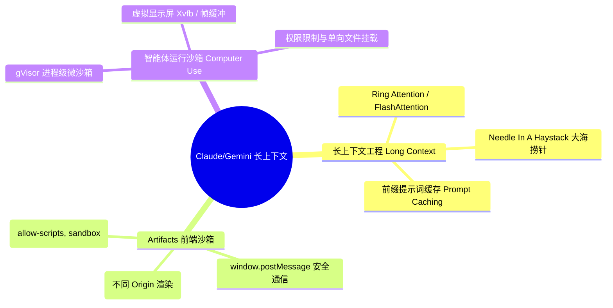
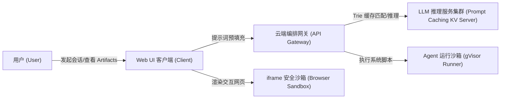
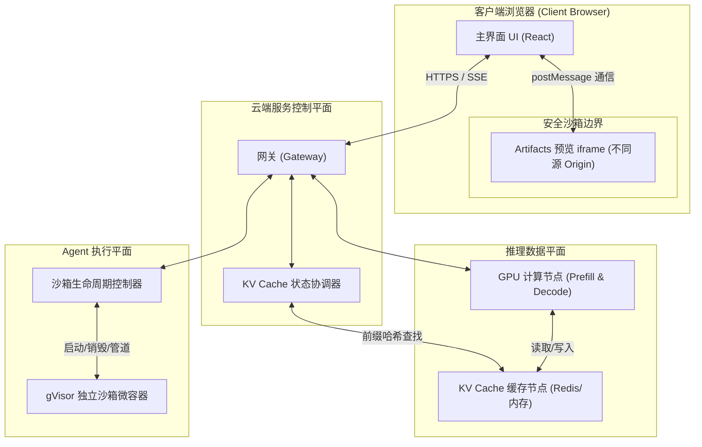
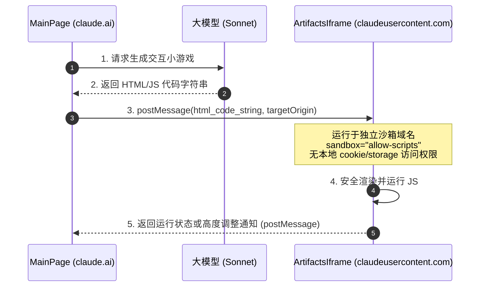
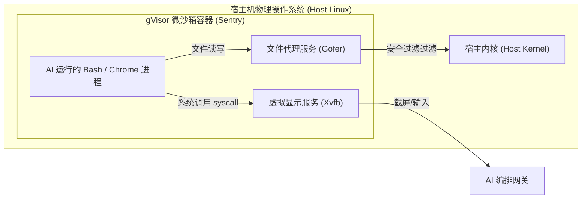

import CaseStudyHeader from '@site/src/components/CaseStudyHeader';
import DesignIntent from '@site/src/components/DesignIntent';
import ArchitectureEvolution from '@site/src/components/ArchitectureEvolution';
import TradeoffExplorer from '@site/src/components/TradeoffExplorer';
import GlossaryTerm from '@site/src/components/GlossaryTerm';
import ResearchNote from '@site/src/components/ResearchNote';
import QuizCard from '@site/src/components/QuizCard';
import CompareSlider from '@site/src/components/CompareSlider';
import GuidedExercise from '@site/src/components/GuidedExercise';

# Claude & Gemini：长上下文与 AI 沙箱架构

<CaseStudyHeader
  oneLiner="Claude 与 Gemini 的架构演进代表了大模型从『被动文本续写器』向『主动工程智能体』的跃迁，其核心底座由百万级长上下文优化、前缀 Prompt Caching 与高安全性的代码运行沙箱（Artifacts/Computer Use）共同支撑。"
  stats={[
    {label: '发布时间', value: '2024 年'},
    {label: '长上下文极限', value: '200K (Claude) / 2M+ (Gemini)'},
    {label: '加速吞吐技术', value: '前缀 Prompt Caching (Trie)'},
    {label: '安全沙箱技术', value: 'Browser iframe Sandbox & gVisor'},
    {label: '指令响应延迟', value: '缓存命中 Prefill < 100ms'}
  ]}
/>

:::info 对应课程概念
本案例横跨 [Month 8 RAG 检索增强](../rag/why-rag)、[Month 11 生产级 AI 平台与治理](../foundations/programming-systems-primer)、[Month 9 Agent 智能体架构](../agent-architectures/agent-loop-basics)。它深刻展示了如何在模型推理延迟（Prefill 阶段）与长上下文成本（KV Cache）中做极致平衡，以及如何安全运行 AI 实时生成的不可信代码。
:::

## 1. 设计初衷：从“短对话”到“容纳整本书与运行环境”

在 LLM 应用的初期，模型只有 4K 或 8K 的上下文窗口。开发者无法直接让 AI 读完一整本技术手册、分析整个代码库、或者实时渲染运行 AI 生成的交互式网页。

为了让 AI 迈向实用，设计架构师必须克服长上下文引起的推理性能崩溃（Attention 计算复杂度随序列长度呈二次方级 $O(N^2)$ 增加），并提供安全的本地代码执行环境（以运行 AI 自动编写的脚本）。

<DesignIntent
  problem="在保证低延迟、低成本的前提下，支撑高达数万行代码或百万 Token 级长上下文的 100% 精准读取；并且能够在完全隔离、安全的容器中实时运行 AI 自动生成的网页应用与系统命令。"
  users="软件工程师、企业数据分析师、科研人员，需要让 AI 读入整本论文、巨大财报、数万行源码，并实时预览或运行执行结果。"
  devices="支持动态数据交换的 Web IDE 端（如 Artifacts 渲染区）与云端多租户隔离的轻量级虚拟沙箱（Sandbox Runner）的深层绑定。"
  goals={[
    '百万 Token 级低延迟召回：在长上下文检索中达到近乎 100% 的准确率，且首字时间（Time to First Token - TTFT）不出现严重劣化',
    '提示词预计算加速：支持提示词前缀缓存（Prompt Caching），重复读入文档时减免 80% 以上的时间与计算费用',
    '安全的非置信代码执行（Artifacts）：实时渲染运行 AI 生成的 HTML、CSS 和 JavaScript，彻底隔绝主站数据，避免 XSS 攻击',
    '智能体主机交互能力（Computer Use）：允许 AI 控制虚拟屏幕、键盘和鼠标，安全运行终端脚本'
  ]}
  constraints={[
    '长上下文推理时，KV Cache 显存消耗极其巨大，极易导致显存溢出（OOM）',
    '长文本 Prefill（预填充）阶段计算量极其惊人，若无缓存每次请求都会造成数秒甚至数十秒的等待',
    'AI 生成的代码可能包含恶意网络请求、信息盗取或循环死机脚本，必须由客户端与云端双层沙箱强力隔离'
  ]}
  firstStep="通过引入 Chunk 级注意力（如 Ring Attention）突破上下文长度壁垒；利用基于 Trie 树的 KV Cache 缓存共享，避免重复文档的 Prefill 计算；在前台采用 iframe Sandbox 容器，在后台采用 gVisor 微沙箱，打造前后端一体的代码隔离运行边界。"
/>

## 2. 系统功能全景

以下是 Claude & Gemini 系统的长上下文工程与 AI 运行沙箱全景图：



---

## 3. 架构总览

系统包含三大核心区域：推理服务集群（含 KV 缓存共享）、Web UI 呈现层（含 iframe 网页沙箱）、云端执行运行时（含安全虚拟容器）：

### 3a. 系统上下文图 (System Context)



### 3b. 容器架构图 (Container)



---

## 4. 核心机制拆解

### 4a. 提示词前缀缓存 (Prompt Caching)

在大文本会话中，绝大部分内容是静态的（如参考源码、长文档历史、系统 prompt）。如果每次追加一句话都要重新对前文进行注意力计算（Prefill），首字延迟将不可接受。

Prompt Caching 的核心思想是在推理节点共享并复用已计算好的 <GlossaryTerm term="KV Cache" definition="键值缓存：自回归模型在计算注意力时，会将前文所有 token 的 Key 和 Value 特征保存在内存中，避免每次预测新词时重复计算前文的注意力。">KV Cache</GlossaryTerm>。

推理集群通过一个基于内存的 <GlossaryTerm term="Trie" definition="字典树（Trie 树），用于保存 Token 序列前缀哈希的检索树结构。Prompt Caching 会利用它来精准判断当前请求的前缀是否已在内存中缓存了 KV 状态。">前缀 Trie 树</GlossaryTerm> 管理缓存状态：

```mermaid
graph TD
  Request["新请求: System Prompt + 复杂上下文 + 当前提问"] --> Tokenize["Tokenization"]
  Tokenize --> TrieLookup["Trie 树前缀哈希匹配"]
  TrieLookup -->|缓存命中 (Hit)| LoadCache["直接加载对应段的 KV Cache 显存<br/>跳过 Prefill 注意力矩阵计算"]
  TrieLookup -->|缓存未命中 (Miss)| PrefillGPU["送入 GPU 执行 Prefill 计算<br/>计算完成后将前缀 KV 写入 Trie 缓存树"]
  
  LoadCache --> DecodePhase["执行 Decode 阶段，生成下一个词 (首字延迟 < 100ms)"]
  PrefillGPU --> DecodePhase
```

<ResearchNote
  title="KV Cache 管理与长上下文优化"
  source="vLLM: Efficient Memory Management for LLM Serving with PagedAttention"
  href="https://arxiv.org/abs/2309.06180"
  insight="长文本推理的瓶颈通常不是算力，而是带宽和显存。若无分页和缓存共享，2M token 的 KV Cache 会消耗数 GB 显存。引入 PagedAttention 并支持基于前缀树的 KV 缓存复用，能使得多路请求在读取共享文档时，内存和预填充开销降为原来的 1/10 以下。"
  application="在构建大模型推理平台时，网关必须具备前缀匹配识别能力，保证相同的前置上下文（如同一项目的源代码库、大文件）被路由至持有相同 KV Cache 缓存块的推理服务器节点。"
/>

### 4b. Web 端 Artifacts 安全沙箱模型

Claude 的 Artifacts 功能允许模型直接生成 React 页面、SVG、或者交互式 HTML，并实时在用户的浏览器中呈现和运行。
因为这些代码是 AI 生成的，属于**不可信代码**。直接在主站（如 `claude.ai`）域下运行这些代码会导致严重的安全漏洞（如盗取 Session Cookie、伪造操作）。

为解决此问题，其客户端架构设计了**跨域 iframe 沙箱隔离机制**：



关键配置解析：
1. **独立域名渲染**：沙箱页面托管在不同的顶级域名（例如 `claudeusercontent.com`），即使沙箱中的恶意 JS 试图利用 `window.parent.document`，浏览器也会由于**同源策略（Same-Origin Policy）**将其强行拦截。
2. **`sandbox` 属性限制**：iframe 显式声明 `sandbox="allow-scripts"`，但**不**声明 `allow-same-origin`。这让 iframe 内的代码拥有独特的 Origin，彻底剥离了 local storage、Cookie、以及网络跨域请求权限。

### 4c. 智能体系统调用沙箱 (gVisor Computer Use)

在最新的 Computer Use（计算机控制）功能中，大模型可以直接在虚拟操作系统上运行 Bash 命令、控制鼠标指针、点击浏览器。
这就需要一个**极致安全且轻量的服务器沙箱隔离环境**。



安全策略要点：
- **系统调用拦截 (gVisor)**：不同于 Docker 容器直接共享宿主机内核，宿主系统采用 <GlossaryTerm term="gVisor" definition="Google 开源的沙箱容器运行时。它实现了一个在用户空间运行的沙箱内核（Sentry），用于拦截并处理容器内进程的所有系统调用，避免恶意程序直接穿透到宿主机内核。">gVisor</GlossaryTerm>。gVisor 内部的 `Sentry` 用 Go 语言重新实现了一套 Linux 内核 API，绝大部分系统调用在沙箱内被消化，不会直接触及物理机的内核，杜绝了容器穿透（Container Escape）攻击。
- **文件单向隔离 (Gofer)**：所有文件系统操作通过外部独立的文件代理进程 `Gofer` 进行多层协议转化和权限审查，容器内部对物理磁盘没有任何直接挂载权。

---

## 5. 架构对比

### 传统重计算推理模式 vs 前缀 Prompt Caching 推理模式

<CompareSlider
  before={
    <div style={{ padding: '20px', background: '#ffebee', border: '1px solid #c62828', borderRadius: '8px', height: '100%', color: '#333' }}>
      <strong>传统全量重计算模式 (Uncached)</strong>
      <p style={{ marginTop: '10px', fontSize: '0.9rem' }}>
        每次向 AI 追问或长文档提问时，推理引擎必须对整个上下文重新执行完整的矩阵计算（Prefill 阶段）。在 100K token 的长度下，仅首字生成可能就需要耗时 5 至 15 秒，且计费昂贵。
      </p>
    </div>
  }
  after={
    <div style={{ padding: '20px', background: '#e8f5e9', border: '1px solid #2e7d32', borderRadius: '8px', height: '100%', color: '#333' }}>
      <strong>前缀 Prompt Caching 缓存模式</strong>
      <p style={{ marginTop: '10px', fontSize: '0.9rem' }}>
        利用 Trie 前缀搜索技术匹配已知前缀。匹配成功直接复用显存中已计算好的 KV Cache，首字延迟被压低至数百毫秒以内（加速达 10 倍以上），并且未发生变化的前置文本可享受大幅的 Token 费用减免。
      </p>
    </div>
  }
  labels={['传统全量 Prefill', 'Prompt Caching 缓存']}
/>

---

## 6. 核心决策的取舍

在提供长上下文和沙箱代码执行时，架构师必须在多个方向上做出权衡取舍：

<TradeoffExplorer
  title="代码执行沙箱的设计取舍"
  dimensions={['安全性 (防穿透)', '资源开销 & 内存占用', '启动速度 (毫秒级)', '功能完备度 (支持系统命令)', '多租户高并发密度']}
  options={[
    {
      name: '纯前端 iframe 沙箱 (Artifacts 模式)',
      scores: [4, 5, 5, 1, 5],
      note: '零服务器计算开销，启动速度为零。安全完全依赖浏览器沙箱隔离。但无法执行后端脚本（如 Python、C++ 或 Bash）。',
      whenToUse: '仅需展示前端交互、HTML/JS 动态页面或静态图表时。'
    },
    {
      name: '云端 gVisor 微沙箱容器 (系统级计算机控制模式)',
      scores: [5, 3, 3, 4, 3],
      note: '安全性极高，支持完整的 Linux 系统调用。但需要占用服务器计算资源，启动容器存在几百毫秒的延迟。',
      whenToUse: '智能体需要执行复杂的 Linux 终端命令、读写文件或模拟真实桌面操作时。'
    },
    {
      name: '完全虚拟化隔离 (如 Firecracker / KVM 微虚拟机)',
      scores: [5, 1, 2, 5, 2],
      note: '物理级硬件隔离，安全性无死角，支持自定义内核。但虚拟化层会导致极重的冷启动开销与内存占用。',
      whenToUse: '极度敏感、可能运行强破坏性脚本，且有充足计算预算的大型企业场景。'
    }
  ]}
/>

---

## 7. 实践指引：实现一个简单的 Trie 提示词缓存模拟器

为了帮助理解 Prompt Caching 的前缀匹配逻辑，我们需要在后端设计一个简单的树状前缀路由匹配结构。

在 `labs/month11/prompt_cache/` 目录下（或在下方练习中），实现一个基于 Token 列表的最长公共前缀（Longest Common Prefix）缓存计算器。

<GuidedExercise
  title="练习指引：提示词前缀缓存匹配计算"
  goal="编写一个简易的 Prompt Cache 前缀树类，当有新的请求进来时，计算其与已缓存前缀的最大匹配 Token 长度，并决定是否更新缓存树。"
  hints={[
    'Trie 树的每个节点包含一个 Token ID、子节点映射、以及一个代表是否被物化在显存中的布尔值 `cached`。',
    '提示词通常以固定段落（如 2048 长度块）为缓存边界。',
    '最大匹配长度如果大于设定的阈值（例如 1024 tokens），才认为命中 Caching 加速。'
  ]}
  steps={[
    '定义 `PromptCacheNode` 节点结构。',
    '实现 `insert_prompt(token_ids: list[int])` 将计算完毕的 Prompt 路径存入树。',
    '实现 `search_cache(token_ids: list[int]) -> int`，输入新 Prompt 返回命中的缓存 Token 数。',
    '编写单元测试，模拟用户不断追加新对话并验证缓存节约效率的计算逻辑。'
  ]}
  checks={[
    '当两个请求只有最后一句提问不同时，你的模拟器能正确识别出前文 90% 的公共前缀已命中缓存。',
    '若前文只修改了一个字（例如在第 10 个 token 处），你的模拟器能正确判断后续的所有前缀缓存都失效了。'
  ]}
/>

---

## 8. 知识自测

完成以下自测题目以检验对长上下文工程、缓存机制与 Web 沙箱隔离边界的掌握度：

<QuizCard
  questions={[
    {
      q: '在前缀提示词缓存（Prompt Caching）机制中，如果用户修改了长文本 Prompt 中间的一个字（例如将原本 20000 token 处的某个标点改掉，其余不变），缓存命中率会发生什么变化？',
      options: [
        'A. 缓存完全不受影响，因为 99.9% 的文字完全一致，GPU 依旧能匹配到后文的 KV 状态',
        'B. 修改点之前的前缀（20000 token 之前）依旧能够命中缓存；而修改点之后的所有文本缓存将全部失效，必须重新进行 Prefill 计算',
        'C. 整个长文本的所有缓存将立刻发生雪崩失效，包含修改点之前的 KV Cache 也必须从零重新计算',
        'D. 缓存会自动进行智能纠错与就地补丁（Hot-patch），继续无损命中'
      ],
      answer: 1,
      explain: '由于 Transformer 的自注意力机制（每个 Token 在生成时都需要与前面的所有 Token 进行关联），任何一个 Token 的修改都会改变其后所有 Token 的 Key 和 Value 计算值。因此，前缀缓存是单向依赖的：修改点之前的前置序列缓存依旧可用，但修改点之后的所有序列由于计算依赖发生改变，缓存完全失效。'
    },
    {
      q: '在 Artifacts 交互渲染功能中，如何绝对防止 AI 生成的恶意 JavaScript 代码窃取用户在 `claude.ai` 主站域下的敏感 Session Cookie？',
      options: [
        'A. 依靠强大的敏感词过滤器，在前端过滤掉所有 `document.cookie` 字样',
        'B. 强制采用独立的跨域域名（如 `claudeusercontent.com`）渲染 Artifacts 页面，并在 `iframe` 标签上剔除 `allow-same-origin` 属性，利用浏览器的同源策略将域彻底隔离',
        'C. 将所有的 JavaScript 脚本直接在服务器端运行，仅将运行结果以静态图片形式回传给浏览器',
        'D. 限制生成的代码只能使用 HTML 和 CSS，完全禁止运行任何 JavaScript 脚本'
      ],
      answer: 1,
      explain: '在同源策略下，不同顶级域名（Domain/Origin）之间天然无法读取彼此的 Cookie 和 LocalStorage。利用独立的域名运行用户或 AI 的不安全代码，并去掉 `allow-same-origin` 属性，能够构建坚不可摧的浏览器级安全沙箱边界，即便恶意 JS 运行也无法访问主站的任何上下文隐私。'
    },
    {
      q: '为什么像 Google Gemini 1.5 Pro 这样的模型在实现 200 万超长上下文时，通常无法在 GPU 节点直接采用经典的 Attention 注意力矩阵计算，而需要设计特别的分层或 Chunk 注意力（如 Ring Attention）？',
      options: [
        'A. 因为普通的注意力机制无法看懂中文等复杂自然语言',
        'B. 因为经典的自注意力机制在空间与时间复杂度上随 Token 长度呈平方级（$O(N^2)$）递增。200 万 token 会导致其所需的 KV Cache 空间和 Prefill 计算量超出单机物理 GPU 的显存极限。Ring Attention 等技术能将上下文分段切片，并跨多卡乃至多节点以环形流水线并行计算，突破单卡瓶颈。',
        'C. 因为大模型本身的参数量必须比上下文长度更大才能读取数据',
        'D. 因为多卡并行会导致模型的智能水平发生退化，必须要分段削弱模型智力'
      ],
      answer: 1,
      explain: '标准的 Attention 计算公式中，计算 Query-Key 矩阵时的空间和时间开销都是上下文长度 $N$ 的平方。长达数百万 token 的长文本会导致单卡显存无法容纳中间的注意力权重矩阵。Ring Attention 等分布式长上下文工程，将大上下文序列沿环状网络切片传输并跨多卡进行流水线计算，使得上下文长度能随计算节点的增加实现线性扩展。'
    }
  ]}
/>

## 来源

- [vLLM: Efficient Memory Management for LLM Serving with PagedAttention (SOSP '23)](https://arxiv.org/abs/2309.06180)
- [Anthropic: Prompt Caching for Claude models API reference](https://www.anthropic.com/news/prompt-caching)
- [gVisor: Google Application Kernel for Containers security guidelines](https://gvisor.dev/docs/)
- [Needle In A Haystack: Long-context LLM retrieval benchmark reports](https://github.com/gkamradt/LLMTest_NeedleInAHaystack)
