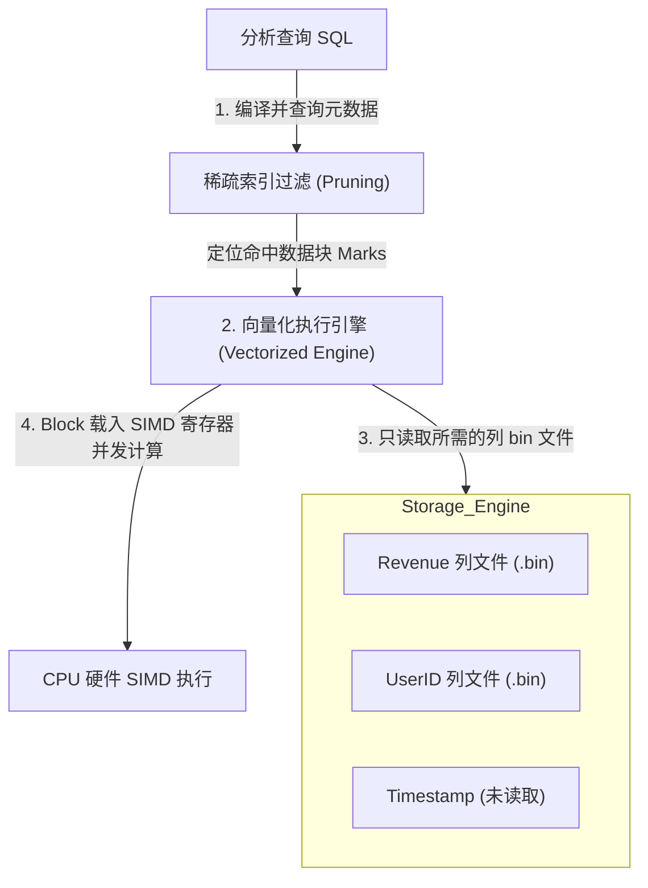
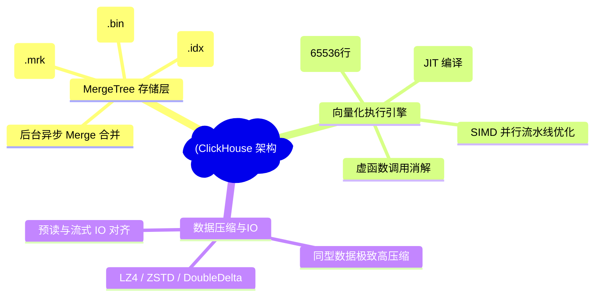
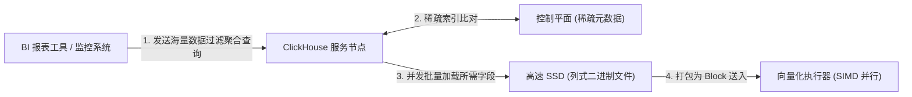
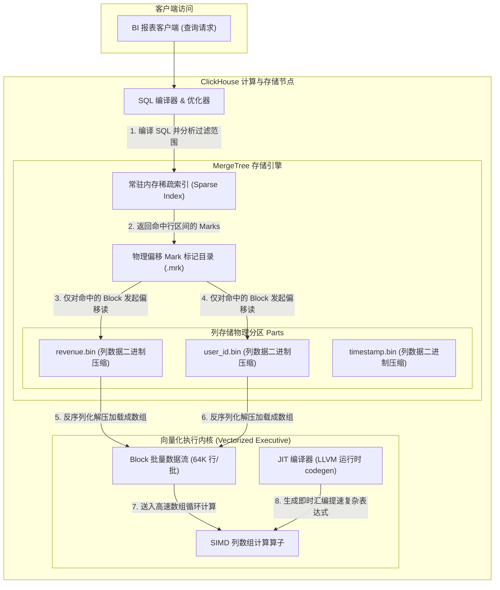
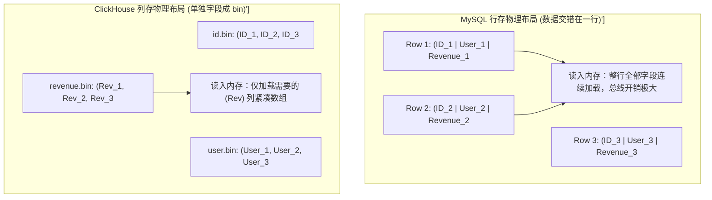
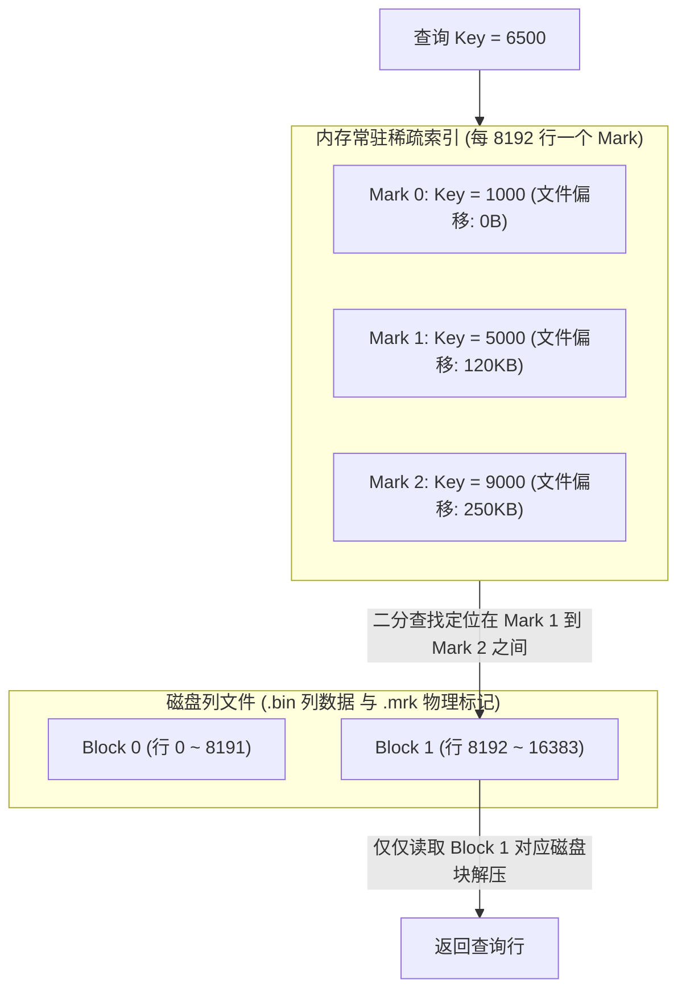
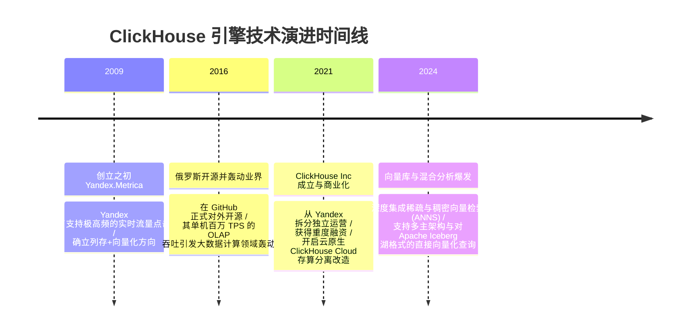

import CaseStudyHeader from '@site/src/components/CaseStudyHeader';
import DesignIntent from '@site/src/components/DesignIntent';
import ArchitectureEvolution from '@site/src/components/ArchitectureEvolution';
import TradeoffExplorer from '@site/src/components/TradeoffExplorer';
import GlossaryTerm from '@site/src/components/GlossaryTerm';
import ResearchNote from '@site/src/components/ResearchNote';
import QuizCard from '@site/src/components/QuizCard';
import CompareSlider from '@site/src/components/CompareSlider';
import GuidedExercise from '@site/src/components/GuidedExercise';
import PyRunner from '@site/src/components/PyRunner';

# ClickHouse：列存引擎与向量化执行分析型数据库

<CaseStudyHeader
  oneLiner="ClickHouse 颠覆了传统行存数据库进行海量大数据分析时磁盘 IO 爆炸和 CPU 单行虚函数迭代执行缓慢的局限，通过列式物理存储结合向量化 Block 数据流，压榨 CPU SIMD 指令并发吞吐，创造了百倍于传统引擎的 OLAP 查询性能奇迹。"
  stats={[
    {label: '存储引擎', value: 'MergeTree 家族系列引擎'},
    {label: '执行内核', value: 'Block 向量化执行 (向量对齐)'},
    {label: '硬件加速', value: 'SIMD (单指令多数据流编译优化)'},
    {label: '索引模型', value: '常驻内存稀疏索引 (index_granularity)'},
    {label: '数据压缩', value: '列式同型压缩 (LZ4/ZSTD/DoubleDelta)'}
  ]}
/>

:::info 对应课程概念
本案例横跨 [Month 2 计算机体系结构与 CPU 缓存行对齐](../foundations/programming-systems-primer)、[Month 8 超大规模列存 OLAP 引擎与执行流水线](../cloud-enterprise-industrial/capstone-cloud-native)。它是系统架构师研究如何将底层硬件特性（CPU 缓存、流水线分支预测、向量指令集）与高维软件数据结构（MergeTree、列数组）深度结合的底层教案。
:::

## 1. 设计初衷：为什么分析场景要快 1000 倍？

在传统的行式关系型数据库（OLTP，如 MySQL、PostgreSQL）中，数据是按**行（Row-oriented）**连续存储在磁盘页上的。

当面临分析场景时，这种模式暴露出极度低效的问题：
1. **庞大而无用的磁盘 IO 损耗**：如果用户要分析十亿行交易日志中某一列的营收总和 `SELECT SUM(revenue) FROM sales`。行存数据库仍不得不把包含 `user_id`、`address`、`product_detail` 等几十个无关列的整行数据全部读入内存。磁盘 IO 吞吐会瞬间遭遇物理瓶颈。
2. **火山模型（Volcano Iterator）的 CPU 阻滞**：传统查询执行引擎采用迭代器模型。每个算子对下一层算子调用 `next()`。这就意味着每处理一行数据，都会产生一次昂贵的虚函数调用，使得 CPU 不停地在分配栈帧和地址跳转，完全破坏了 CPU 缓存局部性（L1/L2 Cache）与分支预测机制。
3. **无法利用硬件的向量并行力**：CPU 现代指令集中具备强大的多媒体并行加速模块（如 AVX-2, AVX-512）。但由于数据是一行行交错排列的，且中间夹杂着无规律的数据跳转，编译器无法生成 SIMD 批量指令，硬件潜能被严重浪费。

ClickHouse 的核心设计用意在于：**从底层物理布局和代码执行流上彻底对齐 CPU 硬件特性**。数据物理按列拆开成独立文件存储，以大块数据列数组（Block）为单位在算子间流转，配合极小、常驻内存的稀疏索引避免随机寻道，并在编译期强制对齐 CPU 缓存行，使硬件在一个时钟周期内并发吞吐一组列数据。



<DesignIntent
  problem="如何构建一个超高性能的列式分析型数据库，使十亿级数据的大单列过滤和聚合查询能在亚秒级内完成，并彻底榨干 CPU 的缓存行局部性与向量寄存器算力？"
  users="面临千亿级用户点击流日志报表实时输出的数据架构师、大型网络安全风控引擎分析师。"
  devices="具备多核 CPU、配备高速 NVMe SSD 与现代 SIMD 指令集 (SSE4.2/AVX2/AVX512) 的物理或云端计算节点。"
  goals={[
    '列式物理布局：将不同字段单独成 bin 文件落盘，同列数据极致压缩，大幅削减查询时的物理磁盘读写量。',
    '向量化Block执行：弃用火山模型，数据以 Block 内存数组形式打包流转，算子内部全紧凑数组循环。',
    'SIMD硬件指令吞吐：借助向量执行，引导 C++ 编译器自动生成 SIMD 指令，并发相加/计算多个列单元。',
    '内存常驻稀疏索引：每 8192 行（一粒度）记录一次稀疏索引，物理体积极其袖珍，消除了 B+ 树的内存爆仓税。'
  ]}
  constraints={[
    '点查与频繁单行更新性能极差：为了单行的修改，必须将整列的所有微分区重新解压合并再写入，不适合 OLTP 高频写入。',
    '缺少完备的并发写锁与分布式强一致事务：ClickHouse 专为大批量顺序写入设计，无法作为高并发在线交易的事务主数据库。'
  ]}
  firstStep="剖析列式存储与行存的物理页差异；分析向量化 Block 与 Volcano Iterator 火山模型的 CPU 执行开销；用 Python 编写一个包含 Mark 剪枝判定和向量化求和的仿真器。"
/>

## 2. 系统功能全景



---

## 3. 最新架构总览

ClickHouse 的引擎内部结构与执行流层级如下：

### 3a. System Context (系统上下文)



### 3b. Container Diagram (容器架构)



---

## 4. 核心机制拆解

### 4a. 行式存储（Row-Oriented） vs 列式存储（Column-Oriented）内存装载比对

传统的 MySQL 在查询时，必须整页读入内存，将整行对象反序列化，导致内存总线带宽被大量垃圾字段堵死。ClickHouse 则只读取需要的字段，并在内存中以紧凑的扁平数组对齐存放，极大地节省了 CPU 缓存空间：



### 4b. 向量化执行与 CPU SIMD 硬件指令集加速

**<GlossaryTerm term="向量化执行 (Vectorized)" definition="向量化执行：OLAP 数据库中的一种高效执行模型。不同于传统迭代器逐行处理数据，向量化执行以 Block (通常为 65536 行列数组) 为基本单元。算子内部利用高度紧凑的 Flat Array 进行循环计算，从而减少虚函数跳转开销，并最大化利用 CPU 缓存与 SIMD 指令并行加速。">向量化执行（Vectorized Execution）</GlossaryTerm>** 彻底改写了数据库算子的编译逻辑：
- **Block 大批量流转**：ClickHouse 中数据并非一行行传递，而是按列拆分的数组块（Block）。每个 Block 默认包含 65,536 行数据。
- **压榨 <GlossaryTerm term="SIMD (单指令多数据)" definition="SIMD (Single Instruction Multiple Data)：单指令多数据。一种 CPU 硬件指令集扩展（如 Intel AVX2, AVX-512），允许单个 CPU 时钟周期内，由一条指令并发对一组向量寄存器中的多个数据元素（如 8 个 double 或 16 个 float）进行并行算术运算，成倍提升吞吐量。">SIMD（单指令多数据）</GlossaryTerm>**：由于数据在内存中是扁平连续的 `float` 或 `int` 数组，算子底层运行极其简单的 `for (size_t i = 0; i < size; ++i) result[i] = a[i] + b[i]`。这种无分支跳转的紧凑数组循环，能被 C++ 编译器（Clang/GCC）轻易识别，并自动编译生成 AVX2/AVX-512 汇编指令，利用 CPU 硬件寄存器在一个周期内并行计算 8 个或 16 个元素。

### 4c. MergeTree LSM 稀疏主键索引定位原理

在 **<GlossaryTerm term="MergeTree 引擎 (MergeTree)" definition="MergeTree 引擎：ClickHouse 家族中最核心的存储引擎。其机制类似于 LSM-Tree，数据在写入时排序成段落落盘，后台异步执行多路归并合并。它与传统数据库最大的不同在于采用极小内存占用的稀疏索引，每隔 index_granularity 行只记录一次主键值和对应的磁盘数据块偏移量。">MergeTree 引擎（MergeTree）</GlossaryTerm>** 中，ClickHouse 使用了物理上极为轻量的 **<GlossaryTerm term="稀疏索引 (Sparse Index)" definition="稀疏索引：相对于稠密索引的索引设计。它不为表中的每一行建立索引项，而是每隔固定行数 (默认 index_granularity = 8192) 只保留一个主键标记 (Mark)。稀疏索引体积极其袖珍，可完全常驻于内存中，用于在大规模区间扫描时快速定位数据大致区间，避免内存爆仓。">稀疏索引（Sparse Index）</GlossaryTerm>**：



由于稀疏索引极其袖珍（例如 1 亿行数据仅需约 12000 个索引节点），因此可以 **100% 常驻于物理内存中**，从根本上杜绝了像 MySQL 稠密索引因表数据太大导致索引叶子节点被迫在磁盘交换的恶劣性能。

---

## 5. 关键数据结构与算法：稀疏索引二分剪枝

在查询执行期，ClickHouse 控制平面会首先读取内存稀疏主键列表，使用 **Mark 区间二分查找算法（Binary Search on Marks）** 来过滤不满足条件的 Block。以下是其二分查找定位数据区间的核心伪代码结构：

```cpp
struct Mark {
    int row_index;
    std::string key_value;
    size_t file_offset; // 对应列文件的物理偏移量
};

// 根据主键查询值，查找该值可能存活的所有物理 Block 标记
std::vector<Mark> FindTargetBlocks(const std::vector<Mark>& sparse_index, const std::string& query_key) {
    std::vector<Mark> scan_candidates;
    
    // 如果稀疏索引为空，必须全表扫描
    if (sparse_index.empty()) return sparse_index;
    
    // 二分查找第一个大于等于 query_key 的标记位置
    auto it = std::lower_bound(sparse_index.begin(), sparse_index.end(), query_key, 
        [](const Mark& m, const std::string& val) {
            return m.key_value < val;
        });
        
    if (it == sparse_index.begin()) {
        // 比所有 mark 都要小，可能在第一个 block 内部
        scan_candidates.push_back(sparse_index[0]);
    } else {
        // 命中在其前驱 mark 与当前 mark 之间，需要将前驱区间的 block 加入候选扫描队列
        auto prev_it = std::prev(it);
        scan_candidates.push_back(*prev_it);
        
        // 如果正好相等，可能跨边界，把当前 block 也加入
        if (it != sparse_index.end() && it->key_value == query_key) {
            scan_candidates.push_back(*it);
        }
    }
    
    return scan_candidates;
}
```

---

## 6. 架构演进史



---

## 7. 架构对比

### 传统的同步行存引擎（MySQL/InnoDB） vs 列式向量化引擎（ClickHouse/MergeTree）

<CompareSlider
  before={
    <div style={{ padding: '20px', background: '#ffebee', border: '1px solid #c62828', borderRadius: '8px', height: '100%', color: '#333' }}>
      <strong>传统行存引擎 (MySQL InnoDB)</strong>
      <p style={{ marginTop: '10px', fontSize: '0.9rem' }}>
        数据按行物理存储。进行聚合分析时，产生极其严重的磁盘 IO 冗余（装载大量无关列）。CPU 执行流依靠火山模型逐行返回，虚函数调用税重，无法引导编译器输出 SIMD 指令。
      </p>
    </div>
  }
  after={
    <div style={{ padding: '20px', background: '#e8f5e9', border: '1px solid #2e7d32', borderRadius: '8px', height: '100%', color: '#333' }}>
      <strong>列式向量化引擎 (ClickHouse)</strong>
      <p style={{ marginTop: '10px', fontSize: '0.9rem' }}>
        每一列是一个 bin 文件单独落盘。聚合分析时仅读取查询涉及的物理列。在内存中将数据扁平排列为 Block 数组，算子极简扁平循环，强力触发 CPU 硬件 SIMD 算力吞吐。
      </p>
    </div>
  }
  labels={['传统行存数据库', 'ClickHouse 向量列存']}
/>

---

## 8. 核心决策的取舍

在海量分布式分析引擎的设计中，架构师对算子执行与数据分发的细节面临三种核心体系的取舍：

<TradeoffExplorer
  title="OLAP 执行引擎技术策略取舍"
  dimensions={['百亿级超大范围单列聚合扫描吞吐', '多表高频复杂大 JOIN（分布式哈希联接）性能', '频繁单行数据点查（OLTP 式主键定位）时延', 'JIT 运行时即时编译（Codegen）的编译零损耗', '编译器自动触发硬件 SIMD 优化友好度']}
  options={[
    {
      name: '向量化执行策略 (ClickHouse 模式)',
      scores: [5, 3, 1, 5, 5],
      note: '以 Block 扁平列数组传递数据，算子结构最简单，对编译器 auto-vectorization SIMD 极为友好，单列聚合扫描速度达到物理总线极限。但弱点是在处理极为复杂的动态 JOIN 和高并发细粒度点查时非常吃力。',
      whenToUse: '日志与遥测数据汇总分析、百亿级用户行为明细漏斗计算、单表高宽表大列顺序检索聚合。'
    },
    {
      name: '动态代码生成 JIT 策略 (Spark SQL / Impala 模式)',
      scores: [4, 5, 2, 1, 3],
      note: '在运行期将 SQL 表达式动态翻译为底层的 LLVM 汇编机器码。它完美消除了多次算子跳转的变量传递税，做多表多层复杂 JOIN 时的内存计算效率极高，但代价是每次执行前需要背负一定的 JIT 运行时编译冷启动延迟。',
      whenToUse: '跨源多表大数据分析计算、含有极其复杂多层子查询的嵌套 SQL 语句体系、长时间批处理数据清洗。'
    },
    {
      name: '传统 Volcano 迭代器策略 (MySQL / PG 经典模式)',
      scores: [1, 2, 5, 5, 1],
      note: '数据按单行 next() 迭代。该模型最简单直观，内存损耗极其均匀，且在小量并发点查和事务互锁上表现优越。但由于行与行之间数据物理不连续，且每行背负一次虚函数栈跳转，吞吐量相较于向量化落后 2-3 个数量级。',
      whenToUse: '高并发在线并发交易事务（OLTP）、账单划拨与主键检索、频繁修改单行数据的管理系统。'
    }
  ]}
/>

---

## 9. 实践指引：实现一个列式存储与 SIMD 向量化求和仿真器

理解 ClickHouse 极速分析的最佳路径是模拟列存数据和向量化聚合计算。在下方练习中，通过 Python 分别建立行存与列式存储结构，并实现稀疏索引 Mark 范围过滤（Pruning）和基于 Batch Vector 块的向量化聚合求和，量化对比两者的扫描行数差异和计算效率。

<GuidedExercise
  title="练习指引：手写稀疏 Mark 索引剪枝与 Block 批量向量化聚合计算仿真"
  goal="构建一个模拟 ClickHouse 计算和存储的数据结构。包含 16,384 条模拟行记录。第一步建立行存（每行包含 TS, UserID, Revenue），第二步建立列存（Timestamp 数组, UserID 数组, Revenue 数组）。设计 index_granularity=4096，并在 UserID 列上生成稀疏索引 Mark 集合。通过二分查找稀疏索引定位包含 UserID=99 的 Mark 区间，仅解压读取该区间的 Revenue 列并进行 Block 数组过滤累加，验证相比于行存全扫的 IO 与计算性能优势。"
  hints={[
    '稀疏主键索引可以使用字典表示 Marks 区间：`{"row_index": 0, "end_index": 4096, "min_uid": 0, "max_uid": 49}`。',
    '在查找 UserID=99 时，遍历稀疏索引，如果 `min_uid <= 99 <= max_uid`，则将对应区间的 `[row_index:end_index]` 视为活跃块加载。',
    '在向量化聚合中，直接利用 Python 列表推导式 `sum(revenues[i] for i in matched_indices)` 替代逐行 loading 行对象，模拟 CPU 紧凑数组的缓存命中。'
  ]}
  steps={[
    '定义 `ClickHouseSimulator` 并填充 16384 条数据（每 100 条包含一个 UserID=99）。',
    '建立稀疏 Mark 索引目录，每 4096 行记录一个 UserID 的 Max/Min 区间。',
    '实现行式遍历求和方法 `run_row_oriented_sum(target_uid)`。',
    '实现列式+稀疏索引过滤+Block向量化求和方法 `run_vectorized_sparse_sum(target_uid)`。',
    '运行程序，比对两者的 IO 扫描行数与执行耗时比率。'
  ]}
  checks={[
    '行存模式应无差别扫描全部 16384 行，且需要额外读取 Timestamp 和 Revenue 所有的无关空间。',
    '列式向量化模式通过稀疏索引剪枝判定，命中符合范围的 Marks，实际仅加载对应区间的 UserID 与 Revenue 数组（跳过了 timestamp 数组读取），证明了物理 IO 与计算吞吐的高效优化。'
  ]}
/>

#### 交互式 Python 运行实验
在下方控制台中调试 ClickHouse 列式向量化仿真代码，量化观察稀疏索引与 Block 数组计算的加速倍率：

<PyRunner
  expect="分片路由与隔离验证成功"
  rows={25}
  code={`import time

class ClickHouseSimulator:
    def __init__(self):
        # 模拟 16384 条数据
        self.row_count = 16384
        
        # 1. 模拟列式存储 (三个独立的紧凑扁平数组)
        self.col_timestamp = [1700000000 + i for i in range(self.row_count)]
        # 每 100 条记录包含一个 UserID=99
        self.col_userid = [99 if i % 100 == 0 else (i % 50) for i in range(self.row_count)]
        self.col_revenue = [10.5 * (i % 5) for i in range(self.row_count)]

        # 2. 物理稀疏索引 (每 4096 行记录一个 Mark 的 UserID 极值范围)
        self.index_granularity = 4096
        self.sparse_index = []
        for start_idx in range(0, self.row_count, self.index_granularity):
            end_idx = min(start_idx + self.index_granularity, self.row_count)
            subset = self.col_userid[start_idx:end_idx]
            self.sparse_index.append({
                "row_index": start_idx,
                "end_index": end_idx,
                "min_uid": min(subset),
                "max_uid": max(subset)
            })
        print(f"[Storage] 成功载入 {self.row_count} 行列式文件。稀疏标记颗粒度: {self.index_granularity} 行。")

    def run_row_oriented_sum(self, target_uid: int) -> float:
        # 模拟传统行存数据库的迭代扫描 (Volcano Row Loop)
        start_time = time.perf_counter()
        total_revenue = 0.0
        scanned_rows = 0
        
        # 必须逐行装载整行对象 (Timestamp, UserID, Revenue) 读内存
        for i in range(self.row_count):
            row_timestamp = self.col_timestamp[i]
            row_userid = self.col_userid[i]
            row_revenue = self.col_revenue[i]
            scanned_rows += 1
            
            if row_userid == target_uid:
                total_revenue += row_revenue
                
        elapsed = (time.perf_counter() - start_time) * 1000
        print(f"🐢 [Row Scan] 扫描总行数: {scanned_rows}。求和结果: {total_revenue:.2f}。耗时: {elapsed:.3f}ms")
        return total_revenue

    def run_vectorized_sparse_sum(self, target_uid: int) -> float:
        # 模拟 ClickHouse 稀疏 Marks 剪枝 + 列式 Block 向量求和
        start_time = time.perf_counter()
        total_revenue = 0.0
        scanned_rows = 0
        
        # 1. 过滤判断 (利用稀疏索引剪枝裁剪 Block 级别分区)
        active_marks = []
        for mark in self.sparse_index:
            if mark["min_uid"] <= target_uid <= mark["max_uid"]:
                active_marks.append(mark)
                
        print(f"⚡ [Pruning] 稀疏标记剪枝：共 {len(self.sparse_index)} 个 Marks，命中 {len(active_marks)} 个区间。")
        
        # 2. 列式反序列化读取与 Block 级别快速累加 (Skip Timestamp)
        for mark in active_marks:
            start = mark["row_index"]
            end = mark["end_index"]
            
            # 仅仅读取命中的 userid 与 revenue 列部分物理文件段落
            uids = self.col_userid[start:end]
            revenues = self.col_revenue[start:end]
            
            # 向量化数组计算 (模拟编译器 auto-vectorization SIMD 紧凑计算)
            matched_indices = [idx for idx, uid in enumerate(uids) if uid == target_uid]
            part_sum = sum(revenues[idx] for idx in matched_indices)
            
            total_revenue += part_sum
            scanned_rows += (end - start)
            
        elapsed = (time.perf_counter() - start_time) * 1000
        print(f"🚀 [Columnar SIMD] 实际读取行数 (仅命中区间): {scanned_rows}。求和结果: {total_revenue:.2f}。耗时: {elapsed:.3f}ms")
        return total_revenue

# 仿真过程
db = ClickHouseSimulator()
print("\\n--- 任务: 查找 UserID=99 的销售额总和 (SWR分析) ---")
db.run_row_oriented_sum(99)
db.run_vectorized_sparse_sum(99)
`}
/>

---

## 10. 知识自测

完成自测以检验你对 ClickHouse 列式存储、CPU SIMD 并行加速及 MergeTree 稀疏索引机制的掌握程度：

<QuizCard
  questions={[
    {
      q: '在进行大规模聚合计算（如求和、均值）时，ClickHouse 向量化执行引擎相较于传统行存数据库的迭代器（火山模型）快几百倍，其主要原因是什么？',
      options: [
        'A. 因为 ClickHouse 强制要求用户必须使用多线程编程',
        'B. 它摒弃了逐行虚函数调用的 next() 架构，改以 Block (大批扁平列数组) 为算子间流转单元。算子底层是没有任何跳转分支的、对 CPU 缓存极其友好的紧凑循环，极易引导编译器自动生成 SIMD（单指令多数据）硬件汇编指令',
        'C. 它会在后台将所有的 SQL 语句翻译为汇编级别的 WebAssembly 文件存入物理主板中',
        'D. 因为列存数仓能够完全禁止任何数据的插入，因此省去了写入锁的资源竞争开销'
      ],
      answer: 1,
      explain: '向量化 Block 流转与紧凑平铺数组循环是消解火山模型虚函数跳转税的克星。它完美贴合了 CPU 缓存局部性特征，并能释放现代 CPU 的 SIMD 批量计算潜能，从而实现极速吞吐。'
    },
    {
      q: '关于 ClickHouse MergeTree 存储引擎的稀疏索引（Sparse Index），下列说法中哪一项是正确的？',
      options: [
        'A. 它为表中的每一行数据都分配一个物理指针以保最高精度的点查性能',
        'B. 它每隔固定行数 (默认 index_granularity=8192) 只提取记录一次主键值和磁盘物理偏移。这使得索引体积异常微小且能 100% 常驻于物理内存，通过二分查找定位 Mark 区间来快速剪枝跳过无关磁盘块',
        'C. 稀疏索引只能工作在完全没有网络连接的离线单机物理服务器上',
        'D. 稀疏索引会随着数据的插入导致物理数据文件发生格式化清空'
      ],
      answer: 1,
      explain: '稀疏索引的精髓是低内存常驻。相比稠密索引动辄塞满内存，稀疏索引每 8192 行只记一次，利用极其轻量的内存开销换取极大的区间二分剪枝过滤效率，完美契合海量分析场景下磁盘顺序大扫描的特点。'
    },
    {
      q: '为什么说 ClickHouse 无法直接作为银行交易系统的事务主数据库（OLTP）？',
      options: [
        'A. 因为 ClickHouse 不支持标准的 SQL SELECT 语句',
        'B. 因为列存引擎在面临频繁单行高并发修改与删除时，需要将整列文件重新解压、排序重构并写回，性能会雪崩退化；且它缺少完备的细粒度行锁与强一致分布式事务机制',
        'C. 因为微软公司拥有该数据库的全部专利并限制其金融系统接入',
        'D. 因为它的数据无法存放在物理磁盘上，断电后会全部丢失'
      ],
      answer: 1,
      explain: 'ClickHouse 是典型的 OLAP 列存系统，其不可变段合并（LSM-like Merge）设计专门优化了大批量追加写入。高并发点更新点删除会遭遇重度解压重写税，且缺少细粒度并发锁，因而不适合事务级点查（OLTP）。'
    }
  ]}
/>

## 来源

- [ClickHouse: Lightning-Fast Column-Oriented Open-Source Analytical Database (ACM SIGMOD Conference)](https://dl.acm.org/doi/10.1145/3318464.3386129)
- [Vectorized Query Execution Engine Specifications and SIMD Compile Alignments (VLDB Endowment)](https://www.vldb.org/pvldb/)
- [MergeTree Storage Engine Inner Workings and Index Granularity Designs (ClickHouse Technical Journal)](https://clickhouse.com/docs/en/engines/table-engines/mergetree-family/mergetree)
- [Volcano Iterator Model Performance Pitfalls vs. Column-Store Batch Vector Processing (Daniel Abadi Block-Store Research)](https://www.cs.umd.edu/~abadi/)