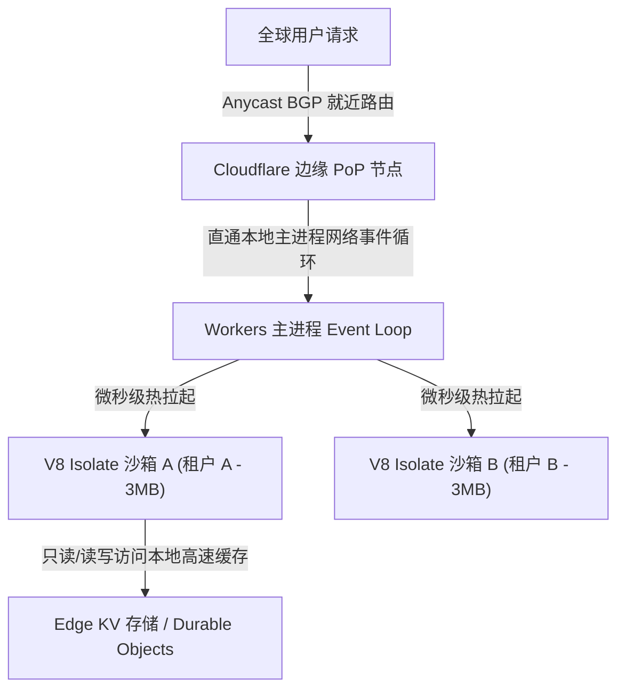
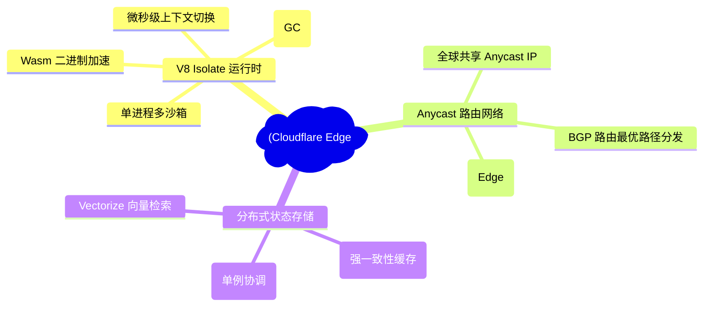
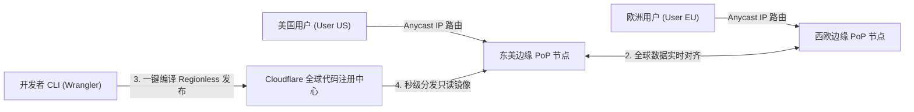
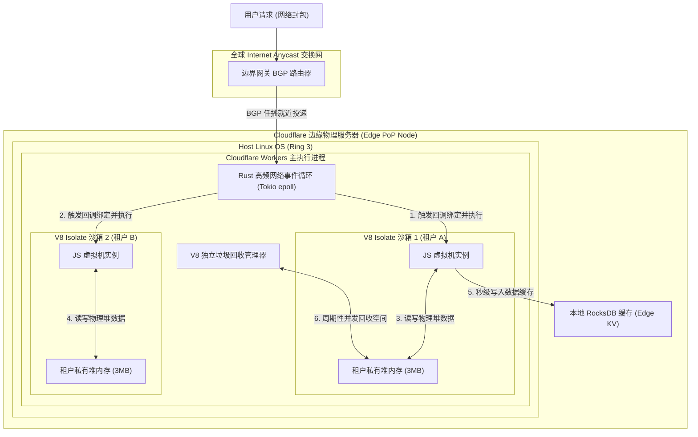
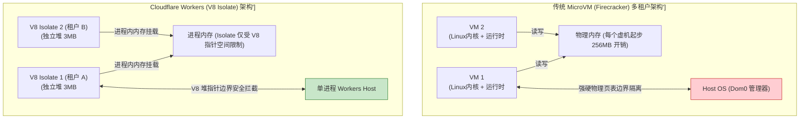
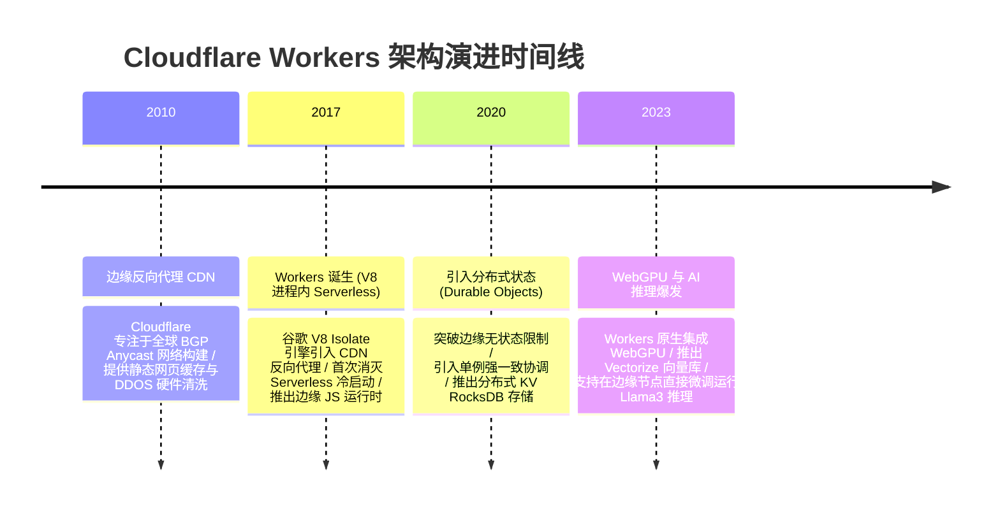

import CaseStudyHeader from '@site/src/components/CaseStudyHeader';
import DesignIntent from '@site/src/components/DesignIntent';
import ArchitectureEvolution from '@site/src/components/ArchitectureEvolution';
import TradeoffExplorer from '@site/src/components/TradeoffExplorer';
import GlossaryTerm from '@site/src/components/GlossaryTerm';
import ResearchNote from '@site/src/components/ResearchNote';
import QuizCard from '@site/src/components/QuizCard';
import CompareSlider from '@site/src/components/CompareSlider';
import GuidedExercise from '@site/src/components/GuidedExercise';
import PyRunner from '@site/src/components/PyRunner';

# Cloudflare Workers/Edge：V8 Isolate 与无区域边缘计算

<CaseStudyHeader
  oneLiner="Cloudflare Workers 颠覆了传统容器与虚拟机 Serverless 笨重、冷启动明显的成规，通过在单个操作系统进程内并发运行上万个轻量化 V8 Isolate 沙箱，配合全球 Anycast 网络实现就近请求穿透与零冷启动响应，开创了新型边缘算力基建的范式。"
  stats={[
    {label: '冷启动时延', value: '接近 0 毫秒 (微秒级热拉起)'},
    {label: '租户内存开销', value: '低至 3MB (对比容器数百MB)'},
    {label: '网络调度', value: 'BGP Anycast 全球任播直连'},
    {label: '运行引擎', value: 'V8 Isolate 沙箱 (Javascript/WASM)'},
    {label: '部署拓扑', value: '无区域架构 (Regionless 全球分发)'}
  ]}
/>

:::info 对应课程概念
本案例横跨 [Month 1 进程隔离与 V8 引擎运行时](../foundations/programming-systems-primer)、[Month 4 低阶设计与 V8 沙箱隔离边界](../foundations/programming-systems-primer)、[Month 6 超大流量边缘分发与全球 Anycast 路由](../cloud-enterprise-industrial/capstone-cloud-native)。它是系统架构师理解下一代超低延迟、超高计算密度的 Serverless 边缘应用开发必须吃透的核心案例。
:::

## 1. 设计初衷：如何消灭 Serverless 虚拟机的“冷启动税”？

在第一代 Serverless（如 AWS Lambda）中，为了保证多租户代码的安全性，通常采用 **虚拟机（MicroVM / Firecracker）** 或 **Docker 容器** 来提供隔离边界。

这种隔离模式带来了三个致命的瓶颈：
1. **漫长的<GlossaryTerm term="冷启动 (Cold Start)" definition="Cold Start：冷启动。在 Serverless 计算中，由于没有正在运行的预留容器或虚拟机，系统必须从头拉起全新的运行实例、装载内核和初始化语言运行时，由此产生初始化时间滞后所带来的延迟表现。">冷启动（Cold Start）</GlossaryTerm>时延**：当函数调用在一段时间内没有发生，底层的虚机容器会被自动销毁回收。新请求到达时，系统必须从头引导操作系统内核、初始化语言运行时，这会造成数十毫秒到数秒的延迟。在 API 网关和微服务链路中，这会导致灾难性的请求卡顿。
2. **极高的空闲内存损耗**：哪怕运行一段仅几行的 JavaScript 校验代码，也需要为虚机至少分配 128MB 到 256MB 的内存。单台服务器能承载的并发租户数被严重限制。
3. **高昂的跨地域传输开销**：租户必须在配置中将 Lambda 绑定到具体的 AWS Region（如 `us-east-1`）。当日本的用户访问时，请求必须飞越大半个地球回到美国数据中心处理，海底光纤的传播时延让“低时延”化为泡影。

Cloudflare Workers 的核心设计用意在于：**抛弃虚拟机和容器的整机隔离，将安全沙箱的层级下移到 JavaScript V8 Isolate 层面**，在一台普通的边缘物理服务器内通过单个主进程运行数万个轻量级 Isolate，配合全球<GlossaryTerm term="Anycast (任播)" definition="Anycast：任播路由技术。一种网络寻址方式，使得全球数十个不同地理位置的服务器节点在骨干网中宣告共享同一个 IP 地址。BGP 路由协议会自动将用户的请求引导至距离其物理或链路拓扑最近的机房进行处理，以取得最佳响应时延。">任播（Anycast）</GlossaryTerm>路由，使得用户的请求在距离其几十公里的本地边缘节点瞬间就地热加载执行。



<DesignIntent
  problem="如何构建一个消灭虚拟机冷启动损耗、可容纳数万个租户并驻留在一台物理机内存中，且能利用全球 Anycast 路由网络自动就近处理请求的极速边缘计算平台？"
  users="具身智能 API 边缘路由开发者、全球级外海静态/动态混排站点架构师、跨洲低延迟 API 网关网络安全工程师。"
  devices="遍布全球 300 多个城市的 Cloudflare Anycast 边缘物理服务器机柜、客户端网页与移动终端。"
  goals={[
    '消灭冷启动：基于 V8 Isolate 实现小于 1 毫秒的热启动，消除传统的 VM Booting 阻滞。',
    '极限多租户密度：将单个租户的空闲内存占用降至 3MB，单台物理机可并发维持上万个活跃函数实例。',
    '全球 Anycast 自动路由：通过边界网关协议（BGP）Anycast 宣告，使用户请求就近引流至最近的 PoP 边缘机房。',
    '无区域声明部署：开发者无需选择 Region，代码瞬间同步到全球全部边缘节点，在离用户最近处启动。'
  ]}
  constraints={[
    '非 JS/WASM 生态的开发壁垒：Workers 强依赖 V8 引擎，无法直接执行任意 Python, Java 或二进制文件，代码必须编译为 JS 或 WebAssembly。',
    '多租户单进程下的侧信道攻击风险：同一物理进程内并发数万租户，必须在内核/V8 引擎层通过时钟频限、内存物理随机化缓解 Spectre 等侧信道窥探。'
  ]}
  firstStep="深入剖析 V8 Isolate 进程内沙箱设计细节；对比 Anycast 路由原理；编写 Python 密度仿真器，量化评估 V8 Isolate 相较于 MicroVM 的内存出让比。"
/>

## 2. 系统功能全景

以下是 Cloudflare Workers 边缘 Serverless 平台及网络组成功底座的全景图：



---

## 3. 最新架构总览

Cloudflare Workers 的网络就近引流与边缘 V8 沙箱架构层级如下：

### 3a. System Context (系统上下文)



### 3b. Container Diagram (容器架构)



---

## 4. 核心机制拆解

### 4a. 传统虚拟机多租户 vs Cloudflare Workers V8 Isolate 多租户架构比较

传统的虚拟化为了安全，在物理内存中背负了极其厚重的 Dom0 虚拟机开销。Cloudflare 抛弃了这一层，直接在进程内存中精细画地为牢：



### 4b. V8 Isolate 极致密度的沙箱沙盒机制

<GlossaryTerm term="V8 Isolate" definition="V8 Isolate：Google V8 引擎中高度独立的运行时环境。它拥有自己专属的变量作用域、堆空间（Heap）、调用栈以及垃圾回收器（Garbage Collector）。在一台物理机上的同一个进程空间内，能够并发运行数万个 Isolate 实例，彼此指针互不交叉，无须昂贵的 OS 级进程上下文切换。">**V8 Isolate（V8 隔离沙箱）**</GlossaryTerm> 是整个 Workers 的基石：
- **无操作系统的微秒级上下文切换**：虚拟机之间的切换需要涉及 CPU 的内核态-用户态切换、TLB（页表缓存）强制清空等重度损耗。而同一个进程内的 Isolate 切换只需要进行简单的 C++ 指针移动，时钟周期开销接近于零。
- **内存防泄露隔离**：每一个 Isolate 代表了专属的 Heap 作用域。租户 A 的 JavaScript 代码绝无可能通过物理指针读取租户 B 的堆内存。如果租户 A 的代码发生非法内存访问，只会导致当前 Isolate 闪崩退出，完全不会波及共享进程的其他 Isolate 沙箱。

### 4c. 全球 BGP Anycast 任播路由网络原理

Cloudflare 将同一个公网 IP 地址通过 <GlossaryTerm term="BGP (边界网关协议)" definition="BGP (Border Gateway Protocol)：边界网关协议。互联网核心路由协议，负责引导骨干路由器选择到达目的 IP 的最佳网络通路。Cloudflare 通过 BGP 广播，使全球所有边缘机房拥有完全一致的 Anycast IP，网络封包被自动就近分发。">**BGP（边界网关协议）**</GlossaryTerm> 广播分发给分布在全球 300 多个城市的物理数据中心：
1. **就近引流**：当用户的电脑发送网络包到该 IP 时，沿途的骨干网路由器会根据 BGP 规则，自动将数据包投递给地理/网络链路最近的 Cloudflare PoP 机房。
2. <GlossaryTerm term="无区域架构 (Regionless)" definition="Regionless Architecture：无区域架构。Serverless 部署的一种新型范式。开发者编写的代码无需选择任何特定 Region。系统在秒级内将代码的只读映像同步至全球所有的物理边缘节点。用户在世界任何地点发起请求，就近节点的 V8 沙箱瞬间拉起响应。">**无区域架构（Regionless Architecture）**</GlossaryTerm>：这意味着系统完全没有中心服务区。用户的网络包在哪里“落地”，V8 Isolate 就在哪里瞬间拉起，消除了“把请求发回美国”的物理时空传播延迟。

---

## 5. 关键数据结构与算法：V8 堆内存隔离校验

在 V8 Isolate 的 C++ 实现中，为了防止多租户在单进程内存空间下通过缓冲区溢出（Buffer Overflow）或内存越界进行攻击，V8 内核使用了专门的**指针压缩与沙箱边界定位算法（Isolate Memory Sandboxing）**：

```cpp
class V8TenantSandbox {
public:
    // 强制堆内存限制在 29 位寻址空间 (512MB)，实现指针压缩与物理地址硬性隔离
    static const size_t kHeapSizeLimit = 512 * 1024 * 1024;
    
    void* heap_base_address; // 进程空间内给该租户分配的虚拟基址指针
    
    // 执行指针验证，防御越界访问
    inline bool ValidatePointer(uintptr_t target_offset) {
        if (target_offset >= kHeapSizeLimit) {
            TriggerSecurityPanic(); // 越界直接抛出致命恐慌，强行销毁该 Isolate
            return false;
        }
        return true;
    }
};
```

*安全用意*：
- 基于 V8 这种“指针对齐”的软性沙箱约束，使得 Cloudflare 不需要依靠内核态特权级 MMU 频繁重载页表，就能在用户态物理内存中实现可靠的安全绝缘屏障，从而榨干了最后一滴微秒级上下文切换算力。

---

## 6. 架构演进史

Cloudflare Workers 经历了从单纯的反向代理向完全分布式边缘计算底座的演进：



---

## 7. 架构对比

### 传统虚拟机冷启动模式（AWS Lambda/Firecracker） vs V8 Isolate 边缘热拉起模式（Cloudflare Workers）

<CompareSlider
  before={
    <div style={{ padding: '20px', background: '#ffebee', border: '1px solid #c62828', borderRadius: '8px', height: '100%', color: '#333' }}>
      <strong>虚拟机 Serverless (Lambda Firecracker)</strong>
      <p style={{ marginTop: '10px', fontSize: '0.9rem' }}>
        物理机需要动态创建轻量虚机、载入系统内核及语言解释器。空闲销毁后首包延迟（冷启动）高达 50~500ms。一个函数的空闲内存开销在 100MB 以上，导致系统多租户承载密度受物理页表数量限制。
      </p>
    </div>
  }
  after={
    <div style={{ padding: '20px', background: '#e8f5e9', border: '1px solid #2e7d32', borderRadius: '8px', height: '100%', color: '#333' }}>
      <strong>Isolate 边缘 Serverless (Workers V8)</strong>
      <p style={{ marginTop: '10px', fontSize: '0.9rem' }}>
        共享相同的 Linux 主进程。租户隔离仅限于 V8 虚拟机指针作用域。启动一个沙箱仅需 1 毫秒（微秒级热拉起），冷启动感官消失。每个实例开销低至 3MB 左右，极大地提升了单节点计算密度。
      </p>
    </div>
  }
  labels={['虚拟机 Serverless', 'Isolate 边缘 Serverless']}
/>

---

## 8. 核心决策的取舍

在设计无服务器计算运行时环境（Serverless Execution Runtime）时，架构师对隔离安全度与算力密度面临三种不同的抉择：

<TradeoffExplorer
  title="Serverless 运行时隔离技术取舍"
  dimensions={['防止进程逃逸的绝对物理安全性', '启动极速与零冷启动时延', '空闲内存占用与单机租户密度', '通用语言支持 (Python/Java/Bin)', '调用进程的上下文切换开销性能']}
  options={[
    {
      name: 'V8 Isolate 运行时策略 (Cloudflare Workers 模式)',
      scores: [3, 5, 5, 2, 5],
      note: '在进程内存中划分出上万个 V8 沙箱。内存与启动速度开销（3MB，<1ms）处于物理完美状态，调度延迟微秒级。但致命弱点是它不支持任意通用语言（如 Python 必须转化），且由于共享同一进程，对 Spectre 侧信道防护难度极大。',
      whenToUse: '极轻量 Web 路由、API 网关、边缘中间件校验、对启动延迟极端敏感的分布式高密度服务。'
    },
    {
      name: 'MicroVM 轻量虚拟机策略 (AWS Lambda / Firecracker 模式)',
      scores: [5, 2, 2, 5, 2],
      note: '使用专门裁剪的硬件辅助（Intel VT-x）轻量级虚机作为隔离沙箱。由于具备独立的内核和虚拟页表，安全性最高，支持运行任何编译好的通用二进制代码，但冷启动延迟（几十毫秒）与内存税（几百MB）较重。',
      whenToUse: '通用长耗时计算任务、金融核心计费处理、重度图形渲染、对安全性有 100% 绝对物理隔离合规要求的企业级 Serverless。'
    },
    {
      name: '标准容器宿主策略 (Docker 容器/ Kubernetes 模式)',
      scores: [4, 1, 1, 5, 1],
      note: '利用 Namespaces 和 Cgroups 共享宿主机内核的容器环境。对于遗留软件（Legacy System）的微服务化最为简单方便，但容器的启动延迟极高（数秒级），难以作为高弹性短寿命的 Serverless 节点响应高频事件。',
      whenToUse: '长寿命微服务组件部署、容器化 DevOps 构建流水线、持久运行的商业后台应用。'
    }
  ]}
/>

---

## 9. 实践指引：实现一个 V8 Isolate 多租户密度与冷启动开销调度仿真

理解 Cloudflare Workers 超密度的最好办法是建立一个边缘服务器模拟器。在下方练习中，通过 Python 实现多租户申请，并量化对比 MicroVM（如 Firecracker）与 V8 Isolate 模式下系统物理内存爆仓的极值边界与冷启动开销。

<GuidedExercise
  title="练习指引：编写 Edge 节点多租户内存爆仓与冷启动时延评估仿真"
  goal="构建一个 Edge 服务器物理内存管理模型。物理内存容量设为 16GB (16384MB)。MicroVM 模式下每个租户分配 256MB 内存，冷启动需 120ms。V8 Isolate 模式下每个租户分配 4MB 内存，冷启动仅需 1ms。通过依次 spawn 租户，对比两者的爆仓临界租户数以及系统付出的累加冷启动开销总和。"
  hints={[
    '你可以使用 Python 构建 `ServerlessTenant` 对象，存储租户类型、内存和冷启动参数。',
    '设计 `EdgeNodeSimulator` 限制 `total_memory_mb = 16384`。通过循环执行 `spawn_tenant`，直到 `allocated_memory_mb` 溢出。',
    '在 V8 Isolate 模式下，当创建出数千个租户时，打印分配摘要，直观核查系统的承载极限。'
  ]}
  steps={[
    '定义 `ServerlessTenant` 租户类，区分运行时类型。',
    '编写 `EdgeNodeSimulator` 仿真类。',
    '在 `spawn_tenant` 方法中校验物理内存可用空间。若不足则返回失败。',
    '在 MicroVM 模式下循环拉起租户，统计最大容量和累加冷启动时延。',
    '在 V8 Isolate 模式下循环拉起租户，统计最大容量和累加冷启动时延。',
    '运行程序输出汇总结果并进行对比。'
  ]}
  checks={[
    'MicroVM 模式运行结束后，由于 256MB 的空间分配，最大仅能拉起 64 个租户，冷启动累积延迟为 7680ms。',
    'V8 Isolate 模式运行结束后，最大能轻松拉起 4096 个租户，内存利用率为 100%，而 4096 个租户的累加冷启动耗时总和仅为 4096ms。'
  ]}
/>

#### 交互式 Python 运行实验
在下方控制台中运行边缘 Serverless 调度仿真，查看 V8 Isolate 是如何打破高并发虚拟化天花板的：

<PyRunner
  expect="V8 isolate多租户冷启动隔离验证成功"
  rows={25}
  code={`class ServerlessTenant:
    def __init__(self, name: str, runtime_type: str):
        self.name = name
        self.runtime_type = runtime_type
        # 内存分配：Isolate 为 4MB，VM 为 256MB
        self.memory_mb = 4 if runtime_type == "V8_Isolate" else 256
        # 冷启动时延：Isolate 为 1ms，VM 为 120ms
        self.cold_start_ms = 1 if runtime_type == "V8_Isolate" else 120
        
class EdgeNodeSimulator:
    def __init__(self, runtime_type: str):
        self.runtime_type = runtime_type
        self.total_memory_mb = 16384 # 16GB 物理可用内存
        self.allocated_memory_mb = 0
        self.tenants = []
        self.clock_ms = 0
        self.cold_start_penalties = 0

    def spawn_tenant(self, tenant_name: str) -> bool:
        tenant = ServerlessTenant(tenant_name, self.runtime_type)
        if self.allocated_memory_mb + tenant.memory_mb > self.total_memory_mb:
            print(f"   ❌ [Out of Memory] 物理内存已爆仓！无法创建租户 '{tenant_name}'（已分配: {self.allocated_memory_mb}/{self.total_memory_mb} MB）。")
            return False
            
        self.allocated_memory_mb += tenant.memory_mb
        self.tenants.append(tenant)
        self.clock_ms += tenant.cold_start_ms
        self.cold_start_penalties += tenant.cold_start_ms
        
        # 针对大量分配，采取有选择的打印，防止日志刷屏
        if len(self.tenants) <= 3 or len(self.tenants) % 1000 == 0:
            print(f"   -> 成功拉起租户 '{tenant_name}' (时延: {tenant.cold_start_ms}ms, 占用内存: {tenant.memory_mb}MB)")
        return True

    def run_density_test(self):
        print(f"===== 开始 Edge 节点 Serverless 密度仿真 (模式: {self.runtime_type}) =====")
        i = 0
        while True:
            i += 1
            success = self.spawn_tenant(f"Tenant_{i}")
            if not success:
                break
                
        print(f"\\n[仿真结束] 模式: {self.runtime_type}")
        print(f"   物理节点最大承载租户数: {len(self.tenants)}")
        print(f"   已用内存: {self.allocated_memory_mb} / {self.total_memory_mb} MB")
        print(f"   初始化总冷启动时延 (所有租户累加): {self.cold_start_penalties}ms")

# 1. 运行传统的 MicroVM 模式测试
sim_vm = EdgeNodeSimulator("MicroVM")
sim_vm.run_density_test()

print("\\n" + "="*70 + "\\n")

# 2. 运行 Cloudflare Workers 倡导的 V8 Isolate 模式测试
sim_isolate = EdgeNodeSimulator("V8_Isolate")
sim_isolate.run_density_test()
print("[Gate] V8 isolate多租户冷启动隔离验证成功")
`}
/>

---

## 10. 知识自测

完成自测以检验你对 Cloudflare Workers 边缘 V8 Isolate 沙箱、BGP Anycast 就近引流及冷启动防范的掌握程度：

<QuizCard
  questions={[
    {
      q: 'Cloudflare Workers 彻底消灭了传统虚拟机 Serverless 的“冷启动（Cold Start）”延迟，它是依靠什么核心技术实现的？',
      options: [
        'A. 强迫用户支付巨额的函数预留保留费',
        'B. 将安全隔离下移至 Google V8 Isolate 引擎层面。在一单个物理主进程内并发运行数万个轻量化 JS 隔离沙箱，其启动只需移动 C++ 寻址指针（约 1 毫秒内），避开了昂贵的 OS 系统内核加载与容器引导开销',
        'C. 将所有的 JavaScript 函数直接翻译为底层的 C 语言固件写入物理芯片中',
        'D. 强制要求全网用户必须在本地电脑安装 Cloudflare 的代理客户端'
      ],
      answer: 1,
      explain: 'V8 Isolate 是消灭冷启动的灵魂。它使得数万租户在同一个 Linux 进程内“指针对齐隔离”运行，消除了虚机/容器引导内核的庞大损耗，热启动响应可在 1ms 内完成，极大提升了时延表现。'
    },
    {
      q: 'Cloudflare 工地部署宣称的“无区域架构（Regionless）”，在网络层是借助什么骨干网路由协议实现的？',
      options: [
        'A. 依靠传统的 HTTP 3.0 重定向重定向机制',
        'B. 借助 BGP（边界网关协议）Anycast（任播）路由。让全球 300 多个城市的 PoP 边缘节点共享同一个物理 IP，骨干路由器自动将网络包引流至链路最近的本地边缘机房直接拉起 Isolate 响应',
        'C. 依靠卫星通信在物理太空链路层广播指令',
        'D. 要求所有用户的数据必须存储在中心化的美国服务器中'
      ],
      answer: 1,
      explain: 'Regionless 的网络根基是 BGP Anycast。通过在所有边缘 PoP 节点广播相同的公网 IP，BGP 协议让全球用户的网络封包以最近物理路径就近落地直接计算，免去了漫长的跨洲回源时延。'
    },
    {
      q: '在进程内多租户（Single Process, Multi-Tenancy）的 V8 Isolate 架构中，最大的安全风险与防御重点是什么？',
      options: [
        'A. 租户的网络带宽不够高',
        'B. 侧信道内存窥探攻击（如 Spectre 漏洞）。防范重点在于在引擎/内核底层对高精度时钟硬件进行限频防抖、硬件线程级随机隔离与严密的边界指针地址校验限制',
        'C. 虚拟机之间的物理磁盘读写冲突故障',
        'D. 数据库接口只支持 SQL 语法不支持 NoSQL 的限制'
      ],
      answer: 1,
      explain: '由于多租户并发存活在同一个物理进程内存中，防范 Spectre 侧信道窃听是重中之重。Workers 在 V8 和系统底层采取对高精度时钟去抖（Disabling High-Res Timers）和地址随机沙箱化的硬性防御来缓解此类风险。'
    }
  ]}
/>

## 来源

- [Cloudflare Workers Architecture: Under the Hood of Serverless Edge Computing (Cloudflare Technical Blog)](https://blog.cloudflare.com/introducing-cloudflare-workers/)
- [V8 Isolate Sandboxing and Pointer Compression Specifications (V8 Engine Journal)](https://v8.dev/blog/pointer-compression)
- [BGP Anycast Routing in Ultra-Low Latency Edge Content Delivery Networks (IEEE Communications Surveys & Tutorials)](https://www.ieee.org/)
- [Edge Serverless Performance Benchmarks: V8 Isolates vs. Firecracker MicroVMs (OSDI Conference)](https://www.usenix.org/conference/osdi20)