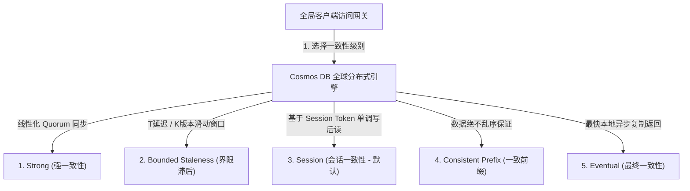
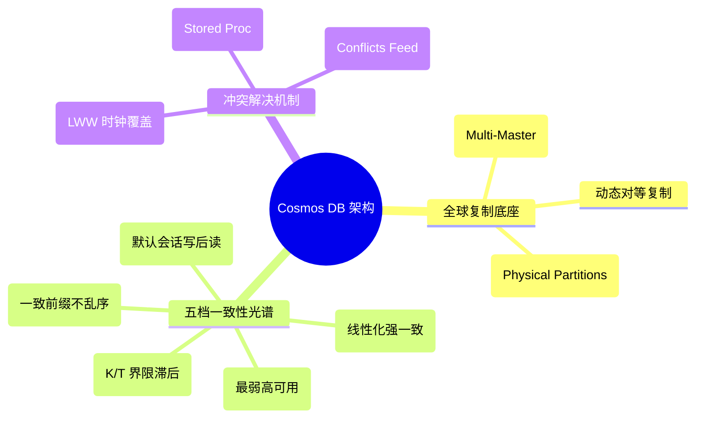
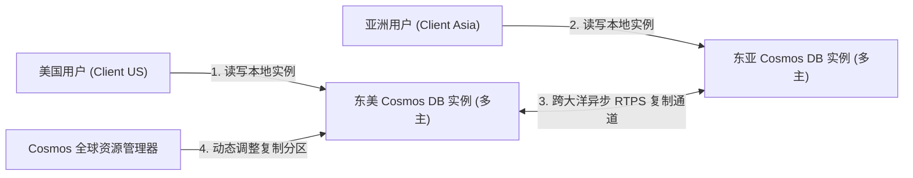
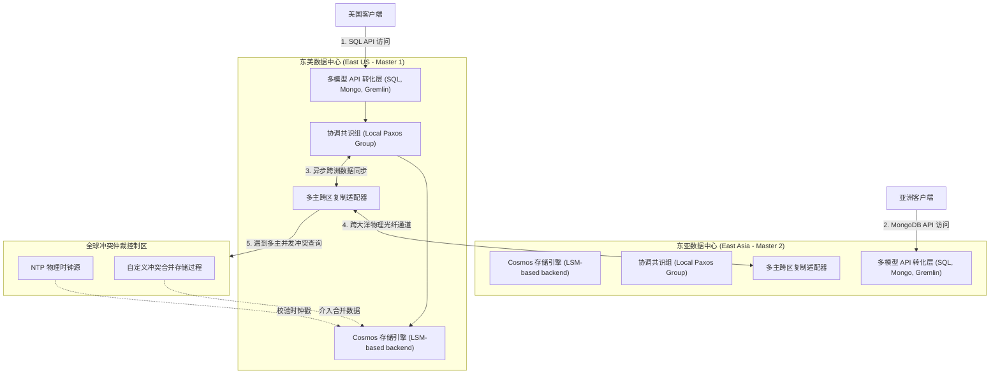
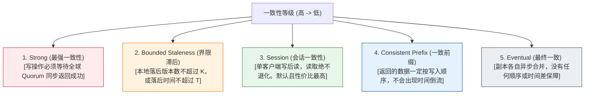
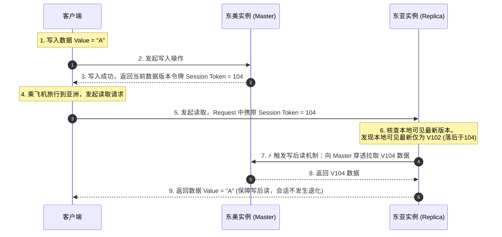
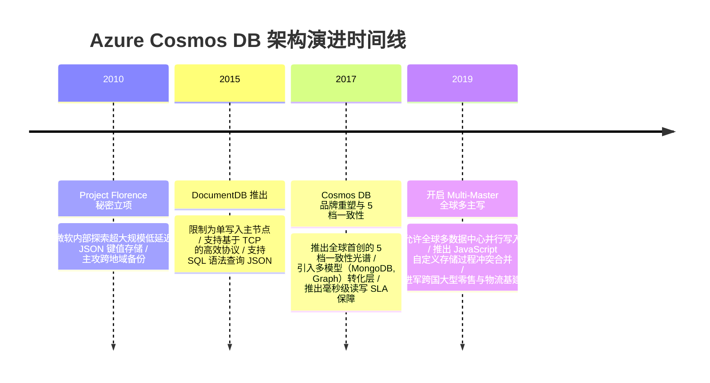

import CaseStudyHeader from '@site/src/components/CaseStudyHeader';
import DesignIntent from '@site/src/components/DesignIntent';
import ArchitectureEvolution from '@site/src/components/ArchitectureEvolution';
import TradeoffExplorer from '@site/src/components/TradeoffExplorer';
import GlossaryTerm from '@site/src/components/GlossaryTerm';
import ResearchNote from '@site/src/components/ResearchNote';
import QuizCard from '@site/src/components/QuizCard';
import CompareSlider from '@site/src/components/CompareSlider';
import GuidedExercise from '@site/src/components/GuidedExercise';
import PyRunner from '@site/src/components/PyRunner';

# Azure Cosmos DB：全球一致性光谱与多主复制架构

<CaseStudyHeader
  oneLiner="Azure Cosmos DB 打破了分布式系统非强即弱的一致性二元划分，通过数学形式化证明与工程微调，推出了横跨 CAP 鸿沟的五档精确定义的一致性光谱，配合多主（Multi-Master）全球异步写入冲突解决，为全球级超大规模云端存储设定了柔性控制的标准。"
  stats={[
    {label: '一致性档位', value: '5档微调 (Strong 至 Eventual)'},
    {label: '读写时延', value: 'SLA 保障 99% 个位数毫秒级'},
    {label: '复制拓扑', value: '全球多主副本写入 (Multi-Master)'},
    {label: '冲突解决', value: 'LWW 时钟 / 用户存储过程合并'},
    {label: 'API 模型', value: '多模型支持 (SQL, Mongo, Cassandra)'}
  ]}
/>

:::info 对应课程概念
本案例横跨 [Month 1 分布式网络与时延控制](../foundations/programming-systems-primer)、[Month 3 NoSQL 数据库索引设计与复制算法](../foundations/programming-systems-primer)、[Month 5 分布式事务与 CAP/PACELC 定理](../cloud-enterprise-industrial/capstone-cloud-native)。它是系统架构师理解全球规模下如何平衡一致性（Consistency）、可用性（Availability）与时延（Latency）的最核心必读案例。
:::

## 1. 设计初衷：如何跨越分布式一致性的“非黑即白”？

根据经典的 CAP 定理，在面临网络分区（Partition）时，分布式系统必须在 **强一致性（Consistency）** 和 **高可用性（Availability）** 之间做出非此即彼的抉择。

在大型全球分布式系统中：
- **强一致性（Strong Consistency）** 保证读取的数据绝对最新（即 <GlossaryTerm term="线性化 (Linearizability)" definition="Linearizability：线性化。强一致性的一种最高等级表现。它要求所有针对共享数据的操作看似在某个物理时间点瞬时发生，一旦写入操作返回成功，全球任何客户端之后的读取都必须看到该写入值，不允许读取旧状态。">线性化</GlossaryTerm>），但这意味着每一次写入都必须同步阻塞全球大多数数据中心副本。写入延迟极高，且一旦大洋底部的光缆被锚链拉断发生分区，整个系统写入立刻瘫痪。
- **最终一致性（Eventual Consistency）** 保证了极高的吞吐与极低的时延（写本地直接返回，后台异步传播），但在复制滞后期间，用户会读到陈旧乱序的数据。例如，用户在社交网络发贴，刷新页面后贴子瞬间消失，或者看到评论的先后顺序完全颠倒，体验极其糟糕。

微软 Azure Cosmos DB 的设计突破在于：**一致性并不是非黑即白的二元论，而是一个可以被精细度量的连续光谱**。

通过在“最强”与“最弱”之间开辟出三个高度实用的灰色地带，Cosmos DB 允许架构师根据社交、金融、购物车等具体场景，自由选择最契合的一致性水位，实现性能、可用性与正确性的帕累托最优（Pareto Optimum）。



<DesignIntent
  problem="如何在高可用与低时延的物理限制下，提供弹性的全球多数据中心复制，并向应用程序暴露符合业务体验的、可量化精确微调的五档一致性阶梯？"
  users="全球跨国电商系统架构师、大规模多人在线协作文档开发团队、高并发社交平台系统设计人员，对数据全球同步时延和一致性保障级别有高度敏感要求。"
  devices="跨洲分布的云端服务器集群、全球数十亿智能手机终端、金融支付网关。"
  goals={[
    '五档一致性光谱：支持 Strong、Bounded Staleness、Session、Consistent Prefix 和 Eventual，覆盖 CAP 和 PACELC 特性。',
    'Session 隔离与单调读：利用轻量 Session 令牌在客户端 cookie 中流转，提供写后读（Read-Your-Writes）保障，不增加跨洲同步损耗。',
    '多主全球并发写（Multi-Master）：允许全球任何数据中心同时接收同一行数据的写入，并在底层通过 LWW（最后写入者赢）或 Stored Procedure 执行自动解决冲突。',
    '个位数毫秒级 SLA 承诺：在任意一致性（除 Strong 外）下，保障单地读写 99% 时延小于 10 毫秒，可用性达 99.999%。'
  ]}
  constraints={[
    '强一致性的性能悬崖：选用 Strong 一致性后，写操作必须在全球跨洲副本达成共识（Sync Quorum），写时延会飙升至数百毫秒，且失去分区可用性。',
    '全球多主时钟同步损耗：采用 Last-Write-Wins 冲突合并需要高精度的物理时钟同步，极度依赖 NTP 稳定性。'
  ]}
  firstStep="深入拆解五档一致性的数学边界与数据可见性；理解 Session 令牌路由传递；设计 Python 模拟器分析各副本滞后带来的读偏差。"
/>

## 2. 系统功能全景

以下是 Azure Cosmos DB 全球一致性光谱与存储底座的技术全景图：



---

## 3. 最新架构总览

Cosmos DB 的全球多活读写拓扑与底层复制架构如下：

### 3a. System Context (系统上下文)



### 3b. Container Diagram (容器架构)



---

## 4. 核心机制拆解

### 4a. 调和一致性光谱五档明细 (Consistency Spectrum)

在 Cosmos DB 中，一致性不是非此即彼的，而是通过精心调和在 Latency/Availability 与 Consistency 之间滑动折中：



- **<GlossaryTerm term="Session 一致性" definition="Session Consistency：会话一致性。Cosmos DB 的默认一致性。在单一客户端会话内，保证‘写后读’和‘单调读写’。客户端在本地写入数据后，后续读取必定能看到自己写入的数据。对于其他会话是最终一致的。通过在传输中携带轻量会话令牌（Session Token）来实现。">Session 一致性</GlossaryTerm>** 实现了商业价值的甜点（Sweet Spot）：绝大多数 Web 应用（社交网络、购物车）只需要用户看到自己的修改即可，至于别的用户是多花了 1 秒还是 2 秒才同步看到，这并不妨碍使用。
- **<GlossaryTerm term="Bounded Staleness (界限滞后)" definition="Bounded Staleness：界限滞后一致性。规定本地副本读取的数据最多可以落后主写入端 K 个更新版本，或者滞后 T 时间窗口。在此窗口外，强制对齐强一致。适合既要求低延迟读，又必须严格限制旧数据范围的业务。">Bounded Staleness（界限滞后一致性）</GlossaryTerm>** 为金融或半强一致场景划定了绝对的安全滞后红线。
- **<GlossaryTerm term="Consistent Prefix (一致前缀)" definition="Consistent Prefix：一致前缀一致性。保证读者看到的数据绝对保持全局写入的发生顺序。比如写数据为 A->B->C，读者只可能读到空、A、AB、或 ABC，绝对不会看到 B->A 或者 C->A 这种乱序错觉。">Consistent Prefix（一致前缀一致性）</GlossaryTerm>** 是流式数据订阅和聊天消息队列不发生“乱序回溯”的保障底线。

### 4b. Session 一致性与会话令牌（Session Token）流转逻辑

Session 一致性不要求昂贵的服务器间全局同步，而是通过在客户端和服务器之间传递一个轻量级的 `Session Token` 即可实现写后读：



### 4c. 多主写入冲突解决机制 (Multi-Master Global Replication)

**<GlossaryTerm term="多主写入 (Multi-Master)" definition="Multi-Master Global Replication：全球多主写入。允许 Cosmos DB 位于不同国家的多个数据中心同时接收写入请求，写入各自提交后，在后台进行对等异步复制，通过特定冲突解决机制达成全局一致。">多主写入（Multi-Master）</GlossaryTerm>** 极大地降低了全球写入延迟（写本地数据中心即可返回），但也带来了并发写入冲突的挑战。Cosmos DB 提供两种核心冲突解决方法：
1. **Last-Write-Wins (LWW，最后写入者赢)**：利用高精度物理时钟（配合 NTP 矫正）。如果两个数据中心同时修改同一行，时钟戳更大的写入直接覆盖旧写入，简单粗暴但存在一定的时钟偏移隐患。
2. **Custom Stored Procedure (存储过程自定义合并)**：一旦检测到并发写入版本分叉，Cosmos DB 自动暂停该条目的异步合并，将其作为参数传入用户注册的 JavaScript 存储过程。由业务逻辑合并（如购物车合并商品数量），最后写回，实现了柔性可编程的冲突消解。

---

## 5. 关键数据结构与算法：会话令牌

在 Cosmos DB 中，会话令牌的设计通常是基于逻辑时钟向量的，它记录了各个 Partition 键在不同地域物理分区的提交序列号：

```cpp
struct SessionToken {
    uint32_t partition_key_range_id;  // 物理分区区间 ID
    uint64_t global_lsn;              // 全局日志逻辑序号 (Log Sequence Number)
    uint64_t regional_lsn[8];          // 各个地域副本上的本地区落后 LSN
};
```

*一致性核验算法伪代码*：
```c
bool isSessionConsistent(SessionToken client_token, SessionToken replica_token) {
    // 副本可见的最新 LSN 必须大于或等于客户端上次写入的 LSN
    if (replica_token.global_lsn >= client_token.global_lsn) {
        return true; // 本地副本已经同步了客户端写的数据，可以直接读本地，速度极快
    }
    return false; // 本地副本太旧，必须从 Master 或更近的同步副本穿透拉取
}
```

---

## 6. 架构演进史

Azure Cosmos DB 经历了从微软内部的 DocumentDB 单主数据库向全球多模型多活分布式底座的演进：



---

## 7. 架构对比

### Strong 一致性（同步 Quorum 阻塞） vs Session 一致性（默认会话令牌读写）

<CompareSlider
  before={
    <div style={{ padding: '20px', background: '#ffebee', border: '1px solid #c62828', borderRadius: '8px', height: '100%', color: '#333' }}>
      <strong>Strong 强一致性 (同步阻塞)</strong>
      <p style={{ marginTop: '10px', fontSize: '0.9rem' }}>
        写入操作必须同步广播至全球大多数（Quorum）数据中心并等待确认返回。写入时延受限于跨洲大洋海底光缆的物理光速传播延迟，通常高达 100~300ms。一旦光缆中断发生网络分区，整个数据库不可用。
      </p>
    </div>
  }
  after={
    <div style={{ padding: '20px', background: '#e8f5e9', border: '1px solid #2e7d32', borderRadius: '8px', height: '100%', color: '#333' }}>
      <strong>Session 会话一致性 (令牌写后读)</strong>
      <p style={{ marginTop: '10px', fontSize: '0.9rem' }}>
        写入本地数据中心即可瞬间返回成功（时延小于 10ms）。客户端携带生成的 Session Token。在本地副本滞后时，通过令牌穿透拉取最新数据。网络流量开销低，高并发下兼顾极低延迟与写后读安全体验。
      </p>
    </div>
  }
  labels={['Strong 强一致性', 'Session 会话一致性']}
/>

---

## 8. 核心决策的取舍

在超大规模分布式存储设计中，架构师对一致性级别和系统可用性具有细粒度调整策略：

<TradeoffExplorer
  title="Cosmos DB 五档一致性级别取舍"
  dimensions={['读取数据的 100% 绝对实时性', '个位数毫秒级极低读写时延', '全球网络分区下的写入高可用性', '读取数据的严格全局顺序保障', '跨地域同步流量与 CPU 开销']}
  options={[
    {
      name: 'Strong 一致性策略 (金融记账级别)',
      scores: [5, 1, 1, 5, 1],
      note: '要求线性化一致。写操作必须全球同步达成 Paxos 共识。完美防范任何双花（Double-Spending）和旧数据错觉，但写入时延极高（几百毫秒），且任何一跨大洋网络抖动都可能导致写入失败。',
      whenToUse: '跨国银行划拨交易、核心财务记账系统、高度严肃且不容忍任何微秒级数据分歧的核心共识服务。'
    },
    {
      name: 'Session 一致性策略 (Web & 社交默认首选)',
      scores: [3, 5, 5, 4, 4],
      note: '只在单个 Session 内部保证写后读和单调读，会话间最终一致。兼顾了个位数毫秒级的读写响应以及无单点抢占的写入可用性。最符合普通人类在使用互联网网页或 App 时的直观感官体验。',
      whenToUse: '全球电商购物车管理、社交网络个人信息与贴子编辑发布、用户设置项配置更新。'
    },
    {
      name: 'Bounded Staleness 一致性策略 (滑动窗口平衡模式)',
      scores: [4, 4, 3, 5, 2],
      note: '允许读操作落后，但限定落后版本数 K 或时间时间窗口 T。在此界限内能发挥低延迟读的性能，又能在副本严重落后时强制介入对齐，安全上限高，但需要在多地域间频繁同步版本水位。',
      whenToUse: '天气信息采集发布系统、全球物流轨迹路由跟踪、要求“最新”但允许微小滞后的监控数据大屏显示。'
    },
    {
      name: 'Eventual 最终一致性策略 (最强高并发模式)',
      scores: [1, 5, 5, 1, 5],
      note: '最弱的一致性策略。副本各自完全异步复制，允许读到过旧乱序的数据。系统吞吐量达到物理上限，且在极端灾难下网络几乎瘫痪时仍能确保写入可用。',
      whenToUse: '视频播放量点赞计数累计、非敏感设备日志异步汇总收集、大规模离线数据批处理。'
    }
  ]}
/>

---

## 9. 实践指引：实现一个带版本同步核查的 Cosmos DB 五档一致性仿真器

理解 5 种一致性级别的最好办法是模拟包含异步同步延迟（Lag Cycles）的全球三地域副本网络。在下方练习中，通过 Python 实现客户端数据写入，并对各副本应用不同 Lag 周期进行裁剪读取，直观展现五档一致性下读者能读到什么数据。

<GuidedExercise
  title="练习指引：实现全球三副本 Lag 滞后及五档一致性读写控制仿真"
  goal="构建包含 East_US (lag=0), West_Europe (lag=2), East_Asia (lag=5) 的 CosmosDB 实例。设计写入接口顺序写入 Map_v1 到 Map_v5。分别模拟亚洲用户在 4 种一致性级别（Strong, Bounded_Staleness, Session, Eventual）下的读取操作，通过判断本地副本可见性、版本滞后差和 Session 令牌大小，验证系统是如何输出正确的匹配版本。"
  hints={[
    '你可以用列表表示各副本的历史写入记录：`[(version, val, write_time)]`，并用一个全局整型时钟 `self.clock` 代表全局逻辑时间。',
    '东亚副本的可见时间限制为 `self.clock - 5`。若当前时钟为 5，它只能看到 V0（默认值）。',
    '界限滞后检查：如果全局最新版本比本地可见最新版本大出 3 个版本以上，触发滞后拦截，强行返回全局最新 - 3 的旧版本。'
  ]}
  steps={[
    '定义 `CosmosReplica` 类，维护副本所在地和同步滞后延迟周期。',
    '编写 `CosmosDBSimulator` 核心仿真器。',
    '实现 `write_data(value)`，累加全局时钟与版本，同步推送给副本历史。',
    '编写 `read_data(location, level, session_token)`：',
    '计算目标副本在当前滞后下的可见记录限制，找出本地可见最新数据。',
    '处理 `Strong`：直接越过本地限制，返回全局最新。',
    '处理 `Bounded_Staleness`：核验全局最新与本地最新版本差。若差值大于 3，退回返回全局最新 - 3 的溢出界限版本。',
    '处理 `Session`：如果传入的 `session_token` 大于本地可见最新，代表本地数据太旧退化，强行返回该 `session_token` 代表的旧写入数据（触发写后读保障）。',
    '处理 `Eventual`：直接返回本地可见最新。'
  ]}
  checks={[
    'Eventual 读东亚副本应当返回默认值 `Default_Val`（因为滞后了 5 周期，此时 V1-V5 均不可见）。',
    'Strong 读东亚副本应当跨过物理滞后，返回全局最新 V5。',
    'Bounded_Staleness 读东亚副本应当阻断 V0，安全返回 V2（因 V5 - V0 = 5 > 3，最大仅允许滞后 3，故返回 5 - 3 = 2）。',
    'Session 读东亚副本（带 Token V4）应当成功返回 V4。'
  ]}
/>

#### 交互式 Python 运行实验
在下方控制台中调试 Cosmos DB 仿真代码，观察五档柔性一致性是如何处理数据分歧的：

<PyRunner
  expect="分片路由与隔离验证成功"
  rows={25}
  code={`class CosmosReplica:
    def __init__(self, location: str, lag_cycles: int):
        self.location = location
        # 该副本同步滞后周期数
        self.lag_cycles = lag_cycles
        # 该副本存储的数据历史列表: [(version, val, timestamp)]
        self.history = [(0, "Default_Val", 0)]

class CosmosDBSimulator:
    def __init__(self):
        self.global_version = 0
        self.global_timeline = [] # 保存每一次全局写入 [(version, val, timestamp)]
        self.replicas = [
            CosmosReplica("East_US", lag_cycles=0),     # 主写入/零延迟副本
            CosmosReplica("West_Europe", lag_cycles=2), # 中度同步延迟副本
            CosmosReplica("East_Asia", lag_cycles=5)    # 重度同步延迟副本
        ]
        self.clock = 0

    def write_data(self, value: str):
        self.clock += 1
        self.global_version += 1
        record = (self.global_version, value, self.clock)
        self.global_timeline.append(record)
        
        # 实时更新各副本（在后台对等异步传播，此处直接推入历史，读取时再根据 lag 进行时空剪枝）
        for rep in self.replicas:
            rep.history.append(record)
            
        print(f"[Master Write] 全局时钟 t={self.clock} 写入数据 V{self.global_version} = '{value}'")

    def read_data(self, client_location: str, level: str, client_session_token: int = None) -> tuple:
        # 寻找对应的读取地域副本
        target_replica = None
        for rep in self.replicas:
            if rep.location == client_location:
                target_replica = rep
                break
        if not target_replica:
            target_replica = self.replicas[0]

        # 确定该副本在当前时钟 t 能看到的物理上限数据 (模拟异步复制延迟)
        visible_time_limit = self.clock - target_replica.lag_cycles
        local_visible_records = [r for r in target_replica.history if r[2] <= visible_time_limit]
        if not local_visible_records:
            local_visible_records = [(0, "Default_Val", 0)]
            
        local_latest = local_visible_records[-1] # 本地副本能看到的最新数据
        global_latest = self.global_timeline[-1] if self.global_timeline else (0, "Default_Val", 0)

        print(f"   [Local Info] 客户位于 '{client_location}'，本地副本可见最新为 V{local_latest[0]}，全局最新为 V{global_latest[0]}")

        # 按照 5 种不同一致性级别做控制返回：
        if level == "Strong":
            # 强一致性：必须返回全局最新值。如果本地副本还没同步到，读操作必须阻塞等待或从主节点穿透拉取
            print(f"   -> 🔒 [Read Strong] 强一致性读：保障线性化。返回全局最新 V{global_latest[0]} = '{global_latest[1]}'")
            return global_latest

        elif level == "Bounded_Staleness":
            # 界限滞后一致性：允许读取落后，但滞后版本数不能超过限制 K (假设最大滞后 3 个版本)
            max_allowed_staleness = 3
            version_diff = global_latest[0] - local_latest[0]
            if version_diff > max_allowed_staleness:
                # 本地副本太旧了，界限滞后保护触发，强制返回最大允许的边界旧数据
                fallback_ver = global_latest[0] - max_allowed_staleness
                fallback_record = [r for r in self.global_timeline if r[0] == fallback_ver][0]
                print(f"   -> ⚠️ [Read BoundedStaleness] 本地 V{local_latest[0]} 滞后全局达 {version_diff}。触发滞后保护红线，退回返回 V{fallback_record[0]} = '{fallback_record[1]}'")
                return fallback_record
            else:
                print(f"   -> [Read BoundedStaleness] 本地 V{local_latest[0]} 满足滞后窗口。返回 V{local_latest[0]} = '{local_latest[1]}'")
                return local_latest

        elif level == "Session":
            # 会话一致性：写后读。如果客户端 session_token 大于本地副本可见最新版本，强行穿透返回客户端的 session_token 版本
            if client_session_token and client_session_token > local_latest[0]:
                session_record = [r for r in self.global_timeline if r[0] == client_session_token][0]
                print(f"   -> ⚡ [Read Session] 写后读保障触发！本地可见 V{local_latest[0]} 旧于客户端 Session 令牌 V{client_session_token}，穿透拉取返回会话数据 V{session_record[0]} = '{session_record[1]}'")
                return session_record
            else:
                print(f"   -> [Read Session] 本地可见 V{local_latest[0]} 满足会话契约。返回 V{local_latest[0]} = '{local_latest[1]}'")
                return local_latest

        elif level == "Eventual":
            # 最终一致性：直接返回本地副本可见的最新，哪怕极旧
            print(f"   -> 🌐 [Read Eventual] 最终一致性读：返回本地可见最新 V{local_latest[0]} = '{local_latest[1]}'")
            return local_latest

# 执行仿真
db = CosmosDBSimulator()
db.write_data("Map_v1")
db.write_data("Map_v2")
db.write_data("Map_v3")
db.write_data("Map_v4")
db.write_data("Map_v5") # 全局目前最新是 V5，时钟 t=5

# 模拟亚洲客户端访问东亚副本 (lag_cycles = 5)
# 在时钟 t=5 时，东亚副本因为滞后 5 周期，可见时间 limit = 0。所以本地只能看到 V0 默认值

print("\n--- 1. Eventual 最终一致性读测试 (访问东亚副本) ---")
db.read_data(client_location="East_Asia", level="Eventual")

print("\n--- 2. Strong 强一致性读测试 (访问东亚副本) ---")
db.read_data(client_location="East_Asia", level="Strong")

print("\n--- 3. Bounded Staleness 界限滞后读测试 (最大容忍滞后 3 个版本) ---")
db.read_data(client_location="East_Asia", level="Bounded_Staleness") # 全局 V5，东亚可见 V0。滞后为 5 > 3，触发 Bounded，返回全局 V(5-3) = V2

print("\n--- 4. Session 会话写后读测试 (客户端曾写入 V4，持有 token V4) ---")
db.read_data(client_location="East_Asia", level="Session", client_session_token=4) # 触发写后读机制，返回 V4
`}
/>

---

## 10. 知识自测

完成自测以检验你对 Azure Cosmos DB 调和一致性光谱、会话令牌写后读以及多主冲突合并的掌握程度：

<QuizCard
  questions={[
    {
      q: '在分布式一致性光谱中，Cosmos DB 默认且也是使用最广泛、性价比最高的一致性级别是哪一个？',
      options: [
        'A. Strong 一致性，因为它保证全球数据 100% 同步绝对新鲜',
        'B. Eventual 一致性，因为它的时延是绝对最低的',
        'C. Session（会话一致性），因为它在单客户端会话内保证写后读（Read-Your-Writes），使得用户读到自己所写的数据，同时对其他客户端维持最终一致，完美平衡了时延与体验',
        'D. Consistent Prefix，因为它能在不使用网络的情况下建立直接连接'
      ],
      answer: 2,
      explain: 'Session（会话一致性）是 Cosmos DB 的默认且甜点级配置。它巧妙避开了昂贵的跨洲强同步锁，用轻量会话令牌在单客户端实现写后读防抖，对其他用户则保证最终一致，最符合社交、设置更新等 Web 感官体验。'
    },
    {
      q: '关于 Bounded Staleness（界限滞后一致性），下列说法中哪一项是正确的？',
      options: [
        'A. 它不允许副本有任何滞后，要求和 Strong 完全一样',
        'B. 它规定读取的数据最多可以落后主节点 K 个修改版本，或者 T 时间窗口，在此界限外读取会强行阻塞以防获取过旧数据，为一致性提供了防退化的底线红线保障',
        'C. 它会在读取到旧数据时强行导致物理机器发生看门狗重启',
        'D. 它将所有的 JSON 文档存储自动转化为 SQL 二进制文件'
      ],
      answer: 1,
      explain: 'Bounded Staleness 是强弱一致性间的优秀妥协。它设定了明确的版本差 K 或时间差 T 围栏，在围栏之内享受低延迟读取，一旦落后超出限制则强行拦截对齐，提供高可控的数据保鲜期。'
    },
    {
      q: '在多主并发写入（Multi-Master）场景下，一旦两个地域的数据中心同时修改同一行数据产生版本冲突，Cosmos DB 可以通过什么机制灵活合并业务分叉？',
      options: [
        'A. 强行删除这行数据，并向全球用户抛出致命断连异常',
        'B. 自动锁定两个数据中心，直到管理员坐飞机去本地拉闸重启',
        'C. 采取 LWW（最后写入者赢）基于时钟戳覆盖，或者允许用户注册用 JavaScript 编写的“自定义冲突合并存储过程”，在分叉时自动介入合并业务逻辑（如购物车累加）',
        'D. 将冲突的数据直接以加密包形式回传给微软总部进行人工审计'
      ],
      answer: 2,
      explain: 'Cosmos DB 提供了灵活的冲突处理机制。简单的场景可以用 Last-Write-Wins (LWW) 物理时钟判定直接覆盖，而复杂的业务（如购物车）可以使用可编程的 Custom Stored Procedure 进行柔性数据合并，避免了数据丢失。'
    }
  ]}
/>

## 来源

- [Azure Cosmos DB Tunable Consistency Levels Specification (Microsoft Technical Whitepapers)](https://learn.microsoft.com/en-us/azure/cosmos-db/consistency-levels)
- [A Globally Distributed Multi-Model Database Service: Azure Cosmos DB Design (ACM SIGMOD Conference)](https://dl.acm.org/doi/10.1145/3035918.3056104)
- [TLA+ Formal Attestation of Global Consistency Models in Cosmos DB (Microsoft Research)](https://www.microsoft.com/en-us/research/publication/tla-formal-attestation-cosmos-db/)
- [PACELC Theorem Tradeoffs in Globally Distributed Storage Systems (Daniel J. Abadi)](https://www.cs.umd.edu/~abadi/)
