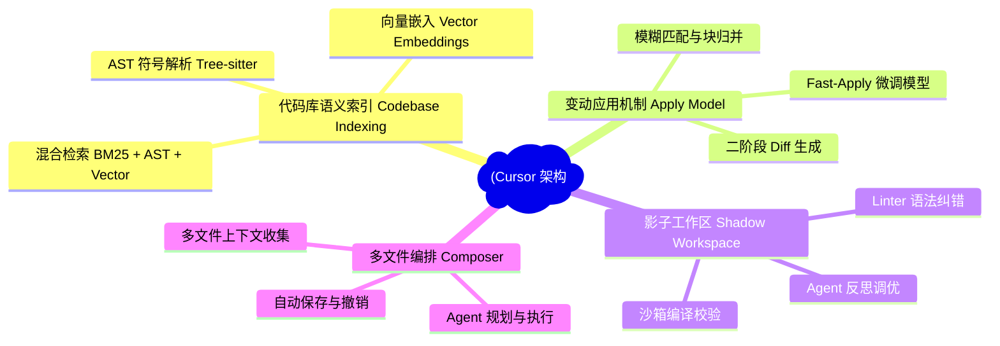
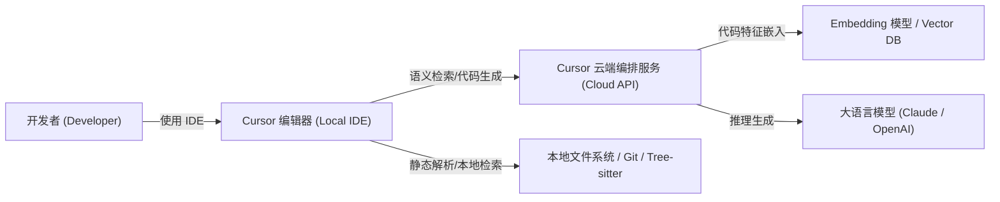
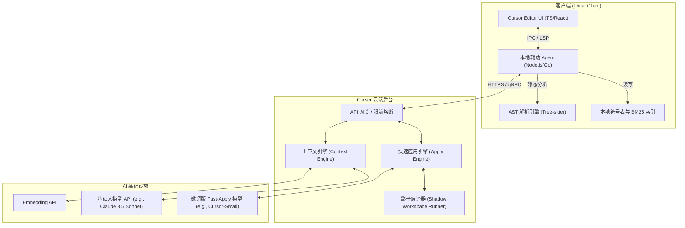
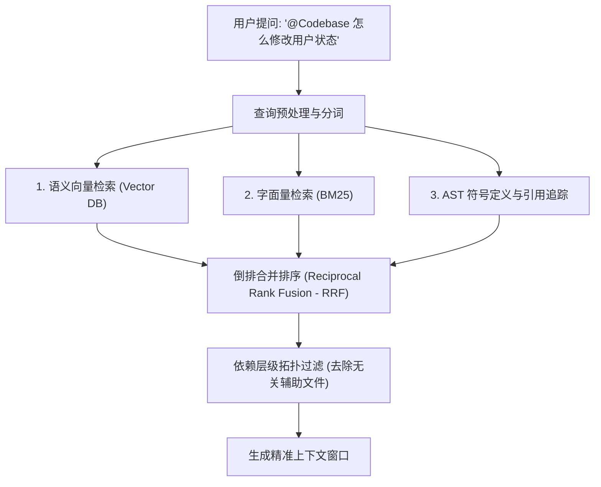
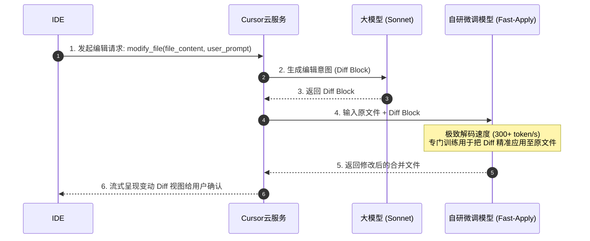
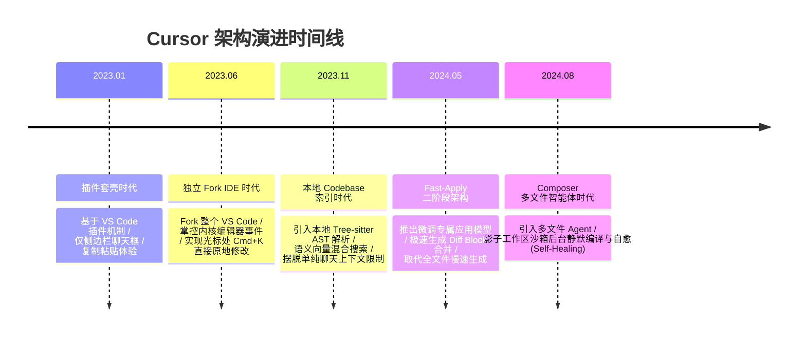

import CaseStudyHeader from '@site/src/components/CaseStudyHeader';
import DesignIntent from '@site/src/components/DesignIntent';
import ArchitectureEvolution from '@site/src/components/ArchitectureEvolution';
import TradeoffExplorer from '@site/src/components/TradeoffExplorer';
import GlossaryTerm from '@site/src/components/GlossaryTerm';
import ResearchNote from '@site/src/components/ResearchNote';
import QuizCard from '@site/src/components/QuizCard';
import CompareSlider from '@site/src/components/CompareSlider';
import GuidedExercise from '@site/src/components/GuidedExercise';
import PyRunner from '@site/src/components/PyRunner';

# Cursor：IDE 与大模型的共生架构

<CaseStudyHeader
  oneLiner="Cursor 通过定制 IDE 客户端与云端 AI 编排层的深度协同，证明了最智能的编程体验来自『代码库语义索引（嵌入+AST）』、『影子工作区』与『快速应用模型（Fast-Apply）』的结合。"
  stats={[
    {label: '发布时间', value: '2023 年'},
    {label: '活跃用户', value: '百万级开发者'},
    {label: '检索方式', value: 'AST 符号 + 向量 + BM25 混合'},
    {label: '核心技术', value: 'Tree-sitter, Fast-Apply Model, Shadow Workspace'},
    {label: '补全延迟', value: 'Tab 补全 < 200ms'}
  ]}
/>

:::info 对应课程概念
本案例横跨 [Month 8 RAG 检索增强](../rag/why-rag)、[Month 9 Agent 智能体架构](../agent-architectures/agent-loop-basics)、[Month 5 核心组件](../core-components/api-gateway)。它展示了如何用系统工程手段，将一个会幻觉、吞吐低的大模型，包裹成一个工业级可用的极速辅助编程工具。
:::

## 1. 设计初衷：从“聊天框复制粘贴”到“代码库无缝编辑”

在 GitHub Copilot（单向补全）与 ChatGPT（聊天框对话）流行之后，开发者面临一个痛点：大模型给出的代码，需要人肉复制、寻找对应文件、手动合并，并且由于模型缺乏整个代码库的符号依赖上下文，生成的代码经常“编译报错”。

Cursor 的起点四问回答如下：

<DesignIntent
  problem="让 AI 能够真正理解数十万行的大型私有代码库，支持精准的多文件自动编辑（Composer）与毫秒级的高成功率代码应用（Apply），消除人肉复制粘贴。"
  users="软件工程师、独立开发者，日常维护复杂代码库，对代码隐私、响应延迟、编译成功率有极高要求。"
  devices="定制的 IDE 编辑器客户端（基于 VS Code 开源版 Fork）与云端高并发 AI 编排/影子编译服务器的紧密协同。"
  goals={[
    '代码库语义检索：秒级定位最相关的函数、类型和定义',
    '高成功率代码合入（Fast-Apply）：模型生成的 Patch 必须精准应用，不破坏现有代码结构',
    '多文件自动编排：能跨越多个关联文件自动推导和生成修改',
    '超低延迟 Tab 补全：智能预测下一步光标移动和输入'
  ]}
  constraints={[
    '大模型上下文窗口有限，无法直接塞入整个项目代码',
    '生成整个文件速度极慢，且浪费 Token 成本，必须生成局部 Diff',
    '代码存在复杂的编译依赖（Typecheck），AI 生成的局部改动容易导致整体编译失败',
    '数据不出域及隐私合规约束'
  ]}
  firstStep="Fork VS Code 以控制 IDE 最底层的文档编辑与光标事件；在本地用 Tree-sitter 进行轻量级 AST 解析；在云端建立代码库嵌入索引服务（Codebase Indexing）；设计二阶段生成与影子工作区校验，确保应用代码的准确度。"
/>

## 2. 系统功能全景

以下是 Cursor 系统的核心功能与技术构成的全景图：

---

## 3. 最新架构总览

Cursor 采用本地客户端与云端服务深度绑定的双环架构：

### 3a. 系统上下文图 (System Context)

### 3b. 容器架构图 (Container)

---

## 4. 核心机制拆解

### 4a. 代码库语义索引与混合检索 (Codebase Indexing)

Cursor 并不仅仅依赖单纯的向量搜索。因为向量搜索很难捕捉精准的符号引用（例如“找出调用了 `userService.getUser` 的所有地方”）。

Cursor 在本地利用 <GlossaryTerm term="Tree-sitter" definition="一个现代的、支持多语言的、增量解析的抽象语法树（AST）生成工具。它能在文件编辑时毫秒级更新语法树，常用于语法高亮、代码折叠与符号提取。">Tree-sitter</GlossaryTerm> 提取文件中的**类、方法、参数和依赖关系**，构建符号依赖图。再配合文本分片生成 <GlossaryTerm term="Vector Embedding" definition="通过深度学习模型将文本段落映射为高维数值向量，用于度量语义相似度。">向量嵌入（Embeddings）</GlossaryTerm>。

当用户在聊天框或编辑区输入时，上下文引擎会执行**混合检索 (Hybrid Search)**：

<ResearchNote
  title="混合语义检索的必要性"
  source="Sentence-BERT: Sentence Embeddings using Siamese BERT-Networks"
  href="https://arxiv.org/abs/1908.10084"
  insight="虽然句子向量模型（Sentence Embeddings）在捕捉高维语义上表现优秀，但在遇到特定的代码符号、短方法名或精准类名时，字面量（BM25）与编译符号（AST）的准确率是高维向量无法替代的。两者混合检索能将代码定位准确率提升 40% 以上。"
  application="在设计代码级 RAG 时，不可单纯使用向量检索。必须在客户端提取 AST 符号树，建立基于符号引用与关键字（BM25）的复合关联，再利用 <GlossaryTerm term='RRF' definition='Reciprocal Rank Fusion (互惠排名融合)，一种把向量检索与 BM25 字面量检索等多个检索源各自输出的候选列表按排名分值进行加权合并，从而完成统一重排的无监督算法。'>RRF</GlossaryTerm> 进行重排合并。"
/>

### 4b. 二阶段代码快速应用与微调模型 (Fast-Apply)

让主力模型（如 Claude 3.5 Sonnet）生成长达数千行的完整代码文件极其缓慢，且 Token 成本高昂。Cursor 引入了**二阶段生成架构**：

1. **第一阶段 (Generation)**：主力大模型接收上下文，仅输出编辑指令的 **<GlossaryTerm term="Diff Block" definition="一种以增量变动（如 Git diff 或 SEARCH/REPLACE 块）表示代码修改的格式，用来替代完整文件的输出，以大幅节省大模型生成的耗时与 Token 成本。">Diff Block</GlossaryTerm>**（类似于 Git Diff，包含变动标记与少量上下文）。
2. **第二阶段 (Fast-Apply)**：Cursor 自研的微调小模型（如 `cursor-small`）或专用快速模型接收“原文件 + Diff Block”，以数百 Token/秒的速度执行快速合并，生成应用后的新代码。

### 4c. 影子工作区与自动校验 (Shadow Workspace)

即便大模型生成的代码语法无误，也常常由于缺少 import、类型不匹配等导致整体项目编译失败。为了提高**<GlossaryTerm term="Composer" definition="Cursor 中的多文件自动编辑功能，由 AI 智能体规划变动步骤并跨项目中的多个关联文件自动执行代码修改。">自动修改（Composer）</GlossaryTerm>**的成功率，Cursor 在云端或本地建立了一个 <GlossaryTerm term="Shadow Workspace" definition="影子工作区：一个隔离的、轻量级的沙箱目录，用于在后台静默复制用户的项目代码，并在该沙箱中运行编译、类型检查（Typecheck）与 Linter 检查，以校验 AI 代码的可运行性。">影子工作区（Shadow Workspace）</GlossaryTerm>。

在多文件自动生成过程中，Cursor 会在后台把修改应用 to 影子工作区，并自动运行 `npm run build`、`tsc` 或 `linter`。如果编译报错，系统会将报错日志喂回给 Agent，让其自动修复（Self-Correction），直到通过编译或达到最大尝试次数，最后才呈现给用户。

---

## 5. 架构演进史

Cursor 从一个简单的插件套壳，演进到今天能进行复杂多文件编排的 AI IDE：

---

## 6. 架构对比

### 传统 AI 聊天模式 vs Cursor 深度共生模式

<CompareSlider
  before={
    

      <strong>传统 AI 聊天复制粘贴模式</strong>
      

        用户在网页或侧边栏与大模型聊天，大模型吐出 Markdown 代码块。用户必须手动寻找对应文件，小心选择对应行，进行粘贴合并，极易错行或引起语法、缩进报错。
      

    

  }
  after={
    

      <strong>Cursor IDE 深度共生模式</strong>
      

        大模型仅输出 Diff 指令，微调的高速 Fast-Apply 模型在后台毫秒级与本地编辑器缓冲区直接融合，以 Diff 视图直观呈现，并自动在影子沙箱进行编译校验。
      

    

  }
  labels={['传统聊天框', 'Cursor 深度共生']}
/>

---

## 7. 权衡：核心决策的取舍

Cursor 团队在工程设计上经历了多次技术取舍：

<TradeoffExplorer
  title="代码库语义检索架构取舍"
  dimensions={['检索速度', '本地隐私安全', '召回准确率', '显存与存储占用', '跨文件分析能力']}
  options={[
    {
      name: '纯本地索引 (基于 Tree-sitter + 本地轻量向量)',
      scores: [5, 5, 2, 4, 2],
      note: '数据完全不出域，无网络延迟。但受限于本地算力，只能做粗粒度的词法提取和向量计算，复杂的语义关系容易漏召回。',
      whenToUse: '对代码数据绝对隐私敏感、网络受限或离线工作的场景。'
    },
    {
      name: '纯云端索引 (将全部代码同步至云端 Vector DB/知识图谱)',
      scores: [3, 1, 5, 2, 5],
      note: '利用云端重型 GPU 跑精细的跨文件依赖模型，检索质量极高。但每次代码变动都需要庞大的上传流量，且存在隐私隐患。',
      whenToUse: '在公有云上开发开源项目或大中型且能接受代码上传的非保密项目。'
    },
    {
      name: 'Cursor 采用的混合检索 (本地 AST 提取 + 局部差异云端对齐)',
      scores: [4, 3, 4, 3, 4],
      note: '在本地用 Tree-sitter 快速提取依赖网和 BM25 索引，仅把需要语义理解的局部上下文和变更分片加密发送至云端，兼顾性能与安全。',
      whenToUse: '主流现代化 AI 编辑器（Cursor 生产级实际选择）。'
    }
  ]}
/>

---

## 8. 如果是你来设计：写一个 Mini Diff 快速应用器

在 Cursor 架构中，快速把大模型生成的 Diff 块应用到源文件中是提升体验的关键。

打开 `labs/month08/m8l2_embeddings/` 文件夹（或在下方练习中），实现一个简易的快速应用器（Fast-Apply Parser），它能够解析 Diff 块并将其合并入原始代码中。

<GuidedExercise
  title="练习指引：实现一个简单的 Diff 合并应用器"
  goal="解析大模型输出的简单 Diff 块 (包含 <<<<<< SEARCH / ====== / >>>>>> REPLACE)，并将其正确合入源文件。"
  hints={[
    'SEARCH 块必须在源文件中精确或模糊匹配。',
    'REPLACE 块将替换 SEARCH 块的内容。',
    '注意多行文本的换行符 (\n 或 \r\n) 对齐。',
    '如果找不到 SEARCH 块，抛出 MergeConflict 异常。'
  ]}
  steps={[
    '定义一个 `fast_apply(original_code: str, diff_text: str) -> str` 函数。',
    '用正则表达式提取出 `<<<<<<< SEARCH\n(.*?)\n=======\n(.*?)\n>>>>>>> REPLACE` 中的 SEARCH 文本与 REPLACE 文本。',
    '在 `original_code` 中寻找 SEARCH 文本，用 REPLACE 文本替换。',
    '编写测试用例验证包含缩进的修改、多行修改是否能被精准合入。'
  ]}
  checks={[
    '你能正确替换文本并保持原有的缩进。',
    '如果原文件有多处相同的代码，你能正确根据上下文（SEARCH 块周围的代码）限定只替换指定位置。',
    '你能解释为什么二阶段生成 (Diff + Apply) 比直接让大模型输出整个文件要快得多。'
  ]}
/>

#### 交互式 Python 运行实验
在下方控制台中运行并修改已准备好的二阶段 Fast-Apply 合并器仿真代码，体验如何通过增量 Diff 块快速更新原始文件：

<PyRunner
  expect="Fast-Apply 合并验证成功"
  rows={25}
  code={`import re

def fast_apply(original_code: str, diff_text: str) -> str:
    # 使用正则表达式提取 SEARCH 和 REPLACE 块（支持跨行匹配）
    pattern = r"<<<<<<< SEARCH\\n(.*?)\\n=======\\n(.*?)\\n>>>>>>> REPLACE"
    match = re.search(pattern, diff_text, re.DOTALL)
    if not match:
        raise ValueError("Diff 格式非法！必须包含 SEARCH/REPLACE 边界。")
    
    search_block = match.group(1)
    replace_block = match.group(2)
    
    # 验证 SEARCH 块是否存在于原文件中
    if search_block not in original_code:
        raise ValueError("合并冲突：在原文件中未找到匹配的 SEARCH 块！")
    
    # 执行块合并替换
    modified_code = original_code.replace(search_block, replace_block, 1)
    return modified_code

# 模拟原始文件代码
original_source = """def get_user_status(user):
    if user.is_active:
        return "Active"
    else:
        return "Inactive"
"""

# 模拟大模型输出的增量修改意图 (Diff Block)
diff_intent = """<<<<<<< SEARCH
    if user.is_active:
        return "Active"
    else:
        return "Inactive"
=======
    if user.is_active:
        return "Active"
    if user.is_suspended:
        return "Suspended"
    return "Inactive"
>>>>>>> REPLACE"""

print("=== 原始文件内容 ===")
print(original_source.strip())

print("\\n=== AI 吐出的增量 Diff ===")
print(diff_intent)

try:
    new_source = fast_apply(original_source, diff_intent)
    print("\\n=== 二阶段 Fast-Apply 合并后文件 ===")
    print(new_source.strip())
    print("\\n✅ Fast-Apply 合并验证成功！")
except Exception as e:
    print(f"\\n❌ 合并失败: {e}")
`}
/>

---

## 9. 知识自测

为了检验你对本章 Cursor IDE 语义索引、影子工作区与快速应用模型等弹性设计理念的掌握情况，请完成以下自测题目：

<QuizCard
  questions={[
    {
      q: '在 Cursor 架构中，为什么不直接使用 Claude 3.5 Sonnet 大模型来生成修改后的完整文件，而是采用“二阶段 Fast-Apply”架构？',
      options: [
        'A. 因为 Sonnet 模型无法读取本地文件系统，只能由微调小模型进行物理 IO 操作',
        'B. 因为直接生成完整长文件极其缓慢（受模型吞吐速度限制）且消耗大量 Token；二阶段架构中 Sonnet 只需生成少量的 Diff 变动，再由专门微调的 Fast-Apply 模型在本地或云端极速解码进行块合并，大幅减少延迟和成本',
        'C. 因为 Sonnet 模型不支持 Git 格式的输出',
        'D. 因为二阶段架构能彻底杜绝代码的隐私泄露问题'
      ],
      answer: 1,
      explain: '大模型生成 Token 的速度（通常 50-100 t/s）在处理上千行的完整文件时会引入数十秒的延迟。二阶段架构下，第一阶段让高智力大模型输出几十行核心的 Diff 片段，第二阶段用微调的轻量级小模型（速度可达 300-500 t/s）执行把 Diff 缝合回原文件的机械性动作，兼顾了智商、速度与经济性。'
    },
    {
      q: 'Cursor 在云端运行的“影子工作区（Shadow Workspace）”在智能体多文件自动修改（Composer）中起到了什么作用？',
      options: [
        'A. 用于将用户的代码悄悄备份到第三方云盘中以防丢失',
        'B. 提供一个完全隔离的后台沙箱，在 AI 修改代码后自动运行编译、静态分析与类型检查（tsc/linter），如若报错则自动反馈给 AI 重新修正，确保最终呈现给用户的是可正常编译的代码',
        'C. 用于给最终生成的软件界面进行自动化 UI 截图测试',
        'D. 替代用户的本地计算资源，把用户的本地编辑器变成纯网页瘦客户端'
      ],
      answer: 1,
      explain: '影子工作区是一个后台静默运行的验证沙箱。大模型生成的代码经常引入语法、类型或导入包报错，这是由于缺乏跨文件的实时编译感知。Cursor 将改动应用在影子工作区中进行编译测试，能自动捕获报错并喂给 AI 自动纠错（Self-Correction），大幅提升了多文件协作（Composer）的代码合入成功率。'
    },
    {
      q: '在代码库检索（Codebase Indexing）中，为什么单纯依靠向量搜索（Vector Search）无法完美解决所有的代码查找需求？',
      options: [
        'A. 因为向量数据库无法存储超过 100 行的代码文件',
        'B. 因为代码包含大量的特定符号、方法名和类名依赖关系（例如寻找 Service 的接口实现类），向量检索基于高维语义相似度，极其容易召回语义接近但类名无关的代码，必须依靠 Tree-sitter AST 解析出的精确符号引用图与字面量进行混合检索',
        'C. 因为向量搜索对英文支持极差，而编程语言都是英文',
        'D. 因为向量搜索在本地运行会导致 CPU 占用率瞬间爆表，只能在云端运行'
      ],
      answer: 1,
      explain: '代码是一种强结构、逻辑严密的文本。向量搜索只看语义上的关联，无法应对类似“查找所有实现了 IUser 接口的类”或“精确查找 test_user 方法的定义”等编译级或符号级硬关联。必须结合 Tree-sitter 静态提取的符号依赖树和字面量（BM25），与语义向量形成三路混合检索，才能精准捕捉上下文。'
    }
  ]}
/>

## 来源

- [Tree-sitter 官方文档与增量解析原理](https://tree-sitter.github.io/tree-sitter/)
- [Sentence-BERT 句向量网络与语义相似检索](https://arxiv.org/abs/1908.10084)
- [Anyscale: Continuous Batching & Diff Merge Acceleration in IDEs](https://www.anyscale.com/blog/continuous-batching-llm-inference)
- [vLLM: Efficient Memory Management for LLM Serving (SOSP '23)](https://arxiv.org/abs/2309.06180)
- [Cursor Blog: How We Build Cursor - Codebase Indexing & Apply Models](https://www.cursor.com/blog)