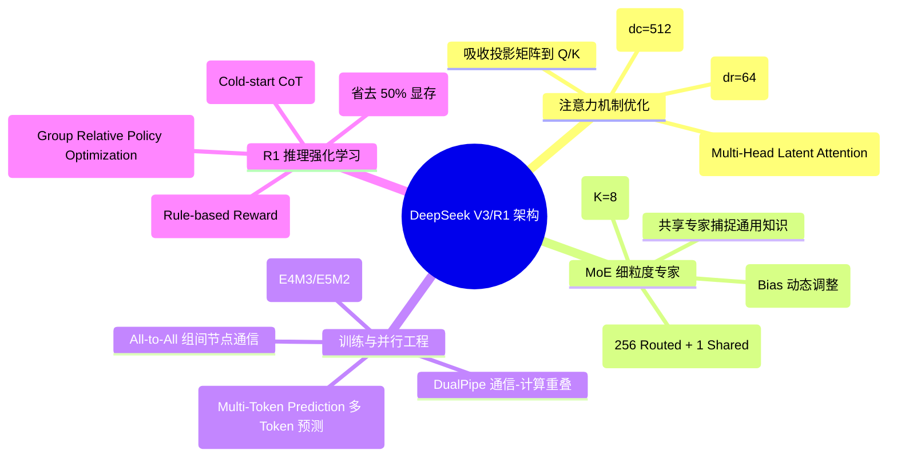
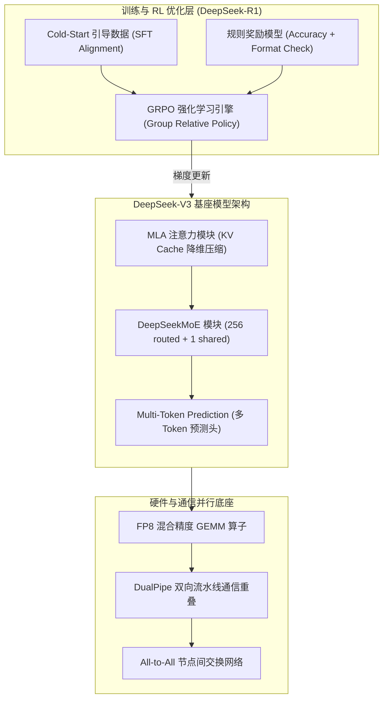
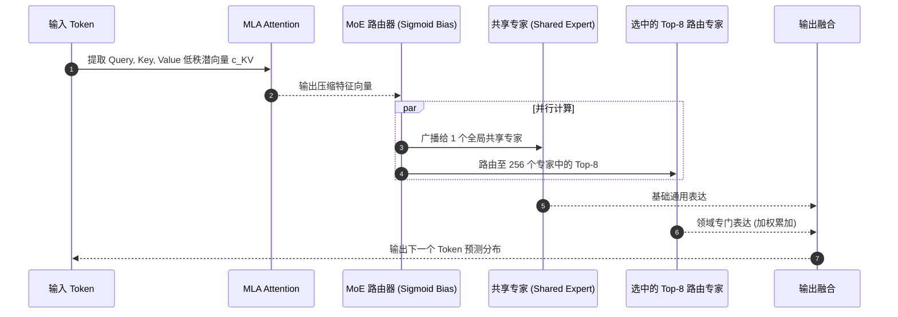
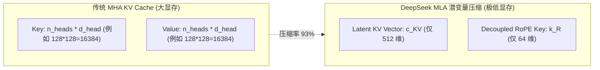

import CaseStudyHeader from '@site/src/components/CaseStudyHeader';
import DesignIntent from '@site/src/components/DesignIntent';
import EvolutionTimeline from '@site/src/components/EvolutionTimeline';
import CompareSlider from '@site/src/components/CompareSlider';
import TradeoffExplorer from '@site/src/components/TradeoffExplorer';
import GuidedExercise from '@site/src/components/GuidedExercise';
import QuizCard from '@site/src/components/QuizCard';
import GlossaryTerm from '@site/src/components/GlossaryTerm';
import ResearchNote from '@site/src/components/ResearchNote';

# DeepSeek V3 / R1：MLA 键值压缩、DeepSeekMoE 与 GRPO 强化学习推理架构

<CaseStudyHeader
  oneLiner="DeepSeek-V3/R1 凭一己之力重塑了大模型训练与推理的成本收益曲线。通过 Multi-Head Latent Attention (MLA) 将 KV Cache 压缩 93%、DeepSeekMoE 细粒度路由与无损负载均衡、DualPipe 全重叠通信以及 GRPO 纯规则强化学习，DeepSeek 实现了以仅 600 万美元训练成本对标顶级闭源模型的工程奇迹。"
  stats={[
    {label: '总参数量 / 激活参数', value: '671B 参数 / 每次激活 37B'},
    {label: 'KV Cache 压缩率', value: 'MLA 低秩投影减少 93% KV 显存'},
    {label: '专家架构', value: '256 routed 专家 + 1 shared 专家'},
    {label: '强化学习算法', value: 'GRPO (Group Relative Policy Optimization)'},
    {label: '训练精度与通信', value: 'FP8 混合精度 + DualPipe 重叠'},
    {label: '训练总成本', value: '约 557.6 万 H800 GPU Hours ($6M)'}
  ]}
/>

:::info 对应课程概念
本案例主要映射 [Month 7 大语言模型系统]（KV Cache 瓶颈与 Attention 优化）、[Month 11 生产级 AI 平台]（MoE 分布式路由与并行）及 [K1. vLLM](./vllm.mdx) 与 [K4. Megatron-LM](./megatron-lm.mdx)。
:::

## 1. 设计初衷：打破 Scaling Law 的算力与内存高墙

传统 Transformer 模型在超长上下文与万亿参数训练下面临两大致命痛点：
1. **KV Cache 显存打爆**：多头注意力（MHA）在 Batch Size 变大和 Context 变长时，KV 显存迅速超越模型权重本身，限制了并发与吞吐。
2. **算力与通信开销昂贵**：密集模型（Dense）对每个 Token 都激活全部参数，且跨节点 All-to-All 通信导致 GPU 频繁等待传输。

<DesignIntent
  problem="如何在受限的算力集群（如 H800 / PCIe 限制）上，训练并高效部署 600B+ 级别的超级大模型与推理模型？"
  users="全球开发者、企业级 AI 部署团队及大模型研究员。"
  devices="NVIDIA H800 / H100 / A100 GPU 集群与高性能 Infiniband / RoCE v2 网络。"
  goals={[
    '极致显存压缩：把 KV Cache 尺寸降低一个数量级，使单机支持超大 Batch Size 吞吐',
    '高精专家路由：采用细粒度 MoE，在不牺牲模型能力的前提下显著降低计算量',
    '通信与计算 100% 重叠：消除 PCIe/NVLink 通信瓶颈，训练效率提升 30%+',
    '自主推理涌现：通过 GRPO 强化学习纯奖励机制，无需人类标注即产生长思维链（Chain of Thought）'
  ]}
  constraints={[
    '带宽受限：H800 的 NVLink 与节点间通信带宽受到硬件限制',
    '数值稳定风险：FP8 低精度训练极易发生梯度爆炸或溢出',
    '负载不均：MoE 专家极其容易发生『热点专家』导致部分 GPU 瘫痪'
  ]}
  firstStep="推导 MLA 低秩联合投影公式；设计细粒度 DeepSeekMoE 共享/路由专家结构与 Sigmoid 无损负载均衡。"
/>

## 2. 全景思维导图



## 3. 最新架构总览 (C4 风格)





## 4. 核心机制拆解

### 4a. MLA (Multi-Head Latent Attention) 键值压缩

传统 MHA 需要为每个 Head 保存完整的 Key 和 Value 张量，导致 KV Cache 随 Context 呈爆发增长。MLA 的突破点在于：**引入低秩潜空间（Latent Space）压缩**。



- **数据流矩阵推导**：
  ```text
  c_KV = W_DKV * h
  Q * K^T = (h * W_Q) * (c_KV * W_UK)^T = h * (W_Q * W_UK^T) * c_KV^T
  ```
  在推理时，只需在 KV Cache 中存储长度仅为 `d_c = 512` 的低秩潜向量 `c_KV`（以及 64 维的 RoPE 投影），而在计算 Attention Score 时，利用矩阵结合律将解压矩阵 `W_UK` / `W_UV` 吸收回 Query 投影矩阵中，由此在**零精度损失**的前提下把 KV Cache 显存占用直接降低了 93%！

### 4b. DeepSeekMoE 细粒度专家路由与无损负载均衡

常规 MoE（如 Mixtral 8x7B）拥有 8 个大专家，每次激活 Top-2。DeepSeek 提出了细粒度划分策略：将专家分割为 256 个小专家，每次激活 Top-8：


- **无 Aux-Loss 负载均衡**：传统方法通过添加辅助 Loss 强制均衡路由，这会损害模型收敛精度。DeepSeek 在路由得分上为每个专家增加一个可动态调节的偏置项 `b_i`：
  ```text
  s_i = Sigmoid(u^T * e_i) + b_i
  ```
  若专家 `i` 过载，在 Step 结束时自动微调减小 `b_i`；若闲置则调大 `b_i`，实现了**零精度开销的绝对负载均衡**。

### 4c. DualPipe 通信-计算重叠与 FP8 训练

在分布式 MoE 训练中，Token 需要通过 All-to-All 通信发送到不同的 GPU 节点上。DeepSeek 设计了 **DualPipe** 流水线编排：

```mermaid
gantt
  title DualPipe 通信与 GEMM 计算并行甘特图
  dateFormat SS
  axisFormat %S
  section GPU 0 (前向)
  前向 GEMM 1    :active, g1, 00, 02s
  All-to-All 传输 :crit, t1, 01, 03s
  前向 GEMM 2    :active, g2, 02, 04s
  section GPU 1 (反向)
  反向 GEMM 1    :active, bg1, 01, 03s
  All-to-All 传输 :crit, bt1, 02, 04s
```



将 Chunk 划分为多个微批次（Micro-batch），使得跨节点的 All-to-All 传输时间完全隐藏在下一个 Module 的 GEMM 矩阵乘法计算之后。

### 4d. GRPO (Group Relative Policy Optimization) 强化学习

DeepSeek-R1 开启了 LLM 自动推理（Reasoning）的新纪元。其核心 RL 算法为 <GlossaryTerm term="GRPO" definition="Group Relative Policy Optimization（组相对策略优化）：消除了传统 PPO 算法中的 Value/Critic 神经网络，通过对同一个 Prompt 采样一组 N 个回答，计算组内相对 Reward 的 Advantage，直接更新 Actor 模型。节省了 50% 的 RL 显存开销。">GRPO</GlossaryTerm>：

```mermaid
flowchart TD
  Prompt[Prompt Q] --> Sample[采样 N 个回答: A1, A2, ..., AN]
  Sample --> Reward[规则 Reward Evaluator (正确性检查 + 格式 Check)]
  Reward --> Score["获得得分: r1, r2, ..., rN"]
  Score --> Advantage["计算组内相对 Advantage: A_i = (r_i - mean(r)) / std(r)"]
  Advantage --> PolicyUpdate[GRPO 策略梯度更新 Actor]
```

由于没有 Critic 网络，GRPO 省去了整整一个万亿参数模型的显存！模型在训练过程中自主涌现出了思考链（`<thought>`）、自我纠错（"Wait, let me double check..."）和长推理能力。

## 5. 关键数据结构与算法

### GRPO 相对优势度 (Advantage) 估计算法

```python
import torch

def compute_grpo_advantage(rewards: torch.Tensor) -> torch.Tensor:
    """
    rewards 形状: (batch_size, group_size)
    对同一 Prompt 采样的 group_size 个回答计算组内相对优势度
    """
    mean = rewards.mean(dim=-1, keepdim=True)
    std = rewards.std(dim=-1, keepdim=True) + 1e-8
    advantages = (rewards - mean) / std
    return advantages
```

## 6. 架构演进史

<EvolutionTimeline
  events={[
    {
      year: '2024.01',
      title: 'DeepSeek-V1 / MoE 探索',
      why: 'Dense 模型随着参数增加训练与推理成本过高。',
      change: '提出 DeepSeekMoE 细粒度专家架构，初步证明小专家+共享专家的优势。'
    },
    {
      year: '2024.05',
      title: 'DeepSeek-V2 / MLA 降临',
      why: '万亿模型超长上下文推理时，KV Cache 打爆 GPU 显存。',
      change: '首次发明 MLA (Multi-Head Latent Attention)，将 KV Cache 成功压缩 93%。'
    },
    {
      year: '2024.12',
      title: 'DeepSeek-V3 / 满血基础设施',
      why: 'FP8 训练易溢出，MoE 通信吞吐瓶颈卡死训练效率。',
      change: '推出 FP8 细粒度混合精度训练、DualPipe 通信重叠与 Aux-loss-free 负载均衡。'
    },
    {
      year: '2025.01',
      title: 'DeepSeek-R1 / 纯 RL 推理革命',
      why: '依靠 SFT 难以让模型产生深刻的逻辑推理与长思考链。',
      change: '推出基于 GRPO 的强化学习训练，模型自发涌现长 CoT 思考能力，成本仅为 OpenAI o1 的极小比例。'
    }
  ]}
/>

### 架构演进对比

<CompareSlider
  before={
    <div style={{ padding: '20px', background: '#ffebee', borderRadius: '8px', height: '100%' }}>
      <h3>传统 MHA + PPO 强化学习架构</h3>
      <p>KV Cache 占用数十 GB，PPO 需要维护 Actor/Critic/Ref 三个庞大网络，RL 训练门槛极高。</p>
    </div>
  }
  after={
    <div style={{ padding: '20px', background: '#e8f5e9', borderRadius: '8px', height: '100%' }}>
      <h3>DeepSeek MLA + GRPO 架构</h3>
      <p>KV Cache 降维压缩 93%，无 Critic 网络的 GRPO 零额外显存成本，支持无限并发与自我进化。</p>
    </div>
  }
/>

## 7. 设计模式与课程映射

1. **代理/中介者模式 (Mediator Pattern)**：MoE 路由器作为全局中介者，控制 Token 向 256 个专家的精准分发。
2. **享元模式 (Flyweight Pattern)**：MLA 将高维 KV 张量压缩为共享潜向量 `c_KV`，极大减少空间复制。
3. **映射 [Month 7 大语言模型系统]**：大模型注意力机制推导与强化学习 Alignment。

## 8. 架构取舍与权衡

<TradeoffExplorer
  title="DeepSeek 核心架构设计取舍"
  dimensions={['KV Cache 显存', '训练通信开销', 'RL 训练复杂度', '算法数学推导复杂度']}
  options={[
    {
      name: 'MLA + DeepSeekMoE + GRPO (DeepSeek 方案)',
      scores: [95, 90, 95, 20],
      note: 'KV 显存极小，推理吞吐暴增，RL 训练极其省显存；但底层数学公式推导与 CUDA 算子编写极度复杂。',
      whenToUse: '超大规模 LLM 预训练、低成本长上下文部署与推理模型开发。'
    },
    {
      name: '标准 MHA + 粗粒度 MoE + PPO 方案',
      scores: [20, 40, 30, 85],
      note: '实现简单，通用算子开销低；但 KV 显存开销巨大，通信易拥堵，RL 训练显存翻倍。',
      whenToUse: '中小规模模型（<10B）或原型快速验证。'
    }
  ]}
/>

## 9. 常见误解与澄清

:::warning 常见误解澄清
- **误解一：DeepSeek-V3 的 MLA 压缩掉了大部分信息，会导致模型效果严重下滑。**
  *事实*：MLA 的本质是在 Key/Value 维度进行了数学上的低秩分解（Low-Rank Matrix Factorization），在注意力计算时通过矩阵组合律完全还原了 Key/Value 的表达能力，精度与传统全量 MHA 几乎毫无二致。
- **误解二：GRPO 强化学习因为去掉了 Critic 模型，所以无法准确评估价值函数。**
  *事实*：GRPO 利用同一个 Prompt 生成的一组回答（Group）的平均得分作为基线（Baseline），通过相对优势度（Relative Advantage）替代了 Critic 的绝对打分，既节省显存又极其稳定。
:::

## 10. 如果是你来设计 (Guided Exercise)

<GuidedExercise
  title="实现 MLA 注意力潜向量维度转换"
  goal="用 PyTorch 手写 MLA 潜向量 c_KV 存储与还原过程。"
  steps={[
    '步骤 1: 假设输入维度 d=4096，Head 数量 h=16，Head 维度 d_h=256。',
    '步骤 2: 定义压缩投影矩阵 W_DKV (4096x512)，计算潜向量 c_KV = X * W_DKV。',
    '步骤 3: 模拟 KV Cache 存储，检查存储尺寸仅为 (Batch, SeqLen, 512)。',
    '步骤 4: 定义解压投影矩阵 W_UK (512x4096)。',
    '步骤 5: 在计算 QK^T 时将 W_UK 与 W_Q 融合，验证输出 Tensor 形状一致性。'
  ]}
  hints={[
    '注意利用 torch.matmul 的结合律：(X * W_Q) * (c_KV * W_UK)^T = X * (W_Q * W_UK^T) * c_KV^T。'
  ]}
  checks={[
    'KV Cache 显存占用是否从 16x256x2 = 8192 降到了 512？',
    '矩阵融合后的形状是否为 (Batch, SeqLen, SeqLen)？'
  ]}
/>

## 11. 自测题与来源清单

<QuizCard
  questions={[
    {
      q: 'DeepSeek 提出的 MLA (Multi-Head Latent Attention) 主要是通过什么手段将 KV Cache 压缩 93% 的？',
      options: [
        'A. 简单地降低浮点数精度到 INT4',
        'B. 引入低秩潜变量 (Latent Vector) 投影，只在 KV Cache 中保存 512 维潜向量，并在计算时利用矩阵结合律吸收解压矩阵',
        'C. 直接丢弃后 90% 的 Token KV 值',
        'D. 用 CPU 内存替代 GPU 显存'
      ],
      answer: 'B',
      explain: 'MLA 通过数学低秩分解将高维 KV 压缩到低维潜空间 c_KV，并在注意力计算时通过矩阵组合律保持精度的同时大幅节省 KV 显存。'
    },
    {
      q: 'DeepSeek-R1 使用的 GRPO 强化学习算法与传统 PPO 算法相比，最显著的突破是：',
      options: [
        'A. 放弃了 Actor 模型',
        'B. 彻底省去了 Critic 神经网络，通过对同 Prompt 的一组回答计算相对优势度 (Advantage)，节省 50% 显存',
        'C. 必须依赖上百万张人类标注卡片',
        'D. 无法处理代码和数学题'
      ],
      answer: 'B',
      explain: 'GRPO (Group Relative Policy Optimization) 消除了庞大的 Value/Critic 网络，依靠组内相对评分估计优势度，大幅降低了 RL 训练的显存门槛。'
    },
    {
      q: 'DeepSeekMoE 在实现 256 个细粒度专家路由时，是如何做到无额外精度开销的负载均衡的？',
      options: [
        'A. 强行截断超出容量的 Token',
        'B. 为每个专家引入可动态调节的偏置项 Bias，根据专家负载实时微调路由优先级（Aux-loss-free）',
        'C. 随机分发 Token',
        'D. 只使用 1 个专家'
      ],
      answer: 'B',
      explain: 'DeepSeek 提出了无辅助 Loss 的动态 Bias 平衡策略，避免了辅助 Loss 损害主模型收敛，实现了优雅的绝对负载均衡。'
    }
  ]}
/>

<ResearchNote
  title="DeepSeek-V3 & DeepSeek-R1 官方技术报告"
  source="DeepSeek-AI (2024/2025). DeepSeek-V3 & DeepSeek-R1 Technical Reports"
  href="https://github.com/deepseek-ai/DeepSeek-V3"
  insight="阐述了 MLA 潜变量注意力、DeepSeekMoE 无损路由、FP8 / DualPipe 通信计算重叠以及 GRPO 无 Critic 强化学习涌现推理的完整原理。"
  application="架构借鉴：如何运用数学低秩分解、通信重叠与组相对强化学习以极低成本打造世界顶级 AI 基础设施。"
/>
