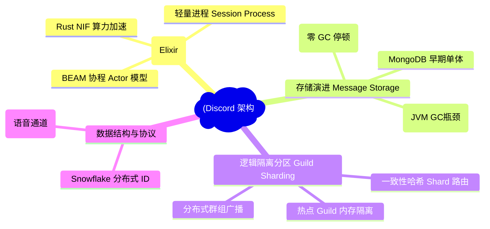
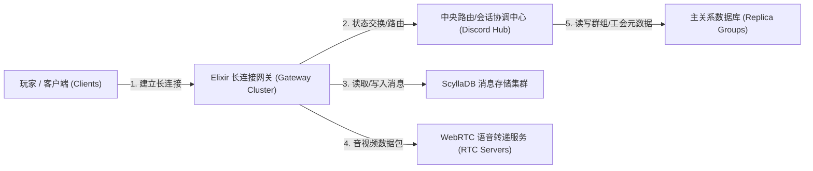
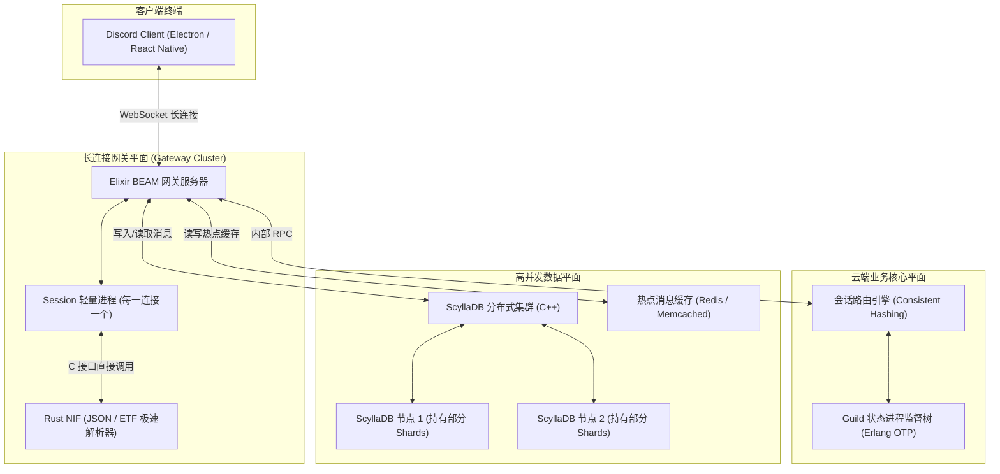
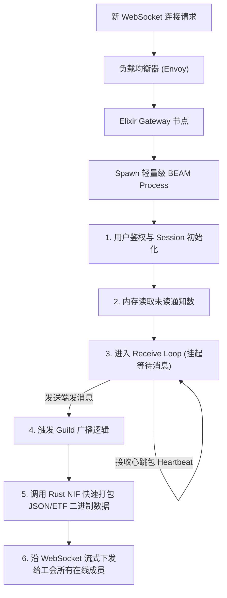
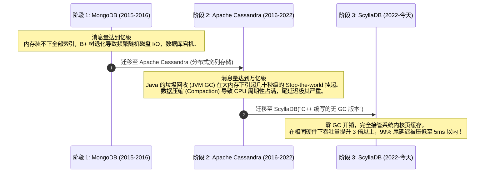
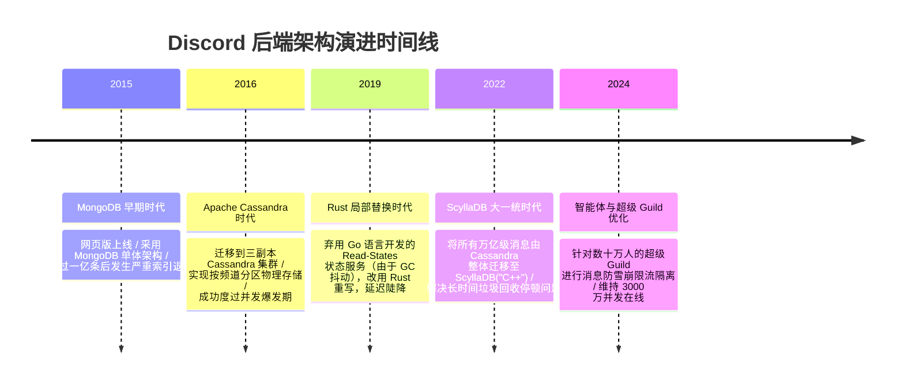

import CaseStudyHeader from '@site/src/components/CaseStudyHeader';
import DesignIntent from '@site/src/components/DesignIntent';
import ArchitectureEvolution from '@site/src/components/ArchitectureEvolution';
import TradeoffExplorer from '@site/src/components/TradeoffExplorer';
import GlossaryTerm from '@site/src/components/GlossaryTerm';
import ResearchNote from '@site/src/components/ResearchNote';
import QuizCard from '@site/src/components/QuizCard';
import CompareSlider from '@site/src/components/CompareSlider';
import GuidedExercise from '@site/src/components/GuidedExercise';

# Discord：Elixir 网关、按 Guild 分片与 ScyllaDB 存储架构

<CaseStudyHeader
  oneLiner="Discord 通过利用 Erlang BEAM 的轻量级 Actor 并发模型维持数千万在线长连接，并采用按 Guild（服务器）进行一致性哈希分片的分布式编排，最终以 ScyllaDB（C++ 宽列存储）彻底消除了 JVM 垃圾回收对海量历史消息读取引起的尾延迟抖动。"
  stats={[
    {label: '上线时间', value: '2015 年'},
    {label: '在线并发长连接', value: '3000 万+ 维持于单个网关集群'},
    {label: '存储引擎演进', value: 'MongoDB → Cassandra → ScyllaDB'},
    {label: '消息吞吐量', value: '每日数百亿条消息读写'},
    {label: '首选网关语言', value: 'Elixir / Rust (性能优化)'}
  ]}
/>

:::info 对应课程概念
本案例横跨 [Month 3 缓存与队列高并发](../data-cache-queue/cache-queues-idempotency)、[Month 10 经典架构演进](./overview.mdx)、[Month 4 设计模式](../design-patterns-lld/patterns-through-change)。它展示了当数据量从百万级膨胀至万亿级时，数据存储边界与并发长连接网关在底层技术栈切换上的典型逻辑与权衡。
:::

## 1. 设计初衷：为全球玩家提供极致实时的语音与聊天平台

在 Discord 出现之前，玩家在联机游戏时只能使用 TeamSpeak、Skype 等软件。Skype 占用大量内存且存在严重的单点连接失效；而 TeamSpeak 搭建和付费授权对普通玩家极度不友好。

Discord 的设计初衷是提供一个**完全免费、网页一键直连、高并发、秒级推送的跨平台聊天系统**。这就要求其长连接网关能够在极低的硬件开销下，承载千万级在线用户的 WebSocket 长连接，并在某一个“工会（Guild，即一个 Discord 服务器，可能包含数十万人）”爆发活动时，不波及其他工会的用户。

<DesignIntent
  problem="在保持极低延迟（< 100ms）的前提下，让全球上亿用户能够稳定在数十万个虚拟工会（Guild）中进行高频文本沟通与低延迟语音通话，并完美检索万亿条历史聊天消息。"
  users="游戏玩家、开源社区开发者、独立内容创作者，在联机对战、日常交流中对消息即时到达与语音通话质量有严苛要求。"
  devices="支持网页端（Web）、移动客户端（App）、桌面客户端（Electron Fork），主要通过持续的高频 WebSocket 长连接与云端网关通信。"
  goals={[
    '千万级 WebSocket 并发吞吐：单台网关服务器需要维护数百万条网络套接字（Socket），秒级广播在线状态。',
    '高可用逻辑分区（Guild Partitioning）：以工会为核心逻辑单元。一个工会里的用户状态、成员列表变化只在当前工会内广播，不产生跨节点全局锁。',
    '消除 Java 垃圾回收停顿（GC Pause）：当存储层膨胀至数万亿条消息时，彻底消除数据库由于内存回收引发的几十秒级延迟抖动。',
    'Snowflake 算法高并发 ID 生成：生成分布式单调递增的 64 位整型唯一 ID，自带时间戳属性。'
  ]}
  constraints={[
    'Erlang BEAM 虚拟机的计算瓶颈：虽然 Erlang 极擅长处理并发网络 IO，但在处理重度 CPU 计算时（如长序列数据序列化）性能吃紧，需要 Rust NIF 加速。',
    '万亿级数据读写放大：频繁的随机读取与极高密度的写操作会导致传统的 B+ 树索引结构在磁盘上产生严重碎片。',
    '“热点工会”的雪崩效应：当某个超级大 V 开启直播导致数十万人在单通道内疯狂发消息时，必须保证能快速限流且不拖垮相邻物理节点。'
  ]}
  firstStep="基于 Elixir 语言构建 Gateway 网关，利用轻量进程为每个长连接维护独立状态；设计基于一致性哈希的 Shard 路由；将海量历史消息存储边界由文档型（MongoDB）迁移至高性能宽列存储（Cassandra），并逐步演进至无 GC 开销的 ScyllaDB。"
/>

## 2. 系统功能全景

以下是 Discord 系统的网关编排与底层存储演进全景图：



---

## 3. 最新架构总览

Discord 整体系统由实时连接网关、中央路由协调器、以及高容错的 ScyllaDB 存储集群构成：

### 3a. 系统上下文图 (System Context)



### 3b. 容器架构图 (Container)



---

## 4. 核心机制拆解

### 4a. 基于 Elixir BEAM 的千万级长连接网关

Discord 网关最大的压力来自于高并发长连接（秒级需要处理数万次连接建立、心跳包与在线状态同步）。
团队最终选择了 **Elixir（基于 Erlang 虚拟机 BEAM）**。
- **Actor Concurrency 模型**：每个长连接在内存中仅占用几 KB 的轻量级 Erlang Process 负责。各连接进程完全隔离，单个崩溃不会干扰其它连接。
- **动态广播（Pub/Sub）**：当用户在某个 Guild 中更新状态（如“开始玩英雄联盟”），网关会沿着 Guild 的成员拓扑网络，将此消息推送给该 Guild 所有的在线成员 Session 进程。
- **C/Rust NIF (Native Implemented Functions)**：Elixir 在处理大体积 JSON 数据序列化时速度慢。Discord 团队编写了 Rust 插件，以 NIF 方式直接嵌入 BEAM 运行时，将 JSON 和二进制协议解析延迟降低了一个数量级。



### 4b. 消息存储演进史：MongoDB → Cassandra → ScyllaDB

随着聊天历史消息量膨胀至数千亿，Discord 的存储架构经历了三次重大革命：



### 4c. 分布式 Snowflake 唯一 ID 算法

在万亿级分布式消息库中，不能依赖自增主键（如 MySQL Auto_Increment），因为这会形成单点写瓶颈；同时也不能使用随机 UUID，因为 UUID 无法排序，会导致索引在插入时引发严重的页分裂。

Discord 广泛使用 <GlossaryTerm term="Snowflake ID" definition="Twitter 开源的分布式 ID 生成算法。它生成一个 64 位的单调递增长整型 ID，由时间戳、物理工作机器 ID 和循环序列号拼接而成。天生有序且支持去中心化无锁并发生成。">Snowflake ID</GlossaryTerm> 作为消息的主键：

```
+--------------------------------------------------------------------------+
| 1位符号位 | 41位时间戳 (毫秒级，可支持69年) | 10位工作机器 ID | 12位循环递增序列号 |
+--------------------------------------------------------------------------+
```

由于 Snowflake ID 头部是**毫秒级时间戳**，这使得消息 ID 在物理上是自然有序的。
Discord 在 ScyllaDB 中定义主键为 `PRIMARY KEY (channel_id, message_id)`。
- `channel_id` 为分区键（Partition Key），保证同一频道的消息在物理磁盘上存放在一起。
- `message_id` 为聚类键（Clustering Key，即 Snowflake ID），使消息默认按照发送时间完美排序，极大加速了“拉取某个频道最新 50 条历史消息”的极高频读操作。

---

## 5. 架构演进史

Discord 围绕消息规模与连接强度的架构演进历程：



---

## 6. 架构对比

### 早期 MongoDB 文档模型 vs 宽列 ScyllaDB 物理存储模型

<CompareSlider
  before={
    <div style={{ padding: '20px', background: '#ffebee', border: '1px solid #c62828', borderRadius: '8px', height: '100%', color: '#333' }}>
      <strong>早期 MongoDB 索引模型</strong>
      <p style={{ marginTop: '10px', fontSize: '0.9rem' }}>
        消息被存储为独立的 Document 文档。当消息量极其庞大且内存不足以容纳全量 B+ 树索引时，每次随机读取或追加写入都会导致磁盘页的频繁换入换出，引起磁盘读写雪崩，造成系统整体宕机。
      </p>
    </div>
  }
  after={
    <div style={{ padding: '20px', background: '#e8f5e9', border: '1px solid #2e7d32', borderRadius: '8px', height: '100%', color: '#333' }}>
      <strong>宽列 ScyllaDB + Snowflake 模型</strong>
      <p style={{ marginTop: '10px', fontSize: '0.9rem' }}>
        数据在物理磁盘上按 `channel_id` 进行分片聚集，并在各分区内部按照单调递增的 `message_id` (Snowflake ID) 连续紧凑排布。顺序写入，零 GC 开销，完美契合“拉取历史消息”的局部性读写特征。
      </p>
    </div>
  }
  labels={['MongoDB 索引模型', 'ScyllaDB 宽列模型']}
/>

---

## 7. 核心决策的取舍

Discord 团队在选择和重写底层基础组件时，始终在性能、复杂度和资源消耗之间做艰难折中：

<TradeoffExplorer
  title="万亿级消息数据库选型取舍"
  dimensions={['消除 JVM 垃圾回收抖动', 'SQL级复杂关联分析', '顺序写入与吞吐量', '分布式易运维性', '单机性能与硬件节约']}
  options={[
    {
      name: 'Apache Cassandra (分布式 Java 宽列存储)',
      scores: [2, 1, 5, 4, 3],
      note: '成熟可靠，基于 LSM-Tree，写性能极强。但在超大堆内存下，Java 的垃圾回收会引起不可预测的毫秒至秒级停顿。',
      whenToUse: '拥有丰富 JVM 运维经验、数据规模大且能接受偶发小抖动的通用场景。'
    },
    {
      name: 'ScyllaDB (分布式 C++ 宽列存储，兼容 Cassandra)',
      scores: [5, 1, 5, 3, 5],
      note: '用 C++ 彻底重写，采用 Thread-per-core 架构，零 GC 开销，单机性能极强。但由于缺少垃圾回收，内存管理极其精细，运维排障门槛高。',
      whenToUse: '万亿级超大规模数据、对尾延迟（Tail Latency）要求极其苛刻、需要节省硬件服务器成本的极限场景。'
    },
    {
      name: 'Google Spanner / 强一致性全球 SQL 库',
      scores: [5, 5, 3, 2, 2],
      note: '提供全球强一致性和完美的 SQL 关联检索。但其基于 TrueTime 与分布式两阶段提交，在面对数十万并发写入时，写延迟与吞吐量不如 LSM-Tree 存储。',
      whenToUse: '金融级交易支付、对账系统、强一致性元数据管理。'
    }
  ]}
/>

---

## 8. 实践指引：实现一个简单的 Snowflake 分布式唯一 ID 生成器

在分布式系统中，生成全局单调递增且包含时间戳的 ID 是索引设计的关键。

在 `labs/month03/snowflake/` 目录下（或在下方练习中），实现一个可以线程安全并发运行的 Snowflake ID 生成核心。

<GuidedExercise
  title="练习指引：编写一个 Snowflake 分布式唯一 ID 生成器"
  goal="用 Python 编写一个线程安全的 Snowflake ID 生成类，支持设置机器 ID、进程 ID，并能高并发输出 64 位有序长整型。"
  hints={[
    '41 位时间戳表示从你设定的纪元（Epoch，例如 2026-01-01）开始流逝的毫秒数。',
    '机器 ID (5位) 和进程 ID (5位) 可以合并为一个 10 位的 WorkID，范围是 0 到 1023。',
    '12 位序列号用于在同一毫秒内并发调用时自增，满 4095 后需要循环等待至下一毫秒。',
    '使用 Python 的 `threading.Lock` 保证高并发调用的互斥安全。'
  ]}
  steps={[
    '定义 `SnowflakeGenerator` 类，初始化传入 `worker_id` 和基准纪元 `twepoch`。',
    '实现 `_time_gen()` 获取当前毫秒级时间戳。',
    '实现 `next_id()` 主方法。注意：如果当前时间与上次生成时间相同，自增 `sequence`；若不同则将 `sequence` 重置为 0。',
    '处理时钟回拨（Clock Backwards）：若检测到当前时间小于上次生成时间，抛出异常以防 ID 重复。',
    '编写单元测试，多线程拉取 ID，验证生成的 ID 是否完全唯一，且转化成二进制后各部分位段对齐无误。'
  ]}
  checks={[
    '即使在同一毫秒内被调用 1000 次，生成的 ID 也完全没有冲突。',
    '提取生成的 Snowflake ID 的高 41 位，能准确还原出 ID 生成时的物理绝对时间。'
  ]}
/>

---

## 9. 知识自测

完成自测以检验你对高并发长连接网关、存储引擎演进和 Snowflake 索引设计的理解：

<QuizCard
  questions={[
    {
      q: '在万亿级消息量下，Discord 为什么最终将消息存储从 MongoDB 迁移至宽列存储（如 Cassandra / ScyllaDB）？',
      options: [
        'A. 因为 MongoDB 不支持存储图片和文件附件，只支持纯文本',
        'B. 因为 MongoDB 基于 B+ 树索引结构，当数据量远超内存上限时，为了寻找和写入非连续的消息，会导致频繁的随机磁盘 I/O 换页，使读写性能雪崩。而宽列存储基于 LSM-Tree 结构，将随机写转化为顺序日志追加，并支持按 channel_id 进行物理聚合分区，完美契合聊天场景的读写特征',
        'C. 因为 MongoDB 无法支持高并发的 WebSocket 链接建立',
        'D. 因为宽列存储完全不需要占用服务器的任何 CPU 资源'
      ],
      answer: 1,
      explain: 'MongoDB 的文档数据模型在初期非常灵活好用。但在万亿级规模下，其 B+ 树索引结构在随机读写时会导致严重的磁盘随机 I/O，即发生缓存失效页崩溃。ScyllaDB/Cassandra 采用 LSM-Tree（Log-Structured Merge-Tree）架构，在内存中写 MemTable，顺写 SSTable，且在主键定义中将 channel_id 作为分区键，使同一个频道的所有消息物理上存放在一起，从而将读取开销缩减到了极致。'
    },
    {
      q: '在长连接网关设计中，Elixir（基于 BEAM 虚拟机）最大的并发架构优势是什么？',
      options: [
        'A. 它具有极强的科学计算与矩阵浮点计算性能，能直接在网关上执行 AI 模型推理',
        'B. BEAM 虚拟机提供了极轻量级的 Actor 进程（Process），每个连接仅消耗几 KB 内存，且进程间不共享内存、完全隔离，垃圾回收也是进程级的，这使得单台服务器能承载百万连接，且单连接崩溃不会造成全局 Stop-the-world 停顿',
        'C. 它能自动把所有的 WebSocket 长连接转换成 HTTP/3 协议以加快传输',
        'D. 它完全由 C++ 重写，没有任何虚拟机的概念'
      ],
      answer: 1,
      explain: 'BEAM 的 Actor 并发是 Discord 维持千万连接的核心底座。BEAM 进程非常轻量（初始化仅需约 2.6 KB 内存），不像操作系统线程那样昂贵。因此单机可运行数百万个 Session 进程。更重要的是其独特的 GC 设计：每个进程有自己独立的堆空间，GC 只发生在当前进程内，彻底规避了 Java 等语言全局 GC 导致几十万连接瞬间心跳超时断连的梦魇。'
    },
    {
      q: '在分布式唯一 ID 设计中，Snowflake 算法生成的 ID 为什么相比随机 UUID，更适合作为关系型或宽列数据库的聚类主键（Clustering Key）？',
      options: [
        'A. 因为 Snowflake ID 占用的存储空间比 UUID 更大，安全性更好',
        'B. 因为 Snowflake ID 头部包含了 41 位时间戳，这使其生成的 ID 全局单调递增且物理有序。将其作为聚类主键写入数据库时，能保证数据在物理磁盘上是按时间顺序紧凑排布写入的，避免了 UUID 随机写入导致的严重索引页分裂与随机磁盘 write-amplification（写放大）',
        'C. 因为 Snowflake 算法不需要编写任何代码，可以直接通过硬件电路板输出',
        'D. 因为大模型只能看懂数字，看不懂 UUID 包含的字母'
      ],
      answer: 1,
      explain: '聚类键决定了数据在物理磁盘上的排布顺序。UUID 是完全随机的，这意味着每次插入一条新消息，数据库都需要在索引 B+ 树或 LSM-Tree 节点中间插入，从而引发物理页的频繁拆分和重新搬运（写放大）。Snowflake ID 天生自带递增的时间戳属性，保证了数据在物理磁盘上是以 Append-only（追加写）形式紧凑且有序写入的，极大保护了磁盘寿命和写入性能。'
    }
  ]}
/>

## 来源

- [Discord Blog: How Discord Stores Billions of Messages (Cassandra Era)](https://discord.com/blog/how-discord-stores-billions-of-messages)
- [Discord Blog: How Discord Stores Trillions of Messages (ScyllaDB Migration)](https://discord.com/blog/how-discord-stores-trillions-of-messages)
- [Discord Blog: Why Discord is switching from Go to Rust](https://discord.com/blog/why-discord-is-switching-from-go-to-rust)
- [ScyllaDB: Under the hood of a C++ rewrite of Cassandra](https://www.scylladb.com/technology/)
- [Erlang/OTP BEAM Concurrency and Garbarge Collection internals (OTP-26)](https://www.erlang.org/doc/apps/erts/garbagecollection)