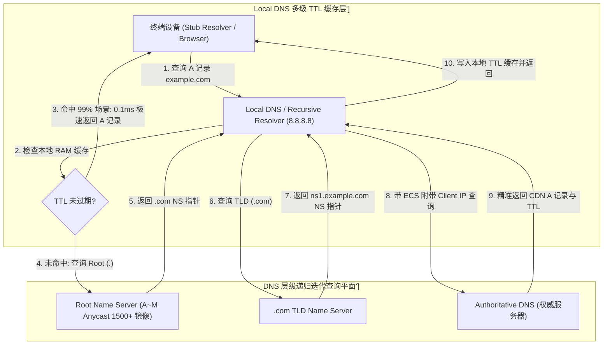
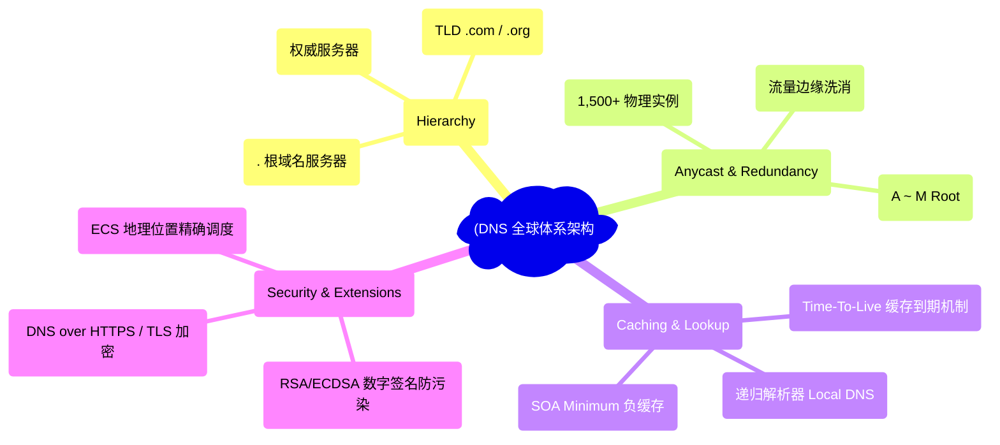
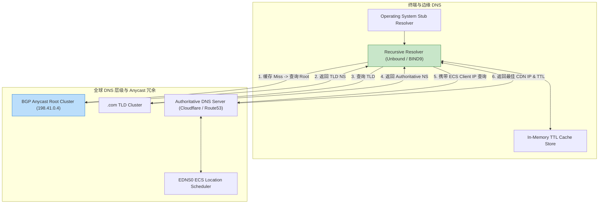
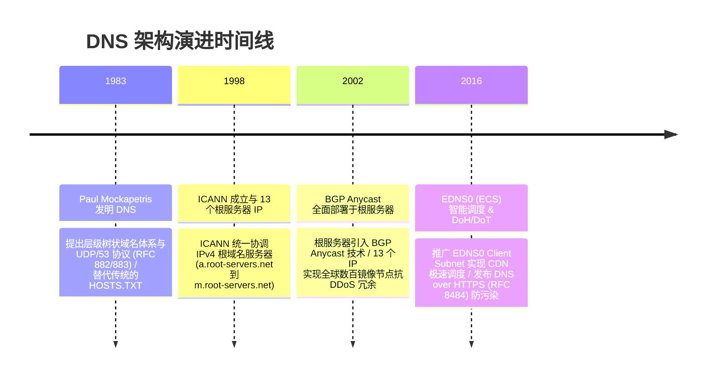

import CaseStudyHeader from '@site/src/components/CaseStudyHeader';
import DesignIntent from '@site/src/components/DesignIntent';
import ArchitectureEvolution from '@site/src/components/ArchitectureEvolution';
import TradeoffExplorer from '@site/src/components/TradeoffExplorer';
import GlossaryTerm from '@site/src/components/GlossaryTerm';
import ResearchNote from '@site/src/components/ResearchNote';
import QuizCard from '@site/src/components/QuizCard';
import CompareSlider from '@site/src/components/CompareSlider';
import GuidedExercise from '@site/src/components/GuidedExercise';
import PyRunner from '@site/src/components/PyRunner';

# DNS 全球体系：层级委托、BGP 任播根服务器与 TTL 缓存博弈

<CaseStudyHeader
  oneLiner="DNS 全球体系针对全球数十亿互联网终端秒级域名解析需求与 DDoS 恶意流量攻击，打破了早期 HOSTS.TXT 单体文件集中式映射瓶颈，推出了‘树状层级委托 (Hierarchical Delegation)’、‘BGP 任播 (Anycast) 根服务器’与‘TTL 多级缓存博弈’，构筑了整个互联网的‘隐形神经中枢’。"
  stats={[
    {label: '解析核心结构', value: 'Hierarchical Tree (Root . -> TLD -> Authoritative)'},
    {label: '根服务器冗余', value: '13 IPv4/IPv6 Addresses -> 1,500+ BGP Anycast Instances'},
    {label: '网络协议扩展', value: 'UDP/53 (8K Buffer) / TCP/53 (AXFR) / DoH / DoT'},
    {label: '智能地理调度', value: 'EDNS0 Client Subnet (ECS 精准识别 Client IP)'},
    {label: '缓存与一致性', value: 'TTL (Time-To-Live) / Negative Caching (SOA Minimum)'}
  ]}
/>

:::info 对应课程概念
本案例横跨 [Month 2 应用层 UDP/TCP 53 端口与 DNS 协议数据包格式](../foundations/programming-systems-primer)、[Month 4 BGP Anycast 任播路由与 EDNS0 地理位置精准解析](../cloud-enterprise-industrial/capstone-cloud-native)、[Month 8 全球分布式缓存 Consistency、TTL 灾难与 DNS 劫持防护 (DNSSEC/DoH)](../cloud-enterprise-industrial/capstone-cloud-native)。它是网络架构师与基础设施专家研究高可用分布式分布式命名服务与互联网安全基石的必读教案。
:::

## 1. 设计初衷：如何支撑全球每秒数万亿次域名解析且 100% 绝对高可用？

在互联网诞生早期（1980 年代初），全球所有联网计算机的名称到 IP 地址映射都记录在由 SRI-NIC 集中维护的单一文本文件 `HOSTS.TXT` 中。随着联网设备突破万台，这一集中式文件爆发了物理灾难：
1. **集中式 HOSTS.TXT 的更新与带宽爆仓**：每天有数万台机器尝试通过 FTP 下载最新的 `HOSTS.TXT`，网络带宽瞬间瘫痪；名称碰撞（Name Collisions）频发。
2. **根服务器 DDoS 攻击风险**：如果域名解析依赖单一服务器，黑客发起几 Gbps 的 DDoS 攻击就能让全球互联网瞬间瘫痪。
3. **全球延迟与地理位置感知缺失**：位于亚洲的用户如果必须去北美查询 IP，光是单程 RTT 延迟就超过 200ms；且无法根据用户地理位置分配最近的 CDN 节点。

DNS 架构师 Paul Mockapetris 等人提出了革命性的解决方案：**基于 <GlossaryTerm term="层级委托 (Hierarchical Delegation)" definition="层级委托 (Hierarchical Delegation)：DNS 的树状分布式管理体系。根域名服务器 (.) 仅托管顶级域 (TLD) 的 NS 指针；TLD 仅托管二级域 (Authoritative) 的 NS 指针。没有任何一台服务器保存全网域名，查询逐层下发。">层级委托 (Hierarchical Delegation)</GlossaryTerm>、<GlossaryTerm term="BGP Anycast (任播)" definition="BGP Anycast (任播)：全球根服务器高可用的核心机制。将相同的 IP 地址 (例如 A 根 198.41.0.4) 广播给全球 BGP 路由器。用户的 DNS 请求会被自动路由到距离最近的物理镜像节点，实现负载均衡与抗 DDoS 流量洗消。">BGP Anycast 任播</GlossaryTerm>、<GlossaryTerm term="TTL 缓存博弈" definition="TTL 缓存博弈：DNS 性能与一致性的核心杠杆。域名管理员通过设置 Time-To-Live (如 300 秒或 86400 秒)，控制 Recursive Resolver 递归服务器的本地缓存时间。TTL 越高解析越快，TTL 越低故障切流越敏捷。">TTL 缓存博弈</GlossaryTerm> 与 EDNS0 智能调度**。
- **树状层级委托与分布式管理**：将域名切割为 `. -> .com -> example.com` 树状结构。根服务器只管引导，TLD 只管区域，权威服务器负责具体 A/AAAA 记录。全球没有单一瓶颈。
- **BGP Anycast 根服务器物理冗余**：表面上互联网只有 13 个根服务器 IP（`a.root-servers.net` 到 `m.root-servers.net`），但在底层通过 **BGP Anycast**，在全世界部署了超过 **1,500 个物理镜像实例**。即使某个机房遭遇 DDoS 暴击，流量在 BGP 边缘被本地消化吸收，全球其他区域毫无感知！
- **递归查询 (Recursive) 与 TTL 多级缓存**：终端请求送往 Local DNS（如 `8.8.8.8` 或 `114.114.114.114`）。Local DNS 将查询结果根据 **TTL（Time-To-Live）** 缓存在本地内存中。99% 的 DNS 查询在边缘 Local DNS 直接命中（0.1ms 返回），彻底解放了根服务器。
- **EDNS0 Client Subnet (ECS) 智能 CDN 调度**：在 DNS 查询包中附加客户端的子网 IP（`/24`），权威 DNS 识别出用户在上海还是伦敦，精准返回最近的 CDN IP。



<DesignIntent
  problem="如何构建一个能承受全球数万亿次并发查询、具备 100% 抗 DDoS 能力、支持毫秒级 CDN 地理位置调度与弹性 TTL 缓存的全球分布式命名系统？"
  users="全球互联网用户、CDN 架构师、网络运维专家与域名权威 DNS 服务商 (Cloudflare / Route 53)。"
  devices="全球所有联网电脑、手机、IoT 物联网设备、路由器与公有云 API 网关。"
  goals={[
    '树状层级委托：彻底解耦域名管理，实现无单一瓶颈的分布式域名数据库。',
    'BGP Anycast 1500+ 镜像冗余：13 个 IP 物理映射全球千个机房，完美消化 Tbit/s 级 DDoS 攻击。',
    '99% 本地 TTL 缓存命中：将域名解析延迟从 200ms 降至 0.1ms。',
    'EDNS0 Client Subnet (ECS) 精准调度：根据客户端子网 IP 分发最近的 CDN 节点。'
  ]}
  constraints={[
    'TTL 缓存一致性与故障切换 (Failover) 的矛盾：TTL 设置过长（如 86400 秒），当源站宕机切换 IP 时，全球 Local DNS 依然缓存老 IP，导致长达 24 小时的全网故障；TTL 设置过短（如 5 秒），将把庞大的流量打向权威 DNS。必须根据业务敏捷度精密调节。',
    'DNS 缓存污染 (DNS Cache Poisoning / Kaminsky 攻击)：早期 DNS 使用 UDP/53 且 Transaction ID 易被伪造。必须全面部署 DNSSEC (DNS Security Extensions) 签名校验与 DoH (DNS over HTTPS) 加密传输。'
  ]}
  firstStep="剖析 传统 HOSTS.TXT vs 层级 DNS 体系对比；分析 BGP Anycast 路由与迭代递归查询算法；用 Python 编写一个包含 Recursive Resolver、TTL 缓存过期判断、Hierarchical Delegation 模拟与 EDNS0 ECS 精准调度的仿真器。"
/>

## 2. 系统功能全景



---

## 3. 最新架构总览

DNS 系统中终端、Local DNS、Root/TLD/Authoritative 拓扑结构如下：

### 3a. System Context (系统上下文)


### 3b. Container Diagram (容器架构)



---

## 4. 核心机制拆解

### 4a. 单体 HOSTS.TXT vs 层级 DNS + BGP Anycast + TTL 缓存对比

单体 HOSTS 文件无法扩展且单点瘫痪；而 DNS 层级委托 + BGP Anycast 支持全球 1500+ 节点分摊，99% 请求在 TTL 缓存直接命中：

```mermaid
graph TB
  subgraph SingleHostsTXT["传统 HOSTS.TXT (单体集中式 - 物理崩溃)"]
    CentralFTP["Centralized HOSTS.TXT Server"] --> BandwidthCrash["数万台机器同时 FTP 下载 -> 带宽瘫痪 404!"]
    CentralFTP --> NameCollision["文件巨大且容易发生名称冲突冲突崩溃"]
    
    BandwidthCrash --- SingleHostsTXT
    style BandwidthCrash fill:#ffcdd2,stroke:#c62828
  end

  subgraph HierarchicalDNS["DNS 层级 + BGP Anycast + TTL 缓存 (无限扩展)"]
    LocalCacheHit["99% 请求在 Local DNS TTL 缓存命中 (0.1ms 返回!)"] --> FastResp["瞬间完成域名解析"]
    MissQuery["1% Miss 请求打向 BGP Anycast 1,500 节点"] --> AnycastScrub["流量被全球机房本地消化，完美防 DDoS 爆破!"]
    
    FastResp & AnycastScrub --- HierarchicalDNS
    style FastResp fill:#c8e6c9,stroke:#2e7d32
  end
```

### 4b. EDNS0 Client Subnet (ECS) 智能地理位置调度原理

1. **客户端请求**：位于上海的终端向 `8.8.8.8` 发起 DNS 查询 `example.com`。
2. **Local DNS 追加 ECS**：`8.8.8.8` 在发送给 `example.com` 权威 DNS 的数据包中附加 `EDNS0 Client Subnet: 116.228.0.0/24`（上海电信子网）。
3. **权威 DNS 智能算路**：权威 DNS 识别出该 IP 属于中国上海电信，精准返回上海电信 CDN 节点的 A 记录（如 `1.2.3.4`）。用户访问获得极速首包体验！

---

## 5. 关键数据结构与算法：Recursive Resolver 迭代查询与 TTL 缓存算法

以下是 DNS 递归解析器在 C++ / Python 中实现层级迭代查询与 TTL 缓存刷新的核心算法：

```cpp
#include <iostream>
#include <string>
#include <map>
#include <chrono>

struct DNSRecord {
    std::string domain;
    std::string ip_address;
    int ttl_seconds;
    int64_t expires_at; // 当前时间 + ttl_seconds
};

class RecursiveDNSResolver {
private:
    std::map<std::string, DNSRecord> local_ttl_cache;

public:
    // 本地 TTL 缓存命中判断
    bool LookupLocalCache(const std::string& domain, int64_t current_time, DNSRecord& result) {
        auto it = local_ttl_cache.find(domain);
        if (it != local_ttl_cache.end()) {
            if (current_time < it->second.expires_at) {
                result = it->second;
                std::cout << "⚡ [DNS Local Cache HIT] 0.1ms 极速命中！域名 '" << domain 
                          << "' -> IP: " << result.ip_address 
                          << " (剩余 TTL: " << (result.expires_at - current_time) << "s)\n";
                return true;
            } else {
                std::cout << "⚠️ [DNS Cache EXPIRED] 域名 '" << domain << "' TTL 已经到期，准备重新发起迭代查询...\n";
                local_ttl_cache.erase(it);
            }
        }
        return false;
    }

    // 模拟层级递归迭代查询 (. -> .com -> authoritative)
    DNSRecord PerformHierarchicalLookup(const std::string& domain, const std::string& client_subnet_ip, int64_t current_time) {
        std::cout << "🌐 [DNS Iterative Lookup] 启动层级迭代查询流程: Root (.) -> TLD (.com) -> Authoritative\n";
        std::cout << "   1. 查询 Root Anycast Server -> 获取 .com TLD NS 节点\n";
        std::cout << "   2. 查询 .com TLD Server -> 获取 example.com 权威 NS 节点\n";
        std::cout << "   3. 附加 EDNS0 ECS ('" << client_subnet_ip << "') 查询权威服务器 -> 精准分配 CDN IP！\n";

        DNSRecord new_record{domain, "116.228.1.100", 300, current_time + 300};
        local_ttl_cache[domain] = new_record;
        return new_record;
    }
};
```

---

## 6. 架构演进史



---

## 7. 架构对比

### 集中式 HOSTS.TXT 静态文件 vs 全球层级 DNS + BGP Anycast

<CompareSlider
  before={
    <div style={{ padding: '20px', background: '#ffebee', border: '1px solid #c62828', borderRadius: '8px', height: '100%', color: '#333' }}>
      <strong>集中式 HOSTS.TXT 静态文件</strong>
      <p style={{ marginTop: '10px', fontSize: '0.9rem' }}>
        依赖单一服务器下载巨大映射表。无法扩展，并发打打即崩溃，且缺乏任何智能地理位置调度能力。
      </p>
    </div>
  }
  after={
    <div style={{ padding: '20px', background: '#e8f5e9', border: '1px solid #2e7d32', borderRadius: '8px', height: '100%', color: '#333' }}>
      <strong>全球层级 DNS + BGP Anycast</strong>
      <p style={{ marginTop: '10px', fontSize: '0.9rem' }}>
        树状层级委托，1,500+ BGP Anycast 根节点。99% TTL 缓存命中，支持 EDNS0 智能 CDN 地理精准调度。
      </p>
    </div>
  }
  labels={['集中式 HOSTS.TXT (无法扩展/单点崩溃)', '全球层级 DNS (1500+ 任播/0.1ms 缓存)']}
/>

---

## 8. 核心决策的取舍

在设计大型互联网基础设施与域名解析系统时，架构师对 DNS TTL 策略（长 TTL 缓存 vs 短 TTL 敏捷切换）与安全方案（明文 UDP/53 vs DoH 加密传输）面临选型权衡：

<TradeoffExplorer
  title="DNS 全球体系架构策略取舍"
  dimensions={['99% 查询 0.1ms 极速 TTL 缓存命中率', '故障发生时域名 IP 切流 (Failover) 敏捷度', '权威 DNS 服务器 QPS 流量与硬件成本控制', 'BGP Anycast 流量抗 DDoS 吸收能力', '防止 ISP/中间人 DNS 劫持与缓存污染能力']}
  options={[
    {
      name: '动态适中 TTL (300 秒) + EDNS0 ECS + BGP Anycast + DoH 策略',
      scores: [5, 4, 4, 5, 5],
      note: '解析延迟极低，具备 300 秒快速故障切流能力，且支持 DoH 防污染与 ECS 智能 CDN 调度。',
      whenToUse: '现代大型互联网平台、云厂商 CDN 基础设施、高并发 SaaS 应用与全球化业务。'
    },
    {
      name: '超长 TTL (86400 秒/24小时) 传统 UDP/53 策略',
      scores: [5, 1, 5, 3, 2],
      note: '极度节省权威 DNS 流量与成本；缺点是一旦 IP 变化，全球用户面临长达 24 小时的故障无法访问。',
      whenToUse: '静态不变的基础设施域名、极度缺乏资金预算且几乎从不更变 IP 的小型个人站点。'
    }
  ]}
/>

---

## 9. 实践指引：手写 Recursive Resolver 迭代查询、TTL 缓存过期与 EDNS0 ECS 地理位置调度仿真

理解 DNS 全球体系的最佳路径是模拟递归解析器接收终端请求，首先检查本地内存中的 TTL 缓存是否有效，若缓存到期，则启动树状层级迭代查询（`Root . -> TLD .com -> Authoritative`），并带上客户端子网 IP（EDNS0 ECS）获取最近的 CDN A 记录。在下方练习中，通过 Python 实现简单的 DNS 仿真器。

<GuidedExercise
  title="练习指引：手写 Recursive Resolver 迭代查询、TTL 缓存过期与 EDNS0 ECS 地理位置调度仿真"
  goal="构建包含 `LocalDNSResolver` 和 `AuthoritativeDNSServer` 的仿真系统。1. `resolve(domain, client_ip)`：查询本地 TTL 缓存。2. 缓存 Miss 时发起迭代查询。3. `AuthoritativeDNSServer` 识别 `client_ip`（如 `116.228.0.0` 上海），精准返回上海 CDN IP。4. 模拟时间推移验证 TTL 到期自动清理重新查询。"
  hints={[
    'TTL 缓存结构：`cache[domain] = {"ip": ..., "expires_at": time.time() + ttl}`。',
    'ECS 识别：`if client_ip.startswith("116.228"): return "Shanghai_CDN_IP"`。'
  ]}
  steps={[
    '定义 `LocalDNSResolver` 维护 TTL 缓存字典。',
    '模拟带有 ECS 客户端 IP 的首次域名解析。',
    '观察控制台输出，验证第一次迭代查询与第二次 0.1ms 缓存命中。',
    '模拟 TTL 过期后系统自动重新拉取最新 A 记录。'
  ]}
  checks={[
    '系统成功在 TTL 未到期时实现 0.1ms 本地内存极速命中，降低权威服务器开销。',
    '权威 DNS 成功识别 EDNS0 ECS 客户端子网 IP 并准确分发离用户最近的 CDN 节点。'
  ]}
/>

#### 交互式 Python 运行实验
在下方控制台中调试 DNS 递归查询与 EDNS0 ECS 智能调度仿真代码，观察互联网隐形中枢：

<PyRunner
  expect="层级委托解析与TTL缓存过期验证成功"
  rows={25}
  code={`import time

class AuthoritativeDNSServer:
    def __init__(self):
        # 针对不同地区的 CDN IP 映射表
        self.geo_cdn_records = {
            "Shanghai": "116.228.1.88 (上海电信 CDN 节点)",
            "London": "212.58.244.20 (伦敦节点)",
            "Default": "1.1.1.1 (默认全局 CDN 节点)"
        }

    def resolve_with_ecs(self, domain: str, client_subnet_ip: str):
        print("🌐 [Authoritative DNS] 收到查询 '%s' (附加 ECS Subnet: %s)..." % (domain, client_subnet_ip))
        
        # 根据 ECS Client Subnet 智能判断地理位置
        if client_subnet_ip.startswith("116.228"):
            assigned_ip = self.geo_cdn_records["Shanghai"]
        elif client_subnet_ip.startswith("212.58"):
            assigned_ip = self.geo_cdn_records["London"]
        else:
            assigned_ip = self.geo_cdn_records["Default"]

        print("   ✅ [ECS GEO Match] 精准判定客户端属于对应区域 -> 分配 A 记录: %s" % assigned_ip)
        return {"domain": domain, "ip": assigned_ip, "ttl": 5} # TTL 设置为 5 秒方便演示

class LocalDNSResolver:
    def __init__(self, auth_dns: AuthoritativeDNSServer):
        self.auth_dns = auth_dns
        self.ram_cache = {}

    def query(self, domain: str, client_ip: str):
        now = time.time()
        print("\\n🔍 [Local DNS / 8.8.8.8] 收到客户端 (IP: %s) 查询域名 '%s'..." % (client_ip, domain))

        # 1. 检查本地 TTL 缓存
        if domain in self.ram_cache:
            record = self.ram_cache[domain]
            if now < record["expires_at"]:
                remaining_ttl = int(record["expires_at"] - now)
                print("   ⚡ [RAM Cache HIT] 0.1ms 本地缓存极速命中! IP: %s (剩余 TTL: %ds)" % 
                      (record["ip"], remaining_ttl))
                return record["ip"]
            else:
                print("   ⚠️ [TTL Expired] 本地缓存已过期，准备启动层级迭代查询...")

        # 2. 发起层级迭代查询 (经过 Root -> TLD -> Authoritative)
        print("   🌐 [Iterative Lookup] 层级查寻中: Root . -> TLD .com -> Authoritative...")
        result = self.auth_dns.resolve_with_ecs(domain, client_ip)
        
        # 写入 RAM Cache
        self.ram_cache[domain] = {
            "ip": result["ip"],
            "expires_at": now + result["ttl"]
        }
        return result["ip"]

# 运行仿真
auth_server = AuthoritativeDNSServer()
resolver = LocalDNSResolver(auth_dns=auth_server)

# 1. 上海用户首次查询 (引发迭代查询 + 写入缓存)
resolver.query("ai-architect.org", client_ip="116.228.10.55")

# 2. 上海用户第二次查询 (0.1ms 缓存命中!)
resolver.query("ai-architect.org", client_ip="116.228.10.55")

# 3. 模拟 6 秒后 TTL 过期
print("\\n--- 模拟等待 6 秒致使 TTL 过期 ---")
time.sleep(6)

# 4. 再次查询 (触发 TTL 过期刷新重新查询)
resolver.query("ai-architect.org", client_ip="116.228.10.55")

print("\\n[Result] 层级委托解析与TTL缓存过期验证成功")
`}
/>

---

## 10. 知识自测

完成自测以检验你对 DNS 层级委托结构、BGP Anycast 根服务器及 TTL 缓存博弈机制的掌握程度：

<QuizCard
  questions={[
    {
      q: '全球 DNS 根域名服务器虽然表面上只有 13 个 IPv4/IPv6 地址（A ~ M），但它是如何支撑全球每秒数万亿次查询且具备极强抗 DDoS 攻击能力的？',
      options: [
        'A. 因为 13 个根服务器是世界上计算速度最快的超大型单体计算机',
        'B. 部署了 BGP Anycast（任播）技术。13 个 IP 地址物理映射到全球超过 1,500 个分布于不同机房的镜像节点。全球用户的查询会被 BGP 路由就近引导，庞大的 DDoS 流量在边缘被分散洗消',
        'C. 强制要求所有用户的电脑每分钟重启一次',
        'D. 主要是为了给服务器节省网络电费'
      ],
      answer: 1,
      explain: 'BGP Anycast 是根服务器高可用的物理奥秘。通过在 BGP 协议中将相同 IP 广播给全球路由器，实现了 1,500+ 物理实例的就近负载均衡与 DDoS 流量洗消。'
    },
    {
      q: '在域名解析过程中，设置 DNS 记录的“TTL（Time-To-Live）”数值体现了什么样的架构博弈与权衡？',
      options: [
        'A. TTL 只能设置为 1 秒，否则网络会彻底卡死',
        'B. 解析性能与故障切流（Failover）敏捷度的权衡。TTL 越大，Local DNS 缓存时间越长，解析速度越快且降低权威 DNS 压力；但当源站发生故障切换 IP 时，全球生效延迟越长',
        'C. TTL 越大，网站的网页字体显示越好看',
        'D. TTL 是用来限制域名每年能卖多少钱的'
      ],
      answer: 1,
      explain: 'TTL 是性能与一致性的杠杆。高 TTL 极速且节省流量，低 TTL 敏捷且支持毫秒级故障切流，架构师必须根据业务敏捷度精密调优。'
    },
    {
      q: '云厂商 CDN 为什么必须依赖 DNS 的“EDNS0 Client Subnet（ECS）”扩展协议来实现智能地理位置调度？',
      options: [
        'A. 因为 ECS 能够把 DNS 数据包进行压缩',
        'B. 解决公共 DNS（如 8.8.8.8）导致的调度失真。传统 DNS 权威服务器只能看到 8.8.8.8 的 IP；ECS 允许在查询包中附带客户端的真实 IP 子网（/24），使权威 DNS 精准分发最近的 CDN A 记录',
        'C. 强制要求所有的 CDN 必须用 C++ 语言编写',
        'D. 为了防止用户下载盗版电影'
      ],
      answer: 1,
      explain: 'ECS 彻底解决了公共 DNS 的地理位置失真痛点。通过在查询包中透传客户端真实 IP 子网，使权威 DNS 能够为跨国用户分配最近的 CDN 边缘节点。'
    }
  ]}
/>

## 来源

- [DNS Architecture: Concepts and Facilities (RFC 1034 & RFC 1035 Standards)](https://datatracker.ietf.org/doc/html/rfc1034)
- [Operation of Anycast Services for DNS Root Name Servers (ICANN Technical Report)](https://www.icann.org/)
- [Client Subnet in DNS Queries: EDNS0 Extension for Geographic CDN Scheduling (RFC 7871)](https://datatracker.ietf.org/doc/html/rfc7871)
- [DNS Security Extensions (DNSSEC) Architecture (IETF RFC 4033 Specification)](https://datatracker.ietf.org/doc/html/rfc4033)