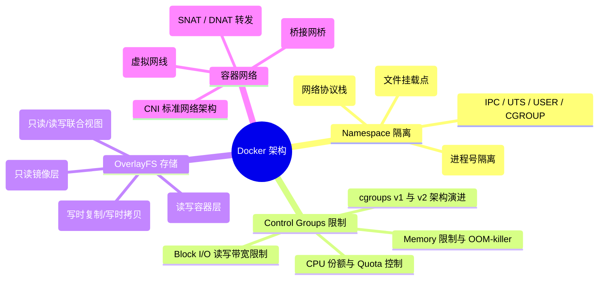
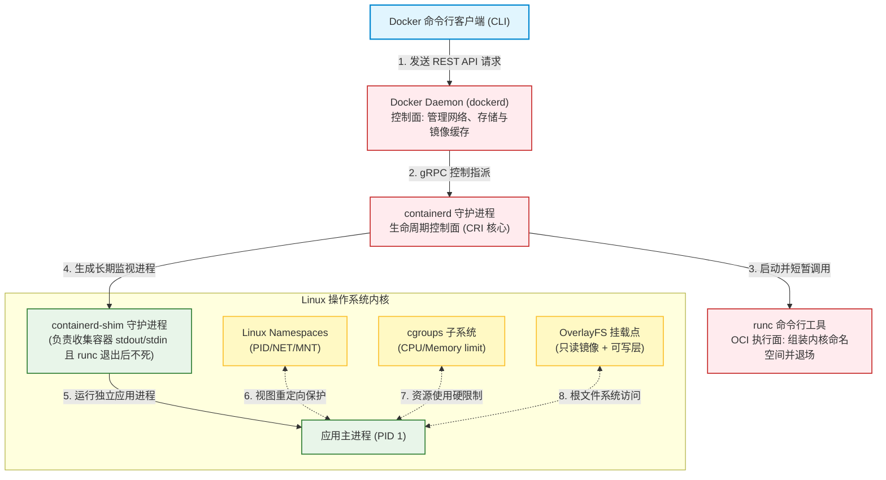
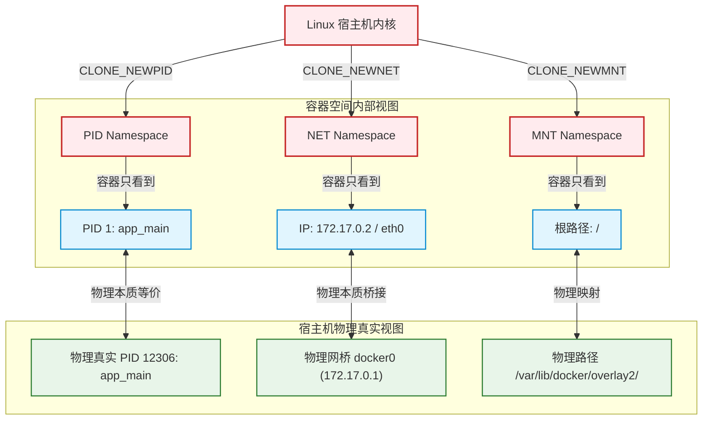
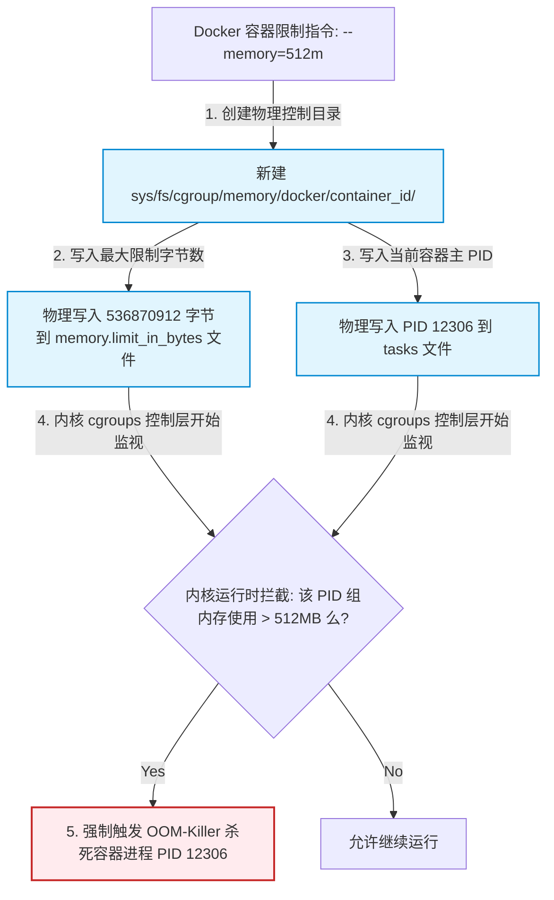
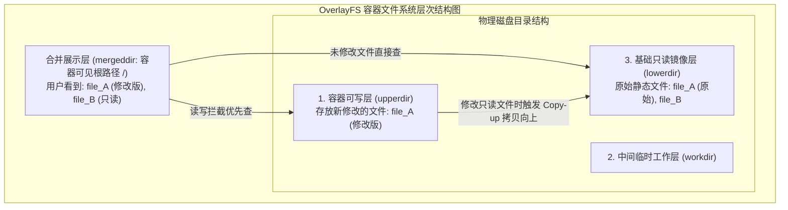
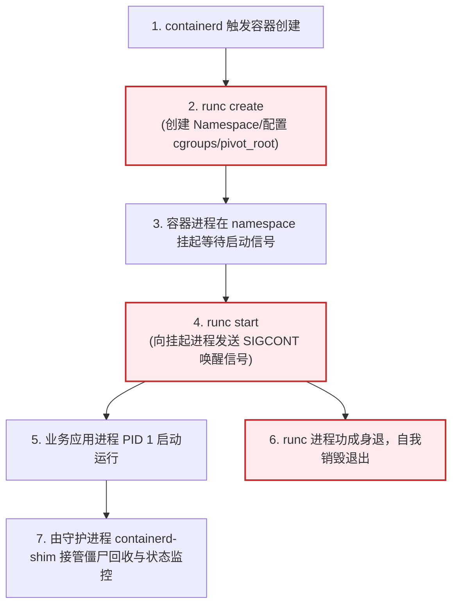

import CaseStudyHeader from '@site/src/components/CaseStudyHeader';
import DesignIntent from '@site/src/components/DesignIntent';
import EvolutionTimeline from '@site/src/components/EvolutionTimeline';
import CompareSlider from '@site/src/components/CompareSlider';
import TradeoffExplorer from '@site/src/components/TradeoffExplorer';
import GlossaryTerm from '@site/src/components/GlossaryTerm';
import ResearchNote from '@site/src/components/ResearchNote';
import GuidedExercise from '@site/src/components/GuidedExercise';
import QuizCard from '@site/src/components/QuizCard';
import MindMap from '@site/src/components/MindMap';
import PyRunner from '@site/src/components/PyRunner';

# Docker：云原生容器引擎、Namespace 视图隔离与 OverlayFS 存储架构

<CaseStudyHeader
  oneLiner="Docker 是现代云原生软件打包与运行的标准。它彻底终结了传统虚拟机由于虚拟化整套 Guest OS 带来的重度计算与存储损耗，直接共享宿主机内核（Host Kernel）。通过在内核级精细调和 Linux Namespaces 实现进程视图隔离、依靠 Control Groups 实施硬性的物理资源限额，并配合 OverlayFS 联合文件系统达成写时复制（CoW）的极速只读镜像分层，Docker 实现了毫秒级的容器启动时延与极致的运行密度。"
  stats={[
    {label: '系统定位', value: '操作系统级轻量进程虚拟化运行时 (容器)'},
    {label: '视图隔离技术', value: 'Linux Namespaces (PID, NET, MNT, IPC, UTS, USER)'},
    {label: '资源配额管控', value: 'Control Groups (cgroups v1/cgroups v2)'},
    {label: '存储分层引擎', value: '联合文件系统 OverlayFS (lowerdir / upperdir / merged)'},
    {label: '核心运行时', value: 'containerd + runc (符合 OCI 开放容器标准)'},
    {label: '网络桥接模式', value: 'docker0 Bridge + veth pair + iptables NAT'}
  ]}
/>

:::info 对应课程概念
本案例融合了以下课程核心概念：
*   **操作系统隔离边界（Month 1 进程与系统）**：内核 Namespaces 与 cgroups 如何从零组装出一个完全独立、安全的进程运行沙箱。
*   **写时复制与分层存储（Month 3 存储引擎）**：OverlayFS 读写重构逻辑中“只读底层 + 动态拷贝（Copy-up）写顶层”的极简持久化去重思路。
*   **网络虚拟化与路由（Month 5 分布式网络）**：veth pair 虚拟网卡通道与 Linux Bridge 配合下，容器包在网络命名空间中的路由跳转。
*   **软件生命周期标准（Month 4 设计原则）**：OCI 标准通过将管理面（containerd）与执行面（runc）解耦，展现高弹性的模块分层设计。
:::

---

## 1. 设计初衷：打破巨型 VM 的枷锁，实现毫秒级“一次打包，到处运行”

在 Docker 出现前，传统的企业开发与运维被困在 Hypervisor 虚拟机（VM）的庞大阴影下：
1.  **虚拟机的物理代价**：
    *   为了在一台物理服务器上隔离不同的业务程序，VMware 或 KVM 需要为每个应用虚拟化出一套完整的**客户操作系统（Guest OS）**，包含它专属的内核、虚拟 CPU、虚拟内存页表以及数 GB 级的系统磁盘镜像。
    *   哪怕只是跑一个 10MB 的极简 API 服务，也需要额外付出 1GB 以上的操作系统内存开销，并且每次启动或重启都需要经历漫长（几十秒至数分钟）的 OS 引导启动周期，资源利用率低下。
2.  **“进程沙箱化”的颠覆**：
    *   Docker 的创始人 Solomon Hykes 意识到：为什么不直接利用宿主机（Host OS）现有的 Linux 内核，仅仅在内核中为特定的应用进程套上一层“视图隔离的保护壳”？
    *   借助 Linux 现成的 **Namespaces**，可以让一个普通进程误以为自己拥有独立的 PID 1 树、独立的网卡、独立的根文件系统；配合 **cgroups** 限定其内存最大只能用 512MB。
    *   这样，容器在本质上只是**宿主机上的一个普通进程**，启动一个容器只需要微秒级的 `fork()` 系统调用，没有任何 Guest OS 启动损耗，单台物理机上可以轻松塞入上千个隔离的容器，密度飙升百倍。
3.  **用“分层联合挂载”解决镜像体积膨胀**：
    *   既然容器共享内核，那它运行所依赖的操作系统文件树（如 Ubuntu 的 lib 库、Python 环境）怎么携带？
    *   Docker 放弃了全量物理拷贝，自研了基于联合文件系统（UnionFS / OverlayFS）的镜像体系。把公共的基础 OS 设为只读底层（lowerdir），每个应用在此基础上叠加自己特有的修改。所有容器共享基础 OS 镜像层，写入时仅在最上层的可写层（upperdir）中动态追加，镜像分发体积缩减了 90% 以上。

<DesignIntent
  problem="如何设计一套能够消除 Guest OS 开销、在共享宿主机内核的前提下达成进程级强隔离，且镜像可无限分层、支持毫秒级启动的轻量化虚拟化运行时系统。"
  users="全球所有的云原生应用开发者、DevOps 自动化运维团队、以及需要执行海量微服务高弹性扩缩容的分布式架构师。"
  devices="支持运行在配备现代 Linux 内核（且开启 cgroups 和 namespaces 支持）的物理机、虚机或大型云厂商集群节点上。"
  goals={[
    '极致秒级启动：使容器在微秒级内创建并开始执行应用主进程，免去任何操作系统内核引导和初始内存分配的等待耗时',
    '物理资源硬限额：利用 cgroups 强制限制各容器的 CPU 核心配额和内存物理上限，防止发生单个容器内存泄露拖垮整台服务器的惨剧',
    '镜像多层去重分发：通过 OverlayFS 联合挂载，实现多容器对底座镜像的只读共享，消灭冗余存储，极大压缩网络克隆开销',
    '网络命名空间隔离：每个容器分配专属的 IP 地址和网络协议栈，在网络层呈现出完全独立的服务器节点状态'
  ]}
  constraints={[
    '共享内核安全防线脆弱：由于容器与宿主机共享同一个操作系统内核，一旦某个容器内部程序成功发起内核级越权逃逸（Container Escape），将能直接接管整台物理机上所有其他容器及宿主机安全，其隔离性弱于硬件 hypervisor 隔离',
    'OverlayFS 的写放大：当容器往只读层的大文件追加修改时，OverlayFS 会强行触发 copy-up 拷贝操作将整个大文件复制到可写层，导致瞬时的磁盘 I/O 抖动和空间浪费，因而重度 I/O 写入必须挂载卷（Volumes）',
    '跨节点多容器网络延迟：容器 Bridge 桥接模式下，网络包需要经过 veth pair 的管道转发和 iptables 的 NAT 网络地址转换，相比宿主机原生网络会有微弱的吞吐下降与延迟增加'
  ]}
  firstStep="创建 Namespaces 进程克隆环境（CLONE_NEWPID/NET/MNT/IPC/UTS）；配置 cgroups 控制器节点限制内存；mount 联合文件系统 OverlayFS；调用 pivot_root 切入根文件系统（rootfs）并执行 runc 指令。"
/>

---

## 2. 知识全景脑图

### 2a. 全景架构思维导图



### 2b. 交互脑图导航

<MindMap
  root={{
    label: 'Docker 核心架构',
    children: [
      {
        label: '视图与资源隔离 (Isolation)',
        children: [
          { label: 'Linux Namespaces 六大域' },
          { label: 'cgroups CPU/Memory 硬性配额' },
          { label: 'pivot_root 根路径切换' }
        ]
      },
      {
        label: '联合分层存储 (Storage)',
        children: [
          { label: 'lowerdir 只读镜像层' },
          { label: 'upperdir 容器可写层' },
          { label: 'Copy-on-Write 写时拷贝' }
        ]
      },
      {
        label: '网络与运行时 (Runtime)',
        children: [
          { label: 'docker0 网桥与 veth 对' },
          { label: 'containerd 宿主守护' },
          { label: 'runc OCI 执行引擎' }
        ]
      }
    ]
  }}
/>

---

## 3. 系统架构总览 (C4 Model)

### 3a. System Context (系统上下文图)

```mermaid
graph TB
  classDef client fill:#e1f5fe,stroke:#0288d1,stroke-width:1.5px;
  classDef main fill:#e8f5e9,stroke:#2e7d32,stroke-width:2px;
  classDef third fill:#fff9c4,stroke:#fbc02d,stroke-width:1.5px;

  Developer["开发运维人员 (DevOps)"]:::client -->|使用 Docker CLI 命令| HostDaemon["宿主机 Docker 守护进程 (dockerd)"]:::main
  
  HostDaemon <-->|拉取镜像 (HTTPS)| ImageRegistry["公共/私有镜像仓库 (Docker Hub / Registry)"]:::third
  HostDaemon <-->|管理存储卷映射| LocalDisk[("本地磁盘目录 (Volumes)")]:::main
```

### 3b. Container Diagram (容器结构图)



---

## 4. 核心机制拆解

### 4a. Linux Namespaces 进程级视图隔离

Linux 内核中的 <GlossaryTerm term="Namespaces" definition="Namespaces（命名空间）是 Linux 内核提供的一种系统资源隔离机制。它能使特定进程组只能看到自己命名空间内的资源，而看不到宿主机或其他命名空间内的资源，包括进程树（PID）、网卡（NET）、文件挂载点（MNT）等。">Namespaces</GlossaryTerm> 是容器隔离的第一道防火墙：
*   **CLONE 标志位**：Docker 底层在创建容器进程时，会调用系统 `clone()` 函数，并传入一系列内核隔离标志：
    *   `CLONE_NEWPID`：**进程号隔离**。容器内的进程只在它专属的 PID 树下排布，容器内的应用主进程会自认为是 PID 1（相当于系统的 init 进程），但它在宿主机上其实是一个几万号的普通 PID。
    *   `CLONE_NEWNET`：**网络隔离**。容器获得自己独立的虚拟网络设备（eth0）、IP 路由表、端口监听空间，隔离于宿主机的网络服务。
    *   `CLONE_NEWMNT`：**挂载点隔离**。容器只能看到自己命名空间内的文件挂载点，无法看到宿主机真实的 `/var`、`/etc` 等磁盘物理路径。
    *   `CLONE_NEWUTS` (主机名隔离)、`CLONE_NEWIPC` (进程间通信通道隔离)、`CLONE_NEWUSER` (用户和组 ID 映射隔离)。



---

### 4b. Control Groups (cgroups) 物理资源配额管控

有了 Namespaces 隔离，如果不对容器的 CPU 和内存进行物理限制，某个容器一旦发生内存泄露（Memory Leak）或高算力死循环，会瞬间耗尽整台机器的物理内存，导致宿主机内核触发 OOM-killer 强制杀死其他核心系统进程。
为此，Docker 引入了 <GlossaryTerm term="Cgroups" definition="Cgroups（Control Groups，控制组）是 Linux 内核用来限制、记录和隔离进程组所使用的物理资源（如 CPU、内存、磁盘 I/O、网络带宽）的机制，它是保障容器不会发生资源争抢与雪崩的核心。">Cgroups</GlossaryTerm> 机制：
1.  **物理文件夹的控制魔力**：
    *   在 Linux 下，cgroups 呈现为一个纯粹的文件系统（通常挂载在 `/sys/fs/cgroup/` 下）。
    *   当启动一个容器时，Docker 会在 `/sys/fs/cgroup/cpu/docker/` 和 `/sys/fs/cgroup/memory/docker/` 下自动创建一个以容器 ID 命名的子目录。
2.  **硬性限额写入**：
    *   **限制内存**：Docker 直接将 512MB 限制转换为 `536870912` 字节，写入该子目录下的 `memory.limit_in_bytes` 文件中。一旦容器内所有进程使用的物理内存之和超过此阈值，内核便会无情触发 OOM，将其 PID 1 杀掉自救。
    *   **限制 CPU**：通过向 `cpu.cfs_quota_us`（配额时长）和 `cpu.cfs_period_us`（时间周期，通常是 100ms）写入比例值来卡死容器在一个 CPU 周期内的最大可用算力，避免争抢。



---

### 4c. OverlayFS 联合文件系统与只读镜像层设计

传统的虚拟机操作系统镜像动辄几十 GB，而 Docker 的应用镜像仅几十 MB。这归功于 <GlossaryTerm term="OverlayFS" definition="OverlayFS 是一种现代化联合文件系统（UnionFS）。它将多个物理目录（分为只读低层 lowerdir 和可写高层 upperdir）逻辑重叠合并挂载到一个统一的目录中（mergeddir），为容器提供层次化、写时复制（CoW）的静态文件视图。">OverlayFS</GlossaryTerm> 的双层联合挂载机制：
1.  **联合文件四层结构**：
    *   `lowerdir`（只读层）：存放静态的公共镜像层（如 rootfs 基础 OS 软件包）。
    *   `upperdir`（可写层）：专门存放容器启动后发生的新增和修改。
    *   `workdir`（工作层）：Linux 内核用于过渡和数据原子准备的临时目录。
    *   `mergeddir`（合并视图）：**容器运行时真正看到的根目录 `/`**。它将 `lowerdir` 和 `upperdir` 逻辑重叠合并展示。如果两层有同名文件，上层的 `upperdir` 会覆盖下层的只读文件。
2.  **写时复制 (Copy-on-Write) 与 Copy-up 算法**：
    *   当容器只做 `Read` 时，OverlayFS 顺着 `merged` 直接定位到 `lowerdir` 进行直读，性能极佳。
    *   当容器第一次尝试修改 `lowerdir` 中的某个只读文件时，系统会在内核态自动触发 **Copy-up**：将该文件完整地从 `lowerdir` 中**拷贝复制一份到上层的 `upperdir` 可写层**，然后在可写层里进行就地修改。以后容器再读该文件，就会直接读取 `upperdir` 里的修改版，而 `lowerdir` 里的原始镜像文件毫发无损，确保了多个容器可以安全无干扰地共享同一个底层镜像。



---

### 4d. 容器网络虚拟化与 Bridge 桥接模式

Docker 在单机上为容器创建独立 IP 并与外界通信的奥秘在于 **Bridge（网桥）** 和 **veth pair** 虚拟网线：
1.  **虚拟网线对 (veth pair)**：
    *   veth pair 是 Linux 内核中的虚拟以太网设备对。它就像一根物理的双头网线，凡是从其中一头（端点 A）流入的数据包，都会无损地从另一头（端点 B）流出，即使这两个端点分属于不同的 NET Namespace。
2.  **网桥桥接路由**：
    *   Docker 在宿主机上创建一个虚拟交换机 `docker0`。
    *   对于每个容器，Docker 会生成一对 veth pair，将端点 A（`eth0`）塞入容器的网络命名空间内，将端点 B（`vethxxxx`）插在宿主机的 `docker0` 网桥上。
    *   容器对外发包时，数据包从容器内 `eth0` 出发，经过“网线”传送到宿主机网桥，再通过宿主机 `iptables` 规则执行 SNAT（源地址转换），无感路由至外部物理网络。

```mermaid
graph TB
  classDef namespace fill:#e1f5fe,stroke:#0288d1,stroke-width:1.5px;
  classDef bridge fill:#ffebee,stroke:#c62828,stroke-width:2px;
  classDef device fill:#e8f5e9,stroke:#2e7d32,stroke-width:1.5px;

  subgraph ContainerNet [容器网络命名空间 (CLONE_NEWNET)]
    Eth0["容器网卡: eth0<br/>IP: 172.17.0.2"]:::device
  end

  subgraph HostNet [宿主机默认网络命名空间]
    VethNode["宿主机侧虚拟网口: vethxxxx"]:::device
    Docker0["宿主虚拟交换机: docker0 网桥<br/>IP: 172.17.0.1"]:::bridge
    PhysicalNIC["宿主物理网卡: eth0 (物理层)<br/>IP: 192.168.1.100"]:::device
  end

  Eth0 <-->|1. 通过 veth-pair 虚拟双头网线直连| VethNode
  VethNode <-->|2. 插在网桥插槽上| Docker0
  
  Docker0 -->|3. 转发流量并执行 iptables NAT| PhysicalNIC
  PhysicalNIC -->|4. 流入外部物理交换机| Internet["外部网络 (Internet)"]
```

---

## 5. 关键数据结构与算法

### 5a. runc 启动生命周期与 OCI 运行时规范

为了确保容器可以在不同的容器管理引擎（Docker、Kubernetes、CRI-O）间通用，业界制定了 OCI（Open Container Initiative）规范，将容器的低级生命周期抽象给底层的 <GlossaryTerm term="runc" definition="runc 是一个轻量级命令行工具，是 OCI 容器运行时规范的事实标准实现。它仅负责读取容器 rootfs 和 config.json，调用系统调用创建 Namespace、挂载目录并配置 cgroups，然后执行目标程序，之后功成身退。">runc 命令行运行时</GlossaryTerm>：
1.  **config.json 规范**：
    *   runc 接收一个标准的 `config.json` 文件（规定了 Namespace 种类、cgroups 限定大小、rootfs 物理挂载目录路径）和一份已经解压好 OverlayFS 的根目录（rootfs）。
2.  **生命周期四阶段**：
    *   `create`：runc 派生子进程，子进程调用 `unshare()` 创立 Namespace，配置 cgroups 并在 namespaces 中挂载 rootfs 且调用 `pivot_root` 切换根文件目录，此时主程序挂起（处于创建就绪态）。
    *   `start`：触发执行真正的用户程序（PID 1 业务程序），runc 完成任务立刻退出，由 `containerd-shim` 接管容器的守护和生命周期收集。
    *   `kill` / `delete`：下发信号杀死 PID 1 并销毁 namespaces 与 cgroups 子系统。



---

### 5b. 写时复制 (Copy-on-Write / Copy-up) 算法

在联合文件系统中，写入只读层文件时会触发 Copy-up 算法。
*   **Copy-up 算法逻辑**：
    1.  当容器尝试写入文件 `file_x` 时，OverlayFS 驱动拦截该 VFS 写入请求。
    2.  扫描 `upperdir` 目录下是否已存在 `file_x`。若存在，直接将写操作定位到 `upperdir`（说明是非第一次写入）。
    3.  若不存在，在 `lowerdir` 中查找该文件。
    4.  若在 `lowerdir` 找到，在内核态创建一个与 `file_x` 元数据、硬链接数、文件权限完全一致的临时占位文件（在 `workdir` 中准备以保安全性）。
    5.  调用内核 `copy_file_range` 物理复制内容从 `lowerdir` 到 `workdir`，然后将 `workdir` 的文件原子重命名（rename）并移动到 `upperdir`，完成 Copy-up 动作。
    6.  将 VFS 的文件描述符重定位到 `upperdir` 中刚生成的拷贝文件上，执行实际的修改写入。

---

### 5c. 容器安全性：Capability 权限集与 Seccomp 过滤

虽然容器内的 root 用户的 PID 空间被隔离了，但由于共享内核，如果不对其系统调用权限加以硬性阉割，容器内的 root 用户依然可以利用部分危险系统调用攻击宿主机。
Docker 提供了双层系统调用防护罩：
1.  **Linux Capabilities（特权集裁剪）**：
    *   Linux 将传统的 root 全能特权拆分为几十个细粒度的 Capabilities（如 `CAP_NET_ADMIN` 管理网络、`CAP_SYS_ADMIN` 系统管理）。
    *   Docker 默认**只保留容器的 14 个安全 Capabilities**，阉割掉修改内核时间（`CAP_SYS_TIME`）、物理装载内核模块（`CAP_SYS_MODULE`）等危险特权，容器内的 root 只是一个虚幻的弱化特权用户。
2.  **Seccomp（安全计算模式）**：
    *   Docker 默认加载一个 Seccomp 白名单配置文件，严格阻断了约 300 多个不常用或高度危险的 Linux 系统调用（Syscalls），只要容器尝试执行这些调用，直接会被内核拦截并强行报错，防患逃逸。

---

## 6. 架构演进史

Docker 彻底颠覆了云计算和软件交付生态，引发了长达十余年的云原生演进浪潮：

<EvolutionTimeline
  events={[
    {
      year: '2013',
      title: 'dotCloud 开源 Docker',
      why: 'Solomon Hykes 在运营 dotCloud 平台（PaaS）时，急需一套高效、轻量、能彻底终结巨型虚拟机开销的进程级虚拟化打包交付组件。',
      change: '开源 Docker 并引入 UnionFS 镜像模型；底层依赖 Linux 原生的 LXC 容器管理器。'
    },
    {
      year: '2014',
      title: 'libcontainer 与自主内核时代',
      why: 'LXC 的代码迭代不受 Docker 团队控制，且不同发行版兼容性差，急需一套稳定、纯粹的 Go 语言内核底层实现。',
      change: '废除 LXC，自研纯 Go 开发的 `libcontainer`，实现了直接与 Linux 内核 Cgroups 和 Namespaces 的原生握手。'
    },
    {
      year: '2015-2016',
      title: 'OCI 标准确立与 containerd 大拆分',
      why: '谷歌（Kubernetes）、红帽等巨头为了对抗 Docker 官方在容器标准上的垄断，推动容器生态走向标准化和解耦。',
      change: '参与成立 OCI 开放容器联盟；将 Docker 架构垂直拆解为 containerd（高级运行时）与符合 OCI 规范的 runc（低级执行工具）。'
    },
    {
      year: '2018 至今',
      title: 'CRI 标准普及与云原生沙箱延伸',
      why: 'Kubernetes 官方废除了 dockershim，转向纯正的 CRI 接口（直接对接 containerd/CRI-O），且企业对共享内核的安全性提出更高挑战。',
      change: 'containerd 成为 CNCF 毕业项目；催生出 gVisor、Kata Containers (基于 MicroVM 强隔离的容器) 等新型安全沙箱容器生态。'
    }
  ]}
/>

---

## 7. 架构对比：传统 Hypervisor 硬件虚拟机 vs. 现代化 OS 容器 (Docker)

<CompareSlider
  before={
    <div style={{ padding: '20px', background: '#ffebee', border: '1px solid #c62828', borderRadius: '8px', height: '100%', color: '#333' }}>
      <strong>Hypervisor 虚拟机 (KVM / VMware)</strong>
      <p style={{ marginTop: '10px', fontSize: '0.9rem' }}>在物理硬件上运行 Hypervisor 控制器，每个 VM 物理分配虚拟硬件资源，并在其上运行一个完整的 Guest OS 操作系统内核。启动时间需要数十秒至数分钟，空载基线内存占用超 1GB，但具备最高等级的硬件级物理隔离防线。</p>
    </div>
  }
  after={
    <div style={{ padding: '20px', background: '#e8f5e9', border: '1px solid #2e7d32', borderRadius: '8px', height: '100%', color: '#333' }}>
      <strong>操作系统级容器 (Docker / OCI)</strong>
      <p style={{ marginTop: '10px', fontSize: '0.9rem' }}>容器直接共享宿主机的 Linux 内核，没有物理硬件虚拟化层。通过 Namespace 和 cgroups 实现轻量级进程视图和配额限制，启动在毫秒级内完成，内存和 CPU 开销为零（仅普通进程开销），但由于共享内核，安全逃逸风险高于 VM。</p>
    </div>
  }
  labels={['VM 虚拟机', 'OS 容器']}
/>

---

## 8. 设计模式与课程映射

本案例在实际云原生工业界基座中，深度应用了以下课程章节中的核心设计模式与技术：

1.  **内核 Namespace 隔离模式**（参见 [操作系统基础与进程](../01-foundations/programming-systems-primer.mdx) 章节）：
    *   Docker 将 Namespaces 组装起来创建隔离沙箱的手法，是系统设计中“沙箱模式（Sandbox Pattern）”和“故障边界隔离”的精妙实践。
2.  **写时复制 (COW) 存储分层模式**（参见 [存储引擎与持久化](../03-data-cache-queue/storage-engines.mdx) 章节）：
    *   OverlayFS 读写分流的 CoW 算法与 LSM-Tree 中的 immutable SSTable 以及 OS Page Cache 脏页合并思路非常吻合。它通过延迟复制，极大地保护了底层镜像不被篡改并节约了物理存储。
3.  **网络虚拟代理路由**（参见 [分布式系统网络](../05-core-components/load-balancing.mdx) 章节）：
    *   Bridge 桥接网络与 veth pair 通道，实质上是“网络层代理模式（Proxy Pattern）”的物理映射。它为容器代理了网卡的输入输出，利用 iptables 完成 NAT 地址伪装，实现了解耦的虚拟局域网。
4.  **OCI 运行时门面分层模式**（参见 [设计模式与 LLD](../04-design-patterns-lld/overview.mdx) 章节）：
    *   containerd 对高级生命周期的把控与 runc 对低级指令执行的解耦，应用了设计原则中的“单一职责原则（SRP）”与“门面模式（Facade Pattern）”。runc 做完就退场，让 containerd 接管，使得系统架构具有顶级的插拔兼容性。

---

## 9. 权衡：容器虚拟化生态中的架构折中

Docker 在资源开销、部署效率以及安全隔离强度之间做出了以下妥协：

<TradeoffExplorer
  title="Docker 容器隔离、效率与安全架构权衡"
  dimensions={['毫秒级容器启动时延', '宿主 CPU/内存虚拟损耗', '多租户运行安全性边界', '多实例共享镜像分层率', '宿主内核依赖多发行兼容性']}
  options={[
    {
      name: '共享内核 OS 级容器 (Docker 默认模型)',
      scores: [5, 5, 2, 5, 2],
      note: '通过直接共享宿主机内核，容器获得了微秒级的启动速度和几乎为零的虚拟化损耗，镜像多层挂载去重效率最高。但安全边界脆弱，一旦内核被击穿即可逃逸，且容器内的程序运行强依赖宿主机内核版本（无法在 Linux 容器里运行 Windows 内核应用）。',
      whenToUse: '可信的多微服务弹性部署、超高密度开发测试沙箱、以及追求极致启动吞吐的现代化云原生持续集成（CI）管道。'
    },
    {
      name: '传统 Hypervisor 强隔离虚拟机 (KVM 模型)',
      scores: [1, 2, 5, 1, 5],
      note: '运行完全独立的 Guest OS 内核，拥有硬件层面的极强安全防线，且能在 Linux 宿主上运行完全不同的操作系统。但缺点是每次冷启动都需要几十秒，基线内存高昂，且镜像必须包含整套 OS，数据分包沉重。',
      whenToUse: '多租户公有云物理资源销售、企业金融敏感数据计算、或者需要跨完全不同操作系统（如 Windows on Linux）运行的应用宿主。'
    },
    {
      name: '基于安全沙箱的 MicroVM 容器 (如 gVisor / Firecracker)',
      scores: [3, 3, 4, 3, 4],
      note: '通过在容器内使用轻量级用户态内核去拦截/代理系统调用（如 gVisor），或者启动一个几毫秒就能完成的极简微型 VM 内核（如 Firecracker），获得了接近容器的启动速度与接近虚拟机的强隔离安全边界，但会有一定的系统调用拦截性能损耗。',
      whenToUse: '云厂商提供的无服务器（Serverless / FaaS）函数计算平台、多租户代码在线运行评测系统（OJ）等安全极度敏感且要求快速启停的边缘计算场景。'
    }
  ]}
/>

---

## 10. 如果是你来设计：OverlayFS 镜像分层与写时复制 (COW) 仿真器

### 场景设想
在 Docker 使用的 OverlayFS 文件挂载底层：
*   镜像被分成了三个层级：
    1.  `lowerdir`（只读镜像层）：存放基础操作系统初始文件（如 `lowerdir/etc/hosts`, `lowerdir/bin/sh`）。
    2.  `upperdir`（容器可写层）：专门存放容器启动后发生的新增和修改。
    3.  `merged`（合并展示层）：容器进程最终看到的根文件树视图。
*   当容器进行读取（`get`）时：
    *   优先查找 `upperdir`，若没有，则去 `lowerdir` 查找。
*   当容器第一次修改只读层的某个文件时（`write`）：
    *   **触发 Copy-up 算法**：物理拷贝该文件从 `lowerdir` 到 `upperdir` 目录下。
    *   在 `upperdir` 中对该副本执行写入修改。
    *   以确保底层的只读镜像文件绝对不被破坏，且多容器并发运行时互不干扰。

请你用 Python 实现这套经典的 OverlayFS 联合挂载与写时复制（CoW）引擎模型。

<GuidedExercise
  title="基于 Python 的 OverlayFS 与写时复制 (CoW) 仿真"
  goal="实现包含 lower/upper 双目录检索、读取优先级查找、以及写只读文件自动触发 Copy-up 物理复制上浮的文件系统模拟器。"
  steps={[
    '步骤 1: 设计 OverlayFS 类。在内存中用字典分别模拟 `lowerdir`（只读镜像库）、`upperdir`（容器可写区）以及 `workdir`。',
    '步骤 2: 实现 `read_file(filename)`。顺着查找优先级：先查 `upperdir` 中是否已经存在修改版，若无，再去只读层 `lowerdir` 中读取。如果两边都无，抛出 FileNotFoundError。',
    '步骤 3: 实现核心的 `write_file(filename, new_content)` 写入算法。首先判断 `filename` 是否已经在 `upperdir` 容器可写区内：如果是，则属于非首次写，直接修改 `upperdir` 内容。',
    '步骤 4: 如果该文件仅存在于只读 `lowerdir` 中，则属于首次修改：触发 **Copy-up**，将该文件复制一份到 `upperdir`（打印复制日志），随后再在 `upperdir` 副本上覆盖写入新数据。',
    '步骤 5: 运行对比模拟。分别验证只读读取、首次写只读文件导致 copy-up、以及只读镜像目录中的物理内容在此期间保持完全不变，以验证写隔离性。'
  ]}
  checks={[
    '确认在首次写入只读文件 `hosts` 时，控制台打印出 “[Copy-up]” 的物理拷贝通知',
    '验证修改文件后，`lowerdir` 字典中的原始文件内容依然完好无损，且 `read_file` 已经能读到最新的修改值',
    '确认当控制台打印出“✅ OverlayFS 与写时复制自验证成功！”时，模拟器工作正常'
  ]}
/>

#### 交互式 Python 运行实验
在下方控制台中直接运行或修改已准备好的 OverlayFS 写时复制仿真代码：

<PyRunner
  expect="OverlayFS 与写时复制自验证成功"
  rows={25}
  code={`class OverlayFS:
    def __init__(self):
        # 用内存字典模拟底层的物理磁盘目录
        # lowerdir: 只读镜像层 (包含系统的基础配置文件)
        self.lowerdir = {
            "etc/hosts": "127.0.0.1 localhost\\n",
            "bin/sh": "[Binary data of shell]"
        }
        # upperdir: 容器可写层 (初始化为空，专门捕获容器运行时产生的新增与修改)
        self.upperdir = {}

    def read_file(self, filename):
        # 模拟 merged 合并视图下的读取优先级：
        # 1. 优先从 upperdir (可写层) 读取最新的修改
        if filename in self.upperdir:
            return self.upperdir[filename]
        
        # 2. 如果 upperdir 没找到，则从只读的 lowerdir 镜像层读取
        if filename in self.lowerdir:
            return self.lowerdir[filename]
        
        raise FileNotFoundError(f"File '{filename}' not found in OverlayFS.")

    def write_file(self, filename, content):
        # 模拟 VFS 写入逻辑并拦截触发 Copy-up 算法
        
        # 情况 A: 文件已经存在于 upperdir 可写层，代表并非第一次写入，直接修改
        if filename in self.upperdir:
            print(f"   [Write]: 文件 '{filename}' 已在 upperdir 中，直接原地覆写")
            self.upperdir[filename] = content
            return

        # 情况 B: 文件仅存在于 lowerdir 只读层中，说明发生首次写操作
        if filename in self.lowerdir:
            # 触发 Copy-up 机制！将只读层文件物理拷贝到可写层
            print(f"   [💥 Copy-up]: 首次写入只读文件 '{filename}'！物理拷贝 lowerdir -> upperdir...")
            # 模拟拷贝
            original_content = self.lowerdir[filename]
            self.upperdir[filename] = original_content
            
            # 在拷贝出来的 upperdir 文件副本上执行实际写入修改
            self.upperdir[filename] = content
            print(f"   [Write]: 成功在 upperdir 拷贝件上执行覆写。")
            return

        # 情况 C: 新增文件，直接写入 upperdir 可写层
        print(f"   [New File]: 在 upperdir 中创建新文件 '{filename}'")
        self.upperdir[filename] = content

# 测试开始
fs = OverlayFS()

print("--- 步骤 1: 只读读取演示 (lowerdir 文件) ---")
print(f"读取 etc/hosts (来自只读镜像):")
print(fs.read_file("etc/hosts"))


print("--- 步骤 2: 首次尝试写只读文件 'etc/hosts' (触发 Copy-up) ---")
new_hosts_content = "127.0.0.1 localhost\\n172.17.0.2 webapp_container\\n"
fs.write_file("etc/hosts", new_hosts_content)


print("\\n--- 步骤 3: 比对双层状态，检查是否实现了写隔离性 ---")
print(f"合并视口读取 etc/hosts 最新内容:")
print(fs.read_file("etc/hosts"))

print(f"lowerdir 只读层中的 etc/hosts 是否保持未被改动:")
print(f"'{fs.lowerdir['etc/hosts'].strip()}'")

print(f"upperdir 容器层中是否独立产生了该文件的副本:")
print(f"'{fs.upperdir['etc/hosts'].strip()}'")


print("\\n--- 步骤 4: 写入全新的日志文件 ---")
fs.write_file("var/log/app.log", "App started.\\n")

# 最终自校验
if (fs.lowerdir["etc/hosts"] == "127.0.0.1 localhost\\n" and 
    fs.upperdir["etc/hosts"] == new_hosts_content and 
    fs.upperdir["var/log/app.log"] == "App started.\\n"):
    print("\\n[✅ 验证成功]: OverlayFS 与写时复制自验证成功！")
else:
    print("\\n[❌ 验证失败]")
`}
/>

---

## 11. 常见误解

### 误解 1：Docker 容器内部有一套独立的“虚拟硬件层”和它自己专属的“精简版 Linux 内核”
*   **澄清**：这是极其普遍的致命误区（常与 VMware 等虚拟机混淆）。
    1.  Docker 容器内部**没有任何虚拟硬件层**，也没有任何虚拟网卡、虚拟磁盘控制器或虚拟内存芯片。
    2.  容器进程**绝对不包含也不运行任何 Linux 内核**。容器里的二进制应用（如运行在容器内的 Python）在执行底层系统调用（Syscalls）时，是直接绕过隔离环境、**直接在宿主机的操作系统内核上物理执行的**。
    3.  容器之所以能包含 Ubuntu 或是 Alpine 镜像，仅仅是指该镜像提供了用户态的**根文件树目录（rootfs，包含对应的 libc.so 等动态链接库）**，而这些动态库在运行时依然直接向宿主机的内核申请分配物理资源。

### 误解 2：通过 --cpus=2 限制容器 CPU 资源后，容器内部的 PID 1 主程序就绝对无法抢占超过 2 个 CPU 核心的算力
*   **澄清**：我们需要分清“瞬间算力配额”与“物理绑定绑定”。
    1.  Cgroups 默认使用的是 CFS（Completely Fair Scheduler）调度算法限额。当设置 `--cpus=2` 时，内核将其转化为配额配额（Quota）时长：在每 100ms（周周期期）的时间窗内，该容器内所有进程累计可以占用的 CPU 时间最多为 200ms。
    2.  这意味着，如果宿主机有 32 个物理核心，该容器在 100ms 内完全可以**在瞬间同时跑满 32 个物理 CPU**，只要这 32 个核心的累计使用时间加起来不超过 200ms，内核就不会对其进行限速（Throttling）。
    3.  这并非限制了“绑定的 CPU 核心数”，而是限制了“在一个周期内分得的 CPU 时间片总时长”。如果需要硬性绑定到物理某两个核心，必须显式调用 `--cpuset-cpus="0,1"`。

### 误解 3：只要我们以 root 身份运行容器（--user=root），容器内的进程就拥有与宿主机 root 用户完全对等的破坏力
*   **澄清**：这是片面的。
    1.  虽然在 PID 命名空间内，容器主进程拥有 root 权限，但它绝非宿主机上“全能的上帝”。
    2.  Docker 默认会在容器进程启动时，通过 **Linux Capabilities** 物理裁剪掉 root 最危险的特权。例如，容器内的 root 即使执行 `modprobe` 尝试强行加载一个内核驱动模块，或者试图调整宿主机的系统硬件时钟，系统内核都会直接拒绝执行，返回 Permission Denied。
    3.  此外，配合默认的 Seccomp 白名单规则，容器内的 root 执行 `reboot` 等内核调用也会被直接拦截，大幅削减了共享内核下的破坏域。

---

## 12. 知识自测

<QuizCard
  questions={[
    {
      q: '在 Docker 容器技术中，关于 Linux Namespaces 与 Cgroups 分别扮演的角色，以下描述最准确的是哪一项？',
      options: [
        'A. Namespaces 用来限制容器最大可以使用的物理内存大小，Cgroups 用来隔离容器内的进程号与主机名',
        'B. Namespaces 负责进行视图层面的“隔离”，让容器自认为拥有独立的网络、进程树与挂载点；Cgroups 负责进行物理资源层面的“限额”，给容器的 CPU、内存使用划定硬性红线',
        'C. Namespaces 是容器专用的虚拟 CPU 硬件，Cgroups 是容器专用的虚拟内存条',
        'D. 它们都是虚拟的操作系统，相互之间通过 Raft 共识强同步'
      ],
      answer: 1,
      explain: '这是理解容器底层原理的双足。“隔离（Isolation）”是由 Namespaces 完成的，通过将系统全局资源进行私有重定向使得进程眼界被遮蔽；而“控制限制（Limits）”是由 Cgroups 物理卡限的，通过内核级计数器拦截防止容器间资源发生抢占雪崩。'
    },
    {
      q: '当容器内的应用进程尝试向一个只读层镜像中的基础配置文件（例如 etc/hosts）追加写入一条新的 IP 映射时，OverlayFS 联合文件系统底层会执行什么动作？',
      options: [
        'A. 强行报错返回 READ_ONLY_FILESYSTEM 错误，禁止任何写入',
        'B. 绕过宿主机，直接在共享的只读镜像物理文件 hosts 上直接修改，导致其他所有运行同镜像的容器数据被同步篡改',
        'C. 触发 Copy-up 算法：系统内核在可写层（upperdir）中创建 hosts 文件的全新副本，并将只读层（lowerdir）的 hosts 内容拷贝至此，随后的修改与以后的读取都重定向到该可写层副本上',
        'D. 利用 Zlib 压缩算法在内存中强行伪造一个虚拟磁盘分区'
      ],
      answer: 2,
      explain: '这是 OverlayFS 联合挂载与写时复制（CoW）的经典机制。只读层 lowerdir 永远不变以利去重复用，所有修改均只在 upperdir 中沉淀。Copy-up 拷贝动作仅在首次修改时发生，消除了大范围物理拷贝，保障了只读底座的安全。'
    },
    {
      q: '为了防止容器共享宿主机内核带来潜在的安全逃逸漏洞，Docker 采取了哪些默认的安全加固方案？',
      options: [
        'A. 将所有容器中的 root 用户强制降级为普通无特权 guest 用户，禁止其执行任何 ls 等常用命令',
        'B. 强制容器在网络发包时只能使用 SSL 加密隧道，且每个文件都只能用 RSA2048 加密存储',
        'C. 通过 Linux Capabilities 裁剪掉容器内 root 用户的危险特权（如修改时钟、加载内核模块等），并默认绑定 Seccomp 系统调用白名单拦截高危内核函数调用',
        'D. 动态将所有容器内的进程转换为 WebAssembly 沙箱包再执行'
      ],
      answer: 2,
      explain: '由于容器共享内核，内核漏洞逃逸是最大隐患。通过限制 Linux Capabilities 特权集（默认裁剪仅保留 14 个）以及加载 Seccomp 安全计算过滤机制（阻断数百个危险系统调用），Docker 将容器内的破坏能力压缩在安全红线内。'
    }
  ]}
/>

---

## 来源清单

*   [Hykes, S., & dotCloud Team (2013), Docker: lightweight container runtime based on namespaces and cgroups (Docker Launch Presentation / GitHub)](https://github.com/moby/moby)
*   [Open Container Initiative (OCI), runtime-spec: Open Container Initiative Runtime Specification](https://github.com/opencontainers/runtime-spec)
*   [Linux Kernel Documentation: Namespaces & Control Groups (cgroups v2) Specifications](https://www.kernel.org/doc/html/latest/admin-guide/cgroup-v2.html)
*   [Linux Kernel Documentation: OverlayFS filesystems overlay mapping specifications](https://www.kernel.org/doc/html/latest/filesystems/overlayfs.html)
