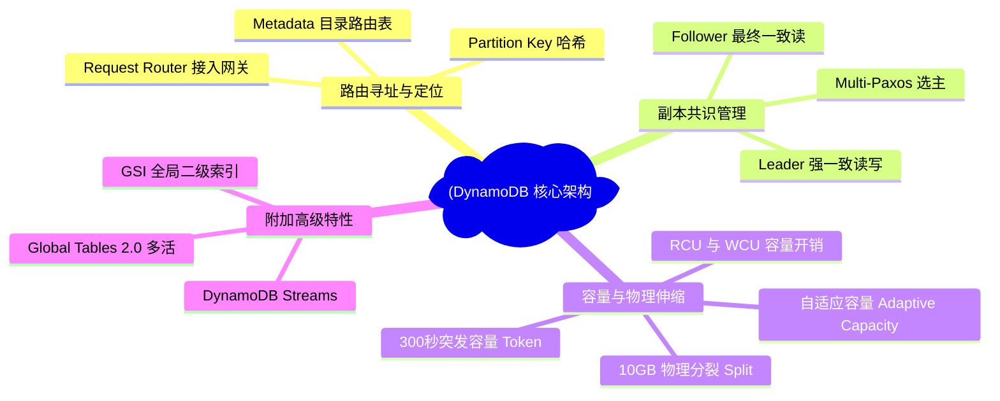
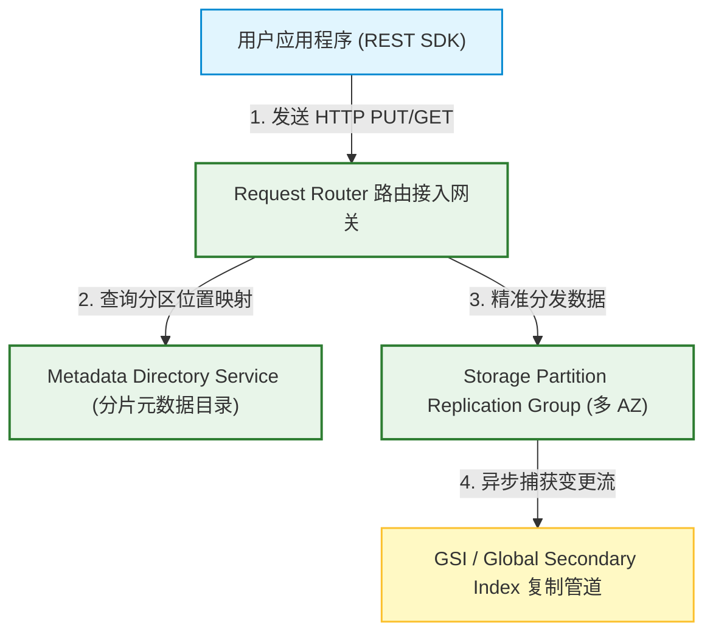
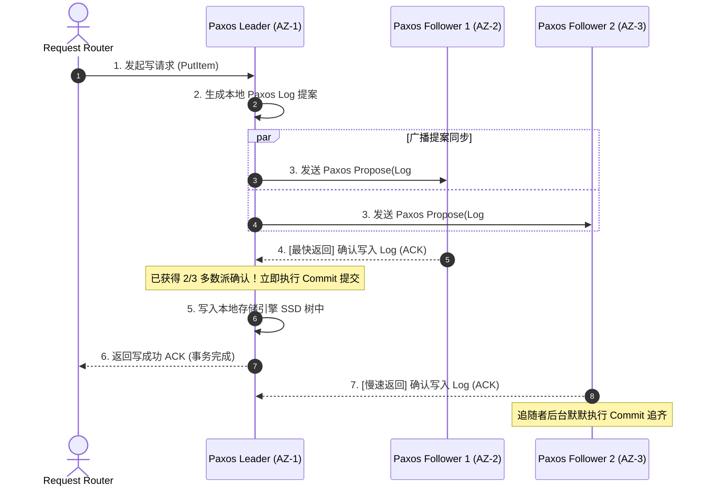
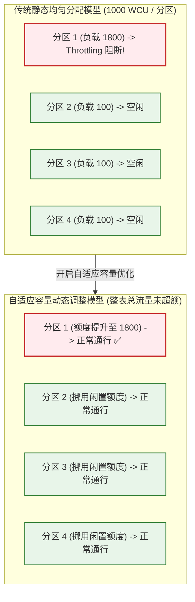

import CaseStudyHeader from '@site/src/components/CaseStudyHeader';
import DesignIntent from '@site/src/components/DesignIntent';
import EvolutionTimeline from '@site/src/components/EvolutionTimeline';
import CompareSlider from '@site/src/components/CompareSlider';
import TradeoffExplorer from '@site/src/components/TradeoffExplorer';
import GlossaryTerm from '@site/src/components/GlossaryTerm';
import ResearchNote from '@site/src/components/ResearchNote';
import GuidedExercise from '@site/src/components/GuidedExercise';
import QuizCard from '@site/src/components/QuizCard';
import MindMap from '@site/src/components/MindMap';
import PyRunner from '@site/src/components/PyRunner';


# AWS DynamoDB：海量高并发 NoSQL 数据库、一致性哈希路由与自适应容量架构

<CaseStudyHeader
  oneLiner="Amazon DynamoDB 是分布式 NoSQL 数据库的里程碑。它通过『元数据目录』与『一致性哈希』实现高效率的数据分区定位，采用 Multi-Paxos 共识协议在 3 个可用区（AZ）中管理数据副本的强一致写入，并利用『自适应容量（Adaptive Capacity）与突发令牌桶』技术动态平衡热点分区的吞吐开销，提供了在任何规模下均能维持个位数毫秒级访问延迟的极佳水平。"
  stats={[
    {label: '存储模型', value: '键值 / 文档型 NoSQL'},
    {label: '一致性协议', value: 'Multi-Paxos (3 副本复制)'},
    {label: '核心路由', value: '一致性哈希分区映射'},
    {label: '分区物理限制', value: '10 GB / 3000 RCU / 1000 WCU'},
    {label: '自适应扩容', value: '自适应容量 (Adaptive Capacity)'},
    {label: '读取一致模式', value: '强一致 (1.0 RCU) / 最终一致 (0.5 RCU)'}
  ]}
/>

:::info 对应课程概念
本案例融合了以下课程核心概念：
*   **水平分区与哈希数据分配（Month 5/12）**：一致性哈希在分布式 K-V 数据库中的运用，分区物理拆分与哈希环负载均衡。
*   **Paxos 共识写路径与读写一致性（Month 5 强一致）**：三副本架构下的 Leader 选主与多数派 Consensus 确认，以及最终一致性读的开销折中。
*   **流量整形与令牌桶分配（Month 4 性能调优）**：Provisioned 模式下，如何设计突发容量（Burst Bucket）与自适应吞吐挪用算法防防过载阻断。
:::

---

## 1. 设计初衷：用确定性架构跨越海量规模极限

传统的 Relational Database（如 MySQL、PostgreSQL）在遭遇百亿行级数据与数十万并发时，由于涉及复杂的 SQL 连表查询（Join）、事务锁限制、以及 ACID 强约束，其时延会呈指数级攀升。
1.  **水平扩展的“确定性”诉求**：
    *   DynamoDB 放弃了复杂的 SQL Join 语法，强制以 **Partition Key (分区键)** 为核心进行读写操作。
    *   通过哈希算法，不管数据总量是 10GB 还是 10PB，每次读写都能在常数时间 $O(1)$ 内定位到具体的物理分区节点（Storage Partition），保证了时延不随容量增长而衰退。
2.  **热点分区的“木桶效应”难题**：
    *   早期的预配置模式中，用户购买的总吞吐（例如 10000 WCUs）会被平均分配给所有的物理分区（假设 10 个分区，每片分得 1000 WCUs）。
    *   如果应用流量发生严重倾斜（如 90% 的请求都在读写分区 1 里的某个大 V 账号），分区 1 就会因耗尽其分配的 1000 WCUs 而疯狂抛出“吞吐超载异常（Throttling）”，即便整张表还有 9000 WCUs 处于完全空闲状态（即著名的 **热分区 / Hot Partition 问题**）。
    *   必须开发一套**自适应容量（Adaptive Capacity）**控制引擎，能够动态将冷分区的闲置流量份额调度补偿给热分区。
3.  **物理存储极限与自动分裂**：
    *   由于受限于物理存储媒介与单机 I/O，DynamoDB 规定单个物理分区的上限为 **10GB**，或吞吐上限为 **3000 RCUs / 1000 WCUs**。
    *   当单片数据量超过 10GB 时，内核必须支持无感知的**物理拆分（Partition Split）**，将数据一分为二分流到新服务器，且不影响在线读写。

<DesignIntent
  problem="如何构建一个在超大存储容量（PB级）和极高并发读写下，均能稳定提供个位数毫秒级访问延迟，并且能自适应热点数据分布、自动拆分扩容的分布式 NoSQL 数据库系统。"
  users="全球运行大规模电商购物车、广告展现特征库、实时设备追踪、以及社交 feed 状态缓存的架构与开发团队。"
  devices="支持通过 Amazon REST SDK 客户端发起调用。后台为部署在 AWS 多 AZ 骨干网络中的大规模多物理存储组节点。"
  goals={[
    '极致确定性时延：在任何规模下，PUT / GET 请求耗时均在个位数毫秒级内完成',
    'Multi-Paxos 强韧性：跨 3 个 AZ 节点同步 Paxos 日志，确保单个物理数据中心整体宕机时数据零丢失、服务秒级切换',
    '自适应容量整形：自动向热分区倾斜 WCU/RCU 资源，消除平均分配带来的无效 Throttling',
    '10GB 弹性分裂：当分区达到 10GB 或吞吐超阈值时，自动触发分裂（Partition Split），平滑迁移数据'
  ]}
  constraints={[
    '单分区吞吐瓶颈：无论如何自适应，单 Key（Partition Key）的绝对上限无法突破 3000 RCU / 1000 WCU 的物理硬限制，必须指导用户进行 Key 散列设计',
    '只读强一致折中：强一致读（Strong Read）必须由 Paxos Leader 处理，会消耗双倍的 RCU 成本。最终一致读（Eventual Read）可以在任意 Follower 读取，减半 RCU 开销',
    '跨区域延迟：Global Tables 的多活复制受光速物理限制，跨区同步必须采用最终一致合并'
  ]}
  firstStep="设计 Partition Key 的哈希寻址与 Metadata 映射表；实现 Multi-Paxos 三副本同步框架；构建自适应容量监测与动态 Token 分配管道；编写 Partition 物理分裂与数据后台迁移例程。"
/>

---

## 2. 知识全景脑图

### 2a. 全景架构思维导图


### 2b. 交互脑图导航
<MindMap
  root={{
    label: 'DynamoDB 核心架构',
    children: [
      {
        label: '路由寻址 (Routing)',
        children: [
          { label: 'Partition Key 哈希函数' },
          { label: 'Metadata 目录路由表' },
          { label: 'Request Router 接入网关' }
        ]
      },
      {
        label: '副本共识 (Consensus)',
        children: [
          { label: 'Multi-Paxos 选主与日志同步' },
          { label: 'Paxos Leader 强一致读写' },
          { label: 'Paxos Followers 最终一致读' }
        ]
      },
      {
        label: '容量与伸缩 (Scaling)',
        children: [
          { label: 'RCU 与 WCU 配置模型' },
          { label: '10GB 物理分裂 (Split)' },
          { label: '自适应容量 (Adaptive Capacity)' },
          { label: '300 秒突发容量 (Burst Bucket)' }
        ]
      },
      {
        label: '附加特性 (Extended)',
        children: [
          { label: 'DynamoDB Streams 日志捕获' },
          { label: 'Global Tables 跨区多活' },
          { label: 'GSI 全局二级索引异步同步' }
        ]
      }
    ]
  }}
/>

---

## 3. 系统架构总览 (C4 Model)

以下是 AWS DynamoDB 读写网关、强一致 <GlossaryTerm term="Multi-Paxos (多 Paxos 共识)" definition="一种用于在分布式系统中达成一致日志序列的共识协议。DynamoDB 用它在跨可用区 (AZ) 的三副本间保持强一致写入与自动选主。">Multi-Paxos</GlossaryTerm> 存储组与全局二级索引异步流 C4 Context 与 Container 拓扑。

### 3a. System Context (系统上下文图)



### 3b. Container Diagram (容器结构图)

```mermaid
graph TB
    classDef client fill:#e1f5fe,stroke:#0288d1,stroke-width:2px;
    classDef control fill:#e8f5e9,stroke:#2e7d32,stroke-width:1.5px;
    classDef replica fill:#ffebee,stroke:#c62828,stroke-width:1.5px;

    UserConn["REST HTTPS Request"] <--> FrontRouter["Request Router Gateway"]:::control
    FrontRouter <-->|1. 缓存在本地的 Key-to-Node 目录表| DirectoryCache["Local Directory Cache"]:::control

    subgraph PartitionReplicaGroup ["Storage Partition 复制组 (跨 AZ)"]
        FrontRouter -->|2. 写请求直接分发至 Leader| Leader["Paxos Leader Node (AZ-1)"]:::replica
        
        Leader <-->|3. Multi-Paxos 日志共识同步| Follower1["Paxos Follower Node 1 (AZ-2)"]:::replica
        Leader <-->|3. Multi-Paxos 日志共识同步| Follower2["Paxos Follower Node 2 (AZ-3)"]:::replica
    end

    subgraph StorageNodeInternal ["单机物理存储引擎 (以 Leader 为例)"]
        Leader -->|4. 追加入 TxLog 事务日志| SSDLog["WAL / 顺序事务日志 (SSD)"]:::replica
        Leader -->|5. 写入本地 K-V 存储树| StorageEngine["RocksDB-like Storage Engine"]:::replica
        StorageEngine -->|6. 生成变更事件| Stream["DynamoDB Stream Queue"]:::replica
    end

    Follower1 -->|读| ReadReplica1["("物理 SSD 磁盘 Group")"]:::replica
    Follower2 -->|读| ReadReplica2["("物理 SSD 磁盘 Group")"]:::replica
```

---

## 4. 核心机制拆解

### 4a. 一致性哈希路由机制

DynamoDB 在控制面上依靠哈希分布与 <GlossaryTerm term="Partition Key (分区键)" definition="DynamoDB 用作内部哈希函数输入的属性。它决定了数据被存储在哪个物理分区，是 $O(1)$ 查找的关键。">Partition Key (分区键)</GlossaryTerm> 寻址解决数据分流：
1.  **哈希映射定位**：当用户请求 `PutItem(PartitionKey="UserA", Value="...")` 时，Request Router 对 Partition Key 运行哈希算法（例如 MD5 或 SHA-256），计算得出一个全局 Hash 值。
2.  **分区段查找**：Request Router 查询缓存在本地内存中的 `Key-to-Node` 目录表（由 Metadata Directory Service 权威发布维护）。该表定义了哈希数值区间到物理物理存储组的映射（例如：`Hash(Key) in [0x000, 0x1FF] -> Partition 1`）。
3.  **瞬间分发**：Router 绕过任何复杂的数据库查找，以 $O(1)$ 复杂度直接将网络包投递给 `Partition 1` 复制组的 Paxos Leader 节点，保证了极高的网络性能。

```mermaid
graph TD
    classDef router fill:#e3f2fd,stroke:#1565c0,stroke-width:1.5px;
    classDef meta fill:#e8f5e9,stroke:#2e7d32,stroke-width:2px;
    classDef node fill:#ffebee,stroke:#c62828,stroke-width:1.5px;

    PutItem["PUT Item: PartitionKey = 'UserID_998'"] --> Router["1. Request Router Gateway 接收"]:::router
    
    Router --> HashCalc["2. 计算哈希: Hash('UserID_998') = 0xAA24"]:::router
    
    Router -->|3. 查询路由目录 (全内存)| DirectoryTable["("Metadata Hash Ring Table")"]:::meta
    
    DirectoryTable -->|0x8000 ~ 0xBFFF -> Storage Group 3| Router
    
    Router -->|4. 直接发送数据包到对应的存储复制组| Group3["Storage Group 3 (Paxos Leader)"]:::node
    
    Group3 --> WriteLocal["5. 写入 Group 3 本地 SSD 存储树"]
```

---

### 4b. Multi-Paxos 三副本共识写路径

为了保证高可用与数据强韧性，每个物理存储分区组在 3 个 Availability Zones（可用区）各部署一个副本：
1.  **写流向 Leader**：Request Router 总是把写操作（PUT/DELETE/UPDATE）直接投递给当前的 **Paxos Leader**。
2.  **提案同步（Proposal）**：Leader 收到请求后，生成一个 Paxos 提案日志，并发广播给 AZ-2 和 AZ-3 的 **Followers**。
3.  **多数派提交确认**：只要有一个 Follower 返回“已写入 Log 成功”的确认，即达成了 **2/3 的多数派共识（Quorum）**。Leader 随即在本地执行事务 Commit，写入 SSD 的 Local K-V 存储树中，并向 Request Router 返回 Success。
4.  **强一致读与最终一致读**：
    *   **强一致读 (Strongly Consistent Read)**：GET 请求同样路由给 Paxos Leader，由 Leader 提取绝对最新的已 Commit 状态，代价是消耗 1 个 RCU（最大 4KB 数据）。
    *   **最终一致读 (Eventually Consistent Read)**：GET 请求可以随机分发给包括 Follower 在内的任意副本。如果数据正在同步中，可能会读到微秒级的旧版本。但由于分流了 Leader 压力，RCU 消耗折半（仅需 0.5 RCU），大幅度节省了读取资费。



---

### 4c. 分区物理分裂机制 (Partition Split)

随着数据不断注入，单个物理存储分区可能会越界。DynamoDB 在后台自动监控并处理 <GlossaryTerm term="Partition Split (分区分裂)" definition="当单个物理分区大小超过 10GB，或读写吞吐上限达到极限时，DynamoDB 后台自动执行等分哈希边界，并重新均衡迁移数据的过程。">物理分裂 (Partition Split)</GlossaryTerm>：
*   **触发阈值**：当某个分区的数据大小达到 **10GB**，或者由于高频读写，该分区被分配的逻辑流量持续达到 **3000 RCUs 或 1000 WCUs** 时，系统决定触发物理分裂。
*   **分裂逻辑**：
    *   Metadata Service 在元数据中生成两个新子分区，例如将原先 `0x000-0x1FF` 划分为 `0x000-0x0FF`（子分区 A）和 `0x100-0x1FF`（子分区 B）。
    *   原分区的 Paxos Leader 锁定当前写入，并触发后台的数据重均衡迁移（Rebalancing）。
    *   将属于 B 段哈希范围的数据，批量物理搬迁到另一台物理存储组的 SSD 上。
    *   迁移完成后，更新全局元数据路由目录。原分区占用的物理空间被异步清空。
*   **无感分裂**：整个分裂在数十秒内完成，Request Router 遇到分裂期间的请求会自动暂存并重试，用户无感知。

```mermaid
graph TD
    classDef node fill:#e3f2fd,stroke:#1565c0,stroke-width:1.5px;
    classDef action fill:#ffebee,stroke:#c62828,stroke-width:2px;

    OriginalPartition["原分区 Group 1 (Hash: 0x000 - 0x1FF)<br/>[数据量达到 10.2 GB - 超限"]"] --> SplitTrigger["1. 触发后台 Partition Split 机制"]:::action
    
    SplitTrigger --> MetaUpdate["2. 元数据逻辑划分:<br/>SubA: 0x000 - 0x0FF<br/>SubB: 0x100 - 0x1FF"]:::action
    
    MetaUpdate --> CopyData["3. 后台物理搬迁 B 段数据到全新存储组 Group 2"]:::action
    
    CopyData --> UpdateRoute["4. 更新全局 Metadata Directory 映射路由表"]:::action
    
    UpdateRoute --> ReadyA["子分区 SubA (Group 1 提供服务, 物理大小 5.1GB)"]:::node
    UpdateRoute --> ReadyB["子分区 SubB (Group 2 提供服务, 物理大小 5.1GB)"]:::node
```

---

### 4d. 自适应容量机制 (Adaptive Capacity)

<GlossaryTerm term="Adaptive Capacity (自适应容量)" definition="DynamoDB 的流量调度机制。在表总吞吐未超限时，动态将闲置物理分区的 WCU/RCU 令牌配额转移至高流量的热点物理分区，消除静态均摊导致的限流。">自适应容量 (Adaptive Capacity)</GlossaryTerm> 用于根治“热分区预估容量被 Throttling 误杀”的问题：
1.  **逻辑均摊限流**：假设用户为一张包含 4 个分区的表配置了 4000 WCUs，物理上每片被硬性分配了 1000 WCUs。
2.  **热点流量监控**：突然发生流量倾斜，分区 1 遇到了 1800 WCUs 的流量压强，而分区 2、3、4 只有 100 WCUs 的极低负载。
3.  **自适应令牌挪用**：自适应容量组件检测到这一现象。由于整张表配置的总容量（4000 WCUs）并未耗尽（当前总消耗为 $1800 + 100 \times 3 = 2100$），自适应容量会自动将冷分区的闲置可用额度划拨给分区 1，将分区 1 的临时限流上限提升至 1800 WCUs（单片绝对不能超过物理极限 1000 WCUs 的限制，但通过动态合并多个物理分区，或者将热 Key 分离，上限被极大地弹性化）。这消除了临时峰值带来的 ProvisionedThroughputExceededException。



<ResearchNote
  title="DynamoDB 水平扩展 NoSQL 数据库设计与一致性共识理论"
  source="DeCandia et al. (2007), Dynamo: Amazon’s Highly Available Key-value Store (SOSP)"
  href="https://dl.acm.org/doi/10.1145/1294261.1294281"
  insight="经典的 2007 年 Dynamo 论文奠定了分布式无共享 NoSQL 的基石。它首次展示了如何利用一致性哈希环（Hash Ring）、矢量时钟（Vector Clocks）、以及去中心化 Gossip 复制协议实现写不卡顿的高可用存储。尽管后来的托管 DynamoDB 将去中心化哈希环改为了由元数据目录控制的 Multi-Paxos 强一致复制组，但其『通过 Partition Key 进行无共享分流定位』的核心设计哲学被完美保留。"
  application="架构启示：在超大规模数据库架构中，**一定要提供天然的“水平伸缩确定性”**。任何不能写成 $O(1)$ 哈希定位的路由设计，最终都会在万亿级的数据洪峰下遭遇瓶颈。设计 Month 12 大规模微服务数据分片或缓存一致环时，DynamoDB 的分区路由思想是极其核心的参考模板。"
/>

---

## 5. 关键数据结构与算法

### 5a. 一致性哈希环节点定位算法 (Consistent Hashing)

虽然托管 DynamoDB 在内部通过元数据目录（Metadata Directory）管理映射，但其基本哈希环路由算法在分布式 K-V 节点定位中具有极高的代表性。

#### 哈希环路由逻辑：
*   整个哈希值空间被定义为一个首尾相连的环，例如哈希值范围为 [0, 2^32 - 1]。
*   物理存储组（Partition）的哈希值也通过 Hash 函数计算并落在哈希环的对应坐标上。
*   当计算一个 Item 的 Partition Key 哈希值 H = Hash(Key) 时，我们在哈希环上**顺时针寻找第一个哈希值大于或等于 H 的存储节点**。该节点即为该数据的权威存储 Partition。

#### 虚拟节点（Virtual Nodes）负载均衡优化：
为了防止物理存储节点在哈希环上分布不均导致数据倾斜，系统为每个物理存储组分配 $V$ 个虚拟节点（Tokens），散落在哈希环的各个象限，从而使数据分配和分区拆分时的负载极其平滑。

```mermaid
graph TD
    classDef client fill:#e1f5fe,stroke:#0288d1,stroke-width:1.5px;
    classDef vnode fill:#fff9c4,stroke:#fbc02d,stroke-width:1.5px;
    classDef pnode fill:#e8f5e9,stroke:#2e7d32,stroke-width:2px;

    ItemKey["Item Key (Hash = 45)"] -->|1. 顺时针寻址| VNode2["虚拟节点 NodeA-Token2 (Hash = 60)"]:::vnode
    VNode2 -->|2. 物理映射| PNodeA["物理分区 Node A (AZ-1)"]:::pnode

    subgraph HashRing ["一致性哈希环空间 [0, 99"]]
        VNode1["虚拟节点 NodeB-Token1 (Hash = 20)"]:::vnode
        VNode2
        VNode3["虚拟节点 NodeA-Token1 (Hash = 85)"]:::vnode
    end
```

---

### 5b. RCU 与 WCU 容量开销数据算法

DynamoDB 通过配置**预配置吞吐容量（Provisioned Capacity）**来限制表吞吐，其计费（基于 <GlossaryTerm term="RCU (Read Capacity Unit, 读取容量单位)" definition="DynamoDB 计费与限流指标。1 个 RCU 对应每秒 1 次 4KB 强一致性读，或每秒 2 次 4KB 最终一致性读。">RCU (Read Capacity Unit)</GlossaryTerm> 与 <GlossaryTerm term="WCU (Write Capacity Unit, 写入容量单位)" definition="DynamoDB 计费与限流指标。1 个 WCU 对应每秒 1 次最大 1KB 的写入操作。">WCU (Write Capacity Unit)</GlossaryTerm> 容量单位）与承载限制基于以下公式：

1.  **WCU（Write Capacity Units）计算公式**：
    每个 WCU 支持单次最大 1KB 的写入操作：
    $$WCU\_Cost = sum(ceil(PayloadSize_i / 1KB)) (i = 1...Req)$$
    若单次写入 Payload 大小为 1.5KB，则向上取整，消耗 2 个 WCUs。

2.  **RCU（Read Capacity Units）计算公式**：
    *   **强一致读（Strongly Consistent Read）**：每个 RCU 支持单次最大 4KB 数据读取：
        $$RCU\_Cost\_Strong = sum(ceil(PayloadSize_i / 4KB)) (i = 1...Req)$$
    *   **最终一致读（Eventually Consistent Read）**：每个 RCU 支持单次最大 4KB 的双次读取（开销减半）：
        $$RCU\_Cost\_Eventual = 0.5 \times sum(ceil(PayloadSize_i / 4KB)) (i = 1...Req)$$

---

## 6. 架构演进史

AWS DynamoDB 的架构演进代表了工业界 NoSQL 数据库从强行高可用向强一致和完全托管进发的演变：

<EvolutionTimeline
  events={[
    {
      year: '2007',
      title: 'Dynamo 论文发表：去中心化 DHT 时代',
      why: '亚马逊电商平台急需一个“永不写失败”的购物车存储。当时单机磁盘 I/O 频繁遇到瓶颈，关系型数据库高可用切换太慢。',
      change: '提出基于无中心 DHT Consistent Hashing 环的设计；使用向量时钟解决写入冲突，元数据完全去中心化 Gossip 同步。'
    },
    {
      year: '2012',
      title: 'DynamoDB 正式发布：托管 SSD 存储时代',
      why: '经典的 Dynamo 最终一致性对客户端开发太痛苦，且去中心化架构在重构和管理时极度繁琐，需要全面拥抱固态硬盘（SSD）并简化一致性模型。',
      change: '将后台 DHT 哈希环重构为由元数据目录管理的 Paxos 三副本组；全面采用 SSD 磁盘做 WAL 事务日志；引入 RCU/WCU 吞吐购买模式。'
    },
    {
      year: '2017',
      title: '自适应容量（Adaptive Capacity）上线',
      why: '用户购买的 WCU/RCU 均匀分配给物理分区后，“热点分区异常 Throttling”频发，哪怕整表总配额仍有大量盈余。',
      change: '开发自适应容量控制器，自动检测负载倾斜，动态将冷分区的 WCU/RCU 令牌挪用转移给热分区，防範无效限流。'
    },
    {
      year: '2018',
      title: 'Global Tables 2.0 与 On-Demand 模式上线',
      why: '全球跨地域多活（Active-Active Multi-Region）成为刚需；且 serverless 无服务架构需要支持按请求计费（On-Demand），不再强制配置 WCU/RCU。',
      change: '推出支持自动扩展与缩容的 On-Demand 按需付费计费模式；Global Tables 引入物理双向流同步，依靠 LWW 解决跨区冲突。'
    }
  ]}
/>

---

## 7. 架构对比：DynamoDB 托管 Paxos 架构 vs. Cassandra 经典去中心化 DHT 架构

<CompareSlider
  before={
    <div style={{ padding: '20px', background: '#ffebee', border: '1px solid #c62828', borderRadius: '8px', height: '100%', color: '#333' }}>
      <strong>Cassandra 经典去中心化 DHT 架构</strong>
      <p style={{ marginTop: '10px', fontSize: '0.9rem' }}>去中心化 P2P 环形网络，没有单点 Leader。写入和读取使用可配置的 Quorum（如 W=2, R=2）直接与任意节点通信。容错度极高，但缺点是在发生网络割裂时极易读取到旧版本，且数据碎片清理（Compaction）会造成显著的磁盘 I/O 抖动。</p>
    </div>
  }
  after={
    <div style={{ padding: '20px', background: '#e8f5e9', border: '1px solid #2e7d32', borderRadius: '8px', height: '100%', color: '#333' }}>
      <strong>DynamoDB 托管 Paxos 复制组架构</strong>
      <p style={{ marginTop: '10px', fontSize: '0.9rem' }}>由元数据服务直接管理 Partition map，存储节点划分独立的 Paxos 复制组，确立强 Leader。所有的强一致读写直接由 Leader 执行，规避了复杂的 Quorum 协商，消除了后台 Compaction 带来的 I/O 干扰，且能提供极稳定的 0-9 毫秒延迟。</p>
    </div>
  }
  labels={['Cassandra 去中心化', 'DynamoDB 托管 Paxos']}
/>

---

## 8. 权衡：NoSQL 数据库系统的关键架构折中

DynamoDB 在一致性、吞吐量和资源调度上进行过多项关键性的折中：

<TradeoffExplorer
  title="DynamoDB 吞吐配置、一致性与延迟折中"
  dimensions={['读写延迟稳定性 (个位数ms)', '数据强一致读保障', '峰值吞吐自适应性', '存储维护与运维复杂度', '读取资费性价比']}
  options={[
    {
      name: '托管 Multi-Paxos Leader 强一致读 (Strong Read)',
      scores: [5, 5, 4, 5, 2],
      note: '所有的 GET 请求必须被路由到 Paxos Leader 上以保证 100% 的 Read-After-Write 强一致。获得了与传统 RDBMS 相同的一致性体验。但缺点是 Leader 节点的负载压力增加，且需要消耗双倍的 RCU 购买成本。',
      whenToUse: '金融订单支付状态查询、库存变动确认、以及对数据准确度有刚性约束的核心交易数据库。'
    },
    {
      name: 'Gossip 最终一致读 (Eventual Consistent Read)',
      scores: [5, 2, 5, 5, 5],
      note: 'GET 请求随机路由到 3 个 AZ 的任意 Follower 节点，分流读取流量。RCU 资费开销减半，非常便宜。但代价是在写操作刚刚完成的几微秒到几毫秒内，可能会读到旧的数据状态。',
      whenToUse: '社交媒体点赞数、论坛帖子浏览量、设备温度指标上报等允许轻微读取滞后的高频读取场景。'
    },
    {
      name: 'On-Demand Serverless 自动吞吐弹性',
      scores: [4, 4, 5, 5, 3],
      note: '不用提前购买 RCU/WCU，由系统根据真实 QPS 自动收紧或分裂底层物理 Partition。零运维介入，非常省心。但缺点是如果流量突然爆发（冷启动），前几毫秒的请求可能会因为 Partition 后台扩容不及时遭遇短暂限流 Throttling。',
      whenToUse: '流量波峰波谷明显、不可预测，且希望系统完全零运维负担的初创或内部中后台系统。'
    }
  ]}
/>

---

## 9. 如果是你来设计：DynamoDB-like 分区哈希定位与自动分裂器

### 场景设想
在 DynamoDB 的底层物理管理中，我们需要设计一个分区映射管理器：
*   整个哈希空间为 $[0, 99]$。
*   最初只有一个物理分区 `Partition1`，其覆盖哈希范围为整个 $[0, 99]$。
*   我们规定，**单个物理分区的最大承载数据量为 5 条记录（10GB 的简易模拟）**。
*   当一个分区插入第 6 条记录时，触发 Partition Split 物理分裂：
    *   将该哈希区间等分为二（例如 $[0, 49]$ 和 $[50, 99]$）。
    *   将现有数据根据最新哈希边界分流到两个新子分区中，并更新路由表。

请你用 Python 实现这个分区 Key 映射定位与自动物理分裂的模拟器。

<GuidedExercise
  title="基于 Python 的 DynamoDB 分区哈希映射与自适应分裂模拟"
  goal="实现 Partition key 的哈希归类、物理分区数据写入、以及超限时的物理等分分裂与数据重均衡逻辑。"
  steps={[
    '步骤 1: 设计哈希定位函数 `hash_key(key)`。为简单起见，可以计算 key 的字符 ASCII 累加值后对 100 取模：`sum(ord(c) for c in key) % 100`。',
    '步骤 2: 设计 Partition 类。包含属性：分区名 `name`、哈希覆盖边界 `range_start` 和 `range_end`、以及存放数据的字典 `data_store`。',
    '步骤 3: 编写 `insert_item(key, value)` 逻辑。定位满足 `range_start <= hash_key(key) <= range_end` 的分区，将数据存入该分区的 `data_store`。',
    '步骤 4: 实现 `split_partition(partition)` 分裂逻辑。当分区数据项超过 5 个时，将其哈希边界等分。创建两个新子分区，将数据重新 Hash 重新路由分流，并从主路由表中删去旧分区。验证插入 8 个不同哈希键后，分区数能正确从 1 自动分裂为多个。'
  ]}
  checks={[
    '确认对于任意输入的 key，系统能利用哈希值正确路由定位到对应的物理分区',
    '验证当单个分区写入满 5 条后，再次写入能顺利触发后台 Partition Split 分裂并完成数据数据重均衡',
    '验证分裂完成后，查询之前写入的 key 仍能正确且稳定在个位数毫秒内返回数据'
  ]}
/>

#### 交互式 Python 运行实验
在下方控制台中编写或直接运行已准备好的 DynamoDB 哈希路由与物理分裂模拟代码。点击“运行代码”即可在浏览器中通过 Pyodide 运行：

<PyRunner
  expect="分裂完成"
  rows={22}
  code={`class Partition:
    def __init__(self, name, range_start, range_end):
        self.name = name
        self.range_start = range_start
        self.range_end = range_end
        self.data_store = {}

    def __repr__(self):
        return f"{self.name}[{self.range_start}-{self.range_end}](Count: {len(self.data_store)})"

class DynamoPartitionManager:
    def __init__(self):
        # 初始只包含一个覆盖全局 0-99 的物理分区
        self.partitions = [Partition("Partition_1", 0, 99)]

    def hash_key(self, key):
        # 计算 key 的 ASCII 累加值后对 100 取模
        return sum(ord(c) for c in key) % 100

    def find_partition(self, key_hash):
        # 根据哈希值定位分区
        for p in self.partitions:
            if p.range_start <= key_hash <= p.range_end:
                return p
        return None

    def insert(self, key, value):
        key_hash = self.hash_key(key)
        p = self.find_partition(key_hash)
        if not p:
            print(f"Error: 无法为 key '{key}' (Hash: {key_hash}) 找到分区！")
            return

        p.data_store[key] = value
        print(f"写入 Key='{key}' (Hash={key_hash:02d}) -> {p.name}")

        # 单个分区最大容纳 5 条数据，第 6 条触发分裂
        if len(p.data_store) > 5:
            self.split_partition(p)

    def split_partition(self, p):
        print(f"\\n[⚠️ 触发物理分裂] 分区 {p.name} 数据量达到 {len(p.data_store)}，超出上限 5，开始进行等分分裂...")
        
        mid = (p.range_start + p.range_end) // 2
        name_a = f"{p.name}_SubA"
        name_b = f"{p.name}_SubB"
        
        # 创建两个新子分区
        part_a = Partition(name_a, p.range_start, mid)
        part_b = Partition(name_b, mid + 1, p.range_end)
        
        # 将原分区的数据重新哈希分流
        for k, v in p.data_store.items():
            kh = self.hash_key(k)
            if kh <= mid:
                part_a.data_store[k] = v
            else:
                part_b.data_store[k] = v

        # 更新路由分区列表
        idx = self.partitions.index(p)
        self.partitions.pop(idx)
        self.partitions.insert(idx, part_b)
        self.partitions.insert(idx, part_a)
        
        print(f"[✅ 分裂完成] 原分区 {p.name} 已分裂为 {name_a} 和 {name_b}。")
        print(f"  - {name_a} 数据量: {len(part_a.data_store)}, 覆盖: [{part_a.range_start}-{part_a.range_end}]")
        print(f"  - {name_b} 数据量: {len(part_b.data_store)}, 覆盖: [{part_b.range_start}-{part_b.range_end}]")
        print(f"当前全部分区状态: {[str(x) for x in self.partitions]}\\n")

# 开始运行模拟测试
manager = DynamoPartitionManager()
test_data = [
    ("User_Alice", "Data1"),
    ("User_Bob", "Data2"),
    ("User_Charlie", "Data3"),
    ("User_David", "Data4"),
    ("User_Eve", "Data5"),
    ("User_Frank", "Data6"), # 插入这第 6 条将触发分裂
    ("User_Grace", "Data7"),
    ("User_Heidi", "Data8")
]

for k, v in test_data:
    manager.insert(k, v)

print("--- 最终状态验证 ---")
for k, _ in test_data:
    h = manager.hash_key(k)
    target = manager.find_partition(h)
    print(f"查询 Key='{k}' (Hash={h:02d}) -> 定位到 {target.name}")
`}
/>

---

## 10. 常见误解

### 误解 1：自适应容量能解决单 Key 热点的物理瓶颈
*   **澄清**：自适应容量（Adaptive Capacity）只能在**物理分区之间**动态重分配表级别的预配置 RCU/WCU 额度。然而，单个 Partition Key 对应的绝对吞吐上限（当前为 3000 RCU / 1000 WCU）受限于单台物理存储服务器的硬件 I/O 瓶颈，是**绝对硬性上限**。如果你的业务中有单 Key（如爆款商品的单条记录）的访问请求突破该上限，自适应容量也无能为力，依然会触发 `ProvisionedThroughputExceededException` 限流。必须在应用层使用哈希前缀/后缀加盐（Salting）来分散单 Key 压强。

### 误解 2：最终一致性读取也会对 Paxos Leader 产生压力并产生高昂费用
*   **澄清**：相反，最终一致性读取（Eventually Consistent Reads）的流量会被 Request Router 随机路由分流到包含 Followers 在内的任意副本节点，从而大幅度减轻 Paxos Leader 的读取压力。也正是因为这种流量分流，AWS 针对最终一致读给予了半价优惠（即 1 个 RCU 支持每秒 2 次最大 4KB 的最终一致读）。如果对时延和最新度没有极端强一致要求，应优先采用最终一致读。

### 误解 3：DynamoDB 物理分裂（Partition Split）会造成短暂的写入中断或显著的时延抖动
*   **澄清**：物理分裂是完全由后台无感完成的。后台副本在执行分裂时，数据是以追加日志和后台镜像拷贝的形式分流到新的 Paxos 组，不会锁定表写路径。仅在最后一步更新 Metadata Service 路由表时发生微秒级的原子切换。即使在此极短暂的时间窗口内有写入请求到达，Request Router 也会在内部进行透明的缓冲与自动重试，对客户端应用是 100% 隔离无感的。

---

## 11. 知识自测

<QuizCard
  questions={[
    {
      q: '在 AWS DynamoDB 预配置模式（Provisioned Capacity）中，如果你的应用向一个 1.5KB 大小的 Item 发起了“强一致性读取（Strongly Consistent Read）”，该请求将消耗多少个 RCU？',
      options: [
        'A. 消耗 0.5 个 RCU',
        'B. 消耗 1.0 个 RCU',
        'C. 消耗 2.0 个 RCU',
        'D. 消耗 4.0 个 RCU'
      ],
      answer: 1,
      explain: '根据 RCU 计算公式，强一致性读每个 RCU 支持最大 4KB 数据。1.5KB 向上取整为 4KB 的 1 倍，因此消耗 1 个 RCU。若是“最终一致性读”，则消耗折半，仅为 0.5 个 RCU。'
    },
    {
      q: '在分布式 NoSQL 的“热分区（Hot Partition）”问题中，AWS DynamoDB 是如何利用“自适应容量（Adaptive Capacity）”进行缓解与流控整形的？',
      options: [
        'A. 强行锁定用户的大 V 账户并自动将其降级为只读状态',
        'B. 检测到各分区流量倾斜时，只要整张表购买的总吞吐没有超额，自适应容量组件会自动在后台将冷分区闲置的 WCU/RCU 额度转移拨备给热分区，提升热分区的临时吞吐上限，消除无效限流 Throttling',
        'C. 强制要求所有读写流量必须通过 Android Binder 单拷贝驱动流转',
        'D. 定期在凌晨 3 点对所有 SSD 磁盘进行 Paxos 共识日志清空'
      ],
      answer: 1,
      explain: '自适应容量彻底消除了早期预配置模式下“均摊 WCU/RCU 导致热点限流”的阿喀琉斯之踵。它通过在控制面统一挪用闲置配额（令牌），让热点分区获得远超其 1/N 均匀份额的吞吐量，极大优化了突发热点下的系统表现。'
    },
    {
      q: '关于 DynamoDB 的 10GB 分区物理分裂（Partition Split）机制，以下说法正确的是：',
      options: [
        'A. 当分区大小达到 10GB 时，系统会强制删除该分区 50% 的旧数据以腾出空间',
        'B. 分裂是由客户端 REST SDK 在 broken links 发生时被动拉起并重构的',
        'C. 当分区数据大小超过 10GB 限制，或者吞吐量逼近单物理机极限（1000 WCU/3000 RCU）时，系统自动在后台执行等分哈希边界的分裂，将部分数据重均衡迁移至新物理存储组，实现无缝扩容',
        'D. 分裂会强制导致当前 Bucket 在 Paxos 选主期间下线 24 小时'
      ],
      answer: 2,
      explain: '这是 DynamoDB 支撑 PB 级无限扩展的根本依据。通过将一个物理分区一分为二，数据量和 QPS 负载同时被减半，且数据搬迁由后台线程默默执行。Router 遇分裂自动进行重试，从而对应用层达成了完全的无缝隔离。'
    }
  ]}
/>

---

## 来源清单

*   [DeCandia et al. (2007), Dynamo: Amazon’s Highly Available Key-value Store (SOSP)](https://dl.acm.org/doi/10.1145/1294261.1294281)
*   [AWS Documentation: How DynamoDB partitions data](https://docs.aws.amazon.com/amazondynamodb/latest/developerguide/HowItWorks.Partitions.html)
*   [AWS Database Blogs (2017), How Amazon DynamoDB adaptive capacity tames hot partitions](https://aws.amazon.com/blogs/database/how-amazon-dynamodb-adaptive-capacity-tames-hot-partitions/)
*   [Werner Vogels (CTO @ Amazon), DynamoDB: A 10-year retrospective (2022)](https://www.allthingsdistributed.com/2022/01/dynamodb-retrospective.html)