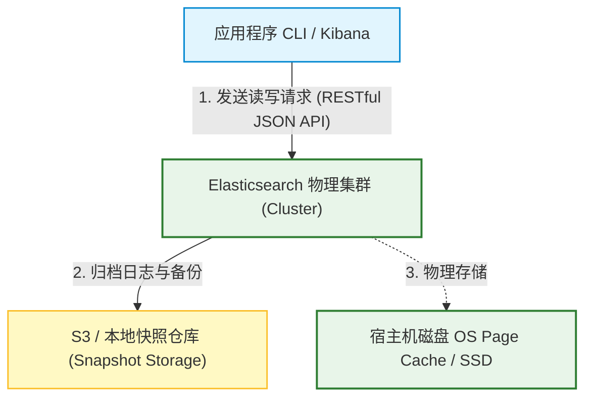
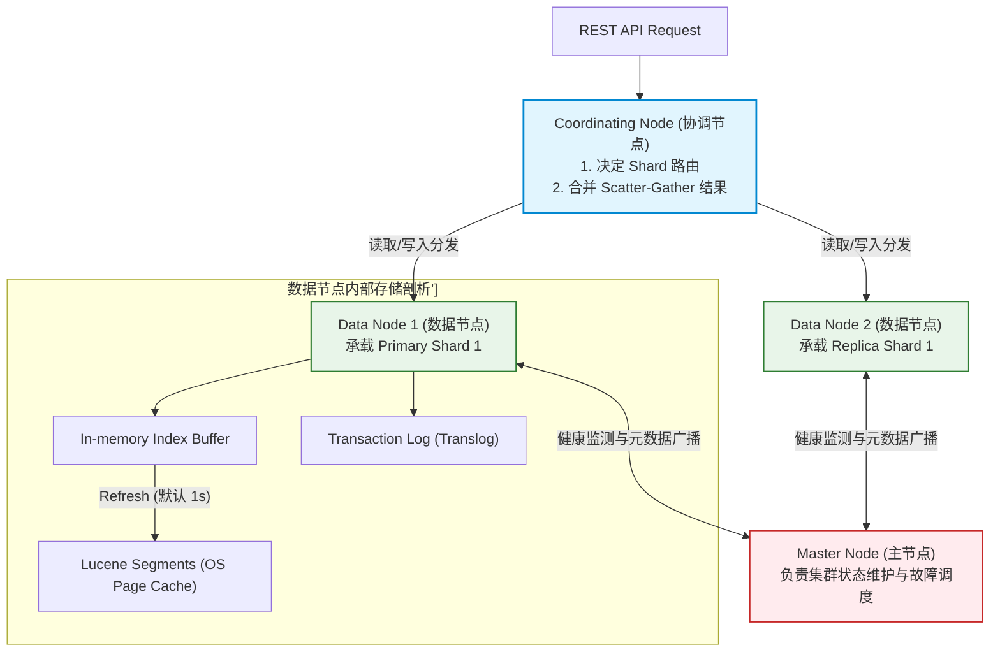
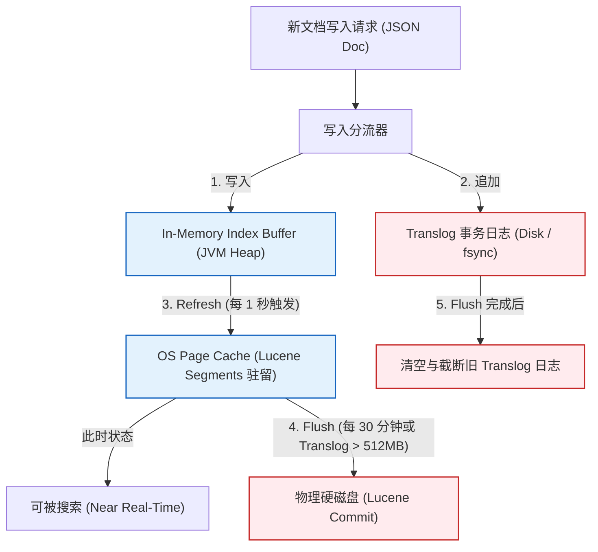
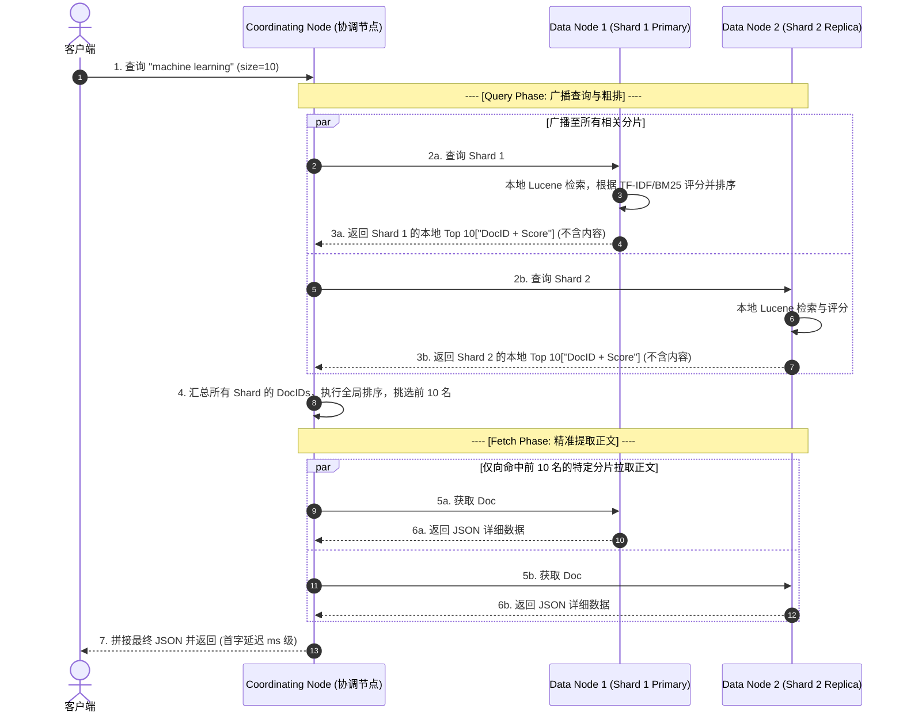
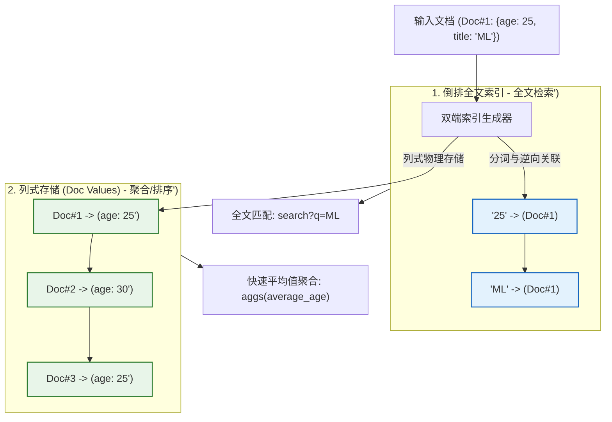
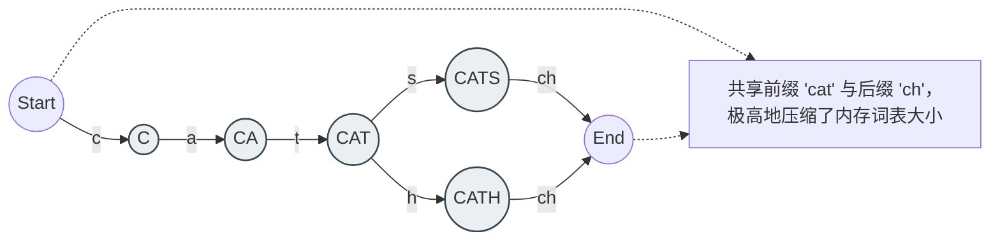

import CaseStudyHeader from '@site/src/components/CaseStudyHeader';
import DesignIntent from '@site/src/components/DesignIntent';
import EvolutionTimeline from '@site/src/components/EvolutionTimeline';
import CompareSlider from '@site/src/components/CompareSlider';
import TradeoffExplorer from '@site/src/components/TradeoffExplorer';
import GlossaryTerm from '@site/src/components/GlossaryTerm';
import ResearchNote from '@site/src/components/ResearchNote';
import GuidedExercise from '@site/src/components/GuidedExercise';
import QuizCard from '@site/src/components/QuizCard';
import MindMap from '@site/src/components/MindMap';

# Elasticsearch：基于 Lucene 段结构的分布式近实时搜索与列式聚合

<CaseStudyHeader
  oneLiner="Elasticsearch 完美地将 Apache Lucene 的单机全文检索能力扩展为分布式云服务。它通过『数据分片（Sharding）』与『副本复制』保障水平扩展，利用内存 Buffer 与操作系统 Page Cache 交互的『段刷新（Refresh）』机制实现近实时（NRT）搜索，并借助倒排索引与列存 Doc Values 的双引擎架构，兼顾了全文检索与高速聚合分析。"
  stats={[
    {label: '首发时间', value: '2010 年 (基于 Compass)'},
    {label: '核心检索引擎', value: 'Apache Lucene'},
    {label: '近实时刷新延迟', value: '默认 1 秒 (NRT)'},
    {label: '单片并发查询', value: '毫秒级'},
    {label: '数据结构组合', value: 'FST + SkipList + DocValues'},
    {label: '集群一致性协议', value: 'Zen Discovery / Master-Raft'}
  ]}
/>

:::info 对应课程概念
本案例融合了以下课程核心概念：
*   **状态管理与持久化（Month 5）**：如何通过 Translog 事务日志在非持久化的 OS Page Cache 段结构下保障数据的 Durability。
*   **RAG 本地检索原理（Month 8）**：深入分析 Lucene 的倒排索引物理存储与 FST 词典压缩在局部召回中的机制。
*   **分布式共识与脑裂防护（Month 11）**：如何通过主从多节点拓扑和 Raft-based 共识进行 Master 选举与分片路由。
:::

---

## 1. 设计初衷：分布式实时搜索的冲突之衡

传统的数据库适合精准匹配的行级读写，但在面对**海量非结构化文本的模糊匹配（全文检索）**以及**千亿级日志的多维实时统计聚合（OLAP）**时，面临着不可逾越的性能瓶颈。

为了解决这一问题，Shay Banon 设计了 Elasticsearch，旨在提供一个“分布式、多租户、近实时、高可用”的搜索系统。

<DesignIntent
  problem="如何在大规模分布式节点上，实现海量文本数据的秒级写入，并在毫秒级内完成复杂的布尔匹配、同义词检索与高维指标聚合分析，同时在节点故障时保障数据零丢失与自动重新平衡。"
  users="系统开发人员、运维 SRE、安全合规审计员，以及需要实时多维仪表盘（Kibana）监控的大型团队。"
  devices="运行于多个物理机或云原生容器（Kubernetes）之上的多节点数据节点集群。终端用户通过 HTTP JSON API 进行读写通信。"
  goals={[
    '近实时搜索（NRT）：写入的文档在 1 秒（默认）的 Refresh 周期内即可被全局搜索到',
    '高吞吐列聚合：支持亿级日志数据的快速 Group By 统计（Doc Values）',
    '无缝水平扩展：通过哈希路由机制，将庞大索引均匀打散在多个 Shards（分片）上',
    '故障自愈：检测到节点离线后，自动将 replica shard 升级为 primary，并启动段数据跨节点自动复制'
  ]}
  constraints={[
    'Lucene 段（Segment）一旦写入磁盘便“不可修改（Immutable）”，更新/删除操作会带来额外的墓碑（Bitset）合并成本',
    '内存与 GC 压力：词典树（FST）和聚合缓存会常驻 JVM Heap，需精细控制以防 OOM',
    '分布式脑裂风险：多节点集群在网络分区时，必须保证 Master 选派的唯一性',
    '写入与读取的物理墙：物理磁盘 IOPS 是写入瓶颈，必须大量依赖 OS 级别的虚拟缓存（Page Cache）'
  ]}
  firstStep="基于 Lucene 核心，封装协调节点（Coordinating）与数据节点（Data Node）；数据写入时，先写入 Memory Index Buffer 与物理磁盘的 Translog 日志；通过 refresh 周期将 Buffer 数据转化为内存中的可搜索段段；使用分段合并（Segment Merge）清理已被标为删除的“墓碑”数据。"
/>

---

## 2. 知识全景脑图

<MindMap
  root={{
    label: 'Elasticsearch 架构全景',
    children: [
      {
        label: '写入平滑 (Ingestion)',
        children: [
          { label: 'Index Buffer (内存写入区)' },
          { label: 'Translog (物理事务日志)' },
          { label: 'NRT Refresh (段生成)' },
          { label: 'Flush & Lucene Commit' }
        ]
      },
      {
        label: '存储组织 (Lucene)',
        children: [
          { label: 'Immutable Segments (不可变段)' },
          { label: 'Inverted Index (倒排全文)' },
          { label: 'Doc Values (列式存)' },
          { label: 'Segment Merge (段合并)' }
        ]
      },
      {
        label: '查询与分发 (Serving)',
        children: [
          { label: 'Coordinating Node (协调节点)' },
          { label: 'Scatter Phase (分发查询)' },
          { label: 'Gather Phase (聚合归并)' },
          { label: 'Fetch Phase (文档详情捞取)' }
        ]
      },
      {
        label: '集群共识 (Cluster)',
        children: [
          { label: 'Master Election (Raft协议)' },
          { label: 'Primary-Replica Sharding' },
          { label: 'Routing Formula (Shard 路由)' }
        ]
      }
    ]
  }}
/>

---

## 3. 系统架构总览 (C4 Model)

Elasticsearch 由多种角色节点共同协作构成一个对等分布的拓扑。

### 3a. System Context (系统上下文图)

### 3b. Container Diagram (容器结构图)

---

## 4. 核心机制拆解

### 4a. 写入生命周期：Index Buffer, Translog, Refresh 与 Flush

大批量数据直接同步写入磁盘进行全文解析极其缓慢。ES 通过在内存缓冲和物理事务日志（Translog）之间做折中，实现了“近实时可读”与“高写入吞吐”的完美契合：

1.  **内存写入与 Translog 同步**：新文档写入时，被同时放入 JVM 内存中的 `Index Buffer`，并向磁盘的 `Translog` 追加写入一条物理变更日志。此时，文档由于还未形成段结构，是**无法被搜索到的**。
2.  **段刷新（Refresh）**：默认每隔 1 秒，ES 执行 Refresh 操作，将 `Index Buffer` 中的数据编译成一个新的小型 Lucene Segment，并直接写入操作系统的 **Page Cache**（而非直接落盘）。一旦进入 Page Cache，该 Segment 就可被搜索到。这就是 **NRT（Near Real-Time）** 近实时搜索的奥秘。
3.  **持久化提交（Flush）**：随着 Translog 不断增大，ES 执行重型提交操作（Flush）。它将 OS Page Cache 中所有的临时 Segments 物理刷盘（fsync），完成 Lucene Commit，然后截断旧的 Translog 日志。

---

### 4b. 不可变段与合并机制 (Lucene Segment Merge)

为了避免文件并发锁和实现高速读缓存，Lucene 的 **Segment（段）是不可修改（Immutable）**的。
*   **删除文档（Delete）**：并不直接擦除磁盘文件，而是将该文档对应的 `DocID` 在一个独立的 `.del` 格式的 Bitset（位图）中进行标记（墓碑）。在查询时，该文档会被 IS 过滤掉。
*   **段合并（Segment Merge）**：由于小 Segments 越积越多会拖慢查询速度，ES 在后台拉起 Merge 线程。将多个小 Segments 合并成一个大 Segment，在这个过程中，那些被标为删除（`.del` 命中）的文档会被彻底物理擦除。

---

### 4c. 分布式检索时序：Scatter-Gather (Query then Fetch)

Elasticsearch 检索不能像传统 SQL 一样在线扫描，而是使用 **Scatter-Gather（分发-归并）** 模式运行，分为 **Query Phase（查询阶段）** 和 **Fetch Phase（拉取阶段）**。

---

### 4d. 双端数据组织：倒排全文索引 vs. 列式 Doc Values 聚合

全文搜索的核心是**倒排索引（Inverted Index）**，但倒排索引在执行 `Group By` 统计或排序时，必须将海量 DocIDs 对应的词项提取到内存中重新组装（Fielddata 机制），极易引发 JVM 堆内存暴涨与 OOM。

ES 引入了 **Doc Values（列式存储）** 来解决这一难题：
*   **倒排全文索引（Inverted Index）**：`Term -> DocIDs`，专门应对全文搜索。
*   **列式 Doc Values**：`DocID -> Term/Value`，在写入文档时与倒排索引同步构建。它使用连续磁盘空间存储列数据，支持零拷贝与 Page Cache，专门应对排序和聚合（Aggregations），避免了内存抖动。

---

## 5. 关键数据结构与算法

### 5a. FST (Finite State Transducer) 词典压缩

在 Lucene 中，倒排链（Postings List）非常庞大，无法全部塞入内存。为了加快查询速度，Lucene 必须在内存中对词条（Terms）的搜索进行加速。

Lucene 采用了 **FST（有限状态转移机）** 压缩词条前缀与后缀：
*   它是一棵高度压缩的**确定性有向无环图（DAG）**。
*   能将前缀相同（如 `cat`, `cats`, `category`）和后缀相同（如 `walked`, `played`）的单词节点共享，从而以极小的内存占用（数兆至数十兆）在内存中缓存整个分片的所有词条前缀，实现 $O(len(Term))$ 级的极速二叉词表跳转，彻底消除了内存溢出风险。

---

### 5b. Shard 哈希路由算法

在 ES 中，每个索引被切分为多个分片（Primary Shards），文档通过以下哈希模公式被路由到对应的物理分片：
$$Shard = (Hash(routing\_value) + ID) \% number\_of\_primary\_shards$$

其中 `routing_value` 默认是文档的 `_id`。
**架构推论**：由于分片数作为了分母（余数运算），**Elasticsearch 索引的 Primary Shard 数量在创建后绝对不可更改**。因为一旦分母改变，历史文档对应的路由计算结果将全部发生偏移，导致数据无法被检索到。

---

## 6. 架构演进史

从早期 Compass 的分布式外壳，到云原生数据大盘的支柱，ES 经历了几次关键的一致性与存储升级：

<EvolutionTimeline
  events={[
    {
      year: '2010',
      title: 'Zen Discovery 时代：简单的组播发现',
      why: '早期系统主要针对开发人员的小规模开发，集群采用简单的组播（Multicast）自动发现成员，在网络抖动时极易发生脑裂（Split-Brain），多 Master 共存破坏数据一致性。',
      change: '默认禁用 Multicast，转为单播（Unicast）；要求配置 `minimum_master_nodes = (N/2) + 1` 来进行票数过半校验以规避脑裂。'
    },
    {
      year: '2014',
      title: 'Doc Values 列存化：告别 JVM Heap OOM',
      why: '早期 ES 排序和聚合全靠内存加载的 Fielddata。当面对 TB 级的 Kibana 日志看板聚合时，JVM 垃圾回收引发全线卡顿，触发致命的 OOM。',
      change: '引入 Doc Values 列存机制（基于磁盘的连续紧凑存储，不占用 JVM 堆内存），并逐步将其设为非 Analyzed 字段的默认存储，使 ES 具备了高吞吐的 OLAP 聚合分析能力。'
    },
    {
      year: '2019 (7.x+)',
      title: 'Raft-based 一致性共识重构',
      why: 'Zen Discovery 一致性在配置繁琐（开发者经常忘记配 N/2 + 1 导致脑裂）且在大集群频繁动态伸缩时，状态发布较慢。',
      change: '重新编写集群共识层，推出自研的 Raft-based 一致性模块。去除了 `minimum_master_nodes` 配置，实现开箱即用的分布式安全选举与毫秒级集群状态发布。'
    }
  ]}
/>

---

## 7. 架构对比：Fielddata 内存加载 vs. Doc Values 列式存储

<CompareSlider
  before={
    

      <strong>Fielddata 内存动态加载 (旧架构)</strong>
      
在执行聚合或排序时，系统动态读取磁盘上的倒排索引，将所有 DocID 对应的文本词项反向重组加载到 JVM 堆内存中。处理大日志分析时，会消耗大量的 JVM 内存，引发严重的 Java 垃圾回收（GC Pauses）与 OOM 崩溃。

    

  }
  after={
    

      <strong>Doc Values 列式物理存储 (新架构)</strong>
      
在写入文档的同时，将字段以紧凑的列式格式序列化写入磁盘文件（与倒排索引同级）。聚合时，通过 OS Page Cache 直接按列快速滑动扫描，零内存反向重组，内存开销为 0 且极度稳定。

    

  }
  labels={['旧 Fielddata 内存聚合', '新 Doc Values 列式物理存储']}
/>

---

## 8. 权衡：分布式检索的关键架构抉择

为了追求极致高可用与近实时检索，ES 架构在多项设计细节中进行了取舍：

<TradeoffExplorer
  title="Elasticsearch 写入时延、强一致性与资源消耗折中"
  dimensions={['近实时可读 (NRT)', '写入吞吐量 (Ingest Rate)', '集群容灾能力 (HA)', 'JVM 内存消耗', '磁盘 I/O 稳定性']}
  options={[
    {
      name: 'Refresh 周期缩短至 100ms',
      scores: [5, 2, 5, 2, 2],
      note: '通过将 refresh_interval 强行压缩到 100ms，新数据入库后可在极短时间内被读到，极佳地满足了强交互时效性。但缺点是会在 Page Cache 中产生数以万计的碎片 Segment 引起文件句柄耗尽，并因为高频触发 Merge 严重打爆磁盘 I/O。',
      whenToUse: '对近实时可见性有极端苛刻要求且数据量不大的秒级检索应用。'
    },
    {
      name: '异步 Translog 落盘 (Async Durability)',
      scores: [3, 5, 2, 5, 5],
      note: '将 translog.durability 改为 async（每5秒刷盘一次）。这省去了每次 Ingestion 带来的物理 fsync 等待，写入吞吐可提升 3-5 倍，显著释放磁盘开销。代价是：若发生断电宕机，可能会丢失最多 5 秒钟已写入但未刷盘的最新数据。',
      whenToUse: '日志收集、指标监控（ELK 经典场景）等允许极微量数据丢失的高吞吐系统。'
    },
    {
      name: '增加 Primary Shard 分片数',
      scores: [3, 4, 3, 2, 4],
      note: '为单个索引配置更多 Primary Shards（如从 5 增加到 20）。写入压力被均匀打散至多台数据节点并发承载，单分片体积更小。代价是每次检索的 Scatter-Gather 广播风暴加剧，Coordinating 节点结果合并内存显著增加。',
      whenToUse: '海量 TB-PB 级数据索引且拥有大量物理计算集群的场景。'
    }
  ]}
/>

---

## 9. 如果是你来设计：近实时 Segment 刷新模拟器

### 场景设想
在分布式搜索引擎的写平面中，由于磁盘 I/O 提交非常昂贵。我们需要在内存中模拟一个“写入缓冲区 (Index Buffer)”和“事务日志 (Translog)”，并通过“刷新 (Refresh)”动作将缓冲区的数据合并，转为只读的、可搜索的“段 (Segment)”。

请你设计并实现这个近实时机制。

<GuidedExercise
  title="Python 内存 Buffer 与 NRT Segment 刷新过程模拟"
  goal="编写 Python 代码模拟 documents 的写入流、Translog 日志存储，并实现一个 refresh 调度器，将 buffer 内词项转化为可供查找的 inverted segments。"
  steps={[
    '步骤 1: 设计初始化数据结构。定义 self.index_buffer = [] 用以暂存新写入的 JSON 文档；定义 self.translog = [] 充当顺序写入的磁盘事务日志追加器；定义 self.segments = [] 存放刷新生成的只读倒排段。',
    '步骤 2: 编写 write(doc) 方法。每次调用时，把文档追加到 index_buffer 中，同时在 translog 中追加变更日志，以保障未刷新数据在“系统崩溃”后可通过 replay 重建。',
    '步骤 3: 编写 refresh() 调度。读取 index_buffer 中的文档，进行分词（Tokenization）处理，将其转换为一个内存 Inverted Index（单词 -> DocID 的映射表），生成一个只读 Segment 并追加到 self.segments 中，最后清空 index_buffer。此步骤完成后，调用 search(term) 即可在该分片上检索出结果。',
    '步骤 4: 编写 search(term) 方法。遍历 self.segments 只读段列表，合并命中的 DocIDs。由于此搜索只扫描 segments，不扫描 buffer，由此验证了在 refresh 前写入的文档不可读、而在 refresh 后可读的 NRT 原理。'
  ]}
  checks={[
    '验证 write 写入 2 条文档后，未调用 refresh 前，search 查询无结果返回',
    '调用 refresh() 后，search 查询能够瞬间提取正确的 doc 关联 ID',
    '模拟主机崩溃（直接清空 buffer），通过读取 translog 中记录的日志项，能够完美重建可搜索的 segments'
  ]}
/>

---

## 10. 知识自测

<QuizCard
  questions={[
    {
      q: '在 Elasticsearch 写入请求确认成功（Acknowledge）后、执行 Refresh 操作前，为什么文档依然无法被搜索到？',
      options: [
        'A. 因为此时数据已经被 Translog 物理擦除了',
        'B. 新写入的文档仅存放于 Memory Index Buffer 和 Translog 中，尚未编译为 Lucene 可识别的、只读的“段（Segment）”倒排结构。只有经 Refresh 转换并挂载至操作系统 Page Cache 后，该数据才真正可读',
        'C. 数据库必须等到 JVM 发生 Full GC 才会自动建立索引',
        'D. 协调节点在没有 API Key 时会自动短路所有读取动作'
      ],
      answer: 1,
      explain: '大模型与全文检索的数据结构具有黑盒只读性。在 refresh 前，数据仅以行文档形式零散堆在 buffer 里，无法执行基于词条的倒排归并。Refresh 周期是倒排段（Segment）的编译期，这也决定了 ES 默认有 1 秒的近实时延迟。'
    },
    {
      q: '为什么 Elasticsearch 规定索引的 Primary Shards（主分片）数量在创建后严格禁止修改？',
      options: [
        'A. 因为更改分片数会导致 React/Docusaurus 前端在本地编译时抛出 broken links 错误',
        'B. 为了防止集群脑裂（Split-Brain）协议失效',
        'C. 路由公式为 Shard = Hash(routing_value) % 分片数。如果修改了分片数（即分母发生改变），历史存量文档计算出的 Shard 目标数值全部会发生偏移，导致无法通过主键路由召回存量数据',
        'D. 因为 Lucene 规定每个段的文件句柄数必须是质数'
      ],
      answer: 2,
      explain: '分布式哈希路由极度依赖“分母确定”。一旦分母（Primary Shard 数）改变，对之前的 id 进行 hash 摸除会得到完全不同的分片编号，系统便无法检索到旧数据。如果必须改动，只能通过 Reindex 重建索引重新路由。'
    },
    {
      q: '在处理海量指标数据（如 Kibana 大屏聚合统计）时，Doc Values（列存）相比 Fielddata（内存动态加载）的核心架构优势是：',
      options: [
        'A. 提高全文检索的同义词命中率',
        'B. Doc Values 是在写入时就与倒排索引同步写入磁盘的列存结构，聚合时可直接读取磁盘文件并借助 OS Page Cache，不需要耗费 JVM 堆内存动态重组，彻底规避了因 Fielddata 机制引发的 OOM 崩溃与 GC 卡顿',
        'C. 它实现了 100% 强一致性的分布式两阶段提交',
        'D. 它完全取消了对 Apache Lucene 段结构的物理依赖'
      ],
      answer: 1,
      explain: 'Fielddata 是以大开销的 JVM 堆内存为代价，在读取阶段临时“逆向解析”倒排索引所得的内存列存。而 Doc Values 则把这个工作“提前”到了写入阶段，并在堆外（磁盘/OS 缓存）以物理列存形式布局，是大数据高吞吐聚合的工业界必选项。'
    }
  ]}
/>

---

## 来源清单

*   [Banon (2010), Compass to Elasticsearch: The Evolution of Distributed Search](https://www.elastic.co/about/history-of-elasticsearch)
*   [Lucene Core Documentation: Segments and Index File Formats](https://lucene.apache.org/core/index.html)
*   [Elastic Blog: Elasticsearch Writing Lifecycle under the hood](https://www.elastic.co/blog/found-elasticsearch-top-down#writing-data-to-elasticsearch)
*   [Elastic Docs: Translog and Durability configurations](https://www.elastic.co/guide/en/elasticsearch/reference/current/index-modules-translog.html)
*   [Apache Lucene: Finite State Transducers (FST) dictionary compression](https://www.lucenetutorial.com/lucene-fst.html)