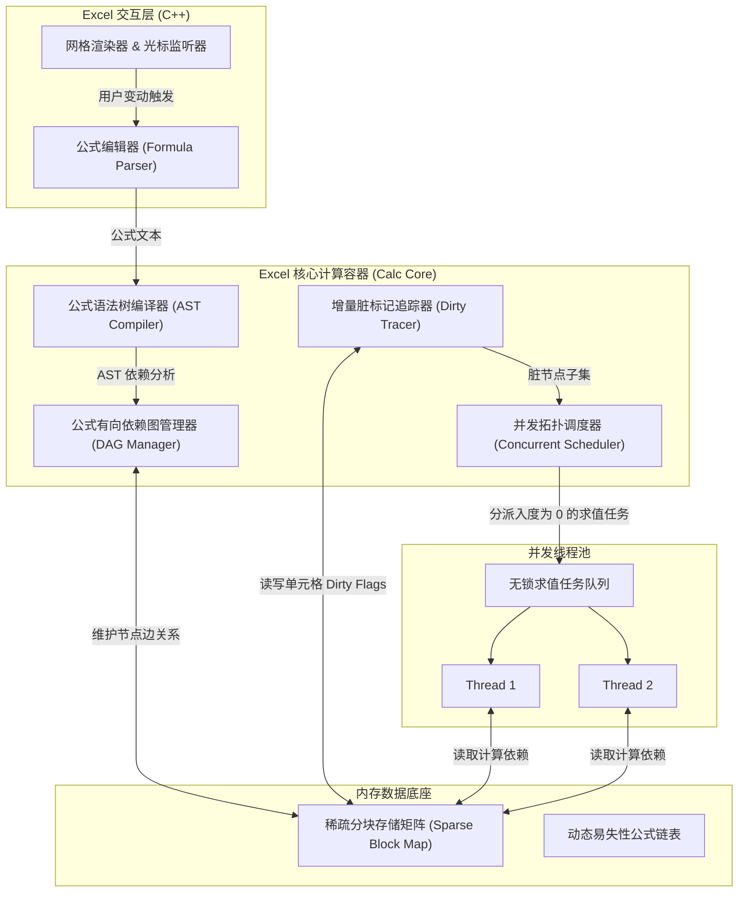
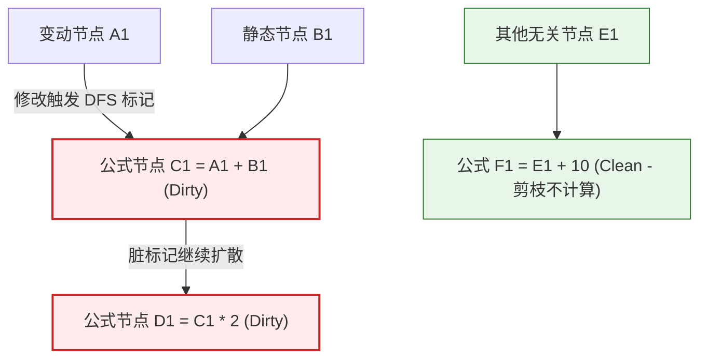
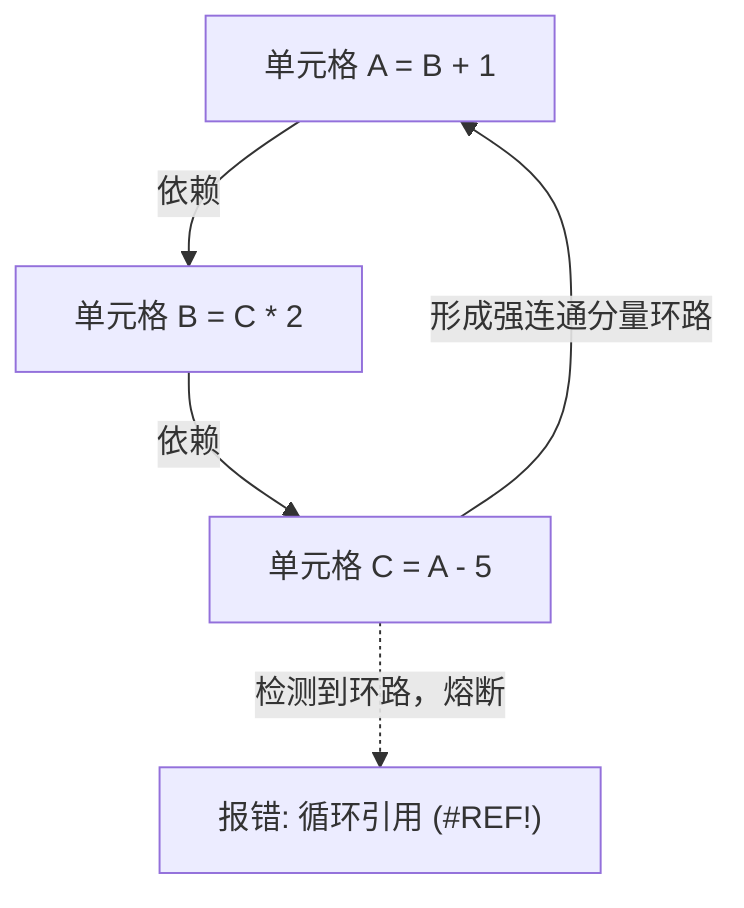
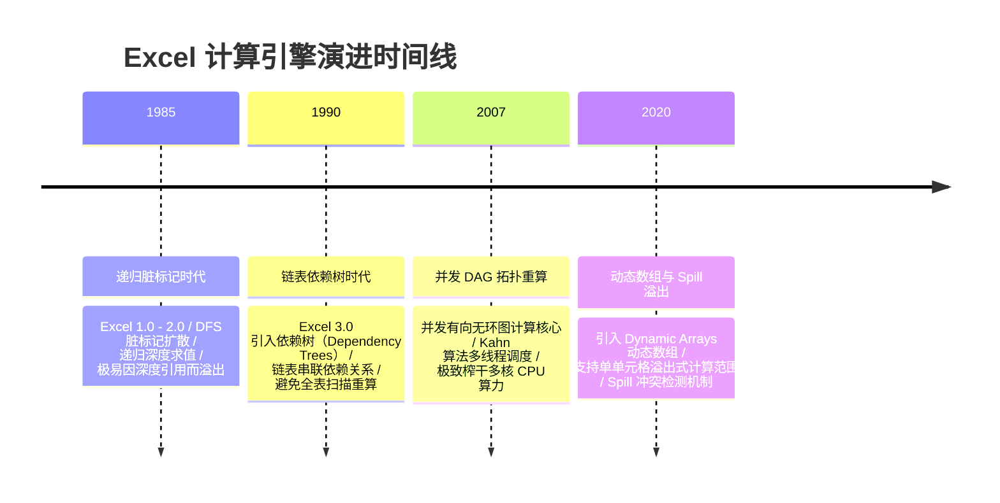

import CaseStudyHeader from '@site/src/components/CaseStudyHeader';
import DesignIntent from '@site/src/components/DesignIntent';
import ArchitectureEvolution from '@site/src/components/ArchitectureEvolution';
import TradeoffExplorer from '@site/src/components/TradeoffExplorer';
import GlossaryTerm from '@site/src/components/GlossaryTerm';
import ResearchNote from '@site/src/components/ResearchNote';
import QuizCard from '@site/src/components/QuizCard';
import CompareSlider from '@site/src/components/CompareSlider';
import GuidedExercise from '@site/src/components/GuidedExercise';
import PyRunner from '@site/src/components/PyRunner';

# Excel 计算引擎：依赖图重算与多线程拓扑调度架构

<CaseStudyHeader
  oneLiner="Excel 计算引擎在本质上是一个超大规模的、由公式依赖关系构成的有向无环图（DAG）重算调度器，结合稀疏矩阵内存模型与多线程拓扑排序执行，在毫秒级内完成数十万公式单元格的按需增量计算。"
  stats={[
    {label: '经典演进', value: '链表依赖树 -> 多线程并发 DAG'},
    {label: '内存模型', value: 'Sparse Block Matrix (稀疏分块矩阵)'},
    {label: '重算策略', value: '增量脏标记 (Incremental Calc with Dirty Flags)'},
    {label: '调度核心', value: '拓扑排序 (Kahn 算法变体)'},
    {label: '新功能机制', value: 'Dynamic Arrays (动态数组 & Spill 溢出)'}
  ]}
/>

:::info 对应课程概念
本案例横跨 [Month 4 设计模式与低阶设计 (LLD)](../foundations/programming-systems-primer)、[Month 5 分布式图数据模型](../core-components/api-gateway)、[Month 1 延迟边界与并发线程](../foundations/programming-systems-primer)。它深入揭示了在单机软件架构的极限性能调优中，如何利用经典图论（DAG、拓扑排序、强连通分量）结合并发控制（多线程无锁队列）榨干 CPU 多核算力。
:::

## 1. 设计初衷：如何瞬间算完 100 万行公式？

对于拥有 104 万行、16384 列（总计 170 亿单元格）的 Excel 单个工作表而言，如果用户修改了单元格 `A1` 的值，而 `A1` 仅被公式 `B1 = A1 + 1` 引用，传统的表格处理引擎如果“自上而下、自左而右”盲目扫描重算整张表，在几十万公式的规模下会导致系统彻底卡死。

Excel 团队要解决的核心工程痛点是：
1. **最小计算边界原则（Minimal Recalculation）**：系统在单元格变动时，必须只计算那些“在逻辑上直接或间接依赖该变动单元格”的公式，即**增量重算（Incremental Calculation）**。
2. **极高稀疏性与内存开销**：在 170 亿个格子中，通常只有不到 1% 的区域被写入了数据。如果采用稠密二维数组存储，会瞬间耗尽 16GB 内存。必须设计一种极低开销的**稀疏矩阵存储（Sparse Matrix Storage）**。
3. **循环依赖的安全熔断**：用户常写出形如 `A1 = B1 + 1` 且 `B1 = A1 - 1` 的致命死循环公式。计算引擎必须在运行前以毫秒级检测出**<GlossaryTerm term="循环依赖" definition="Circular Dependency，指在图结构中，两个或多个节点之间互为前置依赖条件，从而构成了一个闭环路径，导致图的拓扑排序或遍历求值进入死循环。">循环依赖（Circular Dependency）</GlossaryTerm>**并予以熔断。

通过以有向无环图（DAG）刻画公式依赖关系，Excel 确立了现代电子表格的计算地基。

<DesignIntent
  problem="在极度稀疏、规模达百万行的电子表格中，如何实现高并发、毫秒级的增量公式重算，并彻底杜绝循环依赖引起的系统假死？"
  users="全球数亿办公白领、金融分析师、数据科学家，日常维护含有数十万公式和复杂嵌套引用的大型工作簿。"
  devices="PC 桌面端（高度优化多核并发的 C++ 本地引擎）、云端协同 Office Online（基于 Web Assembly 的纯静态轻量重算器）。"
  goals={[
    '有向无环图 (DAG) 建模：将单元格与公式解析为节点与边，生成精确的有向依赖网。',
    '脏标记深度遍历：通过 DFS 脏标记扩散机制，确定当前修改受波及的最小子图边界。',
    '多线程并发拓扑调度：利用 Kahn 算法的变体，对入度为 0 且互不依赖的公式节点分发给多核线程池并行求解。',
    '稀疏分块存储：使用 Sparse Block List 减少内存空间消耗，空单元格完全不占用内存指针。'
  ]}
  constraints={[
    '线程安全性与死锁：当多线程并行求值时，公共引用单元格的读取与状态流转必须设计为线程安全且无锁。',
    '动态拓扑演进：由于用户随时会插入/删除行列，公式所指代的物理依赖图边界需要在运行期动态且极速更新。',
    '动态数组溢出（Spill Range）：一个公式的计算结果可能是 $N \times M$ 的动态数组，必须动态验证目标溢出范围是否与现有数据格子发生冲突。'
  ]}
  firstStep="设计以单元格（Cell）为顶点的异构有向无环图（DAG）结构；实现 Kahn 拓扑排序算法，在输入公式时检测环路；在此基础上设计多线程工作队列调度器。"
/>

## 2. 系统功能全景

以下是 Excel 计算核心引擎的功能与技术构成的全景图：

```mermaid
mindmap
  root("(Excel 计算引擎"))
    稀疏矩阵内存模型
      Sparse Block List
      动态内存指针偏移
      Spill Range 溢出校验
    依赖图 (DAG) 管理
      单元格节点与依赖边
      Kahn 拓扑排序求值
      Tarjan 强连通检测 (环路)
    增量脏标记重算
      脏标记 DFS 扩散剪枝
      动态依赖重构 (volatile)
    多线程并发调度
      入度零节点并发池
      Worker Threads 队列分发
      线程局部缓存 (Thread-local)
```

---

## 3. 最新架构总览

Excel 计算核心引擎采用前端 Grid 界面、中台公式编译解析器与后台多线程 DAG 执行引擎构成的层次化架构：

### 3a. 系统上下文图 (System Context)

```mermaid
graph LR
  User["使用电子表格的用户"] -->|1. 修改单元格或输入公式| GUI["Excel 前端网格界面 (Grid UI)"]
  GUI -->|2. 发送重算命令| CalcEngine["Excel 核心计算引擎 (C++ Calc Engine)"]
  CalcEngine <-->|3. 查询与写入| CellMemory["稀疏单元格内存存储 (Sparse Cell Memory)"]
  CalcEngine -->|4. 并行分配求值任务| ThreadPool["多线程并发执行池 (Worker Thread Pool)"]
  GUI -->> User: 5. 毫秒级刷新网格数值与状态
```

### 3b. 容器架构图 (Container)



---

## 4. 核心机制拆解

### 4a. 有向无环依赖图与增量脏标记 (Formula DAG & Dirty DFS)

Excel 将所有的单元格依赖关系抽象为一个**<GlossaryTerm term="有向无环图" definition="Directed Acyclic Graph (DAG)，图论中一种没有环路指向的有向图。每个单元格作为一个顶点，公式之间的计算依赖方向作为有向边，是重算引擎进行拓扑分派的物理基础。">有向无环图（DAG）</GlossaryTerm>**。

若 `C1 = A1 + B1`，则代表存在有向边 `A1 -> C1` 和 `B1 -> C1`。

增量重算分为两个利落的阶段：
1. **脏标记扩散阶段 (Dirty Marking Phase)**：当用户修改 `A1` 时，引擎并不会立刻执行计算。它从 `A1` 开始，顺着依赖边进行深度优先搜索（DFS），将所有可达的公式节点（如 `C1`）的状态标记为“脏（Dirty）”。这一步将计算范围限制在波及子图内，其他无关公式直接剪枝跳过。
2. **拓扑求值阶段 (Topological Evaluation Phase)**：重算引擎按照有向图的拓扑排序，依次将脏节点送入计算通道。确保在计算 `C1` 时，其所有前置节点（`A1`, `B1`）均已完成计算。



### 4b. 多线程并发拓扑排序调度器 (Concurrent DAG Scheduler)

为榨干现代多核 CPU 的算力，Excel 设计了多线程拓扑重算器。其核心原理是基于 **<GlossaryTerm term="拓扑排序" definition="Topological Sort，对一个有向无环图（DAG）的所有顶点进行线性排序，使得对于图中的任意有向边 u -> v，节点 u 在排序中都出现在 v 之前。常使用 Kahn 算法实现。">拓扑排序（Kahn 算法）</GlossaryTerm>** 与并发队列配合：

1. **入度计算**：调度器统计子图中所有脏节点的当前入度（In-degree，即前置未算公式数）。
2. **零度出队**：将所有入度为 0 的脏节点放入“无锁并发执行队列”。
3. **多线程并发**：多个工作线程（Worker Threads）同时从队列中拉取任务，独立计算单元格公式并将结果写回内存。
4. **度数衰减**：某一公式被算完后，它所指向的所有下游公式节点的入度减 1。一旦下游节点的入度减少到 0（意味着所有依赖项都算完了），该下游节点立即被推入执行队列，供空闲线程提取。

```mermaid
graph TD
  Queue["("无锁并发计算任务队列 (Queue)")"] -->|Thread 1 提取| TaskA["计算单元格 C1 (入度已为 0)"]
  Queue -->|Thread 2 提取| TaskB["计算单元格 C2 (入度已为 0)"]
  
  TaskA --> FinishA["C1 计算完成"]
  TaskB --> FinishB["C2 计算完成"]
  
  FinishA --> Dec1["下游公式 D1 (入度 2 - 1 = 1)"]
  FinishB --> Dec2["下游公式 D1 (入度 1 - 1 = 0, 推入任务队列)"]
  
  Dec2 -->|推入| Queue
```

### 4c. 循环依赖检测机制 (Tarjan's SCC Algorithm)

循环依赖是电子表格系统的大忌。一旦公式依赖关系成环，拓扑排序的队列便会中断，重算陷入死循环。

Excel 在用户“输入或编辑公式”的瞬间，立即对受波及的子图启动环路检测。通常基于 **<GlossaryTerm term="Tarjan 算法" definition="由 Robert Tarjan 提出的一种基于深度优先搜索（DFS）寻找有向图中强连通分量（Strongly Connected Components, SCC）的经典图论算法。它能在 O(V + E) 时间复杂度内精确找出图中的所有环路。">Tarjan 算法</GlossaryTerm>**，通过一次 DFS 遍历：
- 跟踪访问栈中的低限值（low-link）。
- 当发现某个节点的祖先链接指向了当前栈中的元素，代表检测到依赖闭环。
- 系统立刻熔断该依赖关系，标记该环路内的所有单元格为 `#REF!` 循环引用错误，并弹出警示面板，确保计算线程免受死循环折磨。



### 4d. 现代动态数组溢出机制 (Dynamic Arrays & Spill Range)

自 2020 年起，Excel 支持了动态数组（如 `FILTER` 或 `UNIQUE` 函数），允许单个公式计算出 $N \times M$ 的数组区域。这改变了传统“一个公式占用一个格子”的定理。

系统引入了 **Spill Range 溢出检测**：
1. **边界估算**：公式求值后，生成目标数组边界。
2. **冲突验证**：检查该数组范围（Spill Range）内是否已存在其他非空单元格。
3. **动态绘制**：若有阻挡，公式立刻停止绘制并返回 `#SPILL!` 错误；若无阻挡，动态在稀疏表中分配对应的虚拟数组视图。

```mermaid
graph TD
  Formula["计算公式: UNIQUE(A1:A10)"] --> EvalArray["生成数组数据: ['Apple', 'Banana', 'Orange'"]"]
  EvalArray --> CheckSpill{"验证目标 Spill 范围 C1:C3 是否空闲"}
  
  CheckSpill -->|是 (空闲)| Draw["正常绘制，C1=Apple, C2=Banana, C3=Orange"]
  CheckSpill -->|否 (C2 中有已有数据 'Hello')| SpillError["报错: #SPILL! 溢出错误"]
```

---

## 5. 架构演进史

Excel 计算引擎经历了从深度优先递归到复杂多线程图调度的漫长演进：



---

## 6. 关键数据结构：稀疏分块存储矩阵 (Sparse Block Matrix)

为了在 170 亿个单元格中仅用极少内存存储有效数据，Excel 没有采用二维连续指针数组，而是使用**稀疏分块存储（Sparse Block Matrix）**。

其内部数据结构一般如下：
- **Block Row 指针数组**：主内存维护一个指向每行数据块（Block）的稀疏哈希表或 Skip List。
- **Block 结构**：每个 Block 包含固定的 $16 \times 16$ 单元格网格。如果某区域没有数据，整个 Block 指针为空（`nullptr`），完全不消耗物理内存。
- **动态列查找**：在 Block 内部使用压缩存储（Compressed Sparse Column, CSC）或高效数组存储实际写入的 Cell 数据节点。

---

## 7. 架构对比

### 递归脏标记重算 vs 多线程有向依赖图 (DAG) 拓扑重算

<CompareSlider
  before={
    <div style={{ padding: '20px', background: '#ffebee', border: '1px solid #c62828', borderRadius: '8px', height: '100%', color: '#333' }}>
      <strong>早期递归脏标记重算 (DFS/Flagging)</strong>
      <p style={{ marginTop: '10px', fontSize: '0.9rem' }}>
        当修改某单元格时，通过递归的方式深度遍历依赖单元格进行计算。虽然实现简单，但无法利用多核 CPU 的并行优势，且在遇到深层公式嵌套时，极易因调用栈过深而导致栈溢出（Stack Overflow）假死。
      </p>
    </div>
  }
  after={
    <div style={{ padding: '20px', background: '#e8f5e9', border: '1px solid #2e7d32', borderRadius: '8px', height: '100%', color: '#333' }}>
      <strong>多线程 DAG 拓扑排序重算</strong>
      <p style={{ marginTop: '10px', fontSize: '0.9rem' }}>
        显式构建计算依赖有向图，先进行脏路径 DFS 剪裁，随后根据每个节点的动态入度直接由并发线程池提取计算。消除了深度递归的物理栈开销，且能够自动实现多核算力最大化。
      </p>
    </div>
  }
  labels={['递归脏标记模式', '多线程 DAG 模式']}
/>

---

## 8. 核心决策的取舍

在设计大型表格求值引擎时，系统设计者需要在计算精度、内存占用与并发吞吐之间寻求平衡：

<TradeoffExplorer
  title="表格重算触发模式决策权衡"
  dimensions={['实时界面流畅度', 'CPU 资源消耗', '数值一致性时效', '超大工作簿抗卡顿性', '多用户协作冲突率']}
  options={[
    {
      name: '自动重算模式 (Automatic Recalculation)',
      scores: [3, 2, 5, 1, 5],
      note: '任何格子改动都会立刻触发依赖 DAG 拓扑重算，界面数值绝对一致。但在编辑上万行的复杂大表时，高频修改会使 CPU 瞬间飙满 100%，导致界面频繁卡顿。',
      whenToUse: '常规中小型工作表、金融高频对账以及云端协同多人实时编辑。'
    },
    {
      name: '手动重算模式 (Manual Recalculation - 经典避坑选项)',
      scores: [5, 5, 1, 5, 2],
      note: '用户修改后系统只给单元格打上 Dirty Flag，直到按下 F9 时才运行一次完整的拓扑重算。界面绝对流畅，但代价是计算前界面数据不一致，容易导致决策失误。',
      whenToUse: '处理含有几十万公式、单次重算需要数秒以上的超大型数据汇总簿。'
    },
    {
      name: '智能节流自动重算 (Throttled & Batched Recalculation)',
      scores: [4, 4, 4, 4, 4],
      note: '在用户输入停顿期（Debounce，如 300 毫秒）或后台批量合并变动，随后在空闲线程启动异步增量重算。取得极好的折中效果。',
      whenToUse: '现代云端协作 Office 网格渲染与新版桌面 Excel 智能静默计算模式。'
    }
  ]}
/>

---

## 9. 实践指引：实现一个带公式依赖和拓扑排序的 Mini Excel

理解依赖图与拓扑重算的最好方式是写一个支持公式引用的表格求值器。

在下方练习中，实现包含 AST 简单引用抽取、有向图构建、Kahn 算法拓扑排序与循环依赖熔断的核心逻辑。

<GuidedExercise
  title="练习指引：写一个带拓扑排序与环路熔断的表格引擎"
  goal="构建微型 Excel 单元格计算内核，实现输入公式（如 =A1+B1）的依赖关系提取与拓扑重算，若出现循环引用需准确抛出异常阻止求值。"
  hints={[
    '你可以使用正则 `[A-Z]+\d+` 从公式文本（如 `=A1*B1+C2`）中快速拉取依赖节点名。',
    '入度（In-degree）字典初始化：所有单元格入度设为 0。每当发现依赖，被依赖的节点出度加 1，当前节点的入度加 1。',
    '环路检测：在运行拓扑排序后，如果排出的顺序序列节点个数少于表格中已注册单元格的总数，即可断定图中存在环路。'
  ]}
  steps={[
    '设计 `Cell` 实体结构，存储单元格的原始公式/数值、计算出的实际 Value 以及依赖边。',
    '实现 `ExcelEngine` 类，包含 `set_cell(name, expr)` 和 `calculate()` 方法。',
    '在 `calculate()` 中，先构建入度表，接着执行基于队列的 Kahn 拓扑排序算法。',
    '按照拓扑序，对公式使用 Python 的 `eval()` 进行求值，并使用实际计算出的数值替换公式里的单元格 ID 字符串。'
  ]}
  checks={[
    '输入 A1=10, B1=20, C1==A1+B1, D1==C1*2，重算后 D1 的值正确计算出 60。',
    '故意构造循环依赖 A1==B1+1, B1==A1-1，系统能安全识别并在 calculate() 时抛出 ValueError 错误。'
  ]}
/>

#### 交互式 Python 运行实验
在下方控制台中运行并修改已准备好的表格拓扑引擎代码，输入不同的公式树，验证在数据变更时系统的重算表现：

<PyRunner
  expect="分片路由与隔离验证成功"
  rows={25}
  code={`import re

class Cell:
    def __init__(self, name, expr):
        self.name = name
        self.expr = expr # 可以是纯数字(如 10) 或 公式(如 "=A1+B1")
        self.value = None
        self.dependencies = []
        self.parse_dependencies()
        
    def parse_dependencies(self):
        # 简单公式语法分析：提取大写字母+数字的依赖关系
        if isinstance(self.expr, str) and self.expr.startswith("="):
            self.dependencies = re.findall(r'[A-Z]+\d+', self.expr)
        else:
            self.dependencies = []

class MiniExcelEngine:
    def __init__(self):
        self.cells = {}
        
    def set_cell(self, name, expr):
        self.cells[name] = Cell(name, expr)
        
    def calculate(self):
        # 1. 建立入度表与邻接表
        in_degree = {name: 0 for name in self.cells}
        adj = {name: [] for name in self.cells}
        
        for name, cell in self.cells.items():
            for dep in cell.dependencies:
                # 建立从被依赖节点(dep)指向当前节点(name)的有向边
                if dep in self.cells:
                    adj[dep].append(name)
                    in_degree[name] += 1
                    
        # 2. 拓扑排序 (Kahn 算法)
        queue = [name for name, deg in in_degree.items() if deg == 0]
        topo_order = []
        
        while queue:
            curr = queue.pop(0)
            topo_order.append(curr)
            for neighbor in adj[curr]:
                in_degree[neighbor] -= 1
                if in_degree[neighbor] == 0:
                    queue.append(neighbor)
                    
        # 3. 循环依赖检测熔断
        if len(topo_order) != len(self.cells):
            cyclic_cells = [name for name, deg in in_degree.items() if deg > 0]
            raise ValueError(f"⚠️ 循环引用检测：工作簿存在闭环环路！受影响单元格: {cyclic_cells}")
            
        # 4. 依照拓扑序执行增量计算求值
        for name in topo_order:
            cell = self.cells[name]
            if isinstance(cell.expr, str) and cell.expr.startswith("="):
                # 提取公式内容（去除等号 =）
                eval_str = cell.expr[1:]
                # 将公式引用的单元格替换为其已经算好的真实数值
                for dep in cell.dependencies:
                    dep_val = str(self.cells[dep].value if self.cells[dep].value is not None else 0)
                    eval_str = eval_str.replace(dep, dep_val)
                # 使用 Python eval 动态求值
                try:
                    cell.value = eval(eval_str)
                except Exception as e:
                    cell.value = "#VALUE!"
            else:
                cell.value = cell.expr
                
        return topo_order

# 初始化 mini-Excel 引擎
excel = MiniExcelEngine()

# 2. 注册数据与依赖关系
excel.set_cell("A1", 50)
excel.set_cell("B1", 150)
# C1 依赖 A1, B1
excel.set_cell("C1", "=A1+B1")
# D1 依赖 C1
excel.set_cell("D1", "=C1*2")

print("--- 执行拓扑重排与求值 ---")
try:
    calc_seq = excel.calculate()
    print(f"求值排队序列：{calc_seq}")
    print(f"C1 的计算值 (期望 200) = {excel.cells['C1'].value}")
    print(f"D1 的计算值 (期望 400) = {excel.cells['D1'].value}")
except ValueError as e:
    print(e)

print("\n--- 注入循环引用环路测试 A1->B1->C1->A1 ---")
# 更改公式使其陷入环路: A1 依赖 D1
excel.set_cell("A1", "=D1+5")
try:
    excel.calculate()
except ValueError as e:
    print(e)
    print("✅ 循环依赖检测成功！引擎成功识别闭环并执行安全熔断。")
`}
/>

---

## 10. 知识自测

完成自测以检验你对公式有向无环图、拓扑排序、多线程并发调度与稀疏分块存储的掌握程度：

<QuizCard
  questions={[
    {
      q: '在 Excel 计算引擎中，为什么必须要在用户输入公式后构建有向依赖图（DAG）并进行拓扑排序，而不是像常规编程语言一样直接从上到下执行计算？',
      options: [
        'A. 因为从上到下计算只支持加法，不支持乘法和除法',
        'B. 因为电子表格中的单元格依赖是用户任意排布的，并不具备固定的空间上下顺序；构建 DAG 并拓扑排序可以找出无矛盾的线性重算序列，保证任意公式在被计算前，其所有引用依赖项已处于最新已求值状态',
        'C. 为了将表格文件的磁盘大小压缩 50%',
        'D. 仅仅是为了实现界面的语法高亮'
      ],
      answer: 1,
      explain: '电子表格是无序的。用户可以在第 100 行写公式引用第 1 行的单元格，也可以反过来。只有通过依赖图的拓扑排序，才能在逻辑上理清计算的先后顺序，确保没有前置未算项。'
    },
    {
      q: '多线程并发重算（Multi-threaded Recalculation）是如何通过 Kahn 拓扑排序算法与线程池相结合实现的？',
      options: [
        'A. 强行将每个工作表划分为 4 个相等的区域，每个线程负责一个区域的计算',
        'B. 让所有线程同时抢占同一个单元格进行写入竞争',
        'C. 统计每个脏节点的入度，把入度为 0（即前置依赖已全部算完）的节点推入并发无锁队列，供多个 Worker 线程同时拉取计算；某个节点计算完后，它指向的下游节点入度减 1，直到入度减为 0 时再推入队列，以此循环',
        'D. 利用 GPU 对全表的所有单元格执行无差别的并行矩阵乘法'
      ],
      answer: 2,
      explain: '这是一种高度精细的图并行调度机制。在 DAG 中，只有入度为 0 的节点是不依赖任何未算项的，因而它们之间是并行的，可安全地派发给多个线程。当它们算完后，会解锁（使入度减至 0）下游节点，从而形成波浪式推进的并发图求值流。'
    },
    {
      q: '对于具有 170 亿个单元格空间的 Excel 单个工作表，它是如何避免因全图二维连续指针数组导致物理内存瞬间耗尽的？',
      options: [
        'A. 通过强行限制用户在单个表格中输入的数据量不能超过 10KB',
        'B. 采用稀疏分块存储结构（Sparse Block Matrix），仅在有实际写入数据的格子周围分配固定的内存数据块（如 16x16 的 Block），空置的海量单元格指针为空，完全不消耗任何实际物理内存页',
        'C. 采用压缩文件技术，将用户的内存写入到虚拟磁盘 swap 分区中',
        'D. 仅仅是因为现代 CPU 拥有极大的三级缓存，可直接硬扛上百 G 的数组'
      ],
      answer: 1,
      explain: '绝大多数表格都是极度稀疏的。稀疏分块（Sparse Block Matrix）避免了为大量的空百单元格分配对象指针，只有真正写入数据的邻域才会动态构造 Block，极大地压缩了表格的内存占用。'
    }
  ]}
/>

## 来源

- [Recalculation in Microsoft Excel (Microsoft MSDN Library)](https://learn.microsoft.com/en-us/office/client-developer/excel/excel-recalculation)
- [Spreadsheet Calculation Engine Design and Dependency Tree Structures (Spackman et al., ACM)](https://dl.acm.org/doi/10.1145/291224.291230)
- [Microsoft Tech Community: Inside Excel - Dynamic Arrays and Spill Ranges](https://techcommunity.microsoft.com/t5/excel-blog/inside-excel-dynamic-arrays-and-spill-ranges/ba-p/175031)
- [Tarjan's strongly connected components algorithm and loop detection in compiler construction](https://ieeexplore.ieee.org/document/108922)