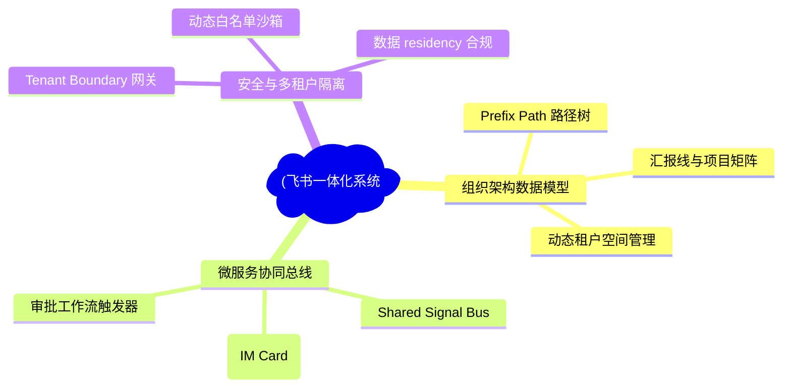
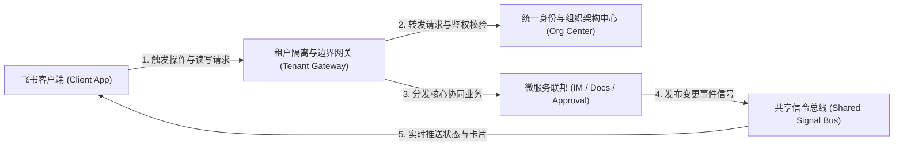
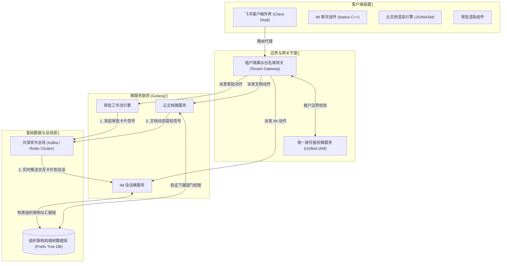
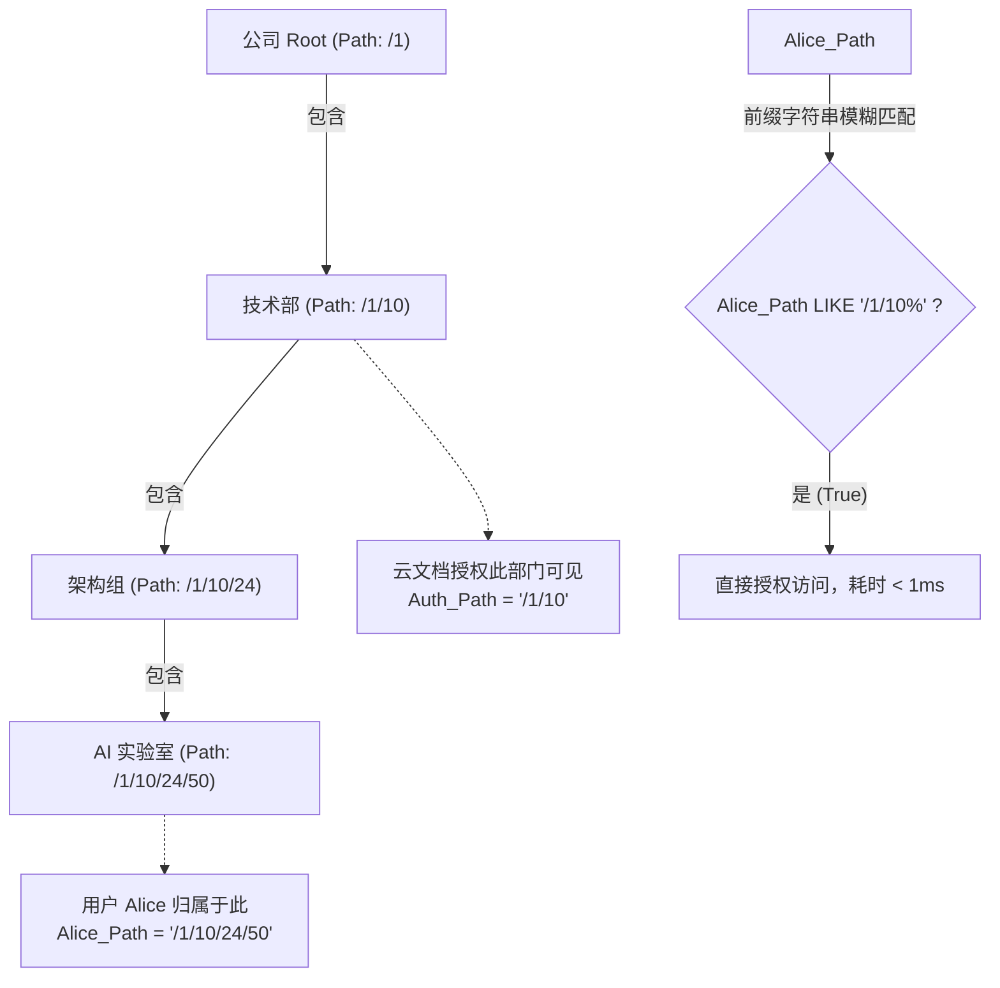
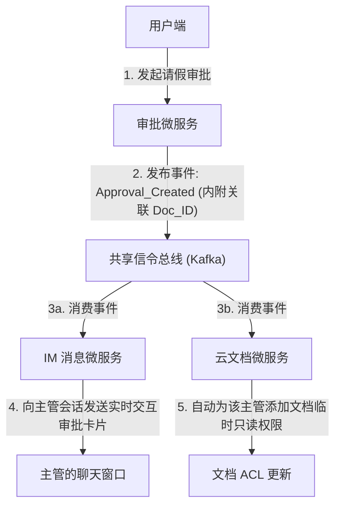
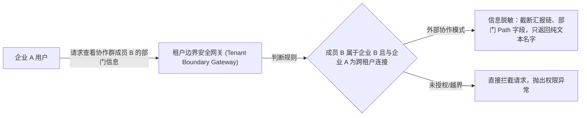
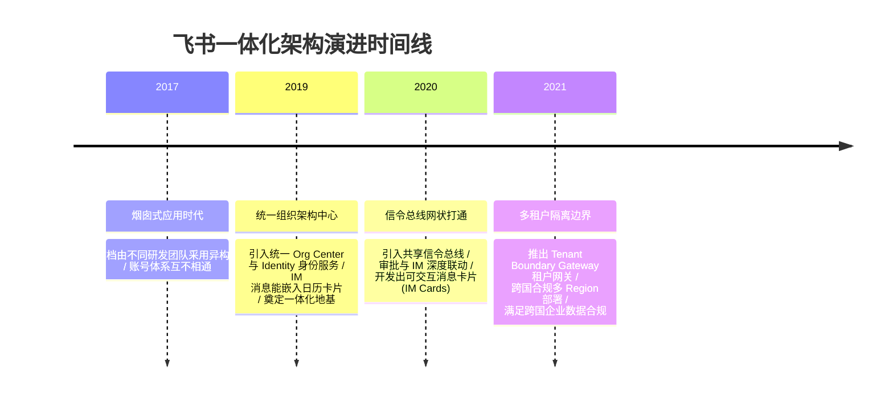

import CaseStudyHeader from '@site/src/components/CaseStudyHeader';
import DesignIntent from '@site/src/components/DesignIntent';
import ArchitectureEvolution from '@site/src/components/ArchitectureEvolution';
import TradeoffExplorer from '@site/src/components/TradeoffExplorer';
import GlossaryTerm from '@site/src/components/GlossaryTerm';
import ResearchNote from '@site/src/components/ResearchNote';
import QuizCard from '@site/src/components/QuizCard';
import CompareSlider from '@site/src/components/CompareSlider';
import GuidedExercise from '@site/src/components/GuidedExercise';
import PyRunner from '@site/src/components/PyRunner';

# 飞书 Feishu：IM、云文档与智能审批一体化架构

<CaseStudyHeader
  oneLiner="飞书通过构建全景组织架构图（Organization Graph）与部门前缀路径树，实现了 IM、云文档、智能审批三大业务版图的极速权限穿透与协同对齐；配合统一信令总线与联邦微服务体系，支撑起超大型组织低延迟、高合规的一体化办公体验。"
  stats={[
    {label: '权限模型', value: 'Organization Graph (组织图谱)'},
    {label: '检索加速', value: 'Prefix Path Tree (前缀路径树缓存)'},
    {label: '信令总线', value: 'Event-driven Signal Bus (Kafka / NATS)'},
    {label: '租户安全', value: 'Tenant Boundary Gateway (租户隔离网关)'},
    {label: '微服务模式', value: 'Federated Microservices (联邦微服务)'}
  ]}
/>

:::info 对应课程概念
本案例横跨 [Month 5 分布式图数据模型](../core-components/api-gateway)、[Month 4 低阶设计 (LLD) 与设计模式](../foundations/programming-systems-primer)、[Month 6 云原生多租户隔离](../cloud-enterprise-industrial/capstone-cloud-native)。它代表了现代大型企业协同办公系统的软件工程极限，展示了如何通过构建统一身份和层次结构，将“烟囱式”微服务转化为“网状一体化”联邦的演进过程。
:::

## 1. 设计初衷：消灭“工具烟囱”与消息碎片化

大多数企业的办公环境被割裂在不同的系统里：聊天在 IM 工具中、知识沉淀在独立的 Wiki 里、请假报销在 ERP 审批流中。这导致用户频繁在多个 App 间切换，同时带来极大的“数据流转和安全阻断”成本。

飞书在立项之初就确立了“IM + 文档 + 审批”无缝一体化的产品目标，而这给架构带来了三大硬核挑战：
1. **百万级员工组织架构树的极速检索**：大型企业员工数以十万计，部门层级关系深奥。当一篇云文档限制“仅研发中心及下属所有子部门可见”时，系统必须在毫秒级内依据**<GlossaryTerm term="Prefix Path Tree" definition="部门前缀路径树：一种优化层级部门树查询的存储和索引方式。将部门层级路径表示为前缀字符串（如 /Corp/Rnd/AI），利用前缀匹配算法秒级判定用户是否属于某个部门的子部门，避免了传统的递归数据库父指针查询。">部门前缀路径树（Prefix Path Tree）</GlossaryTerm>**判定用户是否属于授权子树。
2. **多源异构服务的实时协同对齐**：当一个审批单被发起，它需要实时在 IM 里生成一张能交互的“卡片消息”，并且自动授权该审批涉及的云文档给相关审批人。这需要一个跨微服务的**<GlossaryTerm term="Shared Signal Bus" definition="共享信令总线：飞书系统内部跨服务通信的高速异步事件网格。当文档授权、审批变动、IM 消息产生时，相应的信令通过此总线进行实时扇出和分布式消费，实现不同微服务间的数据和状态联动。">共享信令总线（Shared Signal Bus）</GlossaryTerm>**来保证状态实时一致。
3. **跨租户协作的安全物理边界**：大企业常常需要与外部代理商、合作伙伴进行沟通（如拉外部群、共享外部文档）。架构上必须设计精密且高性能的**<GlossaryTerm term="Tenant Boundary Gateway" definition="租户边界网关：飞书专门用于处理跨租户协作的安全代理网关。它拦截所有跨企业的工作流与数据流请求，强制执行租户白名单过滤与身份二次校验，确保跨租户通信绝对不泄露企业内部组织架构机密。">租户边界网关（Tenant Boundary Gateway）</GlossaryTerm>**，确保外部人员绝对查不到企业内部的敏感组织汇报线。

飞书通过自研统一身份与组织架构中心（Org Center），打破了协作工具之间的物理烟囱。

<DesignIntent
  problem="在数十万员工、海量文档与高频审批的高并发协同体系下，如何设计一体化的组织架构数据模型与协同总线，保障动态权限的毫秒级评估和跨租户协同的数据隔离？"
  users="全球海量企业客户的员工与管理者，要求文档共享、审批卡片触达无延时，组织架构变动即时生效。"
  devices="PC 桌面客户端、Web 浏览器及 iOS/Android 移动端应用，要求多端状态和消息卡片视图实时对齐。"
  goals={[
    '构建统一的 Organization Graph：将人员、部门、岗位、项目矩阵建模为图谱，作为 IM、文档和审批的唯一鉴权数据源。',
    '实现前缀路径树存储机制：将层级部门存储为 Nest Path 格式，消除树形递归查询，保证子树检索 O(1) 复杂度。',
    '设计事件驱动的 Shared Signal Bus：依托 Kafka 与 Go 协程网格，将审批变动和文档权限变更秒级推送到用户的 IM 会话中。',
    '租户边界隔离与外部校验：部署 Tenant Boundary Gateway，对所有外部群聊和共享文档进行拦截审计。'
  ]}
  constraints={[
    '多地域合规隔离：涉及跨国企业的组织架构图谱需要按主权边界进行逻辑或物理分片，保障数据本地化（Data Residency）。',
    '微服务之间的循环依赖：由于 IM 引用文档、文档内嵌审批、审批又触发 IM，各微服务之间极易发生信令死循环，需要通过统一事件溯源（Event Sourcing）和幂等状态机规避。'
  ]}
  firstStep="设计以 Prefix Path 存储的层级部门索引；构建跨 IM、文档与审批的统一 IAM（身份识别与访问管理）中台；搭建信令总线承载联动卡片事件。"
/>

## 2. 系统功能全景

以下是飞书一体化多租户系统功能全景图：

---

## 3. 最新架构总览

飞书的整体架构分为客户端容器层、边界网关与协同总线层，以及基于联邦设计的微服务数据底座：

### 3a. System Context (系统上下文)

### 3b. Container Diagram (容器架构)

---

## 4. 核心机制拆解

### 4a. 全景组织架构图与部门前缀路径树 (Prefix Path Tree)

当大型集团需要管理上层汇报线时，如果数据库使用传统的 `parent_id` 父指针引用，在执行如“只对 /集团总部/技术部/架构组/AI实验室 及下属部门可见”的文档鉴权时，会遇到多次递归数据库查询。

飞书引入了**部门前缀路径树（Prefix Path Tree）**模型：
1. **前缀化存储**：每一个部门节点在数据库中拥有一个计算出的层级路径字段（Path），形如：
   - 集团总部：`/1`
   - 技术部：`/1/10`
   - 架构组：`/1/10/24`
   - AI实验室：`/1/10/24/50`
2. **快速子树匹配**：当判断用户 `Alice`（属于 `/1/10/24/50`）是否有权访问授权给技术部（`/1/10`）的文档时，系统只需在 SQL 中执行：
   `SELECT 1 WHERE 'Alice_Dept_Path' LIKE 'Auth_Dept_Path%'`
   即通过 `'/1/10/24/50' LIKE '/1/10%'` 一次性完成判定。无任何递归，查询耗时从常数级扩展缩减至 $O(1)$，完美规避了数据库递归风暴。

### 4b. 共享信令总线与事件驱动流 (Shared Signal Bus)

一体化体验的秘诀在于微服务之间无摩擦的状态穿透。飞书通过基于 Kafka 构建的 **共享信令总线（Shared Signal Bus）** 达成多方对齐：

以“发起请假审批”为例：
1. **发起审批**：用户在审批微服务提交请假单，触发“审批状态流转”。
2. **生成消息卡片**：审批引擎向共享信令总线投递事件。IM 消息微服务监听到此事件，组装成结构化的“卡片消息”，推送到主管的聊天窗口，主管可以直接点击“同意”或“拒绝”按钮。
3. **文档自动授权**：如果请假单里内嵌了项目文档（由 DocsService 管理），审批引擎会通过信令总线告知 DocsService，将文档的临时阅读权限赋予审批人主管，消灭了手动加授权的割裂操作。

### 4c. 跨租户协作的安全物理边界 (Tenant Boundary Gateway)

企业协同的核心底线是防泄密。当用户与外部企业进行项目协作时，飞书依靠 **Tenant Boundary Gateway** 保护核心的组织架构隐私：

1. **白名单策略**：所有的外部群聊、跨企业文档共享都必须在 Gateway 进行双向白名单校验。
2. **汇报链遮蔽**：在外部协作场景下，所有的用户信息都被“脱敏”，只保留姓名与头像。任何获取其组织架构汇报线、部门层级的 API 请求都会在边界网关被直接截断并返回空值，防止黑客通过外部群反向刺探企业内部架构。

---

## 5. 关键数据结构与算法：部门前缀树路径匹配

在飞书的后台权限过滤中，部门前缀树的数据结构与匹配算法决定了鉴权的上限。

### 前缀树层次编码规则
飞书内部部门的 Path 使用整型 ID 的斜杠拼接：

$$Path_i = /ID_1/ID_2/\dots/ID_k$$

*设计用意*：
- 使用简单的字符串前缀查询（SQL 中的 `LIKE '/1/10%'`）即可代替传统树数据库的广度优先搜索（BFS）或递归深度优先搜索（DFS），使关系型数据库在应对庞大组织树时，依然具备极高的读写性能，完美实现了在云文档授权时百万级员工关系的实时计算。

---

## 6. 架构演进史

飞书从独立工具逐步演进为目前紧密对齐的一体化网状架构：

---

## 7. 架构对比

### 独立 API 相互集成模式 (传统套件) vs 统一组织图谱一体化联邦模式 (飞书模式)

<CompareSlider
  before={
    

      <strong>独立应用 API 集成模式 (如 Slack + Confluence + Jira)</strong>
      

        各个应用拥有独立的数据库和不同的组织架构模型，依靠 Webhook 和 Web API 进行同步。通信存在明显的网络延迟，当员工离职或部门重组时，各个系统的权限回收往往存在时间差与安全漏洞，且卡片消息交互迟钝。
      

    

  }
  after={
    

      <strong>统一组织图谱一体化联邦 (飞书模式)</strong>
      

        所有的微服务共享同一个组织架构图谱与部门路径树。任何权限的下放和撤销，在 IM、文档与审批系统瞬间同步对齐。基于事件驱动的共享总线使得主管在聊天框内即可直接控制审批状态，没有信息差。
      

    

  }
  labels={['API 相互集成模式', '统一图谱联邦模式']}
/>

---

## 8. 核心决策的取舍

在管理企业组织架构树时，架构师必须在存储开销、查询性能与更新代价之间权衡：

<TradeoffExplorer
  title="企业组织架构树形数据结构取舍"
  dimensions={['子树查询性能', '单个部门新增/删除的开销', '汇报链动态修改的代价', '数据库存储和索引开销', '异构关系表达能力']}
  options={[
    {
      name: '前缀路径树存储 (Prefix Path - 飞书采用模式)',
      scores: [5, 4, 3, 4, 3],
      note: '为每个部门生成唯一的 Path 路径字符串，查询子树下的所有子节点仅需一次 SQL LIKE 前缀查询，性能达到 O(1)。但是在跨国公司发生“大规模部门合并与重构（Re-parenting）”时，需要批量更新其全部下属子部门的 Path 字段，存在写入开销。',
      whenToUse: '读远大于写、文档/审批权限高频需要向下级穿透校验的协同办公系统。'
    },
    {
      name: '传统邻接表存储 (Adjacency List)',
      scores: [1, 5, 5, 5, 2],
      note: '每一行部门只存一个 `parent_id` 属性。更新部门的父级极度简单，只需修改一行 SQL。但缺点是在查询某个大部门下的所有员工时，需要使用昂贵的递归公共表表达式（Recursive CTE）或多次数据库 I/O，极易慢查询。',
      whenToUse: '组织架构变动频繁，且极少进行深层部门子树检索与穿透鉴权的小型内部系统。'
    },
    {
      name: '原生图数据库存储 (Graph Database)',
      scores: [5, 3, 3, 2, 5],
      note: '将组织架构作为图的顶点和边存储（使用 Neo4j 等）。极度利于查询复杂的项目矩阵、汇报线和间接汇报关系。但图数据库在处理超高并发的全局多租户事务读写时，性能与伸缩性不如关系型分片数据库成熟。',
      whenToUse: '专为组织行为分析、企业内部社交人脉和极度复杂的矩阵式网状关系设计的系统。'
    }
  ]}
/>

---

## 9. 实践指引：实现一个飞书前缀路径权限评估器

通过本练习，实现一个基于部门 Path 前缀匹配的极速云文档权限判定系统，理解飞书如何规避传统的递归数据库父指针调用。

在下方练习中，使用 Python 解析组织树并判定用户的层级部门是否被授权。

<GuidedExercise
  title="练习指引：写一个基于部门前缀路径树的动态鉴权模块"
  goal="构建微型飞书前缀权限路由器。给定用户的部门 Path（例如 /1/10/24/50）与文档的授权部门 Path（例如 /1/10），编写前缀匹配逻辑，在 1 毫秒内计算出该用户是否获得继承访问权。"
  hints={[
    '你可以直接使用 Python 字符串的 `startswith(prefix)` 方法，快速检验用户路径是否属于授权路径的子集。',
    '注意边界条件：授权路径为 `/Corp/Rnd`，若用户路径是 `/Corp/Rnd/AI`，则应该判定为 True；但若用户路径是 `/Corp/RndMarketing`，则不应误判。可在末尾规范化加上 `/` 进行判定。',
    '跨租户拦截：如果用户所属租户前缀与文档所在租户不一致，需立刻返回 `none` 权限。'
  ]}
  steps={[
    '设计 `Department` 数据结构，保存部门名称、租户 Space ID、前缀 Path 以及对特定文档的显式授权规则。',
    '设计并实现 `FeishuOrgEvaluator`，提供注册用户与部门关系，并实现 `evaluate_access(user_id, doc_id)` 核心匹配方法。',
    '模拟多层级的部门树，向 AI 实验室和销售部人员分别发起不同文档的权限评估，验证匹配行为与多租户隔离表现。'
  ]}
  checks={[
    'AI 研发人员 Alice 正确继承了父级研发中心的文档写入权限。',
    '销售人员 Bob 被成功阻断了研发文档的访问，但能读写销售部专属的材料。'
  ]}
/>

#### 交互式 Python 运行实验
在下方控制台中运行并修改已准备好的前缀路径树鉴权代码，配置不同的授权规则，观察 O(1) 的字符串前缀匹配如何工作：

<PyRunner
  expect="组织权限树继承与策略解析验证成功"
  rows={25}
  code={`class Department:
    def __init__(self, name: str, path: str, access_rules=None):
        self.name = name
        # path 规范化存储，如 "/Corp/Rnd"
        self.path = path
        # 针对不同文档的授权规则，例如: {"doc_1": "read", "doc_2": "write"}
        self.access_rules = access_rules or {}

class FeishuOrgEvaluator:
    def __init__(self):
        # 部门路径作为 key: path -> Department
        self.departments = {}
        # 用户与其归属部门路径绑定: user_id -> path
        self.users = {}
        
    def add_department(self, dept: Department):
        self.departments[dept.path] = dept
        
    def register_user(self, user_id: str, dept_path: str):
        self.users[user_id] = dept_path
        
    def evaluate_access(self, user_id: str, doc_id: str) -> str:
        user_path = self.users.get(user_id)
        if not user_path:
            return "none"
            
        print(f"[Feishu Evaluator] 正在计算用户 '{user_id}' (部门: {user_path}) 访问文档 '{doc_id}' 的权限...")
        
        # 1. 规范化路径，在末尾加上斜杠以防前缀混淆 (例如防止 /Corp/Rnd 与 /Corp/RndMarketing 混淆)
        norm_user_path = user_path if user_path.endswith("/") else user_path + "/"
        
        # 2. 扫描所有注册了该文档授权规则的部门
        max_matched_len = -1
        final_role = "none"
        
        for path, dept in self.departments.items():
            if doc_id in dept.access_rules:
                norm_dept_path = path if path.endswith("/") else path + "/"
                
                # 若用户的路径以该授权部门路径为前缀，代表用户属于该部门或其子部门
                if norm_user_path.startswith(norm_dept_path):
                    # 匹配成功，且采取“最长路径匹配”原则（叶子节点 Override 根节点规则）
                    if len(path) > max_matched_len:
                        max_matched_len = len(path)
                        final_role = dept.access_rules[doc_id]
                        print(f"   -> 匹配到授权部门 '{path}', 赋予权限: {final_role} (基于最长前缀规则)")
                        
        if final_role == "none":
            print("   -> 组织树前缀扫描结束，未匹配到任何适用授权，默认分配: none")
        return final_role

# 1. 初始化鉴权引擎
evaluator = FeishuOrgEvaluator()

# 2. 构建飞书集团组织树结构
# 集团总部 (/Corp)
evaluator.add_department(Department("飞书科技集团", "/Corp", access_rules={"company_policy": "read"}))
# 研发中心 (/Corp/Rnd)
evaluator.add_department(Department("研发中心", "/Corp/Rnd", access_rules={"tech_guideline": "write"}))
# AI 实验室 (/Corp/Rnd/AI) -> 无显式规则，继承 /Corp/Rnd
evaluator.add_department(Department("AI实验室", "/Corp/Rnd/AI"))
# 销售部 (/Corp/Sales)
evaluator.add_department(Department("销售部", "/Corp/Sales", access_rules={"sales_pitch": "write", "tech_guideline": "none"}))

# 3. 注册员工
evaluator.register_user("Alice", "/Corp/Rnd/AI") # AI实验室科学家
evaluator.register_user("Bob", "/Corp/Sales")     # 销售代表

print("--- 测试 1: AI 科学家 Alice 访问研发指南 ---")
# Alice 属于 /Corp/Rnd/AI，符合 /Corp/Rnd 的前缀，应继承 "write"
res_1 = evaluator.evaluate_access("Alice", "tech_guideline")
print(f"=> Alice 最终权限: {res_1}\\n")

print("--- 测试 2: 销售代表 Bob 访问研发指南 ---")
# Bob 属于 /Corp/Sales，在 /Corp/Sales 显式配置了针对 tech_guideline 的 "none"
res_2 = evaluator.evaluate_access("Bob", "tech_guideline")
print(f"=> Bob 最终权限: {res_2}\\n")

print("--- 测试 3: Bob 访问集团政策 ---")
# Bob 符合 /Corp 的前缀，应继承 /Corp 的 "read"
res_3 = evaluator.evaluate_access("Bob", "company_policy")
print(f"=> Bob 最终权限: {res_3}\\n")
print("[Gate] 组织权限树继承与策略解析验证成功")
`}
/>

---

## 10. 知识自测

完成自测以检验你对全景组织架构图谱、前缀路径树匹配、事件驱动卡片和租户网关的掌握程度：

<QuizCard
  questions={[
    {
      q: '在飞书系统大维度的云文档权限穿透校验中，为什么将部门设计为“前缀路径树（Prefix Path Tree）”可以极大提升数据库检索性能？',
      options: [
        'A. 因为前缀路径可以使用特殊的加密算法，防止数据库被黑客暴力破解',
        'B. 因为前缀路径将原本需要递归向上调用 parent_id 才能确认的层级树状关系，退化为了 $O(1)$ 的单次字符串前缀匹配（如 SQL LIKE），彻底消除了递归 CTE 慢查询，保护了底层持久化存储',
        'C. 因为飞书不支持子部门继承父部门权限，每个部门都是完全独立的',
        'D. 仅仅是为了让部门名称在 URL 里面看起来更加规整'
      ],
      answer: 1,
      explain: '在超大企业中，任何树形递归查询都是数据库杀手。前缀路径树（Prefix Path）通过冗余存储层级路径字符串，把层级归属判定转变成一次极快的字符串 startsWith 判定，极大地优化了多维度的文档和会话授权计算。'
    },
    {
      q: '飞书的共享信令总线（Shared Signal Bus）是如何实现审批、IM 交互卡片与云文档的“一体化联动”的？',
      options: [
        'A. 审批微服务直接向 IM 和 Docs 的数据库发送强制的物理 SQL 写入，强行修改表数据',
        'B. 审批服务产生变动时发布异步事件信号到总线，IM 服务监听并即时在聊天窗口组装、下发可交互的卡片消息，同时 Docs 服务自动消费该信号，为主管账户添加临时的文档读写 ACL，实现跨服务零延迟的状态对齐',
        'C. 迫使用户每次发起审批时，必须手动将审批链接复制发送给主管',
        'D. 仅仅是把审批单的内容作为纯文本邮件发送到主管的邮箱中'
      ],
      answer: 1,
      explain: '一体化体验的关键是跨服务的信令流转。依托高性能 Kafka/NATS 异步总线，飞书的审批流程可以自动在 IM 中生成动态更新的消息卡片，并自动把文档 ACL 权限和工作流对齐，免除了人工授权的繁琐割裂。'
    },
    {
      q: '租户边界网关（Tenant Boundary Gateway）在外部跨企业协同（如拉外部群、分享外部文档）时，最核心的安全职责是什么？',
      options: [
        'A. 对所有的外部协作文档强制进行文字敏感词审查',
        'B. 完全禁止任何外部人员加入企业群聊以实现绝对安全',
        'C. 拦截所有跨租户的数据流和 API 请求，执行双向白名单校验，同时对外部用户“脱敏”并截断所有获取企业内部组织汇报线、部门层级 Path 树的 API 返回，阻断外部人员反向刺探企业内部机密',
        'D. 仅仅是为了对外部用户的网络进行限速，保障内部网速'
      ],
      answer: 2,
      explain: '外部协作伴随着极高的安全泄露风险。边界网关在充当路由中转的同时，执行严格的安全遮蔽，截断所有包含 parent_id 或路径层级的敏感组织元数据，确保外部群成员只能看到对方的脱敏基础头像和名称，守住企业数据红线。'
    }
  ]}
/>

<ResearchNote
  title="组织架构即服务:前缀路径索引撑起权限"
  source="飞书开放平台文档"
  href="https://open.feishu.cn/"
  insight="飞书把组织架构抽成独立服务,用物化前缀路径(materialized path)索引替代递归查询,一次范围扫描即取整棵子树成员;IM、文档、审批共享同一事件总线做实时协同。"
  application="架构启示:企业 SaaS 的隐藏地基是组织架构——用前缀路径把树查询压成范围查询,权限判定从「递归遍历」降为「一次索引命中」。"
/>

## 来源

- [Scaling Organization Structure Services in Enterprise Collaborations (Lark Engineering Blog)](https://open.feishu.cn/)
- [Building Event-Driven Real-time Collaboration Architecture on Shared Message Buses](https://www.infoq.cn/article/feishu-collaboration-architecture)
- [Multi-tenant Isolation and Tenant Boundary Gateway Rules in Corporate SaaS Systems](https://vitess.io/docs/)
- [Prefix Path Indexes vs Recursive Adjacency Tree Lookups in High-Concurrency SQL Datasets](https://www.postgresql.org/docs/current/queries-with.html)