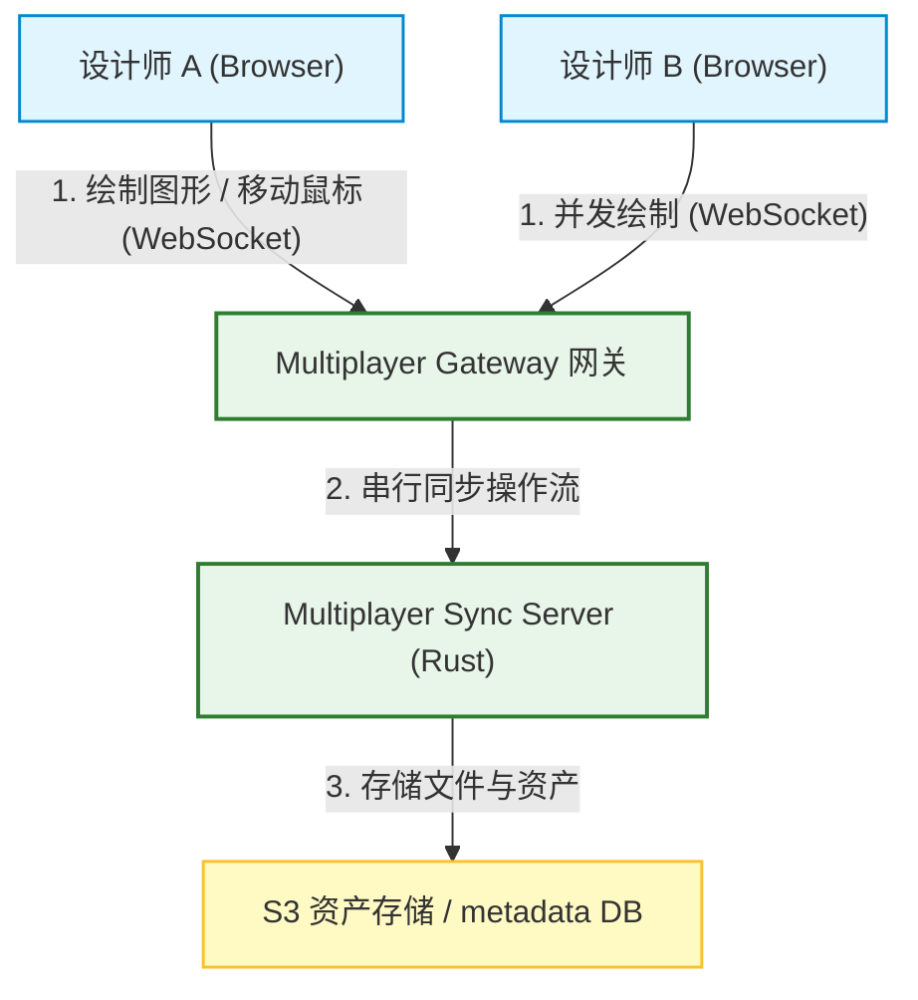
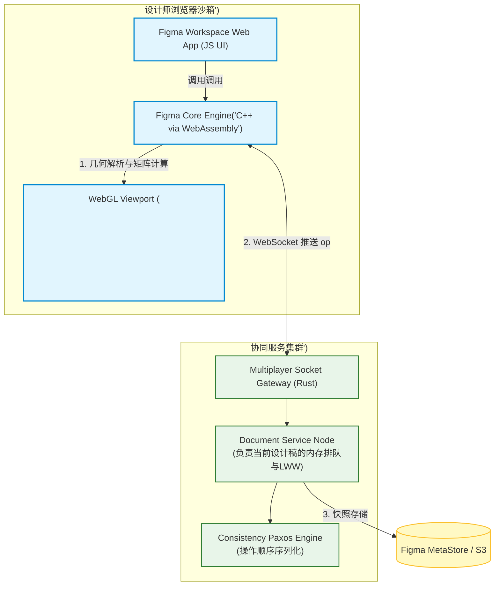
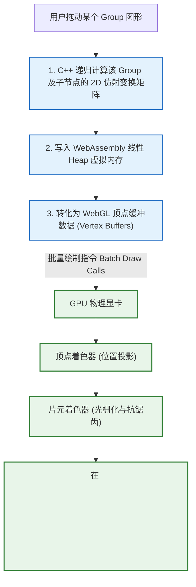
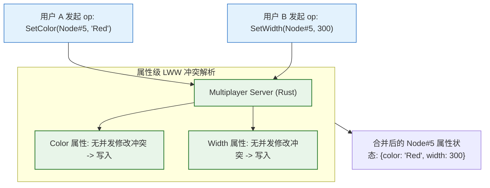
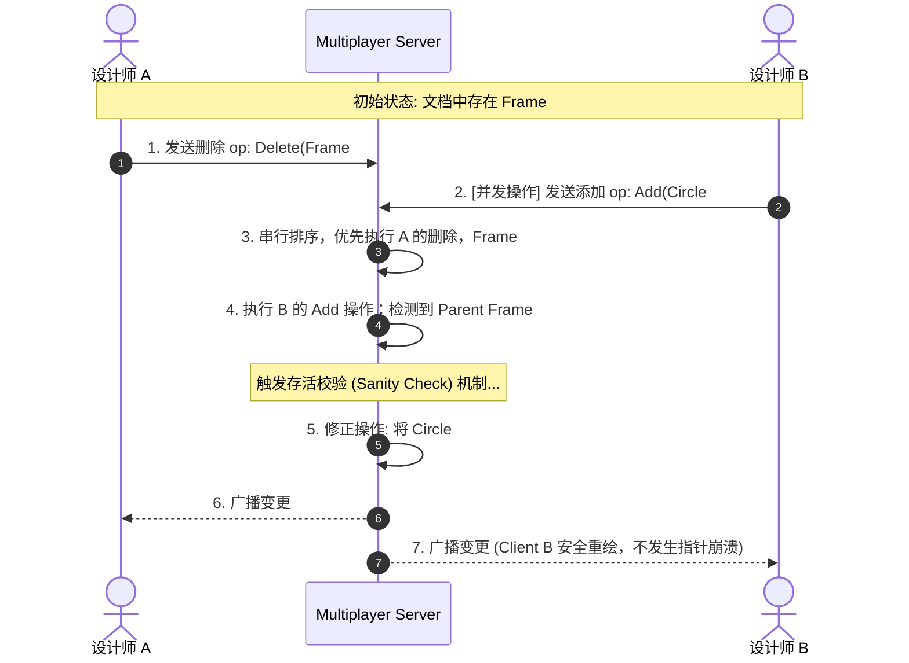

import CaseStudyHeader from '@site/src/components/CaseStudyHeader';
import DesignIntent from '@site/src/components/DesignIntent';
import EvolutionTimeline from '@site/src/components/EvolutionTimeline';
import CompareSlider from '@site/src/components/CompareSlider';
import TradeoffExplorer from '@site/src/components/TradeoffExplorer';
import GlossaryTerm from '@site/src/components/GlossaryTerm';
import ResearchNote from '@site/src/components/ResearchNote';
import GuidedExercise from '@site/src/components/GuidedExercise';
import QuizCard from '@site/src/components/QuizCard';
import MindMap from '@site/src/components/MindMap';

# Figma：基于 C++ WebAssembly 与 WebGL 渲染引擎的实时协作设计系统

<CaseStudyHeader
  oneLiner="Figma 颠覆了传统网页应用的设计范式，将『游戏引擎』的设计思想引入了 SaaS。它通过 C++ 编写核心场景图（Scene Graph）并编译至 WebAssembly (WASM)，越过浏览器 DOM 直接操作 WebGL 进行 GPU 高速重绘，实现了丝滑的 60 FPS 渲染；并通过基于 Rust 编写的 Multiplayer 协同服务器和属性级 Last-Writer-Wins (LWW) 冲突判定，提供了高可靠的多人同屏设计协作。"
  stats={[
    {label: '创办时间', value: '2012 年 (2016正式发布)'},
    {label: '客户端内核', value: 'C++ compiled to WebAssembly'},
    {label: '绘图管线', value: 'WebGL (HTML5 Canvas)'},
    {label: '服务器重构', value: 'TypeScript -> Rust (高吞吐)'},
    {label: '协同协议', value: 'WebSockets 实时流'},
    {label: '一致性模型', value: '属性级 LWW + 场景图原子操作'}
  ]}
/>

:::info 对应课程概念
本案例融合了以下课程核心概念：
*   **WASM 高性能边缘运行时（Month 8/11）**：如何利用 C++ 编译 WebAssembly 技术，避开 JavaScript 垃圾回收（GC Pauses）与动态类型检查，提升运算效率。
*   **基于层次关系（Tree）的并发冲突排解（Month 5）**：如何在树状场景图（Scene Graph）下处理并发“删除父节点与增加子节点”的复杂冲突判定。
*   **高并发低时延推送（Month 4/11）**：如何设计超轻量的 WebSocket 长连接网关，支持全球范围下的实时鼠标轨迹（Cursor Presence）广播。
:::

---

## 1. 设计初衷：用“游戏引擎”解构传统网页设计瓶颈

传统的网页 UI 编辑器（如早期基于 HTML5 DOM 或 SVG 的简易绘图板）在面对专业设计稿时，会迅速遇到三大性能与表现的天花板：
1.  **DOM 元素性能爆炸**：一个专业网页设计稿包含数万个矢量图形（矩形、文本、路径、组）。如果将每个图形映射为一个 HTML DOM 节点，浏览器的渲染引擎将瞬间过载，Pan/Zoom（平移和缩放）时卡顿极为严重，根本无法实现 60 FPS。
2.  **跨浏览器渲染差异（Cross-browser consistency）**：不同的浏览器（Chrome、Safari、Firefox）其文本渲染、SVG 路径绘制算法存在细微偏差。作为专业设计工具，Figma 必须保证“在 Chrome 里做好的设计，在 Safari 里看像素级完全一致”。
3.  **树状场景图的并发冲突（Hierarchy Conflicts）**：设计稿是一个树状结构（例如：`Document -> Page -> Frame -> Group -> Rectangle`）。如果用户 A 在本地把 Group 删除了，用户 B 同时往这个 Group 里拖入了一个 Rectangle，如果处理不当，合并时会导致系统崩溃（引用空指针）或文档树错乱。

为此，Figma 团队采取了大胆的架构突破：**废弃一切浏览器原生 DOM 节点**，使用 **C++ 编写整个渲染引擎与数据层**，通过 **WebAssembly 挂载到浏览器**，直接调用 **WebGL 在 GPU 上进行像素级重绘**。

<DesignIntent
  problem="如何在浏览器中提供可承载数万个图形元素、在高速缩放/平移平移时维持 60 FPS 的专业级矢量绘图性能，并在多人同屏高频操作下，保证文档层次树（Scene Graph）状态不发生错乱、像素级渲染多端绝对一致。"
  users="全球数十万高并发在线设计的 UI/UX 设计师、产品经理、以及前端开发协作团队。"
  devices="支持主流桌面端浏览器（Chrome、Safari、Edge 等）及 Figma Desktop 壳客户端。"
  goals={[
    '极致交互性能：整个矢量画布的 panning、zooming、vector editing 运行帧率达到 60 FPS',
    '跨端像素级一致：不依赖各浏览器原生的 CSS 或 SVG 渲染，自己计算一切抗锯齿、字体缩放和矢量曲线',
    '零 GC 干扰：场景图和属性字典驻留在 WebAssembly 线性内存中，彻底消灭 JavaScript 的垃圾回收卡顿（GC pauses）',
    '高性能多人协同：以 WebSocket 为管道，在 sub-50ms 内广播多人编辑操作、实时协同鼠标光标'
  ]}
  constraints={[
    'WASM 的内存限制：早期浏览器 32-bit WASM 仅能访问 2GB 内存限制（后支持 4GB），必须极其精简地使用内存',
    '网络延迟抖动：两个协同用户可能在世界两端，服务器必须以极短延迟做操作串行化仲裁',
    'Scene Graph 的断裂风险：并发删除与添加必须进行父子存在性校验，否则 C++ 指针异常会直接导致 WASM 崩溃'
  ]}
  firstStep="用 C++ 开发矢量引擎和 Scene Graph 数据树，编译生成 WASM 模块；使用 HTML5 Canvas 充当 WebGL 绘制视窗；设计基于 WebSocket 的 Multiplayer Server（Rust 重构）以执行属性级 Last-Writer-Wins 并发剪裁。"
/>

---

## 2. 知识全景脑图

<MindMap
  root={{
    label: 'Figma 架构全景',
    children: [
      {
        label: '渲染平面 (Rendering Engine)',
        children: [
          { label: 'C++ 场景图模型' },
          { label: 'WebAssembly 模块下发' },
          { label: 'WebGL GPU 绘图管线' },
          { label: '2D 仿射变换矩阵' }
        ]
      },
      {
        label: '数据平面 (Scene Graph)',
        children: [
          { label: '树状层级关系 (Hierarchy)' },
          { label: '节点属性字典 (Properties)' },
          { label: 'WASM 独立线性内存' }
        ]
      },
      {
        label: '协同平面 (Multiplayer Server)',
        children: [
          { label: 'Rust 高吞吐 Socket 网关' },
          { label: '属性级 LWW 冲突合并' },
          { label: '实时鼠标轨迹广播' },
          { label: '文件加载与热更新' }
        ]
      }
    ]
  }}
/>

---

## 3. 系统架构总览 (C4 Model)

以下是 Figma 矢量设计引擎与 Multiplayer 协同服务的三平面协同 C4 Context 与 Container 拓扑。

### 3a. System Context (系统上下文图)



### 3b. Container Diagram (容器结构图)



---

## 4. 核心机制拆解

### 4a. C++ WebAssembly to WebGL GPU 渲染管线

Figma 拥有与普通前端应用截然不同的渲染通道：
1.  **弃用 DOM 树**：页面仅包含一个简单的 HTML5 `<canvas>` 视窗。所有矩形、文字的属性（如：`x: 100`, `y: 200`, `fill: "#FF0000"`）均不通知浏览器 DOM，而是存放在 WASM 编译后在浏览器内分配的 **线性虚拟内存（Linear Memory）** 里。
2.  **GPU 硬件加速**：当用户移动图形或平移画布时，C++ 核心代码根据**场景图（Scene Graph）**计算所有修改图形的 2D 仿射变换矩阵（Affine Matrix），并将其编译为 WebGL 顶点数据（Vertex Buffer）。
3.  **着色器渲染（Shader Paint）**：WASM 将这些顶点和指令批量提交给 WebGL，调用显卡 GPU 的 Fragment Shader（片元着色器）对画布进行极速渲染渲染，绕过了浏览器传统的 DOM 重排（Reflow）与重绘（Repaint），使得在渲染数万图形时仍能稳定在 60 FPS。



---

### 4b. 属性级 Last-Writer-Wins (LWW) 与场景图冲突合并

Figma 在多人协作时面临的操作冲突和文字协同（OT）不同：
*   设计稿的大多数操作是**修改独立属性**（例如修改矩形 A 的高度 $h$、填充色 $color$）。
*   为了提高高并发下服务器的吞吐，Figma 并不采用昂贵的 OT 算法，而是采用**属性级 Last-Writer-Wins (LWW)**。
    *   **独立版本戳**：每个 Node 的每一个属性（如 `Node#12.color`）都拥有一个独立的时间戳/版本号。
    *   **行级/属性级合并**：如果用户 A 在并发修改 `Node#12.color` 为红色，用户 B 并发修改 `Node#12.width` 为 200。在服务器端，这两者被视为完全不冲突的修改，自动合并；若均修改 `color` 属性，则后到达服务器的直接覆盖前者，消除了协作锁冲突。



---

### 4c. 场景图（Scene Graph）树状冲突处理（空指针预防）

属性级 LWW 无法完全处理**结构性编辑冲突**，这是图形树状关系必须解决的核心问题：
*   **冲突情境**：用户 A 在本地删除了 `Frame 1`；同一瞬间，用户 B 往 `Frame 1` 中拖入了一个 `Circle`。
*   **如果直接执行**：如果 B 的操作先到达服务器并被记录，随后 A 的删除操作抹去了 `Frame 1`。在 B 端，客户端在尝试解析“在已经没有 Frame 1 的地方绘制 Circle”时，C++ 代码会读取空指针，直接引发 WebAssembly 运行时崩溃。
*   **Figma 解决方案：原子操作隔离与存活校验**
    *   所有结构性修改都是原子性的。
    *   客户端在执行任何 operation 时，均要执行安全条件判定（Sanity Check）。
    *   如果目标父节点在内存的场景图中已被标为 `deleted`，则自动将该操作降级，或将其挂载在一个全局临时隐藏节点上，杜绝了空指针悬空引用，保证了 WASM 容器在遇到网络抖动和逻辑冲突时的绝对稳健。



---

## 5. 关键数据结构与算法

### 5a. 2D 仿射变换矩阵 (2D Affine Transformation Matrix)

在 Figma 的 C++ 场景图中，每个节点都需要知道自己在屏幕上的绝对坐标与偏角。
为了能在缩放、旋转、移动时快速重绘，每个节点都挂载一个 $3 \times 3$ 的 2D 仿射变换矩阵（在 2D 图形学中，最后一行固定为 `[0, 0, 1]`，实际仅存储前两行共 6 个浮点值）：

$$[x', y', 1]^T = [[a, c, t_x], [b, d, t_y], [0, 0, 1]] \times [x, y, 1]^T$$

*   $a, d$：控制缩放（Scaling）。
*   $b, c$：控制旋转与剪切（Rotation & Shearing）。
*   $t_x, t_y$：控制平移位置（Translation）。

#### 层次累乘（Propagation）：
当用户拖动一个 Group 移动时，不需要挨个去计算 Group 里上万个子图形的绝对物理坐标。
*   子图形在重绘时，其相对于屏幕的绝对矩阵 M_global 是通过其父节点的矩阵 M_parent 与自身相对矩阵 M_local 相乘计算得来的：
    $$M_global = M_parent \times M_local$$
*   C++ 核心引擎在 WebGL 渲染管线遍历树时，利用 GPU 硬件级别的矩阵乘法，顺着 Scene Graph 从根节点到叶子节点依次累乘。这确保了在复杂的深层级 Group 嵌套下，画面平移仍能保持流畅。

---

### 5b. 属性 LWW 数据项结构

每一个设计属性都有一个唯一的键标识（Property Key），在参数同步中定义为一个 Tuple：
`[NodeID, PropertyName]`。

服务器内部为每个 Key 维持一个自增的绝对修改序列版本戳 `Sequence`：

```cpp
struct PropertyItem {
    string node_id;
    string property_name;
    uint64_t sequence;  // 服务器下发或自增序列戳
    string value;        // 属性值 (如颜色 Hex, 坐标值)
};
```

当多端提交同一属性的改动时，如果新到达操作的 `sequence <= current_property.sequence`，则直接判定为“过期的并发网络残留”，不予处理；反之则就地更新并广播。

---

## 6. 架构演进史

Figma 从一个简单的浏览器实验，成为云端协作设计王国的演进史，代表了 Web 运行时能力的最高阶发挥：

<EvolutionTimeline
  events={[
    {
      year: '2012',
      title: '早期探索时代：原生 Canvas 绘图',
      why: '早期的浏览器（HTML5 规范刚起步）不支持 WebAssembly，使用 JavaScript 操作 HTML5 Canvas 绘制数千矢量图形时，性能遇到严重的 JS 堆内存开销与卡顿限制。',
      change: '推出基于 TypeScript 重构的第一代画布渲染；由于 JS 的 GC 暂停经常导致掉帧，确定将核心层改为 C++ 编写。'
    },
    {
      year: '2015',
      title: 'C++ asm.js / WebAssembly 飞跃时代',
      why: '多人同时在超大型看板中编辑数十页设计稿，内存瓶颈极其突出，需要避开 V8 引擎的 GC 和动态解释。',
      change: '将 C++ 代码用 Emscripten 编译成 asm.js（后升级为 WebAssembly），绕过 DOM，将数据全驻留在 WASM 线性 Heap 堆中，实现了 60 FPS 的流畅体验，开创了 SaaS 游戏引擎化先河。'
    },
    {
      year: '2020+',
      title: 'Rust 重构多人服务与分布式 Paxos 强一致',
      why: '全球高并发设计场景爆发，原本基于 TypeScript/Node.js 的 Multiplayer 协同服务器因高频垃圾回收（GC Pauses）与高并发 Socket 压力开始出现 CPU 跑满和连接抖动。',
      change: '将 Multiplayer Server 核心用 Rust 彻底重构，实现超轻量级内存管理与极高的 WebSocket 并发吞吐；底层分布式存储引入 Paxos 复制协议，确保万亿设计文件属性的强一致对齐。'
    }
  ]}
/>

---

## 7. 架构对比：Figma WASM+WebGL 引擎 vs. 传统 HTML5+SVG 编辑器

<CompareSlider
  before={
    <div style={{ padding: '20px', background: '#ffebee', border: '1px solid #c62828', borderRadius: '8px', height: '100%', color: '#333' }}>
      <strong>传统 HTML5 DOM / SVG 矢量编辑器</strong>
      <p style={{ marginTop: '10px', fontSize: '0.9rem' }}>画布上的每个圆、矩形都是一个 SVG 或 DOM 节点。图形平移和缩放依赖浏览器自身的 layout 重排与重绘。当图形元素超过 1000 个时，DOM 节点层级深且极其沉重，帧率断崖式下跌，且无法保证多端字体与抗锯齿渲染绝对相同。</p>
    </div>
  }
  after={
    <div style={{ padding: '20px', background: '#e8f5e9', border: '1px solid #2e7d32', borderRadius: '8px', height: '100%', color: '#333' }}>
      <strong>Figma WASM + WebGL 像素渲染架构</strong>
      <p style={{ marginTop: '10px', fontSize: '0.9rem' }}>彻底脱离 DOM。万亿图形属性全驻留在 WASM 内存中，平移缩放由 C++ 场景图直接计算仿射矩阵，通过 WebGL 批量提交 GPU 渲染。消除了垃圾回收（GC），在数万元素下仍稳定在 60 FPS，多端像素级 100% 绝对一致。</p>
    </div>
  }
  labels={['传统 DOM/SVG 架构', 'Figma WebAssembly 架构']}
/>

---

## 8. 权衡：实时协作设计工具的关键折中

Figma 在追求丝滑流畅与高一致协同的过程中，进行了深刻的架构权衡：

<TradeoffExplorer
  title="Figma 协作帧率、数据一致性与内存折中"
  dimensions={['平移平移帧率 (60 FPS)', '强数据一致性 (防止越权冲突)', '系统并发吞吐量', '客户端内存限制', '代码调试与算法复杂度']}
  options={[
    {
      name: '属性级 Last-Writer-Wins (LWW)',
      scores: [5, 3, 5, 4, 4],
      note: '放弃复杂的字符级 OT/CRDT，对于独立属性（如 width、color）通过服务器时序进行最后写入者胜判定。这使得多人同屏编辑时的 CPU/内存损耗趋于零，保证了极高的多人同屏帧率。缺点是如果两个人并发修改同一个属性（如两人同时输入不同色值），只有一人的能留下，无法执行字符级的细致合并。',
      whenToUse: '元素以独立属性修改为主（非连续段落编辑）的协同图形设计系统。'
    },
    {
      name: 'C++ WebAssembly 全栈内存常驻',
      scores: [5, 4, 3, 2, 1],
      note: '整个场景图全部存放在 WASM 堆虚拟内存中，避开 JS 动态变量损耗。提供了顶级的渲染效率，但代价是调试成本极其昂贵（WASM 核心崩溃时，浏览器只能看到一堆 16 进制内存转储，需要繁琐的 SourceMap 翻译）。同时受到浏览器 32-bit WASM 内存上限的制约。',
      whenToUse: '对实时算力要求苛刻、依赖 GPU 渲染、需要完全掌控内存周期的 Web 级大型专业应用。'
    },
    {
      name: '全量使用 Canvas 原生 2D 绘图 (Canvas2D Context)',
      scores: [2, 5, 4, 5, 5],
      note: '使用浏览器原生的 Canvas2D api 绘图，放弃 WebGL 着色器编写。极大降低了开发难度与 C++ 到 WebGL 矩阵解析的代码复杂度。缺点是 Canvas2D 无法充分利用 GPU 硬件级别的顶点加速，当元素超过数千时，缩放平移帧率会暴跌至 10-20 帧。',
      whenToUse: '图形复杂度低、不需要 3D 仿射变换、开发周期紧张的初创级画图工具。'
    }
  ]}
/>

---

## 9. 如果是你来设计：场景图仿射矩阵累乘计算器

### 场景设想
在 Figma 的 C++ 场景图中，有一组分级关系：
*   父节点 `Group1`：其局部的相对仿射矩阵为平移变换 M_parent，在 $X$ 轴平移了 `100` 像素，在 $Y$ 轴平移了 `50` 像素。
*   子节点 `Rectangle1`（归属于 `Group1`）：其自身相对父节点的局部矩阵为 M_local，自身在 $X$ 轴平移了 `20` 像素，在 $Y$ 轴平移了 `10` 像素。

当用户在屏幕上移动父节点 `Group1` 时，系统需要计算出子节点 `Rectangle1` 最终相对于画布屏幕的绝对仿射变换矩阵 M_global，以便 WebGL 顶点着色器将其精准绘制在 GPU 缓冲区。

请你用 Python 实现这个 2D 仿射变换矩阵的累乘计算。

<GuidedExercise
  title="基于 Python 的 2D 仿射矩阵累乘与坐标变化模拟"
  goal="设计 2D 仿射变换矩阵数据结构，实现两个仿射矩阵的乘法（Matrix Multiplication），并能够通过父节点矩阵变化自动推导出子节点的绝对屏幕坐标。"
  steps={[
    '步骤 1: 设计 2D 仿射矩阵的表示。使用 $3 \times 3$ 的二维列表代表仿射变换矩阵。由于最后一行固定为 `[0, 0, 1]`，对于平移 x 和 y，仿射矩阵形式为：`[[1, 0, tx], [0, 1, ty], [0, 0, 1]]`。',
    '步骤 2: 编写矩阵乘法函数 `matrix_multiply(M1, M2)`。实现标准的 $3 \times 3$ 矩阵乘积，返回一个代表复合变换的新矩阵。',
    '步骤 3: 构建 Parent-Child 矩阵更新环路。定义父节点的平移矩阵 `M_parent = [[1, 0, 100], [0, 1, 50], [0, 0, 1]]`；定义子节点的相对平移矩阵 `M_local = [[1, 0, 20], [0, 1, 10], [0, 0, 1]]`。',
    '步骤 4: 执行累乘并验证。调用 `M_global = matrix_multiply(M_parent, M_local)`。计算一个子节点局部位点 `[0, 0, 1]` 经过 `M_global` 变换后的绝对屏幕坐标，核对绝对 X 和 Y 坐标是否正确累加为了 `120` 和 `60`。'
  ]}
  checks={[
    '确认矩阵乘法运算后，输出的 $3 \times 3$ 仿射矩阵其最后一行依然是 `[0, 0, 1]`',
    '验证子节点 `[0, 0, 1]` 转换后绝对屏幕坐标为 `(120, 60)`，证明父节点平移量成功传递给子节点',
    '验证当父节点发生缩放（Scale）时，子节点的绝对坐标及缩放比例能正确累乘得出'
  ]}
/>

---

## 10. 知识自测

<QuizCard
  questions={[
    {
      q: 'Figma 放弃传统的 HTML5 DOM 和 SVG 布局，转而使用 C++ 编译至 WebAssembly 直接操控 WebGL 进行像素级重绘，最根本的动因是什么？',
      options: [
        'A. 为了绕过 Microsoft Purview 的企业合规 DLP 拦截策略',
        'B. 因为传统 DOM/SVG 在面对数万个矢量图形时，重排（Reflow）开销巨大，帧率断崖式下跌，且无法保证多浏览器抗锯齿像素级渲染的绝对一致。通过 WASM 和 GPU WebGL 绘图，能消灭垃圾回收卡顿并稳定在 60 FPS',
        'C. 强制要求所有设计师必须使用 GPU 挖矿芯片才能运行 Figma',
        'D. 保证 Snowflake ID 分布式全局自增在 Canvas 视窗中永不重复'
      ],
      answer: 1,
      explain: '这是 Figma 领先于其他编辑器的核心护城河。作为一个“披着网页外衣的游戏引擎”，WASM 和 WebGL 跨过了浏览器沉重的 DOM 树解析排版链路，将数据计算全留存在 C++ 进程堆虚拟内存中，保障了顶级的矢量缩放流畅度。'
    },
    {
      q: '在处理高并发的多人同屏设计协作时，Figma 采用了“属性级 Last-Writer-Wins (LWW)”冲突合并逻辑，其核心合理性在哪里？',
      options: [
        'A. 因为设计稿绝大多数的改动是相互独立的属性修改（如 A 修改矩形宽度，B 修改矩形颜色），通过属性版本戳进行后写胜，消除了高开销的字符级 OT/CRDT 计算，极大减轻了服务器和客户端的计算负载',
        'B. 属性级 LWW 可以自动修正用户在 offline 离线状态下产生的 Text 字符漂移',
        'C. LWW 可以防止 2D 仿射变换矩阵累乘时发生浮点溢出',
        'D. 这样做可以强制大 V 用户自动跳转至写时扇出（Push）通道'
      ],
      answer: 0,
      explain: '与文字协同编辑（多个用户同时修改同一个连续字符串，必须用 OT）不同，图形设计通常是多维度的独立属性操作。属性 LWW 允许用户并发修改同一节点的不同维度，在服务器上物理交织合并，极具高吞吐能效性。'
    },
    {
      q: '在多人同时编辑树状场景图（Scene Graph）时，如果用户 A 并发删除了父容器，而用户 B 并发向该父容器中添加子节点，Figma 是如何防止 C++ 核心代码因为读取空引用而导致 WebAssembly 进程崩溃的？',
      options: [
        'A. 强行回滚用户 A 的删除操作并禁止其当天再次登录',
        'B. 每次删除操作都强制锁定整个画布 5 秒钟进行全网 Paxos 强同步',
        'C. 在客户端 C++ 核心层内置原子操作校验（Sanity Check）：执行添加操作前强制判定父节点的存在性。若父节点已被删，则动态修正操作，将新节点重路由挂载至全局隐藏的 Orphan 根节点下，保护指针安全',
        'D. 依靠 React 沙箱中的 SystemSimulator 缓存组件进行自动热重启'
      ],
      answer: 2,
      explain: 'WASM 线性堆内存没有 Java 或 JS 的自动引用保护，一旦读取空引用，C++ 核心就会引发 Panic，导致浏览器整个标签页崩溃。Figma 在 C++ 操作应用层设计了严苛的结构性合法性校验（Sanity check），杜绝悬空引用，保全了运行时的绝对健壮。'
    }
  ]}
/>

---

## 来源清单

*   [Figma Engineering Blog: WebAssembly's post-MVP future (2018)](https://www.figma.com/blog/webassemblys-post-mvp-future/)
*   [Figma Engineering Blog: Realtime Collaborative Editing Engine details (2019)](https://www.figma.com/blog/how-figma-built-collaborative-editing-engine/)
*   [Emscripten documentation: Compiling C/C++ to WebAssembly](https://emscripten.org/)
*   [High Scalability: Figma multiplayer synchronization server architecture rewrite to Rust](https://highscalability.com/figma-real-time-multiplayer-synchronization-server/)