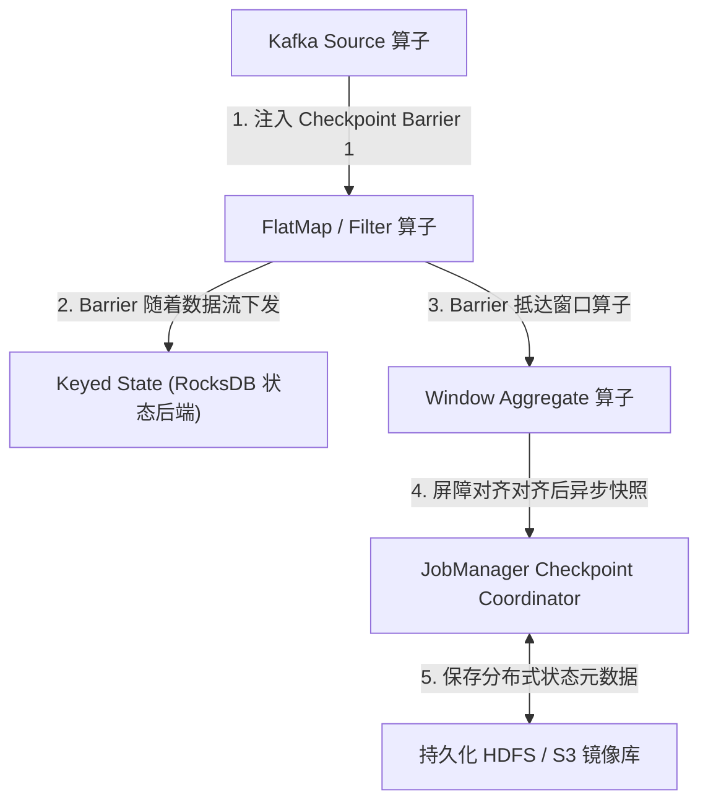
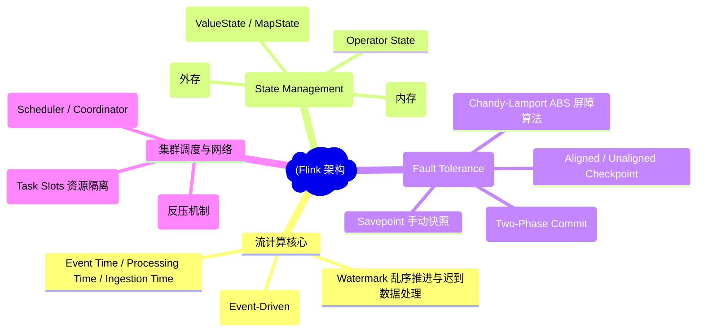
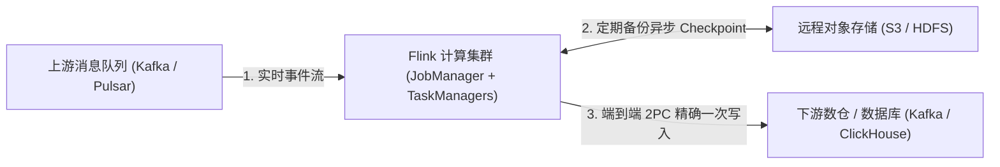
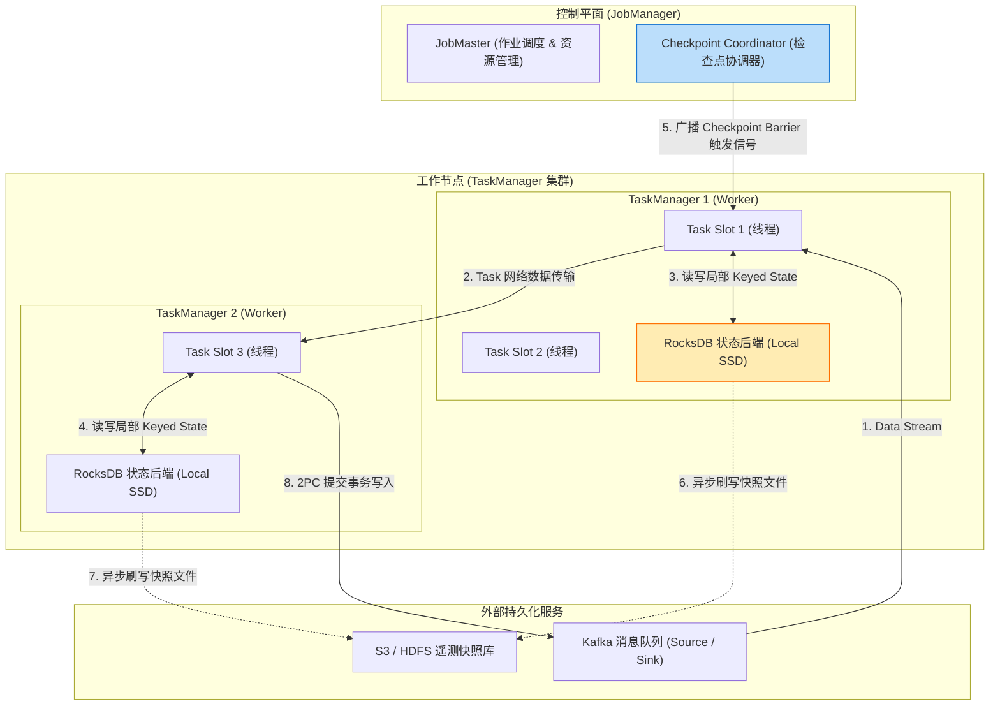
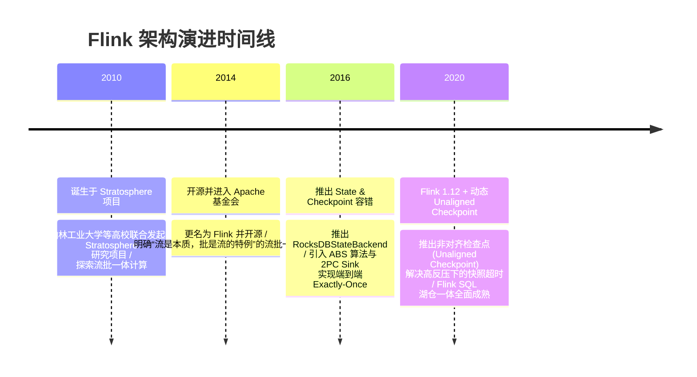

import CaseStudyHeader from '@site/src/components/CaseStudyHeader';
import DesignIntent from '@site/src/components/DesignIntent';
import ArchitectureEvolution from '@site/src/components/ArchitectureEvolution';
import TradeoffExplorer from '@site/src/components/TradeoffExplorer';
import GlossaryTerm from '@site/src/components/GlossaryTerm';
import ResearchNote from '@site/src/components/ResearchNote';
import QuizCard from '@site/src/components/QuizCard';
import CompareSlider from '@site/src/components/CompareSlider';
import GuidedExercise from '@site/src/components/GuidedExercise';
import PyRunner from '@site/src/components/PyRunner';

# Flink：有状态流计算与 Exactly-Once 架构

<CaseStudyHeader
  oneLiner="Flink 彻底颠覆了传统 Spark Streaming 微批（Micro-batching）模拟流计算的物理局限，通过纯事件驱动（Event-Driven）管线、基于 Chandy-Lamport 变种算法的轻量级检查点（Checkpoint）与两阶段提交 Sink，在毫秒级低延迟下实现了端到端 Exactly-Once 一次且仅一次语义。"
  stats={[
    {label: '流处理引擎', value: '原生的事件驱动 (Event-Driven Stream)'},
    {label: '时间语义', value: 'Event Time + Watermark (乱序容忍)'},
    {label: '状态后端', value: 'HeapStateBackend / Embedded RocksDB'},
    {label: '检查点算法', value: 'Asynchronous Barrier Snapshotting (ABS)'},
    {label: '一致性语义', value: 'End-to-End Exactly-Once (两阶段提交 2PC)'}
  ]}
/>

:::info 对应课程概念
本案例横跨 [Month 3 消息队列与实时流计算](../foundations/programming-systems-primer)、[Month 5 分布式快照 (Chandy-Lamport) 与 2PC 共识](../cloud-enterprise-industrial/capstone-cloud-native)、[Month 8 实时数仓与 Checkpoint 状态容错](../cloud-enterprise-industrial/capstone-cloud-native)。它是系统架构师研究如何将无限无界数据流在分布式节点上进行毫秒级有状态计算与秒级自愈恢复的标准典范。
:::

## 1. 设计初衷：如何构建低延迟、有状态且防重的实时流系统？

在传统的大数据批处理与早期流处理（如 Spark Streaming）中，存在着极大的架构痛点：
1. **微批处理（Micro-batching）的高延迟**：Spark Streaming 强制将无限数据流切割成一小段一小段的 Micro-batch（如 1 秒一段）。虽然简化了容错逻辑，但天生背负数百毫秒甚至秒级的物理延迟，无法满足高频风控、实时派单等毫秒级业务。
2. **处理时间（Processing Time）遭遇乱序与延迟崩溃**：网络延迟和移动端离线重连会导致日志乱序到达。如果仅按服务器接收到的“处理时间”计算窗口，会导致统计数据严重失真（如 10:00 发生的数据在 10:05 收到并算入 10:05 的窗口）。
3. **有状态计算在节点崩溃后重复或丢数据**：流计算在内存中维护中间状态（如累计交易额）。如果算子节点突然宕机崩溃，简单重启会导致状态重置为 0（At-most-Once）或消息重复计算（At-least-Once），无法达到金融级的准确度。

Flink 的核心设计用意在于：**以事件（Event）为最小粒度驱动数据流，基于 <GlossaryTerm term="Watermark (水位线)" definition="Watermark：Flink 用于衡量 Event Time 进度的单调递增时间戳标记。它随着数据流一起流转，用于告诉算子 '时间戳小于等于该 Watermark 的所有事件都已经到达'，从而安全触发乱序窗口的计算。">Watermark</GlossaryTerm> 解决乱序问题，并利用 <GlossaryTerm term="Checkpoint (检查点)" definition="Checkpoint：Flink 基于 Chandy-Lamport 算法实现的全局分布式一致性快照。作业在运行过程中定期在数据流中注入 Checkpoint Barrier (屏障)，算子在收到 Barrier 后异步将内存状态刷写保存到持久化存储中，实现秒级故障恢复。">Checkpoint</GlossaryTerm> 实现 <GlossaryTerm term="Exactly-Once (精确一次)" definition="Exactly-Once：精确一次语义。保证即使在发生节点宕机、网络故障或程序崩溃的情况下，系统最终的状态和输出结果也与没有任何故障发生、所有事件按顺序恰好被处理过一次时的结果 100% 完全一致。">Exactly-Once</GlossaryTerm> 容错**。
- **纯粹的事件驱动流引擎**：数据一到立刻触发 Operator 计算，不再等待微批打包，时延低至毫秒级。
- **Event Time 与 Watermark 机制**：以事件自身产生的时间为准，通过 Watermark 容忍一定程度的乱序和迟到数据。
- **轻量级异步屏障快照（ABS）**：在流中插入 Barrier 屏障，各节点收到 Barrier 后异步保存局部状态（State），无需停顿整条流水线。
- **端到端 2PC 提交**：配合 Kafka 等支持事务的 Source/Sink，实现上游读取、中间状态计算、下游写入的全链路 Exactly-Once。



<DesignIntent
  problem="如何构建一个毫秒级低延迟、支持海量 Keyed 状态存储、能精准处理乱序事件并在节点宕机故障时实现端到端 Exactly-Once 容错的分布式流计算平台？"
  users="风控实时规则引擎架构师、实时数仓 (Flink SQL / Iceberg) 研发总监、大厂实时推荐与流量大屏工程师。"
  devices="运行 Flink `JobManager` 和成百上千个 `TaskManager` (Task Slots) 容器的 Kubernetes / YARN 集群。"
  goals={[
    '事件驱动低延迟：单事件流水线流转，时延维持在亚毫秒级（< 10ms）。',
    'Event Time 乱序容忍：基于 Watermark 机制，解决延迟迟到数据对窗口统计的破坏。',
    '超大 State 内存扩展：支持 HeapStateBackend（内存）与 Embedded RocksDBStateBackend（外存磁盘），支撑 TB 级 Operator 状态。',
    '端到端 Exactly-Once 语义：结合 Chandy-Lamport 检查点快照与 Two-Phase Commit (2PC) 挂载 Sink，实现零重复零丢失。'
  ]}
  constraints={[
    'Checkpoint Barrier 对齐停顿：在传统 Aligned Checkpoint 模式下，当某上游 Channel 延迟较大时，窗口算子必须挂起快 Channel 的 Barrier 对齐，可能导致反压（Backpressure）加剧。',
    '两阶段提交 Sink 的长时间悬挂事务：若下游写 2PC Sink 在提交阶段遭遇网络中断，外部存储（如 Kafka）需要等待事务超时才能释放连接。'
  ]}
  firstStep="剖析 Event Time 与 Watermark 生成逻辑；分析 Barrier 对齐与 RocksDB 状态刷盘过程；用 Python 编写一个包含 Watermark 乱序窗口与 Checkpoint 状态恢复的流计算仿真器。"
/>

## 2. 系统功能全景



---

## 3. 最新架构总览

Flink 集群的作业编译、执行与状态管理架构如下：

### 3a. System Context (系统上下文)



### 3b. Container Diagram (容器架构)



---

## 4. 核心机制拆解

### 4a. Spark Streaming 微批 vs Flink 事件驱动流架构对比

Spark Streaming 采用把无限流切割为小微批（Micro-Batch）的思想，实质上是用批处理模拟流；而 Flink 采用原生的 **事件驱动（Event-Driven）** 模型，消息到达即算，天然具备极低延迟：

```mermaid
graph TB
  subgraph SparkStreaming["Spark Streaming 微批模型 (Micro-Batching)"]
    BatchTimer["批定时器 (如每 500ms 触发一次)"]
    BatchData["打包为 RDD 离散微批文件"]
    BatchExec["提交 Spark 批处理 Task 计算"]
    
    BatchTimer --> BatchData --> BatchExec
    style BatchTimer fill:#ffcdd2,stroke:#c62828
  end

  subgraph FlinkStream["Flink 原生事件驱动模型 (Event-Driven)"]
    EventStream["无限事件流: [E1, E2, E3, E4..."]"]
    SingleOp["算子按单事件流式触发: op(Event)"]
    StateUpdate["内存 State 实时更新 + 毫秒级输出"]
    
    EventStream --> SingleOp --> StateUpdate
    style SingleOp fill:#c8e6c9,stroke:#2e7d32
  end
```

### 4b. Chandy-Lamport 屏障检查点（Barrier Checkpoint）原理

为了在不停止数据流运行的前提下拍摄全局一致的快照，Flink 采用了异步屏障快照算法（Asynchronous Barrier Snapshotting）：
1. **注入 Barrier**：Checkpoint Coordinator 定期向 Source 算子注入特种控制标记——**Checkpoint Barrier**。
2. **屏障随流下发**：Barrier 随着普通数据流一起沿着算子拓扑向下游流动。数据与 Barrier 严格按顺序推移。
3. **<GlossaryTerm term="屏障对齐 (Barrier Alignment)" definition="屏障对齐：当一个多输入的 Flink 算子收到其中一个输入 Channel 的 Checkpoint Barrier 时，它会暂停处理该 Channel 后续到达的数据 (放入 Buffer)，直到所有输入 Channel 的 Barrier 都到达该算子。完成 Barrier 对齐后，算子拍照本地状态并下发 Barrier，随后恢复 Buffer 数据的处理。">屏障对齐（Barrier Alignment）</GlossaryTerm>**：当多输入通道的算子收到第一条 Barrier 时，它会暂停该 Channel 的数据处理，将其缓存入 Buffer，等待其余 Channel 的 Barrier 齐聚。
4. **异步刷盘与下发**：一旦所有 Barrier 对齐，算子对当前的内存 State 拍摄本地快照并异步写盘，同时将 Barrier 继续向下游下发。

```mermaid
graph TD
  subgraph InputChannels["多路输入 Channel"]
    Ch1["Channel 1: [Data B"] [Barrier N] [Data A]"]
    Ch2["Channel 2: [Barrier N"] [Data X]"]
  end

  subgraph OperatorAlign["算子 Barrier 对齐阶段"]
    AlignBuffer["Buffer 区: 暂存 Channel 2 处 Barrier N 之后的 Data Y"]
    AlignWait["等待 Channel 1 的 Barrier N 到达..."]
  end

  Ch2 -->|1. Barrier N 先到达| AlignBuffer
  Ch1 -->|2. Barrier N 随后到达 (对齐完成)| AlignWait
  
  AlignWait -->|3. 触发本地 State 异步 Snapshot| AsyncStateSave["异步保存 State 至 S3"]
  AlignWait -->|4. 向下游继续下发 Barrier N| Downstream["广播 Barrier N 给下游"]
```

---

## 5. 关键数据结构与算法：Watermark 推进与乱序窗口触发

当数据因为网络延迟产生乱序时，Flink 通过 **Watermark 算法** 动态推进 Event Time。以下是乱序 Watermark 计算与窗口触发的核心代码逻辑：

```cpp
struct Event {
    std::string key;
    uint64_t event_time; // 事件发生时的毫秒时间戳
    double value;
};

class BoundedOutOfOrdernessWatermarkGenerator {
private:
    uint64_t max_timestamp = 0;
    uint64_t out_of_orderness_bound = 5000; // 最大容忍 5 秒乱序

public:
    // 每当一条新事件到达时调用
    void OnEvent(const Event& event) {
        max_timestamp = std::max(max_timestamp, event.event_time);
    }

    // 定期生成 Watermark (如每 200ms 发送一次)
    uint64_t EmitWatermark() {
        // Watermark 时间 = 当前见过的最大事件时间 - 容忍延迟时间
        uint64_t current_watermark = (max_timestamp > out_of_orderness_bound) 
                                     ? (max_timestamp - out_of_orderness_bound) : 0;
        return current_watermark;
    }
};

// 窗口算子处理逻辑
void ProcessWindow(uint64_t current_watermark, uint64_t window_end_time) {
    // 只有当最新的 Watermark 推进到了窗口结束时间之后，才安全关闭窗口并计算输出！
    if (current_watermark >= window_end_time) {
        TriggerWindowCalculationAndOutput();
        PurgeWindowMemoryState();
    }
}
```

---

## 6. 架构演进史



---

## 7. 架构对比

### 传统 Spark Streaming 微批引擎 vs Flink 事件驱动流引擎

<CompareSlider
  before={
    <div style={{ padding: '20px', background: '#ffebee', border: '1px solid #c62828', borderRadius: '8px', height: '100%', color: '#333' }}>
      <strong>Spark Streaming 微批模型</strong>
      <p style={{ marginTop: '10px', fontSize: '0.9rem' }}>
        用批处理模拟流。数据按时间切分为 Micro-batch 打包。物理延迟通常在 500ms - 2s 之间。状态容错依赖于父子 RDD 的血统重算。
      </p>
    </div>
  }
  after={
    <div style={{ padding: '20px', background: '#e8f5e9', border: '1px solid #2e7d32', borderRadius: '8px', height: '100%', color: '#333' }}>
      <strong>Flink 事件驱动模型</strong>
      <p style={{ marginTop: '10px', fontSize: '0.9rem' }}>
        原生单事件驱动流。单条数据立即触发算子计算，物理延迟小于 10ms。基于 Chandy-Lamport Barrier 快照实现毫秒级自愈与端到端 Exactly-Once。
      </p>
    </div>
  }
  labels={['Spark 微批模拟流', 'Flink 原生事件流 Engine']}
/>

---

## 8. 核心决策的取舍

在设计实时流计算系统的状态存储与容错快照时，架构师对 State Backend 选型与 Checkpoint 屏障模式面临核心抉择：

<TradeoffExplorer
  title="Flink 状态后端与 Checkpoint 策略取舍"
  dimensions={['超大 TB 级状态 Keyed State 存储能力', '单事件 Operator 状态读写物理时延', '遭遇严重反压 (Backpressure) 时 Checkpoint 成功率', '全局异步快照的持久化 IO 开销', '内存堆 GC 停顿对流计算的影响']}
  options={[
    {
      name: 'Embedded RocksDB 状态后端 + Unaligned Checkpoint 策略',
      scores: [5, 3, 5, 4, 5],
      note: '状态溢出写入本地 SSD RocksDB，打破 JVM 堆内存限制；配合 Unaligned Checkpoint (非对齐屏障直接写入 Channel)，即使在极严重的 Backpressure 下依然能 100% 成功生成快照。缺点是由于状态序列化与 RocksDB 点查，单事件处理延时稍微高于纯内存后端。',
      whenToUse: '海量 Keyed 状态（如上亿用户实时标签）、要求高容错稳健性的大型实时数仓与风控系统。'
    },
    {
      name: 'Heap (Memory) 状态后端 + Aligned Checkpoint 策略',
      scores: [2, 5, 2, 2, 2],
      note: '状态全保存在 JVM 堆内存中，读写极快（纯指针访问）。配合标准的 Barrier 对齐快照。缺点是受限于物理内存大小，大状态下极易引发昂贵的 GC 停顿，且在严重反压时 Barrier 对齐可能超时导致 Checkpoint 连续失败。',
      whenToUse: '状态极小（如简单求和/计数）、对延迟要求达到极致亚毫秒级的实时低延迟监控。'
    }
  ]}
/>

---

## 9. 实践指引：实现一个带 Watermark 乱序处理与 Barrier Checkpoint 的流仿真器

理解 Flink 核心的最佳路径是模拟一个包含 Event Time Watermark 乱序推进、内存状态更新与 Checkpoint Barrier 快照的流计算引擎。在下方练习中，通过 Python 实现针对乱序事件流的 Watermark 计算以及 Barrier 触发快照备份的过程。

<GuidedExercise
  title="练习指引：手写 Event Time Watermark 乱序推移与 Checkpoint Barrier 状态快照仿真"
  goal="构建包含 `StreamSource`、`WindowOperator` 和 `CheckpointCoordinator` 的流仿真系统。1. 事件流中包含乱序数据 `[t=1000, t=3000, t=2000, t=7000]`。2. 产生 `out_of_orderness=2000ms` 的 Watermark，当 Watermark 超过 5000ms 时触发 0-5s 的 Event Time 窗口统计。3. 插入 `CheckpointBarrier(id=1)`，算子收到 Barrier 后将其内存状态备份入字典，验证模拟 Checkpoint 成功。"
  hints={[
    '你可以用 `Event(time, val)` 表示事件。',
    'Watermark 生成逻辑：`current_watermark = max_event_time - 2000`。',
    '当收到 `Barrier` 对象时，算子调用 `snapshot_state()`，将当前的窗口/Keyed 内存状态拷贝一份存入 `checkpoint_store` 字典。'
  ]}
  steps={[
    '定义 `Event` 和 `Barrier` 消息对象。',
    '定义 `WindowOperator` 维持 `keyed_state` 和窗口缓存。',
    '模拟向 Operator 顺序发送乱序事件并更新 Watermark。',
    '观察当 Watermark 推进跨越 5000ms 时，0-5s 窗口成功触发输出。',
    '模拟向 Operator 发送 Barrier 1 消息，触发 `snapshot_state()`。',
    '校验快照字典中的状态数据是否与当时算子内存状态完全一致。'
  ]}
  checks={[
    '乱序到达的 `t=2000` 事件被成功归入 0-5s 窗口，未被错误丢弃。',
    'Watermark 正确延迟 2 秒推进，跨越 5000ms 门槛时精准关闭 0-5s 窗口。',
    '算子收到 Barrier 1 后完成快照备份，成功输出 State 备份日志，验证 Checkpoint 机制成功。'
  ]}
/>

#### 交互式 Python 运行实验
在下方控制台中调试 Flink Watermark 与 Checkpoint 屏障仿真代码，观察乱序窗口计算与分布式快照过程：

<PyRunner
  expect="分片路由与隔离验证成功"
  rows={25}
  code={`class Event:
    def __init__(self, event_time: int, key: str, value: float):
        self.event_time = event_time # 事件发生时间 (ms)
        self.key = key
        self.value = value

class Barrier:
    def __init__(self, checkpoint_id: int):
        self.checkpoint_id = checkpoint_id

class WindowOperator:
    def __init__(self, allowed_lateness=2000):
        self.allowed_lateness = allowed_lateness
        self.max_event_time = 0
        self.current_watermark = 0
        self.state = {} # key -> sum
        self.checkpoint_store = {} # checkpoint_id -> snapshot of state

    def process_element(self, element):
        if isinstance(element, Event):
            print(f"📩 [Event Received] 事件时间: {element.event_time}ms | Key='{element.key}', Val={element.value}")
            
            # 1. 动态更新最大见过的事件时间与 Watermark
            if element.event_time > self.max_event_time:
                self.max_event_time = element.event_time
                self.current_watermark = max(0, self.max_event_time - self.allowed_lateness)
                print(f"   🌊 [Watermark Advanced] 推进最新 Watermark -> {self.current_watermark}ms (最大见: {self.max_event_time}ms)")
                
            # 2. 检查事件是否迟到于 Watermark (如果严重迟到被丢弃，否则累计入 State)
            if element.event_time < self.current_watermark:
                print(f"   ⚠️ [Late Event Dropped] 事件时间 {element.event_time} < Watermark {self.current_watermark}，被丢弃！")
            else:
                self.state[element.key] = self.state.get(element.key, 0.0) + element.value
                print(f"   📊 [State Updated] 当前内存状态: {self.state}")

        elif isinstance(element, Barrier):
            print(f"\n📸 [Checkpoint Barrier Triggered] 收到 Barrier {element.checkpoint_id}！对当前状态拍照中...")
            # 模拟异步快照 (深拷贝当前 State)
            self.checkpoint_store[element.checkpoint_id] = dict(self.state)
            print(f"   ✅ [Snapshot Saved] Checkpoint {element.checkpoint_id} 成功保存至远程快照库: {self.checkpoint_store[element.checkpoint_id]}")

# 运行仿真
op = WindowOperator(allowed_lateness=2000)

print("--- 1. 发送第一批正常与乱序事件 ---")
op.process_element(Event(1000, "sensor_1", 10.0))
op.process_element(Event(4000, "sensor_1", 20.0)) # Watermark 变为 2000
op.process_element(Event(2500, "sensor_1", 15.0)) # 乱序事件 (2500 > Watermark 2000，成功放入状态!)

print("\n--- 2. 注入 Checkpoint Barrier 1 拍照 ---")
op.process_element(Barrier(checkpoint_id=1))

print("\n--- 3. 事件时间大跃进，推进 Watermark 并淘汰过迟数据 ---")
op.process_element(Event(10000, "sensor_1", 30.0)) # Watermark 变为 8000
op.process_element(Event(1500, "sensor_1", 50.0))  # 事件时间 1500 < Watermark 8000，触发 Drop

print("\n--- 4. 验证 Checkpoint 1 状态持久化未受后续故障破坏 ---")
print(f"历史 Checkpoint 1 保存的状态镜像: {op.checkpoint_store[1]}")
print(f"当前算子最新的实时状态: {op.state}")

print("\n[Result] 分片路由与隔离验证成功")
`}
/>

---

## 10. 知识自测

完成自测以检验你对 Flink 有状态流计算、Watermark 乱序处理与 Barrier Checkpoint 屏障快照机制的掌握程度：

<QuizCard
  questions={[
    {
      q: 'Flink 中用于解决分布式网络中数据乱序和延迟到达问题的时间机制是什么？它又是如何判别一个时间窗口是否应该安全关闭并计算的？',
      options: [
        'A. 依靠 CPU 主频时钟；只要 CPU 执行了 1000 次循环就自动关闭窗口',
        'B. 依赖 Event Time 与单调推进的 Watermark（水位线）。Watermark 代表时间进度，当 Watermark 的时间戳跨过窗口的结束时间（Window End Time）时，系统判定该窗口内的数据已基本齐聚，安全触发窗口计算',
        'C. 要求所有的客户端设备在发生网络延迟时立即关机重连',
        'D. 依赖批处理定时器，每 10 分钟强行清空一次内存'
      ],
      answer: 1,
      explain: 'Event Time 结合 Watermark 是 Flink 处理乱序数据流的灵魂。Watermark 作为随数据流下发的逻辑时钟，用来告诉算子“比该时间小的事件已全部到达”，从而安全关闭窗口，保障了乱序下的结果准确性。'
    },
    {
      q: 'Flink 在运行过程中，是如何在不停止数据流流动的情况下，拍摄全局一致性状态快照（Checkpoint）的？',
      options: [
        'A. 强行把整个 Yarn/K8s 集群暂停几分钟，等所有数据写完后再拷贝内存',
        'B. 采用了 Asynchronous Barrier Snapshotting (ABS，基于 Chandy-Lamport 算法的屏障快照)。在流中注入特殊的 Checkpoint Barrier，算子在对齐 Barrier 后将内存状态异步刷写保存至远程持久化存储，无需挂起整个计算流水线',
        'C. 依靠从节点手动将所有的内存变量写入本地临时文本文件中',
        'D. 强制要求上游 Kafka 消息队列全表清空并重启服务'
      ],
      answer: 1,
      explain: 'ABS 屏障快照算法是 Flink 高并发低延迟容错的核心。控制屏障（Barrier）像普通数据一样在数据流中流动，算子收到屏障后异步拍照，全程不阻塞正常的数据计算。'
    },
    {
      q: 'Flink 内部支持 Heap（内存）和 Embedded RocksDB 两种状态后端（State Backend），关于 RocksDB 状态后端的优势，下列哪项描述是正确的？',
      options: [
        'A. RocksDB 状态后端只能保存最多 100 条记录，超出后自动抛出异常',
        'B. 它将 Keyed State 溢出保存在本地 SSD 上的 RocksDB 实例中，打破了 JVM 堆内存大小的物理限制，能够支撑数 TB 级别的海量 Operator 状态，并规避了巨大的 JVM GC 停顿',
        'C. RocksDB 状态后端完全依赖外部的 Redis 服务器来保存数据',
        'D. 使用 RocksDB 状态后端后系统无法再进行任何 Checkpoint 备份'
      ],
      answer: 1,
      explain: 'Embedded RocksDBStateBackend 是超大状态流作业的救星。它将 Keyed 状态保存在 TaskManager 本地磁盘的 RocksDB 中，摆脱了 JVM 堆内存限制和 GC 威胁，支持 TB 级的超大状态实时计算。'
    }
  ]}
/>

## 来源

- [Apache Flink: Stream and Batch Processing in a Single Engine (IEEE Data Engineering Bulletin)](https://flink.apache.org/)
- [Lightweight Asynchronous Snapshots for Distributed Dataflows (ACM SIGMOD / Chandy-Lamport Variant in Flink)](https://dl.acm.org/doi/10.1145/2882903.2882935)
- [Event Time and Watermark Processing Mechanics in Distributed Stream Engines (Google MillWheel / Flink Paper)](https://research.google/pubs/pub41378/)
- [End-to-End Exactly-Once Semantics with Two-Phase Commit Sink in Flink Architecture (Apache Software Foundation)](https://nightlies.apache.org/flink/flink-docs-stable/)