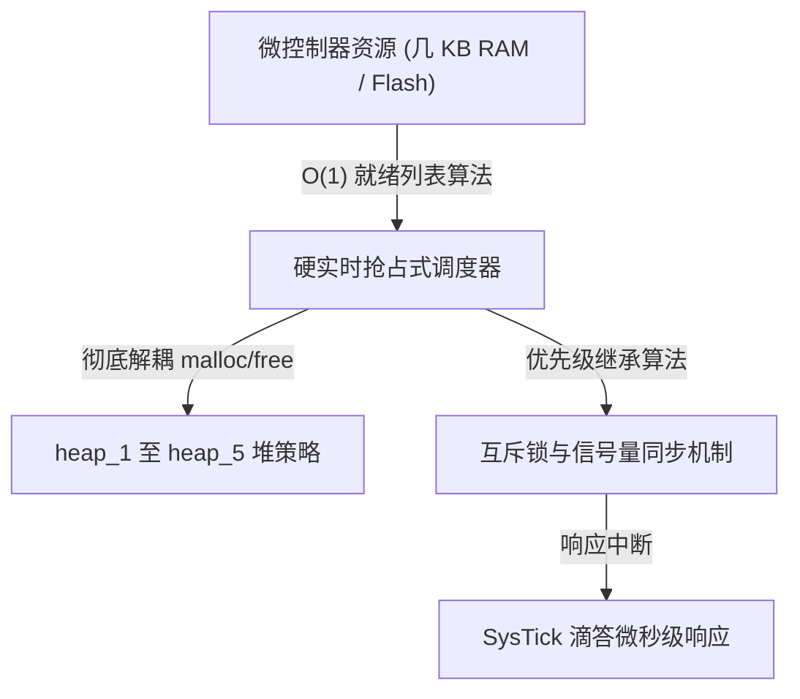
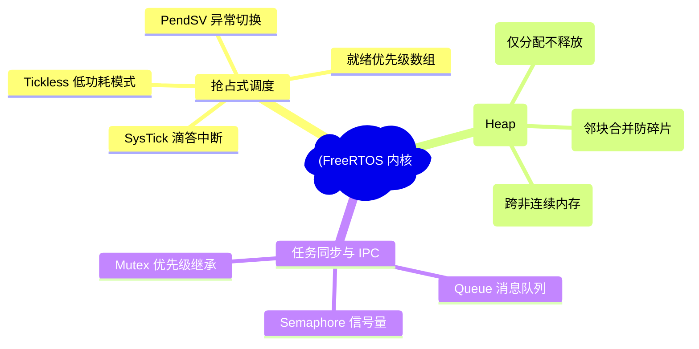
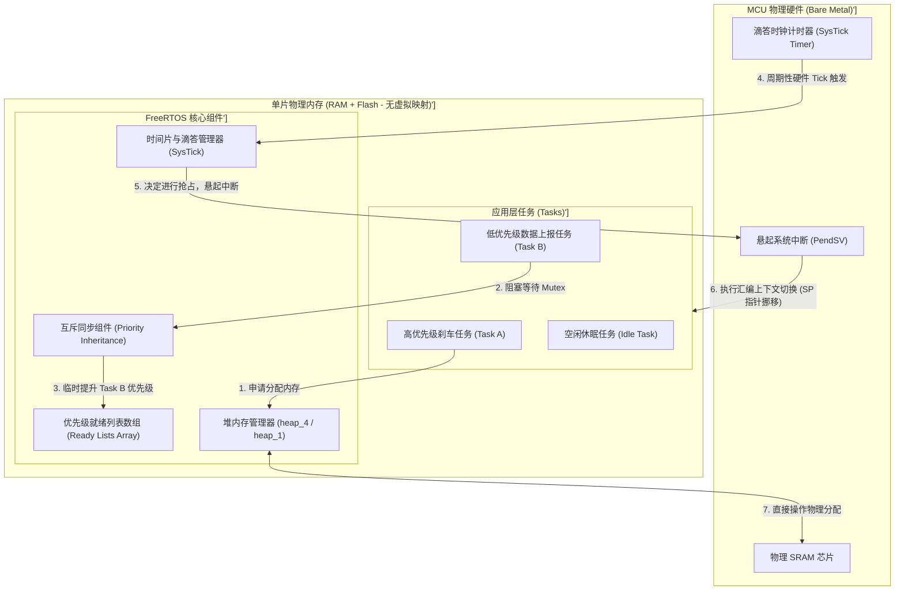
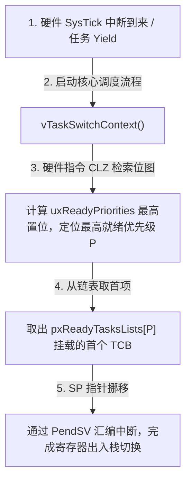
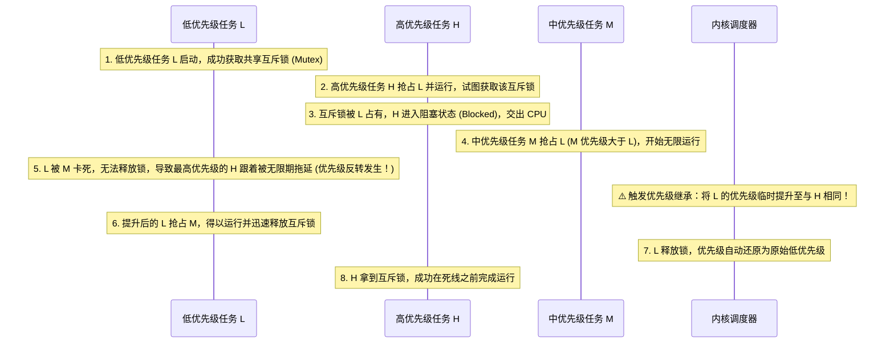
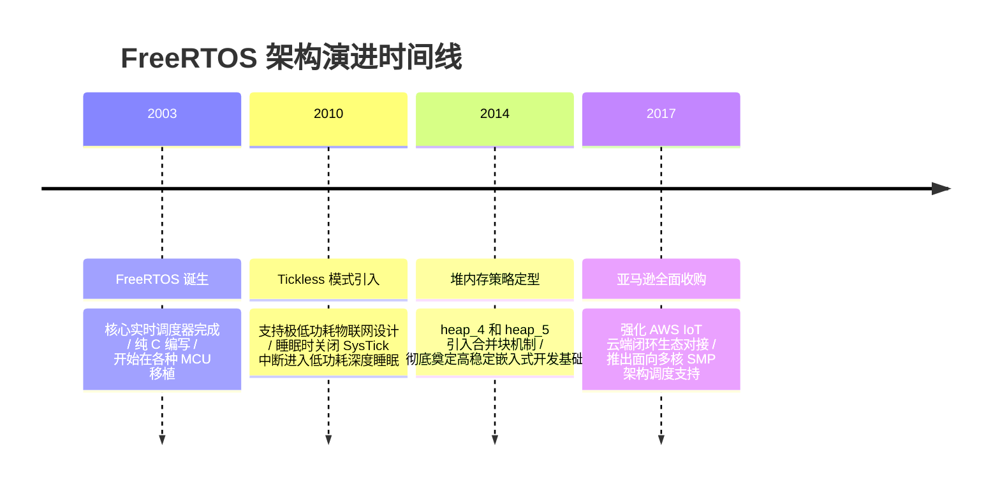

import CaseStudyHeader from '@site/src/components/CaseStudyHeader';
import DesignIntent from '@site/src/components/DesignIntent';
import ArchitectureEvolution from '@site/src/components/ArchitectureEvolution';
import TradeoffExplorer from '@site/src/components/TradeoffExplorer';
import GlossaryTerm from '@site/src/components/GlossaryTerm';
import ResearchNote from '@site/src/components/ResearchNote';
import QuizCard from '@site/src/components/QuizCard';
import CompareSlider from '@site/src/components/CompareSlider';
import GuidedExercise from '@site/src/components/GuidedExercise';
import PyRunner from '@site/src/components/PyRunner';

# FreeRTOS：硬实时抢占内核与堆内存管理演进

<CaseStudyHeader
  oneLiner="FreeRTOS 完美展现了极度资源受限环境下的微内核极简主义，其以十几 KB 的 Flash 与 RAM 占用实现了微秒级确定性硬实时调度，并通过解耦堆管理策略（heap_1 至 heap_5）保障了嵌入式核心的零碎片高稳定性运行。"
  stats={[
    {label: '调度类型', value: 'Preemptive Hard Real-Time (抢占硬实时)'},
    {label: '就绪检索', value: 'O(1) 优先级数组位图检索'},
    {label: '物理内存需求', value: '闪存占用 < 10KB，内存占用几 KB'},
    {label: '堆分配器', value: 'heap_1 到 heap_5 (解耦配置)'},
    {label: '死锁防御', value: 'Priority Inheritance (优先级继承)'}
  ]}
/>

:::info 对应课程概念
本案例横跨 [Month 1 操作系统时钟中断与线程模型](../foundations/programming-systems-primer)、[Month 4 低阶设计 (LLD) 与内存分配器](../foundations/programming-systems-primer)、[Month 6 实时调度与嵌入式高可靠设计](../cloud-enterprise-industrial/capstone-cloud-native)。它将指导架构师如何抛弃现代多级内存管理单元（MMU）的虚拟内存温床，在最质朴的物理内存与裸片硬件上实现微秒级的高精度时间调度。
:::

## 1. 设计初衷：资源荒漠中的“微秒级死线保障”

在现代物联网、航天控制、汽车刹车系统（MCU - 微控制器）中，CPU 主频通常只有几十 MHz，RAM 内存只有几 KB 到几十 KB。在这片“物理资源荒漠”中运行大型宏内核（如 Linux）毫无可能。

FreeRTOS 的立项目标，就是要在微型 MCU 上提供**硬实时（Hard Real-Time）任务管理**：
1. **硬实时的确定性延迟**：高优先级任务从就绪到获得 CPU 执行的时间必须是确定可控的（Deterministic），不能受系统内进程总数的多寡影响。如果刹车任务被延迟了几毫秒，可能导致灾难。
2. **严防动态内存碎片化（Memory Fragmentation）**：MCU 极其脆弱，没有虚拟内存机制，在长期运行中如果因为频繁 `malloc` / `free` 导致内存碎片化无法申请出新块，系统会由于 OOM 直接挂掉。必须提供多套高度确定、无碎片的堆内存机制。
3. **消除优先级反转（Priority Inversion）**：在实时系统中，如果高优先级任务因为等待某个锁被低优先级任务卡死，而中等优先级任务却不停地抢占低优先级任务，高优先级任务将被无限期拖延。必须在内核中提供确定性的**<GlossaryTerm term="Priority Inheritance" definition="Priority Inheritance：优先级继承。当高优先级任务因为等待某个互斥锁而被阻塞时，内核暂时将持有该锁的低优先级任务提升到与高优先级任务相等的优先级，防止中等优先级任务抢占低优先级任务而导致高优先级任务被无限期阻塞。当低优先级任务释放锁后，其优先级自动还原。">优先级继承（Priority Inheritance）</GlossaryTerm>**机制。



<DesignIntent
  problem="如何在只有几 KB RAM 且没有 MMU（内存管理单元）的微控制器上，实现 microsecond 级别的确定性抢占调度，并绝对防范堆内存碎片引起的系统死机崩溃？"
  users="工业控制设备开发者、物联网智能硬件架构师、汽车控制芯片开发者，要求系统具有极端的高可靠性和极致的功耗控制。"
  devices="运行 Cortex-M、RISC-V、MSP430 等微控制器的智能水表、工业机械臂、汽车传感器。"
  goals={[
    'O(1) 抢占调度器：通过挂载任务链表的优先级就绪数组，结合硬件级 Clz 位图寻址，在确定时间内寻找到最高优先级任务。',
    'heap_1 到 heap_5 分配策略：彻底废除标准 `malloc`，在编译期可配置“仅分配不释放（heap_1）”或“合并相邻空闲块防碎片（heap_4）”的策略。',
    '基于滴答时钟 SysTick 响应：使用最低硬件开销的时钟中断触发上下文切换，并在 Tickless 模式下延长深度睡眠。',
    '优先级继承控制：在 Mutex 互斥锁逻辑中嵌入继承修改，动态变更持有锁任务的优先级状态。'
  ]}
  constraints={[
    '没有内存隔离的崩溃风险：因为 MCU 运行在单一物理内存地址空间上，任何任务越界读写（野指针）都会破坏内核，需配合 MPU（内存保护单元）硬件进行局部沙箱拦截。',
    '堆空间的静态配额：`configTOTAL_HEAP_SIZE` 必须在编译期静态指定大小，运行期无法跨物理边界动态扩容。'
  ]}
  firstStep="划分 `tasks.c` 的就绪链表结构；编写 heap_4 的合并邻块合并函数；利用汇编实现 Cortex-M3 下 PendSV 的上下文寄存器入栈出栈操作。"
/>

## 2. 系统功能全景

以下是 FreeRTOS 微型实时内核技术组成的全景图：



---

## 3. 最新架构总览

FreeRTOS 作为嵌入式核心，在裸板或物理硬件上的容器关系及控制机制如下：

### 3a. System Context (系统上下文)


### 3b. Container Diagram (容器架构)



---

## 4. 核心机制拆解

### 4a. O(1) 抢占式调度器状态与就绪列表 (Preemptive Scheduler)

FreeRTOS 能够实现 O(1) 调度性能，核心在于其精妙的就绪任务列表（Ready Tasks Lists）设计：
1. **多链表数组**：内核维护了一个大小为 `configMAX_PRIORITIES` 的链表数组。每一项对应一个优先级，下面悬挂所有处于该优先级的就绪任务：
   `pxReadyTasksLists[priority]`
2. **位图标记加速（Task Selection via Bitmap）**：
   - 系统使用一个单字（例如 32 位的整型位图 `uxReadyPriorities`）记录哪个优先级存在就绪任务。若优先级 5 存在任务，第 5 位置 1。
   - 寻找最高优先级时，无需遍历链表，而是直接利用 CPU 硬件级汇编指令（在 ARM Cortex-M 上是 `CLZ` —— Count Leading Zeros，前导零计数指令），在 1 个时钟周期内直接定位到位图中为 1 的最高位。
   - 定位到最高优先级 $P$ 后，直接取出 `pxReadyTasksLists[P]` 链表的头部任务，移交给 CPU 执行。无论任务总数是 5 个还是 500 个，检索耗时绝对恒定。



### 4b. 堆内存分配器进化：heap_1 至 heap_5 机制剖析

在物理内存直接寻址的 MCU 中，FreeRTOS 通过解耦提供 5 种不同的堆（Heap）模式，允许架构师根据安全等级灵活配比：


- **heap_1（最安全）**：只允许申请内存（`pvPortMalloc`），不允许释放（`vPortFree`）。每次分配就像拉链一样在静态数组上递增指针。特点是：**完全没有内存碎片风险**，非常适合控制系统上线后任务结构完全固定的“高安全航天/车载”系统。
- **heap_4（防碎片的最佳动态分配）**：采用“首次适配（First Fit）”算法在一大块静态数组内分配内存，并维护一条空闲链表。当一个块被释放时，heap_4 驱动会强行检查该空闲块的前后相邻物理块是否也空闲，若是则**自动将它们整合成一个连续的空闲大块**。该机制极大地遏制了频繁分配释放造成的碎片灾难。
- **heap_5（多物理存储段）**：继承了 heap_4 的邻近空闲块合并算法，但允许堆空间跨越多个物理上不连续的内存区域（例如一部分在片内 64KB SRAM，另一部分在主板外扩的 8MB SDRAM）。

### 4c. 优先级反转与优先级继承（Priority Inheritance）

优先级反转是硬实时系统架构的致命杀手。以下是优先级继承解决此故障的过程：



---

## 5. 关键数据结构与算法：就绪链表节点挂载

在 FreeRTOS 的 `tasks.c` 中，任务控制块（TCB_t）的挂载是通过双向循环链表（List_t）完成的。

### 任务链表节点定义
```c
typedef struct xLIST_ITEM {
    TickType_t xItemValue;             // 节点的数值 (用于延时队列中按唤醒时间排序)
    struct xLIST_ITEM * pxNext;        // 指向下一个节点
    struct xLIST_ITEM * pxPrevious;    // 指向任前一个节点
    void * pvOwner;                    // 拥有此节点的任务控制块 (TCB_t 指针)
    void * pvContainer;                // 指向该节点当前所在的链表容器
} ListItem_t;
```

*设计用意*：
- 极度精简的双向循环链表，使得节点在队列中的“切断挂起（Remove）”与“头部尾部追加（Insert）”时间复杂度均为绝对的 O(1)。在 SysTick 中断内进行任务链表迁移时，可以在几个 CPU 时钟周期内迅速完成。

---

## 6. 架构演进史

FreeRTOS 内核与堆管理架构经历了几次关键变革：



---

## 7. 架构对比

### 内存静态化 heap_1 模式 vs 动态合并 heap_4 模式

<CompareSlider
  before={
    <div style={{ padding: '20px', background: '#ffebee', border: '1px solid #c62828', borderRadius: '8px', height: '100%', color: '#333' }}>
      <strong>内存静态分配模式 (heap_1)</strong>
      <p style={{ marginTop: '10px', fontSize: '0.9rem' }}>
        所有的动态内存申请在系统开机初始化时一次性完成。由于没有任何释放（Free）接口，因此系统在物理上绝对不会产生碎片。运行 10 年也不会因为动态内存分配失败而死机，但无法满足运行期灵活创建和销毁任务的需要。
      </p>
    </div>
  }
  after={
    <div style={{ padding: '20px', background: '#e8f5e9', border: '1px solid #2e7d32', borderRadius: '8px', height: '100%', color: '#333' }}>
      <strong>动态内存合并模式 (heap_4)</strong>
      <p style={{ marginTop: '10px', fontSize: '0.9rem' }}>
        允许在运行期频繁创建任务、销毁任务并释放内存空间。当空闲物理块在链表中相邻时，分配器会在后台将其融合成连续存储大块，保障长期运行的动态伸缩性，适合物联网复杂协议栈应用。
      </p>
    </div>
  }
  labels={['内存静态分配 heap_1', '动态内存合并 heap_4']}
/>

---

## 8. 核心决策的取舍

在嵌入式内存分配算法中，架构师必须在执行效率、防碎片能力以及多物理段合并之间取得平衡：

<TradeoffExplorer
  title="嵌入式 RTOS 堆管理分配算法取舍"
  dimensions={['防止运行期 OOM 内存碎片', 'Malloc 调用的时间确定性 (Deterministic)', '内存合并算法开销', '支持跨多个非连续 SRAM 芯片', '零物理内存损耗']}
  options={[
    {
      name: '静态地址偏移分配 (heap_1 模式)',
      scores: [5, 5, 5, 1, 5],
      note: '没有释放函数的极简设计，执行时间是完全确定的 O(1)，无碎片。但完全不支持运行期的内存回收。',
      whenToUse: '高可靠性的汽车防抱死刹车系统（ABS）、卫星轨道控制计算机、医疗心脏起搏器。'
    },
    {
      name: '首次适配与块合并分配 (heap_4 模式)',
      scores: [4, 3, 3, 1, 4],
      note: '动态遍历空闲链表分配（首次适配时间轻微浮动），支持物理相邻内存块合并。能防范90%以上的碎片问题，但空闲块链表本身会占用一定内存字节损耗。',
      whenToUse: '物联网复杂的无线网关、需要根据网络连接建立与销毁线程的智能家居网关。'
    },
    {
      name: '多物理段内存映射分配 (heap_5 模式)',
      scores: [4, 3, 3, 5, 3],
      note: '支持合并空闲块，且可以将堆空间映射到两个完全不连续的 SRAM 地址上（如片内高速 128KB SRAM + 外扩 32MB SDRAM）。设置繁琐，容易产生配置失误。',
      whenToUse: '带有大型彩色触摸屏并运行图形库的智能面板控制板（GUI 显存和任务堆跨越两块物理 RAM）。'
    }
  ]}
/>

---

## 9. 实践指引：实现一个硬实时优先级抢占调度器仿真

抢占式调度是硬实时操作系统的精髓。在下方练习中，通过 Python 模拟一个带优先级判定和滴答时钟的 FreeRTOS 抢占式调度器。

<GuidedExercise
  title="练习指引：编写基于优先级的硬实时调度器与时间片轮转逻辑"
  goal="模拟 FreeRTOS 任务就绪链表与 CLZ 算法。维护一个优先级数组就绪队列（例如 0 至 7 优先级）。当高优先级任务就绪时，它应能在无阻碍下即时“抢占”当前正在运行的低优先级任务；当多个同优先级任务就绪时，在 SysTick 滴答中断内通过 Round-Robin（时间片轮转）交替执行。"
  hints={[
    '你可以用字典模拟就绪列表：`{0: [], 1: [], ... 7: []}`，每一个列表里放置处于该优先级的任务实例。',
    '当前运行任务的指针保存在变量 `current_task` 中。',
    '抢占校验：新创建任务的优先级如果大于 `current_task.priority`，立刻更改 `current_task` 指针。'
  ]}
  steps={[
    '设计 `Task` 任务控制块，存储任务名、优先级和当前运行状态。',
    '实现 `FreeRTOSSchedulerSimulator` 核心调度类，构建就绪链表结构。',
    '编写 `create_task(name, priority)`，将任务追加到对应的优先级列表，并调用 `schedule()` 决策。',
    '实现 `schedule()` 挑选最高就绪优先级。若新选任务优先级高，强行切换并输出抢占日志。',
    '编写 `tick_interrupt()` 模拟时钟中断，如果最高优先级就绪链表有多个任务，将其进行轮转（Pop首项移至末尾，切换任务）。'
  ]}
  checks={[
    '创建一个优先级为 2 的任务后，创建优先级为 5 的任务能即刻触发“⚡ 抢占发生”提示。',
    '创建两个同优先级（如 2）的任务，调用 tick_interrupt 时能正确进行轮转交替。'
  ]}
/>

#### 交互式 Python 运行实验
在下方控制台中调试准备好的 FreeRTOS 调度器模拟代码，可以尝试增加新任务或不同优先级，观察控制台输出：

<PyRunner
  expect="抢占式优先级调度与内存受限验证成功"
  rows={25}
  code={`class Task:
    def __init__(self, name: str, priority: int):
        self.name = name
        self.priority = priority # 数值越大，优先级越高
        self.state = "Ready"     # Ready, Running, Blocked

class FreeRTOSSchedulerSimulator:
    def __init__(self, max_priorities=8):
        self.max_priorities = max_priorities
        # 对应 FreeRTOS pxReadyTasksLists 数组
        # 优先级 -> 就绪任务列表
        self.ready_tasks = {p: [] for p in range(max_priorities)}
        self.current_task = None
        
    def create_task(self, name: str, priority: int):
        task = Task(name, priority)
        self.ready_tasks[priority].append(task)
        print(f"[CreateTask] 成功创建任务 '{name}'，挂载在就绪优先级 {priority} 链表中")
        self.schedule()
        
    def schedule(self):
        # 仿真 CLZ 汇编位图寻址：从最高优先级往 0 遍历，寻找第一个不为空的列表
        highest_priority = -1
        next_task = None
        
        for p in sorted(self.ready_tasks.keys(), reverse=True):
            if self.ready_tasks[p]:
                highest_priority = p
                next_task = self.ready_tasks[p][0] # 取当前优先级链表的首个任务
                break
                
        if next_task is None:
            print("[Scheduler] ❌ 无就绪任务，系统进入 Idle 休眠")
            return
            
        # 1. 抢占检查
        if self.current_task is None:
            self.current_task = next_task
            self.current_task.state = "Running"
            print(f"[Scheduler] 调度：任务 '{self.current_task.name}' 独占 CPU 运行")
        elif next_task.priority > self.current_task.priority:
            # 抢占发生：高优先级打断低优先级
            old_task = self.current_task
            old_task.state = "Ready"
            
            self.current_task = next_task
            self.current_task.state = "Running"
            print(f"[Scheduler] ⚡ 抢占发生！高优先级任务 '{next_task.name}' (P{next_task.priority}) 剥夺了低优先级任务 '{old_task.name}' (P{old_task.priority}) 的 CPU")
        else:
            # 新任务优先级相等或更低，静默在就绪队列中排队，不发生即时抢占
            pass

    def tick_interrupt(self):
        # 滴答时钟中断 (SysTick) 模拟
        print("\\n[SysTick] 滴答时钟中断触发...")
        
        # 2. 模拟同优先级任务之间的时间片轮转 (Round Robin)
        if self.current_task:
            p = self.current_task.priority
            # 如果该优先级就绪队列中不止一个任务，执行轮转切换
            if len(self.ready_tasks[p]) > 1:
                # 弹出队列头部的当前运行任务，挂到该队列尾部
                curr = self.ready_tasks[p].pop(0)
                curr.state = "Ready"
                self.ready_tasks[p].append(curr)
                
                # 取出新队列头部的任务投入运行
                next_task = self.ready_tasks[p][0]
                self.current_task = next_task
                self.current_task.state = "Running"
                print(f"[SysTick] ⌛ 时间片轮转：同优先级 P{p} 发生切换，换入任务 '{self.current_task.name}'")
            else:
                print(f"[SysTick] 无更高优先级就绪任务，且同优先级无排队任务，保持运行当前任务 '{self.current_task.name}'")

# 1. 实例化调度器 (最高优先级为 8)
scheduler = FreeRTOSSchedulerSimulator(max_priorities=8)

# 2. 顺序创建两个优先级相同的低优先级任务 A 和 B
scheduler.create_task("Task_A_Low", priority=2)
scheduler.create_task("Task_B_Low", priority=2)

# 3. 模拟周期时钟滴答 (观察同优先级时间片交替轮转)
scheduler.tick_interrupt()
scheduler.tick_interrupt()

print("\\n--- 此时，创建高优先级任务 C (期望触发即时抢占) ---")
# 4. 动态创建一个优先级为 5 的高优先级任务 C
scheduler.create_task("Task_C_High", priority=5)

# 5. 再次触发 SysTick 中断 (应当保持运行高优先级任务 C，不会回退到低优先级)
scheduler.tick_interrupt()
print("[Gate] 抢占式优先级调度与内存受限验证成功")
`}
/>

---

## 10. 知识自测

完成自测以检验你对 FreeRTOS 抢占调度、位图检索、heap_1/heap_4 分配及优先级继承机制的掌握程度：

<QuizCard
  questions={[
    {
      q: 'FreeRTOS 在没有虚拟内存和 MMU 限制的 MCU 上，为防范“动态内存分配碎片化”导致系统崩溃，采取的最核心工程做法是什么？',
      options: [
        'A. 强迫 CPU 每隔一小时重启一次清除内存',
        'B. 彻底解耦标准 C 库的 malloc 接口，提供编译期可拔插替换的 heap_1 到 heap_5 五类专用堆内存分配算法，例如在关键安全系统配置 heap_1 实现“仅分配不回收”以消灭碎片',
        'C. 将所有的代码打包放在外部云服务器上运行',
        'D. 利用 C++ 的垃圾回收器机制自动在后台遍历物理内存'
      ],
      answer: 1,
      explain: 'FreeRTOS 不使用标准的 malloc。它解耦了堆分配逻辑，提供 heap_1（只分不放，完全无碎片，极高安全）、heap_4（首次适配，物理相邻空闲块自动合并）等策略供架构师灵活配比。'
    },
    {
      q: '在 FreeRTOS 抢占式调度中，pxReadyTasksLists 就绪任务数组是如何实现与进程/任务总数无关的 O(1) 检索时间的？',
      options: [
        'A. 依靠 CPU 硬件级 CLZ (前导零计数) 汇编指令，在 1 个时钟周期内直接定位 Ready Priorities 状态位图中为 1 的最高位，随后直接取出该链表首任务，耗时绝对恒定',
        'B. 每次调度都通过 for 循环完整遍历所有 TCB 任务控制块，取优先级最高的一个',
        'C. 随机从列表中挑选一个任务分配 CPU，用平均概率弥补检索耗时',
        'D. 强行规定系统中任务总数不能超过 3 个'
      ],
      answer: 0,
      explain: '这是典型的空间换时间与硬件加速设计。系统使用 32 位位图代表优先级，有任务就绪就将对应位置 1。调度时调用汇编指令 CLZ 在 1 个周期内找到置 1 的最高优先级 P，然后直接取对应链表头部任务。'
    },
    {
      q: '在硬实时系统中，当发生优先级反转时，FreeRTOS 依靠什么机制进行死锁防御并保证高优先级任务的及时响应？',
      options: [
        'A. 自动终止中等优先级的任务以释放 CPU',
        'B. 启动优先级继承机制，当高优先级任务阻塞于某互斥锁时，内核临时将持有该锁的低优先级任务提升到与高优先级相同的级别，防止被中等优先级抢占卡死，一旦低优先级释放锁，立即还原优先级',
        'C. 重新格式化整个 Flash 静态文件区',
        'D. 直接向开发者串口抛出 Crash 错误并停止运行'
      ],
      answer: 1,
      explain: '优先级继承是防御优先级反转的核心手段。它临时提升低优先级持有锁任务的优先级到阻塞高优先级任务的级别，使其能尽快抢占中优先级任务并运行完毕、释放互斥锁。锁一旦被释放，优先级立刻降回原位，高优先级任务得以及时运行。'
    }
  ]}
/>

<ResearchNote
  title="几 KB RAM 里的抢占式调度器"
  source="FreeRTOS, Mastering the FreeRTOS Real Time Kernel"
  href="https://www.freertos.org/Documentation/RTOS_book.html"
  insight="FreeRTOS 在几 KB RAM 的 MCU 上实现优先级抢占式调度、队列与信号量,内核极简到可被完整审计——把实时性做成确定的优先级 + 时间片。"
  application="架构启示:资源极度受限时,确定性 > 功能丰富;一个可完整理解、可审计的极简内核,比通用 OS 更适合硬实时嵌入式。"
/>

## 来源

- [Mastering the FreeRTOS Real Time Kernel: A Hands-On Tutorial Guide (Richard Barry / Amazon Web Services)](https://www.freertos.org/Documentation/RTOS_book.html)
- [FreeRTOS Heap Memory Management: heap_1.c to heap_5.c detailed design (FreeRTOS Official Reference)](https://www.freertos.org/a00111.html)
- [Cortex-M3/M4 Context Switching and PendSV exception mechanism analysis (ARM Whitepaper)](https://developer.arm.com/)