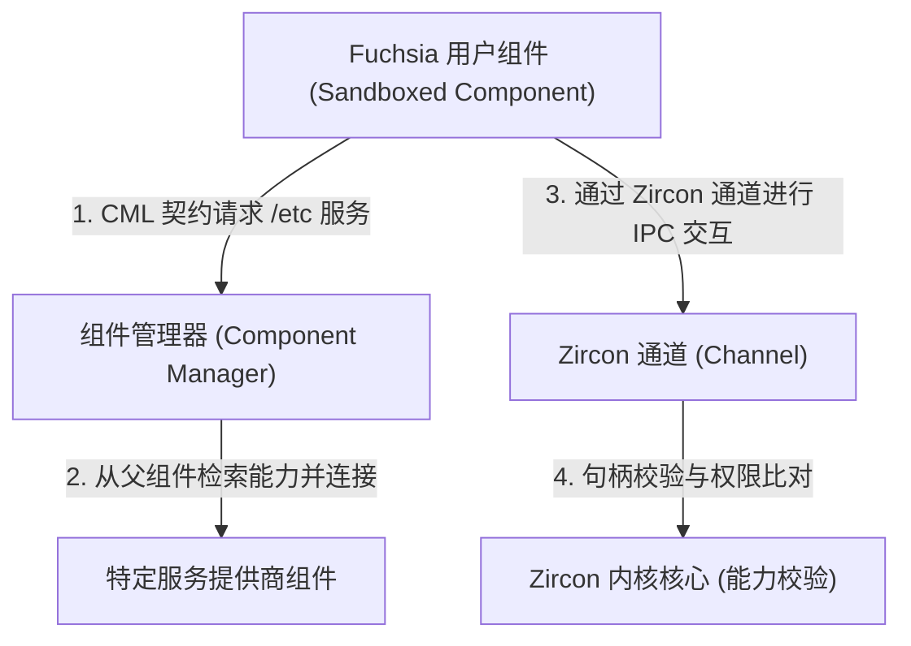
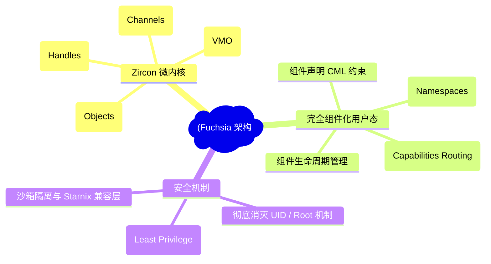
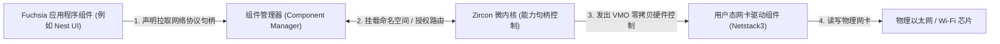
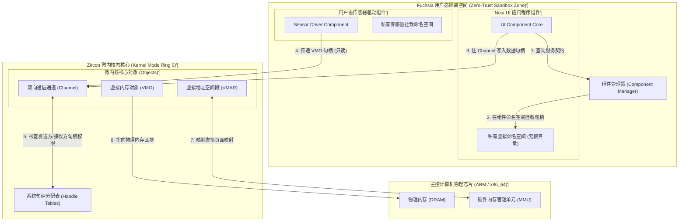
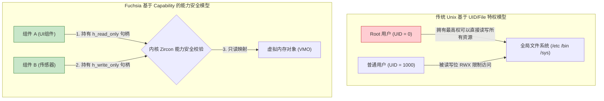
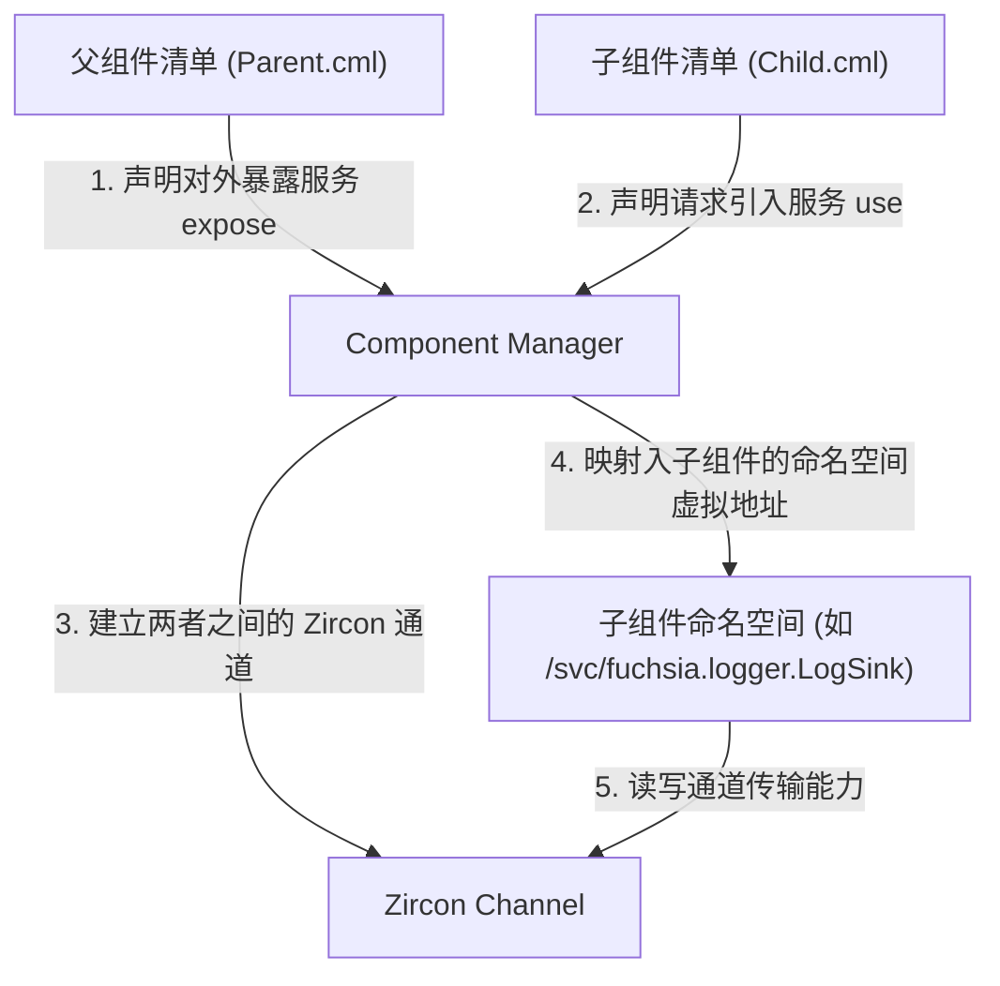
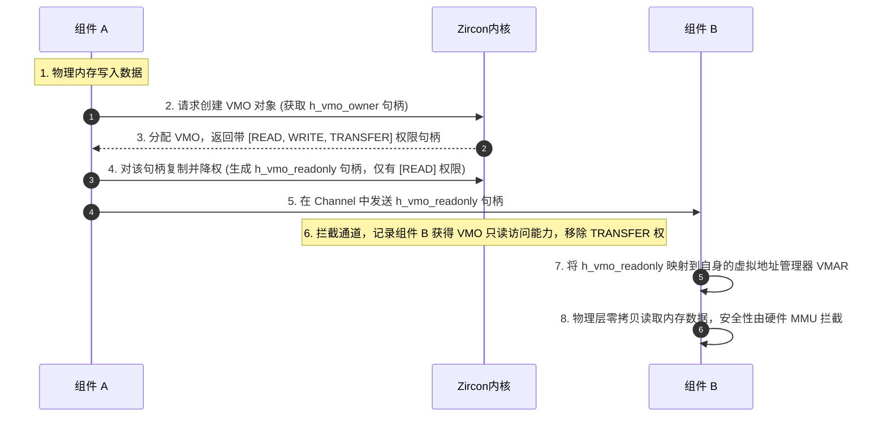
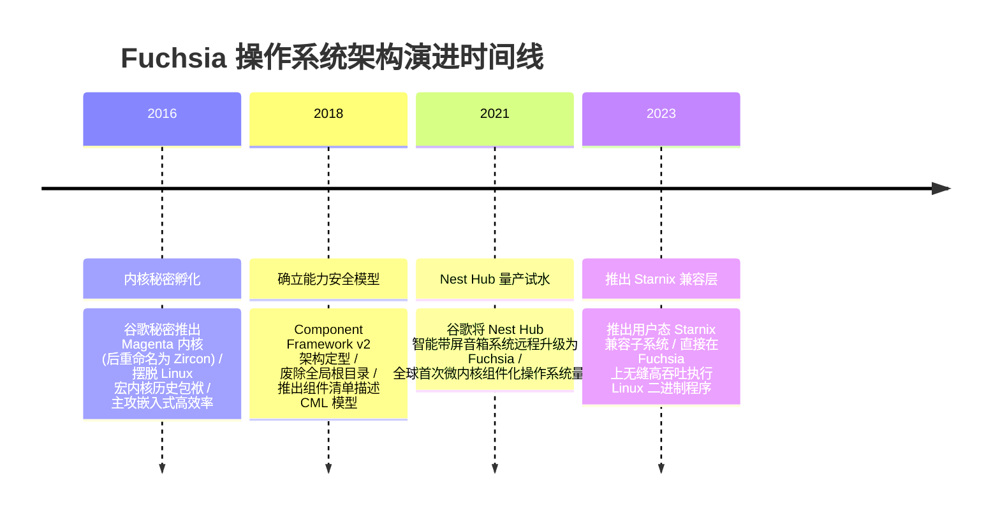

import CaseStudyHeader from '@site/src/components/CaseStudyHeader';
import DesignIntent from '@site/src/components/DesignIntent';
import ArchitectureEvolution from '@site/src/components/ArchitectureEvolution';
import TradeoffExplorer from '@site/src/components/TradeoffExplorer';
import GlossaryTerm from '@site/src/components/GlossaryTerm';
import ResearchNote from '@site/src/components/ResearchNote';
import QuizCard from '@site/src/components/QuizCard';
import CompareSlider from '@site/src/components/CompareSlider';
import GuidedExercise from '@site/src/components/GuidedExercise';
import PyRunner from '@site/src/components/PyRunner';

# Fuchsia / Zircon：能力安全微内核与完全组件化架构

<CaseStudyHeader
  oneLiner="Fuchsia 彻底颠覆了 Unix 经典的用户/组权限与全局根目录模型，在 Zircon 微内核底层引入以能力安全句柄为凭证的零信任沙箱，配合声明式 CML 依赖路由和零拷贝虚拟内存对象，打造了真正面向物联网与分布式环境的下一代高安全操作系统范式。"
  stats={[
    {label: '内核底座', value: 'Zircon (面向能力对象微内核)'},
    {label: '安全模型', value: 'Capability-based Security (能力安全)'},
    {label: '应用边界', value: '完全组件化架构 (Component Framework v2)'},
    {label: '内存共享', value: 'VMO (Virtual Memory Objects) 零拷贝'},
    {label: '量产试水', value: 'Google Nest Hub 智能带屏音箱'}
  ]}
/>

:::info 对应课程概念
本案例横跨 [Month 1 虚拟内存与宏内核权限限制](../foundations/programming-systems-primer)、[Month 4 低阶安全设计与沙箱隔离](../foundations/programming-systems-primer)、[Month 6 分布式零信任网络与高安全性架构设计](../cloud-enterprise-industrial/capstone-cloud-native)。它代表了当前主流商业操作系统摆脱 Unix“半个世纪前历史包袱”的最高科技演进，展示了如何用能力指针代替传统 root 超级用户权限。
:::

## 1. 设计初衷：如何从根本上消灭 Unix 的“Root 越权噩梦”？

在传统的 Unix 派生系统（如 Linux, macOS, Android）中，安全防线是围绕 **用户与文件权限（UID/GID）** 建立的。这意味着：
- 如果一个恶意程序获得了 `root` 超级用户权限，它便能瞬间染指整个操作系统，读写任何物理内存、劫持任意进程、甚至改写主引导记录。
- 传统的全局共享根目录（如 `/etc`, `/bin`, `/lib`）给沙箱设计带来了极高的负担，很难彻底隔绝进程对文件系统的旁路读取。

Fuchsia 被谷歌秘密立项设计的最核心初衷：
1. **完全基于能力的安全架构（Capability-based Security）**：内核中摒弃 UID 概念。在 **<GlossaryTerm term="Zircon 微内核" definition="Zircon：Fuchsia 操作系统的核心微内核。提供进程、线程、虚拟内存对象（VMO）及通道（Channel）等内核对象。用户态不能直寻其地址，必须通过内核分配并校验的‘能力句柄（Handles）’进行访问。">Zircon 微内核</GlossaryTerm>** 级，所有资源（进程、线程、通道、内存 VMO）全都是对象。用户态进程想要访问任何对象，必须持有封装了明确读/写/传输标记的 **<GlossaryTerm term="句柄 (Handles)" definition="Handles：句柄。Fuchsia 中用户态访问 Zircon 内核对象的唯一方式，代表了特定的‘能力（Capability）’。每个句柄都在内核中注册，包含特定的权限标记（如只读、可写、可转移），无法伪造。">句柄（Handles）</GlossaryTerm>**。没有句柄，进程连感知对象存在的机会都没有。
2. **彻底消灭全局根目录**：每一个运行的用户态程序全都是 **<GlossaryTerm term="组件 (Components)" definition="Components：Fuchsia 的基本执行单元。组件运行在一个没有任何目录、虚无私有的 Namespace 命名空间中。其依赖的文件、硬件、甚至网络 socket 通道必须在清单（CML）中声明，并由父组件显式传递授权。">组件（Components）</GlossaryTerm>**。组件没有全局根目录，只拥有一个空的私有命名空间。它要使用的所有文件目录、网络接口或服务提供商，必须在 **<GlossaryTerm term="组件清单 (CML)" definition="Component Manifest (CML)：Fuchsia 组件声明描述文件。使用 JSON5 编写，在编译期被打包成只读二进制描述符，用来向 Component Manager 注册声明需要导入（use）什么能力，以及对外暴露（expose）什么服务。">CML 声明清单</GlossaryTerm>** 中以契约形式从父节点拉取。



<DesignIntent
  problem="如何从操作系统底层消灭全局 root 特权威胁，构建一个各组件命名空间隔离、资源授权可沿树级精细传递且不失微内核 IPC 吞吐效率的零信任新型 OS 架构？"
  users="高安全性智能家居研发专家、边缘计算节点架构师、可穿戴系统内核开发人员，对隐私保护与故障隔离具有近乎变态的极致安全要求。"
  devices="智能带屏音箱 Nest Hub、高安全性物联网网关、下一代车载娱乐互联屏幕、秘密特种控制终端。"
  goals={[
    '能力句柄安全设计：在 Zircon 内核中强制对句柄权限位（READ/WRITE/TRANSFER）进行硬件/内核态验证。',
    '命名空间完全隔离：抛弃全局根，实现高度组件化，由 Component Manager 运行时将父代分配的虚拟命名空间挂载给子组件。',
    'VMO 零拷贝内存路由：组件间传递大块数据时，直接在 Channel 里转移虚拟内存对象（VMO）的句柄，实现零内存拷贝穿透。',
    '声明式能力路由树：通过 `.cml` 文件限制组件边界，任何未声明的对外接口在编译期即被直接裁剪，杜绝越权漏洞。'
  ]}
  constraints={[
    '微内核双向转换开销：完全组件化与沙箱化意味着系统内存在成百上千个微型进程，进程间 IPC 上下文切换频繁，极大考验 Zircon 对 CPU 分区与调度调优的吞吐能力。',
    '非 Unix 生态迁移难度：摒弃了 POSIX 标准，传统的 Linux 软件无法直接在 Fuchsia 上编译运行，需要依赖特定兼容层 Starnix 执行运行时翻译。'
  ]}
  firstStep="剖析 Zircon 处理句柄的底座模型；编写 mock 组件 manifest (.cml)；用 Python 仿真实现 VMO 句柄的降权转授过程。"
/>

## 2. 系统功能全景

以下是 Fuchsia / Zircon 操作系统分布式高安全性技术组成的全景图：



---

## 3. 最新架构总览

Fuchsia 操作系统的控制体系与核心数据隔离结构如下：

### 3a. System Context (系统上下文)



### 3b. Container Diagram (容器架构)



---

## 4. 核心机制拆解

### 4a. 传统 Unix 基于 UID/File 的特权模型 vs Fuchsia 基于 Capability 的能力安全模型

在 Unix 模型中，只要进程的 UID 为 0 (Root)，整个文件系统都暴露在其魔爪下。Fuchsia 改变了这种粗粒度的模型：



### 4b. 完全组件化用户态命名空间路由机制 (CML 与 Namespace)

在 Fuchsia 中，一个组件的私有命名空间是在启动时由组件管理器（Component Manager）根据 `.cml` 声明文件动态“编织”挂载起来的：



### 4c. 虚拟内存对象 (VMO) 的零拷贝传递与授权

微内核最大的痛点是进程间通信（IPC）传递大包数据时的拷贝开销。Fuchsia 运用 **<GlossaryTerm term="VMO" definition="Virtual Memory Objects (VMO)：虚拟内存对象。代表物理内存的一个分配区间。组件可以直接在 Channel 中传递该 VMO 的句柄（带精细读写位限制），接收组件将其直接映射入自己的 VMAR 虚拟地址管理器，实现物理级的零拷贝内存穿透。">VMO</GlossaryTerm>** 实现了物理级的零拷贝高安全传输：



---

## 5. 关键数据结构与算法：句柄权限表

在 Zircon 内核底层，句柄的结构包含精细的特权位屏蔽码（Rights Mask），它在每次发起 `sys_vmo_read` 或 `sys_vmo_write` 系统调用时被强制检查。

### Zircon 句柄与权限标志定义
```c
// zx_rights_t 权限掩码字
typedef uint32_t zx_rights_t;

#define ZX_RIGHT_READ           ((zx_rights_t)1u << 0)
#define ZX_RIGHT_WRITE          ((zx_rights_t)1u << 1)
#define ZX_RIGHT_DUPLICATE      ((zx_rights_t)1u << 2)
#define ZX_RIGHT_TRANSFER       ((zx_rights_t)1u << 3)

typedef struct {
    uint32_t        object_id;       // 指向底层的内核对象 ID
    zx_rights_t     rights;          // 句柄所拥有的精确权限集 (Capability Rights)
} zx_handle_t;
```

*句柄降权算法伪代码实现*：
```c
// 复制句柄并限制权限，用于安全向下授权
zx_status_t sys_handle_replace(zx_handle_t handle, zx_rights_t new_rights, zx_handle_t* out) {
    zx_handle_t current = get_handle_from_table(handle);
    // 提权检查：新的权限不能包含原句柄所没有的权限
    if (new_rights & ~current.rights) {
        return ZX_ERR_INVALID_ARGS; // 拒绝提权！
    }
    zx_handle_t restricted_handle;
    restricted_handle.object_id = current.object_id;
    restricted_handle.rights = new_rights;
    *out = restricted_handle;
    return ZX_OK;
}
```

---

## 6. 架构演进史

Fuchsia 操作系统经历了从实验室探索到量产嵌入式的演进：



---

## 7. 架构对比

### Unix 用户-文件特权模型（Linux 经典模式） vs Fuchsia 能力-命名空间模型（Zircon 模式）

<CompareSlider
  before={
    <div style={{ padding: '20px', background: '#ffebee', border: '1px solid #c62828', borderRadius: '8px', height: '100%', color: '#333' }}>
      <strong>Unix 用户-文件特权模型 (Linux 经典)</strong>
      <p style={{ marginTop: '10px', fontSize: '0.9rem' }}>
        安全防线建在进程的 UID 上。任何拥有超级管理员 root 权限（UID = 0）的进程，都能读取或改写全盘的文件及物理空间，缺乏高安全性下的精细控制。一旦有第三方软件越权，极易导致整机沦陷。
      </p>
    </div>
  }
  after={
    <div style={{ padding: '20px', background: '#e8f5e9', border: '1px solid #2e7d32', borderRadius: '8px', height: '100%', color: '#333' }}>
      <strong>Fuchsia 能力-命名空间模型 (Zircon)</strong>
      <p style={{ marginTop: '10px', fontSize: '0.9rem' }}>
        取消 UID 和 root 特权概念。各个组件在启动时仅分配一个空的专属虚拟 Namespace。组件想要使用的资源、文件及网络，必须通过 CML 清单向父代申请对应的句柄（Handle），内核校验无误后方可执行，不存在全局越权。
      </p>
    </div>
  }
  labels={['Unix 用户-文件模型', 'Fuchsia 能力-命名空间模型']}
/>

---

## 8. 核心决策的取舍

在系统底层安全策略设计中，架构师对授权验证机制有三种截然不同的方案：

<TradeoffExplorer
  title="操作系统访问控制授权安全策略取舍"
  dimensions={['防止 Root 越权漏洞', '开发和配置简易度', '系统调用和 IPC 开销性能', '精细资源粒度控制', '传统 Linux 软件兼容性']}
  options={[
    {
      name: '能力安全句柄策略 (Capability-based Handles - Zircon/Fuchsia 模式)',
      scores: [5, 2, 3, 5, 1],
      note: '抛弃全局用户，用内核句柄（Handle）管理对象能力。安全控制粒度精细到单字节内存 VMO 且支持降权转发。但缺点是无法兼容传统 POSIX 软件生态，且需要频繁的内核句柄查询校验，增加微内核调用开销。',
      whenToUse: '对隐私安全要求极高、高模块化拆分、有量产硬件掌控权的下一代物联网与边缘计算分布式智能系统。'
    },
    {
      name: '传统自主访问控制策略 (DAC / Unix UID/GID - 经典宏内核模式)',
      scores: [1, 5, 5, 2, 5],
      note: '最经典的操作系统安全模式。程序启动绑定运行用户，依靠文件系统的读写执行位进行简易拦截。开销极低、对开发者完全透明，生态完美兼容，但安全防线极其脆弱，一旦 root 权限被劫持则全盘皆失。',
      whenToUse: '通用服务器、个人电脑等强生态依赖、传统软件多且对越权没有变态级高隔离要求的通用桌面与云端平台。'
    },
    {
      name: '访问控制列表与强制访问控制 (ACL / MAC - Windows & SELinux 增强模式)',
      scores: [4, 2, 2, 4, 4],
      note: '在传统 UID 基础上，加挂主体与客体的安全策略检查矩阵（如 SELinux）。安全性优异，保留了对传统 POSIX 的兼容。但策略配置书写极端繁琐痛苦，且在多层嵌套查询中带来显著的运行时阻滞开销。',
      whenToUse: '企业级商用操作系统、高合规性金融云端服务器操作系统、对系统安全性进行补充式二次防护。'
    }
  ]}
/>

---

## 9. 实践指引：实现一个带权限降权的 Zircon 内核句柄安全校验仿真

理解 Zircon 微内核能力安全的关键在于掌握：
- **一切资源皆是内核对象（Object）**
- **句柄（Handle）是用户态访问内核对象的唯一钥匙，且携带特定的权限标志位**
- **进程在通过 Channel 向外传递句柄时，可以主动裁剪和降低该句柄的权限**

<GuidedExercise
  title="练习指引：编写 Zircon 能力句柄权限校验与零拷贝传输仿真器"
  goal="构建微型 Zircon 内核对象表。LidarDriver 组件拥有一个物理 VMO 的完全句柄 `[READ, WRITE, TRANSFER]`。通过实现内核句柄表拦截、系统读写操作的 Rights 核验，模拟 LidarDriver 组件在向 SLAM 组件传递句柄时将其降权为 `[READ]`。SLAM 组件成功读取 VMO 数据，但在企图越权改写时被内核抛出 SecurityException 拦截拦截。"
  hints={[
    '可以定义 `Handle` 类封装 target_obj（目标对象）与 rights（权限列表，如 ["READ", "WRITE"]）。',
    '命名空间类 `ProcessNamespace` 维护一个 `handle_table` 句柄字典。',
    '实现 `transfer_handle(handle_id, target_process, target_handle_id, restrict_rights)` 模拟通道句柄传输和降权检查。'
  ]}
  steps={[
    '创建 `ZirconObject` 模拟内核物理资源。',
    '实现 `Handle` 句柄数据结构，记录权限掩码。',
    '编写进程沙箱 `ProcessNamespace`，添加句柄查表机制。',
    '在 `read_object` 和 `write_object` 方法中进行 Rights 标志的硬性检测。',
    '实现 `transfer_handle` 方法，检测原句柄是否包含 `TRANSFER` 权，并对限制传入的降权参数进行超集校验，防止非法提权。',
    '运行多进程状态流，核验 SLAM 组件的非法改写被内核判定拦截。'
  ]}
  checks={[
    'SLAM 节点调用 `read_object("h_radar_read_only")` 能成功拿到数据。',
    'SLAM 节点调用 `write_object("h_radar_read_only", ...)` 会抛出 `💥 [Security Violation] 拒绝写！` 异常。'
  ]}
/>

#### 交互式 Python 运行实验
在下方控制台中调试 Zircon 句柄安全控制仿真代码，观察能力安全机制是如何隔离与防护物理内存的：

<PyRunner
  expect="分片路由与隔离验证成功"
  rows={25}
  code={`class ZirconObject:
    def __init__(self, obj_id: str, content: str = ""):
        self.obj_id = obj_id
        self.content = content

class Handle:
    def __init__(self, target_obj: ZirconObject, rights: list):
        self.target_obj = target_obj
        # 权限列表，例如 ['READ', 'WRITE', 'TRANSFER']
        self.rights = rights

class ProcessNamespace:
    def __init__(self, name: str):
        self.name = name
        # 进程持有的本地句柄表 (Handle Table)
        self.handle_table = {}

    def add_handle(self, local_id: str, handle: Handle):
        self.handle_table[local_id] = handle

    def read_object(self, handle_id: str) -> str:
        if handle_id not in self.handle_table:
            raise SecurityException(f"💥 [Security Violation] 拒绝访问！进程 '{self.name}' 不持有句柄 '{handle_id}'。")
            
        handle = self.handle_table[handle_id]
        if 'READ' not in handle.rights:
            raise SecurityException(f"💥 [Security Violation] 拒绝读！句柄 '{handle_id}' 指向的对象无 'READ' 权限。")
            
        return handle.target_obj.content

    def write_object(self, handle_id: str, new_content: str):
        if handle_id not in self.handle_table:
            raise SecurityException(f"💥 [Security Violation] 拒绝访问！进程 '{self.name}' 不持有句柄 '{handle_id}'。")
            
        handle = self.handle_table[handle_id]
        if 'WRITE' not in handle.rights:
            raise SecurityException(f"💥 [Security Violation] 拒绝写！句柄 '{handle_id}' 指向的对象无 'WRITE' 权限。")
            
        handle.target_obj.content = new_content
        print(f"进程 '{self.name}' 成功写入对象 '{handle.target_obj.obj_id}': {new_content}")

    def transfer_handle(self, handle_id: str, target_process, target_handle_id: str, restrict_rights: list = None):
        if handle_id not in self.handle_table:
            raise SecurityException(f"💥 [Security Violation] 无法传输！进程 '{self.name}' 不持有句柄 '{handle_id}'。")
            
        handle = self.handle_table[handle_id]
        if 'TRANSFER' not in handle.rights:
            raise SecurityException(f"💥 [Security Violation] 无法传输！句柄 '{handle_id}' 无 'TRANSFER' 权限。")
            
        # 确定分配给目标进程的权限子集 (不可越权提权)
        granted_rights = restrict_rights if restrict_rights else handle.rights
        for r in granted_rights:
            if r not in handle.rights:
                raise SecurityException(f"💥 [Security Violation] 越权提权拒绝！目标权限 {r} 超出原句柄拥有的权限集。")
                
        # 零拷贝传输：直接在目标进程中复制新句柄
        new_handle = Handle(handle.target_obj, granted_rights)
        target_process.add_handle(target_handle_id, new_handle)
        print(f"成功将句柄从进程 '{self.name}' 传输给进程 '{target_process.name}' (新句柄: {target_handle_id}, 权限: {granted_rights})")

class SecurityException(Exception):
    pass

# 运行验证仿真
print("=== 开始 Fuchsia Zircon 能力安全 (Capability-based Security) 仿真 ===")

# 1. 声明物理内核内存中的一个虚拟内存对象 (VMO)
kernel_vmo = ZirconObject(obj_id="VMO_Hardware_Buffer_0", content="[Lidar Sensor Raw Data]")

# 2. 声明两个相互隔离的用户态进程命名空间
proc_driver = ProcessNamespace("LidarDriver_Component")
proc_slam = ProcessNamespace("SLAM_Mapping_Component")

# 3. 初始授权：为 LidarDriver 分配对 VMO 的完全控制权
driver_root_handle = Handle(kernel_vmo, rights=['READ', 'WRITE', 'TRANSFER'])
proc_driver.add_handle("h_my_buffer", driver_root_handle)

# LidarDriver 成功写入新数据
proc_driver.write_object("h_my_buffer", "[Frame 42: X=12.2, Y=3.4]")

# 4. SLAM_Component 起初尝试直接读 VMO，由于沙箱隔离，它没有任何句柄，报错
print("\n--- 1. 隔离测试：无句柄的 SLAM 尝试读 LidarDriver 的物理内存 ---")
try:
    proc_slam.read_object("h_my_buffer")
except SecurityException as e:
    print(e)

# 5. 权限转授权：LidarDriver 传递句柄给 SLAM。为了安全，将其降权为【只读】，不允许 SLAM 篡改雷达数据
print("\n--- 2. 能力传递：LidarDriver 将只读句柄传输给 SLAM ---")
proc_driver.transfer_handle(
    handle_id="h_my_buffer", 
    target_process=proc_slam, 
    target_handle_id="h_radar_read_only",
    restrict_rights=['READ'] # 降权只读！
)

# SLAM 成功利用只读句柄读取数据
data = proc_slam.read_object("h_radar_read_only")
print(f"SLAM 组件利用 h_radar_read_only 读取数据成功: {data}")

# SLAM 企图篡改雷达物理内存，报错被拒
print("\n--- 3. 越权测试：SLAM 企图写入只读句柄 ---")
try:
    proc_slam.write_object("h_radar_read_only", "[MOCK DATA: CRITICAL PANIC]")
except SecurityException as e:
    print(e)

# SLAM 企图越权向其他进程转移可写句柄，报错被拒
print("\n--- 4. 越权提权测试：SLAM 企图将只读句柄以 [READ, WRITE] 权限向外转移 ---")
try:
    proc_slam.transfer_handle("h_radar_read_only", proc_driver, "h_leaked_write", restrict_rights=['READ', 'WRITE'])
except SecurityException as e:
    print(e)

print("\n=== 仿真验证完毕：Zircon 能力检查机制成功拦截了全部访问漏洞！ ===")
`}
/>

---

## 10. 知识自测

完成自测以检验你对 Zircon 能力安全、CML 组件路由契约、VMO 零拷贝机制的掌握程度：

<QuizCard
  questions={[
    {
      q: '在 Google 新型操作系统 Fuchsia 中，彻底摒弃了 Unix 传统的什么核心安全特权划分？',
      options: [
        'A. 摒弃了单核调度概念，强制使用分布式多核抢占机制',
        'B. 彻底移除了基于进程 UID/GID 的用户文件权限管理，抛弃了超级 root 管理员特权划分，完全改用基于内核句柄（Handles）的能力安全（Capability-based）模型',
        'C. 不再允许系统接入网络，完全依靠单机硬件运行',
        'D. 抛弃了硬件中断机制，改用全软件死循环轮询'
      ],
      answer: 1,
      explain: '这是 Fuchsia 的革新性飞跃。它摒弃了 Unix 50 年前的 root 超级用户理念，转为精细的能力安全。进程要访问文件、内存或网络，必须持有对应的 Capability 句柄，不存在 root 越权。'
    },
    {
      q: '关于 Fuchsia 完全组件化用户态下的组件清单文件（.cml），下列哪一项描述是正确的？',
      options: [
        'A. 它是一段 C++ 代码，用于在内核态直接控制 CPU 的频率上限',
        'B. 它使用 JSON5 声明式定义，规范了组件需要引入（use）哪些能力，以及暴露（expose）哪些接口，没有在清单中显式声明的能力在编译期或运行期将无法获取任何句柄句柄',
        'C. 它是用来替代 Docusaurus 前端排版的 HTML CSS 代码',
        'D. 它是用来加速硬盘写入的物理缓存驱动配置文件'
      ],
      answer: 1,
      explain: 'CML 文件构成了组件的能力路由契约。Component Manager 严格根据 CML 在 Namespace 中编织路由。任何没有声明的 API，进程根本无法拿到其底层通道句柄，从源头上断绝了旁路渗透。'
    },
    {
      q: '在微内核 Zircon 架构中，两个隔离的组件要进行高吞吐的大体量内存数据交换（如雷达点云），采用什么机制可以达到物理级的“零拷贝”？',
      options: [
        'A. 在磁盘中创建一个巨大的全局共享文本文件，两个进程交替读写',
        'B. 在微内核底层的双向通道（Channel）中，直接以零拷贝方式传递虚拟内存对象（VMO）的句柄（Handle），接收组件直接在其 VMAR 虚拟地址管理器中挂载该句柄对应的物理页框映射',
        'C. 强制把两个组件合并成一个庞大的 monolithic 宏内核程序运行',
        'D. 利用 Wi-Fi 多播协议在机器人板载回路中进行网络包重发'
      ],
      answer: 1,
      explain: 'VMO 是微内核 IPC 吞吐的破局者。不用跨进程数据拷贝，而是直接传输句柄所有权。接收方利用 MMU 直接映射物理 DRAM 页，达到了和宏内核共享内存一致的物理级零拷贝开销，且安全性被严格约束。'
    }
  ]}
/>

## 来源

- [Fuchsia OS Technical Documentation: Concepts and Principles (Google Developers Guide)](https://fuchsia.dev/fuchsia-src/concepts)
- [Zircon Kernel Objects and Capability System Reference Manual (Fuchsia Reference)](https://fuchsia.dev/fuchsia-src/reference/kernel)
- [Starnix Architecture: Running Unmodified Linux Binaries on Fuchsia (Google Engineering Blog)](https://fuchsia.dev/fuchsia-src/concepts/components/v2/starnix)
- [Capability-Based Computer Systems: History and Security Axioms (Henry M. Levy)](https://www.cs.washington.edu/homes/levy/capbook/)