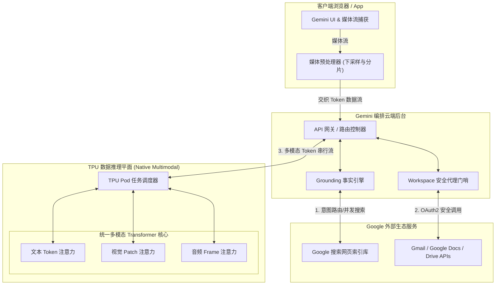
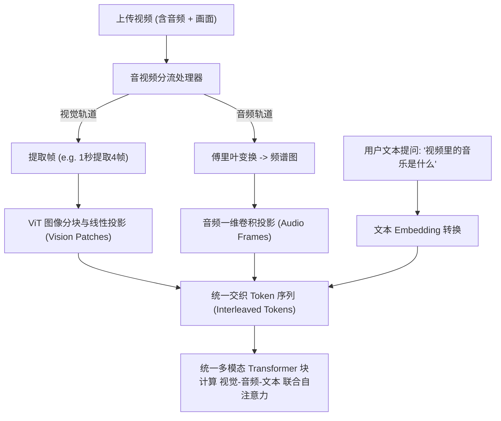
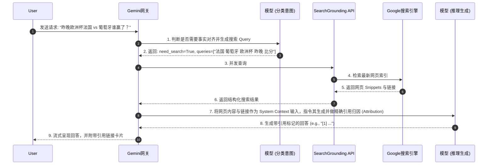
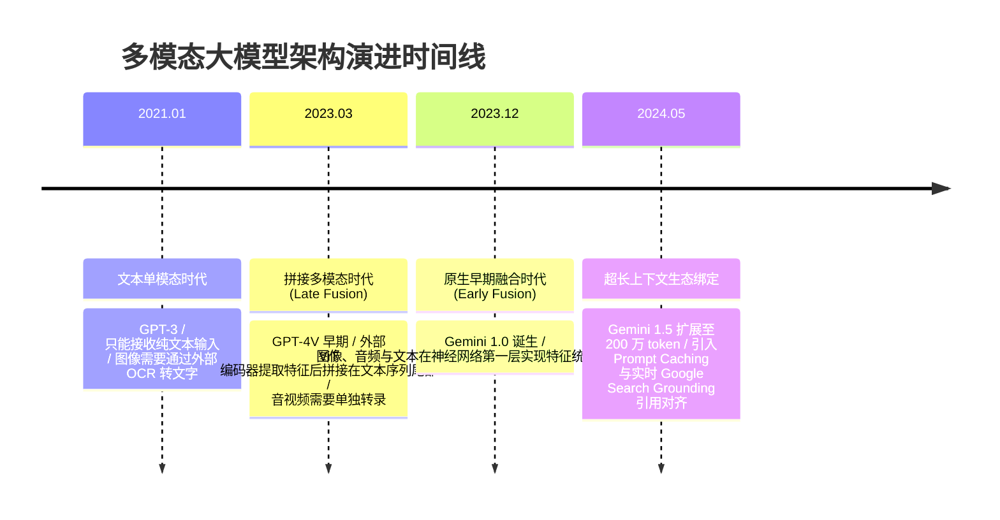

import CaseStudyHeader from '@site/src/components/CaseStudyHeader';
import DesignIntent from '@site/src/components/DesignIntent';
import ArchitectureEvolution from '@site/src/components/ArchitectureEvolution';
import TradeoffExplorer from '@site/src/components/TradeoffExplorer';
import GlossaryTerm from '@site/src/components/GlossaryTerm';
import ResearchNote from '@site/src/components/ResearchNote';
import QuizCard from '@site/src/components/QuizCard';
import CompareSlider from '@site/src/components/CompareSlider';
import GuidedExercise from '@site/src/components/GuidedExercise';

# Gemini：原生多模态与生态集成架构

<CaseStudyHeader
  oneLiner="Gemini 在底层设计上摒弃了传统的『多模型拼接』路线，实现了文本、图像、音频与视频的『原生早期融合（Early Fusion）』，并通过与 Google 实时搜索（Search Grounding）与 Workspace 企业数据生态的安全代理绑定，构建了高可靠的事实对齐与工具调用边界。"
  stats={[
    {label: '发布时间', value: '2024 年'},
    {label: '原生输入支持', value: '文本, 图像, 音频, 视频, 3D点云'},
    {label: '实时事实检索', value: 'Google Search Grounding API'},
    {label: '企业安全网关', value: 'Workspace OAuth2 / DLP 审查门哨'},
    {label: '上下文扩展', value: '100 万 ~ 200 万+ Tokens'}
  ]}
/>

:::info 对应课程概念
本案例横跨 [Month 8 RAG 检索与对齐](../rag/why-rag)、[Month 11 企业级 AI 平台与数据治理](../foundations/programming-systems-primer)、[Month 5 核心组件 API 网关](../core-components/api-gateway)。它深入解答了多模态输入在最底层是如何与 Attention 矩阵融合的，以及如何在大模型中无缝引入传统搜索的实时事实。
:::

## 1. 设计初衷：从“文字拼图”到“双目并视的原生感知”

早期的多模态大模型（例如 GPT-4 早期版本或开源拼接模型）大多采用 <GlossaryTerm term="Late Fusion" definition="后期融合：将文本模型与独立的图像编码器（如 CLIP）、音频编码器（如 Whisper）拼装在一起。将图像转化为嵌入向量后拼接在文本序列的尾部输入给大模型。各模态并没有在最底层统一特征，缺乏跨模态深度交互。">后期融合（Late Fusion）</GlossaryTerm>。这就像把摄像机和录音机用胶带绑在一起——AI 在计算注意力时，文本节点和音视频节点在特征层面上是割裂的。

Gemini 的设计核心在于**原生早期融合（Early Fusion）**：它在第一天训练时，就将文本、图像像素、音频频谱等转换为**统一格式的 Token 序列**送入一个统一的 Transformer。同时，为了避免大模型的“幻觉”并能处理实时新闻，Gemini 必须原生集成 Google 搜索的事实对齐（Grounding）架构，并以极度安全的权限控制访问用户的 Workspace（Gmail/Docs）私有数据。

<DesignIntent
  problem="在最底层的神经网络中无损融合多模态（文/图/音/视频）的感受野，并在应用层实现毫秒级的实时 Google 搜索验证与高隐私的企业 Workspace 数据读取。"
  users="全球开发者、企业客户、学术研究者，要求 AI 能够看懂长视频演示、听懂人声细节，并基于当下的实时事件或个人专属文档做无偏见、有出处的事实解答。"
  devices="支持流式音视频上传的客户端应用（如 Gemini Web/App）与云端高并发张量并行（Tensor Parallel）TPU 推理集群。"
  goals={[
    '原生跨模态交织理解：能直接在注意力层计算视频像素、音频频率与文本之间的联合关联，例如“指出视频中 2 分 15 秒发生碰撞的物体的英文名称”。',
    '实时搜索 Grounding 对齐：AI 回答实时事件时，自动触发并生成搜索 Query，抓取实时网页，在回答中嵌入可跳转的准确来源引用。',
    'Workspace 安全域隔离：通过用户 OAuth2 授权在内存中静默查询 Gmail 邮件、Docs 文档，确保数据不泄露给其它多租户环境，且绝不用作公共模型训练。'
  ]}
  constraints={[
    '音视频数据量极其庞大：一秒视频包含数十个帧，会导致序列长度暴增数十万 tokens，Prefill 阶段的计算量与带宽成本呈指数级上升。',
    '搜索 Grounding 带来的延迟劣化：实时调用搜索引擎会引入额外的网络跳数和网页内容解析时间，必须将检索和模型流式生成流水线化（Pipelining）。',
    '企业数据主权壁垒：Workspace 的集成不能允许模型将数据持久化在中间推理节点，必须即用即毁。'
  ]}
  firstStep="设计多模态统一 Tokenizer（如把音频分割为 Spectrogram 块，视频分割为 Vision 块）；在 Transformer 内部使用统一的交叉注意力机制；构建 Grounding Gateway 桥接 Google Search Index，提供双向置信度（Attribution Score）打分。"
/>

## 2. 系统功能全景

以下是 Gemini 系统的原生多模态感知与 Google 生态集成的功能全景图：

```mermaid
mindmap
  root("(Gemini 架构"))
    原生早期融合 Early Fusion
      统一 Token 序列 (Multimodal Inputs)
      视觉编码器 (ViT) 像素分块
      音频分段 Spectrogram 转化
    实时搜索 Grounding
      Query 扩展与意图路由
      搜索引擎 API 并发检索
      双向事实归因与引用生成
    Workspace 企业生态
      OAuth2 用户权限门哨
      私有 RAG 检索 (Docs/Gmail)
      零持久化数据隐私审查
    长序列加速
      TPU Pod 集群与 Megatron-LM 并行
      Ring Attention 序列切分
```

---

## 3. 架构总览

Gemini 通过统一的多模态输入处理、Grounding 事实网关与 Workspace 安全网关与外界交互：

### 3a. 系统上下文图 (System Context)

```mermaid
graph LR
  User["用户 (User)"] -->|上传图文视频/提问| WebClient["Gemini Web / App Client"]
  WebClient -->|发起会话 (HTTPS)| GeminiEngine["Gemini 编排核心 (Orchestration Engine)"]
  GeminiEngine -->|实时搜索校验| SearchGrounding["Google Search Grounding Service"]
  GeminiEngine -->|OAuth2 授权获取文档| WorkspaceGateway["Workspace API Gateway (Gmail/Docs)"]
  GeminiEngine -->|推理生成| TPUCluster["TPU v5p 推理集群 (Native Multimodal Model)"]
```

### 3b. 容器架构图 (Container)



---

## 4. 核心机制拆解

### 4a. 原生早期融合与交织 Token (Early Fusion)

不同于“后期拼接”，Gemini 在神经网络的第一层就将不同模态的数据转化为相同的嵌入空间（Embedding Space）。
- 图像被分成一个个小的 **Patch**（通常是 16x16 像素），通过线性投影层（Linear Projection）转化为特征向量。
- 音频经过短时傅里叶变换转化为**频谱图（Spectrogram）**后，也通过一维卷积分段映射为特征向量。
- 视频则被视为**时间轴上的图像序列**，在时间轴和空间轴上进行联合下采样。

这些不同模态的嵌入向量与文本 Token 混合，按照其时间或空间顺序**交织排列**在一起，输入给统一的注意力机制（Attention Layer）：



### 4b. 搜索对齐事实与引用生成 (Google Search Grounding)

为了消除幻觉并保证时效性，Gemini 引入了 Grounding 引擎。当检测到用户的意图需要实时事实（例如“昨晚的欧洲杯比分是多少”）时，系统架构执行以下步骤：



### 4c. Workspace 私有安全集成网关 (OAuth2 Gates)

Gemini 与 Workspace（Gmail/Docs/Drive）的集成，绝非直接把用户的所有文件丢给模型。
为了符合严苛的企业级合规（如 SOC2、HIPAA）并保护数据隐私，系统设计了**零持久化企业安全网关**：

1. **动态 OAuth2 令牌交换**：用户在 Web UI 发起 `@Gmail 帮我查找昨天的机票邮件`，前端携带用户的 OAuth2 Token 发送至安全网关。
2. **联邦检索（Federated Retrieval）**：网关代理将用户提问转化为邮件查询指令，调用 Gmail API 获取最近 10 条邮件文本。模型节点在物理内存中读入邮件内容计算注意力，**绝不写入持久化存储介质**。
3. **隔离推理边界**：此过程在专用的临时租户网络分区（Isolated Tenant Partition）中运行。推理完成后，该线程占用的 KV Cache 和内存立即释放，数据**绝不用作公共模型的再次微调（Fine-tuning）数据**。

---

## 5. 架构演进史

多模态架构从“后期拼接”演进到今天的“原生大一统”：



---

## 6. 架构对比

### 拼接式多模态 (Late Fusion) vs 原生交织多模态 (Early Fusion)

<CompareSlider
  before={
    <div style={{ padding: '20px', background: '#ffebee', border: '1px solid #c62828', borderRadius: '8px', height: '100%', color: '#333' }}>
      <strong>拼接多模态 (后期融合)</strong>
      <p style={{ marginTop: '10px', fontSize: '0.9rem' }}>
        大模型本质上还是个纯文本模型。外挂一个独立的图像编码器，将图片提取为若干个向量直接插在文本最前面。在计算注意力时，由于底层没有对多模态进行联合训练，无法做到高精度的图文细粒度交叉关联（例如指出图片的具体某个像素区域对应的文本描述）。
      </p>
    </div>
  }
  after={
    <div style={{ padding: '20px', background: '#e8f5e9', border: '1px solid #2e7d32', borderRadius: '8px', height: '100%', color: '#333' }}>
      <strong>原生交织多模态 (早期融合)</strong>
      <p style={{ marginTop: '10px', fontSize: '0.9rem' }}>
        视频、音频和文本在输入端转化为统一维度的交织 Token 序列。Attention 算子可以直接计算“音频帧”与“视觉块”之间的关联，实现了跨模态的精细交叉对齐，支持对长视频中特定画面和同步人声的联合分析。
      </p>
    </div>
  }
  labels={['外挂拼接式', '原生早期融合']}
/>

---

## 7. 核心决策的取舍

在将大模型与实时搜索引擎、企业 Workspace API 绑定时，架构师必须在多个关键方向上做出妥协：

<TradeoffExplorer
  title="实时事实检索对齐 (Grounding) 方案取舍"
  dimensions={['事实准确性 (最新)', '响应延迟 (TTFT)', '调用API成本', '私有隐私保护', '系统架构复杂度']}
  options={[
    {
      name: '主动式 Google 实时搜索 Grounding',
      scores: [5, 2, 2, 3, 4],
      note: '能获取秒级的最新全球资讯，纠错效果好。但搜索引擎 API 存在显著网络延迟，且会引入外部 API 计费成本。',
      whenToUse: '个人助手、新闻解答、对时效性有绝对刚需的通用问答产品。'
    },
    {
      name: '离线定期更新向量库 RAG (企业本地知识库模式)',
      scores: [3, 4, 5, 5, 3],
      note: '所有数据存在本地，安全隐私性极佳，查询延迟低。但信息无法做到秒级同步，受限于向量检索召回的覆盖面。',
      whenToUse: '企业内部文档查询、研发代码检索、不希望任何敏感信息流向公网搜索引擎的闭环场景。'
    },
    {
      name: '不带 Grounding，纯靠模型参数记忆 (Pure Generation)',
      scores: [1, 5, 5, 5, 1],
      note: '首字响应极其迅速，无外部 API 调用延迟和费用。但极易发生幻觉，且对模型训练截止时间之后的任何事件完全无知。',
      whenToUse: '文学创作、代码生成辅助、逻辑推理等非事实敏感型场景。'
    }
  ]}
/>

---

## 8. 实践指引：实现一个简单的 Grounding 引用过滤器与事实校对器

在 Grounding 架构中，一个重要的动作是对比**大模型输出的事实断言**与**搜索引擎召回的 Snippet 事实**，生成精确的引用标记并计算可信度。

打开 `labs/month08/search_grounding/` 目录（或在下方练习中），实现一个基于文本匹配的事实引用生成器。

<GuidedExercise
  title="练习指引：编写一个 Search Grounding 引用与校对引擎"
  goal="编写一个 Python 函数，输入模型生成的草稿文本（Draft Text）与一组搜索结果片段（Search Snippets），自动在 Draft 文本中匹配事实源，插入 [1], [2] 引用标签，并计算回答的事实置信度（Factuality Score）。"
  hints={[
    '你可以使用简单的句子重叠度（如 BLEU 相似度或 Jaccard 相似系数）来计算 Draft 中的句子是否来源于某个 Snippet。',
    '当某句 Draft 的最大相似度超过 0.7 时，在该句句尾插入 `[编号]`，并将可信度标记为高。',
    '若整篇 Draft 中，有超过 30% 的核心断言无法在任何 Snippet 中找到依据，抛出 HalucinationWarning（幻觉警告）并调低整体 Factuality 分数。'
  ]}
  steps={[
    '编写 `generate_citations(draft: str, snippets: list[dict]) -> tuple[str, float]` 函数。',
    '利用分句算法将 Draft 拆分为单句列表。',
    '对每一单句，遍历 `snippets`，计算 Jaccard 相似度 `|intersection| / |union|`。',
    '若命中阈值，追加引用链接到输出文本的末尾，并在句尾插入标注。',
    '编写单元测试，模拟“法国昨晚击败了葡萄牙，比分为 2-1 [1]”的正确标注逻辑。'
  ]}
  checks={[
    '你的代码能正确处理 Draft 中包含多处不同来源事实的复合标注。',
    '如果搜索结果中包含完全矛盾的信息，你的校对器能识别出低 Factuality 分数，并标注“无法证实”。'
  ]}
/>

---

## 9. 知识自测

完成自测以检验你对原生多模态融合、Google 搜索对齐事实与 Workspace 安全代理机制的理解：

<QuizCard
  questions={[
    {
      q: '为什么说 Google Gemini 采用的“早期融合（Early Fusion）”多模态设计比传统“外挂拼接”多模态（Late Fusion）具有更高的联合推理智商？',
      options: [
        'A. 因为早期融合能在模型推理时绕过 Attention 计算，直接从原始图像的物理像素得出结论',
        'B. 因为在早期融合中，音视频和图像在输入端就被转化为与文本相同嵌入空间中的 Token 序列。在随后的所有自注意力层中，不同模态的 Token 可以平等地计算跨模态注意力，从而深度理解像素点、音频特征与文本语法之间的精细交互关联',
        'C. 因为早期融合能让大模型完全在宿主机 CPU 上运行，不需要昂贵的 GPU',
        'D. 因为后期融合只能支持纯英文的处理，而早期融合天生支持多种语言'
      ],
      answer: 1,
      explain: '在早期融合中，不同模态的特征在神经网络的第一层就被统一了。因此，底层的自注意力机制在计算时，可以清晰地识别出“图像左上角这块区域（视觉 Token）”与“这句提问（文本 Token）”以及“这声爆裂声（音频 Token）”在空间和时间轴上的强关联。而后期融合仅仅在最末端或最后一层强行把两个模型的特征向量拼接，跨模态的联合分析极其肤浅。'
    },
    {
      q: '在 Google Search Grounding（事实对齐）工作流中，如果系统检测到用户的提问“谁是当下最新的 Google CEO”需要进行 Grounding，下列哪个流程在架构上是正确的？',
      options: [
        'A. 直接将用户的提问作为 Prompt 发给模型，模型依靠自我记忆写出回答，再调用 Google 搜索该回答看是否正确，若错则让模型重写',
        'B. 网关先截获提问，自动生成针对搜索引擎的 Query，并发调用 Google 网页索引抓取实时结果，将检索出的网页 Snippets 作为可信 Context 拼接进 Prompt 后一同喂给大模型，要求模型仅基于此 Context 生成带引用出处的回答',
        'C. 强制在本地使用向量数据库检索以前存好的历史网页，绝对禁止向外发起任何 HTTP 搜索请求',
        'D. 将大模型整个权重的 10% 进行实时擦除并重新在线微调，使其记忆最新的互联网状态'
      ],
      answer: 1,
      explain: 'Search Grounding 是一种实时在线 RAG（检索增强生成）模式。它分为两个阶段：一是意图分类与检索，网关/轻量模型判断需搜索并生成精准的搜索 query，接着并发抓取最新网页片段；二是模型生成与归因，将搜索结果作为黄金事实（Ground Truth） Context 输入，限制模型的生成边界只能在此范围内，并在对应句子后生成可点击跳转的引用来源。'
    },
    {
      q: '在 Gemini 集成 Workspace（如分析用户的 Gmail 邮件）时，为了确保用户私密数据的安全与 SOC2 等安全合规，下列哪项设计策略是必须采取的？',
      options: [
        'A. 将用户的邮件长期缓存到模型服务器的公共硬盘上，以便下次快速读取',
        'B. 通过用户 OAuth2 显式授权进行联邦式临时调用，邮件数据仅在模型计算注意力时短暂存在于 GPU 物理内存中，推理结束立即物理擦除释放，且绝不用作任何公共模型的训练微调数据',
        'C. 强制要求用户把所有的邮件下载为 TXT 文件并手动上传到聊天框中',
        'D. 允许模型对该用户的所有邮件拥有完全的写入和删除权限，自动清理用户的收件箱'
      ],
      answer: 1,
      explain: '访问企业或用户的私有数据必须采取“零持久化、逻辑隔离、绝不训练”的底线原则。通过 OAuth2 机制动态拉取，并在模型内存中即用即毁，绝不将数据写入公用磁盘或数据库。更不能让用户的私密邮件特征随梯度更新被固定在公共模型参数中，这是 AI 数据安全治理（Month 11）的核心合规要求。'
    }
  ]}
/>

## 来源

- [Gemini 1.5: Unlocking multimodal understanding across millions of tokens of context](https://arxiv.org/abs/2403.05530)
- [Google Grounding with Google Search API developer guide](https://cloud.google.com/vertex-ai/docs/generative-ai/grounding/overview)
- [Enterprise Security and Compliance in Google Workspace with Vertex AI](https://workspace.google.com/security/)
- [FlashAttention-2: Faster Attention with Better Parallelism and Work Partitioning](https://arxiv.org/abs/2307.08691)