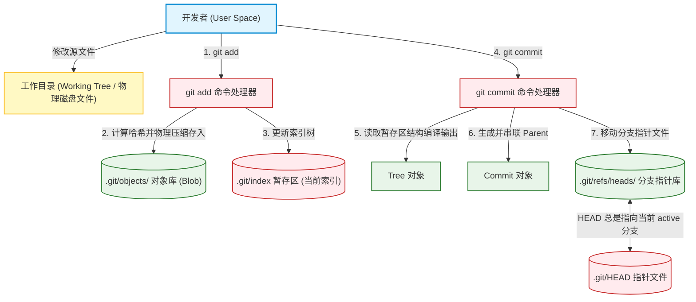
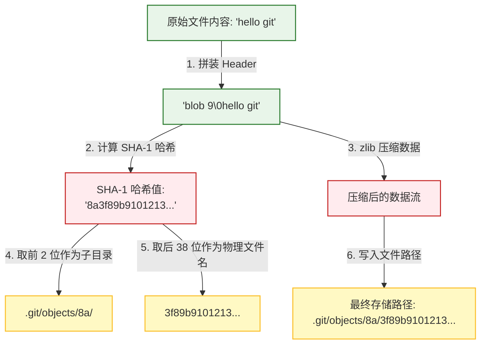
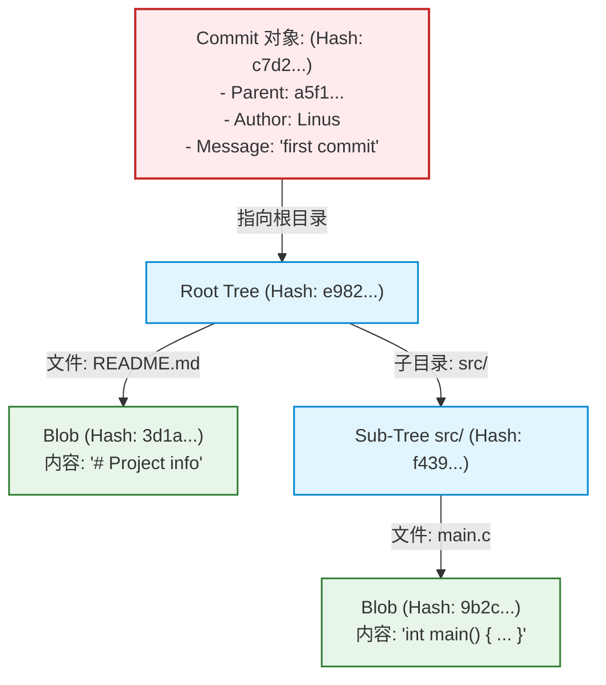
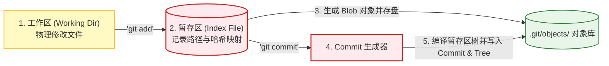
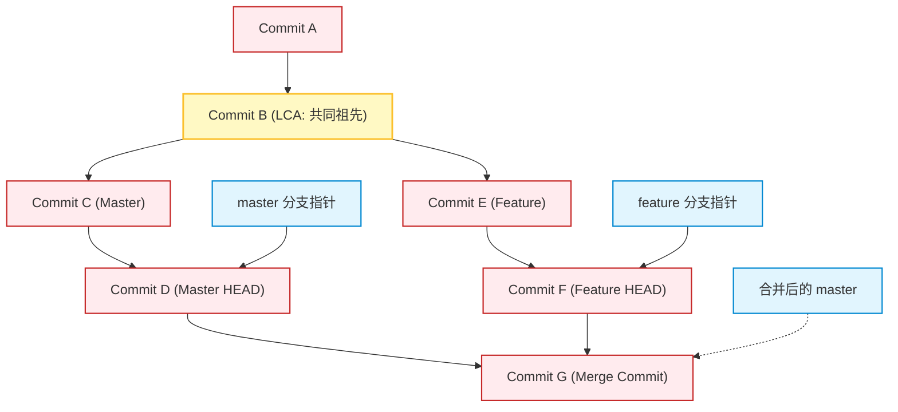
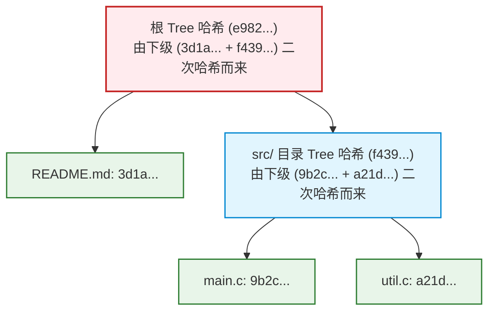

import CaseStudyHeader from '@site/src/components/CaseStudyHeader';
import DesignIntent from '@site/src/components/DesignIntent';
import EvolutionTimeline from '@site/src/components/EvolutionTimeline';
import CompareSlider from '@site/src/components/CompareSlider';
import TradeoffExplorer from '@site/src/components/TradeoffExplorer';
import GlossaryTerm from '@site/src/components/GlossaryTerm';
import ResearchNote from '@site/src/components/ResearchNote';
import GuidedExercise from '@site/src/components/GuidedExercise';
import QuizCard from '@site/src/components/QuizCard';
import MindMap from '@site/src/components/MindMap';
import PyRunner from '@site/src/components/PyRunner';

# Git：内容寻址分布式版本控制系统、DAG 提交图与零成本分支架构

<CaseStudyHeader
  oneLiner="Git 是全球事实上的分布式版本控制标准。它摒弃了传统版本控制系统（如 SVN）基于文件差异增量存储的陈旧设计，创造性地将版本历史构建在内容寻址对象库（Content-Addressable Object Database）之上。通过将文件快照（Blob）、目录树（Tree）、元数据提交（Commit）统一抽象为有向无环图（DAG）中的不可变节点，并配合默克尔树（Merkle Tree）数据校验，Git 达成了零成本分支创建与极速合并的性能巅峰。"
  stats={[
    {label: '定位与类别', value: '分布式版本控制系统 (DVCS)'},
    {label: '存储引擎', value: '内容寻址对象库 (Content-Addressable DB)'},
    {label: '版本组织结构', value: '有向无环图 (DAG) + SHA-1 哈希寻址'},
    {label: '一致性验证', value: '默克尔树 (Merkle Tree) 层次校验'},
    {label: '分支机制', value: '零成本分支 (纯文本指针引用)'},
    {label: '工作区管理', value: '三区模型 (工作区、暂存区/Index、版本库)'}
  ]}
/>

:::info 对应课程概念
本案例融合了以下课程核心概念：
*   **内容寻址与 SHA-1（Month 3 存储引擎）**：通过文件内容哈希进行物理寻址，天然去重并确保数据完整性。
*   **有向无环图（Month 1 数据结构）**：分支、Commit 历史链条在有向无环图（DAG）中的拓扑结构与 Lowest Common Ancestor (LCA) 查找。
*   **默克尔树（Month 5 分布式安全）**：多层哈希嵌套验证，实现在 O(1) 复杂度内对任意庞大目录树一致性变更的极速判定。
*   **快照式版本库（Month 3 文件系统）**：摒弃增量差分，以“快照”作为版本控制第一等公民的文件组织形式。
:::

---

## 1. 设计初衷：Linus Torvalds 对分布式代码协作的叛逆革命

2005 年以前，Linux 内核开发依赖专有的 BitKeeper 版本控制系统。当 BitKeeper 收回对开源社区的免费授权后，Linus Torvalds 决定亲自动手，在短短两周内用 C 语言写出了 Git 的原型：
1.  **打碎集中式中央服务器的锁链**：
    *   CVS、SVN 等传统集中式系统假设中央服务器是唯一的权威。开发者每一次提交、查看历史、创建分支都必须实时访问中央服务器，网络延迟和单点故障是致命伤。
    *   Linus 认为：**每个开发者的本地硬盘就是一台完整的版本库**。开发者应能离线执行一切操作：极速本地 Commit、秒级查看全量 Log、随意在本地创建分支并完成合并，最后仅在需要时通过 SSH 交换元数据。
2.  **“内容寻址”天然消灭数据重复**：
    *   SVN 记录的是“文件 A 在第 10 版修改了第 5 行”这样的“文件差异增量（Delta）”。重组历史时，系统需要沿增量链条逐层计算，速度极慢。
    *   Git 直接记录**文件快照**。如果文件内容完全一样，哪怕文件名改了、或者存在于不同目录，其哈希值依然相同。Git 只需保存一份物理 Blob 文件，通过哈希寻址天然去重，既快又省空间。
3.  **把分支（Branch）做成廉价的文本指针**：
    *   在 SVN 中创建分支意味着要在服务器端物理复制一份庞大的目录，开销巨大。
    *   而在 Git 中，一个分支仅仅是 `.git/refs/heads/` 目录下的一个 **41 字节文本文件**，里面只写着一个 SHA-1 提交哈希值。所谓的切换分支，只是把指向当前工作分支的 `HEAD` 指针重新指向该分支文件，时间复杂度为 $O(1)$。

<DesignIntent
  problem="如何设计一个无中央元数据服务器、支持完全离线提交、具备高抗篡改校验能力、并且分支创建与合并时间复杂度为 O(1) 的分布式版本控制引擎。"
  users="全球所有的软件研发人员、开源协作社区，尤其是需要并行开发成千上万个非线性 Feature 分支的复杂大型系统项目组。"
  devices="开发者的本地个人电脑（支持各大主流操作系统），利用标准文件系统存储元数据，通过极轻量的 Git-over-SSH/HTTP 协议进行对等推送同步。"
  goals={[
    '完全分布式自治：本地保留版本库的完整历史和全量 DAG 快照，99% 的版本操作（提交、日志、分支）均在本地磁盘以微秒级完成',
    '基于内容寻址的去重：将数据内容与文件名解耦，利用哈希冲突几乎为零的 SHA-1 计算文件指纹，相同内容物理上只存一份',
    '零成本分支切换：创建、删除分支的操作复杂度完全控制在 O(1) 级别，工作区切换仅需根据 DAG 树对比修改差异文件',
    '严密的加密校验：基于默克尔树层次嵌套哈希，整个项目的任意微小修改（即使是一个字节）都会引发根 Commit Hash 的雪崩式变化'
  ]}
  constraints={[
    '大文件处理噩梦：由于本地库克隆（Clone）需要复制全量历史，如果代码库中混入了大量百 MB 级的二进制文件（如视频、模型包），会导致所有协作者的本地克隆操作极其缓慢（可通过 Git LFS 解决）',
    'Rename（重命名）的启发式推断：Git 对象不存储文件改名这一元数据信息，而是由客户端在比对时通过启发式算法（对比文件相似度）动态推断是否发生了改名，这有时会导致复杂的合并冲突误判',
    '垃圾对象堆积：频繁的 rebase、commit --amend 会在本地产生大量脱离 DAG 链条的孤儿悬挂对象（Dangling Objects），必须依靠后台 gc 机制定期做垃圾回收和 Delta 压缩'
  ]}
  firstStep="创建包含 .git/objects、.git/refs、.git/index 核心目录的底层仓库；编写基于 zlib 的松散对象（Loose Objects）读写逻辑；实现 Commit/Tree/Blob 嵌套解析机制；实现 Merge Base LCA 算法。"
/>

---

## 2. 知识全景脑图

### 2a. 全景架构思维导图

```mermaid
mindmap
  root((Git 架构))
    三区工作模型
      工作区 Working Directory
      暂存区 Index (.git/index)
      版本库 Repository (.git/objects)
    内容寻址对象库
      Blob 对象 (纯文件内容)
      Tree 对象 (目录结构与权限)
      Commit 对象 (元数据与 Tree 指针)
      SHA-1 哈希标识符
    分支与合并机制
      HEAD 指针与分支文件
      有向无环图 (DAG) 拓扑
      Lowest Common Ancestor 查找
      三路合并 (3-Way Merge)
    默克尔树验证
      哈希层次嵌套
      目录变更 O(1) 极速校验
      数据防篡改链条
    存储打包优化
      松散对象 Loose Objects
      打包文件 Packfiles (.pack/.idx)
      Delta 差异压缩
      垃圾回收 git gc
```

### 2b. 交互脑图导航

<MindMap
  root={{
    label: 'Git 核心架构',
    children: [
      {
        label: '存储与寻址 (Storage)',
        children: [
          { label: '内容寻址与 SHA-1' },
          { label: '三区工作模型 (Staging)' },
          { label: 'zlib 对象压缩物理落地' }
        ]
      },
      {
        label: '三大对象模型 (DAG)',
        children: [
          { label: 'Blob (只存内容)' },
          { label: 'Tree (还原物理目录)' },
          { label: 'Commit (图的演进节点)' }
        ]
      },
      {
        label: '分支与演进 (Merge)',
        children: [
          { label: '零成本分支指针引用' },
          { label: '3-Way Merge 共同祖先' },
          { label: 'Merkle Tree 完整性校验' }
        ]
      }
    ]
  }}
/>

---

## 3. 系统架构总览 (C4 Model)

### 3a. System Context (系统上下文图)

```mermaid
graph TB
  classDef client fill:#e1f5fe,stroke:#0288d1,stroke-width:1.5px;
  classDef main fill:#e8f5e9,stroke:#2e7d32,stroke-width:2px;
  classDef third fill:#fff9c4,stroke:#fbc02d,stroke-width:1.5px;

  Developer["开发者 (Developer Local)"]:::client -->|使用 Git 命令操作| GitCLI["Git 客户端 (Local Repository)"]:::main
  
  GitCLI <-->|push/pull/fetch (SSH/HTTP)| RemoteRegistry["远程托管服务 (GitHub / GitLab / self-hosted)"]:::third
```

### 3b. Container Diagram (容器结构图)



---

## 4. 核心机制拆解

### 4a. 内容寻址存储 (Content-Addressable Storage) 与 zlib 压缩

Git 是一个地地道道的键值对（Key-Value）内容寻址数据库：
1.  **哈希键计算**：
    *   任意文件的内容，在存入 Git 前，系统都会在头部拼装一个固定格式的元数据头部：`"blob " + 文件字节数 + "\0"`。
    *   对这一段组合数据进行 **SHA-1** 加密计算，生成一个唯一的 40 位十六进制哈希字符串（例如：`8a3f89...`）。这个哈希值就是该内容在 Git 数据库中的**主键**。
2.  **物理存储落盘**：
    *   Git 将哈希值的前 2 位作为子目录名（例如：`.git/objects/8a/`），将后 38 位作为文件名（例如：`3f89...`）。这能有效避免单个目录下文件过多导致 Linux 文件系统性能暴跌。
    *   文件内容使用 **zlib 算法** 进行无损高压缩存储，保护本地硬盘空间。只要文件内容有半个字节发生变化，其 SHA-1 哈希值就会完全重组，生成完全不同的物理对象。



---

### 4b. Git 三大核心对象模型 (Blob, Tree, Commit)

在 Git 仓库底层，所有文件结构与版本变迁，全部是通过三类核心对象的相互勾连、形成 <GlossaryTerm term="有向无环图" definition="有向无环图（Directed Acyclic Graph, DAG）是指一个无环的有向图。在 Git 中，所有的 Commit 节点通过指向其 Parent Commit 哈希，串联起一条或多条单向的历史长河，没有闭环，支持并行分支与合并。">有向无环图（DAG）</GlossaryTerm> 来完美表达的：
1.  **Blob 对象**：
    *   仅存储文件的**纯内容（Data Snapshot）**。它**不存储文件名、目录路径、或文件权限**。因为相同的代码内容在不同文件夹下应该复用同一个 Blob，消灭冗余。
2.  **Tree 对象**：
    *   相当于文件系统中的**文件夹（Directory）**。它记录了当前文件夹下的所有子项（文件名、物理权限、子 Tree 对象的哈希值、或者对应 Blob 对象的哈希值）。
3.  **Commit 对象**：
    *   代表一个**历史版本节点**。它记录了本次提交的根 Tree 对象哈希（通过该哈希可还原整个项目的全部物理目录结构）、作者与提交者信息、提交时间戳、提交备注，以及**最重要的一个或多个 Parent Commit 哈希**。通过 Parent 指针，所有提交就串联成了一条清晰的 DAG 图。



---

### 4c. 暂存区 (Index) 与提交流管道机制

Git 独创的“暂存区”（Staging Area，物理体现为 `.git/index` 二进制文件）是一个经常被忽视的架构精髓。它作为工作区与版本库之间的缓冲中介：
1.  **准备快照**：
    *   当运行 `git add` 时，Git 扫描修改的文件，立刻把内容计算哈希并存入 `.git/objects/`（生成 Blob）。
    *   同时，把这个文件的路径、修改时间、文件权限和对应的 Blob 哈希写入到 `.git/index` 文件中。
2.  **写入 DAG**：
    *   当运行 `git commit` 时，Git **不需要扫描你的工作目录**。它只需要读取极小、高度有序的 `.git/index` 文件，快速将里面的文件路径树结构编译并保存为 Tree 对象，最后拼上 Commit 描述信息生成一个新的 Commit 写入 DAG 节点，整个提交过程瞬间完成，这也是 Git 速度碾压传统系统的关键原因。



---

### 4d. 零成本分支 (Zero-Cost Branch) 与三路合并 (3-Way Merge)

Git 的分支与合并极其优雅：
1.  **零成本指针**：
    *   在 Git 中，创建一个名为 `dev` 的分支，不需要拷贝任何文件。Git 仅仅是在 `.git/refs/heads/` 下创建一个名为 `dev` 的文本文件，里面写入当前分支最新提交的 40 位哈希值。切换分支（`checkout`）只是把 `.git/HEAD` 文件里的内容改写成 `ref: refs/heads/dev`，工作空间按 Tree 对象差异直接复写。
2.  **三路合并（3-Way Merge）**：
    *   当需要将 `feature` 分支合并回 `master` 时，如果分支之间有分叉，Git 并不进行逐个提交的差异比对。
    *   它首先在 Commit DAG 图上，通过拓扑排序和图搜索，寻找到这两个分支的 **LCA（Lowest Common Ancestor，最近共同祖先节点）**。
    *   接着，Git 拿 LCA 版本的快照、`master` 版本的快照和 `feature` 版本的快照进行三路对比（3-Way Comparison）：如果某行代码只在 `feature` 中改了而 `master` 没动，或者只在 `master` 中改了而 `feature` 没动，系统将自动合并；若双方在同一位置都做修改，则抛出冲突。



---

## 5. 关键数据结构与算法

### 5a. 默克尔树 (Merkle Tree) 目录结构完整性校验

Git 能够瞬间判断一个拥有数百万个文件的巨型仓库中哪些文件被修改了，这依赖于它的树对象天然构成了一个标准的 <GlossaryTerm term="默克尔树" definition="默克尔树（Merkle Tree）是一种哈希树。在 Git 中，Tree 对象的哈希值是由其子项（Blob 文件的哈希与子 Tree 文件夹的哈希）组合拼接后再次哈希得到的。这使得判断两个庞大文件夹是否存在差异，仅需比对两棵树的根哈希是否相同即可。">默克尔树 (Merkle Tree)</GlossaryTerm>：
*   **哈希自底向上雪崩**：
    *   底层的每个 Blob 包含文件内容哈希。
    *   上一层的 Tree 包含了所有子 Blob 和子 Tree 的哈希与文件名列表。这个 Tree 对象本身的 SHA-1，是由它**所有下级子项哈希拼接后二次哈希计算**得出的。
    *   以此类推，根 Commit 指向的根 Tree 哈希，代表了该项目当前版本的整体“绝对状态指纹”。
*   **O(1) 变更检测**：
    *   在克隆或拉取（Pull）差异时，Git 只需要比对根 Tree 哈希是否一致。如果一致，说明整个项目未被改动。
    *   如果不一致，则顺藤摸瓜比对子 Tree 哈希。只有哈希发生变化的子分支目录才需要被深度扫描或通过网络拉取，这把大规模版本比对的时间复杂度压缩到了极致。



---

### 5b. 三路合并的共同祖先查找算法 (Lowest Common Ancestor in DAG)

在合并两个分支时，寻找最近共同祖先（LCA）是核心基础。
*   **DAG 多祖先难题**：
    *   因为 Git 允许分支多次合并（产生交叉），两个提交可能会有**多个共同祖先**。
*   **双向广度优先搜索（BFS）与拓扑排序**：
    *   Git 从待合并的两个 Commit 节点开始，沿着 Parent 指针方向在 DAG 中执行带有高度标记的反向广度优先搜索。
    *   Git 会计算出候选共同祖先集合，并剔除那些本身被其他候选祖先所祖先的节点，留下最接近当前两个 HEAD 节点的“最小上限共同祖先”。如果存在多个 LCA，Git 会递归合并这些 LCA 节点生成一个虚拟的“合并共同祖先”作为对比基准，从而彻底解决了多冲突虚假合并的痛点。

---

### 5c. 存储打包优化 (Packfiles & Delta Compression)

如果直接为每次微小修改都生成一个松散对象（Loose Object），会浪费海量的 inode 和物理磁盘空间（例如：10MB 文件仅修改 1 字节就会再生成一个 10MB 的 Blob）。为了解决这一存储危机，Git 引入了 Packfile 机制：
*   **定期垃圾回收 (`git gc`)**：
    *   Git 会定期扫描物理 `.git/objects/`，将无数离散的松散对象打包到一个紧凑的 `.pack` 文件中，并生成一个 `.idx` 索引文件支持随机哈希定位。
*   **Delta（差分）反向压缩**：
    *   在打包时，Git 寻找文件名相似、大小相近的文件，并计算差异。
    *   与大多数人的直觉相反，**Git 物理存储的是最新版的完整内容，而把老版本存储为最新版本的 Delta 差分**！因为最新版本的使用频率最高，把老版本存为差分能够确保获取最新版本时的性能达到最快，而不需要经历繁琐的差分拼接过程。

---

## 6. 架构演进史

Git 从 Linus Torvalds 临时起意的替代轮子，最终蜕变为全球云计算和分布式协同的第一底座：

<EvolutionTimeline
  events={[
    {
      year: '2005',
      title: 'Linux 社区风暴与 Git 诞生',
      why: '由于 BitKeeper 停止了对内核开源社区的免费支持，Linus 认为现有的 Subversion 或 Mercurial 性能和分布式理念都无法满足内核开发的需求。',
      change: 'Torvalds 耗时数周设计了由 Blob/Tree/Commit 对象组成的不可变内容寻址数据库，发布了 Git 1.0。'
    },
    {
      year: '2008-2012',
      title: 'GitHub 爆发与社交化编程时代',
      why: 'Git 虽然本地极快，但缺少统一的公共云端托管宿主和标准开发流（Pull Request），导致协作门槛依旧偏高。',
      change: 'GitHub 成立并基于 Git 重新发明了协作工作流（Pull Request / Fork），将 Git 从一个命令行版本工具演进为现代软件工程的基础设施。'
    },
    {
      year: '2017',
      title: '微软 monorepo 与 VFS for Git 大规模改造',
      why: '微软在将 Windows 内核巨型仓库（300GB+ 数据、数百万个文件）迁移至 Git 时，本地克隆和状态检索需要花费数小时，Git 内存结构面临崩溃。',
      change: '推出虚拟文件系统插件（VFS for Git）实现惰性克隆（Lazy Clone），客户端仅按需从云端下载当前访问的 Blob 文件，消除了巨型 monorepos 克隆历史的开销。'
    },
    {
      year: '2020 至今',
      title: 'SHA-256 安全升级与现代化演进',
      why: 'SHA-1 加密哈希在理论上已被证明存在人工碰撞（Collision Attack）风险，危及基于哈希寻址的代码完整性安全。',
      change: 'Git 内核推进 SHA-256 升级支持，允许仓库自适应使用 SHA-256 进行寻址，并融入稀疏签出（Sparse Checkout）等高性能云原生协作机制。'
    }
  ]}
/>

---

## 7. 架构对比：传统集中式差异 SVN vs. 分布式快照 DAG Git

<CompareSlider
  before={
    <div style={{ padding: '20px', background: '#ffebee', border: '1px solid #c62828', borderRadius: '8px', height: '100%', color: '#333' }}>
      <strong>SVN 集中式差分版本控制</strong>
      <p style={{ marginTop: '10px', fontSize: '0.9rem' }}>基于中央服务器。存储为“文件基础版本 + 逐代修改的行级差分”。创建分支需要在服务器拷贝物理目录（重开销）。离线时无法进行提交和查看 Log；若中央磁盘损坏，部分历史增量链条断裂将直接导致整个版本库彻底报废。</p>
    </div>
  }
  after={
    <div style={{ padding: '20px', background: '#e8f5e9', border: '1px solid #2e7d32', borderRadius: '8px', height: '100%', color: '#333' }}>
      <strong>Git 分布式快照 DAG 架构</strong>
      <p style={{ marginTop: '10px', fontSize: '0.9rem' }}>完全去中心化，每个开发者本地拥有一整套完整的 DAG 对象库。存储为不可变哈希标识的“文件全量快照”。分支只是 41 字节指针文件（零成本）。支持离线全功能操作，各节点历史完整互备，容灾抗损能力极强。</p>
    </div>
  }
  labels={['SVN 集中式', 'Git 分布式 DAG']}
/>

---

## 8. 设计模式与课程映射

本案例在实际工业界最成功的分布式版本控制基座中，深度应用了以下课程章节中的核心设计模式与技术：

1.  **有向无环图（DAG）遍历与 LCA**（参见 [编程系统基石](../01-foundations/programming-systems-primer.mdx) 章节）：
    *   Git 的整个 Commit 提交历史链条即是经典的 DAG 图。在执行 `git merge` 时，系统利用拓扑排序和多路径反向回溯寻找两个 Commit 节点的 LCA（最近共同祖先），展现了图算法在实际软件工程中的统治力。
2.  **默克尔树嵌套哈希验证**（参见 [存储系统安全与去中心化](../05-core-components/consensus-coordination.mdx) 章节）：
    *   Git 目录 Tree 对象的哈希自底向上累加，是教科书式的 Merkle Tree 结构。它在 Month 5 区块链系统与强校验分布式系统里被广泛借鉴，用于达成极低网络传输开销下的全局状态一致性验证。
3.  **单值防篡改与不可变对象模式**（参见 [设计模式与 LLD](../04-design-patterns-lld/overview.mdx) 章节）：
    *   Git 对象库里的 Blob、Tree、Commit 节点一旦写入，就不可进行任何就地修改（In-place Modification），任何修改只意味着生成新哈希。这完美切合了软件设计模式中的**不可变模式（Immutable Pattern）**，确保了在多分支并发操作时底座的历史稳定度。
4.  **三区中介者与命令管道**（参见 [设计模式与 LLD](../04-design-patterns-lld/overview.mdx) 章节）：
    *   通过引入暂存区（Index）作为工作目录与本地版本库的中介者（Mediator），Git 实现了对快照构建过程的高效解耦。开发人员可以使用 `add` 分多次阶段化地打包变更，最终统一输出快照 Commit。

---

## 9. 权衡：分布式版本库设计中的架构折中

Git 在数据分布性、大型二进制处理以及元数据存储之间做出了取舍：

<TradeoffExplorer
  title="Git 分布式快照 DAG 架构权衡"
  dimensions={['本地纯离线极速操作', '仓库整体物理存储开销', '代码修改分支合并安全性', '单目录下海量大二进制支持', '子目录权限物理级隔离管控']}
  options={[
    {
      name: '完全分布式全量快照 DAG 库 (Git 默认模型)',
      scores: [5, 2, 5, 1, 1],
      note: '通过在每个客户端完整克隆全量 Commit 历史和所有不可变快照，Git 实现了无与伦比的本地纯离线极速操作和分支强安全合并。缺点是客户端磁盘存储压力大（历史全备份），若混入 GB 级大文件克隆即卡死，且无法从物理上限制开发者仅克隆某个特定子目录权限。',
      whenToUse: '以纯文本代码为主、非线性研发分支繁多、追求开发效率和极高防篡改安全的代码版本库协作。'
    },
    {
      name: '集中式差异存储模型 (如 SVN 经典模型)',
      scores: [2, 5, 3, 4, 5],
      note: '历史差异和元数据全部存储在中央服务器上，客户端只拉取当前版本的一份代码切片，因而对客户端磁盘极度友好，且能精细化进行子目录级权限拦截。代价是每次 Commit/Log/Branch 均需网络访问服务层，合并冲突频繁且一旦服务器损毁历史极难追回。',
      whenToUse: '项目含有大量巨型二进制美术资产、开发流程严格线性受限、需要进行细粒度子目录访问权限物理隔离的企业内控场景。'
    },
    {
      name: '惰性拉取云端单库虚拟化模型 (如 VFS for Git / Monorepo 优化)',
      scores: [4, 4, 4, 5, 2],
      note: '通过底层虚拟文件系统驱动拦截 OS 的读文件调用，本地克隆仅拉取空壳 metadata，只在开发人员物理双击打开某文件时，才在后台微秒级下载 Blob 快照。这完美兼顾了 Monorepo 的巨量物理大小与本地开发灵敏度，但需要安装系统级文件驱动，运维复杂度极高。',
      whenToUse: '代码库大小达数百 GB 至 TB 级、团队人数达数千人且无法进行子目录拆分的超级单一巨型 Monorepo 仓库。'
    }
  ]}
/>

---

## 10. 如果是你来设计：Git 对象库与默克尔树自体验模拟器

### 场景设想
在 Git 系统的存储底层中：
*   文件内容被计算为 **Blob** 节点：`header("blob") + content` 的哈希。
*   文件夹结构被计算为 **Tree** 节点：包含其下所有文件/文件夹的权限、名称以及对应 Blob/Tree 的哈希映射。
*   版本提交被计算为 **Commit** 节点：指向当前的根 Tree 哈希，并且包含 Parent Commit 引用。
*   由于这套结构整体构成了默克尔树：
    *   如果我们修改了最底层某个文件的哪怕一个字符，它的 Blob 哈希就会发生改变。
    *   导致引用它的 Tree 对象的哈希跟着改变。
    *   导致最终根 Tree 对象的哈希以及新产生的 Commit 对象的哈希全部发生巨变。
    *   而没有被修改的其他子树和文件的哈希依然保持原样，无需重新写入，直接复用。

请你用 Python 实现这套经典的 Git 对象寻址与默克尔树层次校验核心逻辑。

<GuidedExercise
  title="基于 Python 的 Git 对象库与默克尔树验证仿真"
  goal="实现包含 Blob、Tree、Commit 对象的创建与哈希生成，并动态演示修改文件后默克尔树哈希雪崩响应与未变文件完美复用的底层特征。"
  steps={[
    '步骤 1: 实现一个基于内存字典的 `GitObjectStore`，模拟 `.git/objects/` 的物理读写。',
    '步骤 2: 编写 `write_blob(content)` 方法。计算带有 `"blob "` 头的 SHA-1 哈希，以哈希值为键将内容存入对象库，返回哈希。',
    '步骤 3: 编写 `write_tree(entries)` 方法。将包含文件名、子项哈希的列表组合编译，计算 Tree 对象哈希并存入库，返回哈希。',
    '步骤 4: 编写 `write_commit(tree_hash, parent_hash, message)` 方法。生成 Commit 描述体，计算哈希存入库，返回哈希。',
    '步骤 5: 运行对比模拟。分别创建文件 `README.md` 与 `src/main.c` 并编译生成初代根 Tree 与 Commit A。随后仅修改 `src/main.c` 里的一个字，重新计算并生成 Commit B。',
    '步骤 6: 检查输出。观察新产生的 Commit B 和根 Tree 的哈希是否改变，并验证未修改的 `README.md` 对应的 Blob 哈希是否被完美复用，以此印证 Merkle Tree 共享只读引用的设计精妙。'
  ]}
  checks={[
    '确认在修改底层文件后，计算出的根 Tree 哈希和 Commit 哈希发生了雪崩式变动',
    '验证未修改的文件 README.md 产生的 Blob 哈希在前后两个 Tree 中保持完全相同',
    '确认当控制台打印出“✅ Git 对象库与默克尔树哈希联动验证成功！”时，模拟器工作正常'
  ]}
/>

#### 交互式 Python 运行实验
在下方控制台中直接运行或修改已准备好的 Git 存储与哈希校验仿真代码：

<PyRunner
  expect="Git 对象库与默克尔树哈希联动验证成功"
  rows={25}
  code={`import hashlib

class GitObjectStore:
    def __init__(self):
        # 模拟内存中的 .git/objects/ 对象库 (键: SHA-1, 值: 对象内容)
        self.db = {}

    def _save_object(self, obj_type, content_bytes):
        # 1. 组装 Git 标准头部: "{type} {size}\\0"
        size = len(content_bytes)
        header = f"{obj_type} {size}\\0".encode('utf-8')
        full_data = header + content_bytes
        
        # 2. 计算 SHA-1 哈希值 (40位16进制)
        sha1 = hashlib.sha1(full_data).hexdigest()
        
        # 3. 存入对象库
        self.db[sha1] = (obj_type, full_data)
        return sha1

    def write_blob(self, text_content):
        return self._save_object("blob", text_content.encode('utf-8'))

    def write_tree(self, entries):
        # entries 格式: [("blob"|"tree", sha1, name), ...]
        # 编译生成 Tree 的二进制体
        tree_body = ""
        for mode_type, sha1, name in sorted(entries, key=lambda x: x[2]):
            tree_body += f"{mode_type} {sha1} {name}\\n"
        
        return self._save_object("tree", tree_body.encode('utf-8'))

    def write_commit(self, tree_hash, parent_hash, message):
        commit_content = f"tree {tree_hash}\\n"
        if parent_hash:
            commit_content += f"parent {parent_hash}\\n"
        commit_content += f"author Linus Torvalds\\n\\n{message}\\n"
        
        return self._save_object("commit", commit_content.encode('utf-8'))

    def show_tree(self, tree_hash, indent=""):
        # 递归展示 Tree 层次结构
        _, full_data = self.db[tree_hash]
        # 剥离 header
        body = full_data.split(b'\\0', 1)[1].decode('utf-8')
        
        for line in body.strip().split('\\n'):
            if not line: continue
            obj_type, sha1, name = line.split(' ')
            print(f"{indent}- {name} ({obj_type} Hash: {sha1[:8]}...)")
            if obj_type == "tree":
                self.show_tree(sha1, indent + "  ")

# 测试开始
store = GitObjectStore()

print("--- 步骤 1: 写入文件内容并构建 v1 目录树 ---")
# 1. 创建两个文件 Blob
readme_hash_v1 = store.write_blob("# My Project\\nThis is a git demo.")
main_hash_v1 = store.write_blob("int main() { return 0; }")

# 2. 编译子目录 src/ 树
src_tree_hash_v1 = store.write_tree([("blob", main_hash_v1, "main.c")])

# 3. 编译根目录树
root_tree_hash_v1 = store.write_tree([
    ("blob", readme_hash_v1, "README.md"),
    ("tree", src_tree_hash_v1, "src")
])

# 4. 创建初代 Commit A
commit_v1 = store.write_commit(root_tree_hash_v1, parent_hash=None, message="Initial commit")

print(f"Commit A 哈希 (v1): {commit_v1}")
print(f"根目录树哈希 (v1): {root_tree_hash_v1}")
print("v1 目录树物理快照结构:")
store.show_tree(root_tree_hash_v1)


print("\\n--- 步骤 2: 仅修改 src/main.c 的内容，重新生成 v2 目录树与 Commit B ---")
# 1. 创建修改后的 main.c Blob
main_hash_v2 = store.write_blob("int main() { printf(\\"Hello Git!\\"); return 0; }")

# 2. 重新编译子目录 src/ 树
src_tree_hash_v2 = store.write_tree([("blob", main_hash_v2, "main.c")])

# 3. 重新编译根目录树 (README.md 完全未改动，直接复用其 v1 的 Blob 哈希 readme_hash_v1！)
root_tree_hash_v2 = store.write_tree([
    ("blob", readme_hash_v1, "README.md"),  # 复用
    ("tree", src_tree_hash_v2, "src")
])

# 4. 创建新 Commit B 并指向 Commit A 为父节点
commit_v2 = store.write_commit(root_tree_hash_v2, parent_hash=commit_v1, message="Update main.c")

print(f"Commit B 哈希 (v2): {commit_v2}")
print(f"根目录树哈希 (v2): {root_tree_hash_v2}")
print("v2 目录树物理快照结构:")
store.show_tree(root_tree_hash_v2)


print("\\n--- 步骤 3: 校验默克尔树设计优势与对象复用率 ---")
print(f"README.md 哈希在 v1 与 v2 中是否一致: {readme_hash_v1 == readme_hash_v1} (哈希={readme_hash_v1[:8]}...)")
print(f"子目录 src/ 树哈希在 v1 与 v2 中是否改变: {src_tree_hash_v1 != src_tree_hash_v2}")
print(f"根目录树根哈希是否已雪崩变动: {root_tree_hash_v1 != root_tree_hash_v2}")

# 最终验证断言
if (commit_v1 != commit_v2 and 
    root_tree_hash_v1 != root_tree_hash_v2 and 
    readme_hash_v1 in store.db):
    print("\\n[✅ 验证通过]: Git 对象库与默克尔树机制自验证成功！")
else:
    print("\\n[❌ 验证失败]")
`}
/>

---

## 11. 常见误解

### 误解 1：Git 占硬盘空间很小，主要是因为它在本地存储了各个提交版本之间的文件修改行差分（Delta）
*   **澄清**：这是完全错误的。
    1.  Git 在本质上是**快照存储数据库**，而非差分存储系统。每次你对一个 10MB 的文件修改哪怕 1 个字母并提交，Git 底层都会把修改后的 10MB 完整内容重新计算哈希并打包成一个全新的、完整的 **Blob 快照对象**写入磁盘。
    2.  存储开销问题是由 Git 内部的 **Packfile 机制** 解决的。当你运行 `git gc` 或推送代码时，系统会自动寻找文件名和内容相似的对象，反向计算出差分包进行打包存储。
    3.  即：**在逻辑设计上，Git 是彻底的快照模型；在物理优化上，Git 依靠后台垃圾回收执行差分压缩**。这确保了用户读取当前版本文件时，永远是极速的单文件 O(1) 直接读取，无需像 SVN 那样从头演算几十次差分链。

### 误解 2：Git 分支创建是瞬间完成的，主要是因为 Git 分支仅仅是复制了当前提交所包含的全部文件
*   **澄清**：如果是复制文件，那就不可能瞬间完成（想想一个拥有几百万文件、几十 GB 的巨型仓库，复制一次工作目录要几分钟）。
    1.  Git 分支的物理本质是一个**文本指针文件**，存放在 `.git/refs/heads/branch_name` 下，它的大小只有 **41 个字节**（40位哈希 + 1个换行符）。
    2.  创建分支（如 `git branch dev`）只是在磁盘写一个 41 字节的文件，内容写上当前 commit 的 SHA-1；切换分支仅仅是改写 20 字节的 `.git/HEAD` 文件并根据新旧树的差异在工作区进行替换。其底层的物理开销完全是忽略不计的。

### 误解 3：只要我们有了 Commit ID 哈希，就可以在本地无损找回曾经写进工作目录的所有“未暂存（Unstaged）”的代码
*   **澄清**：这是极其危险的开发常识误区。
    1.  Git 只能保证**一旦提交到版本库（即执行了 git commit）或者暂存到 index（即执行了 git add）**的数据几乎不会丢失。
    2.  一旦文件被 `add`，它就会立刻在物理上被计算哈希并存入 `.git/objects/` 生成 Blob，即使此时未 commit，该 Blob 依然在对象库里，可通过悬挂对象找回。
    3.  但如果一个文件在你的工作目录中被编辑后**从没有执行过 git add 或 git commit**（处于 Unstaged / Untracked 状态），此时该内容在 `.git` 对象库里根本没有任何痕迹。一旦工作目录被执行了 `git checkout -- file` 或者强行删除，这些未提交数据将物理性彻底永久丢失，谁也无法找回。

---

## 12. 知识自测

<QuizCard
  questions={[
    {
      q: '在 Git 底层，关于 Blob、Tree 和 Commit 对象所承担的职责，以下叙述哪一项是正确的？',
      options: [
        'A. Blob 负责存储文件的名字和内容，Tree 负责存储文件的读写权限，Commit 负责记录修改行差分',
        'B. Blob 仅负责存储文件的纯文本内容，而不保留任何文件名和路径；文件名和路径元数据全部存放在 Tree 对象中；Commit 对象则记录根 Tree 指针和 Parent 指针',
        'C. Tree 相当于 SVN 的中央库，Blob 仅在客户端推送时才在内存中生成',
        'D. 每一个 Commit 对象都必须包含至少两个 parent 指针，否则代表该提交已脱链损坏'
      ],
      answer: 1,
      explain: '这是 Git 内容寻址与结构解耦的核心。Blob 作为内容的第一等公民，只用哈希指代纯内容，免受文件名改变的干扰（即使改了文件名，只要内容不变，Blob 哈希不变，依然共享同一个物理文件）。Tree 承担起“文件夹”的职责，组织文件名与权限，并关联到 Blob 哈希。Commit 则作为版本链条的骨架，把 Tree 和 Parent 串联起来。'
    },
    {
      q: '当你在一个大型 Git 仓库中执行合并分支（git merge），并且发生了非快进式（Non-Fast-Forward）合并时，系统是如何在有向无环图（DAG）中展开比对并试图自动融合代码的？',
      options: [
        'A. 从项目最开始的提交 (Root Commit) 起，顺着主分支逐个提交进行差分演算直至当前 HEAD',
        'B. 随机挑选两个分支中最新的 5 个提交进行概率匹配，如果冲突过多则直接报错退回',
        'C. 通过图算法寻找两个分支 HEAD 在 DAG 提交图中的最近共同祖先 (Lowest Common Ancestor / LCA)，随后对最近共同祖先、当前分支 HEAD、待合并分支 HEAD 这三个快照进行三路合并 (3-Way Merge) 比对',
        'D. Git 无法在分叉后自动融合代码，必须依靠人工逐行手工拷贝拼接'
      ],
      answer: 2,
      explain: '这就是经典的 3-Way Merge。相较于“两路比对（直接比对两个 HEAD，无法分清哪一方做出了变更还是未动）”，三路合并引入了“共同祖先（LCA）”作为参考基准。通过 LCA 我们可以瞬间判明到底是谁在什么地方改了文件，极大提高了自动合并的成功率与冲突判断的精准度。'
    },
    {
      q: '在基于默克尔树（Merkle Tree）数据校验的 Git 仓库中，如果某位开发者在项目的深度为三层的子目录下修改了某个源文件 main.c 中的一个字符，以下关于哈希变动的影响，描述正确的是哪一项？',
      options: [
        'A. 整个项目中除了 main.c 对应的 Blob 哈希会发生改变外，其他任何上级 Tree 文件夹的哈希和根 Commit 的哈希均保持原样不变',
        'B. 只有该 main.c 对应的 Blob 哈希以及最终的根 Commit 哈希会变，中间层的 Tree 文件夹哈希由于未改名字所以保持不变',
        'C. 发生自底向上的雪崩哈希变化：main.c 的 Blob 哈希变动，导致其直接上级 Tree 哈希变动，进而层层向上导致直至根 Tree 哈希以及最终 Commit 对象的哈希发生全面变动。而同一层级内未被修改的其他文件 Blob 哈希依然保持不变，被新 Tree 继续共享引用',
        'D. Git 会强制废除当前仓库中所有的历史哈希，并要求从头对全库做一次暴力全量散列运算'
      ],
      answer: 2,
      explain: '这是默克尔树（Merkle Tree）的最核心特性。下层节点哈希的变化会像涟漪般自底向上一直波及到根节点，提供极佳的整体防篡改校验（校验根哈希就知道整个项目是否有变）。同时，由于同一级中未修改的子树和 Blob 的哈希值保持完全不变，新生成的 Tree 对象可以继续通过哈希直接指向这些历史节点，实现了完美的不可变对象重用。'
    }
  ]}
/>

---

## 来源清单

*   [Torvalds, L. (2007), Tech Talk: Linus Torvalds on Git (Google Talk)](https://www.youtube.com/watch?v=4XpnKHJAok8)
*   [Chacon, S., & Straub, B. (2014), Pro Git (2nd Edition), Apress (Section 10 - Git Internals)](https://git-scm.com/book/en/v2/Git-Internals-Plumbing-and-Porcelain)
*   [Merkle, R. C. (1980), Protocols for public key cryptosystems (IEEE Symposium on Security and Privacy / Merkle Tree origin)](https://ieeexplore.ieee.org/document/6234850)
*   [Git Core Developers, Git Reference Manual & Source Codes (src/builtin/commit.c, src/cache.h)](https://github.com/git/git)
