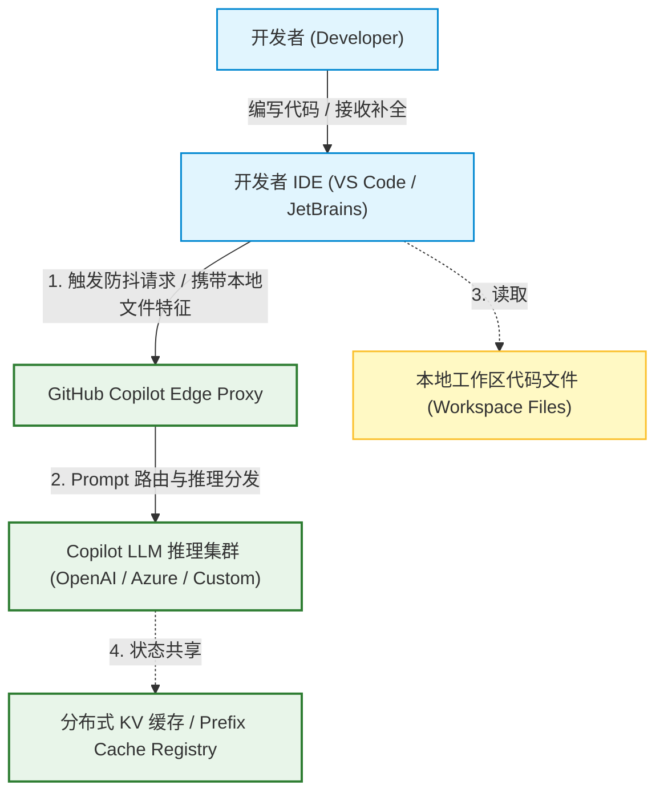
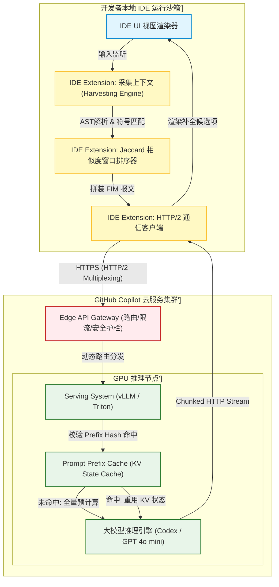
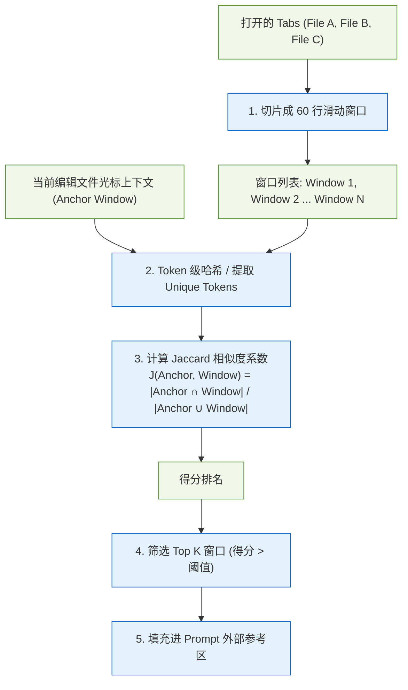
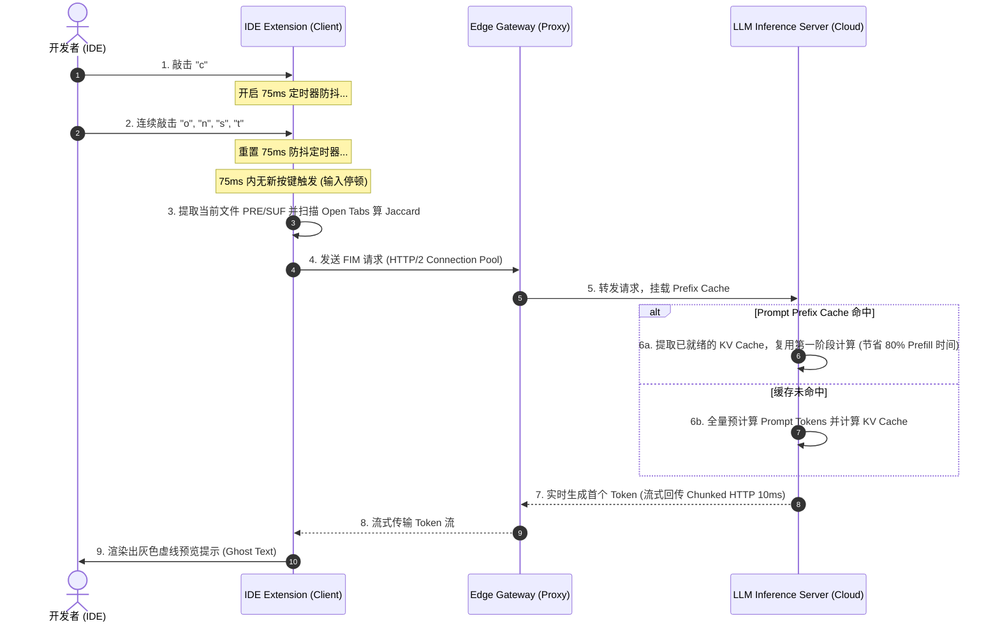
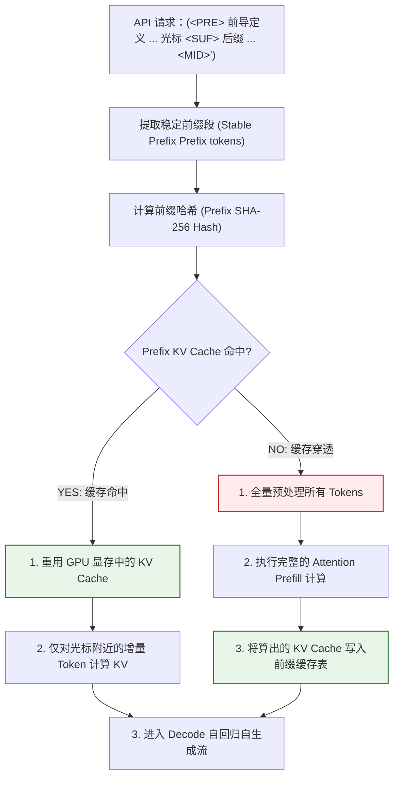
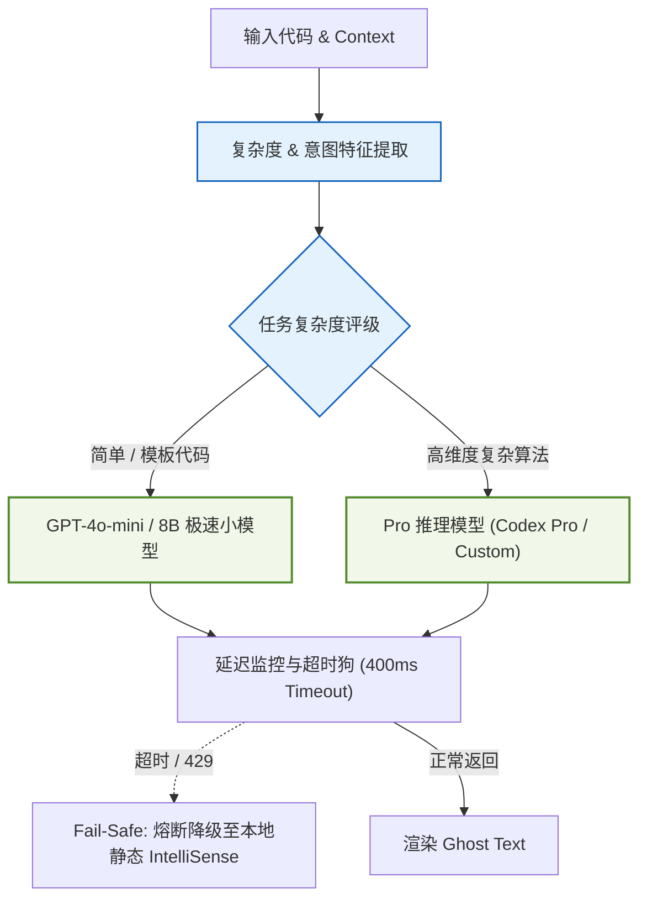

import CaseStudyHeader from '@site/src/components/CaseStudyHeader';
import DesignIntent from '@site/src/components/DesignIntent';
import EvolutionTimeline from '@site/src/components/EvolutionTimeline';
import CompareSlider from '@site/src/components/CompareSlider';
import TradeoffExplorer from '@site/src/components/TradeoffExplorer';
import GlossaryTerm from '@site/src/components/GlossaryTerm';
import ResearchNote from '@site/src/components/ResearchNote';
import GuidedExercise from '@site/src/components/GuidedExercise';
import QuizCard from '@site/src/components/QuizCard';
import MindMap from '@site/src/components/MindMap';

# GitHub Copilot：毫秒级代码补全的上下文收集与缓存

<CaseStudyHeader
  oneLiner="GitHub Copilot 是大模型在 IDE 实时辅助场景的教科书级应用。它的核心难题不仅是模型生成能力，更是如何在高频敲击的极速体验下，通过『客户端轻量级上下文提取』与『服务端 Prompt 状态缓存』双端协同，在亚 200 毫秒内提供高度相关的双向代码补全。"
  stats={[
    {label: '首发时间', value: '2021 年 6 月'},
    {label: '日活开发者', value: '数百万'},
    {label: '体验阈值延迟', value: 'Sub-200ms (感知零等待)'},
    {label: 'Jaccard 滑动窗口', value: '60 行'},
    {label: '提示词架构', value: 'FIM (Fill-in-the-Middle)'},
    {label: '核心降本增效', value: 'Prompt Prefix Caching'}
  ]}
/>

:::info 对应课程概念
本案例横跨整门 AI 课：
*   **大模型推理时延（Month 7）**：如何在解码阶段通过流式传输与状态缓存突破 GPU 带宽瓶颈。
*   **可信上下文检索（Month 8 RAG）**：如何利用轻量级 Jaccard 相似度在本地 IDE 窗口中进行多源 Context 召回。
*   **网关路由与弹性（Month 11）**：如何根据复杂度匹配大/小模型，并在服务抖动时无缝切换。
:::

---

## 1. 设计初衷：IDE 场景下的亚秒级交互约束

在日常编码中，开发者的心流体验是极其脆弱的。一旦代码自动补全的等待时间超过 **200 毫秒**，人机交互就会产生强烈的“顿挫感”。因此，Copilot 架构设计的第一硬性约束就是 **极速（Extreme Latency Constraint）**，其次才是生成质量。

<DesignIntent
  problem="如何在开发者敲击键盘的间歇（通常在 75ms 停顿内），从本地数万行的多文件代码库中抓取最相关的片段，组装出能被模型理解的高质量提示词，并发往云端大模型完成自回归推理，且在 200ms 内把首字吐回到 IDE 界面。"
  users="全球各种 IDE 环境下的高频敲击开发者，使用 VS Code, JetBrains, Neovim 等工具。"
  devices="运行于开发者本地 of IDE 插件客户端，仅具备极有限的 CPU/内存资源，无法运行重型向量检索或本地大模型。"
  goals={[
    '极致首字延迟：从停顿到首词吐出，端到端延迟控制在 200ms 左右',
    '双向上下文感知：不仅参考光标前的代码（前缀），还要参考光标后的已有代码（后缀）',
    '项目级关联唤醒：能够跨文件读取当前导入的类定义、类型定义或相似逻辑片段',
    '超高可用与弹性：在云端网络抖动或模型 429 限流时，平滑降级，不阻塞 IDE 自带的基础自动补全'
  ]}
  constraints={[
    '本地计算资源极度克制：不能引入复杂的重型文本嵌入计算或本地数据库存储',
    '网络开销敏感：每次敲击都可能触发请求，网络带宽和并发连接数面临巨大压力',
    '模型上下文窗口受限：早期 Codex 模型仅 2K-4K 窗口，无法将整个项目或多源文件全部塞入',
    '推理单价昂贵：数百万开发者并发生成代码，推理吞吐必须榨干到极限'
  ]}
  firstStep="通过 IDE 插件对敲击进行防抖（Debounce）处理；在本地对 open tabs（打开的编辑器选项卡）执行快速的 Jaccard Token 相似度扫描，拼接出 FIM（Fill-in-the-Middle）格式的 Raw Prompt；发往云端网关，由网关做高并发的 Prefix Cache 命中校验并驱动后台模型流式返回。"
/>

---

## 2. 知识全景脑图

<MindMap
  root={{
    label: 'GitHub Copilot 架构全景',
    children: [
      {
        label: 'Client-Side (IDE 插件)',
        children: [
          { label: '防抖触发 (75ms Debounce)' },
          { label: '上下文提取 (Context Harvesting)' },
          { label: 'Jaccard 邻窗口排序' },
          { label: 'AST/符号定义解析' }
        ]
      },
      {
        label: 'Prompt Engine (组装)',
        children: [
          { label: 'FIM 格式化 (<PRE>/<SUF>/<MID>)' },
          { label: '权重配额计算' },
          { label: 'Custom Instructions 拼装' }
        ]
      },
      {
        label: 'Network / Gateway',
        children: [
          { label: 'HTTP/2 多路复用' },
          { label: '复杂度模型路由' },
          { label: 'Fail-Safe 本地降级' }
        ]
      },
      {
        label: 'Cloud Model Serving',
        children: [
          { label: 'Prompt Prefix Caching (vLLM/RadRad)' },
          { label: 'PagedAttention 显存管理' },
          { label: '流式 Tokens 传输' }
        ]
      }
    ]
  }}
/>

---

## 3. 系统架构总览 (C4 Model)

GitHub Copilot 的架构由本地端（IDE Extension）和云端（Copilot Edge & Inference Server）两大部分组成。以下是 C4 风格的系统拓扑。

### 3a. System Context (系统上下文图)

### 3b. Container Diagram (容器结构图)

---

## 4. 核心机制拆解

### 4a. 客户端上下文收集引擎 (Context Harvesting Engine)

在生成补全时，仅仅把当前文件光标前的几千个字符发给大模型是远远不够的。为了能预测出正确的类属性和函数调用，大模型需要知晓**外部依赖文件的定义**。

Copilot 在本地运行着一个轻量级“侦探”引擎：
1.  **邻近文件扫描**：获取当前在 IDE 中正处于打开状态的其他 Tabs 文件（Open Tabs）。
2.  **滑动窗口切片**：将这些邻近文件切割成多个 60 行左右的滑动窗口（Sliding Windows）。
3.  **Jaccard 相似度打分**：计算当前正处于编辑的光标周围代码（Anchor）与每个滑动窗口的 Jaccard 相似度系数。
4.  **按权重填充**：将打分最高的几个窗口内容作为 Context，插入到 Prompt 中。

<ResearchNote
  title="IDE 级代码检索优化：邻近 Tab 启发式规则与 Jaccard 的奇效"
  source="GitHub Engineering: How GitHub Copilot understands your code (2023)"
  href="https://github.blog/2023-05-17-how-github-copilot-understands-your-code/"
  insight="Copilot 团队发现，开发者在 IDE 中打开的 Tabs 通常在逻辑上属于同一需求模块。使用简单的 Jaccard 相似度对这些文件的滑动窗口进行文本交并比（Intersection-over-Union）排序，能够在不超过 10 毫秒的时间内筛选出极高关联度的外部符号定义，极大提升大模型在引用外部类时的准确度。"
  application="架构启示：在亚秒级限制下，复杂的语义向量计算（Embedding）在本地无法承受，此时基于分词交集（Jaccard）的字面匹配配合 IDE 的 Tabs 局部性先验，是性价比极高的平替策略。这是 RAG 课第 8 阶段的经典工程折中。"
/>

---

### 4b. FIM (Fill-in-the-Middle) 提示词组装模式

传统的自回归模型只能做单向续写（Prefix-only completion）。这种模式在修改现有函数体中间的某行代码时，无法利用光标后的后缀（Suffix）信息，生成的内容常常会与后文彻底冲突，产生大量语法垃圾。

FIM 通过修改 Prompt 格式，迫使模型学会**在中间插值**。它使用特殊的控制字符将上下文分为三部分：
*   `<PRE>`：光标前的前缀代码。
*   `<SUF>`：光标后的后缀代码。
*   `<MID>`：模型需要开始生成并补全的空白区。

<ResearchNote
  title="Fill-in-the-Middle (FIM)：让自回归模型学会双向插值"
  source="Bavarian et al. (2022), Efficient Training of Language Models to Fill in the Middle (OpenAI)"
  href="https://arxiv.org/abs/2207.14255"
  insight="这篇论文揭示了只需在预训练阶段将 50% 的语料切分成 prefix、suffix 和 middle，并用控制字符重排拼装喂给模型，就能使原本单向自回归的模型天然具备『双向插值』补全的能力，且对其单向续写能力的精度毫无损害。"
  application="架构启示：在大模型输入端，将『前缀』和『后缀』拼装位置颠倒（即 PRE-SUF-MID 顺序），是提示词架构的核心设计。这也使得 IDE 能平滑实现就地行内补全（Inline Completion）。"
/>

---

### 4c. 双端协同：Keystroke Debouncing 与 HTTP/2 传输时序

每次开发者敲击键盘都发起网络调用会打满服务器并引发网关雪崩。Copilot 使用本地 75 毫秒的防抖（Debounce）逻辑来等待输入间歇，再将请求通过 HTTP/2 多路复用发往云端。

---

### 4d. 服务端优化：Prompt Prefix Caching (提示词前缀缓存)

在实时补全中，由于开发者是在同一文件内不停修改，发往服务端的 Prompt 中，有 **90% 以上的字符（如引入库、前面的类框架、外部相似 Tab 段落）是完全相同的**。

如果每次请求都让 GPU 重新对这几千个 Token 执行 Prefill（计算 Attention 矩阵），GPU 的利用率会由于重复计算而被严重浪费，且首字延迟（TTFT）会极高。

云端推理引擎引入了 **Prompt Prefix Caching (PPC)** 技术：
*   把 Prompt 的前缀做哈希运算（Hash）。
*   将该前缀算完得到的 KV Cache 缓存在显存中（以 Page 为单位）。
*   新请求到来时，如果前缀 Hash 命中，直接复用已有的 KV Cache，只对新增的几个 Token 执行增量计算。

---

### 4e. 动态模型路由与 Fail-Safe 弹性降级

Copilot 云网关通过静态分析敲击上下文的复杂度，在毫秒内做出智能路由决定：
*   **简单场景（Simple Routing）**：如果是普通的变量定义、赋值或常用结构体（Jaccard 分数低、处于常识类文件），则分发给参数极小的轻量模型（如 1B–8B 级小模型），保证首字吐出耗时在 80ms 内。
*   **高难推理（Complex Routing）**：若发现存在多重递归函数头、涉及未见过的复杂算法、或 Jaccard 相似度高分命中了复杂 AST 逻辑，则路由给大型推理模型。
*   **Fail-Safe 兜底熔断**：当云端大模型服务因高并发发生 429 拥堵，或连接延迟超过 400ms 时，网关直接短路熔断，退避到 IDE 本地内置的 IntelliSense 语法补全，保障 IDE 绝对不发生任何输入卡死。

---

## 5. 关键数据结构与算法

### Jaccard 相似度窗口排序算法

Copilot 本地插件使用 Jaccard 相似度对当前编辑位置的 `Anchor` 代码段与其余 Tabs 文件的各个 `Window` 代码段进行相关度排序。

Jaccard 指数的数学定义为：
$$J(A, B) = |A \cap B| / |A \cup B|$$

#### 算法实现逻辑：
1.  **分词与去重**：将 Anchor 段落（以光标为中心，上下各 20 行）进行轻量级 Tokenization，过滤掉无意义的常见关键字（如 `const`, `function`, `import` 等），将剩余符号去重后放入集合 $A$。
2.  **滑动遍历**：对其他打开的每个文件，按步长（如 30 行）滑动切出大小为 60 行的代码块 $B$。
3.  **集合交并计算**：计算 $A$ 与 $B$ 的交集大小与并集大小，算出比值。
4.  **按权重填充**：仅保留得分高于设定阈值（例如 $0.15$）的窗口，按照得分从高到低排序，将 Top 3 窗口内容注入 Prompt 的参考上下文区。

---

## 6. 架构演进史

GitHub Copilot 的演进是一个典型的“不断压缩延迟、提升补全拟合度”的过程：

<EvolutionTimeline
  events={[
    {
      year: '2021',
      title: 'Codex 时代：单向续写与初探',
      why: 'OpenAI 刚发布 Codex 模型，模型仅支持单向自回归（Prefix-only）。补全时经常把后文已有的代码重复生成一遍，造成大量冗余。',
      change: '客户端提取光标上方 2KB 的代码直接发送，由于模型不具备 FIM 且没有 Prompt Caching，首字延迟平均长达 800ms–1.5s，容易打断心流。'
    },
    {
      year: '2023',
      title: 'FIM 双向对齐与上下文引擎升级',
      why: '用户抱怨大量的重复生成和无效括号；同时多文件项目需要知道依赖项的类定义。',
      change: '模型切换至支持 FIM 的新版 Codex。客户端引入 Jaccard Tab 扫描算法和 AST 解析；网关开始执行 75ms 防抖。首字延迟降至 400ms，双向适配度提高 10%。'
    },
    {
      year: '2024+',
      title: 'Prefix Caching 工业化与动态路由',
      why: '用户量暴增导致 GPU 算力成本高企，高并发下的 Prefill 阶段重复计算 Attention 矩阵造成巨大的延迟浪费。',
      change: '云端全面普及 Prompt Prefix Caching（基于 RadRad 算法或 vLLM 分页缓存）。网关级根据当前代码特征自动路由（简单逻辑路由到小模型，复杂算法路由到强推理模型），首字延迟压缩至 sub-200ms。'
    }
  ]}
/>

---

## 7. 架构对比：传统 prefix 补全 vs. FIM 双向插值补全

<CompareSlider
  before={
    

      <strong>传统单向 Prefix 补全 (2021年前)</strong>
      
模型仅知晓光标之前的输入。当在现有函数的中间插入一行时，模型由于看不到光标后的已有后缀，会盲目生成后文已存在的重复逻辑或多余的花括号，导致语法报错，需要开发者手动删改。

    

  }
  after={
    

      <strong>现代 FIM 双向插值补全 (今天)</strong>
      
通过控制字符将光标前后切分成 PRE 和 SUF，并在 MID 处启动生成。模型被强行训练出“插值”能力，能参考前后的双向依赖，完美契合现有代码上下文，做到零冗余精准契合。

    

  }
  labels={['旧单向架构', '新 FIM 架构']}
/>

---

## 8. 权衡：优化手段的取舍谱系

Copilot 需要在全球数十万并发下实现 sub-200ms 的极致补全体验，系统工程师在多个方面做出了艰难的折中：

<TradeoffExplorer
  title="GitHub Copilot 推理延迟与质量优化手段取舍"
  dimensions={['首字延迟 (TTFT)', '补全准确度', '网络开销', '云端算力吞吐', '本地 CPU 占用']}
  options={[
    {
      name: '客户端 75ms 防抖 (Debounce)',
      scores: [3, 5, 5, 5, 5],
      note: '通过等待开发者敲击停顿再发包，过滤掉 70% 的无效高频请求，极大降低了网络开销和服务器算力并发，提升了最终发包时的提示词准确度。代价是增加了 75ms 的硬性物理等待时间。',
      whenToUse: '高并发客户端敲击场景的绝对标配，用于过滤连续快速击键。'
    },
    {
      name: '前缀缓存 (Prefix Caching)',
      scores: [5, 5, 3, 5, 5],
      note: '在服务端将 stable 前缀的 KV Cache 驻留 GPU 显存。命中时 Prefill 延迟几乎降为 0，吞吐翻倍。缺点是显存开销随长前缀暴增，如果前缀中频繁夹杂动态变量（如时间戳）会导致缓存高频穿透。',
      whenToUse: '高并发、长上下文提示词且前缀相对静态的 SaaS 大模型推理。'
    },
    {
      name: 'Jaccard 邻文件相似窗口提取',
      scores: [4, 4, 3, 3, 4],
      note: '在本地用 CPU 极速做分词交并比。能在毫秒内拉取外部关联代码，提升生成准确度。缺点是由于没有语义理解，遇到词义相同但命名完全不同的类时会完全漏掉召回。',
      whenToUse: '本地客户端无 GPU、无法执行重型向量 Embedding 且需多 Tab 关联时。'
    },
    {
      name: '多尺寸模型动态路由 (Mini vs. Pro)',
      scores: [5, 3, 4, 5, 5],
      note: '根据敲击位置判断，简单变量声明路由到小尺寸模型（如 GPT-4o-mini），复杂多重递归才路由到 Pro 模型。大幅降低了推理成本并缩短了排队延迟，但部分略微模糊的简单场景模型可能会猜错。',
      whenToUse: '面对海量廉价查询且成本敏感的商业级 AI 应用平台。'
    }
  ]}
/>

---

## 9. 如果是你来设计：Context 剪裁启发式算法

### 场景设想
在 IDE 场景下，如果本地 harvested 出来的 context (当前文件、FIM Suffix、Jaccard 召回的 3 个邻 Tab 窗口) 总大小为 **6,000 个 tokens**，但当前分配给你的低成本路由模型仅有 **4,000 tokens** 的上下文窗口。

请你设计一个 **Token Pruning (Token 剪裁) 启发式规则**，在本地 Extension 侧将上下文安全裁切至 4,000 tokens 以内。

<GuidedExercise
  title="本地 Extension Token 剪裁算法设计"
  goal="在不超过 2ms 延迟内，依据重要性动态修剪上下文 tokens，保证核心 PRE 与 SUF 不被破坏的前提下，丢弃性价比最低的 Context。"
  steps={[
    '步骤 1: 锁死锚点。锚点（Anchor）即光标所在位置上下各 100 行。计算 Anchor 占用的 Tokens 数（假设为 1200 个），此部分优先级最高，必须 100% 留存，不可截断。',
    '步骤 2: 截断 Suffix 后缀。后缀（SUF）在 FIM 中只起约束后文括号和收尾作用，其重要性在 50 行后快速衰减。保留 Suffix 的前 50 行（约 400 tokens），对 50 行以后的部分直接执行物理裁切。',
    '步骤 3: 依据 Jaccard 分数配额剪裁 Neighbor Tabs。按照得分由低到高，逐步将 Jaccard 分数低于 0.15 的 Window 直接从 Prompt 中移除。',
    '步骤 4: 兜底滑动截断。如果经过前三步处理后依然超出 4000 tokens，说明 PRE 区域（当前光标前代码）过大。将 PRE 的起始处（文件最头部）执行滑动窗口滑出式裁切，仅保留光标前最靠近的 N 行，直至总 Tokens 为 3950。留下 50 个 Token 冗余作为大模型生成回答的空间。'
  ]}
  checks={[
    '确认 Anchor (光标所在核心区) 绝对没有被剪裁',
    'FIM 的控制字符 <PRE>, <SUF>, <MID> 正确排布于首尾，没有因强行截断发生控制标记错位',
    '算法复杂度为 O(N) 级，在本地 IDE 的 Node.js 运行时中执行时间低于 1.5 毫秒'
  ]}
/>

---

## 10. 知识自测

<QuizCard
  questions={[
    {
      q: 'GitHub Copilot 采用 FIM (Fill-in-the-Middle) 提示词组装模式的核心工程价值是什么？',
      options: [
        'A. 提高向量库的 Jaccard 相似度打分',
        'B. 让模型不仅能看到光标前的代码，还能看到光标后的已有代码，从而进行双向精确插值，杜绝与后文语法结构冲突的冗余重复生成',
        'C. 使得本地 IDE 能够完全脱离云端网络，实现 100% 离线补全',
        'D. 压缩每次发包的网络 Payload 报文大小'
      ],
      answer: 1,
      explain: '在 FIM 模式下，Prompt 通过重组为 <PRE> + <SUF> + <MID> 告诉模型“在中间进行拼装插值”。这使得模型输出的行尾花括号、下文已存在的类属性引用能够做到自然契合，彻底消除了传统单向自回归生成的严重后向冲突。'
    },
    {
      q: '在 Copilot 云端 Serving 集群中，采用 Prompt Prefix Caching (PPC) 为什么能大幅拉低首字延迟 (TTFT)？',
      options: [
        'A. 因为它将模型层的所有神经网络权重全部缓存在客户端 IDE 的内存中',
        'B. 通过缓存 stable 前缀的 Attention KV 状态，使得每次补全请求到达时，GPU 仅需对光标附近的增量 Tokens 进行 Prefill 计算，避免了重复计算长提示词前缀的大量张量乘法',
        'C. 它自动把大模型切换到了本地轻量级运行状态',
        'D. 它通过 HTTP/2 压缩算法减少了客户端的敲击延迟'
      ],
      answer: 1,
      explain: '由于开发者频繁敲击，前后两次补全提示词有 90% 以上是完全相同的前导代码。PPC 能够哈希匹配前导前缀，在 GPU 显存里重用已经算好的这部分 KV Cache，因此免除了耗时的大片 Attention 预计算（Prefill 阶段），使 TTFT 首字响应时间缩短一个数量级。'
    },
    {
      q: '在本地 IDE 资源高度受限的物理约束下，Copilot Extension 选用 Jaccard 相似度算法而不是重型向量 Embedding 算法来做多 Tab 关联召回，做出了何种工程折中？',
      options: [
        'A. 牺牲了 100% 的补全准确率，以换取零 CPU 占用率',
        'B. 舍弃了语义级的深层理解（若变量同义不同名则漏召回），以换取在本地 Node.js 沙箱中极速运行（<10ms）与零 Embedding 计算开销的硬性时延要求',
        'C. 提升了云端 GPU 显存的 KV Cache 命中率',
        'D. 避免了 IDE 出现 broken links 的编译错误'
      ],
      answer: 1,
      explain: '这体现了架构的“按资源约束做克制设计”。在本地，若拉起一个 Transformer 提取 60 行代码的语义向量，本地 CPU 会发生严重卡顿。虽然 Jaccard 算法仅根据分词交集匹配，无法检测语义同义词，但其超快的字面匹配速度和对 IDE tab 局部性的高效利用，完美契合了亚 200ms 的交互闭环需求。'
    }
  ]}
/>

---

## 来源清单

*   [GitHub Blog: How GitHub Copilot understands your code (Context Harvesting)](https://github.blog/2023-05-17-how-github-copilot-understands-your-code/)
*   [GitHub Blog: Research: How GitHub Copilot is getting faster (Prompt Caching & LLM Routing)](https://github.blog/2024-03-07-research-how-github-copilot-is-getting-faster/)
*   [Bavarian et al. (2022), Efficient Training of Language Models to Fill in the Middle (FIM)](https://arxiv.org/abs/2207.14255)
*   [Kwon et al. (2023), Efficient Memory Management for LLM Serving with PagedAttention (vLLM)](https://arxiv.org/abs/2309.06180)
*   [vLLM Team: Automatic Prefix Caching in vLLM Serving Engine](https://blog.vllm.ai/2024/02/11/automatic-prefix-caching.html)