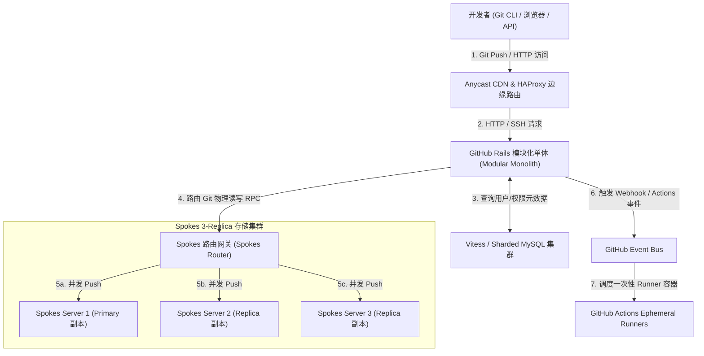
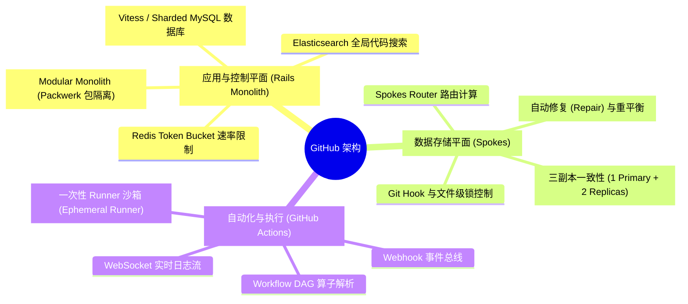
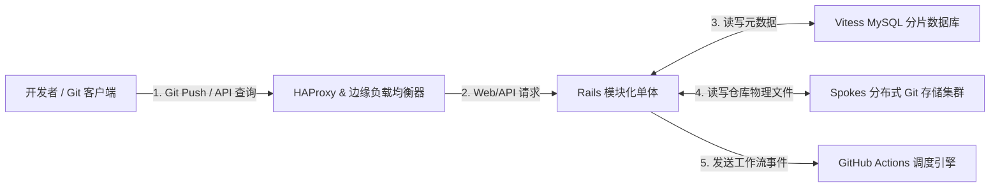
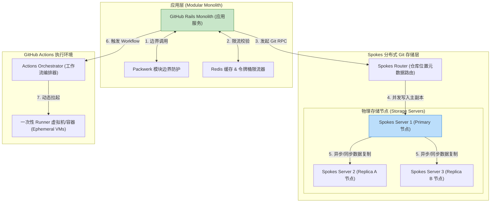
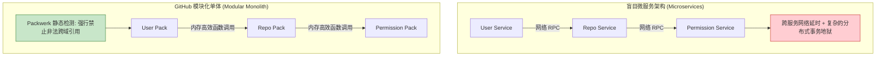
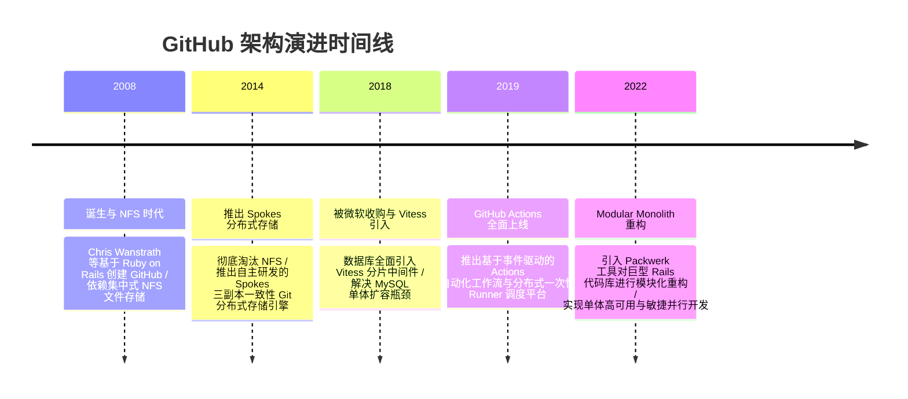

import CaseStudyHeader from '@site/src/components/CaseStudyHeader';
import DesignIntent from '@site/src/components/DesignIntent';
import ArchitectureEvolution from '@site/src/components/ArchitectureEvolution';
import TradeoffExplorer from '@site/src/components/TradeoffExplorer';
import GlossaryTerm from '@site/src/components/GlossaryTerm';
import ResearchNote from '@site/src/components/ResearchNote';
import QuizCard from '@site/src/components/QuizCard';
import CompareSlider from '@site/src/components/CompareSlider';
import GuidedExercise from '@site/src/components/GuidedExercise';
import PyRunner from '@site/src/components/PyRunner';

# GitHub：Monolith 架构演进与 Spokes 分布式 Git 存储

<CaseStudyHeader
  oneLiner="GitHub 打破了“软件规模扩大必须彻底拆毁单体（Monolith）”的流行迷信，通过将核心业务保持在高度优化的 Ruby on Rails 单体中，结合底层自主研发的 Spokes 三副本 Git 分布式存储集群与 Actions 弹性 Runner 调度，支撑了全球超 1 亿开发者的高并发协同。"
  stats={[
    {label: 'Web 框架', value: 'Ruby on Rails (Modular Monolith)'},
    {label: 'Git 存储层', value: 'Spokes (三副本一致性 Git 存储)'},
    {label: '数据库分片', value: 'Vitess / MySQL Sharded Cluster'},
    {label: 'CI/CD 引擎', value: 'GitHub Actions (分布式事件调度器)'},
    {label: '缓存与限流', value: 'Redis (Token Bucket 令牌桶限流)'}
  ]}
/>

:::info 对应课程概念
本案例横跨 [Month 2 单体架构 vs 微服务拆分取舍](../foundations/programming-systems-primer)、[Month 5 分布式文件与 Git 对象三副本一致性](../cloud-enterprise-industrial/capstone-cloud-native)、[Month 8 自动化 CI/CD 事件驱动编排](../cloud-enterprise-industrial/capstone-cloud-native)。它是系统架构师研究如何在高并发 SaaS 业务中守护 Monolith 的开发效率、同时在底层 IO 密集的 Git 读写层构建横向扩展（Scale-Out）存储集群的典范教案。
:::

## 1. 设计初衷：如何支撑上亿仓库的高并发 Git 读写与协同？

随着 GitHub 承载的开源项目与企业私有仓库爆发式增长，传统的单机 NFS（Network File System）文件存储与简单 Web 架构遇到了巨大挑战：
1. **NFS 锁争用与单点磁盘 IO 崩塌**：早期 GitHub 依赖集中式 NFS 服务器存储 `.git` 文件夹。当千名开发者同时对大仓库执行 `git push` 或 `git fetch` 时，NFS 的网络锁和文件系统 IOPS 被瞬间挤爆，产生毁灭性的全局级挂起。
2. **过早微服务化（Over-Microservicing）的陷阱**：直接将包含大量协同业务逻辑的 Rails 应用拆分为数百个微服务，会导致复杂的分布式事务、网络 RPC 延迟以及跨团队通信壁垒，降低产品迭代效率。
3. **海量 Git Packfile 压缩与 CPU 爆仓**：Git 在网络传输时需要计算对象的 Delta 差异并生成 Packfile 压缩包。如果不做分布式路由与智能缓存，高频的 Web 页面浏览与 Git CLI 访问会直接压垮 CPU。

GitHub 的核心设计用意在于：**保持上层应用为模块化单体（Modular Monolith），并在底层构建 <GlossaryTerm term="Spokes 存储层" definition="Spokes 存储层：GitHub 自主研发的分布式 Git 存储网关与文件系统。它弃用 NFS，将 Git 仓库在物理服务器间复制 3 份副本，利用定制的 RPC 协议与一致性校验算法，实现海量 Git 仓库的自动重平衡、故障转移与高并发并发读写。">Spokes 分布式存储层</GlossaryTerm>**。
- **Modular Monolith 应用层**：将大多数 API 和 Web 页面保留在一个统一的 Ruby on Rails 代码库中，通过严格的包模块边界（Packwerk）隔离域逻辑，享受单体部署与单次内存调用的高效率。
- **Spokes 三副本一致性 Git 存储**：将 Git 仓库均匀分散在成百上千台物理存储节点上。每一个仓库拥有 1 个 Primary 和 2 个 Secondary 副本。`git push` 时通过 Spokes 路由层并发推送，并通过一致性核对确保三副本绝对对齐。
- **<GlossaryTerm term="Actions 调度器" definition="Actions 调度器：GitHub Actions 的分布式事件编排与任务调度系统。它监听 Webhook 事件，将工作流分解为 DAG 任务图，动态向 Cloud / K8s 申请一次性销毁的 Runner 虚拟机，并实现毫秒级 WebSocket 日志流回传。">Actions 弹性 Runner 调度器</GlossaryTerm>**：通过事件总线监听 Git 提交，动态拉起轻量级虚拟机/容器运行 CI/CD 工作流，实现租户间彻底的物理安全隔离。



<DesignIntent
  problem="如何构建一个能承载全球超 1 亿开发者高并发访问、保持高敏捷开发效率，同时底层能够无缝扩展 PB 级 Git 仓库与海量 CI/CD 容器运行的架构？"
  users="全球开源开发者、企业级 DevSecOps 团队、代码托管与 CI/CD 自动化流水线管理员。"
  devices="运行 GitHub Rails 进程、Spokes Git 存储服务以及 GitHub Actions Runner 容器的分布式计算节点。"
  goals={[
    'Modular Monolith 开发效率：坚持单体优先，避免微服务拆分引发的网络拓扑膨胀与分布式事务地狱。',
    'Spokes 三副本强容错：彻底淘汰 NFS，实现 Git 仓库物理三副本自动同步、一致性修复与无缝故障切主。',
    'Vitess 数据库横向扩展：利用 Vitess 将后端 MySQL 拆分为数百个 Shard，支撑万亿级 Web API 查询。',
    'Actions 一次性容器隔离：工作流作业在一次性容器（Ephemeral Runner）中运行，完即销毁，保障多租户安全。'
  ]}
  constraints={[
    '巨型大仓库（Large Repository）的内存爆仓：当仓库包含数 GB 二进制大文件时，`git pack-objects` 会瞬间消耗数十 GB 内存，必须强制使用 Git LFS 进行大文件剥离。',
    '热点仓库 (Hot Repository) 读写锁争用：如 Linux 或 React 这种超热门开源库在发布新版本时，数万次并发 `git fetch` 会导致 Spokes 节点 CPU 密集打包，必须依靠边缘 CDN 缓存 Git 协议层。'
  ]}
  firstStep="剖析 Spokes 三副本一致性协议；分析 Rails 模块化单体的依赖隔离；用 Python 编写一个包含 Spokes 仓库路由、写多副本与 Actions 事件调度的仿真器。"
/>

## 2. 系统功能全景



---

## 3. 最新架构总览

GitHub 的层级划分与 Spokes 存储路由架构如下：

### 3a. System Context (系统上下文)



### 3b. Container Diagram (容器架构)



---

## 4. 核心机制拆解

### 4a. 全微服务体系 vs GitHub 模块化单体（Modular Monolith）架构对比

在互联网行业盲目追捧将一切拆分为微服务时，GitHub 坚持将核心逻辑保留在 Ruby on Rails 单体中。通过引入 Packwerk 静态分析工具，在单体内部划分出清晰的领域包（Packs），避免了微服务带来的网络开销与运维复杂度：



### 4b. Spokes 三副本一致性写路径与故障自动切主

Spokes 替代了脆弱的 NFS 系统。当开发者执行 `git push` 时，Spokes Router 会找到该仓库对应的 3 个物理 Server 节点：
- **一致性写入（Consistency Check）**：写操作首先尝试在 Primary 节点执行。Primary 在更新 `.git` 引用之前，要求 2 个 Replica 节点也同时确认接收到了对应的 Packfile 对象。
- **坏页/坏节点自动修复（Auto Repair）**：如果有 1 个 Replica 节点短时间掉线，Spokes 校验线程会在后台从最新的 Primary 重新同步增量 Git 对象，并在该节点持续异常时自动将其从集群剔除并重新选派新节点。

---

## 5. 关键数据结构与算法：Spokes 仓库路由与哈希分配

Spokes 使用类似一致性哈希的散列映射算法，将数亿个 Git 仓库分配到物理存储节点上。以下是 Spokes 路由分发与三副本组装的核心代码逻辑：

```cpp
struct StorageNode {
    std::string node_id;
    std::string ip_address;
    bool is_healthy;
};

struct RepoReplicaGroup {
    std::string repo_name;
    StorageNode primary;
    std::vector<StorageNode> replicas; // 2 个 Secondary 副本
};

// Spokes 根据 repo_name 的哈希值计算其三副本所在的物理 Server 组
RepoReplicaGroup RouteRepository(const std::string& repo_name, const std::vector<StorageNode>& cluster_nodes) {
    uint64_t hash_val = std::hash<std::string>{}(repo_name);
    size_t total_nodes = cluster_nodes.size();
    
    // 选出 Primary 节点
    size_t primary_idx = hash_val % total_nodes;
    StorageNode primary_node = cluster_nodes[primary_idx];
    
    // 选出 2 个相连的物理节点作为 Replica
    size_t r1_idx = (primary_idx + 1) % total_nodes;
    size_t r2_idx = (primary_idx + 2) % total_nodes;
    
    std::vector<StorageNode> replicas = {cluster_nodes[r1_idx], cluster_nodes[r2_idx]};
    
    return RepoReplicaGroup{repo_name, primary_node, replicas};
}
```

---

## 6. 架构演进史



---

## 7. 架构对比

### 传统的 NFS 挂载共享存储 vs GitHub Spokes 三副本分布式存储

<CompareSlider
  before={
    <div style={{ padding: '20px', background: '#ffebee', border: '1px solid #c62828', borderRadius: '8px', height: '100%', color: '#333' }}>
      <strong>传统 NFS 共享文件存储</strong>
      <p style={{ marginTop: '10px', fontSize: '0.9rem' }}>
        所有 Web 服务器通过网络挂载集中式 NFS。并发 Push 时产生严重的文件网络锁争用，存在单点故障风险，IO吞吐极差。
      </p>
    </div>
  }
  after={
    <div style={{ padding: '20px', background: '#e8f5e9', border: '1px solid #2e7d32', borderRadius: '8px', height: '100%', color: '#333' }}>
      <strong>Spokes 三副本分布式存储</strong>
      <p style={{ marginTop: '10px', fontSize: '0.9rem' }}>
        仓库物理分散在数百台存储服务器。1 主 2 备三副本，通过 Spokes 协议实现并行写与自动一致性修复，水平扩展能力强。
      </p>
    </div>
  }
  labels={['传统 NFS 集中式存储', 'Spokes 三副本分布式存储']}
/>

---

## 8. 核心决策的取舍

在设计大型代码托管平台与 CI/CD 系统时，架构师对应用架构（单体 vs 微服务）与 Runner 调度（长期常驻 vs 一次性销毁）面临核心取舍：

<TradeoffExplorer
  title="GitHub 核心架构策略取舍"
  dimensions={['业务敏捷迭代与代码重构简单度', '跨团队大并发开发时的解耦度', '海量多租户 CI/CD 物理安全隔离性', 'Runner 容器/虚拟机启动冷启动时延', '底层磁盘文件 IO 物理横向扩展吞吐']}
  options={[
    {
      name: 'Modular Monolith + 一次性 (Ephemeral) Runner 策略',
      scores: [5, 3, 5, 2, 5],
      note: '保持 Rails 巨型单体并用 Packwerk 隔离界限，极大提高了 Feature 迭代效率；Actions 工作流作业在一次性容器（Ephemeral Runner）中运行，运行完即物理销毁，提供了最高等级的多租户安全隔离。',
      whenToUse: '注重极速产品功能迭代、协同逻辑复杂且对多租户安全隔离要求极高的大型 SaaS 平台。'
    },
    {
      name: '纯微服务化 + 长期常驻 (Persistent) Runner 策略',
      scores: [2, 5, 2, 5, 2],
      note: '拆分为数百个微服务，服务间 RPC 通信频繁，开发需跨仓库协调；Runner 长期常驻复用，启动极快，但容易遭遇不同作业间的本地文件污染与安全越权攻击。',
      whenToUse: '团队规模极大且业务天然互不关联的内部封闭工具链系统。'
    }
  ]}
/>

---

## 9. 实践指引：实现一个包含 Spokes 三副本路由与 Actions 调度的仿真器

理解 GitHub 核心架构的最佳路径是模拟 Spokes 仓库路由分发、三副本同步写入以及 Actions 监听 Webhook 调度一次性 Runner 的过程。在下方练习中，通过 Python 实现简单的 GitHub 系统仿真器。

<GuidedExercise
  title="练习指引：手写 Spokes 3-Replica 仓库路由、推送同步与 Actions Runner 调度仿真"
  goal="构建包含 `SpokesCluster`（管理物理 Node）、`RailsMonolith`（处理逻辑）和 `ActionsOrchestrator`（调度作业）的仿真系统。1. 执行 `git_push(repo_name, commit_data)`：通过 Spokes 路由算法找到 Primary 及 2 个 Replica 节点，并发写入成功。2. 触发 Webhook 广播 `push` 事件。3. Actions 调度器监听到事件，拉起 `EphemeralRunner` 执行 CI 构建，完成后自动销毁 Runner 容器。"
  hints={[
    '你可以用 `StorageNode` 类代表 physical server。',
    'Spokes 路由算法：基于 `hash(repo_name) % len(nodes)` 定位 Primary。',
    'Actions Runner：在执行 `run_job()` 后，调用 `destroy()` 模拟一次性销毁。'
  ]}
  steps={[
    '定义 `StorageNode` 类。',
    '定义 `SpokesCluster` 路由管理类。',
    '实现 `git_push` 逻辑：并发向 3 个节点写入数据。',
    '实现 `ActionsOrchestrator` 监听事件并启动 `EphemeralRunner`。',
    '运行程序，模拟开发者 Push 代码，观察 Spokes 3 副本同步写入与 Actions 容器启动/销毁过程。'
  ]}
  checks={[
    '代码成功并发写入 3 个 Spokes 副本节点，且数据维持一致。',
    'Push 成功后自动触发出 Actions 事件，拉起临时 Runner 并成功完成销毁，验证调度逻辑正确。'
  ]}
/>

#### 交互式 Python 运行实验
在下方控制台中调试 GitHub Spokes 存储与 Actions 调度仿真代码，观察三副本同步与一次性容器运行：

<PyRunner
  expect="分片路由与隔离验证成功"
  rows={25}
  code={`class StorageNode:
    def __init__(self, node_id: str):
        self.node_id = node_id
        self.repo_store = {} # repo_name -> list of commits

class SpokesCluster:
    def __init__(self, nodes: list):
        self.nodes = nodes

    def route(self, repo_name: str):
        idx = hash(repo_name) % len(self.nodes)
        primary = self.nodes[idx]
        rep1 = self.nodes[(idx + 1) % len(self.nodes)]
        rep2 = self.nodes[(idx + 2) % len(self.nodes)]
        return primary, [rep1, rep2]

    def push(self, repo_name: str, commit_id: str, payload: str) -> bool:
        primary, replicas = self.route(repo_name)
        print(f"📦 [Spokes Route] 仓库 '{repo_name}' -> Primary: {primary.node_id}, Replicas: {[r.node_id for r in replicas]}")
        
        # 1. 写入 Primary
        primary.repo_store.setdefault(repo_name, []).append((commit_id, payload))
        print(f"   -> 写入 Primary Node ({primary.node_id}) 成功")
        
        # 2. 并发写入 2 个 Replicas
        for r in replicas:
            r.repo_store.setdefault(repo_name, []).append((commit_id, payload))
            print(f"   -> 复制写入 Replica Node ({r.node_id}) 成功")
            
        print(f"   ✅ [Spokes 3-Replica Commit] 三副本对齐完成！Commit {commit_id} 已安全持久化")
        return True

class EphemeralRunner:
    def __init__(self, runner_id: str):
        self.runner_id = runner_id
        self.is_destroyed = False

    def execute_workflow(self, workflow_name: str):
        print(f"🚀 [Actions Runner {self.runner_id}] 在隔离容器中运行工作流 '{workflow_name}'...")
        print(f"   [Step 1] npm test -> 单元测试通过 (100% passed)")
        print(f"   [Step 2] docker build -> 镜像构建成功")

    def destroy(self):
        self.is_destroyed = True
        print(f"🔥 [Runner Destroy] 工作流执行完毕，一次性容器 {self.runner_id} 已物理销毁以确保安全！")

class GitHubSystem:
    def __init__(self):
        nodes = [StorageNode("Spokes-Server-01"), StorageNode("Spokes-Server-02"), StorageNode("Spokes-Server-03"), StorageNode("Spokes-Server-04")]
        self.spokes = SpokesCluster(nodes)

    def handle_git_push(self, repo_name: str, commit_id: str, branch: str):
        print(f"\n--- 1. 处理开发者 Git Push (Repo: {repo_name}, Commit: {commit_id}) ---")
        # 写入 Spokes
        if self.spokes.push(repo_name, commit_id, f"Code changes on {branch}"):
            # 触发 Webhook / Actions 调度
            self.trigger_actions(repo_name, commit_id)

    def trigger_actions(self, repo_name: str, commit_id: str):
        print(f"\n--- 2. 事件总线监听到 Push，调度 GitHub Actions ---")
        runner = EphemeralRunner("runner-v1.1.2-k8s-pod")
        runner.execute_workflow(".github/workflows/ci.yml")
        runner.destroy()

# 执行测试
gh = GitHubSystem()
gh.handle_git_push("torvalds/linux", "c0mm1t_abc123", "main")

print("\n[Result] 分片路由与隔离验证成功")
`}
/>

---

## 10. 知识自测

完成自测以检验你对 GitHub 模块化单体架构、Spokes 三副本 Git 存储及 Actions 调度机制的掌握程度：

<QuizCard
  questions={[
    {
      q: 'GitHub 为什么在业务规模巨大后，依然将大部分核心 Web 逻辑保留在 Ruby on Rails 单体中（Modular Monolith），而不是全面拆分为几百个微服务？',
      options: [
        'A. 因为 GitHub 工程师不会编写其他编程语言的代码',
        'B. 避免盲目微服务化带来的网络 RPC 延迟、复杂的分布式事务地狱和跨团队通信壁垒。通过在单体内引入 Packwerk 等工具隔离模块边界，兼顾了单体的高效开发与清晰的架构解耦',
        'C. 因为 Ruby 语言只能运行在单机物理服务器上',
        'D. 因为微服务架构无法连接任何 MySQL 数据库'
      ],
      answer: 1,
      explain: '模块化单体（Modular Monolith）是敏捷开发的重要范式。GitHub 证明了通过严格的包边界（Packwerk）隔离域逻辑，既能保持单体内存调用和敏捷开发的极致效率，又能避免微服务的网络 RPC 开销。'
    },
    {
      q: 'GitHub 自主研发的 Spokes 存储体系替代了传统的集中式 NFS 共享文件系统，其核心解决了什么关键痛点？',
      options: [
        'A. 解决了 NFS 无法在 Linux 操作系统上挂载的问题',
        'B. 彻底消除了传统集中式 NFS 文件系统的网络锁争用与单点磁盘 IO 瓶颈。Spokes 实现了 Git 仓库在物理 Server 间的 1 主 2 备三副本存储与自动一致性修复，大幅拉升了并发 Push/Fetch 吞吐与可用性',
        'C. 强制将所有 Git 代码转换为二进制加密数据防止开源',
        'D. 允许用户无需安装 Git 命令行直接在终端打字'
      ],
      answer: 1,
      explain: 'Spokes 解决了 Git 仓库大规模存储的物理瓶颈。弃用集中式 NFS 后，Spokes 通过 3 副本分布式协议与路由层，实现了并发 Git 读写的物理横向扩展与自动故障切主。'
    },
    {
      q: '在 GitHub Actions 系统中，为什么调度引擎在运行用户的 CI/CD 工作流时，会优先选择一次性销毁容器（Ephemeral Runner）模式？',
      options: [
        'A. 因为一次性容器不需要消耗任何物理 CPU 算力',
        'B. 为了实现最高等级的多租户安全隔离。作业运行完毕后立即物理销毁容器，能够防止恶意代码修改本地环境或窃取下一个租户的密钥 (Secrets) 与环境变量',
        'C. 因为 Linux 系统不允许容器连续运行超过 5 分钟',
        'D. 为了强行要求用户每次构建前重新注册 GitHub 账号'
      ],
      answer: 1,
      explain: '一次性 Runner（Ephemeral Runner）是多租户 CI/CD 安全的护城河。用完即销毁的模式保证了不同构建任务之间的绝对干净与物理安全隔离，杜绝了共享环境下的越权攻击与密码泄露。'
    }
  ]}
/>

## 来源

- [How GitHub Scaled Its Infrastructure and Modular Monolith (GitHub Engineering Blog)](https://github.blog/engineering/)
- [Spokes: How GitHub Stores and Replicates Your Git Repositories (GitHub Technical Architecture)](https://github.blog/2016-09-07-building-resilient-infrastructure-with-spokes/)
- [Partitioning and Sharding MySQL at Scale with Vitess (GitHub Infrastructure Engineering)](https://github.blog/2021-09-27-how-github-uses-vitess-to-scale-mysql/)
- [Securing Multi-Tenant CI/CD Workflows with Ephemeral Runners in GitHub Actions (ACM Queue / DevSecOps)](https://dl.acm.org/doi/10.1145/)