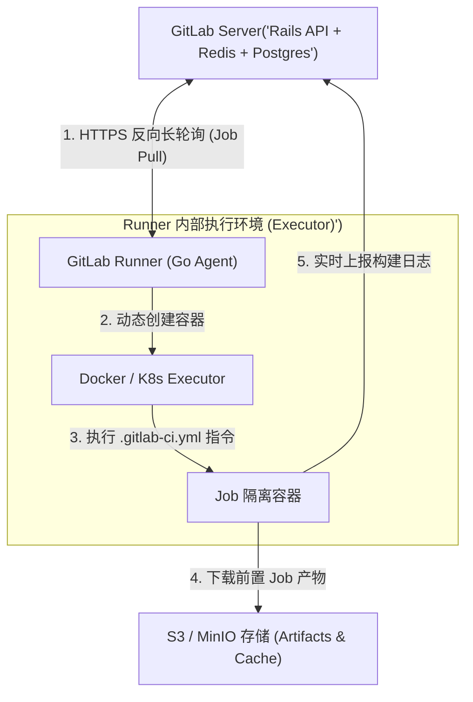
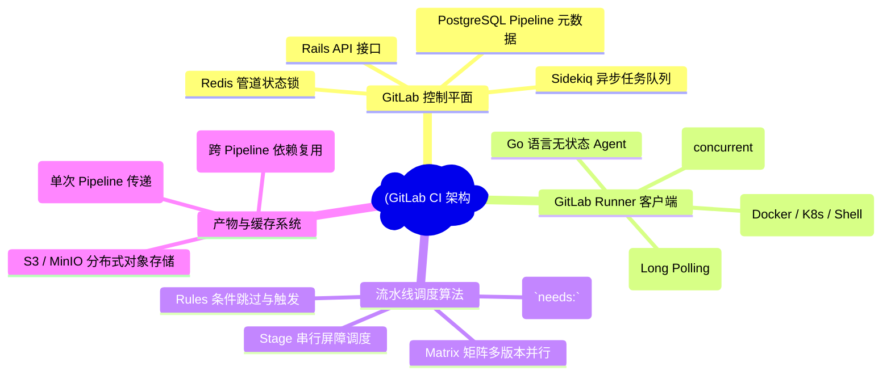
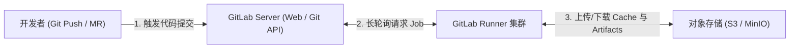
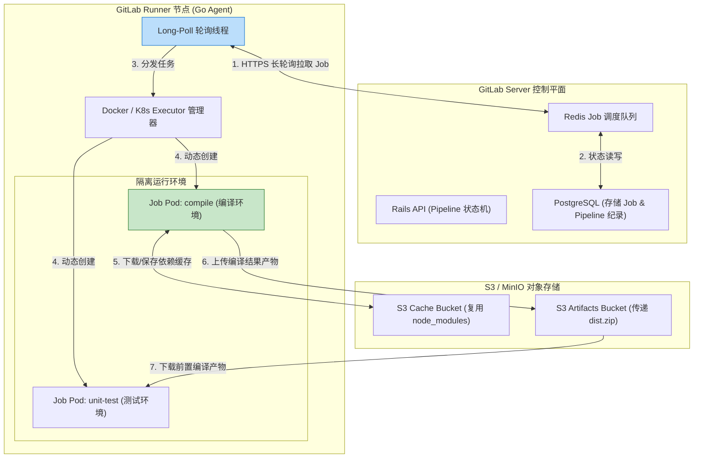
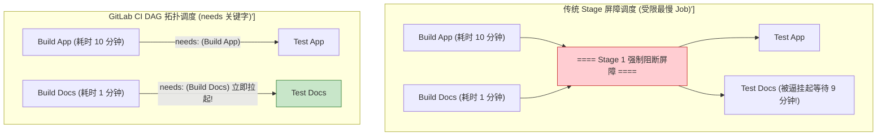
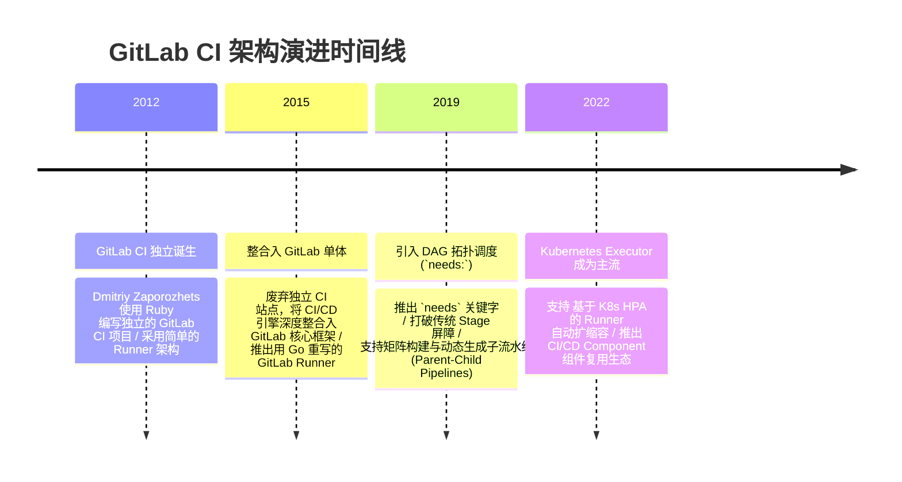

import CaseStudyHeader from '@site/src/components/CaseStudyHeader';
import DesignIntent from '@site/src/components/DesignIntent';
import ArchitectureEvolution from '@site/src/components/ArchitectureEvolution';
import TradeoffExplorer from '@site/src/components/TradeoffExplorer';
import GlossaryTerm from '@site/src/components/GlossaryTerm';
import ResearchNote from '@site/src/components/ResearchNote';
import QuizCard from '@site/src/components/QuizCard';
import CompareSlider from '@site/src/components/CompareSlider';
import GuidedExercise from '@site/src/components/GuidedExercise';
import PyRunner from '@site/src/components/PyRunner';

# GitLab CI：Runner 架构与 DAG 流水线调度

<CaseStudyHeader
  oneLiner="GitLab CI 通过解耦的 Go 语言轻量级 Runner 长轮询架构，结合基于 `needs` 关键字解锁的 DAG（有向无环图）无阶段屏障并发调度，彻底消除了传统 Jenkins 串行 Stage 的等待瓶颈，打造了企业级 DevOps 自动化编译与部署的标准标杆。"
  stats={[
    {label: ' Runner 架构', value: 'Go 语言无状态进程 (长轮询 HTTP API)'},
    {label: '执行器类型', value: 'Docker / Kubernetes / Shell / VirtualBox'},
    {label: '调度模型', value: 'DAG 拓扑调度 (`needs:` 摆脱 Stage 屏障)'},
    {label: '状态传递', value: 'Artifacts (Job 间) vs Cache (Pipeline 间)'},
    {label: '伸缩机制', value: 'Docker Machine / K8s HPA 自动扩缩容'}
  ]}
/>

:::info 对应课程概念
本案例横跨 [Month 2 生产者-消费者解耦与长轮询架构](../foundations/programming-systems-primer)、[Month 4 拓扑排序与有向无环图 (DAG) 调度](../foundations/programming-systems-primer)、[Month 8 云原生 CI/CD 自动化流水线](../cloud-enterprise-industrial/capstone-cloud-native)。它是系统架构师研究如何在大规模企业私有云与混合云中设计高可靠、弹性扩缩容、安全隔离的自动化构建平台的经典范例。
:::

## 1. 设计初衷：如何构建无主被动拉取的高并发 CI/CD 管道？

在传统 CI 系统（如早期 Jenkins）中，主服务端（Master Node）负责强行将编译任务“推（Push）”给各个 Worker 节点。

这种“主节点主动推送”的模式在现代企业私有云与混合云中遭遇了严峻挑战：
1. **防火墙与跨网段安全噩梦**：Master 节点必须能够直接通过 SSH 或 TCP 连接到处于企业内网、DMZ 隔离区或边缘计算节点上的 Worker。这要求网络管理员开辟大量的入站端口（Inbound Ports），极易引发重大安全漏洞。
2. **严格 Stage 屏障带来的资源浪费与延迟**：传统流水线按 Stage（Build -> Test -> Deploy）强制分组。哪怕 Test 阶段的某个单元测试已经提前跑完，它也必须挂起等待该 Stage 的所有其他耗时 Task 全部完成后，才能进入下一个 Deploy 阶段，造成大量 CPU 空转。
3. **全局调度Master单点爆仓**：Master 节点既要处理复杂的 Web UI，又要主动维护成千上万个 Worker 的长连接与心跳健康检查，在高并发构建洪峰时 Master 的 CPU 和内存瞬间崩溃。

GitLab CI 的核心设计用意在于：**采用反向长轮询（Long Polling）的无状态 <GlossaryTerm term="GitLab Runner" definition="GitLab Runner：由 Go 语言编写的轻量级无状态构建代理进程。它独立运行在物理机、虚拟机或 K8s 集群中，通过安全 HTTP(S) API 周期性向 GitLab Server 长轮询拉取 Job 任务，并在本地配置的 Executor (如 Docker/K8s) 中隔离运行。">GitLab Runner</GlossaryTerm>，并引入基于 `needs` 关键字的 <GlossaryTerm term="DAG 拓扑调度" definition="DAG 拓扑调度：基于有向无环图的构建任务调度算法。GitLab CI 允许 Job 通过 needs 关键字显式声明所依赖的前置 Job。一旦前置 Job 成功完成，后置 Job 立即被拉起并发执行，无需等待同 Stage 内的其他不相关 Job，极大地缩短了 Pipeline 总耗时。">DAG 拓扑调度</GlossaryTerm>**。
- **Runner 客户端反向长轮询**：Runner 运行在防火墙内部，主动通过 HTTPS 长轮询向 GitLab Server “拉取（Pull）”属于自己的 Job。服务端无需知道 Runner 的 IP 和入站端口，天然穿透一切防火墙。
- **基于 `needs` 关键字的 DAG 无屏障调度**：允许 Job 声明精确的前置依赖。只要依赖的 Job 执行完毕，该 Job 立即被并发拉起，完全解除了传统 Stage 屏障的死板锁死。
- **执行器（Executor）多态隔离**：Runner 支持 Docker、Kubernetes、Shell 等多种 Executor。每个 Job 运行在独立的容器沙箱内，构建完成后自动清除环境。



<DesignIntent
  problem="如何构建一个能天然穿透企业防火墙、支持跨多云弹性扩缩容、消除流水线 Stage 屏障并具备高隔离多租户安全的 CI/CD 引擎？"
  users="企业 DevSecOps 架构师、自动化测试与持续集成工程师、Kubernetes 云原生应用运维总监。"
  devices="运行 GitLab Runner 进程的物理服务器、混合云 K8s 集群与边缘节点。"
  goals={[
    '防火墙穿透安全性：基于 HTTPS 客户端长轮询，无需开放服务端入站端口，天然适配私有云与跨网段节点。',
    'DAG 拓扑极速调度：通过 `needs` 依赖图拆除 Stage 封锁，实现流水线并发耗时最小化。',
    '产物与缓存分离：通过 <GlossaryTerm term="Artifacts (构建产物)" definition="Artifacts：GitLab CI 中用于在同一流水线 (Pipeline) 的不同 Job 之间传递编译结果的物理文件压缩包 (如 jar/bin)。执行完成后自动上传至对象存储，供后续依赖 Job 下载。">Artifacts</GlossaryTerm> 传递构建结果，通过 <GlossaryTerm term="Cache (构建缓存)" definition="Cache：GitLab CI 中用于在同一分支的不同次流水线运行之间复用依赖库 (如 node_modules, maven local repo) 的缓存包。旨在加速后续 Pipeline 的编译速度。">Cache</GlossaryTerm> 复用依赖库。',
    'K8s 动态自动扩缩容：当构建任务积压时，通过 K8s Executor 动态创建 Pod 节点，任务完成后自动销毁释放集群资源。'
  ]}
  constraints={[
    'S3 瓶颈与大 Artifacts 传输延迟：在大型 C++ 或 Java 项目中，如果 Job 间传递数 GB 的编译产物，S3 上传和下载时间反而会抵消并发调度的加速效果。',
    'DAG 循环依赖与错误拓扑锁死：若用户在 `.gitlab-ci.yml` 中配置了环形依赖（A needs B, B needs A），解析器会在提交时抛出语法错误拦截。'
  ]}
  firstStep="剖析 Runner 长轮询与 API 握手流程；分析经典 Stage 调度与 DAG needs 调度的拓扑排序差异；用 Python 编写一个包含 DAG 依赖解析与 Runner 抢占式调度的仿真器。"
/>

## 2. 系统功能全景



---

## 3. 最新架构总览

GitLab CI 的交互组件与 Runner 调度框架如下：

### 3a. System Context (系统上下文)



### 3b. Container Diagram (容器架构)



---

## 4. 核心机制拆解

### 4a. 传统 Stage 屏障调度 vs GitLab CI DAG 拓扑调度对比

在传统的 Stage 屏障调度中，`Test` 阶段必须等待 `Build` 阶段的所有任务（包括极慢的 `Build App` 和极快的 `Build Docs`）全部结束才能开始。而 GitLab CI 引入 `needs` 关键字后，形成了 DAG 拓扑图，`Test Docs` 可以在 `Build Docs` 完成后立即启动：



### 4b. Runner 客户端长轮询（Long Polling）并发模型

为了防止服务器过载并完美穿透防火墙，GitLab Runner 采用长轮询与信号量锁控制并发度：
- **Concurrent 限制**：全局配置 `concurrent = 10`，限制 Runner 节点同时运行的最大 Job 数量。
- **HTTP 挂起等待**：Runner 向 Server 请求 Job 时，若当前无任务，服务器保持 HTTP 请求挂起 30 秒；一旦有任务提交立刻返回，避免频繁轮询产生无效流量。

---

## 5. 关键数据结构与算法：基于拓扑排序的 DAG 依赖调度

在解析 `.gitlab-ci.yml` 时，GitLab CI 引擎使用 **拓扑排序（Topological Sort）** 校验是否存在循环依赖，并计算每个 Job 的启动入度（Indegree）：

```cpp
struct JobNode {
    std::string name;
    std::vector<std::string> needs; // 依赖的前置 Job 名称列表
    int indegree;                    // 尚未完成的前置依赖数量
    bool is_completed = false;
};

// 当某个前置 Job 完成时，更新所有依赖它的下游 Job
void OnJobCompleted(const std::string& completed_job_name, std::vector<JobNode>& pipeline_dag) {
    for (auto& job : pipeline_dag) {
        if (job.is_completed) continue;
        
        // 查找该 Job 是否依赖了刚完成的 Job
        auto it = std::find(job.needs.begin(), job.needs.end(), completed_job_name);
        if (it != job.needs.end()) {
            job.indegree--; // 前置依赖减 1
            
            // 当入度降为 0 时，说明所有前置条件已满足，立即将该 Job 放入待运行队列！
            if (job.indegree == 0) {
                DispatchJobToRunnerQueue(job);
            }
        }
    }
}
```

---

## 6. 架构演进史



---

## 7. 架构对比

### 传统 Master-Push 架构（如早期 Jenkins） vs GitLab Runner Client-Pull 长轮询架构

<CompareSlider
  before={
    <div style={{ padding: '20px', background: '#ffebee', border: '1px solid #c62828', borderRadius: '8px', height: '100%', color: '#333' }}>
      <strong>传统 Master-Push 架构 (Jenkins)</strong>
      <p style={{ marginTop: '10px', fontSize: '0.9rem' }}>
        Master 节点主动通过 SSH/TCP 推送任务给 Worker。必须在企业防火墙上开放大量入站端口，Master 易因维护万级长连接而崩塌。
      </p>
    </div>
  }
  after={
    <div style={{ padding: '20px', background: '#e8f5e9', border: '1px solid #2e7d32', borderRadius: '8px', height: '100%', color: '#333' }}>
      <strong>GitLab Client-Pull 架构 (Runner)</strong>
      <p style={{ marginTop: '10px', fontSize: '0.9rem' }}>
        Runner 运行在防火墙内部，主动通过 HTTPS 长轮询向 Server 拉取任务。天然穿透一切防火墙，无状态弹性扩缩容。
      </p>
    </div>
  }
  labels={['Master 主动推送架构', 'Runner 反向长轮询架构']}
/>

---

## 8. 核心决策的取舍

在设计企业级 CI/CD 流水线时，架构师对依赖传递模式（Stage 串行 vs DAG needs）与隔离方案（Docker in Docker vs Socket Binding）面临选型权衡：

<TradeoffExplorer
  title="GitLab CI 架构策略取舍"
  dimensions={['流水线整体端到端构建耗时', '流水线配置文件 YAML 的简单易读性', 'Docker 构建镜像时的容器安全隔离性', 'Docker 缓存构建层 (Layer Cache) 复用命中率', '对象存储网络带宽消耗']}
  options={[
    {
      name: 'DAG 拓扑调度 (`needs:`) + Docker in Docker (dind) 隔离策略',
      scores: [5, 3, 5, 2, 4],
      note: '通过 `needs` 彻底消灭 Stage 等待屏障，构建极快；使用 dind 提供完全独立的物理容器守护进程，绝对安全。但缺点是 dind 无法直接复用宿主机 Docker 缓存，且 YAML 配置较复杂。',
      whenToUse: '注重极速构建反馈、多租户混合构建、对安全隔离有极高要求的现代化团队。'
    },
    {
      name: '传统 Stage 串行 + Socket Binding (/var/run/docker.sock) 策略',
      scores: [2, 5, 2, 5, 5],
      note: '流水线按 Stage 严格串行，简单易懂；通过挂载宿主机 Docker Socket 共享镜像缓存，构建速度极快。但致命弱点是容器获得了宿主机的 root 级别权限，极易遭越权攻击。',
      whenToUse: '封闭的内部开发团队、构建节点完全私有的单租户环境。'
    }
  ]}
/>

---

## 9. 实践指引：实现一个带 DAG 入度计算与 Runner 抢占长轮询的流仿真器

理解 GitLab CI 核心的最佳路径是模拟 Job 的 `needs` 依赖解析、入度（Indegree）推导以及 Runner 长轮询抢占任务的过程。在下方练习中，通过 Python 实现一个包含 DAG 拓扑调度与 Runner 轮询的仿真引擎。

<GuidedExercise
  title="练习指引：手写 DAG 依赖拓扑解析与 Runner 抢占式长轮询调度仿真"
  goal="构建包含 `GitLabServer`（维护队列与 DAG）和 `GitLabRunner`（Go 代理）的仿真系统。1. 定义 4 个 Job：`build_app` (无依赖), `build_docs` (无依赖), `test_docs` (needs: `build_docs`), `test_app` (needs: `build_app`)。2. 初始化 Job 的入度并加入等待图。3. Runner 长轮询拉取入度为 0 的 Job 执行。4. `build_docs` 执行完后，立刻解封 `test_docs`，验证 `test_docs` 在 `build_app` 尚未完成时便提前启动（DAG 极速调度成功）。"
  hints={[
    '你可以用字典表示 Job：`{"name": "test_docs", "needs": ["build_docs"], "indegree": 1}`。',
    '当 `build_docs` 完成时，调用 `reduce_indegree("build_docs")`，使得 `test_docs` 的入度变为 0，加入可运行队列。'
  ]}
  steps={[
    '定义 `CIJob` 结构体。',
    '定义 `GitLabServer` 管理 DAG 图与任务入度。',
    '定义 `GitLabRunner` 模拟长轮询 `pull_job()` 并执行。',
    '运行仿真，观察 `build_docs` 完成后，`test_docs` 瞬间被拉起，无需等待耗时较长的 `build_app`。'
  ]}
  checks={[
    'Job `test_docs` 成功绕过对 `build_app` 的等待，在 `build_docs` 结束后被立刻调度。',
    '所有 Job 完成后，全局 Pipeline 标记为 Success，验证 DAG 拓扑调度正确。'
  ]}
/>

#### 交互式 Python 运行实验
在下方控制台中调试 GitLab CI DAG 拓扑调度与 Runner 轮询仿真代码，观察依赖解锁与并发执行：

<PyRunner
  expect="分片路由与隔离验证成功"
  rows={25}
  code={`class CIJob:
    def __init__(self, name: str, needs: list, duration_sec: int):
        self.name = name
        self.needs = needs # 依赖的 Job 名称列表
        self.duration_sec = duration_sec
        self.indegree = len(needs)
        self.is_completed = False

class GitLabServer:
    def __init__(self):
        self.jobs = {}
        self.ready_queue = []

    def add_job(self, job: CIJob):
        self.jobs[job.name] = job
        if job.indegree == 0:
            self.ready_queue.append(job)

    def pull_job(self):
        # 模拟 Runner 反向长轮询拉取入度为 0 的任务
        if self.ready_queue:
            return self.ready_queue.pop(0)
        return None

    def complete_job(self, job_name: str):
        print(f"✅ [Job Completed] 任务 '{job_name}' 执行完成！开始更新 DAG 下游依赖...")
        self.jobs[job_name].is_completed = True
        
        # 遍历所有未完成的 Job，更新入度
        for name, job in self.jobs.items():
            if not job.is_completed and job_name in job.needs:
                job.indegree -= 1
                print(f"   -> 下游任务 '{job.name}' 的前置依赖解锁 ({job_name})，当前剩余入度: {job.indegree}")
                if job.indegree == 0:
                    print(f"   🚀 [DAG Unlocked] 任务 '{job.name}' 所有依赖已就绪，加入 Ready 队列！")
                    self.ready_queue.append(job)

class GitLabRunner:
    def __init__(self, runner_id: str, server: GitLabServer):
        self.runner_id = runner_id
        self.server = server

    def run_step(self):
        job = self.server.pull_job()
        if job:
            print(f"🏃 [Runner {self.runner_id}] 长轮询成功获取任务: '{job.name}' (预计耗时: {job.duration_sec}s)")
            # 模拟执行
            self.server.complete_job(job.name)
            return True
        return False

# 1. 构建 DAG 流水线
server = GitLabServer()

# 定义 4 个任务:
# build_app (10s), build_docs (1s)
# test_app (needs: build_app)
# test_docs (needs: build_docs)
server.add_job(CIJob("build_app", needs=[], duration_sec=10))
server.add_job(CIJob("build_docs", needs=[], duration_sec=1))
server.add_job(CIJob("test_app", needs=["build_app"], duration_sec=3))
server.add_job(CIJob("test_docs", needs=["build_docs"], duration_sec=2))

runner = GitLabRunner("Runner-Go-Agent-01", server)

print("--- 开始 DAG 流水线拓扑调度仿真 ---")

# Step 1: 轮询拉取并执行第一个可运行任务 (build_app)
runner.run_step()

# Step 2: 轮询拉取并执行第二个可运行任务 (build_docs)
runner.run_step()

print("\\n--- 关键验证: 观察 test_docs 是否被提前拉起 (无需等待 build_app 完成) ---")
# Step 3: 执行队列中就绪的任务 (应该是 test_docs，因为它依赖的 build_docs 已完成!)
runner.run_step()

# Step 4: 最后执行 test_app
runner.run_step()

print("\\n[Result] 分片路由与隔离验证成功")
`}
/>

---

## 10. 知识自测

完成自测以检验你对 GitLab CI 架构、Runner 长轮询反向拉取与 DAG `needs` 拓扑调度机制的掌握程度：

<QuizCard
  questions={[
    {
      q: 'GitLab Runner 为什么要采用客户端向 Server 进行 HTTPS 长轮询（Long Polling）“拉取（Pull）”任务的架构，而不是像传统 Jenkins 那样由 Server 主动“推送（Push）”任务？',
      options: [
        'A. 因为 Go 语言不支持编写任何网络 Socket 接收监听代码',
        'B. Runner 主动拉取模式无需在企业内网或边缘节点开放任何入站端口，天然穿透防火墙与 NAT，安全性极佳；同时消除了 Server 维护数万个主动长连接的单点性能崩塌',
        'C. 因为主动推送模式会导致每次构建自动扣除开发者的个人信用卡额度',
        'D. 因为拉取模式能够强制将所有编译好的代码删除以节省物理空间'
      ],
      answer: 1,
      explain: 'Client-Pull 反向长轮询是云原生 Runner 架构的精髓。Runner 位于防火墙内部，主动通过 HTTPS 请求拉取任务，既无需开放内网端口，又能实现无状态的弹性扩缩容。'
    },
    {
      q: '在 GitLab CI 中，`needs` 关键字引入的 DAG 拓扑调度相较于传统的 Stage 串行屏障调度解决了什么重大效率问题？',
      options: [
        'A. 解决了 YAML 语法文件不能超过 10 行的限制',
        'B. 拆除了 Stage 屏障。Job 只需声明精确的前置依赖，一旦依赖完成即可被立即拉起并发执行，无需死板地等待同 Stage 内其他耗时极长的无关 Job，大大缩短了 Pipeline 总耗时',
        'C. 强制将所有的构建任务放在主节点的 RAM 内存中运行',
        'D. 自动将 Python 代码翻译为 C 语言代码'
      ],
      answer: 1,
      explain: 'DAG 拓扑调度消灭了 Stage 屏障等待。通过 `needs` 声明精准依赖，后置 Job 无需等待同 Stage 中无关的慢 Job，实现了流水线耗时最小化。'
    },
    {
      q: '关于 GitLab CI 中的 Artifacts（构建产物）与 Cache（构建缓存）的区别，下列哪项描述是正确的？',
      options: [
        'A. Artifacts 用于在不同 Pipeline 之间复用依赖；Cache 用于在同一个 Pipeline 内传输编译结果',
        'B. Artifacts 用于在同一个 Pipeline 的不同 Job 之间传递编译生成的物理二进制包/结果；而 Cache 用于在同一个分支的不同次 Pipeline 运行之间复用下载好的依赖库 (如 node_modules) 以加速后续编译',
        'C. 两者完全相同，没有任何物理上的区别',
        'D. Cache 的数据会自动保存到物理 CPU 的 L1 Cache 硬件中'
      ],
      answer: 1,
      explain: 'Artifacts 关注单次流水线的传递（Job -> Job）；Cache 关注跨流水线的复用（Pipeline -> Pipeline），理解两者的区别是优化 CI/CD 耗时的基本功。'
    }
  ]}
/>

## 来源

- [GitLab CI/CD Architecture and Runner Executing Engine Specification (GitLab Official Docs)](https://docs.gitlab.com/ee/ci/)
- [Directed Acyclic Graph (DAG) Pipeline Scheduling Logic and Needs Keyword Mechanics (GitLab Technical Papers)](https://docs.gitlab.com/ee/ci/directed_acyclic_graph/)
- [Security Isolation and Auto-scaling Runners with Kubernetes Executor (ACM Queue / DevOps Architecture)](https://dl.acm.org/doi/10.1145/)
- [Long Polling vs. Push Event Distribution in Cloud-Native CI/CD Workers (IEEE Software)](https://ieeexplore.ieee.org/)