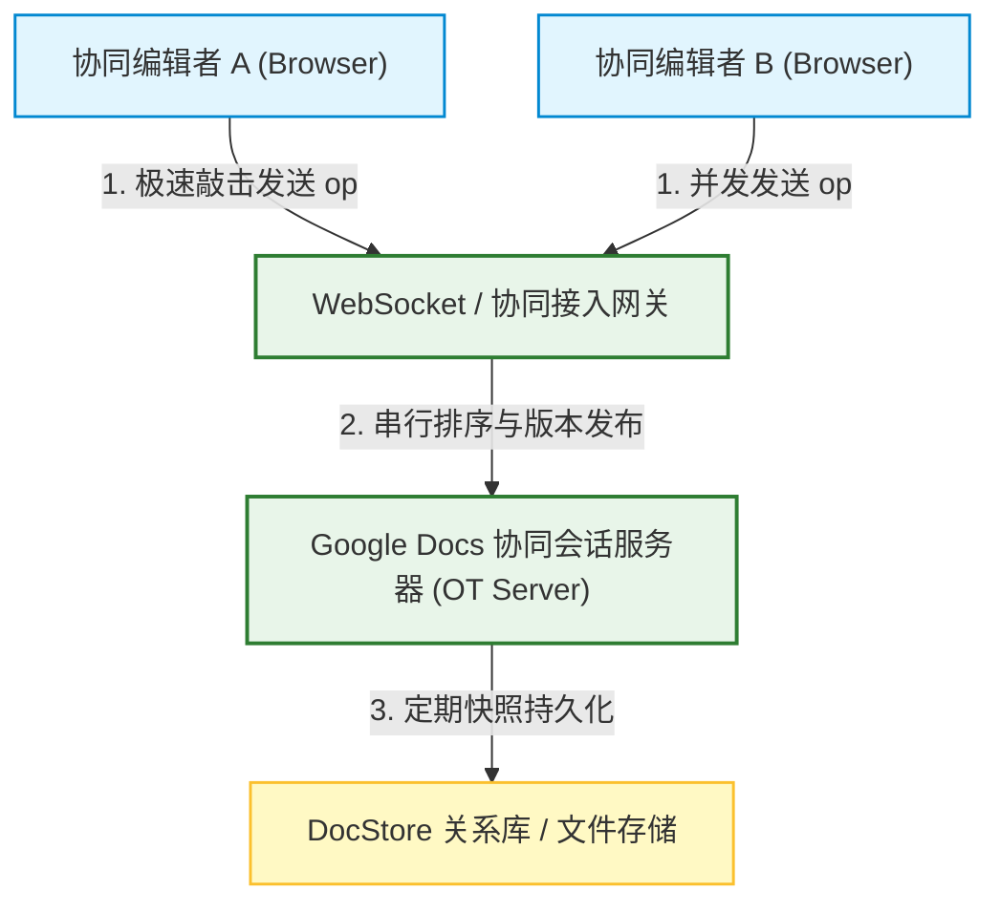
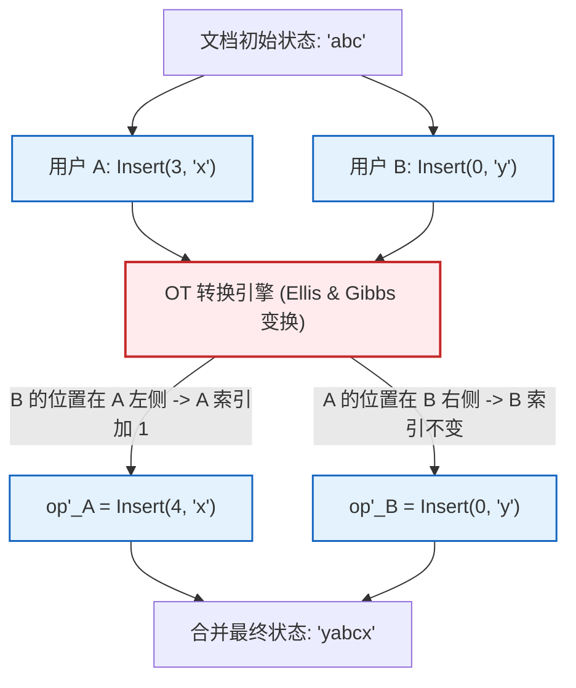
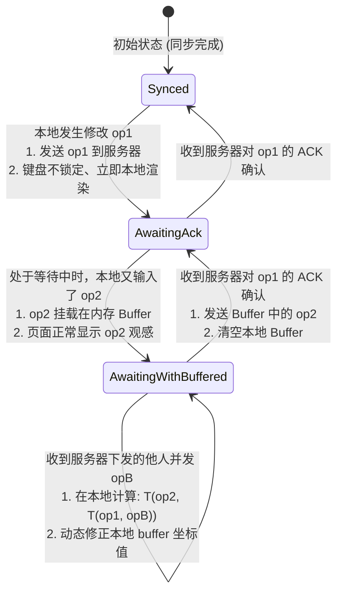
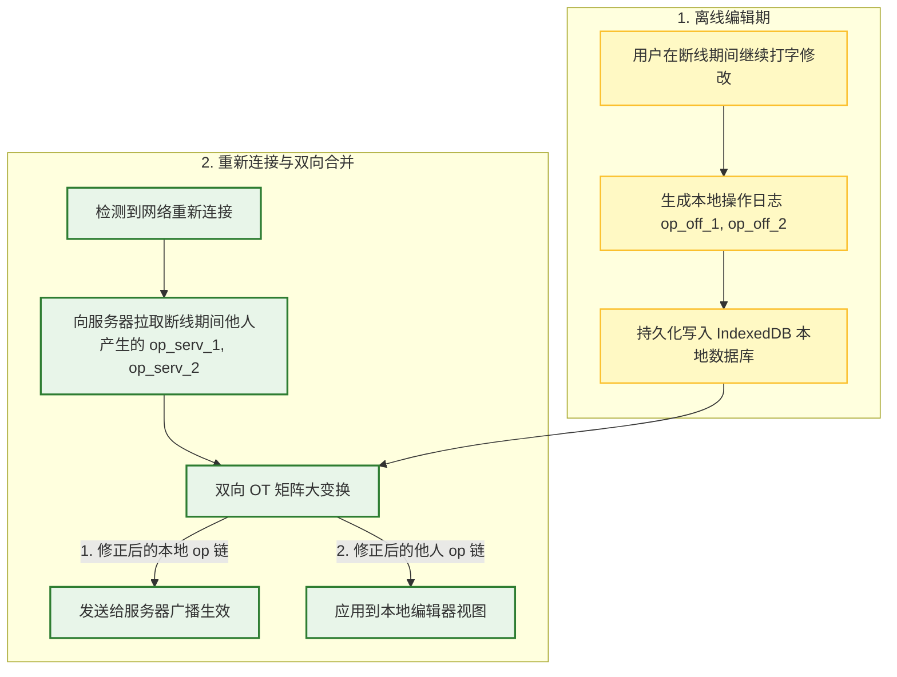

import CaseStudyHeader from '@site/src/components/CaseStudyHeader';
import DesignIntent from '@site/src/components/DesignIntent';
import EvolutionTimeline from '@site/src/components/EvolutionTimeline';
import CompareSlider from '@site/src/components/CompareSlider';
import TradeoffExplorer from '@site/src/components/TradeoffExplorer';
import GlossaryTerm from '@site/src/components/GlossaryTerm';
import ResearchNote from '@site/src/components/ResearchNote';
import GuidedExercise from '@site/src/components/GuidedExercise';
import QuizCard from '@site/src/components/QuizCard';
import MindMap from '@site/src/components/MindMap';

# Google Docs：多人协同编辑的 Operational Transformation (OT) 算法与在线同步架构

<CaseStudyHeader
  oneLiner="Google Docs 是多人实时协作系统的黄金标准。它通过『操作转换（Operational Transformation, OT）算法』实现并发修改的自动冲突合并与意图保留，利用单点中央服务器对所有操作进行权威版本序列化，结合客户端的『三状态编辑缓冲机制』保证了本地零卡顿的瞬时响应，并通过 IndexedDB 本地日志重放，实现了强韧的离线编辑与自动合并。"
  stats={[
    {label: '算法奠基', value: '1989 年 (Ellis & Gibbs)'},
    {label: '技术架构', value: '基于服务器序列化的 OT 引擎'},
    {label: '同步延迟', value: '毫秒级双向同步'},
    {label: '离线存储方案', value: 'HTML5 IndexedDB'},
    {label: '并发承载力', value: '支持数十人同屏极速编辑'},
    {label: '一致性收敛', value: '强一致最终收敛 (Convergence)'}
  ]}
/>

:::info 对应课程概念
本案例融合了以下课程核心概念：
*   **并发控制与最终一致性（Month 5）**：如何使用无锁的 OT 算法，在不可靠的分布式网络环境下实现多客户端状态的最终完全收敛。
*   **客户端状态机与缓存缓冲（Month 4）**：如何设计三状态编辑缓冲区，使本地编辑输入能够“零网络延迟”瞬间渲染，同时平滑处理未确认的并发冲突。
*   **离线重放与日志事务（Month 11 架构容错）**：如何将断线期间的本地操作（IndexedDB Logs）在网络重连后，与服务器的新版本进行增量合并。
:::

---

## 1. 设计初衷：实时协作的多维并发冲突之难

协同编辑的核心是解决**并发冲突**。传统的并发控制（如数据库行锁、乐观锁）在实时文档协同中会带来极差的体验：
1.  **锁死等待（Locking）**：如果用户 A 在写第一行时把整篇文档锁住，用户 B 只能等待其解锁，这根本谈不上“实时协同”。
2.  **暴力覆盖（Last-Write-Wins）**：若采用最后写入者胜策略，当用户 A 和 B 同时修改同一段话时，慢几毫秒到达服务器的请求会强行把另一个人的劳动成果彻底覆盖掉。
3.  **位置漂移（Position Shifting）**：假设文档初始内容为 `"abc"`。
    *   用户 A 在位置 3 插入 `"x"`，意图使文档变为 `"abcx"`（操作 op1 = Insert(3, "x")）。
    *   用户 B 瞬间在位置 0 插入 `"y"`，意图使文档变为 `"yabc"`（操作 op2 = Insert(0, "y")）。
    *   如果不做任何转换，A 的操作在 B 端执行时，位置 3 已经因为 B 插入了 `"y"` 而被整体向右推了一格，原本想插在 `"c"` 后面，结果却插在了 `"b"` 和 `"c"` 中间，导致文档变成了 `"yabxc"`，扭曲了用户的真实意图。

为此，Google Docs 采用了以 **OT 算法** 为核心的中央协同架构。

<DesignIntent
  problem="如何在网络延迟不确定、甚至频繁离线的移动与网页端，支撑多人对同一个富文本进行秒级数次的高频修改，并保证所有人的屏幕上展示的文档内容最终绝对一致，且不扭曲任何一个人的输入意图。"
  users="全球数亿在浏览器、手机端进行文档撰写、会议纪要实时协同的办公人员与团队。"
  devices="高度优化的网页端 JavaScript 运行时。后台为部署在 Google 云端的大规模协同网关与版本序列化引擎。"
  goals={[
    '极致本地输入时延：本地击键录入必须“零网络等待”即时渲染，不可因等待服务器 ACK 而卡顿',
    '最终一致性（Convergence）：所有参与编辑的客户端在接收完所有操作后，看到的文档内容完全一模一样',
    '意图保留（Intention Preservation）：当位置发生漂移时，自动将操作的 Index 进行偏移修正，保留其相对文字意图',
    '强韧的离线编辑：支持用户在离线状态下编辑数千字，并在网络重连后无感合并到服务器主版本上'
  ]}
  constraints={[
    '浏览器单线程 JS 限制：OT 的变换计算不能过于沉重，否则会在高频输入时引起页面掉帧',
    '网络乱序与包丢失：WebSocket 或 HTTP 传输可能发生操作包到达服务器乱序，必须由中央服务器强行赋予权威 Revision ID',
    '离线历史堆积：断线时间越长，本地积攒的操作与服务器主版本的差异越大，合并时的时空复杂度会大幅攀升'
  ]}
  firstStep="设计 Operation 数据结构（Retain / Insert / Delete）；将客户端解构为三状态状态机（Synced, AwaitingAck, AwaitingBuffered）；利用 WebSockets 与中央服务器进行版本序列号握手；编写 OT 核心转换函数并利用本地 IndexedDB 进行离线操作日志落地。"
/>

---

## 2. 知识全景脑图

<MindMap
  root={{
    label: 'Google Docs 协同架构',
    children: [
      {
        label: '操作与变换 (OT Engine)',
        children: [
          { label: 'Retain / Insert / Delete 操作结构' },
          { label: 'T(opA, opB) 转换函数' },
          { label: '意图保留 (Intention Preservation)' },
          { label: '最终一致性收敛 (Convergence)' }
        ]
      },
      {
        label: '客户端状态机 (Client State)',
        children: [
          { label: 'Synced 状态 (无未确认更改)' },
          { label: 'AwaitingAck 状态 (等待确认)' },
          { label: 'AwaitingWithBuffered 状态 (本地缓冲)' },
          { label: '本地差异转换' }
        ]
      },
      {
        label: '服务器序列化 (Server)',
        children: [
          { label: '单点权威序列化 (Revision ID)' },
          { label: '冲突抢占裁决' },
          { label: '全量广播 (Broadcast Fleet)' }
        ]
      },
      {
        label: '离线与容错 (Offline)',
        children: [
          { label: 'IndexedDB 操作日志持久化' },
          { label: '重连增量同步 (Replay)' },
          { label: '批量差异合并' }
        ]
      }
    ]
  }}
/>

---

## 3. 系统架构总览 (C Model)

以下是 Google Docs 多人实时协同编辑的三平面协同 C4 Context 与 Container 拓扑。

### 3a. System Context (系统上下文图)



### 3b. Container Diagram (容器结构图)

```mermaid
graph TB
    classDef client fill:#e1f5fe,stroke:#0288d1,stroke-width:2px;
    classDef serve fill:#e8f5e9,stroke:#2e7d32,stroke-width:1.5px;
    classDef cache fill:#ffebee,stroke:#c62828,stroke-width:1.5px;

    subgraph ClientA [编辑客户端 A (Browser)]
        EditorA["Rich Editor UI"]:::client
        BufferA["Client Buffer Manager<br/>(三状态转换器)"]:::client
        LocalDbA[("IndexedDB Local Store<br/>(离线操作日志)")]:::cache
        
        EditorA --> BufferA
        BufferA --> LocalDbA
    end

    UserConn["WebSocket Connection"] <--> ServerGateway["Docs Collaborator Server<br/>(权威排队节点)"]:::serve
    
    subgraph ServerBackend [Docs 协同服务器后端]
        ServerGateway --> OTManager["OT Transformation Core<br/>(冲突裁决与坐标转换机)"]:::serve
        OTManager --> VersionLog[("Revision Log Database<br/>(存储绝对递增的 op 历史)")]:::serve
    end

    BufferA <-->|发送并接收 op| UserConn
```

---

## 4. 核心机制拆解

### 4a. 操作转换算法原理 (Operational Transformation)

OT 算法的核心是：假设有两个并发操作 $op_A$ 和 $op_B$。
系统并不通过排它锁去阻塞其中一个，而是通过转换函数，将它们变成对应的 $op'_A$ 和 $op'_B$，满足：
$$op_A \cdot op'_B \equiv op_B \cdot op'_A$$

这代表“在 A 的基础上应用转换后的 B，所得到的文档状态，与在 B 的基础上应用转换后的 A 得到的文档状态完全等价”。

#### 经典转换逻辑（以 Insert 为例）：
假设文档初始内容为 `"abc"`：
*   用户 A 在索引 3 处插入 `"x"`：op_A = Insert(3, "x")。
*   用户 B 在索引 0 处插入 `"y"`：op_B = Insert(0, "y")。
*   **OT Server 的冲突裁决**：
    *   对于 A（在 B 已发生的基础上）：由于 B 在索引 0 插入了 `"y"`，这在 A（索引 3）的左侧。因此，A 的插入位置必须往右偏 1 格。转换后的操作 op'_A = Insert(3 + 1, "x") = Insert(4, "x")。
    *   对于 B（在 A 已发生的基础上）：由于 A 的插入点（索引 3）在 B（索引 0）的右侧，B 的插入完全不受 A 影响。转换后的操作 op'_B = Insert(0, "y")。
*   **执行合并**：
    *   A 端应用 $op'_B$：`"abc" + Insert(0, "y") -> "yabc"`，再执行 $op'_A$ 的转换版：`Insert(4, "x") -> "yabcx"`。
    *   B 端应用 $op'_A$：`"abc" + Insert(4, "x") -> "yabcx"`。双方屏幕内容完美收敛。



---

### 4b. 客户端三状态编辑缓冲区设计

为了让用户在打字时感觉不到网络延迟，客户端不能采取“发送请求 -> 锁定键盘 -> 等待 ACK”的同步模式。
Google Docs 设计了**三状态客户端编辑器缓冲状态机**：

1.  **Synced（同步状态）**：客户端没有本地未提交的修改。本地显示的文档内容与服务器绝对一致。
2.  **AwaitingAck（等待确认状态）**：用户在本地敲下字符 $op_1$，客户端立即将其渲染在屏幕上，并把 $op_1$ 发往服务器，此时状态切换为 `AwaitingAck`。在此期间，客户端拒绝向服务器发送新的操作。
3.  **AwaitingWithBuffered（等待确认且带缓冲状态）**：在等待 $op_1$ 的 ACK 期间，用户继续打字输入了 $op_2$。由于目前正处于 `AwaitingAck`，客户端不能发送 $op_2$。它将 $op_2$ 放入本地的 `Buffer` 中，页面上照常渲染 $op_2$ 的效果（观感极其平滑），此时切换为 `AwaitingWithBuffered`。

#### 状态转换与并发合并：
*   如果此时服务器发来其他人的并发操作 $op_B$。
*   由于本地有未确认的 $op_1$ 和正在缓冲的 $op_2$，客户端会将 $op_B$ 与本地的 $op_1, op_2$ 执行 **本地 OT 转换**。
*   修正本地 buffer 中的索引坐标，保证页面局部渲染不发生混乱。
*   一旦收到服务器对 $op_1$ 的确认（ACK），状态切回 `AwaitingAck`，并立即发送已经过修正的 `Buffer` 中的 $op_2$。



---

### 4c. 离线编辑与 IndexedDB 增量日志重放 (Offline Merge)

当用户处于飞机舱内或弱网下时，WebSockets 断开，客户端自动进入**离线编辑模式**。
*   **本地日志落地**：离线状态下，用户的所有插入、删除动作被打包成 operations，并按顺序追加写入到操作系统的 HTML5 本地数据库 **IndexedDB** 中，防止浏览器标签页意外关闭导致数据丢失。同时，本地维护一个庞大的虚版本 Revision 链。
*   **重连增量同步（Replay）**：当网络重连后，客户端向服务器查询自断网那一刻的 `Revision ID` 起服务器发生的所有增量 operations。
*   **大跨度 OT 合并**：客户端将本地 IndexedDB 积攒的这几百条 offline 动作，与服务器在断网期间产生的所有 edits 进行**大跨度双向 OT 矩阵转换**。将本地操作的索引坐标大范围修正后，分批追加推送到服务器，完成无冲突的“自动合并”。



<ResearchNote
  title="操作转换 (OT) 算法的分布式一致性奠基"
  source="Ellis and Gibbs (1989), Concurrency Control in Groupware Systems (SIGMOD)"
  href="https://dl.acm.org/doi/10.1145/67544.66963"
  insight="Ellis 和 Gibbs 首次提出了操作转换（OT）的概念。他们证明了在高延迟协作网络中，传统的悲观锁与乐观控制无法共存。通过将操作的“执行顺序”与“空间物理索引”相解耦，利用动态转换矩阵，系统能在无中央排它锁的前提下达成分布式最终一致性（Convergence），这奠定了现代 Google Docs 协同引擎的理论大厦。"
  application="架构启示：在分布式协同系统中，**“意图保留（Intention Preservation）”**往往比纯粹的数据最终一致更难做到。如果只追求一致，直接用 Last-Write-Wins 覆盖即可，但这抹杀了用户劳动成果。OT 的本质在于**在尊重每个人历史意图的基础上，通过空间指数偏移修正，达成事实上的多端画面统一**。这也契合了课程 Month 11 中数据一致性与分布式事务控制章节。"
/>

---

## 5. 关键数据结构与算法

### Operational Transformation 算法核心实现

在协同编辑器中，最基本的操作包括：
*   `Insert(pos, char)`: 在 `pos` 索引处插入字符 `char`。
*   `Delete(pos, len)`: 在 `pos` 索引处删除长度为 `len` 的字符。

#### 核心转换函数 `T(opA, opB)` 的逻辑分流：
若有两个并发操作 `opA` 和 `opB`：
1.  **A 与 B 均为 Insert**：
    *   `opA = Insert(posA, charA)`, `opB = Insert(posB, charB)`
    *   若 `posA < posB`：`opA` 的插入位置在 `opB` 左侧。转换后的 `opA'` 保持不变：`opA' = opA`。
    *   若 `posA > posB`：`opA` 的插入位置在 `opB` 右侧。由于 `opB` 往左边插了 1 个字符，`opA'` 的插入位置必须往右移动：`opA' = Insert(posA + 1, charA)`。
    *   若 `posA == posB`：发生同索引并发冲突。系统通过用户 ID 的字典序或 Server 随机判决决定先后顺序。例如 A 的优先级高，则 `opA' = opA`，而 `opB' = Insert(posB + 1, charB)`。
2.  **A 为 Insert，B 为 Delete**：
    *   `opA = Insert(posA, charA)`, `opB = Delete(posB, lenB)`
    *   若 `posA <= posB`：`opA` 的插入位置在 `opB` 发生删除的左侧。`opA` 保持不变：`opA' = opA`。
    *   若 `posA > posB + lenB`：`opA` 在删除区间的右侧。由于左边删除了 `lenB` 长度字符，`opA'` 的位置必须往左缩进：`opA' = Insert(posA - lenB, charA)`。
    *   若 `posB < posA <= posB + lenB`：插入点恰好处于被删除的区间内部。此时删除操作把插入位置“吞噬”了，`opA` 需要调整为贴着被删除区间的起点：`opA' = Insert(posB, charA)`。

---

## 6. 架构演进史

Google Docs 从单机版的文字处理器，到实时协作平台的演进，是 SaaS 协作演化的活化石：

<EvolutionTimeline
  events={[
    {
      year: '2005',
      title: 'Writely 时代：单用户 HTML 编辑器',
      why: '早期的 Web 技术（Ajax 未成熟）不支持多人实时编辑。文档保存在服务器，每次保存都需要全量提交 HTML 内容，极易覆盖他人修改。',
      change: '推出基于浏览器 iframe 属性设计的基础富文本编辑；保存采用整包覆盖更新，不支持多人同时编辑。'
    },
    {
      year: '2010',
      title: 'Google Docs 实时 OT 时代',
      why: '收购 Writely 与 Wave 协议后，多人协同成为刚需。需要彻底解决高并发击键下的“覆盖冲突”与“位置漂移”问题。',
      change: '彻底重构底层，推出基于 WebSocket 的中央序列化 OT 引擎；引入客户端三状态编辑缓冲区，实现“零延迟”录入与最终一致性收敛。'
    },
    {
      year: '2018',
      title: '离线优先与 IndexedDB 矩阵融合时代',
      why: '办公场景延伸至移动端、飞机舱等无网/弱网环境，纯在线 WebSocket 断线会导致编辑器不可用，极度影响体验。',
      change: '引入 HTML5 离线缓存，开发离线状态下的 IndexedDB 操作日志流水归档；设计了重连后大跨度双向 OT 矩阵变换合并，实现了“离线编辑、在线无缝合流”。'
    }
  ]}
/>

---

## 7. 架构对比：OT (操作转换) 架构 vs. CRDT (冲突无冲突复制数据类型)

<CompareSlider
  before={
    <div style={{ padding: '20px', background: '#ffebee', border: '1px solid #c62828', borderRadius: '8px', height: '100%', color: '#333' }}>
      <strong>OT 操作转换架构 (Google Docs 模式)</strong>
      <p style={{ marginTop: '10px', fontSize: '0.9rem' }}>基于中央服务器序列化修订版本。操作以轻量级 Insert/Delete 位置索引形式流转，占用带宽极小。非常适合有中心管理（文件权限控制、版本树归档）的企业协同云平台。但对中央服务器有强依赖，不支持完全去中心化的 P2P 协同。</p>
    </div>
  }
  after={
    <div style={{ padding: '20px', background: '#e8f5e9', border: '1px solid #2e7d32', borderRadius: '8px', height: '100%', color: '#333' }}>
      <strong>CRDT 协同架构 (Yjs / Figma 模式)</strong>
      <p style={{ marginTop: '10px', fontSize: '0.9rem' }}>去中心化架构，将文档的每个字符赋予一个全局唯一的 UUID。并发修改时，无须中央服务器仲裁，客户端间直接广播字符状态即可达成一致。支持纯 P2P 离线合流。但缺点是内存消耗大（每个字符都要挂载元数据，容易发生元数据膨胀）。</p>
    </div>
  }
  labels={['OT 架构 (有中心服务器)', 'CRDT 架构 (无中心/P2P)']}
/>

---

## 8. 权衡：多人协同系统的关键抉择折中

协同编辑系统在网络同步和并发控制下面临着多项设计取舍：

<TradeoffExplorer
  title="Google Docs 协同实时性、流量与本地内存折中"
  dimensions={['本地输入响应时延', '网络带宽耗费', '中央服务器算力要求', '离线冲突合并成功率', '代码开发与算法复杂度']}
  options={[
    {
      name: '客户端三状态缓冲区设计',
      scores: [5, 4, 3, 4, 2],
      note: '在等待 ACK 时将新修改积压在本地 Buffer，不阻断打字渲染。保证了极佳的敲击响应速度（时延为0）。但代价是客户端状态机变得极其复杂，需要在前端维护未决的 OT 坐标变换，增加了前端 Bug 调试成本。',
      whenToUse: '高频击键、对本地录入丝滑程度有严苛要求的文字/表格协同编辑系统。'
    },
    {
      name: '纯去中心化 CRDT 模式 (Yjs / Automerge)',
      scores: [4, 2, 5, 5, 3],
      note: '无须中央服务器介入，多端直接通过 P2P 广播唯一 UUID 字符链。极大减轻了中心主机的算力消耗，且天然契合完全离线的跨地域多活。缺点是网络传输包体明显变大（元数据体积是正文的数倍），在超长文档中内存消耗剧烈。',
      whenToUse: '去中心化社交、完全离线协同、或者是白板画图等状态分散的轻量协作应用。'
    },
    {
      name: '服务器定时全量覆盖 (天级批合并)',
      scores: [1, 5, 5, 1, 5],
      note: '放弃实时协同，用户各自编辑本地文件，提交时由服务器强行覆盖，或者弹窗让用户手动选“保留谁的”。开发极简，带宽消耗极低，但多人同时操作时会导致严重的劳动成果被覆盖丢失。',
      whenToUse: '多为单人编辑、极少产生多人并发修改的传统静态网盘归档系统。'
    }
  ]}
/>

---

## 9. 如果是你来设计：单行文本 OT 冲突合并器

### 场景设想
在协同编辑器的 OT 核心中，两个客户端（User A 与 User B）同时对一个初始字符串为 `"hello"` 的文档进行并发插入编辑：
*   User A 在索引 5 处插入 `"A"`（意图变为 `"helloA"`）。
*   User B 在索引 5 处插入 `"B"`（意图变为 `"helloB"`）。
*   假设服务器判决 User A 具有较高的字典序优先级。

请你用 Python 实现一个基础的 **OT 变换器**，完成对这两个并发 Insert 操作的坐标变换与文档合流。

<GuidedExercise
  title="基于 Python 的 Operation 转换与 OT 合流模拟器实现"
  goal="编写代码实现 T(opA, opB) 转换逻辑，处理并发插入索引碰撞，并最终校验两端合并后的文本状态是否严格一致。"
  steps={[
    '步骤 1: 设计 Operation 数据结构。使用类 `Op(action, pos, text)` 表达一个操作，其中 `action` 固定为 "insert"。',
    '步骤 2: 实现 `transform(op_a, op_b)` 核心算法。判断当 `op_a.pos > op_b.pos` 时，由于 b 在左侧插入，a 的索引必须向右移 `len(op_b.text)` 长度；当 `op_a.pos == op_b.pos` 且我们判定 a 优先级高时，a 的索引保持不变，而 b 变换后的 `op_b_prime` 其索引位置需右移 `len(op_a.text)`。',
    '步骤 3: 模拟多端应用操作。定义 `apply_op(base_str, op)` 辅助函数，将 insert 操作作用在原始字符串上。',
    '步骤 4: 执行双向变换测试。A 端应用 `op_a`，接着应用变换后的 `op_b_prime = transform(op_b, op_a)`；B 端应用 `op_b`，再应用变换后的 `op_a_prime = transform(op_a, op_b)`。核对双方最终得到的字符串是否绝对等价（均收敛为 "helloAB"）。'
  ]}
  checks={[
    '确认对于相同位置的并发插入，高优先级的操作保持索引不变，低优先级操作能够自动右移避让',
    '确认 A 端与 B 端合并后的字符串完全相等，达成最终一致收敛',
    '验证当一个操作处于另一个操作的左侧时，左侧操作执行不受影响 (索引不变)'
  ]}
/>

---

## 10. 知识自测

<QuizCard
  questions={[
    {
      q: '在协同编辑系统的 OT 算法中，所谓“意图保留 (Intention Preservation)”其核心概念是指：',
      options: [
        'A. 强行锁定文档使其不被其他人编辑以保留发帖人的劳动成果',
        'B. 当多端并发修改引发文档字符位置漂移时，算法通过“空间坐标偏移修正”，确保操作能正确作用在用户原本期望的字符或段落相对位置上，不扭曲用户的修改意图',
        'C. 每次保存都向服务器发送一份全量文档的 PDF 快照存档',
        'D. 限制每次协同编辑的用户上限不能超过 3 人'
      ],
      answer: 1,
      explain: '意图保留是 OT 算法的灵魂。在分布式并发编辑下，由于网络延迟，A 端的索引坐标在发往 B 端时，B 端的文档结构已经发生了变化。如果不做偏移修正（例如插入点根据左侧新增字符数右移），操作会被作用在错误的字符中间，毁坏文章结构。'
    },
    {
      q: '关于 Google Docs 客户端设计的三状态编辑缓冲区（Synced -> AwaitingAck -> AwaitingWithBuffered），以下说法正确的是：',
      options: [
        'A. 当处于 AwaitingAck 状态时，客户端键盘会被完全锁死，直至收到服务器的 ACK',
        'B. 客户端通过将未确认的本地修改暂存到内存 Buffer 中，在等待 ACK 期间照常渲染用户输入，并在收到 ACK 后分批推给服务器。这消除了网络 RTT 对打字丝滑程度的影响，实现了本地零时延体验',
        'C. 状态机是由 Git 仓库在 broken links 警告发生时被动拉起的',
        'D. Synced 状态意味着该文档正在执行离线的批量 Translog 清空'
      ],
      answer: 1,
      explain: '为了实现流畅的本地体验，客户端将“屏幕上呈现修改”和“服务器最终确认修改”进行了时间解耦。将未决的操作暂存在 AwaitingWithBuffered 缓冲区，并允许本地对新飞来的他人操作执行局部 OT 换算，保全了极佳的打字响应。'
    },
    {
      q: '在离线协作编辑场景下，网络重新连接后，客户端是如何使用本地 IndexedDB 缓存的离线操作日志与服务器合并的？',
      options: [
        'A. 直接将本地的 IndexedDB 数据整包覆盖服务器上的文档主版本，舍弃断线期间他人的所有提交',
        'B. 客户端查询断网起服务器增加的历史 op，将本地 IndexedDB 积攒的操作与服务器这些 edits 进行大跨度的双向 OT 矩阵交叉变换，各自校正位置偏移后，再分批向服务器推送并本地应用',
        'C. 强制要求所有离线用户手动对账并自行解决每一行冲突',
        'D. 重连后自动短路服务器的 Paxos 复制以腾出网络带宽'
      ],
      answer: 1,
      explain: '这是一次时空跨度极大的 OT 演练。离线期本地积累了多个 operations，服务器也向前推进了多个 revisions。通过在重连阶段执行本地和服务器操作序列的双向矩阵 OT 变换，把时空坐标重新拉齐，实现了无痛的自动合并。'
    }
  ]}
/>

---

## 来源清单

*   [Ellis and Gibbs (1989), Concurrency Control in Groupware Systems (SIGMOD)](https://dl.acm.org/doi/10.1145/67544.66963)
*   [Sun et al. (1998), Operational Transformation for Concurrency Control in Real-time Collaborative Editors](https://dl.acm.org/doi/10.1109/43.736861)
*   [Google Wave Protocol Team (2010), Google Wave Operational Transformation Whitepaper](https://wave-protocol.googlecode.com/export/7/spec/protocol/googlewave-protocol-spec.html)
*   [Collaborative Editing: Google Docs under the hood](https://medium.com/coinmonks/operational-transformation-the-technology-behind-collaborative-writing-274dbe274be4)
