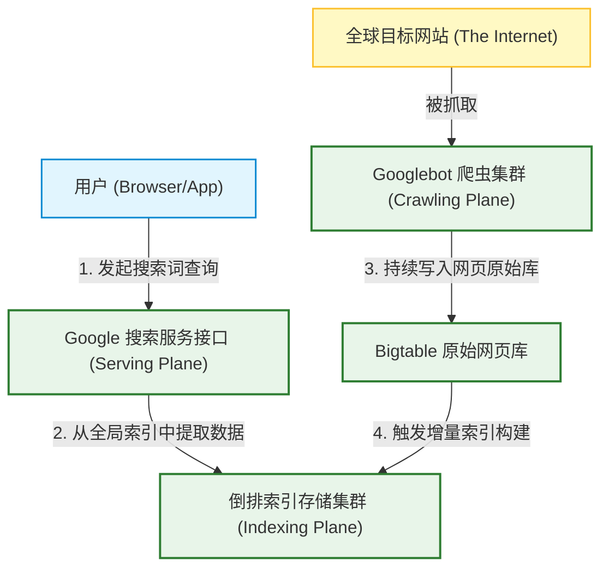
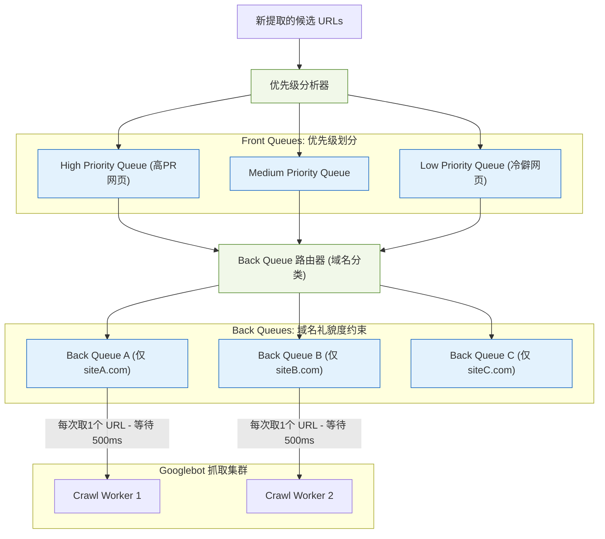
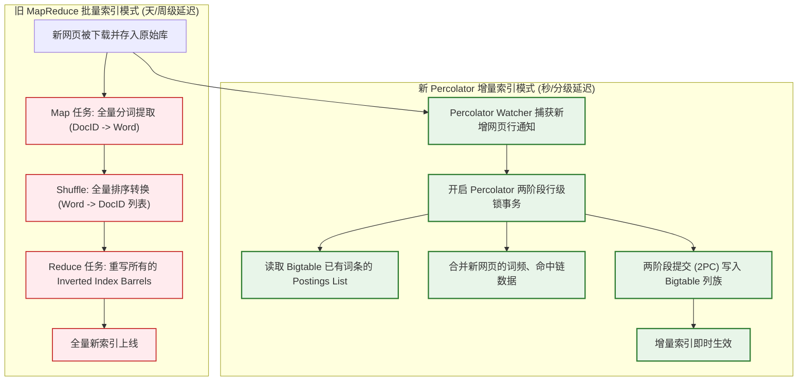
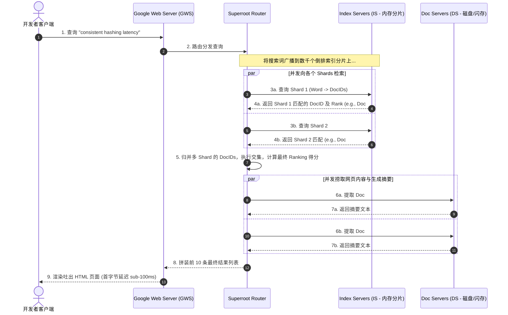

import CaseStudyHeader from '@site/src/components/CaseStudyHeader';
import DesignIntent from '@site/src/components/DesignIntent';
import EvolutionTimeline from '@site/src/components/EvolutionTimeline';
import CompareSlider from '@site/src/components/CompareSlider';
import TradeoffExplorer from '@site/src/components/TradeoffExplorer';
import GlossaryTerm from '@site/src/components/GlossaryTerm';
import ResearchNote from '@site/src/components/ResearchNote';
import GuidedExercise from '@site/src/components/GuidedExercise';
import QuizCard from '@site/src/components/QuizCard';
import MindMap from '@site/src/components/MindMap';

# Google Search：万亿级网页的爬取、索引与服务三平面架构

<CaseStudyHeader
  oneLiner="Google Search 的架构是超大规模分布式系统的终极代表。它通过将万亿级网页处理流程切分为相互隔离、异步协作的『爬取平面』、『索引平面』与『服务平面』，在保持数据持续更新（Freshness）的同时，实现了全球并发下亚 100 毫秒的检索响应。"
  stats={[
    {label: '诞生年份', value: '1998 年 (Stanford)'},
    {label: '收录网页量', value: '数万亿 (Trillions)'},
    {label: '每日搜索请求', value: '数十亿次'},
    {label: '查询响应延迟', value: 'Sub-100ms'},
    {label: '实时索引技术', value: 'Percolator / Caffeine'},
    {label: '核心算法基础', value: 'PageRank + RankBrain'}
  ]}
/>

:::info 对应课程概念
本案例融合了多项系统架构与 AI 工程核心概念：
*   **分布式事务与增量状态（Month 5/11）**：如何通过 Percolator 事务框架在 Bigtable 上实现增量式索引构建。
*   **搜索与召回通道（Month 8 RAG）**：如何在大规模 RAG 的前身——传统搜索引擎中，利用“倒排索引”与“命中链”实现极速文本匹配。
*   **平台级调度与熔断（Month 11）**：万级服务器集群（Index & Doc Servers）中如何处理尾延迟（Tail Latency）与单点失败。
:::

---

## 1. 设计初衷：万亿级信息检索的物理墙

搜索引擎的目标是“整理全球信息，供人人使用”。然而，要在万亿网页中瞬间找到匹配结果，系统必须克服三个根本性物理瓶颈：**数据规模之墙**（网页数量和体积呈几何级增长）、**时效性之墙**（网页内容瞬息万变）与**低延迟之墙**（用户期望在敲击回车后瞬间看到答案）。

为了突破这些瓶颈，Google 确立了将系统彻底切分为“爬取”、“索引”和“服务”三个平面的解耦架构。

<DesignIntent
  problem="如何在网页极其庞大且杂乱、链接错综复杂的环境下，高效下载全网网页，在数据不断增量更新的同时建立全局检索目录，并为数十亿用户提供高并发、亚秒级、高相关的检索响应。"
  users="全球数十亿互联网用户，随时随地进行海量领域的自然语言或关键词查询。"
  devices="支持从移动端、PC 浏览器到各种 API 客户端，主要计算压力全部卸载在 Google 全球超大规模数据中心中。"
  goals={[
    '极致查询延迟：全球范围内，最终结果拼接完成时间控制在 100ms 左右',
    '超强更新时效：打破 MapReduce 的批处理周期限制，实现新爬取网页的“秒级/分钟级”增量更新上线',
    '精确相关度排序：不仅匹配关键字字面，还要计算网页权威度（PageRank）以及语义相关度',
    '海量容错性：假设成千上万台商用服务器随时可能发生单点崩溃，检索服务必须不掉线且不吐错'
  ]}
  constraints={[
    '单机磁盘 I/O 极其有限，无法在线线性扫描万亿网页，必须高度 Sharding（分片）并驻留内存',
    '网页链接关系图规模极其庞大（万亿顶点，十万亿边）， PageRank 矩阵乘法计算量惊人',
    '爬虫调度必须遵守道德规范（Robots.txt）与网络带宽配额，不能压垮目标网站服务器',
    '网络传输与卡间延迟：全球分布式中心之间的数据分发成本高昂，必须使用高效的序列化与本地缓存'
  ]}
  firstStep="设计分布式的 Googlebot 爬虫集群，建立全局 URL Frontier 调度表；利用 MapReduce 批处理（后升级为 Percolator 增量事务）将爬回的网页解构成倒排索引（Inverted Index）；通过 GWS（网关）和 Superroot 分发至 Index Servers 和 Doc Servers 进行并行查询。"
/>

---

## 2. 知识全景脑图

<MindMap
  root={{
    label: 'Google Search 架构全景',
    children: [
      {
        label: '爬取平面 (Crawling)',
        children: [
          { label: 'URL Frontier 调度' },
          { label: 'Googlebot 爬虫集群' },
          { label: 'DNS 预解析 & 缓存' },
          { label: 'Robots.txt 规范过滤器' }
        ]
      },
      {
        label: '索引平面 (Indexing)',
        children: [
          { label: '网页分词与清理' },
          { label: '倒排索引 (Inverted Index)' },
          { label: 'Percolator 增量事务' },
          { label: '词表与 Posting List 压缩' }
        ]
      },
      {
        label: '服务平面 (Serving)',
        children: [
          { label: 'GWS 前端网关' },
          { label: 'Superroot 路由调度' },
          { label: 'Index Servers (文本匹配)' },
          { label: 'Doc Servers (摘要生成)' }
        ]
      },
      {
        label: '算法与重算 (Algorithms)',
        children: [
          { label: 'PageRank 链接分析' },
          { label: 'RankBrain 深度相关性' },
          { label: '特征归一化与融合' }
        ]
      }
    ]
  }}
/>

---

## 3. 系统架构总览 (C4 Model)

以下是 Google 搜索引擎的三平面协同 C4 Context 与 Container 拓扑。

### 3a. System Context (系统上下文图)



### 3b. Container Diagram (容器结构图)

```mermaid
graph TB
    classDef crawl fill:#fff9c4,stroke:#fbc02d,stroke-width:1.5px;
    classDef index fill:#ffebee,stroke:#c62828,stroke-width:1.5px;
    classDef serve fill:#e1f5fe,stroke:#0288d1,stroke-width:2px;
    classDef store fill:#e8f5e9,stroke:#2e7d32,stroke-width:1.5px;

    subgraph CrawlPlane ["1. 爬取平面"]
        Frontier["URL Frontier<br/>(优先级/礼貌度队列)"]:::crawl
        Googlebot["Googlebot Crawler Fleet<br/>(高并发下载器)"]:::crawl
        PageRepo["Repository<br/>(网页临时中转库)"]:::crawl
        
        Frontier --> Googlebot --> PageRepo
    end

    subgraph IndexPlane ["2. 索引与数据平面"]
        Percolator["Percolator Engine<br/>(增量索引构建器)"]:::index
        BigtableIndex["("Bigtable 倒排库<br/>Lexicon / Postings")"]:::store
        
        PageRepo --> Percolator --> BigtableIndex
    end

    subgraph ServePlane ["3. 服务平面"]
        UserApp["用户客户端"] -->|HTTP Query| GwsServer["Google Web Server (GWS)"]:::serve
        GwsServer -->|调度分发| Superroot["Superroot Router<br/>(并发分发与结果合并)"]:::serve
        
        Superroot -->|并发查询 Shards| IndexServers["Index Servers<br/>(驻留内存的倒排检索节点)"]:::serve
        Superroot -->|获取网页摘要| DocServers["Doc Servers<br/>(摘要生成与片段提取器)"]:::serve
        
        BigtableIndex -.->|只读同步装载到内存| IndexServers
        BigtableIndex -.->|装载文档正文| DocServers
    end
```

---

## 4. 核心机制拆解

### 4a. 爬取与吞吐调度引擎 (Crawling & URL Frontier)

爬取平面是整个搜索引擎的源头。它不仅要追求极高的并发下载速度，还要遵守“礼貌度（Politeness）”约束，即同一时间内不能向同一个域名发起过多请求以防压垮对方服务器。

*   **URL Frontier**：内部通过**双重队列**机制来解决“优先级”与“礼貌度”冲突。
    *   **FIFO 优先级队列（Front Queue）**：按网页 PageRank 得分将 URL 分入不同优先级通道。
    *   **礼貌度域名队列（Back Queue）**：每个 Back 队列仅存放同一个域名的所有 URL，并且由一个独立的工作线程轮询提取，每次发包后强制实施指数避让退避延迟（Politeness delay）。



---

### 4b. 索引平面：从 MapReduce 批量构建到 Percolator 增量事务

在 2010 年前，Google 依靠 MapReduce 周期性重构全网倒排索引。但随着动态新闻和社交网络的爆发， MapReduce 的**批处理高延迟缺陷**暴露无遗——为了更新 1 个新网页，不得不对全网数千亿网页进行重组排序。

Google 推出了 **Caffeine (咖啡因) 架构**，其核心是运行在 Bigtable 分布式数据库之上的 **Percolator 事务引擎**。它将索引构建改为“基于事件通知的增量式（Incremental）”架构：
*   一旦爬虫下载新网页，自动触发 Percolator 事务。
*   Percolator 利用 Bigtable 的多版本时间戳和两阶段提交（2PC），对该网页的链接和关键词索引执行行级单事务更新。
*   这样，网页从被抓取到可以被搜索到，从原先的“数周”缩短到了“秒级”。



<ResearchNote
  title="Percolator：在大规模分布式数据库上提供强一致性两阶段提交"
  source="Peng and Dabek (2010), Large-scale incremental processing using distributed transactions and notifications (OSDI)"
  href="https://www.usenix.org/conference/osdi10/large-scale-incremental-processing-using-distributed-transactions-and"
  insight="Google 开发了 Percolator 以取代大规模索引重构中的 MapReduce。它利用 Bigtable 的行级原子性作为锁媒介，在没有中央协调器的前提下，实现了跨越数万台服务器的数据行级分布式事务。它通过 Watcher 机制驱动的“增量处理”，使索引更新耗费的计算量与网页的改动大小成正比，彻底解决了时效性问题。"
  application="架构启示：当批处理（Batch）架构的“重算开销”随着系统底层状态规模线性暴增时，向“增量事件流（Event-driven Incremental）”重构是唯一的系统出路。Percolator 的设计直接启发了后来的分布式事务数据库（如 TiDB 的 Percolator 分布式事务模型）。"
/>

---

### 4c. 服务平面：GWS & Superroot 的极速分发与并网

用户的搜索词一旦进入 GWS，就进入了极其恐怖的**高并发并行检索网**。

为了在 100ms 内完成检索，Google 将倒排索引拆分为数万个**分片（Shards）**。
*   **GWS** 负责接收请求并转发给核心节点 **Superroot**。
*   **Superroot** 将搜索词拆分为多个叶子查询，同时分发到数千台 **Index Servers（索引服务器，IS）**，每个 IS 只负责检索自己内存中负责的那一小部分网页 Shard 倒排表，并快速挑出匹配的 Top K DocIDs。
*   **Superroot** 将各 IS 返回的结果进行快速交集归并，计算粗排分数，得到最相关的 10 个网页 ID。
*   **Superroot** 接着向 **Doc Servers（文档服务器，DS）** 发起请求，DS 根据网页 ID 从磁盘/SSD 闪存中捞取网页标题、URL 并动态生成上下文相符的摘要片段（Snippet）。
*   GWS 将最终摘要、标题、广告渲染拼接为 HTML 返回给用户。



---

## 5. 关键数据结构与算法

### 5a. 倒排索引与命中链结构 (Inverted Index & Hit List)

搜索引擎的物理基石是**倒排索引（Inverted Index）**。
在结构上，它由 **Lexicon（词典表）** 和 **Postings List（倒排链）** 组成：

*   **Lexicon**：驻留在内存中的哈希表/B+树，记录了每个 Term（词）及其对应的 Postings List 文件偏移指针。
*   **Postings List**：记录了所有包含该 Term 的 `DocID` 链。
*   **Hit List（命中列表）**：对于每个 DocID，Postings List 中还携带了一个 Hit List，记录了该词在文档中的位置（Offset）、字体大小、是否处于标题/描述中（用于计算邻近度与加权分值）。

```mermaid
graph LR
    classDef mem fill:#e3f2fd,stroke:#1565c0,stroke-width:1.5px;
    classDef disk fill:#f1f8e9,stroke:#558b2f,stroke-width:1.5px;
    classDef hits fill:#eceff1,stroke:#37474f,stroke-width:1.5px;

    subgraph Memory ["内存词典表 - Lexicon"]
        Term1["'consistent'"]:::mem --> Pointer1["Offset: 0x08F3"]
        Term2["'hashing'"]:::mem --> Pointer2["Offset: 0x090A"]
    end

    subgraph DiskOrMemory ["倒排链 - Postings List"]
        Pointer1 --> DocA["DocID: 12 (Rank: 0.8)"]:::disk
        DocA --> DocB["DocID: 35 (Rank: 0.6)"]:::disk
        
        DocA --> HitsA["Hit List: [Pos: 14 (Title), Pos: 120 (Body)"]"]:::hits
        DocB --> HitsB["Hit List: [Pos: 45 (Body)"]"]:::hits
    end
```

为了节约海量数据的传输带宽与磁盘空间，Postings List 中的 `DocID` 采用**差分编码（Delta Encoding）**，即不存储原始 ID，而是存储与前一个 ID 的差值（d-gap）。由于差值通常很小，可以使用 **Varint（可变长度整型）** 或 **Elias-Gamma/Golomb** 算法进行高压缩，将单 DocID 占用空间从 32-bit 压缩至平均低于 4-bit。

---

### 5b. PageRank 算法：链接拓扑权威度计算

PageRank 是 Google 奠定搜索引擎市场统治地位的杀手锏算法。它将整个互联网看作一个巨大的**有向图（Directed Graph）**，通过模拟一个“随机漫游者（Random Surfer）”在网页链接间跳转的稳态概率，计算出每个网页的绝对权威度。

PageRank 的转移状态方程为：
$$PR(A) = (1 - d) + d * (PR(T1)/C(T1) + PR(T2)/C(T2) + ... + PR(Tn)/C(Tn))$$

*   $PR(A)$：目标网页 $A$ 的 PageRank 分值。
*   $d$：阻尼系数（Damping Factor，通常设为 $0.85$），即用户有 85% 的概率通过当前网页的链接点下去，有 15% 的概率直接输入新 URL 跳走（这解决了死循环链接或孤立网页的概率汇聚问题）。
*   $PR(T_i)$：指向网页 $A$ 的前向关联网页 $T_i$ 的 PageRank 分值。
*   $C(T_i)$：网页 $T_i$ 拥有的外链总数（一个网页外链越多，分给每个外链网页的权重就越被稀释）。

```mermaid
graph LR
    classDef node fill:#e1f5fe,stroke:#0288d1,stroke-width:2px;

    PageA["网页 A (PR=0.45)"]:::node -->|外链数 C=2| PageB["网页 B (PR分流)"]:::node
    PageA -->|外链数 C=2| PageC["网页 C (PR分流)"]:::node
    
    PageD["网页 D (PR=0.80)"]:::node -->|外链数 C=1| PageB
    
    Note over PageB: PR(B) = (1-d) + d * (PR(A)/2 + PR(D)/1)
```

在工程落地上，由于链接有向图极其庞大，Google 采用**幂迭代法（Power Iteration）**。将转移概率写成一个巨大的稀疏矩阵，用成千上万台服务器集群（早期基于 MapReduce 的矩阵向量乘法，后基于 Pregel 图计算模型）在后台不断迭代重算该矩阵，直到概率向量收敛。得到的稳态 PageRank 值将被持久化，在 Serving 阶段直接作为静态相关度因子（Static Rank）叠加到网页打分公式中。

---

## 6. 架构演进史

Google 搜索系统架构的升级，是支撑互联网内容大爆炸的典型过程：

<EvolutionTimeline
  events={[
    {
      year: '1998',
      title: 'Stanford 原型系统：MapReduce 奠基',
      why: '斯坦福大学早期的单机原型系统在面对百万级网页时，磁盘 I/O 成为死锁瓶颈，急需一种能用廉价 PC 机群横向扩展的批量计算框架。',
      change: 'Larry Page 与 Sergey Brin 提出倒排索引与 PageRank 算法；后续引入了 GFS、MapReduce 和 Bigtable “三驾马车”，通过批处理构建倒排索引。'
    },
    {
      year: '2010',
      title: 'Caffeine 架构：增量索引的飞跃',
      why: 'MapReduce 批处理模型具有天级/周级延迟，完全跟不上实时新闻和博客的刷新率，且重算代价巨大。',
      change: '废弃 MapReduce 倒排构建链，推出 Percolator 事务框架。通过事件 Watcher 和 Bigtable 行级事务锁，实现网页“抓取即更新”，时效性从“周”缩短到“分钟级”。'
    },
    {
      year: '2015+',
      title: 'AI 注入时代：RankBrain 与向量召回',
      why: '传统字面关键词匹配（Lexical Match）无法理解同义词与用户的真实模糊意图，容易被恶意 SEO 欺骗。',
      change: '引入深度学习模型 RankBrain，将搜索词与网页转化为高维向量空间进行近似近邻（ANN）检索。将字面匹配（Inverted Index）与语义匹配（Neural Search）有机融合，开启了现代 RAG 的语义地基。'
    }
  ]}
/>

---

## 7. 架构对比：MapReduce 批索引 vs. Percolator 增量索引

<CompareSlider
  before={
    <div style={{ padding: '20px', background: '#ffebee', border: '1px solid #c62828', borderRadius: '8px', height: '100%', color: '#333' }}>
      <strong>MapReduce 批处理索引架构 (2010年前)</strong>
      <p style={{ marginTop: '10px', fontSize: '0.9rem' }}>系统周期性（如每周）拉起庞大的 MapReduce 离线任务，将全网数千亿网页的原始数据全部重新排序、重写倒排索引桶（Barrels）。为了插入 1 个新网页，不得不重算 100% 的静态索引，数据更新延迟极高，时效性很差。</p>
    </div>
  }
  after={
    <div style={{ padding: '20px', background: '#e8f5e9', border: '1px solid #2e7d32', borderRadius: '8px', height: '100%', color: '#333' }}>
      <strong>Percolator 增量事件事务架构 (今天)</strong>
      <p style={{ marginTop: '10px', fontSize: '0.9rem' }}>基于 Bigtable 列存的时间戳多版本锁，网页一经抓取立即触发单行级 Percolator 事务，仅对该网页涉及到的词项 Posting List 进行就地追加与合并。更新代价与改动量呈正比，新网页可在数秒内完成索引构建并提供服务。</p>
    </div>
  }
  labels={['旧 MapReduce 批量索引', '新 Percolator 增量索引']}
/>

---

## 8. 权衡：搜索引擎关键架构设计的折中谱系

Google 搜索在三平面协同及在线检索上面临着多个维度的架构取舍：

<TradeoffExplorer
  title="Google Search 检索时延与时效性优化手段取舍"
  dimensions={['查询延迟 (RTT)', '索引刷新率 (Freshness)', '系统吞吐量', '开发与运维复杂度', '硬件存储成本']}
  options={[
    {
      name: '按 DocID Sharding 索引分片',
      scores: [5, 4, 3, 4, 3],
      note: '将全网网页按 DocID 的哈希随机分配给不同的 Index Server 节点。查询时，必须向所有 Shard 节点广播搜索词，每个节点独立返回局部 Top K，再由 Superroot 归并。极大降低了单次查询的响应延迟（并行度极高），但广播风暴增加了集群总体的网络开销。',
      whenToUse: '对实时查询时延（Latency）有极高硬性约束的大型搜索引擎。'
    },
    {
      name: '按 Term Sharding 索引分片',
      scores: [3, 4, 5, 2, 4],
      note: '将同一词项对应的整个 Postings List 存放在单一服务器上。查询时，仅需把请求路由到对应 Term 的机器上，无广播风暴。但如果遇到高频词（如 “the”, “code”），该服务器会瞬间因负载过高而成为严重系统瓶颈（热点问题）。',
      whenToUse: '数据规模较小、并发较高但查询词汇高度分散的场景。'
    },
    {
      name: 'Percolator 强一致性两阶段提交 (2PC)',
      scores: [3, 5, 3, 1, 4],
      note: '使用 Bigtable 锁在全网索引构建时提供强一致性保障，绝不出现脏数据或死锁。代价是 2PC 的分布式锁开销显著增加了写入延迟，吞吐量比不上纯粹的无锁最终一致性写入。',
      whenToUse: '当多个爬虫与分析器同时更新同一个大网页的链接图谱、需要保障强一致性的索引地基时。'
    },
    {
      name: '基于 RankBrain 的语义向量召回',
      scores: [3, 3, 2, 2, 1],
      note: '利用深度神经网络对模糊同义词进行近似近邻匹配。解决了字面搜索无法识别用户意图的千古难题，显著提升质量。缺点是计算代价极高（需要重型 GPU 进行向量计算与 ANN 索引检索），显存开销非常昂贵。',
      whenToUse: '算力富余、且需要处理大量模糊口语化提问的高级语义搜索引擎。'
    }
  ]}
/>

---

## 9. 如果是你来设计：倒排索引与 Posting 压缩算法

### 场景设想
在搜索引擎的索引平面中，词项 `"latency"` 对应的 Postings List 包含以下 5 个匹配的网页 ID（DocIDs）：
`[1024, 1035, 1090, 1200, 2048]`。

如果使用传统的 32-bit 未压缩整型存储，这 5 个 ID 将占用 **20 bytes**（160 bits）的存储空间。在数万亿网页的尺度下，这会导致磁盘与内存溢出。

请你设计一个 **Delta 差分压缩算法**，在本地模拟将该倒排链压缩存储。

<GuidedExercise
  title="基于 Delta-Varint 的 Posting List 压缩算法设计"
  goal="编写一段 Python 代码，实现对 DocID 数组的差分转换与 Varint（可变字节整型）编码压缩，并验证其空间节省效率。"
  steps={[
    '步骤 1: 执行差分编码 (Delta Encoding)。计算相邻 DocID 的差值。原数组为 [1024, 1035, 1090, 1200, 2048]，转换后第一个数为原值，后续存储与前者的差值。即得到 Delta 数组：[1024, 11, 55, 110, 848]。',
    '步骤 2: 实现 Varint 变长编码器。对 Delta 数组中的每个数字，将其转换为 7-bit 字节块。每个字节的最高位（MSB，第 8 位）作为 continuation bit：若后续还有字节，则 MSB 置 1；若是当前数字的最后一个字节，则 MSB 置 0。',
    '步骤 3: 编码计算。对于小数字 11 (二进制 1011)，仅需 1 个字节存储为 0x0B (最高位置0)；对于大数字 1024 (二进制 10000000000)，拆为 7-bit 分段，编码后占用 2 个字节：[0x88, 0x00] (最高位接续标记)。',
    '步骤 4: 执行解码核对。编写解码逻辑，读取 Varint 字节流，还原出 Delta 数组，再通过累加恢复出原始的 [1024, 1035, 1090, 1200, 2048] 网页 ID 链。'
  ]}
  checks={[
    '确认转换后的差分数值中，较小的差值占用了极少的字节数 (1 byte)',
    '确认整个 Varint 字节流能够无损还原回初始的 DocID 数组',
    '计算最终压缩后的字节大小，验证其空间占用是否比原始的 20 字节缩减了 50% 以上'
  ]}
/>

---

## 10. 知识自测

<QuizCard
  questions={[
    {
      q: 'Google Caffeine 架构引入 Percolator 事务引擎来取代 MapReduce 批量索引构建，最核心的动因是什么？',
      options: [
        'A. 因为 Bigtable 无法支持 MapReduce 的并行文件写入',
        'B. 为了解决 MapReduce 批量计算的高昂重算延迟。通过在 Bigtable 上实现增量事务更新，网页能够被“抓取即索引”，时效性由天/周级缩短为分钟级',
        'C. 降低倒排索引的压缩率以节约内存',
        'D. 绕过 Robots.txt 协议以强行抓取被屏蔽的隐私网页'
      ],
      answer: 1,
      explain: '在 MapReduce 时代，即使只有 1 个新网页更新，也必须将全网索引放在一起重新洗牌（Shuffle）与重写，代价高昂。Percolator 的增量事务机制使得新下载的网页行通过 Watcher 触发局部事务，直接与 Bigtable 中已有 Posting List 进行就地合并，极大地提升了时效性。'
    },
    {
      q: '在 Google 检索服务平面中，GWS、Superroot、Index Servers (IS) 与 Doc Servers (DS) 之间的协作逻辑，以下描述正确的是：',
      options: [
        'A. 用户请求直接打到 Doc Servers，Doc Servers 负责捞取倒排链，最后交给 Index Servers 压缩',
        'B. GWS 接收请求并派发给 Superroot。Superroot 广播查询给数千台 Index Servers (IS，内存倒排检索)，IS 返回 Top K 匹配的 DocID；Superroot 归并后向 Doc Servers (DS) 获取具体网页正文摘要 (Snippet) 并拼接结果',
        'C. Index Servers 和 Doc Servers 都是冷备份节点，只有在 Percolator 故障时才被唤醒',
        'D. 每次查询都需要让 Superroot 扫描 Bigtable 上的全部原始 HTML 数据'
      ],
      answer: 1,
      explain: '这是一套高度并行的三阶段执行链。Index Servers 负责最吃 CPU/内存的“倒排索引文本搜索”，快速挑出匹配的网页 ID 并粗排；Doc Servers 负责吃磁盘 I/O 的“摘要动态裁剪与正文还原”。分工明确，避免了资源瓶颈堆积在单个节点上。'
    },
    {
      q: '关于倒排索引（Inverted Index）中差分编码（Delta Encoding）与变长整型（Varint）压缩的原理，以下哪项陈述是正确的？',
      options: [
        'A. 差分编码是为了将所有的 DocID 全部加密成无规律的散列哈希以防数据泄漏',
        'B. 由于 Postings List 中的 DocID 是递增排列的，通过只存储与前一个 ID 的差值，可以使数字变得极小；再使用变长整型只为小数字分配 1 个字节，能将平均存储开销压缩 70% 以上，极大缓解内存压力',
        'C. Varint 压缩会显著降低 Index Servers 的检索并行度',
        'D. 变长整型压缩在 Docusaurus 静态网页生成时用于解决 broken links 警告'
      ],
      answer: 1,
      explain: '搜索引擎的核心瓶颈是内存空间与卡间带宽。由于网页 ID 排序后递增，其差值 $d_{gap}$ 绝大多数集中在个位数到百位数之间。Varint 用可变长的 7-bit 数据块加 1-bit 接续标记表示，小数字仅用 1 字节即可存放，比强制分配 4 字节的固定整型节约了巨大的物理显存与网络带宽。'
    }
  ]}
/>

---

## 来源清单

*   [Brin and Page (1998), The Anatomy of a Large-Scale Hypertextual Web Search Engine (Stanford)](https://infolab.stanford.edu/~backrub/google.html)
*   [Peng and Dabek (2010), Large-scale incremental processing using distributed transactions and notifications (Percolator/Caffeine)](https://www.usenix.org/conference/osdi10/large-scale-incremental-processing-using-distributed-transactions-and)
*   [Google Blog: Our new search index: Caffeine (2010)](https://googleblog.blogspot.com/2010/06/our-new-search-index-caffeine.html)
*   [Dean and Ghemawat (2004), MapReduce: Simplified Data Processing on Large Clusters](https://static.googleusercontent.com/media/research.google.com/en//archive/mapreduce-osdi04.pdf)
*   [High Scalability: Google Search Serving Infrastructure Details](https://highscalability.com/google-search-serving-infrastructure-details/)