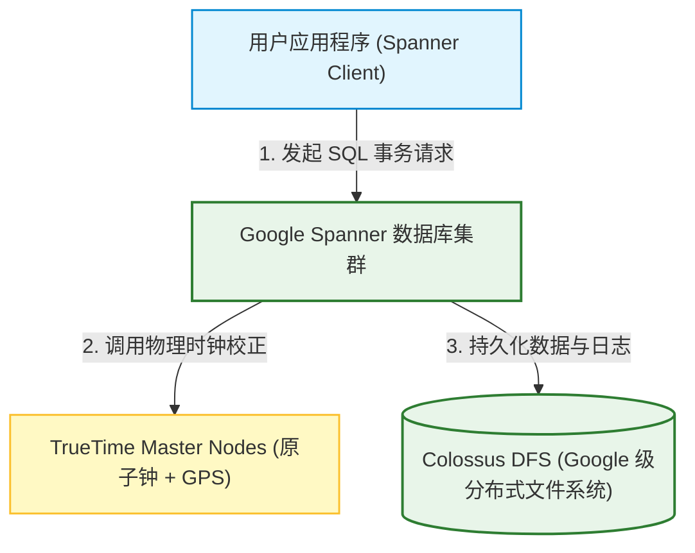
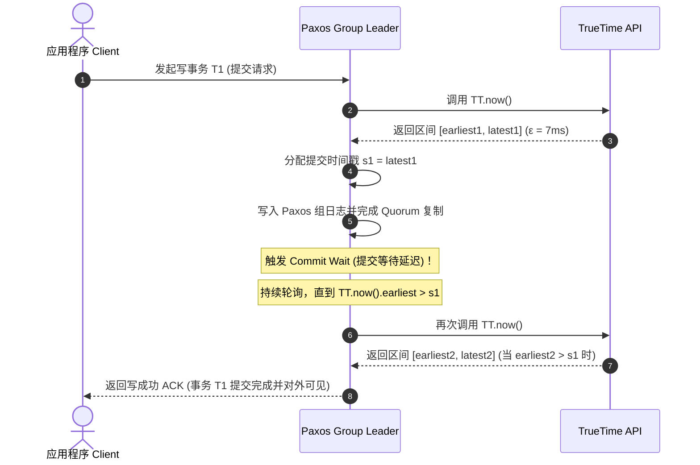
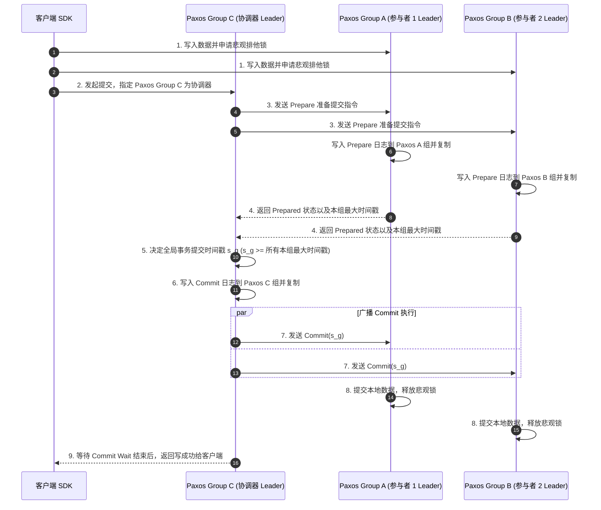
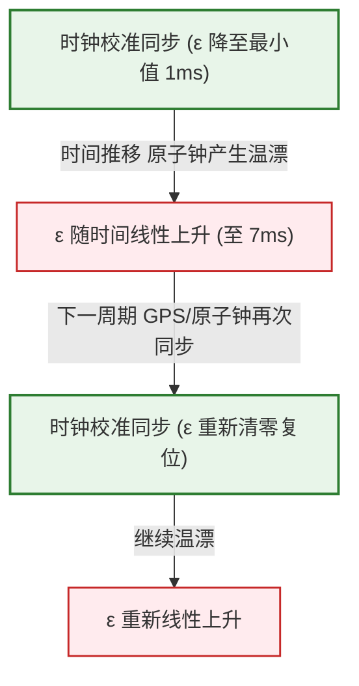

import CaseStudyHeader from '@site/src/components/CaseStudyHeader';
import DesignIntent from '@site/src/components/DesignIntent';
import EvolutionTimeline from '@site/src/components/EvolutionTimeline';
import CompareSlider from '@site/src/components/CompareSlider';
import TradeoffExplorer from '@site/src/components/TradeoffExplorer';
import GlossaryTerm from '@site/src/components/GlossaryTerm';
import ResearchNote from '@site/src/components/ResearchNote';
import GuidedExercise from '@site/src/components/GuidedExercise';
import QuizCard from '@site/src/components/QuizCard';
import MindMap from '@site/src/components/MindMap';
import PyRunner from '@site/src/components/PyRunner';

# Google Spanner：全球级分布式 SQL 数据库、TrueTime API 与强一致性架构

<CaseStudyHeader
  oneLiner="Google Spanner 是分布式数据库历史上的革命性创新。它在跨广域网的多机房节点间同时提供了外部一致性（线性一致性）与 SQL 事务，利用原子钟与 GPS 硬件构建的 TrueTime API 将时钟漂移硬限制在个位数毫秒内，并通过 Paxos 组副本复制与两阶段提交（2PC）的融合，实现了 PB 级数据下的全球金融级强一致写入。"
  stats={[
    {label: '存储模型', value: '全球分布式关系型 SQL'},
    {label: '一致性协议', value: 'Multi-Paxos + 二阶段提交'},
    {label: '核心授时', value: 'TrueTime API (原子钟 + GPS)'},
    {label: '时间误差上限', value: '1 ~ 7 毫秒 (ε)'},
    {label: '隔离级别', value: '外部一致性 / 序列化隔离'},
    {label: '存储底层', value: 'LSM-like Colossus SSTable'}
  ]}
/>

:::info 对应课程概念
本案例融合了以下课程核心概念：
*   **分布式共识与副本复制（Month 5/12）**：Paxos Group 在跨地域副本同步中的应用，强 Leader 选举与多数派存活机制。
*   **线性一致性与外部一致性（Month 5 强一致）**：利用物理时钟同步，如何实现“事务时间戳顺序严格对应物理真实时间发生顺序”。
*   **分布式事务并发控制（Month 5 事务）**：结合两阶段锁 (2PL) 与两阶段提交 (2PC) 的强一致事务执行，以及基于 Paxos 容错的分布式锁。
*   **多版本并发控制 MVCC（Month 3 数据引擎）**：利用只读时间戳实现无锁的全局只读事务。
:::

---

## 1. 设计初衷：全球化强一致性与 SQL 的回归

在 Spanner 诞生之前，业界普遍认为在广域网尺度下，强一致性关系型数据库与水平伸缩性是不可调和的矛盾：
1.  **NoSQL 的易用性地狱**：
    *   以 Bigtable、Dynamo 为代表的早期 NoSQL 数据库通过放弃 SQL 事务、次级索引以及强一致性，换取了 PB 级数据的线性水平伸缩。
    *   这导致业务开发团队必须在应用层编写大量复杂的补偿代码来应对数据冲突、乱序提交与部分成功，带来了极高的研发成本与生产隐患。
2.  **“外部一致性”的物理死锁**：
    *   在传统的分布式数据库中，由于物理服务器的时钟漂移是随机且无上限的（网络 NTP 同步误差通常在数十至数百毫秒不等），系统无法通过简单的物理时间戳来决定全球事务的提交先后顺序。
    *   为了实现全局<GlossaryTerm term="外部一致性" definition="外部一致性即线性一致性，指在分布式系统中，如果事务 T2 在事务 T1 提交返回后才开始发起，则 T2 的时间戳和生效顺序必须在 T1 之后，确保全局时序与真实物理时间严格一致。">外部一致性（线性一致性）</GlossaryTerm>（即“如果写事务 $T_2$ 在写事务 $T_1$ 提交后发起，则 $T_2$ 的时间戳必定大于 $T_1$”），传统方案不得不求助于单点全局授时器（如 TSO），但这会让广域网通信遭遇物理光速的时延瓶颈。
3.  **专用硬件的工程学突围**：
    *   Google 的设计团队决定打破常规：既然纯软件时钟漂移无上限，那么便引入**原子钟（Rubidium Clocks）**与 **GPS 天线**硬件，在每个数据中心部署专有的时钟节点，将全球时钟漂移控制在 7ms 之内。
    *   配合 <GlossaryTerm term="Commit Wait" definition="Spanner 实现外部一致性的核心算法。Leader 节点分配事务提交时间戳 s = latest 后，必须强制等待直至物理时间绝对跨过 s (即 TT.now().earliest > s)，方可将成功结果返回客户端，以消化时钟漂移误差。">Commit Wait (提交等待)</GlossaryTerm> 算法，使得数据库能够直接利用物理时钟作为全局事务的逻辑时间戳，从而开创了全球多活强一致性的物理地基。

<DesignIntent
  problem="如何在跨全球多个地理数据中心、PB 级海量关系型数据的规模下，同时提供外部一致性（线性一致性）、强 SQL 事务支持、以及跨可用区的多数派自动高可用容灾。"
  users="全球运行广告账单系统、核心用户金融账户、以及跨地域多活核心元数据管理的 Google 内部及云平台架构设计团队。"
  devices="运行在配备主时钟（原子钟、GPS）的 Google 全球骨干网络和 Spanserver 物理集群中。客户端通过 Cloud Spanner SDK 进行强一致调用。"
  goals={[
    '外部一致性保障：全局事务时间戳严格对应物理世界发生顺序，消除乱序提交',
    '无锁只读事务：只读事务通过读取指定历史版本 (MVCC) 就近就地快速完成，完全不阻塞在线写入',
    '高可用两阶段提交：把 2PC 的每个协调器和参与者都做成 Multi-Paxos 共识组，根除传统 2PC 单点崩溃导致事务卡死的弊端',
    'PB 级自动分片：按 Range 对 Tablet 自动进行分裂（Split）与重平衡，对业务完全透明'
  ]}
  constraints={[
    '硬件强依赖：必须依靠原子钟与 GPS 授时硬件。若时钟偏差上限 ε 异常放大，会导致写事务的 Commit Wait 延迟显著增长',
    '写事务网络开销：涉及跨 Paxos Group 的写事务必须经过 2PC，提交时延受物理光速广域网往返（RTT）的直接限制',
    'Schema 变更锁：复杂的 Schema 变更需要通过特定的版本演进算法，以确保全局不同物理机房的节点无缝切换'
  ]}
  firstStep="在每个 Spanserver 内部搭建 Multi-Paxos 组与存储 Tablet；引入 TrueTime API 软硬件时钟校验管道；实现 Commit Wait 逻辑；构建两阶段锁 (2PL) 与跨 Paxos 组的二阶段提交 (2PC) 事务框架。"
/>

---

## 2. 知识全景脑图

### 2a. 全景架构思维导图
```mermaid
mindmap
  root((Google Spanner))
    数据组织与存储
      Spanserver
      Tablet 数据分片
      Colossus 分布式文件系统
      MVCC 多版本存储
    副本与共识
      Paxos Group
      Paxos Leader 读写路由
      Paxos Followers 副本就近读
    TrueTime 授时 API
      GPS 授时源
      原子钟 (温漂备份)
      时间段最早/最晚 [earliest, latest]
      时钟漂移上限 ε (小于 7ms)
    分布式事务
      外部一致性
      Commit Wait 提交等待
      二阶段锁 (2PL) 并发控制
      二阶段提交 (2PC) 跨组事务
      Paxos-Backed 2PC (无单点卡死)
    高阶特性
      无锁只读事务
      自动分片重均衡
      Directory 逻辑分片
```

### 2b. 交互脑图导航
<MindMap
  root={{
    label: 'Google Spanner 核心架构',
    children: [
      {
        label: '路由与复制 (Replication)',
        children: [
          { label: 'Spanserver 调度网关' },
          { label: 'Paxos Group 强副本一致' },
          { label: 'Directory 数据逻辑分片' }
        ]
      },
      {
        label: 'TrueTime 授时 (Time)',
        children: [
          { label: '原子钟与 GPS 硬件' },
          { label: '时间段误差区间 [earliest, latest]' },
          { label: '时钟误差上限 ε' }
        ]
      },
      {
        label: '事务控制 (Transactions)',
        children: [
          { label: '外部一致性与 Commit Wait' },
          { label: '跨组分布式事务 2PC' },
          { label: '读写事务二阶段锁 2PL' },
          { label: 'MVCC 零锁只读事务' }
        ]
      }
    ]
  }}
/>

---

## 3. 系统架构总览 (C4 Model)

以下是 Google Spanner 客户端、Spanserver 节点副本、TrueTime 授时守护进程以及底层 Colossus 分布式存储系统的 C4 Context 与 Container 拓扑。

### 3a. System Context (系统上下文图)



### 3b. Container Diagram (容器结构图)

```mermaid
graph TB
    classDef client fill:#e1f5fe,stroke:#0288d1,stroke-width:2px;
    classDef container fill:#e8f5e9,stroke:#2e7d32,stroke-width:1.5px;
    classDef node fill:#ffebee,stroke:#c62828,stroke-width:1.5px;
    classDef component fill:#fff9c4,stroke:#fbc02d,stroke-width:1.5px;

    Client["Spanner Client SDK"]:::client -->|1. 写请求路由至分片 Leader| SpanserverLeader["Spanserver Node (Paxos Leader)"]:::container
    Client -->|2. 只读请求就近路由| SpanserverFollower["Spanserver Node (Paxos Follower)"]:::container

    subgraph SpanserverContainer [Spanserver 内部容器结构 (以 Leader 节点为例)]
        SpanserverLeader -->|3. 调用获取当前时间区间| TrueTimeDaemon["TrueTime Daemon (本地硬件同步进程)"]:::component
        SpanserverLeader -->|4. 分片并发读写锁定| LockTable["Lock Table (单机二阶段锁 2PL)"]:::component
        SpanserverLeader -->|5. 事务日志与状态协调| TxManager["Transaction Manager (二阶段提交 2PC 协调/参与者)"]:::component
        
        SpanserverLeader -->|6. 共识日志同步| PaxosGroup["Paxos Group 共识复制实例"]:::component
    end

    PaxosGroup -->|7. 异步刷写 SSTable| ColossusStorage[("Colossus Storage (SSTable)")]:::node
    SpanserverFollower -->|快照版本读| ColossusStorage
```

---

## 4. 核心机制拆解

### 4a. 基于 Paxos Group 的分片副本复制机制

Spanner 将整个数据库中的数据划分为多个 Tablet（类似于行段的物理切片），并将多个 Tablet 逻辑聚合成 Directory。每一个 <GlossaryTerm term="Paxos Group" definition="在 Spanner 中，每个数据分片（Tablet）的多个副本组成一个 Multi-Paxos 共识组，由其中的 Leader 负责写请求路由与共识提案，多数派（Quorum）确认后持久化，从而提供高可用和强一致副本复制。">Paxos Group</GlossaryTerm> 负责维护一组 Directory 的多个物理副本：
1.  **强 Leader 读写路由**：读写事务（Write / Read-Write）的请求必须发送到对应 Paxos Group 的 Leader 节点上。Leader 具有排他写权限，并负责分配事务的时间戳。
2.  **共识日志同步**：写操作先由 Leader 写入本地 Paxos 日志，并在 Paxos Group 内部进行跨地域（跨数据中心）广播，当获得**多数派节点（Quorum）**的确认写入后，该事务才算达成共识，进而在本地提交并更新到 SSTable 存储中。
3.  **Follower 副本分流**：普通的只读事务（Read-Only）可以由 Client 随机路由到就近的 Follower 节点读取，从而极大地降低了全球广域网通信时延，分担了 Leader 的查询压力。

```mermaid
graph TD
    classDef router fill:#e3f2fd,stroke:#1565c0,stroke-width:1.5px;
    classDef leader fill:#ffebee,stroke:#c62828,stroke-width:2px;
    classDef follower fill:#e8f5e9,stroke:#2e7d32,stroke-width:1.5px;

    ClientWrite["Client 写事务请求"] -->|1. 路由至 Paxos Group 3 Leader| Leader3["Paxos Leader Node 3 (AZ-1)"]:::leader
    
    Leader3 -->|2. 广播 Paxos 提案日志| Follower3_1["Paxos Follower Node 3 (AZ-2)"]:::follower
    Leader3 -->|2. 广播 Paxos 提案日志| Follower3_2["Paxos Follower Node 3 (AZ-3)"]:::follower
    
    Follower3_1 -->|3. 返回写入成功 ACK| Leader3
    Note over Leader3: 获得 2/3 多数派确认！<br/>事务本地 Commit 并写入 Colossus
    
    Leader3 -->|4. 返回客户端写成功| ClientWrite
```

---

### 4b. 外部一致性与 TrueTime Commit Wait 机制

这是 Spanner 的技术王冠。为了实现外部一致性，Spanner 设计了 <GlossaryTerm term="TrueTime API" definition="Google Spanner 基于 GPS 和原子钟硬件提供的授时 API，它返回一个包含误差范围的闭区间 [earliest, latest]，将全球服务器之间的时钟误差硬限制在 ε (通常为 1-7ms) 内。">TrueTime API</GlossaryTerm>。
TrueTime 并不返回一个单独的时间戳，而是一个包含误差范围的闭区间：`[earliest, latest]`，其误差半宽为 $\epsilon$（在正常状态下，时钟漂移最大不超过 7ms）：
1.  **事务时间戳分配**：当事务 T1 准备提交时，Paxos Leader 调用 TrueTime 获取当前的最新时间区间 `TT.now()`。系统会强制将 T1 的提交时间戳 s1 设置为当前 TrueTime 区间的最晚值 t1.latest。
2.  **Commit Wait (提交等待)**：为了确保绝对正确的物理顺序，Leader 收到 s1 后，**绝对不会立即返回成功给客户端**。它必须强行阻塞等待，直至物理时间绝对跨过 s1（即当再次调用 `TT.now()` 时，其 `earliest > s1`）。
3.  **线性一致性达成**：一旦最早时间 `earliest` 跨过了 s1，这意味着现实物理世界的时间已经 100% 超过了 s1（无论其他节点的时钟如何朝哪个方向漂移，它们获取的最早时间都不可能小于 s1）。此时，在 T1 提交返回后发起的任何事务 T2，其分配到的时间戳 s2 必定大于 s1，从而完美保障了线性一致性。



---

### 4c. 两阶段提交 (2PC) 与 Paxos 组的结合

当一个事务需要写入多个 Paxos Group 负责的分片数据时，Spanner 必须使用<GlossaryTerm term="两阶段提交" definition="一种用于保证跨多个分布式节点/分片原子性写入的协议。包含准备（Prepare）和提交（Commit）两个阶段。经典 2PC 存在单点协调器崩溃导致事务卡死的问题，Spanner 通过将参与者和协调器均用 Paxos 组承载来解决此问题。">二阶段提交（2PC）</GlossaryTerm>协议来保证原子性：
1.  **传统 2PC 的阿喀琉斯之踵**：传统的 2PC 中，协调器（Coordinator）和参与者（Participant）都是单点进程。如果协调器在第二阶段前崩溃，整个事务将被永久卡死（事务阻塞，锁无法释放）。
2.  **Paxos 容错融合**：Spanner 创造性地将 **2PC 中的每个“协调器”与“参与者”进程，都用一个高可用的 Multi-Paxos Group 来承载**。
3.  **秒级继承**：即便某个分片的 Paxos Leader 物理挂掉，该 Paxos Group 也会在秒级内选出新的 Leader 节点。新 Leader 会在本地读取 Paxos 日志并重构事务状态，继续推进或回滚未完成的 2PC 事务，彻底消除了单点崩溃导致的全局阻塞风险。



---

### 4d. 多版本并发控制 (MVCC) 与无锁只读事务

Spanner 内部维护了<GlossaryTerm term="MVCC" definition="多版本并发控制，指通过保留数据的多个历史版本（附带时间戳），使得只读事务可以指定读取某一历史快照，无需申请锁即可实现非阻塞读取的技术。">多版本并发控制（MVCC）</GlossaryTerm>，即数据的更新不会覆盖旧数据，而是会保留历史版本并附带其提交时间戳 $s$。
这为只读事务打开了极其高效的设计空间：
1.  **分配只读时间戳**：只读事务（Read-Only）在启动时，由 Client 获取当前的最新时间戳 T_read = TT.now().latest。
2.  **就近快照读**：Client 带着 T_read 时间戳，向就近的 Paxos 副本节点发起读取。副本节点直接过滤出数据在 T_read 刻度上的快照版本并返回。
3.  **零锁零阻塞**：由于只读事务读取的是历史快照版本，它**不需要申请任何读锁或排他锁**。只读事务和在线写事务互不干扰，实现了彻底的读写分离。

```mermaid
graph TD
    classDef write fill:#ffebee,stroke:#c62828,stroke-width:1.5px;
    classDef read fill:#e1f5fe,stroke:#0288d1,stroke-width:1.5px;
    classDef storage fill:#e8f5e9,stroke:#2e7d32,stroke-width:2px;

    TxWrite["写事务 (在 s=150 写入 data='NewValue')"]:::write -->|1. 准备提交| PaxosLeader["Paxos Leader (AZ-1)"]:::write
    
    PaxosLeader -->|2. 分配时间戳 s=150 刷写快照| MVCCStorage[("Colossus 存储 (MVCC 多版本)<br/>balance@t=100 : 50<br/>balance@t=150 : 100")]:::storage

    TxReadOnly["只读事务 (T_read = 120)"]:::read -->|3. 就近携带 T_read 读取| PaxosFollower["Paxos Follower (AZ-2)"]:::read
    
    PaxosFollower -->|4. 定位 t <= 120 的最新快照| MVCCStorage
    MVCCStorage -->|5. 返回 balance@t=100 的值 (50)| PaxosFollower
    PaxosFollower -->|6. 返回结果给客户端| TxReadOnly
```

<ResearchNote
  title="Google Spanner: Globally-Distributed Database"
  source="Corbett et al. (2012), Proceedings of the 10th OSDI Conference"
  href="https://www.usenix.org/system/files/conference/osdi12/osdi12-final-16.pdf"
  insight="2012 年 OSDI 发布的 Spanner 经典论文首次向世人阐述了如何利用 GPS 与原子钟的硬件基盘构建 TrueTime API，并在全球尺度下提供线性一致性（外部一致性）。Spanner 证明了『在物理时钟漂移边界已知的前提下，通过提交等待时间（Commit Wait）可以完美模拟单点物理时钟』，是近代分布式系统理论在工业界落地的一座丰碑。"
  application="架构启示：**将『不确定性』用物理边界围封**。时钟漂移在普通软件系统里是一个完全不可预测的噪音，但 Spanner 将其建模为带 ε 上限的确定性时钟范围。设计 Month 5 分布式状态机或 Month 12 的大并发金融数据库时，Spanner 基于物理时钟的顺序判定和快照读策略提供了最顶级的架构参照。"
/>

---

## 5. 关键数据结构与算法

### 5a. TrueTime API 的时间区间与漂移估计

TrueTime 依靠 GPS 和原子钟两个不同的时钟源提供时间服务：
*   **GPS 授时源**：具有极高的全局绝对精度，但存在潜在的信号天线损坏、电磁干扰和卫星失联风险。
*   **原子钟（Rubidium Clocks）**：部署在每个数据中心机房作为备用时钟。它的短期稳定性极好，不会受外部信号干扰，但会随着时间推移产生微小的“时间漂移（Drift）”。

TrueTime 守护进程（Daemon）每隔一定周期将本地晶振/原子钟时钟与全球基准时钟同步。根据同步周期，TrueTime 提供的误差半宽 $ \epsilon $ 可以估算出来。

设上一次校准同步的时间点为 T_last，本地原子钟的漂移温漂系数为 c（例如每秒漂移 1 微秒），则在物理真实时间 t 刻度下，TrueTime 保证的误差半宽 ε 为：
```latex
\epsilon = c \cdot (t - T_{\text{last}}) + \epsilon_{\text{calibration}}
```
其中 epsilon_calibration 是上一次校准时的系统时延残余误差。当再次同步时，$\epsilon$ 降为最低值，在校准间隙内，$\epsilon$ 呈线性增长（如下图所示）：



---

### 5b. 两阶段锁 (2PL) 与 Paxos 结合的并发事务算法

对于需要修改数据的读写事务（Read-Write Transaction），Spanner 在单机分片层面采用悲观并发控制：
1.  **两阶段锁 (2PL)**：读写事务在执行过程中，先在 Paxos Leader 上申请读取锁（共享锁）或写入锁（排他锁）。锁状态保存在内存中的 Lock Table 里。
2.  **事务排序与 Paxos 共识**：
    *   在写事务被二阶段提交（2PC）的 Commit 日志成功提交前，所有持有的锁都必须保持锁定状态。
    *   这保证了在事务执行期间，没有其他并发的事务可以交叉修改处于相同分片的数据。
3.  **冲突死锁规避**：为了防止全局 2PL 带来死锁，Spanner 引入了带有时间戳排序的 **Wound-Wait (伤亡等待)** 机制：年轻的事务遇到年老的事务持有锁时会主动回滚重试，保证了事务调度的无死锁保证。

---

### 5c. LSM-like 的 Colossus 分层存储引擎

底层的物理 Tablet 是以类似 Bigtable 的列族（Column Family）格式存储的，并在 Colossus 分布式文件系统上存放：
*   **SSTable 物理分层**：数据按照 Key 排序并分块写入 SSTable。随着写操作的进行，新写入的数据先进入内存的 MemTable，随后 Flush 到 Colossus SSTable 磁盘文件中。
*   **多版本 MVCC 整合**：每次数据修改都会在 SSTable 块里以 `(Key, Version_Timestamp) -> Value` 的键值对存储。当执行 Compaction（段合并）时，存储引擎会根据配置的垃圾回收期（GC Policy），将过期的旧 MVCC 版本数据物理清除，腾出 SSD 空间。

---

## 6. 架构演进史

Google Spanner 的架构变迁代表了分布式关系型数据库从私有基建向全托管云原生化迈进的演变：

<EvolutionTimeline
  events={[
    {
      year: '2012',
      title: 'OSDI 经典论文发表：TrueTime 与 KV 共识时代',
      why: 'Google 内部大规模的 Bigtable 和 Megastore 系统遇到了事务开发极其繁琐、写延迟不可预测的困境，需要一套原生的全球级强一致 NoSQL+KV 存储基座。',
      change: '提出基于 Paxos 副本与 TrueTime 授时 API；首创基于 Commit Wait 的线性一致性；引入两阶段提交 (2PC) 实现跨 Group 分布式事务。'
    },
    {
      year: '2017',
      title: 'Spanner 全球强一致 SQL 及 Cloud Spanner 托管上线',
      why: '单纯的 K-V 接口无法满足复杂业务的即席查询需求，业务团队强烈需要真正的关系型 SQL 和次级索引支持，且 Google Cloud 外部用户需要全托管的云服务。',
      change: '引入分布式查询执行引擎与全局查询树；实现 Schema 在线无感演进算法；推出 AWS 类似的 On-Demand 云原生全托管 Spanner 服务。'
    },
    {
      year: '2021',
      title: 'Cloud Spanner PostgreSQL 兼容接口上线',
      why: '全球架构开发团队习惯了开源 PostgreSQL 的生态与 SQL 语法，而 Spanner 自研的 SQL 语法存在迁移门槛。',
      change: '实现 Spanner 底层分布式执行引擎对 PostgreSQL 语法树与数据类型的原生转译兼容，打破开源与分布式云数据库之间的壁垒。'
    }
  ]}
/>

---

## 7. 架构对比：传统两阶段提交分库分表 RDBMS vs. Google Spanner Paxos-2PC 架构

<CompareSlider
  before={
    <div style={{ padding: '20px', background: '#ffebee', border: '1px solid #c62828', borderRadius: '8px', height: '100%', color: '#333' }}>
      <strong>传统两阶段提交分库分表 RDBMS</strong>
      <p style={{ marginTop: '10px', fontSize: '0.9rem' }}>依靠逻辑代理中间件（如 Shardingsphere/MyCat）对传统关系型数据库（如 MySQL）进行分库分表。跨库事务使用经典 2PC 协议。缺点是：协调器单点崩溃会导致整个集群锁死；且没有 TrueTime 支持，无法实现全局无锁只读事务，跨地域读写延迟抖动大。</p>
    </div>
  }
  after={
    <div style={{ padding: '20px', background: '#e8f5e9', border: '1px solid #2e7d32', borderRadius: '8px', height: '100%', color: '#333' }}>
      <strong>Google Spanner 托管 Paxos-2PC 架构</strong>
      <p style={{ marginTop: '10px', fontSize: '0.9rem' }}>原生设计分片自动分裂。2PC 中的所有协调器与参与者都升级为 Multi-Paxos 组，单物理节点宕机可在秒级内自动选举新 Leader 恢复事务执行。结合 TrueTime 硬件，实现了无锁快照只读事务，兼顾了超高可用与序列化强一致隔离。</p>
    </div>
  }
  labels={['传统分库分表 2PC', 'Spanner Paxos-2PC 架构']}
/>

---

## 8. 设计模式与课程映射

本案例在实际工业界的全球级金融架构中，深度应用了以下课程章节中的核心设计模式与技术：

1.  **分布式共识与副本复制**（参见 [共识与协调](../05-core-components/consensus-coordination.mdx) 与 [副本复制](../05-core-components/replication.mdx) 章节）：
    *   Spanner 将物理 Tablet 映射到 Paxos 组中。通过 Multi-Paxos 共识日志在跨地域的多数派（Quorum）节点间同步，实现了哪怕整栋机房灾难性离线，也能秒级内自动选举新 Leader 并对客户端无缝透明的高可用架构。
2.  **外部一致性与物理时间同步**（参见 [数据一致性](../03-data-cache-queue/consistency-patterns.mdx) 章节）：
    *   Spanner 巧妙避开了集中式授时器（TSO）在大地理范围下的网络 RTT 瓶颈，改用高精度物理硬件时钟（TrueTime API），限制物理误差，通过 Commit Wait 强制等待机制保证外部一致性（即线性一致性）。
3.  **分布式事务并发控制**（参见 [事务与隔离级别](../03-data-cache-queue/transactions-isolation.mdx) 章节）：
    *   传统的两阶段提交（2PC）由于协调器单点崩溃会导致全局阻塞挂起。Spanner 将 2PC 中的每个“协调器”和“参与者”角色都交由一个 Paxos 组承载，从而极大地提升了系统的容错生存能力。同时，使用两阶段锁（2PL）以及带有时间戳排序的 Wound-Wait 死锁检测算法保护读写事务。
4.  **多版本并发控制 MVCC**（参见 [存储引擎与持久化](../03-data-cache-queue/storage-engines.mdx) 章节）：
    *   数据不仅以 Sorted String Table (SSTable) 的 Key-Value 格式存储在底层的分布式文件系统 Colossus 上，每个 Key 都会被追加提交时间戳作为版本号。这为只读事务开辟了不需要申请任何悲观锁的“快照读”路径，实现了高并发读写完全分离。

---

## 9. 权衡：分布式 SQL 系统中的架构妥协

Spanner 在强一致性、地理分布度以及写入性能之间做出了极具示范性的折中决策：

<TradeoffExplorer
  title="Spanner 一致性、延迟与硬件架构权衡"
  dimensions={['全球数据一致性隔离级', '写事务网络提交耗时', '只读事务吞吐与响应', '私有化硬件基础设施门槛', '分布式事务免受单点阻塞能力']}
  options={[
    {
      name: 'TrueTime 硬件授时 + Commit Wait 外部一致性 (Spanner 标准)',
      scores: [5, 2, 5, 1, 5],
      note: '利用专有 GPS 与原子钟，将时钟偏离控制在 ε 以内。写事务提交时强制执行 Commit Wait（约 7-14ms 等待），牺牲了部分单 key 写延迟，但换取了全球尺度的线性一致性与零锁 MVCC 快照只读事务，且 2PC 依靠 Paxos 获得了极强的抗阻塞可用性。',
      whenToUse: '全球金融账户往来、核心计费系统、跨国大并发交易且不可承受任何幻读与时序颠倒场景。'
    },
    {
      name: '基于逻辑时钟 HLC / Raft 一致性 (如 CockroachDB)',
      scores: [4, 4, 3, 5, 4],
      note: '不依赖原子钟物理硬件，使用混合逻辑时钟 (HLC) 模拟分布式时间。不需要部署专有主时钟，可以在任意商业云平台搭建。写事务延迟较低，但代价是：只读事务可能需要额外的读等待逻辑（Read Restart），在高频并发冲突下，其读取一致性表现和延迟稳定性弱于 Spanner。',
      whenToUse: '希望在普通公有云或混合云（非 Google 专有物理机房）中部署分布式强一致 SQL 数据库的架构方案。'
    },
    {
      name: '最终一致性多活复制 (如传统 NoSQL 或 Active-Active DB)',
      scores: [1, 5, 5, 5, 3],
      note: '完全放弃分布式事务和强一致性，采用 Gossip 协议或异步双向流同步。写操作立即在本地返回成功，写吞吐极高，时延极低。但缺点是在网络发生割裂或高并发覆盖写时，极易读取到脏版本，冲突合并逻辑（如 LWW）会导致数据丢失。',
      whenToUse: '社交网络点赞数、应用配置缓存、IoT 监控指标上报等对时序和事务准确性无硬性要求的超高频吞吐业务。'
    }
  ]}
/>

---

## 10. 如果是你来设计：TrueTime 时间戳漂移与 Commit Wait 模拟器

### 场景设想
在 Spanner 系统的分布式时钟管理中，我们需要设计一个机制：
*   全局存在一个最大为 epsilon = 7ms 的时钟漂移范围。
*   当一个写事务 $T_1$ 提交时，它会获得当前 TrueTime 能给出的最晚时间戳 s_1 = t_1.latest。
*   如果**不执行** Commit Wait，$T_1$ 直接返回，此时若紧接着在另一台时钟较慢的机器上发起只读事务 $T_2$，它分配的读取时间戳 $s_2$ 可能会小于 $s_1$，导致 $T_2$ 无法读到 $T_1$ 的修改，破坏了外部一致性（线性一致性）。
*   如果**执行** Commit Wait，Leader 必须强制等待 2*epsilon 毫秒，确保真实的物理时间超过了 $s_1$ 后，才向客户端返回。

请你用 Python 实现这个 TrueTime 时间戳分配与 Commit Wait 保证线性一致性的模拟器。

<GuidedExercise
  title="基于 Python 的 Spanner TrueTime 漂移与 Commit Wait 模拟"
  goal="实现 TrueTime API 时间区间返回、MVCC 写入与读取、以及 Commit Wait 锁等待以确保外部一致性的机制。"
  steps={[
    '步骤 1: 实现 TrueTimeAPI 类。模拟时钟温漂：其 `now()` 函数返回包含 `[earliest, latest]` 的 TrueTime 时间段，以及物理世界的真实毫秒时间。',
    '步骤 2: 设计 SpannerSimulation 模拟器。包含 `write_tx(key, value)` 读写事务。该事务分配提交时间戳 s = latest。',
    '步骤 3: 在 `write_tx` 中，若开启 `use_commit_wait`，编写循环检测：调用 `tt.now()`，当获取的最早时间 `earliest` 大于 s 时才允许跳出循环，模拟真实的 Commit Wait 阻塞等待。',
    '步骤 4: 编写测试用例。测试在“不开启 Commit Wait”与“开启 Commit Wait”两种模式下，T1 写入完成后 T2 紧随其后发起只读事务，观察是否会读取到旧版本，验证 Commit Wait 的有效性。'
  ]}
  checks={[
    '确认在不启用 Commit Wait 模式下，存在由于时钟漂移导致的只读事务读不到最新值的情况（冲突率视随机漂移而定）',
    '验证启用 Commit Wait 模式后，只读事务读取的时间戳 s2 必定大于等于 s1，成功保证外部一致性',
    '确认当控制台输出“验证通过”且线性一致性通过时，模拟器工作正常'
  ]}
/>

#### 交互式 Python 运行实验
在下方控制台中直接运行或修改已准备好的 Spanner TrueTime 与 Commit Wait 仿真代码：

<PyRunner
  expect="验证通过"
  rows={22}
  code={`import time
import random

class TrueTimeAPI:
    def __init__(self, drift_ms=7):
        self.drift_ms = drift_ms  # 模拟全局最大时钟漂移精度 ε

    def now(self):
        # 模拟真实的物理时间（毫秒）
        real_time = int(time.time() * 1000)
        # 模拟当前节点因为硬件差异产生的随机时钟偏离
        actual_drift = random.randint(-self.drift_ms, self.drift_ms)
        earliest = real_time + actual_drift - self.drift_ms
        latest = real_time + actual_drift + self.drift_ms
        return earliest, latest, real_time

class SpannerSimulation:
    def __init__(self, use_commit_wait=True):
        self.tt = TrueTimeAPI(drift_ms=7)
        self.use_commit_wait = use_commit_wait
        self.database = {}  # MVCC 物理快照库: {key: {timestamp: value}}

    def write_tx(self, key, value):
        # 1. 获取 TrueTime 范围
        earliest, latest, real_time = self.tt.now()
        # 2. 选择提交时间戳 s = latest
        s = latest
        
        # 模拟写入 MVCC 数据段
        if key not in self.database:
            self.database[key] = {}
        self.database[key][s] = value
        
        # 3. 如果开启了 Commit Wait，执行提交等待
        wait_time = 0
        if self.use_commit_wait:
            while True:
                curr_earliest, curr_latest, curr_real = self.tt.now()
                # 只有当最新获取的最早时间绝对大于提交时间戳 s 时，才代表物理时间跨过了 s
                if curr_earliest > s:
                    break
                wait_time += 1
                time.sleep(0.001)  # 循环探测
        
        return s, wait_time

    def read_only_tx(self, key, read_timestamp):
        if key not in self.database:
            return None
        
        # 查找最新的版本满足 v <= read_timestamp (MVCC 快照读)
        versions = sorted(self.database[key].keys())
        best_version = None
        for v in versions:
            if v <= read_timestamp:
                best_version = v
        return self.database[key][best_version] if best_version else None

# 开始测试
print("====== 模拟一：不启用 Commit Wait (时钟漂移引起读写冲突) ======")
sim_no_wait = SpannerSimulation(use_commit_wait=False)
s1, wait_no = sim_no_wait.write_tx("balance", 100)
print(f"[T1] 写入 balance=100 -> 分配时间戳 s1={s1}, 等待时间={wait_no}ms")

# T2 紧随其后发生，但由于时钟可能有漂移，其获取的 earliest 可能会偏小
earliest2, latest2, _ = sim_no_wait.tt.now()
s2 = earliest2
read_val = sim_no_wait.read_only_tx("balance", s2)
print(f"[T2] 发起快照只读，分配快照时间戳 s2={s2}")
print(f"[T2] 读取结果: balance={read_val}")
if s2 < s1:
    print(f"[❌ 线性一致性破损] 原因：由于没有 Commit Wait，只读事务读取戳 s2({s2}) < 写入戳 s1({s1})。")
else:
    print(f"[!] 运气好，本次随机漂移未造成数据脏读")

print("\\n====== 模拟二：启用 Commit Wait (强外部一致性保证) ======")
sim_wait = SpannerSimulation(use_commit_wait=True)
s1, wait_yes = sim_wait.write_tx("balance", 100)
print(f"[T1] 写入 balance=100 -> 分配时间戳 s1={s1}, 阻塞等待 Commit Wait={wait_yes}ms")

# 在 T1 返回后，T2 发生。此时因为 T1 经过了 Commit Wait，物理时间已绝对跨过 s1
# 无论 T2 在哪个节点，其 earliest 必定大于 s1
earliest2, latest2, _ = sim_wait.tt.now()
s2 = earliest2
read_val = sim_wait.read_only_tx("balance", s2)
print(f"[T2] 发起快照只读，分配快照时间戳 s2={s2}")
print(f"[T2] 读取结果: balance={read_val}")
if s2 >= s1 and read_val == 100:
    print(f"[✅ 验证通过] Commit Wait 保证了只读快照 s2({s2}) >= 写入时间戳 s1({s1})，成功读到最新值！")
else:
    print(f"[❌ 验证失败]")
`}
/>

---

## 11. 常见误解

### 误解 1：TrueTime 是为了消除网络延迟
*   **澄清**：TrueTime 绝对无法消除或减弱分布式系统之间的网络传输延迟。网络延迟依然受物理光速的刚性限制。TrueTime 的唯一也是最核心的作用，是**将多台服务器之间的物理时钟偏移范围限制在已知的上限 $\epsilon$ 内**。通过已知的时间偏离，Spanner 就可以利用 Commit Wait 算法，在不与任何全局单点协调器通信的前提下，直接基于本地时钟决定分布式事务的时间戳和全局顺序。

### 误解 2：Spanner 的写入需要两阶段提交 (2PC)，因此其并发写入吞吐极低，容易单点卡死
*   **澄清**：这一直是对 2PC 的刻板印象。实际上：
    1.  Spanner 内部的大多数写入操作（约 90% 以上）通常只涉及单个分片（单个 Paxos Group），此时 Spanner 会将其优化为单组事务，**完全不需要进行 2PC**。
    2.  对于确实需要跨组的写事务，Spanner 巧妙地把 2PC 中的每个“协调器”和“参与者”升级为了一个高可用的 Multi-Paxos Group。即便某个参与者 Leader 宕机，共识组能在几秒内自动选出新 Leader 恢复事务状态，**彻底打破了传统 2PC 中协调器或参与者一挂事务就卡死的尴尬局面**。

### 误解 3：如果没有 GPS 和原子钟等硬件，就完全无法在分布式数据库中实现强一致性
*   **澄清**：这是不对的。例如开源分布式 SQL 数据库 CockroachDB，它在没有 GPS/原子钟专有硬件的前提下，利用普通的 NTP时钟同步并结合<GlossaryTerm term="混合逻辑时钟" definition="一种不需要专用物理硬件（如 GPS 或原子钟），通过结合物理时钟 and 逻辑时钟（如 Lamport 时钟）来生成单调递增且贴近物理时间的时间戳的算法，在 CockroachDB 等开源分布式数据库中被广泛使用。">混合逻辑时钟 (Hybrid Logical Clocks, HLC)</GlossaryTerm> 算法实现了与 Spanner 极其类似的序列化隔离。它的代价是：在检测到可能存在时钟不一致的危险窗口内，只读事务可能需要主动重试（Read Restart），或执行逻辑上的锁等待。虽然在时钟偏离极大时其读写延迟稳定性弱于 Spanner，但这证明了通过纯软件协议依然可以模拟强一致数据库逻辑。

---

## 12. 知识自测

<QuizCard
  questions={[
    {
      q: '在 Google Spanner 的只读事务（Read-Only Transaction）中，它是如何实现不需要申请读锁即可在全球 Followers 副本上就近读取强一致数据的？',
      options: [
        'A. 只读事务启动时获取一个快照时间戳 T_read，然后向就近副本发起 MVCC 历史快照读，由于写入的物理时间戳由 Commit Wait 保证了线性递增，所以该快照读 100% 保证最新且不需要加任何读锁',
        'B. 强制通过客户端把只读请求广播给所有的 Paxos 组成员，收集到多数派反馈后返回',
        'C. 在客户端 SDK 层面将读请求全部缓存 24 小时，通过离线方式消减读锁开销',
        'D. 限制只读事务只能在凌晨 3 点至 5 点之间发起，避开写入峰值'
      ],
      answer: 0,
      explain: '这是 Spanner 快照读的核心。由于写事务在提交时强制执行了 Commit Wait，这就确保了所有已返回写成功的事务，其时间戳都在物理时间上属于“过去”。只读事务只需分配当前时间段的最晚值作为 T_read，去任何一个已经追赶上进度的 Paxos 副本读取该时间戳的数据即可，完全不需要读写互斥锁，极大地释放了并发读取性能。'
    },
    {
      q: '如果因为机房网络抖动，导致 Spanner 某台 Spanserver 与 TrueTime 时钟源失联了一段时间，其时钟漂移误差上限 ε 异常放大到了 100 毫秒，这会对该节点上的写事务产生什么影响？',
      options: [
        'A. 写事务会直接报错失败，丢失全部未持久化的数据',
        'B. 该节点上的写事务提交时，其 Commit Wait（提交等待）的阻塞时间会同步放大至 200 毫秒左右，导致写入时延显著攀升',
        'C. 系统会自动退化为非关系型 NoSQL 数据库，不再支持 SQL 事务',
        'D. 协调器会强行删除所有的 Paxos 日志提案'
      ],
      answer: 1,
      explain: 'TrueTime 的误差范围 ε 是动态计算的。随着与上一次校正同步的时间拉长，温漂系数累积会导致 ε 线性增大。由于 Spanner 写事务必须等待物理时间绝对超过分配的提交时间戳（提交等待时间至少为 2 * ε），当 ε 放大到 100ms 时，Commit Wait 也会被动放大至 200ms 以上，使得该节点的写事务响应时间急剧变慢，这体现了强一致性带来的可用性代偿。'
    },
    {
      q: '关于 Spanner 如何改造传统两阶段提交（2PC）以避免单点卡死问题，以下说法正确的是：',
      options: [
        'A. Spanner 彻底废除了 2PC 协议，改用去中心化 Gossip 协议在跨地域机房进行数据写冲突合并',
        'B. Spanner 要求全球所有的 Spanserver 必须共用一个单一的 Paxos 组，从而绕过跨组事务',
        'C. Spanner 将 2PC 中的每个“协调器”与“参与者”角色都交由一个 Multi-Paxos Group 承载，任意物理 Leader 节点崩溃后能由共识组秒级选出新 Leader 继承状态，避免事务卡死',
        'D. 协调器依靠 Android 的 LMK 驱动强行杀死所有冲突的客户端进程'
      ],
      answer: 2,
      explain: '这是分布式事务设计史上的经典融合。传统 2PC 最致命的缺点在于单点崩溃导致的无限期锁持有。Spanner 通过将 2PC 参与者与协调器“Paxos 组化”，让事务状态具备了强副本容错能力，物理单点故障对事务引擎不再是致命的，大幅提升了系统的韧性。'
    }
  ]}
/>

---

## 来源清单

*   [Corbett et al. (2012), Spanner: Google’s Globally-Distributed Database (OSDI)](https://www.usenix.org/system/files/conference/osdi12/osdi12-final-16.pdf)
*   [Google Cloud Documentation: TrueTime and external consistency](https://cloud.google.com/spanner/docs/true-time-external-consistency)
*   [CockroachDB Docs: Living Without Atomic Clocks (HLC comparison)](https://www.cockroachlabs.com/blog/living-without-atomic-clocks/)
*   [Werner Vogels (CTO @ Amazon), Spanner vs. Aurora / DynamoDB database tradeoffs](https://www.allthingsdistributed.com/2017/02/spanner-vs-aurora.html)
