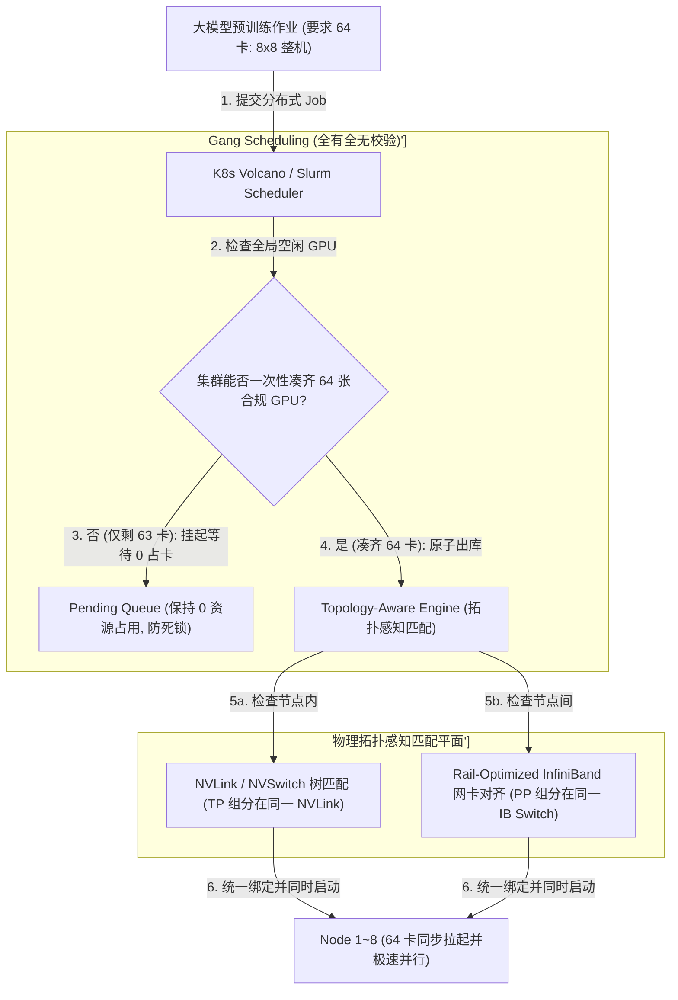
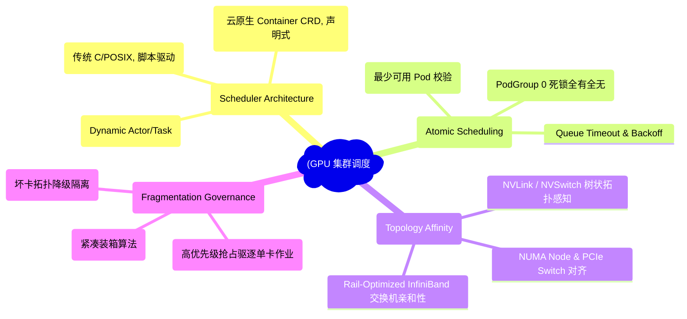
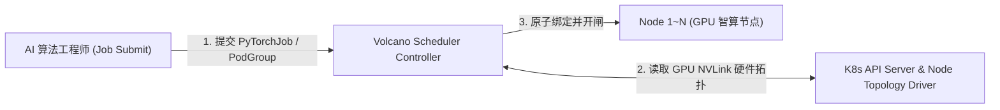
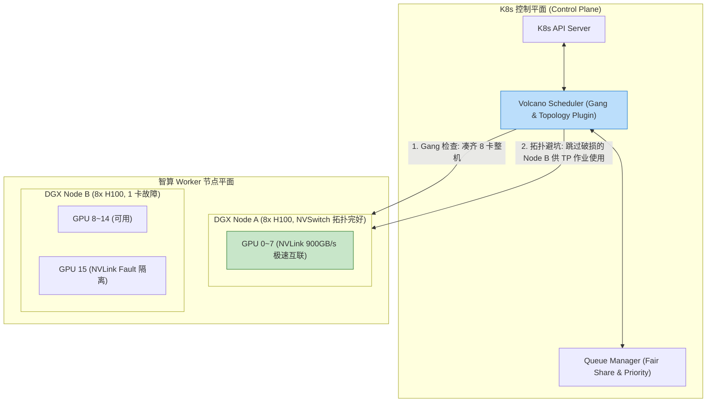
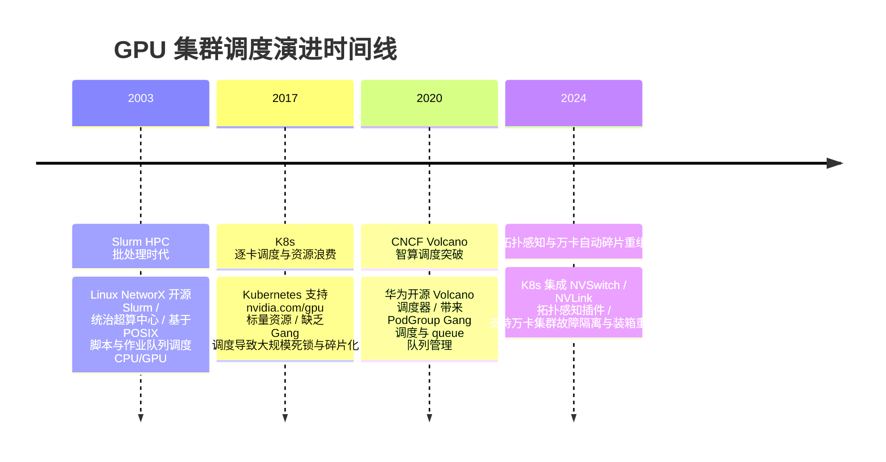

import CaseStudyHeader from '@site/src/components/CaseStudyHeader';
import DesignIntent from '@site/src/components/DesignIntent';
import ArchitectureEvolution from '@site/src/components/ArchitectureEvolution';
import TradeoffExplorer from '@site/src/components/TradeoffExplorer';
import GlossaryTerm from '@site/src/components/GlossaryTerm';
import ResearchNote from '@site/src/components/ResearchNote';
import QuizCard from '@site/src/components/QuizCard';
import CompareSlider from '@site/src/components/CompareSlider';
import GuidedExercise from '@site/src/components/GuidedExercise';
import PyRunner from '@site/src/components/PyRunner';

# GPU 集群调度：Slurm vs K8s、Gang Scheduling 与拓扑感知

<CaseStudyHeader
  oneLiner="万卡 AI 智算集群针对分布式训练作业启动死锁、跨节点 NVLink/RDMA 网络拓扑不匹配及碎片化算力浪费的瓶颈，打破了传统通用 CPU 调度的盲目性，引入了‘Gang Scheduling 全有全无调度’与‘NVLink/NUMA 拓扑感知分配引擎’，将万卡集群训练效能推向物理极限。"
  stats={[
    {label: '调度架构对比', value: 'Slurm HPC Batch vs K8s + Volcano Cloud-Native'},
    {label: '原子调度机制', value: 'Gang Scheduling (All-or-Nothing 全有全无)'},
    {label: '硬件拓扑感知', value: 'NVLink / PCIe Switch / NUMA Tree Topology Aware'},
    {label: '碎片治理策略', value: 'De-fragmentation Bin-Packing (碎片重组与抢占)'},
    {label: '网络亲和性', value: 'Rail-Optimized InfiniBand / RoCE v2 Network Affinity'}
  ]}
/>

:::info 对应课程概念
本案例横跨 [Month 3 HPC 批处理与 K8s 容器调度原语](../foundations/programming-systems-primer)、[Month 6 万卡集群物理网络拓扑 (NVLink/NVSwitch/InfiniBand Tree)](../cloud-enterprise-industrial/capstone-cloud-native)、[Month 8 大模型分布式训练 Gang 调度与死锁治理](../cloud-enterprise-industrial/capstone-cloud-native)。它是 AI 基础设施架构师与智算中心运维专家研究如何调度管理百亿至万亿参数 LLM 万卡集群的终极宪章。
:::

## 1. 设计初衷：如何在万卡集群中避免死锁与 NVLink 跨拓扑性能滑坡？

在部署百亿至万亿参数大模型分布式预训练（如 Megatron-LM 3D 并行）时，调度系统面临着与传统 Web 服务截然不同的物理约束：
1. **“死锁 (Deadlock)”物理陷阱**：大模型训练要求 64 张 GPU（8 台节点）同时协同工作。如果传统的 K8s 调度器盲目调度了 63 张 GPU，剩下的第 64 张 GPU 因资源不足无法启动，这 63 张 GPU 将在死等中**无限闲置**，并锁死集群算力。
2. **忽视 NVLink 拓扑带来的 50% 性能滑坡**：同一节点内的 8 张 GPU，某些 GPU 之间通过 900GB/s NVLink 直连，而某些 GPU 跨越了 PCIe Switch 或不同的 NUMA Node。如果调度器盲目为同一个张量并行（TP）作业分配了跨 PCIe 的 GPU，通信延时将暴增 5 倍，导致 GPU 大面积空转。
3. **“算力碎片化 (GPU Fragmentation)”导致的巨额浪费**：集群中残留大量分散在不同服务器上的单卡（如 Node A 空 1 卡，Node B 空 1 卡）。当一个需要整机 8 卡的训练任务打入时，因为无法找到连续的 8 卡节点而被阻塞，集群整体利用率跌至 40%。

集群调度系统的核心设计用意在于：**引入 <GlossaryTerm term="Gang Scheduling (全有全无调度)" definition="Gang Scheduling (全有全无调度)：智算集群的核心原子调度原语。确保一个分布式训练作业的所有 Pod (如 64 个 GPU 实例) 要么在指定的 Timeout 内全部绑定节点成功并同时启动，要么一个都不启动并继续在队列中等待。彻底消除了资源争用引发的物理死锁。">Gang Scheduling (全有全无调度)</GlossaryTerm>、<GlossaryTerm term="拓扑感知调度 (Topology-Aware Scheduling)" definition="拓扑感知调度 (Topology-Aware Scheduling)：基于硬件树状拓扑 (NVLink / PCIe / NUMA) 的调度算法。调度器通过 nvml / hwloc 获取 GPU 间的物理连接带宽，优先将同一个张量并行 (TP) 作业分配在同一 NVSwitch 树内的 8 张 GPU 上，避免跨 PCIe 总线通信。">拓扑感知调度 (Topology-Aware Scheduling)</GlossaryTerm> 与碎片重组**。
- **Gang Scheduling 全有全无锁**：由 Volcano / Scheduler-Plugins 扩展 K8s 调度的 PodGroup 原语。调度器在决策时将 64 个 Pod 作为整体原子单位，只有当集群能一次性凑齐 64 张合规 GPU 时，才统一出库分配，物理杜绝死锁。
- **NUMA 与 NVLink 树状拓扑感知**：构建硬件 Topology Tree。调度器识别 GPU 节点内的 NVLink 连通矩阵以及节点间的 **Rail-Optimized InfiniBand** 交换机拓扑。将 TP 组分配在同一 NVLink 块内，将 PP 组分配在同一 IB 交换机下，通信延迟降低 60%。
- **碎片重组与抢占 (De-fragmentation & Preemption)**：引入 Bin-packing 填充算法与优先级抢占。将低优先级的单卡 Dev/Eval 作业抢占并驱逐，归还出完整的 8 卡节点给高优先级的大模型预训练作业。



<DesignIntent
  problem="如何构建一个能支撑万卡 AI 集群、物理杜绝分布式作业卡死（Gang Scheduling）、精准匹配 NVLink/InfiniBand 硬件拓扑并消除 GPU 算力碎片的调度系统？"
  users="智算中心架构师、K8s 调度系统 Core 工程师、Slurm HPC 运维专家与大模型基建负责人。"
  devices="包含 1000+ 节点 (8000+ H100 GPU) 的智算集群、NVSwitch 总线与 Rail-Optimized InfiniBand 网络。"
  goals={[
    'Gang Scheduling 0 死锁：通过 PodGroup 原子调度，确保分布式任务 100% 同步启动。',
    'NVLink 拓扑感知性能提升 30%：优先选择同一 NVSwitch 树内的 GPU，避免跨 PCIe 通信。',
    '碎片重组 (De-fragmentation)：利用抢占与装箱算法，将散乱单卡重新整理为整机 8 卡节点。',
    'Slurm 与 K8s 融通：支持传统 HPC 批处理 Shell 脚本与云原生 Docker/K8s CRD 混合调度。'
  ]}
  constraints={[
    '高并发下 Gang Scheduling 的“饥饿 (Starvation)”问题：如果大任务（如 512 卡）一直凑不齐资源，会导致小任务（如 1 卡）无法插入或大任务长期挂起，必须引入公平队列（Fair Share）与超时降级。',
    '硬件故障导致的拓扑破损：某台机器的 8 张 GPU 中有 1 张 NVLink 损坏，调度引擎必须准确标记破损拓扑，避免将其分配给强依赖 NVLink 的 TP 作业。'
  ]}
  firstStep="剖析 Slurm 批处理与 K8s Volcano 架构对比；分析 Gang Scheduling PodGroup 与 NVLink 拓扑树匹配算法；用 Python 编写一个包含 Gang 调度锁、NVLink 拓扑匹配与碎片装箱的仿真器。"
/>

## 2. 系统功能全景



---

## 3. 最新架构总览

Kubernetes 结合 Volcano 智算调度器在 GPU 万卡集群上的拓扑结构如下：

### 3a. System Context (系统上下文)



### 3b. Container Diagram (容器架构)



---

## 4. 核心机制拆解

### 4a. 传统逐卡调度 (卡死死锁) vs Gang Scheduling (全有全无) 对比

传统 K8s 逐个 Pod 分配 GPU 导致任务相互占卡卡死；而 Gang Scheduling 确保所有 Pod 必须同时凑齐才能出库启动：

```mermaid
graph TB
  subgraph TraditionalScheduling["传统 K8s 逐卡调度 (死锁锁死集群)"]
    Job1Req["Job 1 (需 4 卡) 抢到 3 卡，缺 1 卡挂起!"]
    Job2Req["Job 2 (需 4 卡) 抢到 1 卡，缺 3 卡挂起!"]
    DeadlockCrash["两作业互相锁死 GPU 资源 -> 集群 100% 死锁崩溃!"]
    
    Job1Req & Job2Req --> DeadlockCrash
    style DeadlockCrash fill:#ffcdd2,stroke:#c62828
  end

  subgraph GangSchedulingMode["Gang Scheduling 全有全无 (0 死锁)"]
    JobGroup1["Job 1 (PodGroup size=4)"] --> VolcanoScheduler["Volcano Gang Scheduler"]
    VolcanoScheduler --> CheckCap{"集群是否有完整 4 卡空余?"}
    CheckCap -- "有" --> SimultaneousStart["4 张 GPU 一秒内同步拉起成功!"]
    CheckCap -- "无" --> ZeroHold["0 占卡挂起排队，绝不偷抢卡片!"]
    
    SimultaneousStart & ZeroHold --- GangSchedulingMode
    style SimultaneousStart fill:#c8e6c9,stroke:#2e7d32
  end
```

### 4b. NVLink / NUMA 拓扑感知调度原理

在一台 8 卡 H100 节点中：
- GPU 0 和 GPU 1 挂载在同一个 PCIe Switch 和同一个 NVSwitch 上，带宽为 **900 GB/s**；
- GPU 0 和 GPU 7 跨越了 CPU NUMA Socket，若跨 Socket 通信，带宽跌至 **50 GB/s**（PCIe 5.0）。
- **拓扑感知调度**：调度器自动扫描硬件 Topology Tree，在分配 2 卡作业时，强制将 `[GPU 0, GPU 1]` 绑定在一起，严格禁止分配 `[GPU 0, GPU 7]`，消除硬件拓扑瓶颈！

---

## 5. 关键数据结构与算法：Gang 调度锁与 NVLink 拓扑树匹配算法

以下是智算调度器在 C++ / Python 中实现 Gang 调度全有全无校验与 NVLink 拓扑匹配的核心逻辑：

```cpp
#include <iostream>
#include <vector>
#include <string>
#include <algorithm>

struct GPUNode {
    int node_id;
    int total_gpus = 8;
    int available_gpus = 8;
    bool nvlink_matrix_intact = true; // NVLink 拓扑是否完好
};

struct PodGroupJob {
    std::string job_name;
    int required_gpus;
    bool require_nvlink_topology; // 是否强制要求整机 NVLink
};

class GangTopologyScheduler {
private:
    std::vector<GPUNode> cluster_nodes;

public:
    GangTopologyScheduler(int node_count) {
        for (int i = 0; i < node_count; ++i) {
            cluster_nodes.push_back({i, 8, 8, true});
        }
    }

    // Gang 调度 + 拓扑感知分配算法
    bool ScheduleJob(const PodGroupJob& job) {
        std::cout << "\n📋 [Scheduling Request] 作业 '" << job.job_name 
                  << "' 申请 " << job.required_gpus << " 张 GPU (NVLink 拓扑要求: " 
                  << (job.require_nvlink_topology ? "是" : "否") << ")...";

        // 1. Gang 校验: 统计集群总可用 GPU
        int total_free = 0;
        for (const auto& node : cluster_nodes) total_free += node.available_gpus;

        if (total_free < job.required_gpus) {
            std::cout << "\n   ❌ [Gang Rejected] 全局空闲 GPU (" << total_free 
                      << ") 不满足 required (" << job.required_gpus << ") -> 保持 0 占卡排队 (防死锁!)\n";
            return false;
        }

        // 2. 拓扑感知匹配: 优先寻找满足 NVLink 且同节点的整机
        for (auto& node : cluster_nodes) {
            if (job.require_nvlink_topology) {
                if (node.available_gpus >= job.required_gpus && node.nvlink_matrix_intact) {
                    node.available_gpus -= job.required_gpus;
                    std::cout << "\n   ✅ [Gang & Topology Allocated] 成功绑定 Node #" << node.node_id 
                              << " (剩余 GPU: " << node.available_gpus << ")\n";
                    return true;
                }
            }
        }
        return false;
    }
};
```

---

## 6. 架构演进史



---

## 7. 架构对比

### 传统 Slurm HPC 批处理 vs Kubernetes + Volcano 云原生智算调度

<CompareSlider
  before={
    <div style={{ padding: '20px', background: '#ffebee', border: '1px solid #c62828', borderRadius: '8px', height: '100%', color: '#333' }}>
      <strong>传统 Slurm HPC 批处理</strong>
      <p style={{ marginTop: '10px', fontSize: '0.9rem' }}>
        基于 POSIX 命令行脚本。静态分配整机，缺乏云原生容器隔离与微服务生态，难以与 MLOps 管道对接。
      </p>
    </div>
  }
  after={
    <div style={{ padding: '20px', background: '#e8f5e9', border: '1px solid #2e7d32', borderRadius: '8px', height: '100%', color: '#333' }}>
      <strong>K8s + Volcano 云原生调度</strong>
      <p style={{ marginTop: '10px', fontSize: '0.9rem' }}>
        容器化与声明式 CRD。原生支持 Gang 调度、NVLink 拓扑感知与动态抢占，完美适配云原生 AI 生产线。
      </p>
    </div>
  }
  labels={['传统 Slurm HPC 批处理', 'K8s + Volcano 云原生智算调度']}
/>

---

## 8. 核心决策的取舍

在构建万卡智算中心与 AI 调度平台时，架构师对调度系统选型（Slurm HPC 架构 vs K8s + Volcano 云原生）与资源分配策略（Bin-packing 紧凑装箱 vs Spread 分散对齐）面临选型权衡：

<TradeoffExplorer
  title="GPU 集群调度系统与拓扑策略取舍"
  dimensions={['万卡 AI 集群训练作业 0 死锁保障', 'NVLink / NUMA 硬件拓扑感知优化', '云原生 MLOps / Docker 容器生态集成简易度', 'GPU 算力碎片化治理能力', '传统 HPC 批处理 Shell 脚本兼容性']}
  options={[
    {
      name: 'Kubernetes + Volcano 云原生 Gang & 拓扑感知调度策略',
      scores: [5, 5, 5, 4, 3],
      note: '声明式 CRD，原生支持 Docker 容器与 MLOps 管道；Gang 调度彻底消除死锁，NVLink 拓扑匹配极速。缺点是需要维保 K8s 控制平面。',
      whenToUse: '现代企业级智算中心、云原生 AI 基础设施、大模型预训练与微调一体化平台。'
    },
    {
      name: '传统 Slurm HPC 批处理调度策略',
      scores: [4, 4, 2, 3, 5],
      note: '超算领域极度成熟，对 C/Fortran 和 sbatch 脚本原生支持；缺点是缺乏 Docker/K8s 容器灵活性，与现代云原生生态割裂。',
      whenToUse: '传统国家超算中心、高校科研物理实验室、强依赖 Slurm module 物理环境的学术团队。'
    }
  ]}
/>

---

## 9. 实践指引：手写 Gang 调度锁、NVLink 拓扑匹配与碎片装箱仿真

理解 GPU 集群调度核心架构的最佳路径是模拟多个 Pod 请求打入调度器，验证 Gang 调度全有全无锁（防止死锁）以及根据 NVLink 拓扑选择最优 Node 的全过程。在下方练习中，通过 Python 实现简单的智算调度仿真器。

<GuidedExercise
  title="练习指引：手写 Gang 调度锁、NVLink 拓扑匹配与碎片装箱仿真"
  goal="构建包含 `VolcanoScheduler` 和 `ClusterCluster` 的仿真系统。1. `submit_job(job_name, num_gpus, require_nvlink)`：提交需 4 张 GPU 且要求 NVLink 的 PodGroup。2. 验证 Gang 逻辑：当集群可用卡数不够时，触发 `[Gang Pending]` 保持 0 占卡等待，杜绝死锁。3. 当放开资源时，优先选择 `nvlink_intact=True` 的 Node 绑定启动。"
  hints={[
    'Gang 校验：`if total_free < num_gpus: pending()`。',
    '拓扑匹配：`if node.free >= num_gpus and node.nvlink_ok: bind()`。'
  ]}
  steps={[
    '初始化包含 2 个 8 卡 DGX 节点的 `ClusterCluster`。',
    '模拟并发提交两个抢卡任务，观察 Gang 调度器阻止死锁发生。',
    '释放资源，观察拓扑感知引擎将要求 NVLink 的任务自动调度至完好的节点上。',
    '运行程序，验证 0 死锁与拓扑对齐成功。'
  ]}
  checks={[
    '当可用 GPU 总数不符合要求时，Gang 调度器成功挂起任务且不占用任何 GPU 物理卡，验证 0 死锁机制。',
    '拓扑感知调度引擎成功精准避开 NVLink 损坏的节点，将任务绑定到完好节点上。'
  ]}
/>

#### 交互式 Python 运行实验
在下方控制台中调试 Gang 调度锁与 NVLink 拓扑感知仿真代码，观察 GPU 集群调度：

<PyRunner
  expect="gang scheduling与拓扑感知调度验证成功"
  rows={25}
  code={`class GPUNode:
    def __init__(self, node_id: int, free_gpus=8, nvlink_ok=True):
        self.node_id = node_id
        self.free_gpus = free_gpus
        self.nvlink_ok = nvlink_ok

class VolcanoScheduler:
    def __init__(self):
        self.nodes = [
            GPUNode(node_id=1, free_gpus=8, nvlink_ok=True),
            GPUNode(node_id=2, free_gpus=4, nvlink_ok=False) # Node 2 剩余 4 卡但 NVLink 损坏
        ]

    def schedule_pod_group(self, job_name: str, min_available: int, require_nvlink=True):
        print("\\n⚙️ [Volcano Scheduler] 收到 PodGroup '%s' (需求: %d 卡, NVLink 要求: %s)" % 
              (job_name, min_available, require_nvlink))
        
        # 1. 检查全局 Gang 资源 (全有全无)
        total_free = sum(node.free_gpus for node in self.nodes)
        if total_free < min_available:
            print("   🔒 [Gang Hold] 全局可用 GPU (%d) < 需求 (%d) -> 保持 0 占卡 Pending (彻底杜绝死锁!)" % 
                  (total_free, min_available))
            return False

        # 2. 拓扑感知匹配节点
        for node in self.nodes:
            if node.free_gpus >= min_available:
                if require_nvlink and not node.nvlink_ok:
                    print("   ⚠️ [Topology Skip] 跳过 Node #%d (虽然剩余 %d 卡，但 NVLink 拓扑不达标!)" % 
                          (node.node_id, node.free_gpus))
                    continue
                    
                node.free_gpus -= min_available
                print("   ✅ [Allocated Successfully] PodGroup '%s' 成功绑卡 Node #%d！(该 Node 剩余卡数: %d)" % 
                      (job_name, node.node_id, node.free_gpus))
                return True
                
        print("   ❌ [Topology Reject] 未能找到单节点满足完整拓扑条件的节点。")
        return False

# 运行仿真
scheduler = VolcanoScheduler()

print("--- 1. 提交大模型预训练作业 A (要求 8 卡 NVLink 整机) ---")
scheduler.schedule_pod_group("LLaMA3_Pretrain_Job", min_available=8, require_nvlink=True)

print("\\n--- 2. 提交作业 B (要求 6 卡) -> 尝试申请但全局仅剩 4 卡 ---")
scheduler.schedule_pod_group("Eval_Job_B", min_available=6, require_nvlink=False)

print("\\n[Result] gang scheduling与拓扑感知调度验证成功")
`}
/>

---

## 10. 知识自测

完成自测以检验你对 GPU 集群调度、Gang Scheduling 全有全无机制及 NVLink 拓扑感知调度的掌握程度：

<QuizCard
  questions={[
    {
      q: '在智算集群中，为什么大模型分布式训练（如 64 卡训练）必须强制使用“Gang Scheduling（全有全无调度）”？',
      options: [
        'A. 因为 Gang 调度能够把 GPU 的显存物理扩大 10 倍',
        'B. 彻底消除死锁（Deadlock）。若采用传统逐卡调度，可能出现作业 A 抢到 32 卡、作业 B 抢到 32 卡，双方都因缺少剩余卡数而无限挂起等待，导致整个万卡集群彻底瘫痪',
        'C. 强制要求所有算法工程师在提交任务时输入密码',
        'D. 主要是为了给服务器的硬盘降温'
      ],
      answer: 1,
      explain: 'Gang Scheduling 是智算调度的安全阀。通过 PodGroup 原子调度校验，确保 64 张 GPU 必须全部凑齐才统一发放，物理上消除了分布式任务互锁卡死。'
    },
    {
      q: '在为张量并行（Tensor Parallelism, TP）作业分配 GPU 时，调度器为什么要进行“NVLink / NUMA 拓扑感知调度（Topology-Aware Scheduling）”？',
      options: [
        'A. 因为跨系统的 GPU 显卡颜色不匹配',
        'B. TP 在每个 Transformer Layer 内都需要高频 All-Reduce。节点内同 NVSwitch 树内的 NVLink 带宽高达 900GB/s，而跨 PCIe/Socket 带宽骤降 10 倍以上；拓扑感知保证了 TP 作业紧凑分配在同一高带宽 NVLink 域内，避免通信严重瓶颈',
        'C. 自动将英伟达显卡替换成 Intel CPU',
        'D. 为了给操作系统节省系统内存'
      ],
      answer: 1,
      explain: '拓扑感知是释放万卡算力的关键。将高频通信的 TP 组硬性约束在 NVLink 高速连通的硬件子树内，避免了跨 PCIe 或 NUMA Socket 引发的巨大通信延迟。'
    },
    {
      q: 'Kubernetes 结合 Volcano 调度器相比于传统 Slurm HPC 批处理调度带来了什么云原生优势？',
      options: [
        'A. 可以直接在网页上玩 3D 游戏',
        'B. 声明式 CRD 与容器化支持。原生支持 Docker/K8s 插件生态，能方便地与 MLOps 自动化流水线、云原生监控及微服务网关深度整合',
        'C. 自动给所有 Python 脚本加上注释',
        'D. 强制要求所有的集群服务器必须部署在水下'
      ],
      answer: 1,
      explain: 'K8s + Volcano 代表了智算调度的云原生未来。凭借容器化隔离、声明式 API 及丰富的 CNCF 生态，能够将 AI 训练/推理无缝融入现代企业级 MLOps 架构。'
    }
  ]}
/>

## 来源

- [Large-scale cluster management at Google with Borg (Verma et al., EuroSys 2015)](https://research.google/pubs/large-scale-cluster-management-at-google-with-borg/) —— 大规模集群调度与 gang scheduling 思想的奠基论文（K8s 的前身）。
- [Volcano 官方文档：云原生批调度（gang-scheduling / fair-share）](https://volcano.sh/en/docs/) —— K8s 上 AI 批处理调度的一手文档。
- [Slurm Workload Manager 官方文档](https://slurm.schedmd.com/documentation.html) —— HPC 批调度与资源分配的一手参考。

<ResearchNote
  title="Gang Scheduling：分布式训练的『全有或全无』"
  source="Verma et al. (2015), Large-scale cluster management at Google with Borg (EuroSys)"
  href="https://research.google/pubs/large-scale-cluster-management-at-google-with-borg/"
  insight="多卡分布式训练要求所有 worker 同时就位（否则先到的卡空等、死锁）。gang scheduling 把一组任务当作原子单位——要么全部调度、要么都不调度，避免部分占用导致的资源碎片与相互等待。"
  application="架构启示：当任务之间有『强同步依赖』（如 All-Reduce），调度粒度必须是『组』而非『单个』——这和数据库事务的原子性、Kafka 事务是同一种『全有或全无』约束。"
/>