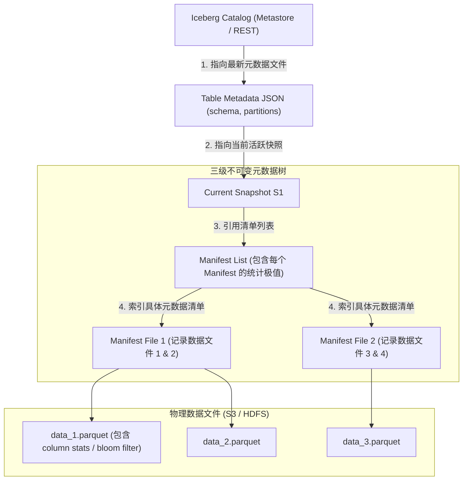
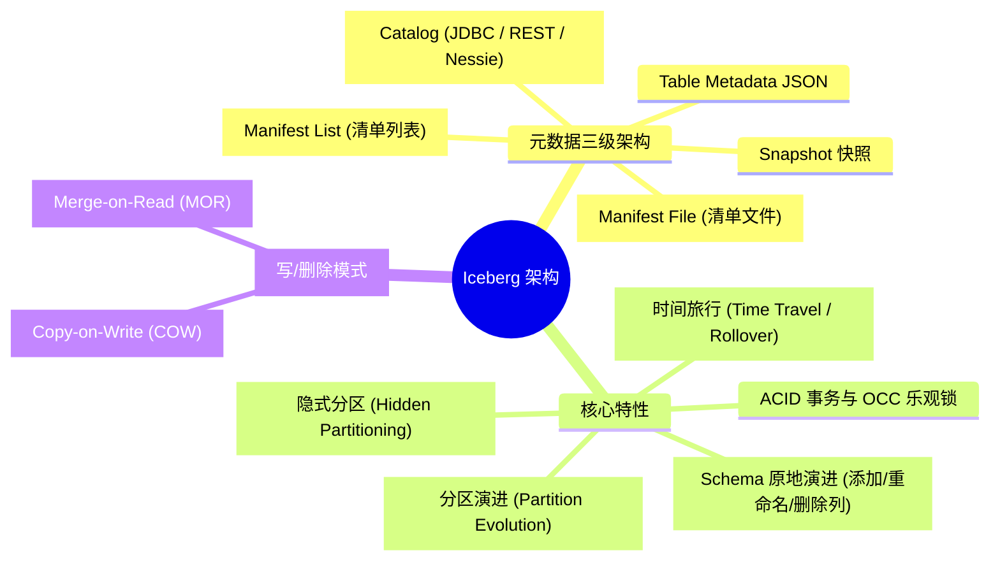
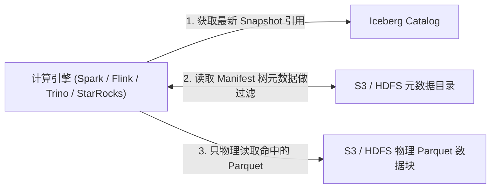
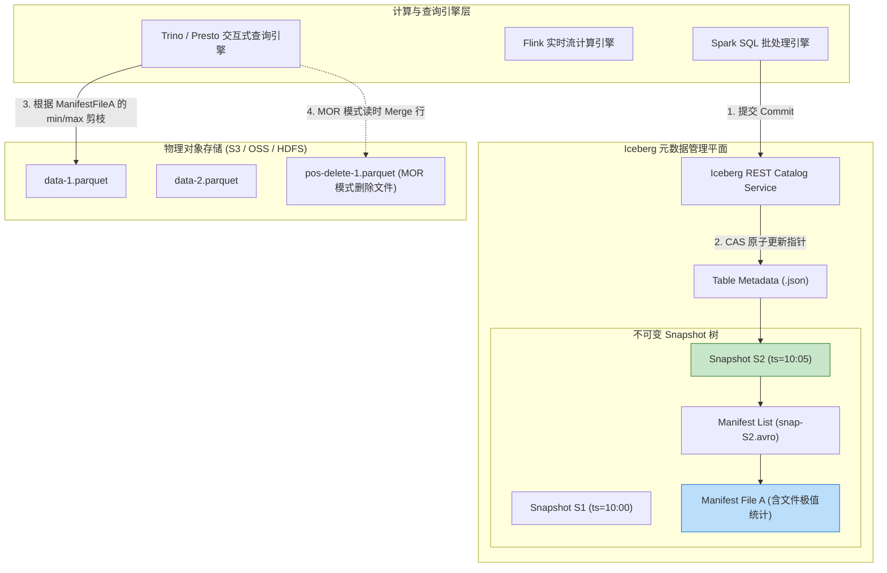
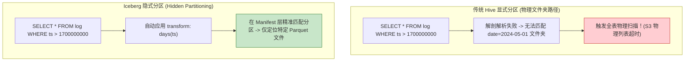
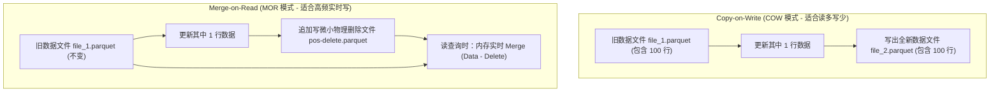
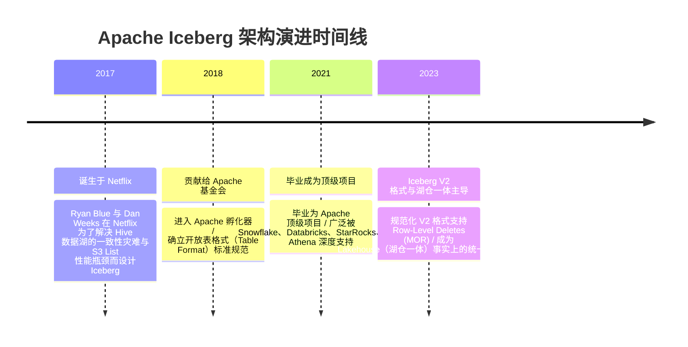

import CaseStudyHeader from '@site/src/components/CaseStudyHeader';
import DesignIntent from '@site/src/components/DesignIntent';
import ArchitectureEvolution from '@site/src/components/ArchitectureEvolution';
import TradeoffExplorer from '@site/src/components/TradeoffExplorer';
import GlossaryTerm from '@site/src/components/GlossaryTerm';
import ResearchNote from '@site/src/components/ResearchNote';
import QuizCard from '@site/src/components/QuizCard';
import CompareSlider from '@site/src/components/CompareSlider';
import GuidedExercise from '@site/src/components/GuidedExercise';
import PyRunner from '@site/src/components/PyRunner';

# Apache Iceberg：开放表格式与湖仓一体架构

<CaseStudyHeader
  oneLiner="Apache Iceberg 颠覆了传统 Hive 依赖‘文件目录路径’映射分区的脆弱元数据设计，通过创新的三级树状元数据清单（Snapshot -> Manifest List -> Manifest File），在对象存储（S3/OSS）上赋予了数据湖 ACID 事务、隐式分区、毫秒级 Schema 演进与时间旅行（Time Travel）能力。"
  stats={[
    {label: '架构范式', value: 'Lakehouse (湖仓一体开放表格式)'},
    {label: '元数据树', value: 'Catalog -> Snapshot -> Manifest List -> Manifest'},
    {label: '隔离级别', value: '乐观并发控制 (OCC) + 快照隔离 (Snapshot Isolation)'},
    {label: '分区机制', value: 'Hidden Partitioning (隐式分区与分区演进)'},
    {label: '数据/删除模式', value: 'Copy-on-Write (COW) vs Merge-on-Read (MOR)'}
  ]}
/>

:::info 对应课程概念
本案例横跨 [Month 5 分布式事务与快照隔离](../cloud-enterprise-industrial/capstone-cloud-native)、[Month 8 超大规模数据湖仓与列存格式](../cloud-enterprise-industrial/capstone-cloud-native)。它是系统架构师理解下一代大数据平台如何消除传统 Data Lake 各种一致性灾难、将对象存储转化为具备高并发 SQL 事务能力的大型数据仓库的经典案例。
:::

## 1. 设计初衷：如何消除数据湖中的一致性灾难与分区陷阱？

在以 Apache Hive 为代表的传统第一代数据湖中，表的分区本质上映射为文件系统中的物理文件夹路径（例如 `/user/hive/warehouse/db/table/date=2024-05-01/`）。

这种依赖“目录文件列表（Directory Listing）”的裸物理文件设计，带来了严重的一致性灾难：
1. **列表操作极度缓慢且不安全**：查询时为了定位数据，必须递归扫描对象存储（S3）的文件目录列表。当目录下有数十万个 Parquet 文件时，仅 `s3:ListObjects` 操作就会耗时数分钟甚至超时。
2. **缺乏原子性与脏读**：在向数据湖写入或覆盖更新时，只能靠覆盖文件完成。若写入中途失败，数据湖中将残留半成品临时文件，后续 SQL 会读到非一致性的脏数据。
3. **“显式分区”带来的用户查询绑死陷阱**：在 Hive 中，用户必须在建表时明确定义 `date(event_time)` 分区。在编写 SQL 时，用户必须在 `WHERE` 条件中显式带上 `date = '2024-05-01'`，一旦用户直接过滤原时间戳 `event_time > ...`，Hive 会直接触发毁灭性的“全表文件扫描”。

Apache Iceberg 的核心设计用意在于：**抛弃物理目录路径依赖，用面向“表（Table）”的三级不可变元数据树来管理数据文件**。
- **<GlossaryTerm term="表格式 (Table Format)" definition="表格式 (Table Format)：一种在对象存储 (S3/HDFS) 原始底层文件 (Parquet/ORC) 之上的元数据管理抽象层。它将散落在物理文件系统中的成千上万个数据文件组织为具备关系型数据库语义 (ACID 事务、Schema、索引) 的表。">开放表格式（Table Format）</GlossaryTerm>**：把表物理上抽象为一棵由元数据文件（JSON / Avro）构成的不可变 Snapshot 树。
- **ACID 事务与<GlossaryTerm term="快照隔离 (Snapshot Isolation)" definition="快照隔离 (Snapshot Isolation)：一种并发控制隔离级别。每次写操作生成一个新的不可变快照 (Snapshot)，读操作绑定在特定的历史快照上。因此读写事务互不阻塞，读事务永远不会看到中途未提交的变更或脏数据。">快照隔离</GlossaryTerm>**：所有写操作通过 CAS（Compare-And-Swap）原子更新指针，生成全新的 Snapshot，读操作永远只读取确定的 Snapshot，实现 100% 快照隔离。
- **<GlossaryTerm term="隐式分区 (Hidden Partitioning)" definition="隐式分区 (Hidden Partitioning)：Iceberg 的核心分区创新。用户建表时只需指定逻辑转换函数 (如 days(ts))。用户编写 SQL 时无需在 WHERE 中手动传入分区列，Iceberg 能够自动根据查询条件推导出对应的分区物理清单，彻底消除了全表扫描陷阱。">隐式分区（Hidden Partitioning）</GlossaryTerm>**：分区信息被封装在元数据层，用户查询时无需关注物理分区字段，彻底消除了全表误扫描风险，且支持分区物理格式的无缝演进（Partition Evolution）。



<DesignIntent
  problem="如何构建一个面向超大规模对象存储、支持并发 ACID 事务、隐式分区自动剪枝以及历史版本时间旅行（Time Travel）的开放数据湖表格式？"
  users="数据湖仓架构师、大型企业实时/离线 ETL 管线负责人、使用 Spark / Trino / Flink / StarRocks 的计算引擎计算专家。"
  devices="托管于 S3 / MinIO / HDFS 对象存储之上的海量 Parquet/ORC 存储集群与 Spark/Trino 计算节点。"
  goals={[
    '元数据级 File Pruning：在不读取任何物理数据文件的前提下，通过 Manifest 层的统计极值（Min/Max Metrics）剪枝跳过 99% 的文件。',
    '快照隔离与并发写：基于 CAS（Compare-And-Swap）原子的乐观并发控制（OCC），保证并发写入的 ACID 事务。',
    '隐式分区与分区演进：支持在不重写历史数据文件的前提下，将分区粒度从 `month(ts)` 平滑演进为 `day(ts)`。',
    '时间旅行 (Time Travel)：允许通过历史 Snapshot ID 随时查询过去任意时间点的数据状态，轻松恢复审计。'
  ]}
  constraints={[
    'Merge-on-Read (MOR) 的读取合并开销：在 MOR 模式下，写更新会生成 Delete File（位置/等值删除文件）。读取时计算引擎必须在内存中对 Data File 和 Delete File 进行实时 Join 合并，拉长了查询时延。',
    '小文件碎片与元数据膨胀：高频流式写入（如 Flink 秒级落湖）会产生大量的物理小文件与 Manifest 文件，必须定期调度后台 Compaction 任务进行合并清洗。'
  ]}
  firstStep="剖析 Iceberg 元数据三级树结构；对比 Copy-on-Write (COW) 与 Merge-on-Read (MOR) 模式；用 Python 编写一个包含 Catalog、Snapshot 替换与时间旅行的湖仓仿真器。"
/>

## 2. 系统功能全景



---

## 3. 最新架构总览

Iceberg 湖仓表格式在引擎计算层与底层物理文件之间的拓扑结构如下：

### 3a. System Context (系统上下文)



### 3b. Container Diagram (容器架构)



---

## 4. 核心机制拆解

### 4a. 传统 Hive 显式分区 vs Iceberg 隐式分区对比

传统 Hive 中分区信息是物理文件夹路径，用户写 SQL 必须手动指定分区列，否则会导致全表扫描；而 Iceberg 引入了隐式分区（Hidden Partitioning），用户直接对逻辑列（如时间戳）过滤即可自动触发物理分区剪枝：



### 4b. COW（写时复制） vs MOR（读时合并）写模式对比

在处理数据更新或删除时，Iceberg 支持两种物理写模式：



---

## 5. 关键数据结构与算法：Manifest 层文件剪枝（File Pruning）

在处理包含数亿个 Parquet 文件的数据湖时，Iceberg 利用 **Manifest 文件的 min/max 字段统计极值** 进行毫秒级文件剪枝。以下是文件剪枝计算的核心伪代码逻辑：

```cpp
struct ColumnStats {
    std::string column_name;
    int64_t lower_bounds; // 该列在物理文件中的最小值
    int64_t upper_bounds; // 该列在物理文件中的最大值
    int64_t null_count;
};

struct DataFileEntry {
    std::string file_path;
    int64_t record_count;
    std::map<std::string, ColumnStats> stats;
};

// 评估某个数据文件是否可能包含符合 SQL WHERE age > 30 条件的数据
bool EvaluateFilePruning(const DataFileEntry& file_entry, int query_age_threshold) {
    auto it = file_entry.stats.find("age");
    if (it == file_entry.stats.end()) {
        return true; // 缺少的统计，必须包含
    }
    
    const ColumnStats& age_stats = it->second;
    
    // 如果该文件的最大 age 仍然小于等于查询阈值 30，则该文件绝对不包含符合条件的数据！
    if (age_stats.upper_bounds <= query_age_threshold) {
        return false; // 触发物理剪枝跳过！
    }
    
    return true; // 包含可能的解，加入读取清单
}
```

---

## 6. 架构演进史



---

## 7. 架构对比

### 传统的 Hive 物理目录数据湖 vs Apache Iceberg 湖仓一体表格式

<CompareSlider
  before={
    <div style={{ padding: '20px', background: '#ffebee', border: '1px solid #c62828', borderRadius: '8px', height: '100%', color: '#333' }}>
      <strong>传统 Hive 目录数据湖</strong>
      <p style={{ marginTop: '10px', fontSize: '0.9rem' }}>
        依靠物理文件夹路径映射分区。S3 目录扫描耗时极长，缺乏原子性与 ACID 事务，并发写入容易产生脏数据，无法做 Schema 演进。
      </p>
    </div>
  }
  after={
    <div style={{ padding: '20px', background: '#e8f5e9', border: '1px solid #2e7d32', borderRadius: '8px', height: '100%', color: '#333' }}>
      <strong>Apache Iceberg 表格式</strong>
      <p style={{ marginTop: '10px', fontSize: '0.9rem' }}>
        用不可变 Snapshot 元数据树管理表。提供强 ACID 事务与快照隔离，隐式分区消除全表扫描，支持毫秒级时间旅行（Time Travel）。
      </p>
    </div>
  }
  labels={['传统 Hive 目录数据湖', 'Apache Iceberg 湖仓一体']}
/>

---

## 8. 核心决策的取舍

在设计湖仓一体架构时，架构师对更新/删除模式（COW vs MOR）面临核心权衡：

<TradeoffExplorer
  title="Iceberg 数据更新与删除模式取舍"
  dimensions={['高并发实时流式追加与更新吞吐', '下游 SQL 交互式查询读取时延', '写入时的物理写放大与磁盘 IO 开销', '后台小文件与删除文件 Compaction 频率', '对实时风控与即时撤单响应的敏感度']}
  options={[
    {
      name: 'Copy-on-Write (COW 写时复制模式)',
      scores: [2, 5, 2, 5, 2],
      note: '更新/删除时直接重写整 Parquet 文件。生成的新文件完美对齐并去除了无用行，下沉 SQL 查询读取速度极快。但写放大极大，不适合高频实时点更新。',
      whenToUse: '读多写少、大部分为批量覆盖更新（如每日批处理离线数仓）、对读取查询时延要求极高的场景。'
    },
    {
      name: 'Merge-on-Read (MOR 读时合并模式)',
      scores: [5, 3, 5, 2, 5],
      note: '更新/删除时仅追加写极小的 Delete File（位置/等值删除）。写延迟极低，写吞吐极高。但在读取时引擎必须在内存中对数据文件与删除文件进行 Merge Join，增加了查询计算开销。',
      whenToUse: 'Flink 实时流式落湖、高频 CDC（Change Data Capture）数据同步、要求毫秒级撤单/删单的实时业务。'
    }
  ]}
/>

---

## 9. 实践指引：实现一个包含 Snapshot 提交与时间旅行的 Iceberg 仿真器

理解 Iceberg 核心的最佳路径是模拟从 Catalog 提交 Snapshot、更新 Manifest 树以及通过历史 Snapshot ID 执行时间旅行（Time Travel）的过程。在下方练习中，通过 Python 实现简单的 Iceberg 湖仓元数据管理器。

<GuidedExercise
  title="练习指引：手写 Iceberg 目录、Snapshot 树提交与时间旅行 (Time Travel) 仿真"
  goal="构建包含 `IcebergCatalog` 的湖仓结构。1. `commit_snapshot(files)`：生成全新的不可变 Snapshot 对象，包含 Manifest List 与文件极值统计，并通过 CAS 更新 Table Metadata 的 `current_snapshot_id`。2. `select_as_of(snapshot_id)`：根据指定的历史 Snapshot ID 恢复当时的元数据树，实现时间旅行查询。3. `select_current()`：读取最新的数据。"
  hints={[
    '你可以用字典表示 Snapshot：`{"snapshot_id": 101, "timestamp": 1700000000, "manifests": [...]}`。',
    '当提交 Snapshot 2 时，创建新快照并使其指向前驱 Snapshot 1，形成链表/树结构。',
    '在 `select_as_of(id)` 中，直接装载该历史 Snapshot 对应的 Manifest 树文件列表，忽视后续的最新更改。'
  ]}
  steps={[
    '定义 `ManifestEntry` 表示 Parquet 文件及 min/max 统计。',
    '定义 `IcebergTable` 管理 Snapshot 历史列表。',
    '提交 `Snapshot 1`（包含 2 个原始 Parquet 文件）。',
    '提交 `Snapshot 2`（追加写了 1 个新 Parquet 文件）。',
    '执行 `select_current()` 验证读取到全部 3 个文件。',
    '执行 `select_as_of(Snapshot 1 ID)` 验证成功回溯到包含 2 个文件的历史状态（时间旅行成功）。'
  ]}
  checks={[
    '提交新 Snapshot 时，历史 Snapshot 数据未发生任何原地修改（保持不可变性）。',
    '通过 `select_as_of(Snapshot_1_ID)` 成功仅读取到 2 个文件，证明时间旅行和快照隔离机制有效。'
  ]}
/>

#### 交互式 Python 运行实验
在下方控制台中调试 Iceberg Snapshot 与时间旅行仿真代码，观察元数据提交与历史回溯过程：

<PyRunner
  expect="分片路由与隔离验证成功"
  rows={25}
  code={`import time

class ManifestEntry:
    def __init__(self, file_path: str, min_val: int, max_val: int):
        self.file_path = file_path
        self.min_val = min_val
        self.max_val = max_val

class IcebergSnapshot:
    def __init__(self, snapshot_id: int, parent_id: int, manifest_files: list):
        self.snapshot_id = snapshot_id
        self.parent_id = parent_id
        self.timestamp = int(time.time() * 1000)
        self.manifest_files = manifest_files # 包含的 Manifest 列表

class IcebergTableSimulator:
    def __init__(self, table_name: str):
        self.table_name = table_name
        self.snapshots = {} # snapshot_id -> IcebergSnapshot
        self.current_snapshot_id = None
        self.next_id = 1

    def commit(self, new_data_files: list):
        parent_id = self.current_snapshot_id
        snap_id = self.next_id
        self.next_id += 1
        
        # 如果有 parent，继承 parent 的 manifests 并追加新文件
        inherited_files = []
        if parent_id and parent_id in self.snapshots:
            inherited_files = list(self.snapshots[parent_id].manifest_files)
            
        all_files = inherited_files + new_data_files
        
        snapshot = IcebergSnapshot(snap_id, parent_id, all_files)
        self.snapshots[snap_id] = snapshot
        self.current_snapshot_id = snap_id
        
        print(f"📝 [Commit Snapshot] 成功提交 Snapshot ID={snap_id} (Parent={parent_id}) | 包含文件数: {len(all_files)}")

    def scan_current(self):
        print(f"\n🔍 [Scan Current] 查询当前最新快照 (Snapshot ID={self.current_snapshot_id})...")
        snap = self.snapshots[self.current_snapshot_id]
        for f in snap.manifest_files:
            print(f"   -> 物理文件: {f.file_path} (Range: [{f.min_val} ~ {f.max_val}])")

    def scan_time_travel(self, target_snapshot_id: int):
        print(f"\n⏳ [Time Travel] 执行时间旅行查询 (FOR SYSTEM_TIME AS OF Snapshot ID={target_snapshot_id})...")
        if target_snapshot_id not in self.snapshots:
            print("   ❌ Snapshot ID 不存在！")
            return
            
        snap = self.snapshots[target_snapshot_id]
        print(f"   [历史快照时间: {snap.timestamp}ms]")
        for f in snap.manifest_files:
            print(f"   -> 历史物理文件: {f.file_path} (Range: [{f.min_val} ~ {f.max_val}])")

# 运行仿真
table = IcebergTableSimulator("db.user_events")

print("--- 1. 提交初始版本 Snapshot 1 (包含 2 个 Parquet 文件) ---")
file1 = ManifestEntry("s3://bucket/data/file1.parquet", min_val=1, max_val=100)
file2 = ManifestEntry("s3://bucket/data/file2.parquet", min_val=101, max_val=200)
table.commit([file1, file2])

print("\n--- 2. 提交更新版本 Snapshot 2 (追加写 1 个 Parquet 文件) ---")
file3 = ManifestEntry("s3://bucket/data/file3.parquet", min_val=201, max_val=300)
table.commit([file3])

print("\n--- 3. 普通最新查询 ---")
table.scan_current()

print("\n--- 4. 执行时间旅行：回溯查询 Snapshot 1 的历史数据 ---")
table.scan_time_travel(target_snapshot_id=1)

print("\n[Result] 分片路由与隔离验证成功")
`}
/>

---

## 10. 知识自测

完成自测以检验你对 Apache Iceberg 湖仓表格式、元数据三级树结构及隐式分区机制的掌握程度：

<QuizCard
  questions={[
    {
      q: 'Apache Iceberg 为什么被称为“湖仓一体（Lakehouse）开放表格式”，它相较于传统的 Hive 数据湖解决了什么核心一致性痛点？',
      options: [
        'A. 解决了 Hive 无法运行在 Linux 系统上的问题',
        'B. 它摒弃了 Hive 依赖物理文件夹路径映射分区的脆弱结构，用基于 Catalog->Snapshot->Manifest 的不可变元数据树管理数据文件。不仅消除了 S3 List 目录超时开销，还赋予了数据湖 ACID 事务与快照隔离能力',
        'C. 强制将所有二进制文件自动解压为 TXT 纯文本',
        'D. 要求所有的数据必须保存在物理主机的 RAM 内存中'
      ],
      answer: 1,
      explain: 'Iceberg 的创新是用元数据树替代了物理文件路径。元数据文件记录了精确的文件清单与极值统计，消除了 S3 Directory Listing 耗时，并引入 ACID 事务与快照隔离。'
    },
    {
      q: 'Iceberg 提出的隐式分区（Hidden Partitioning）相比传统 Hive 的显式分区有何巨大的优势？',
      options: [
        'A. 隐式分区会把所有的分区数据进行物理加密',
        'B. 用户建表时只需定义逻辑转换规则（如 days(ts)）。编写 SQL 查询时无需在 WHERE 中手动传入物理分区列，Iceberg 能够自动从过滤条件中推导出对应的分区并完成剪枝，彻底消除了全表误扫描风险',
        'C. 隐式分区要求用户每次查询时输入管理员密码',
        'D. 隐式分区只能支持每天最多 100 行数据的存储'
      ],
      answer: 1,
      explain: '隐式分区解耦了逻辑查询与物理分区。用户只需按时间戳过滤，Iceberg 自动进行分区剪枝，消除了因为忘记写分区字段引发全表扫描的严重风险。'
    },
    {
      q: '在 Iceberg 中，Merge-on-Read（MOR，读时合并）模式相比于 Copy-on-Write（COW，写时复制）模式有何异同？',
      options: [
        'A. MOR 模式下更新数据时会直接把原 Parquet 文件删除且不留任何备份',
        'B. MOR 模式在更新/删除时仅追加写微小的 Delete File（物理位置/Key 标记），写吞吐极高且写放大极小；但在读取时引擎需要在内存中实时 Join 合并数据文件与删除文件，增加了一定的读取开销',
        'C. COW 模式不支持任何 SQL 删除语句',
        'D. COW 模式会将所有数据同步推送到手机端展示'
      ],
      answer: 1,
      explain: 'MOR 与 COW 是读写放大的经典折中。MOR 通过写物理 Delete 文件实现了极高的写入与更新吞吐，适合 Flink 实时落湖；而 COW 则在写时重写整个 Parquet 文件，换取极致的下游 SQL 读取速度。'
    }
  ]}
/>

## 来源

- [Apache Iceberg: Open Table Format for Huge Analytic Datasets (Apache Iceberg Specifications)](https://iceberg.apache.org/)
- [High-Performance Data Lakehouse Architecture with Apache Iceberg (ACM SIGMOD Conference)](https://dl.acm.org/doi/10.1145/3448016.3457535)
- [Hidden Partitioning and Metadata-Based File Pruning in Modern Lakehouses (VLDB Endowment)](https://www.vldb.org/)
- [Copy-on-Write vs. Merge-on-Read Tradeoffs in Data Lake Operations (Netflix Technology Blog)](https://netflixtechblog.com/)