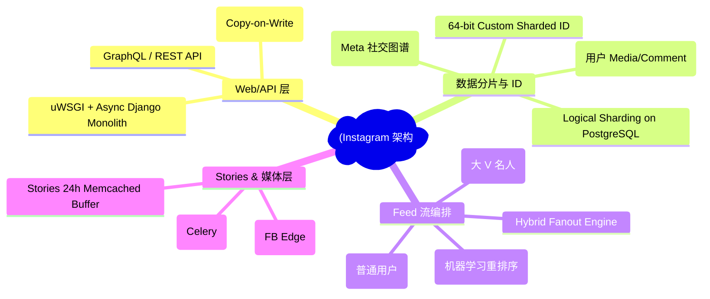
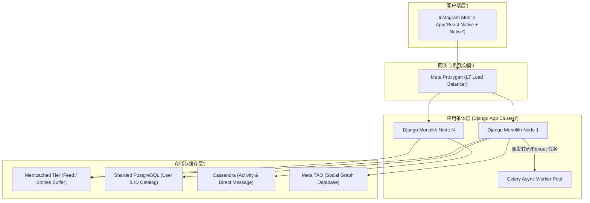
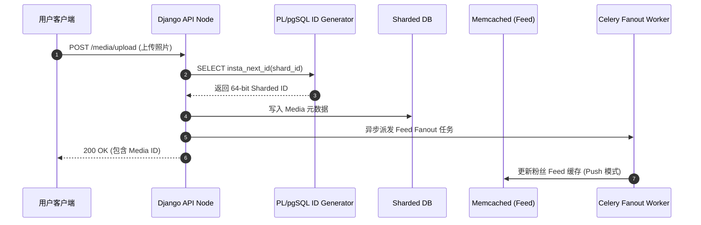
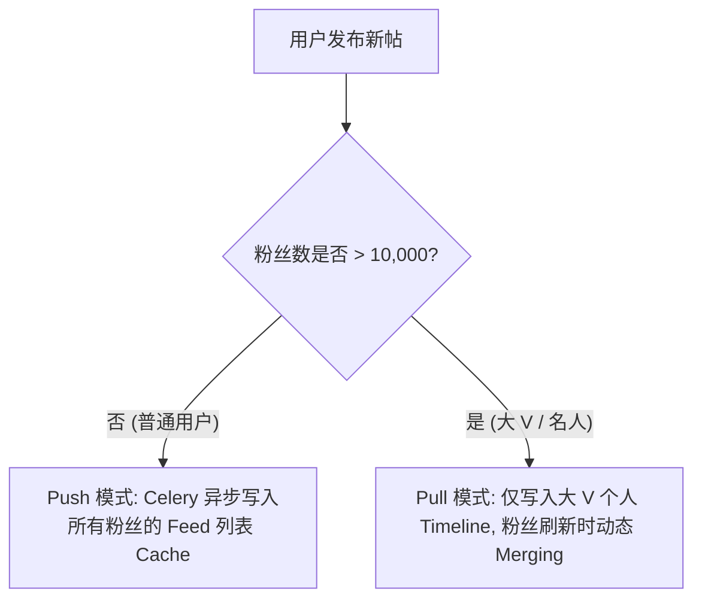

import CaseStudyHeader from '@site/src/components/CaseStudyHeader';
import DesignIntent from '@site/src/components/DesignIntent';
import EvolutionTimeline from '@site/src/components/EvolutionTimeline';
import CompareSlider from '@site/src/components/CompareSlider';
import TradeoffExplorer from '@site/src/components/TradeoffExplorer';
import GuidedExercise from '@site/src/components/GuidedExercise';
import QuizCard from '@site/src/components/QuizCard';
import GlossaryTerm from '@site/src/components/GlossaryTerm';
import ResearchNote from '@site/src/components/ResearchNote';

# Instagram：Django 单体极限与全球多媒体 Feed 架构

<CaseStudyHeader
  oneLiner="Instagram 是全球最大的 Python/Django 单体应用案例之一。通过逻辑分片 PostgreSQL、自研 64 位分布式 ID 生成器、混合推拉 Feed 流编排以及利用 Memcached 缓存 24 小时 Stories，Instagram 证明了简单的单体架构只要设计得当，同样能支撑数十亿级的并发。"
  stats={[
    {label: '月活跃用户', value: '20 亿+'},
    {label: '日上传照片/视频', value: '1 亿+'},
    {label: '核心框架', value: 'Python / Django (自研 Async/uWSGI 优化)'},
    {label: '主要数据库', value: 'Sharded PostgreSQL, Cassandra, TAO (Meta)'},
    {label: '缓存层', value: 'Memcached (数 TB 内存集群) + Redis'},
    {label: 'ID 生成模式', value: '64-bit Custom Sharded ID (无中心化)'}
  ]}
/>

:::info 对应课程概念
本案例主要映射 [Month 3 数据、缓存与队列]（Feed 扇出与缓存穿透）、[Month 5 分布式核心组件]（分布式 ID 与数据库 Sharding）及 [Month 4 设计模式与 LLD]（单体分层设计）。
:::

## 1. 设计初衷：用最简单的技术快速扩展

Instagram 创立之初仅有两位工程师。他们的原则是：**"Keep it simple, stupid (KISS)"**。即使在被 Meta (Facebook) 收购并扩张至 20 亿用户后，Instagram 依然保留了 Django 应用单体（Monolith），而是将复杂性下沉至数据分片、缓存层与异步 Task 队列（Celery/AsyncIO）。

<DesignIntent
  problem="如何在只有极少运维人力的情况下，支撑全球数十亿用户高频上传图片/视频、浏览实时 Feed 动态以及观看 24 小时即时 Stories？"
  users="全球 20 亿普通用户、创作者与品牌商家。"
  devices="iOS 与 Android 客户端为主，Web 端为辅。"
  goals={[
    '极致的读性能：Feed 首页加载延迟小于 200ms',
    '平滑的写吞吐：支撑峰值每秒数万张高精图片/短视频上传与转码',
    '零单点故障与极高数据库扩展性：数据库可无缝平滑横向扩容（Add Shard）',
    'Stories 高并发低开销：Stories 24 小时后自动过期，无需永久落盘压力'
  ]}
  constraints={[
    'Python 存在 GIL（全局解释器锁）限制，并发必须依赖多进程与协程/异步 Worker',
    '名人效应（如 C罗/泰勒·斯威夫特）导致写扩散（Fanout）会瞬间打爆下游',
    '必须保证全局 ID 唯一且按时间大致递增，同时避免集中式 ID 生成器的单点 bottleneck'
  ]}
  firstStep="基于 PostgreSQL 设计 64 位 custom ID 生成器（结合毫秒时间戳 + 逻辑 Shard ID + 自增 Sequence），采用 Async Django + Memcached 构建 Feed 架构。"
/>

## 2. 全景思维导图



## 3. 最新架构总览 (C4 风格)





## 4. 核心机制拆解

### 4a. 64-bit 分布式 Sharded ID 算法

Instagram 放弃了 Snowflake 集中式服务，直接利用 PostgreSQL 的 <GlossaryTerm term="PL/pgSQL 函数" definition="PostgreSQL 内置 Procedural Language 脚本，可在数据库内部高并发执行逻辑，用于生成不依赖外部服务的本地 64 位 ID。">PL/pgSQL</GlossaryTerm> 在每个数据库 Shard 内生成 64 位整数：


- **41 Bits**：相对于 Instagram 纪元的毫秒数，可用 69 年。
- **13 Bits**：逻辑 Shard ID（可部署在数百台物理 Postgres 上）。
- **10 Bits**：递增序列号（每毫秒每 Shard 允许 1024 个 ID）。

### 4b. Feed 混合推拉 (Hybrid Fanout) 引擎

面对粉丝数相差悬殊的用户，Instagram 采用<GlossaryTerm term="混合 Fanout 策略" definition="根据发布者的粉丝数量动态选择 Push（写扩散）或 Pull（读扩散）模式，防止大 V 发动态导致系统被写洪峰打爆。">混合 Fanout</GlossaryTerm>：



### 4c. Stories 24 小时 TTL 缓存架构

Instagram Stories 每日有数亿用户发布，特点是**生命周期只有 24 小时**。Instagram 巧妙地将其建立在 <GlossaryTerm term="TTL 缓存机制" definition="Time-To-Live，通过设置 Memcached key 存活时间为 24 小时，到期由缓存引擎自动剔除，大幅减轻持久化数据库写压力。">Memcached TTL</GlossaryTerm> 之上：

- **写入**：Stories 元数据直接写入带有 `exptime = 86400` 的 Memcached 内存集群。
- **持久化**：仅 asynchronously 备份一份至 Cassandra 作为冷归档。

## 5. 关键数据结构与算法

### ID 生成逻辑 (PL/pgSQL 伪代码)

```sql
CREATE OR REPLACE FUNCTION insta_next_id(shard_id int) RETURNS bigint AS $$
DECLARE
    our_epoch bigint := 1314220800000; -- 2011-08-25
    seq_id bigint;
    now_millis bigint;
    result bigint;
BEGIN
    SELECT nextval('table_id_seq') % 1024 INTO seq_id;
    SELECT FLOOR(EXTRACT(EPOCH FROM clock_timestamp()) * 1000) INTO now_millis;
    result := (now_millis - our_epoch) << 23;
    result := result | (shard_id << 10);
    result := result | (seq_id);
    RETURN result;
END;
$$ LANGUAGE plpgsql;
```

该算法保证了在任何 Shard 上生成的 ID 均**全局唯一、按时间严格递增**，且可直接从 ID 中反解出 Shard ID。

## 6. 架构演进史

<EvolutionTimeline
  events={[
    {
      year: '2010',
      title: '创业期：单机 Linux + Python',
      why: '只有 1 台 EC2 实例，使用 Mod_WSGI + SQLite/Postgres。',
      change: '快速推出产品，验证市场需求。'
    },
    {
      year: '2012',
      title: '扩展期：PostgreSQL 逻辑分片与 Custom ID',
      why: '用户暴增至千万级，单台 PostgreSQL CPU 与磁盘 IO 彻底到顶。',
      change: '将数据库拆分为 8192 个逻辑 Shard 部署在多台 Server，实现 64 位 ID。'
    },
    {
      year: '2017',
      title: '成熟期：Python 3 迁移与 Copy-on-Write 内存优化',
      why: 'Django 单体占用巨量 RAM，uWSGI Worker 导致 Copy-on-Write 内存失效。',
      change: '对 CPython 垃圾回收器 (GC) 进行重构，禁用 Prefork 后的 GC 引用计数调整，节省 30% 内存。'
    }
  ]}
/>

### 架构演进对比

<CompareSlider
  before={
    <div style={{ padding: '20px', background: '#ffebee', borderRadius: '8px', height: '100%' }}>
      <h3>早期单机 PostgreSQL + 简单 Push 模式</h3>
      <p>所有用户 Feed 写入同一张大表，大 V 发帖导致数据库 IOPS 跑满，Feed 刷新延迟超 5 秒。</p>
    </div>
  }
  after={
    <div style={{ padding: '20px', background: '#e8f5e9', borderRadius: '8px', height: '100%' }}>
      <h3>8192 逻辑 Shard + 混合 Fanout + Memcached Feed</h3>
      <p>数据平滑分布在 PostgreSQL/Cassandra 集群，Feed 读取 99% 命中 Memcached，延迟小于 100ms。</p>
    </div>
  }
/>

## 7. 设计模式与课程映射

1. **外观模式 (Facade Pattern)**：Django API 层作为底层分片 Postgres、Cassandra 与 TAO 的统一包装接口。
2. **策略模式 (Strategy Pattern)**：Feed Engine 根据粉丝数自适应选择 PushStrategy 或 PullStrategy。
3. **映射 [Month 3 数据、缓存与队列]**：缓存穿透与大 V 读扩散治理。

## 8. 架构取舍与权衡

<TradeoffExplorer
  title="Instagram 核心架构设计取舍"
  dimensions={['开发效率', '运行性能', '运维复杂度', '架构灵活性']}
  options={[
    {
      name: 'Python/Django 单体 + 下沉存储分片 (Instagram 方案)',
      scores: [95, 75, 85, 88],
      note: '保持业务代码在单个代码库中，开发与重构极其迅速；性能瓶颈通过 C 扩展与底层 DB 分片解决。',
      whenToUse: '团队规模适中、业务快速迭代、希望避免微服务治理噩梦的互联网平台。'
    },
    {
      name: '拆分为数百个 Go/Java 微服务 (Netflix/Uber 方案)',
      scores: [60, 95, 60, 92],
      note: '单节点性能极高，服务间隔离好；但分布式事务、RPC 延迟与跨团队沟通成本巨大。',
      whenToUse: '数千名工程师的大型组织、各子业务边界极度清晰的复杂系统。'
    }
  ]}
/>

## 9. 常见误解与澄清

:::warning 常见误解澄清
- **误解一：Python 性能太差，不可能支撑数十亿活跃用户。**
  *事实*：Instagram 证明了应用层 (Python) 只负责业务组装与 IO 调度，通过 AsyncIO、C++ 扩展以及高效的 Memcached/Postgres 引擎，应用层耗时仅占整个请求生命周期的 10-20%。
- **误解二：Stories 需要极其昂贵的永久 SSD 存储。**
  *事实*：Stories 的 24 小时时效性使其成为 Memcached 内存缓存的绝佳场景，冷归档存储采用低成本廉价磁盘，大幅节省了存储成本。
:::

## 10. 如果是你来设计 (Guided Exercise)

<GuidedExercise
  title="设计 Instagram 64-bit Custom Sharded ID 解析器"
  goal="编写一个 Python 或 C++ 函数，从给定的 64 位整数 ID 中准确反解出其生成时间戳与逻辑 Shard ID。"
  steps={[
    '步骤 1: 确定常量 OUR_EPOCH = 1314220800000 (毫秒)。',
    '步骤 2: 将 64 位 ID 右移 23 位，提取 41 位时间戳差值 (now_millis - OUR_EPOCH)。',
    '步骤 3: 使用掩码 `(id >> 10) & 0x1FFF` 提取 13 位 Logical Shard ID。',
    '步骤 4: 使用掩码 `id & 0x3FF` 提取 10 位 Sequence ID。',
    '步骤 5: 将 (Timestamp差值 + OUR_EPOCH) 转为 ISO 8601 时间格式并输出。'
  ]}
  hints={[
    '注意在 Python 中 64 位整数运算不会溢出，但在 C++/Java 中需使用 unsigned long long (uint64_t)。',
    '掩码 0x1FFF 对应二进制 1111111111111 (13 个 1)。'
  ]}
  checks={[
    '能否对 ID `29849201948102912` 成功反解出对应的逻辑 Shard ID？',
    '如果两个 ID 位于同一个 Shard 且在同一毫秒生成，Sequence 是否递增？'
  ]}
/>

## 11. 自测题与来源清单

<QuizCard
  questions={[
    {
      q: 'Instagram 为什么选择在 PostgreSQL 内通过 PL/pgSQL 生成 ID，而不是引入外部 Snowflake 服务？',
      options: [
        'A. 因为 Snowflake 不支持 64 位整数',
        'B. 为了减少一次跨网络 RPC 调用，且利用 DB 事务天然保证每毫秒 Sequence 唯一',
        'C. 因为 PL/pgSQL 比 C++ 运行速度快 10 倍',
        'D. 为了防止数据库主机挂掉'
      ],
      answer: 'B',
      explain: '在数据库内部生成 ID 避免了额外的网络跳数（Network Hop），同时借助 Postgres 的 Sequence 机制实现了极高的确定性与可靠性。'
    },
    {
      q: 'Instagram 如何解决明星用户（如 C罗）发帖导致的写扩散（Fanout）卡顿问题？',
      options: [
        'A. 禁止明星用户发帖',
        'B. 将明星用户的发帖转为 Pull 模式，粉丝刷新 Feed 时动态拉取并合并 Timeline',
        'C. 强制给所有粉丝发送手机短信通知',
        'D. 增加 10 倍的 Python 服务器'
      ],
      answer: 'B',
      explain: '混合 Fanout 策略对粉丝多的账号采用 Pull（读扩散），避免瞬间向数亿粉丝的 Feed 列表批量写入 Cache。'
    },
    {
      q: 'Instagram 工程师团队在 Python 3 迁移中做出的核心内存优化是什么？',
      options: [
        'A. 完全禁用了 Python 垃圾回收机制中的引用计数机制（禁用 Prefork 后 GC 对 CoW 的破坏）',
        'B. 用 Java 重写了所有 Django 模块',
        'C. 将所有内存数据保存在 GPU 显存中',
        'D. 强制限制每个 Worker 只能处理 1 个请求'
      ],
      answer: 'A',
      explain: 'uWSGI 的 Copy-on-Write 机制容易被 Python GC 遍历对象时的引用计数修改破坏。Instagram 团队通过重构 GC，大幅提升了 CoW 共享内存效率。'
    }
  ]}
/>

<ResearchNote
  title="Instagram 工程博客：Sharding & ID Generation at Instagram"
  source="Instagram Engineering Blog"
  href="https://instagram-engineering.com/sharding-ids-at-instagram-59d3a713444b"
  insight="Instagram 官方团队详细讲解了 64 位 custom ID 的位划分设计以及如何通过 8192 个逻辑 Shard 映射物理 PostgreSQL。"
  application="架构借鉴：如何设计不依赖集中式 coordination 的高性能分布式数据库主键。"
/>