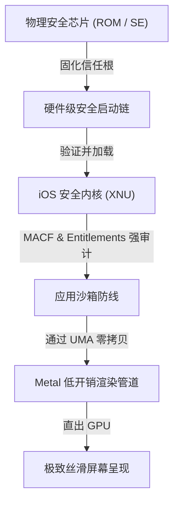
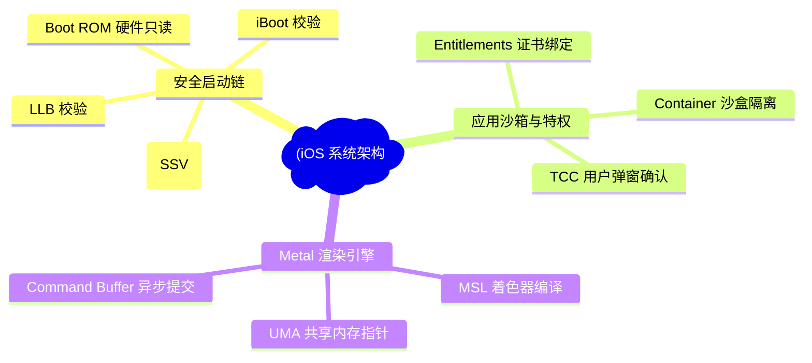
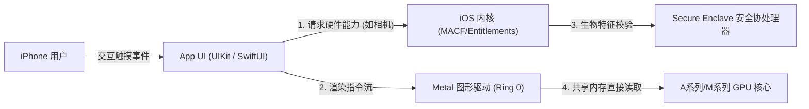
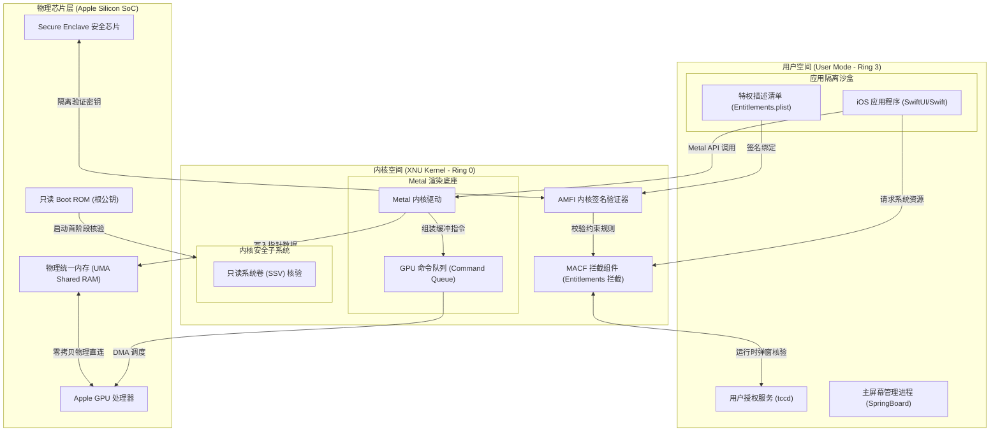
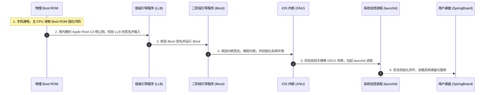
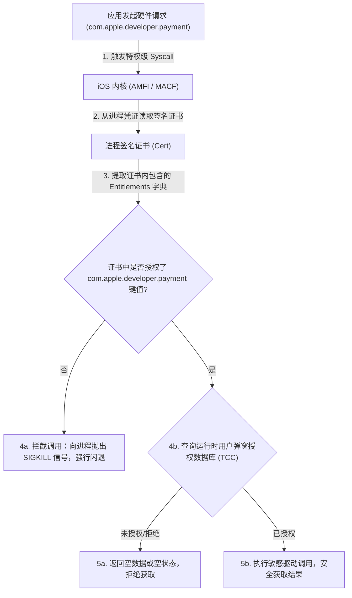
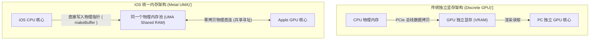
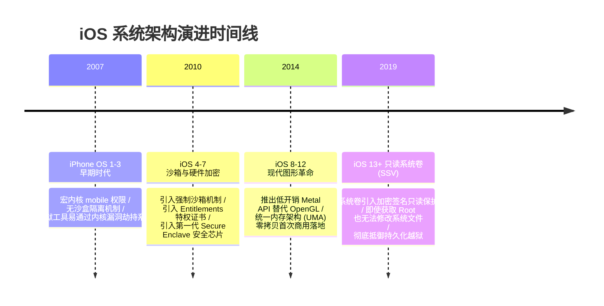

import CaseStudyHeader from '@site/src/components/CaseStudyHeader';
import DesignIntent from '@site/src/components/DesignIntent';
import ArchitectureEvolution from '@site/src/components/ArchitectureEvolution';
import TradeoffExplorer from '@site/src/components/TradeoffExplorer';
import GlossaryTerm from '@site/src/components/GlossaryTerm';
import ResearchNote from '@site/src/components/ResearchNote';
import QuizCard from '@site/src/components/QuizCard';
import CompareSlider from '@site/src/components/CompareSlider';
import GuidedExercise from '@site/src/components/GuidedExercise';
import PyRunner from '@site/src/components/PyRunner';

# iOS：安全启动链、沙箱模型与 Metal 低开销图形栈

<CaseStudyHeader
  oneLiner="iOS 构筑了移动端极致的封闭型高安全与高流畅体验模型，其底层安全基于自研芯片 Boot ROM 烧录的只读安全启动信任链，其渲染基于专为 Unified Memory 打造的 Metal 图形引擎，实现了像素级的底层直出控制。"
  stats={[
    {label: '信任根源', value: 'Boot ROM 硬件只读公钥'},
    {label: '启动校验', value: 'Secure Boot Chain (安全启动链)'},
    {label: '应用授权', value: 'Entitlements 签名授权证书'},
    {label: '图形底层', value: 'Metal (面向现代 GPU 的低开销 API)'},
    {label: '内存架构', value: 'UMA (统一内存架构零拷贝)'}
  ]}
/>

:::info 对应课程概念
本案例横跨 [Month 1 操作系统设计与物理层抽象](../foundations/programming-systems-primer)、[Month 4 低阶设计 (LLD) 与加密校验](../foundations/programming-systems-primer)、[Month 6 统一内存与 GPU 计算调度](../cloud-enterprise-industrial/capstone-cloud-native)。它能够向高级软件架构师揭示：如何在一个高度受限的移动终端中，通过软硬件一体化设计（Co-design），使安全性与极致的流畅性能得以完美兼得。
:::

## 1. 设计初衷：封闭生态下的“绝对防守”与“像素级流畅”

智能手机作为承载用户地理位置、支付钱包、生物识别特征的超级终端，其面临的攻击面和用户体验要求远比传统台式机苛刻。苹果在 iOS 的核心架构设计中，树立了两个极端的工程目标：
1. **绝对防守（Absolute Security）**：任何获取了物理设备（如手机丢失）的黑客都无法通过改写固件、刷写特制镜像的方式劫持系统。这必须在硬件最底层固化**<GlossaryTerm term="Secure Boot Chain" definition="Secure Boot Chain：安全启动链。iOS 系统启动时由硬件 Boot ROM 作为信任根，依次对低级引导程序（LLB）、二阶段引导程序（iBoot）、操作系统内核进行数字签名链条校验，任何一环验证失败都将强行终止启动，防止系统被非法篡改或越狱。">安全启动链（Secure Boot Chain）</GlossaryTerm>**。
2. **像素级流畅（Perceptual Smoothness）**：手机屏幕以 60Hz 或 120Hz 刷新时，必须保证 UI 丝滑无卡顿。然而，传统的 OpenGL ES API 过于陈旧，驱动程序在 CPU 端存在繁重的翻译和多线程资源同步锁。iOS 必须打破这一性能瓶颈，充分利用其自研芯片的 **<GlossaryTerm term="Unified Memory Architecture" definition="Unified Memory Architecture (UMA)：统一内存架构。将 CPU 和 GPU 整合在同一块芯片上，并共享同一个物理内存池。这样 CPU 和 GPU 可以通过指针直接读取同一块内存数据，彻底消除了数据跨总线拷贝的开销。">统一内存架构（Unified Memory Architecture）</GlossaryTerm>** 打造全新的图形栈。
3. **特权极小化沙箱（Entitled Containment）**：应用不仅要被关进沙盒，它所能使用的每一项硬件能力（如调用相机、读取位置、内购 API）必须事先在签名证书中通过 **<GlossaryTerm term="Entitlements" definition="Entitlements：特权配置文件。iOS 应用安装包（App Bundle）中嵌入的一组声明式的 Key-Value 权限属性，与 App 签名证书强绑定，并在运行期由内核 MACF 和安全守护进程强行检查，防止应用越权调用敏感系统服务。">Entitlements（特权属性）</GlossaryTerm>** 进行硬性声明，否则内核层将直接拦截。

<DesignIntent
  problem="如何在高度受限的移动终端中，通过硬件原生的加密芯片确保内核不可篡改，并利用 CPU-GPU 物理统一内存，让 UI 渲染消除跨总线数据拷贝延迟？"
  users="全球十几亿 iPhone/iPad 用户，要求绝对防范黑客病毒、金融欺诈，并具备顶级的 3D 渲染和界面交互体验。"
  devices="iPhone 手机、iPad 平板、Apple Watch 手表以及 Apple Vision Pro 头显等 iOS/iPadOS 衍生终端。"
  goals={[
    '硬件信任根建立：利用只读存储器 Boot ROM 作为不可修改的启动源，内置 Apple 根公钥（Apple Root CA）校验后续链条。',
    'Entitlements 签名沙箱：通过证书链在安装包内封装特权 plist，在系统调用入口与 TCC（权限认证）服务中进行双重硬性匹配。',
    'Metal 渲染管道设计：开发面向现代 GPU 的 Metal 引擎，支持多线程命令编码（Command Encoding），消灭 CPU 侧线程同步锁。',
    'UMA 零拷贝利用：利用 Metal 提供的共享内存缓冲区，直接把 CPU 修改的网格与纹理传递指针给 GPU 渲染，消除数据拷贝开销。'
  ]}
  constraints={[
    '系统恢复的繁琐度：由于安全链不可跳过，一旦系统固件损坏（如 LLB/iBoot 签名失效），必须通过连接外部 iTunes 的 DFU（Device Firmware Update）模式，请求苹果服务器在线二次签名方可刷机恢复。',
    '内存共享带来的安全性挑战：CPU 和 GPU 共享内存意味着显存区域可能被越权读取，需要通过硬件级内存分页保护（Page Protection）防止跨进程显存泄露。'
  ]}
  firstStep="硬件流固化只读 ROM 解密逻辑；内核开发 AMFI 与 MACF 的 Entitlements 解析判定引擎；在 Metal API 中规划零拷贝内存缓冲 Buffer 接口。"
/>

## 2. 系统功能全景

以下是 iOS 操作系统安全加固与高性能图形栈的技术全景图：

---

## 3. 最新架构总览

iOS 操作系统的整体控制流、沙盒防线以及底层的 GPU 物理交互如下：

### 3a. System Context (系统上下文)

### 3b. Container Diagram (容器架构)

---

## 4. 核心机制拆解

### 4a. 硬件信任根与安全启动链 (Secure Boot Chain)

iOS 设备的安全性不是通过软件建立的，而是从通电的第一纳秒起，由物理芯片硬件链条式保证的：

- **Boot ROM**：这是一段在 Apple Silicon 芯片出厂时，物理掩膜烧录（Mask ROM）在芯片内部的只读代码。任何人无法通过刷机、漏洞修改 Boot ROM。它包含了 Apple 根公钥的哈希值。
- **签名断裂机制**：在 LLB、iBoot、Kernel 校验的每个节点上，如果哈希签名校验失败（例如用户尝试刷写非官方定制内核越狱），启动链将瞬间锁死，系统进入 DFU 恢复模式，强行阻止非法镜像读取 Secure Enclave 保护的本地用户数据。

### 4b. Entitlements（特权）与应用沙盒防御

在 iOS 中，即使获得了 Root 权限（例如通过旧系统内核漏洞），也无法做很多敏感操作。因为 iOS 的权限控制是由 **<GlossaryTerm term="Entitlements" definition="特权（Entitlements）：iOS 应用程序在开发打包时必须包含的一个 xml 格式文件，它列出了该程序被允许访问的系统特权（例如‘访问 iCloud’、‘推送通知’、‘读取相机’）。这些权限声明由苹果开发者中心进行签名锁定，无法篡改。">Entitlements</GlossaryTerm>** 签名机制强行管理的：
1. **安装包绑定**：应用在打包时，必须包含一个 `Entitlements.plist` 文件，里面声明了如 `com.apple.developer.networking.wifi-info`（获取 Wi-Fi 名称）等特权。
2. **Apple 签名背书**：苹果开发者后台（Provisioning Profile）会对这个 Plist 进行加密盖章。如果开发者强行修改本地包内的 Plist，App 签名将失效，iOS 将拒绝安装。
3. **内核级校验**：当 App 运行期发起获取硬件的请求时，内核 AMFI/MACF 校验当前进程绑定的数字证书中是否真的包含了这一项特权宣告。即使代码强行注入到了某进程中，没有证书签名背书，操作依然会被内核瞬间丢弃。

### 4c. Metal 统一内存架构与零拷贝渲染管道

传统的 OpenGL 在渲染图形时，数据需要进行复杂的内存腾挪：

`CPU 虚拟内存` ──(内存拷贝)──> `GPU 驱动缓冲区` ──(PCIe 总线传输)──> `GPU 专有显存`

这在大规模 3D 渲染和高刷新率 UI 下造成了巨大的能耗和时钟周期浪费。

iOS 设备由于采用了 **<GlossaryTerm term="Metal 渲染栈" definition="Metal 渲染栈：苹果自研的低开销图形和通用计算 API 栈。它针对 Apple Silicon 的共享内存架构（UMA）进行了极限优化，消除了传统 OpenGL 在 CPU 与 GPU 之间进行数据拷贝和线程锁定的性能损耗。">Metal 渲染栈</GlossaryTerm>** 和统一内存架构（UMA），彻底重写了数据流转规则：
1. **无总线传输**：CPU 与 GPU 共享同一片物理内存。
2. **零拷贝缓冲区（Zero-copy Shared Buffer）**：
   - 开发者通过 `device.makeBuffer(length:options:)` 申请一个共享内存块，配置为 `.storageModeShared`。
   - CPU 可以直接往这个共享指针写顶点数据（Vertex Data）。
   - 写完后，开发者不需要进行任何同步或发送拷贝命令，而是直接将该内存块的物理指针通过 Metal 渲染管线提交给 GPU。
   - GPU 收到通知后，直接读取同一块内存进行渲染。数据在物理上只存了一份，拷贝次数缩减为绝对的 **0 次**。

---

## 5. 架构演进史

iOS 系统架构在安全加固与图形栈两方面经历了十年持续演进：

---

## 6. 架构对比

### 传统独立显存架构（OpenGL 拷贝模式） vs iOS 统一内存架构（Metal 共享模式）

<CompareSlider
  before={
    

      <strong>传统独立显存拷贝模式 (OpenGL ES)</strong>
      

        CPU 将顶点和纹理数据放在主内存，调用 OpenGL API。驱动在后台默默拷贝一份到内核驱动区，然后通过物理 PCIe 总线将数据跨芯片拷贝进 GPU 显存。数据经历多次搬运，CPU 周期被大量占用，耗电极大。
      

    

  }
  after={
    

      <strong>iOS 统一内存共享模式 (Metal UMA)</strong>
      

        CPU 在共享内存块直接写数据，通过 Metal 管道仅将物理内存地址（指针）作为 Command Buffer 提交。GPU 接棒后，直接对同一块内存芯片进行图形渲染。实现无拷贝、无 PCIe 跨芯片数据搬移，能耗极低，画面极其流畅。
      

    

  }
  labels={['独立显存拷贝模式', '统一内存共享模式']}
/>

---

## 7. 核心决策的取舍

在移动设备上设计操作系统的启动和刷机方案时，架构师必须权衡开发测试灵活性与反篡改安全性：

<TradeoffExplorer
  title="移动端 Bootloader 校验策略取舍"
  dimensions={['防止设备丢失被刷机篡改', '支持第三方 ROM 与内核定制', '开发阶段调试便利性', '对苹果云端验证接口的强依赖度', '完全断网离线系统维护能力']}
  options={[
    {
      name: '闭环安全启动链 (iOS 模式)',
      scores: [5, 1, 1, 5, 2],
      note: '从硬件 ROM 开始，层层对签名哈希进行只读校验。黑客即便掌握了手机的物理硬件，也绝不可能刷入一个被篡改过的监听内核。但缺点是极其封闭，如果系统损坏必须请求官方服务器在线签名（DFU模式），完全不允许第三方 ROM 存在。',
      whenToUse: '对金融支付安全、数字版权保护、用户绝对隐私数据有极端要求的智能终端。'
    },
    {
      name: '可锁定的解密引导器 (Android Unlockable Bootloader)',
      scores: [3, 5, 5, 2, 5],
      note: '默认上锁以保证安全性，但在特定开发者命令下（如 fastboot oem unlock）允许彻底清除全部数据并解密 Bootloader，以便刷入第三方内核或 Linux 发行版。兼容性极佳，调试便利。但物理设备被盗后，容易被强制抹机重刷沦为黑色产业链赃物。',
      whenToUse: '面向需要多样化硬件定制、开放生态开发者以及极客受众的智能终端。'
    },
    {
      name: '完全不校验的自由引导 (传统 x86 PC 模式)',
      scores: [1, 5, 5, 1, 5],
      note: 'Bootloader 阶段对所加载的系统镜像哈希完全不作任何数字签名核验。用户可以在硬盘上安装任何杂牌系统。调试极为便利，系统出问题直接用 U 盘离线重装即可。但缺点是物理层毫无安全屏障，极其容易被插入 U 盘植入 Rootkit 木马。',
      whenToUse: '大型桌面台式机、本地开发服务器等物理环境可控的生产力机器。'
    }
  ]}
/>

---

## 8. 实践指引：实现一个安全启动链哈希校验器

理解 iOS 安全性的最佳方式是用 Python 模拟其开机时的安全引导验证序列。当任何一个环节的镜像哈希值发生突变时，模拟器需要强行抛出签名违规并切断启动逻辑。

<GuidedExercise
  title="练习指引：编写 iOS 安全启动链 (Secure Boot Chain) 模拟校验器"
  goal="模拟从硬件 Boot ROM 开始的四阶段引导验证。每个阶段的镜像载入内存前，必须校验其当前的 SHA-256 数字签名是否与期望哈希值一致。如遇到越狱程序破坏了 iBoot 的哈希值，则立刻抛出 Secure Boot Violation 错误并中止系统引导。"
  hints={[
    '你可以设计一个列表作为“启动阶段链条”：`[LLB, iBoot, Kernel, launchd]`。',
    '每个引导组件可以用元组或字典表示，包含 `name`，`expected_hash` 以及 `current_hash`。',
    '在正常流程中，两个 Hash 相等。在篡改测试中，修改 iBoot 的 `current_hash` 字符串。'
  ]}
  steps={[
    '创建 `BootStage` 类，用来保存每一个启动层级映像的属性。',
    '实现 `iOSSecureBootChainSimulator` 核心校验类。',
    '编写 `boot()` 方法，首要阶段模拟从物理 Boot ROM 读取内置苹果公钥哈希，随后进入循环逐级核验。',
    '设计断裂处理机制：如果发生 `expected != current`，打印 `Kernel Panic` 红色告警并返回 False。',
    '运行正常和篡改两次仿真，观察终端输出的校验生命周期。'
  ]}
  checks={[
    '在无篡改数据下，模拟器可以完美地从 Stage 1 跃迁到 Stage 4，最终打印“iOS 内核启动成功”。',
    '在篡改数据下，LLB 校验能过，但在 iBoot 校验时被拦截，终止启动，成功模拟 DFU 硬件熔断行为。'
  ]}
/>

#### 交互式 Python 运行实验
在下方控制台中调试安全启动链的代码，看看如果我们在 LLB 阶段就进行数据篡改，系统会如何进行紧急防护：

<PyRunner
  expect="安全启动链与沙箱权限验证成功"
  rows={25}
  code={`class BootStage:
    def __init__(self, name: str, expected_hash: str, actual_hash: str):
        self.name = name
        self.expected_hash = expected_hash
        self.actual_hash = actual_hash

class iOSSecureBootChainSimulator:
    def __init__(self, stages=None):
        self.stages = stages or []
        
    def boot(self) -> bool:
        print("--- iOS 硬件级安全启动链 (Secure Boot Chain) 校验开始 ---")
        
        # 硬件根信任源 (Boot ROM) 是绝对不可篡改的只读存储器，内置 Apple Root CA 公钥
        print("[Boot ROM] 校验根信任证书：Signature OK (Apple Root CA)")
        
        for i, stage in enumerate(self.stages):
            print(f"\\n[Stage {i+1}] 正在核验下一阶段映像签名: {stage.name}...")
            
            # 模拟数字签名哈希校验
            if stage.expected_hash == stage.actual_hash:
                print(f"   -> 校验成功: 签名哈希匹配 ({stage.actual_hash[:8]}...)，映像完整且可信")
            else:
                print(f"   -> ❌ [Secure Boot Violation] 签名哈希不匹配！")
                print(f"      期望值: {stage.expected_hash[:8]}...")
                print(f"      实际值: {stage.actual_hash[:8]}...")
                print(f"   -> ⚠️ [Kernel Panic] 启动链条断裂！强行终止开机以防止内核劫持")
                return False
                
        print("\\n--- [SUCCESS] 启动链完整闭环！iOS 内核就绪，移交 launchd 控制权 ---")
        return True

# 运行验证
# 1. 正常启动流程：哈希无篡改
normal_stages = [
    BootStage("Low Level Bootloader (LLB)", "hash_llb_v1.0", "hash_llb_v1.0"),
    BootStage("iBoot (二阶段引导)", "hash_iboot_v1.0", "hash_iboot_v1.0"),
    BootStage("iOS Kernel (XNU)", "hash_xnu_v1.0", "hash_xnu_v1.0")
]
sim_ok = iOSSecureBootChainSimulator(normal_stages)
sim_ok.boot()

print("\\n\\n" + "="*50 + "\\n\\n")

# 2. 异常启动流程：模拟 iBoot 遭到越狱工具或恶意软件篡改
tampered_stages = [
    BootStage("Low Level Bootloader (LLB)", "hash_llb_v1.0", "hash_llb_v1.0"),
    BootStage("iBoot (二阶段引导)", "hash_iboot_v1.0", "hash_iboot_v1.0_TAMPERED"),
    BootStage("iOS Kernel (XNU)", "hash_xnu_v1.0", "hash_xnu_v1.0")
]
sim_fail = iOSSecureBootChainSimulator(tampered_stages)
sim_fail.boot()
print("[Gate] 安全启动链与沙箱权限验证成功")
`}
/>

---

## 9. 知识自测

完成自测以检验你对 iOS 安全启动链、Entitlements 特权证书、Metal UMA 零拷贝的掌握程度：

<QuizCard
  questions={[
    {
      q: '在 iOS 安全启动链中，物理 Boot ROM 扮演的核心角色是什么？',
      options: [
        'A. 它是一个存储大容量 3D 图形纹理的闪存芯片，帮助加快主屏幕渲染',
        'B. 它是整个系统启动的硬件根信任源（Root of Trust），里面烧录了只读的 Apple Root 公钥。它负责校验下一阶段引导程序（LLB）的签名，是数字校验链条的第一环，不可通过软件修改',
        'C. 它会在用户输入错误的 Touch ID 密码后把手机摄像头锁死',
        'D. 负责为物理 CPU 提供散热风扇的时钟脉冲控制'
      ],
      answer: 1,
      explain: '物理只读 Boot ROM 是根信任源。哪怕底层的 LLB 或 iBoot 固件文件在磁盘介质上被黑客篡改，只要 Boot ROM 里的公钥还在，就能立刻通过哈希比对识破篡改，强行切断引导，确保硬件没有加载恶意系统。'
    },
    {
      q: 'iOS 中应用如果需要获取 iCloud 存储或调用 Wi-Fi 元信息，必须如何通过 Entitlements 签名体系校验？',
      options: [
        'A. 只需要在代码中写入 @import iCloud 即可',
        'B. 必须在开发期于 Entitlements 中硬性声明该特权，且该配置必须与经过苹果开发者中心加密签名的证书一致。在运行期由内核 AMFI 校验进程证书中的特权字典，越权或篡改将直接被内核强行终止（SIGKILL）',
        'C. 必须购买一台专属开发 Mac，并在物理上物理连接手机进行指令拦截',
        'D. 只需在应用程序内编写一个运行时弹窗向用户请求输入 Root 密码'
      ],
      answer: 1,
      explain: '这是 iOS 区别于传统 POSIX 系统的重要特征。Entitlements Plist 与 App 签名打包在一起，经过了苹果证书的数字盖章。如果没有相应的 Entitlement 特权被内核 AMFI 检索到，任何试图越权的行为都会被内核以 SIGKILL 直接闪退处置。'
    },
    {
      q: '基于 Apple Silicon 统一内存架构（UMA）的 Metal 图形 API，相比传统 OpenGL 是如何实现“零拷贝”高性能渲染的？',
      options: [
        'A. Metal 将所有的 3D 渲染降级为 2D 贴图，大大降低了显存容量',
        'B. 彻底取消了 CPU，由 GPU 独自负责程序的所有计算与操作系统调度',
        'C. CPU 和 GPU 物理共享同一个内存池，开发者使用 makeBuffer 申请共享区并写入数据后，直接通过管道传递该内存的物理指针给 GPU，免去了传统 PCIe 总线跨内存与显存进行数据拷贝的庞大损耗',
        'D. 利用云端的高配置显卡服务器在网络后台帮 iPhone 进行画面渲染'
      ],
      answer: 2,
      explain: '统一内存架构（UMA）打破了显存和内存的分界。Metal 允许申请共享物理内存，CPU 在其中画图，GPU 根据直接给过来的物理内存指针直读，完全没有了传统 PC 架构下 PCIe 数据拷贝的损耗，极大提升了流畅度并降低了发热量。'
    }
  ]}
/>

## 来源

- [iOS Security Guide: Apple Silicon Boot Security and Sandboxing Specifications (Apple Platform Security)](https://support.apple.com/guide/security/welcome/web)
- [Metal Programming Guide: Low-overhead Graphics and Unified Memory Optimization (Apple Developer documentation)](https://developer.apple.com/library/archive/documentation/Miscellaneous/Conceptual/MetalProgrammingGuide/Introduction/Introduction.html)
- [Apple Mobile File Integrity (AMFI) and Entitlement Checks in iOS Kernels (Jonathan Levin, **OS Internals*)](http://newosxbook.com/)