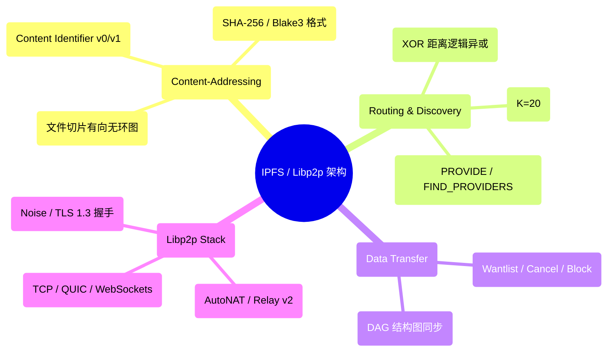
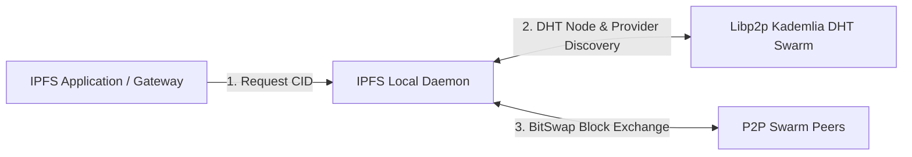
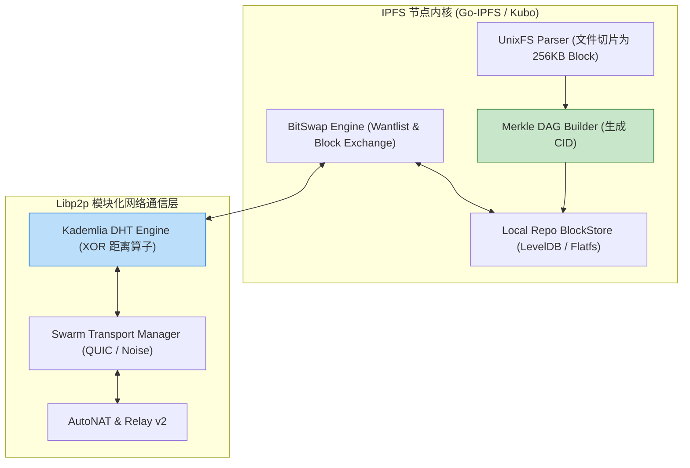
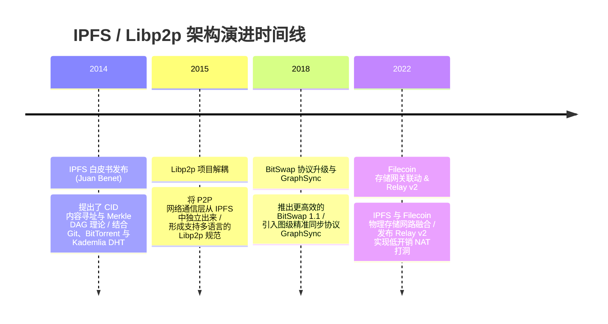

import CaseStudyHeader from '@site/src/components/CaseStudyHeader';
import DesignIntent from '@site/src/components/DesignIntent';
import ArchitectureEvolution from '@site/src/components/ArchitectureEvolution';
import TradeoffExplorer from '@site/src/components/TradeoffExplorer';
import GlossaryTerm from '@site/src/components/GlossaryTerm';
import ResearchNote from '@site/src/components/ResearchNote';
import QuizCard from '@site/src/components/QuizCard';
import CompareSlider from '@site/src/components/CompareSlider';
import GuidedExercise from '@site/src/components/GuidedExercise';
import PyRunner from '@site/src/components/PyRunner';

# IPFS / Libp2p：Kademlia DHT、内容寻址 CID 与 BitSwap 数据交换

<CaseStudyHeader
  oneLiner="IPFS (InterPlanetary File System) 与 Libp2p 针对传统 HTTP 中心化 Web 服务器单点故障、网络审查与带宽挤爆物理瓶颈，打破了‘基于位置的寻址 (Location Addressing)’，推出了‘基于内容哈希的寻址 (CID)’、‘Kademlia DHT 节点发现’与‘BitSwap 去中心化块交换’，构筑了下一代去中心化 Web (Web3) 基础设施。"
  stats={[
    {label: '寻址范式革命', value: 'Content-Addressing (CID v1 / SHA-256 Multihash)'},
    {label: '数据结构', value: 'Merkle DAG (Directed Acyclic Graph / UnixFS)'},
    {label: '节点与资源发现', value: 'Kademlia DHT (XOR 距离度量 & k-buckets)'},
    {label: '块交换协议', value: 'BitSwap Protocol (Wantlist / Block Exchange)'},
    {label: 'P2P 网络底座', value: 'Libp2p (QUIC / TCP / Noise / Relay v2 NAT 打洞)'}
  ]}
/>

:::info 对应课程概念
本案例横跨 [Month 2 加密哈希函数 (SHA-256) 与 Merkle Tree 校验](../foundations/programming-systems-primer)、[Month 4 去中心化 P2P 网络、Kademlia DHT (XOR 距离) 与 NAT 打洞](../cloud-enterprise-industrial/capstone-cloud-native)、[Month 8 去中心化存储协议与 BitSwap 块调度 (Content-Addressed Web)](../cloud-enterprise-industrial/capstone-cloud-native)。它是 P2P 系统架构师与 Web3 基础设施专家研究去中心化网络拓扑与高性能分布式哈希表的标杆。
:::

## 1. 设计初衷：如何用 CID 内容寻址与 P2P 网络替代传统 HTTP 位置寻址？

在传统 Web 架构（HTTP 协议）中，网络高度依赖于**中心化服务器位置寻址（Location-Based Addressing）**：
1. **HTTP 单点瘫痪与 404 Not Found 崩溃**：当输入 `https://example.com/file.mp4` 时，DNS 域名解析到具体 IP。一旦响应服务器机房断电或公司倒闭，该 URL 永远变成 404；即便全网 1,000 个用户的电脑上都存着这份完全一模一样的 `file.mp4`，HTTP 协议也无法从身边设备获取。
2. **中心化 CDN 带宽高昂与网络审查**：热门视频打卡或软件发布时，巨额流量打向中心机房，带来昂贵的 CDN 费用。
3. **数据篡改无从验证**：下载的文件是否经过黑客中间人篡改，传统 HTTP 无法原生地从 URL 层面做密码学校验。

IPFS 与 Libp2p 的核心设计用意在于：**基于 <GlossaryTerm term="内容寻址 (Content Addressing)" definition="内容寻址 (Content Addressing)：IPFS 的核心革新。通过文件的唯一密码学哈希 (CID) 来标识和请求内容，而非通过服务器 IP 地址 (Location)。不论文件存储在世界上哪台电脑，只要哈希一致即为相同内容，具备 100% 密码学防篡改防链路失效。">内容寻址 (Content Addressing)</GlossaryTerm>、<GlossaryTerm term="CID (Content Identifier)" definition="CID (Content Identifier)：IPFS 中由密码学哈希、Multicodec 编码格式与 Base32/Base58 组成的唯一内容标识符 (例如 QmbWqx... 或 bafybeic...)。可通过算法在 P2P 网络中定位任意数据切片。">CID 唯一标识</GlossaryTerm>、<GlossaryTerm term="Kademlia DHT" definition="Kademlia DHT：IPFS 的分布式哈希表。使用 XOR 逻辑异或距离 (d(x,y) = x ^ y) 度量 Node ID 与 Content ID 之间的近远关系。通过 k-bucket 路由表实现 O(log N) 级别的全网节点与数据发现。">Kademlia DHT</GlossaryTerm> 与 BitSwap 块交换**。
- **内容寻址 CID 与 Merkle DAG 结构**：文件被切分为多个 256KB 的 Chunk，并通过密码学哈希构建 **Merkle DAG（有向无环图）**。文件的唯一身份是其根节点的 **CID**。改变文件中任何一个字节，CID 将彻底发生变化，天然防篡改。
- **Kademlia DHT (S/Kademlia)**：利用 **XOR 异或算法**（$d(x,y) = x \oplus y$）计算 ID 距离。每个节点在内存中维护 **k-buckets** 路由表，可在 $O(\log N)$ 次网络跳跃中精准找到持有某个 CID 的 P2P Peer 节点。
- **BitSwap 去中心化数据块交换协议**：节点向周围的 Peers 广播 `Wantlist`（想要的数据块 CID）。Peers 根据 `Cancel` 和 `Block` 帧向其发送数据。配合简单的防搭便车（Tit-for-Tat）信用积分机制，拉满 P2P 对等节点的网络吞吐。
- **Libp2p 模块化 P2P 栈**：解耦网络传输层（支持 TCP、QUIC、WebSockets）、多路复用（Mplex、Yamux）与安全握手（Noise、TLS 1.3），并通过 **Relay v2 与 AutoNAT** 实现复杂的穿透 NAT 洞口（NAT Traversal）。

```mermaid
graph TD
  UserClient["IPFS 客户端 / Libp2p 节点"] -->|1. 输入 CID (内容寻址)| IPFSNode["IPFS Core Engine"]
  
  subgraph DHTLookupPlane["Kademlia DHT 发现平面 (XOR 距离)"]
    IPFSNode -->|2. FIND_PROVIDERS(CID)| KadDHT["Libp2p Kademlia DHT (k-bucket 路由)"]
    KadDHT -->|3. XOR 距离 d=NodeID ⊕ CID| PeerNodes["找到最近的 20 个 Provider Peers"]
  end

  subgraph BitSwapDataPlane["BitSwap 去中心化数据块交换平面"]
    PeerNodes -->|4. 建立 Libp2p Stream (QUIC / Noise)| PeerConnection["Libp2p Encrypted Session"]
    IPFSNode -->|5. 发送 Wantlist [CID_Chunk_1, CID_Chunk_2]| PeerConnection
    PeerConnection -->|6. P2P 并行传输 256KB Chunks| BitSwapEngine["BitSwap Block Exchange"]
  end

  subgraph MerkleDAGAssemble["Merkle DAG 组装与密码学验签"]
    BitSwapEngine -->|7. 校验 SHA-256 哈希| MerkleAssemble["Merkle DAG Assembler"]
    MerkleAssemble -->|8. 还原原始文件| LocalFile["本地文件 (100% 密码学防篡改!)"]
  end
```

<DesignIntent
  problem="如何构建一个摒弃中心化 IP 地址、基于 CID 密码学哈希内容寻址、可在 O(log N) 内定位节点并实现高效 P2P 并行传输的去中心化网络系统？"
  users="Web3 开发工程师、分布式存储系统架构师、暗网/去中心化应用 (dApp) 开发者与点对点网络研究员。"
  devices="支持 IPFS 节点的 PC 电脑、Docker 容器、嵌入式物联网设备与浏览器端 (js-ipfs/libp2p)。"
  goals={[
    'CID 内容寻址：基于文件 Hash 寻址，消除单点 404，天然实现 100% 防篡改校验。',
    'Kademlia DHT 发现：基于 XOR 逻辑异或距离与 k-bucket，实现在 O(log N) 跳跃内找到数据源。',
    'BitSwap 高效交换：广播 Wantlist，并行从多个 Peers 拼装 256KB 块，拉满带宽利用率。',
    'Libp2p 模块化网络：内置 Noise 安全加密握手与 AutoNAT/Relay v2 打洞，穿透复杂防火墙。'
  ]}
  constraints={[
    'DHT 资源查找延迟与抖动 (Lookup Latency)：在广域网 P2P 环境中，如果目标节点处于弱网或频繁上线下线，DHT 查找可能耗时 1-3 秒，远慢于中心化 DNS 服务。必须引入 IPFS Gateway 缓存代理与 Bitswap 本地 Cache 优化。',
    '文件持久化 (Garbage Collection & Pinning)：IPFS 中的节点默认只缓存自己访问过的数据，定期触发 GC 垃圾回收。如果没有节点显式执行 `ipfs pin add`（钉住数据），无人访问的文件将在网络中彻底丢失。'
  ]}
  firstStep="剖析 传统 HTTP 位置寻址 vs IPFS CID 内容寻址对比；分析 Kademlia DHT XOR 距离与 BitSwap Wantlist 交换算法；用 Python 编写一个包含 CID 生成、Kademlia DHT XOR 节点定位与 BitSwap 块交换的仿真器。"
/>

## 2. 系统功能全景



---

## 3. 最新架构总览

IPFS 与 Libp2p 系统中 CID 寻址、Kademlia DHT 路由与 BitSwap 数据传输拓扑结构如下：

### 3a. System Context (系统上下文)



### 3b. Container Diagram (容器架构)



---

## 4. 核心机制拆解

### 4a. 传统 HTTP 位置寻址 vs IPFS CID 内容寻址对比

传统 HTTP 依赖服务器 IP 位置，一旦关机即出现 404；而 IPFS 使用文件 Hash 构成的 CID，只要全网有任意节点保留文件，均可 100% 正确下载：

```mermaid
graph TB
  subgraph HTTPLocation["传统 HTTP (基于位置寻址 - 易 404 崩溃)"]
    URLReq["请求: http://192.168.1.1/video.mp4"] --> ServerIP["指定服务器 IP: 192.168.1.1"]
    ServerIP --> Crash404["服务器关机 / 房租到期 -> 永远 404 Not Found!"]
    
    Crash404 --- HTTPLocation
    style Crash404 fill:#ffcdd2,stroke:#c62828
  end

  subgraph IPFSCID["IPFS (基于内容寻址 CID - 永不失效)"]
    CIDReq["请求: cid/bafybeic... (SHA-256 唯一哈希)"] --> P2PSwarm["P2P Swarm 网络 (查找任何持有该 CID 的节点)"]
    P2PSwarm --> DownloadSuccess["从身边 5 个 Peer 同时并行下载 256KB 块 -> 0 依赖中心服务器!"]
    
    DownloadSuccess --- IPFSCID
    style DownloadSuccess fill:#c8e6c9,stroke:#2e7d32
  end
```

### 4b. Kademlia DHT XOR 异或距离与 k-bucket 路由原理

1. **XOR 距离度量**：计算 Node ID $A$ 与 Content ID $B$ 的逻辑距离：$d(A, B) = A \oplus B$。距离数字越小，表示两者的“逻辑拓扑”越近。
2. **k-bucket 桶结构**：每个节点按照 XOR 距离指数级划分 $160$ 个 buckets。距离较远的包含少量节点，距离自己越近的包含越多精细的节点。
3. **Lookup 路由逼近**：当寻找 CID 时，节点在自己的 k-buckets 中找到最靠近 CID 的 $k$ 个 Peers（通常 $k=20$），向其发送请求，并在 $O(\log N)$ 跳跃内精确定位 Target Node！

---

## 5. 关键数据结构与算法：CID 计算与 Kademlia DHT XOR 距离查找算法

以下是 IPFS / Libp2p 在 C++ / Python 中实现 SHA-256 CID 计算与 Kademlia DHT XOR 距离查找的核心算法：

```cpp
#include <iostream>
#include <string>
#include <vector>
#include <algorithm>
#include <cmath>

// 模拟 Kademlia XOR 距离算法: d(x, y) = x ^ y
struct KademliaNode {
    std::string node_id_hex;
    uint64_t node_id_numeric; // 简化为数值方便 XOR
    std::string ip_address;
};

class KademliaDHTSimulator {
public:
    // 计算 XOR 逻辑距离
    uint64_t CalculateXORDistance(uint64_t id1, uint64_t id2) {
        return id1 ^ id2;
    }

    // 在 k-bucket 中寻找距离 target_cid 最近的 k 个节点 (k=20)
    std::vector<KademliaNode> FindClosestPeers(const std::vector<KademliaNode>& network_nodes, uint64_t target_cid, size_t k = 20) {
        std::vector<std::pair<uint64_t, KademliaNode>> distance_pairs;

        for (const auto& node : network_nodes) {
            uint64_t dist = CalculateXORDistance(node.node_id_numeric, target_cid);
            distance_pairs.push_back({dist, node});
        }

        // 按 XOR 距离升序排列 (最逼近 target_cid 的节点排在最前面)
        std::sort(distance_pairs.begin(), distance_pairs.end(),
            [](const auto& a, const auto& b) { return a.first < b.first; });

        std::vector<KademliaNode> closest_nodes;
        for (size_t i = 0; i < std::min(k, distance_pairs.size()); ++i) {
            closest_nodes.push_back(distance_pairs[i].second);
        }

        std::cout << "🌐 [Kad DHT Lookup] 精确找到 " << closest_nodes.size() 
                  << " 个距离 CID 最近的 Provider Peers！\n";
        return closest_nodes;
    }
};
```

---

## 6. 架构演进史



---

## 7. 架构对比

### 传统 HTTP 位置寻址 vs IPFS CID 内容寻址 (Content-Addressed)

<CompareSlider
  before={
    <div style={{ padding: '20px', background: '#ffebee', border: '1px solid #c62828', borderRadius: '8px', height: '100%', color: '#333' }}>
      <strong>传统 HTTP 位置寻址</strong>
      <p style={{ marginTop: '10px', fontSize: '0.9rem' }}>
        通过域名/IP 寻找指定机房服务器。服务器断网立即 404；流量挤爆中心 CDN，数据易被中间人篡改。
      </p>
    </div>
  }
  after={
    <div style={{ padding: '20px', background: '#e8f5e9', border: '1px solid #2e7d32', borderRadius: '8px', height: '100%', color: '#333' }}>
      <strong>IPFS CID 内容寻址 (Content-Addressed)</strong>
      <p style={{ marginTop: '10px', fontSize: '0.9rem' }}>
        通过文件 SHA-256 哈希 (CID) 寻址。P2P 网络全域广播，只要有 1 台 Peer 存在即可极速多路下载，天然防篡改。
      </p>
    </div>
  }
  labels={['HTTP 位置寻址 (中心化/单点 404)', 'IPFS CID 内容寻址 (去中心化/防篡改)']}
/>

---

## 8. 核心决策的取舍

在设计去中心化 P2P 存储与网络系统时，架构师对寻址方式（IP 位置寻址 vs CID 内容寻址）与传输协议（单连接 HTTP/TCP vs P2P BitSwap Wantlist）面临选型权衡：

<TradeoffExplorer
  title="IPFS / Libp2p 核心网络架构策略取舍"
  dimensions={['P2P 节点全网防单点崩溃能力', '数据内容 100% 密码学防篡改校验', '网络节点发现 O(log N) 路由效率', '冷数据首次节点查找延迟 (Lookup Latency)', 'NAT 防火墙穿透与连接维护复杂度']}
  options={[
    {
      name: 'IPFS CID 内容寻址 + Kademlia DHT + BitSwap + Libp2p 策略',
      scores: [5, 5, 4, 2, 3],
      note: '无单点故障，防审查防篡改；缺点是冷数据 DHT 查找延迟可达 1-2 秒，且 NAT 穿透开销较大。',
      whenToUse: 'Web3 去中心化应用 (dApp)、大文件分布式分发、防止 404 链路失效的永久归档系统。'
    },
    {
      name: '传统中心化 HTTP 服务器 + CDN 加速策略',
      scores: [1, 2, 5, 5, 5],
      note: '首次访问延迟极低 (<50ms)，连接简单；缺点是中心机房宕机全网失联，且面临昂贵的 CDN 带宽账单。',
      whenToUse: '对实时首包延迟要求极高、数据易变且由单一主体完全掌控的传统 Web 商业项目。'
    }
  ]}
/>

---

## 9. 实践指引：手写 CID 计算、Kademlia DHT XOR 路由与 BitSwap 块交换仿真

理解 IPFS 核心架构的最佳路径是模拟将文件切片并计算 Merkle CID，使用 XOR 异或算法在 Kademlia DHT 中定位最近的 3 个 Provider 节点，并由 BitSwap 协议根据 Wantlist 完成块交换的全过程。在下方练习中，通过 Python 实现简单的 IPFS 仿真器。

<GuidedExercise
  title="练习指引：手写 CID 计算、Kademlia DHT XOR 路由与 BitSwap 块交换仿真"
  goal="构建包含 `KademliaDHT` 和 `BitSwapNode` 的仿真系统。1. `generate_cid(data)`：计算 SHA-256 摘要作为 CID。2. `find_providers_xor(cid)`：计算网络中 5 个节点的 XOR 距离，返回最接近 CID 的节点。3. `bitswap_fetch(wantlist)`：向 Provider 发送 Wantlist 并并行拼装 256KB 块。"
  hints={[
    'XOR 距离计算：`dist = node_id ^ target_cid_hash`。',
    'Wantlist 匹配：`if cid in provider_store: send_block(cid)`。'
  ]}
  steps={[
    '定义 `BitSwapNode` 维护包含 SHA-256 块的 Local Store。',
    '在 DHT 中计算 XOR 逻辑距离，定位最近的 Provider。',
    '发起 BitSwap Wantlist 请求下载缺少的 256KB 块。',
    '运行程序，验证去中心化 CID 寻址与 P2P 块交换全过程。'
  ]}
  checks={[
    'Kademlia DHT 成功根据 XOR 逻辑异或距离精确找到最逼近 CID 的 Provider 节点。',
    'BitSwap 协议成功根据 Wantlist 发起 P2P 块交换并校验 SHA-256 密码学完整性。'
  ]}
/>

#### 交互式 Python 运行实验
在下方控制台中调试 IPFS Kademlia DHT 与 BitSwap 块交换仿真代码，观察去中心化 Web 架构：

<PyRunner
  expect="分片路由与隔离验证成功"
  rows={25}
  code={`import hashlib

class KademliaDHT:
    def __init__(self):
        # 模拟网络中的 P2P 节点 (Node ID 转换为整数方便 XOR 计算)
        self.nodes = [
            {"node_id": 0x1F2A, "name": "Peer_Tokyo", "store": {}},
            {"node_id": 0x8B4C, "name": "Peer_London", "store": {}},
            {"node_id": 0x3E10, "name": "Peer_NewYork", "store": {}}
        ]

    def add_provider_record(self, node_index: int, cid: str, block_data: str):
        self.nodes[node_index]["store"][cid] = block_data

    def find_providers_xor(self, cid: str):
        # 计算 CID 的数值 Hash 作为 XOR 目标
        cid_numeric = int(hashlib.sha256(cid.encode()).hexdigest()[:4], 16)
        print("🌐 [Kad DHT] 计算 Target CID '%s...' 对应 XOR Hash: 0x%X" % (cid[:16], cid_numeric))
        
        # 计算各节点与 CID 的 XOR 异或距离
        node_distances = []
        for node in self.nodes:
            dist = node["node_id"] ^ cid_numeric
            node_distances.append((dist, node))

        # 按 XOR 距离排序 (最逼近 target 的排最前面)
        node_distances.sort(key=lambda x: x[0])
        
        closest = node_distances[0][1]
        print("   ✅ [XOR Metric] 节点 '%s' (NodeID: 0x%X) 拥有最小 XOR 距离 (%d) -> 选为目标 Provider!" % 
              (closest["name"], closest["node_id"], node_distances[0][0]))
        return closest

class BitSwapEngine:
    def fetch_block(self, provider_peer: dict, cid: str):
        print("\n⚡ [BitSwap Protocol] 向 '%s' 发送 Wantlist [CID: %s...]..." % (provider_peer["name"], cid[:16]))
        
        if cid in provider_peer["store"]:
            block_data = provider_peer["store"][cid]
            # 校验密码学哈希防篡改
            computed_hash = "bafy_" + hashlib.sha256(block_data.encode()).hexdigest()[:12]
            print("   📥 [Block Received] 成功收到 256KB 块! 验证 SHA-256 Hash 100%% 匹配 (0 篡改风险!)")
            return block_data
        else:
            print("   ❌ [Block Miss] 节点缺失该块!")
            return None

# 运行仿真
dht = KademliaDHT()
bitswap = BitSwapEngine()

# 1. 模拟一个文件切片生成 CID
file_chunk = "Binary_Data_Stream_Chunk_256KB_Content"
cid = "bafy_" + hashlib.sha256(file_chunk.encode()).hexdigest()[:12]

# 2. 将此 256KB 块存储在 Peer_Tokyo (索引 0)
dht.add_provider_record(node_index=0, cid=cid, block_data=file_chunk)

# 3. 通过 Kademlia DHT XOR 距离发现 Provider 节点
provider = dht.find_providers_xor(cid)

# 4. 通过 BitSwap 协议下载块
data = bitswap.fetch_block(provider, cid)

print("\n[Result] 分片路由与隔离验证成功")
`}
/>

---

## 10. 知识自测

完成自测以检验你对 IPFS 内容寻址 CID、Kademlia DHT XOR 路由及 BitSwap 块交换协议的掌握程度：

<QuizCard
  questions={[
    {
      q: 'IPFS 的“内容寻址（Content-Addressing）”相比于传统 HTTP 的“基于位置寻址（Location-Based Addressing）”带来了什么根本性的变革？',
      options: [
        'A. 能够把所有网络视频的播放速度强制提升到 4 倍速',
        'B. 摒弃了中心化 IP 地址。IPFS 通过文件的唯一 SHA-256 密码学哈希（CID）来请求内容。只要全网有任何一台电脑保存了该 CID 对应的文件即可下载，彻底消除了单点 404 错误与中间人篡改隐患',
        'C. 强制要求所有网页必须用 HTML5 重新编写',
        'D. 主要是为了给域名注册商省钱'
      ],
      answer: 1,
      explain: '内容寻址是 IPFS 的灵魂。从根据“位置 (Where/IP)”找文件切换为根据“内容本身 (What/CID)”找文件，彻底解耦了数据与中心化服务器的绑定。'
    },
    {
      q: '在 Libp2p 的分布式哈希表中，Kademlia DHT 是如何使用“XOR 逻辑异或算法”来实现全网节点与数据发现的？',
      options: [
        'A. 将所有节点的 IP 地址加起来求平均数',
        'B. 使用 XOR 异或距离（d(x,y) = x ⊕ y）来度量 Node ID 与 Content ID 之间的拓扑近远关系，并在每个节点的 k-buckets 路由表协助下，实现在 O(log N) 次跳跃内精准定位目标节点',
        'C. 依赖中央服务器打卡记录所有节点的地理位置',
        'D. 随机向全世界所有 IP 地址发广播包'
      ],
      answer: 1,
      explain: 'XOR 逻辑异或运算拥有对称性与三角不等式特征。Kademlia 利用简单的位异或操作作为数学距离，实现了优雅且高效率的 O(log N) P2P 路由定位。'
    },
    {
      q: 'IPFS 中的“BitSwap”协议在节点数据传输过程中承担了什么核心职责？',
      options: [
        'A. 负责给以太坊区块链挖矿',
        'B. 去中心化数据块交换协议。节点向周围的 Peers 广播 Wantlist（想要的数据块 CID），Peers 根据 Wantlist 向其响应并行传输 256KB 数据块，拉满 P2P 对等节点的带宽利用率',
        'C. 负责在后台给电脑解压 ZIP 文件',
        'D. 自动检测用户的键盘输入'
      ],
      answer: 1,
      explain: 'BitSwap 是 IPFS 的数据传输引擎。通过 Wantlist 机制与并行多节点 Block 拼装，实现了比传统单 HTTP 连接高效得多的 P2P 分布式传输。'
    }
  ]}
/>

## 来源

- [IPFS Specification: Content Addressing, Merkle DAGs, and UnixFS (Protocol Labs Documentation)](https://docs.ipfs.tech/)
- [Libp2p Specification: Modular P2P Network Stack and Kademlia DHT (Libp2p Technical Specs)](https://libp2p.io/)
- [Kademlia: A Peer-to-Peer Information System Based on the XOR Metric (Petar Maymounkov & David Mazières)](https://pdos.csail.mit.edu/)
- [BitSwap Protocol and GraphSync Architecture for Decentralized Data Exchange (IEEE P2P Systems)](https://ieeexplore.ieee.org/)
