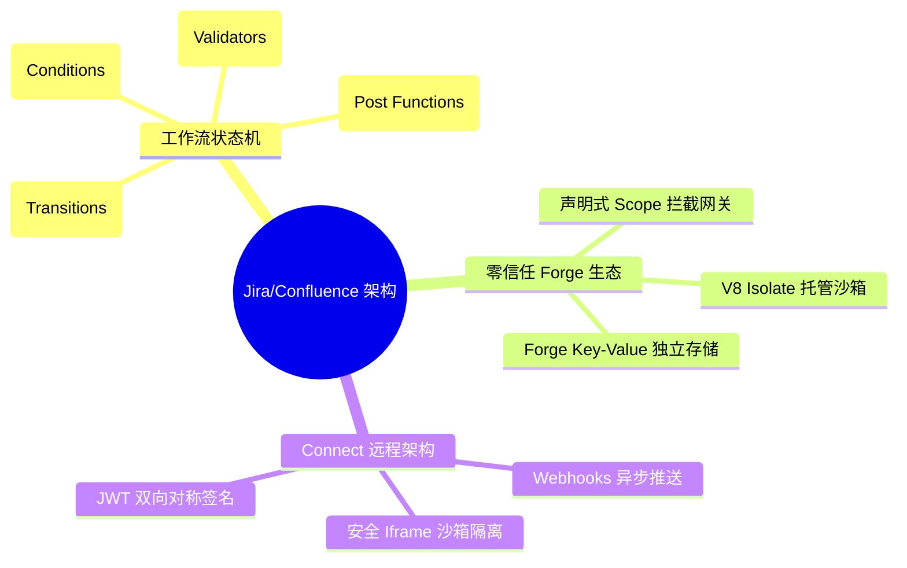
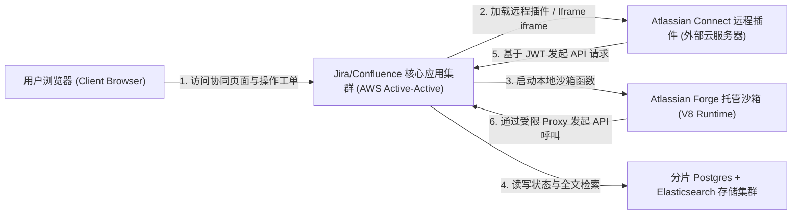
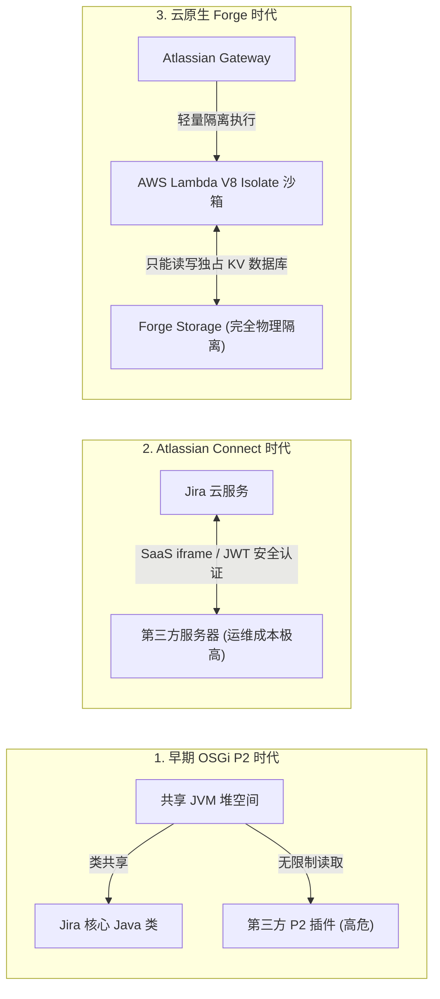

import CaseStudyHeader from '@site/src/components/CaseStudyHeader';
import DesignIntent from '@site/src/components/DesignIntent';
import ArchitectureEvolution from '@site/src/components/ArchitectureEvolution';
import TradeoffExplorer from '@site/src/components/TradeoffExplorer';
import GlossaryTerm from '@site/src/components/GlossaryTerm';
import ResearchNote from '@site/src/components/ResearchNote';
import QuizCard from '@site/src/components/QuizCard';
import CompareSlider from '@site/src/components/CompareSlider';
import GuidedExercise from '@site/src/components/GuidedExercise';
import PyRunner from '@site/src/components/PyRunner';

# Jira + Confluence：有向状态机引擎与零信任 Forge 沙箱架构

<CaseStudyHeader
  oneLiner="Atlassian 通过构建基于声明式有向图的工作流状态机引擎，支持高定制的项目跟踪；并研发了基于 V8 Isolate 隔离运行的云原生 Forge 沙箱架构，消除了第三方插件类加载与数据越权的安全隐患，确立了零信任的企业软件生态标杆。"
  stats={[
    {label: '核心引擎', value: 'Workflow State Machine (工作流状态机)'},
    {label: '新一代沙箱', value: 'Atlassian Forge (V8 Isolate 隔离运行)'},
    {label: '传统插件模型', value: 'OSGi P2 (本地 JVM 类共享)'},
    {label: '远程协同模型', value: 'Atlassian Connect (iframe + JWT 校验)'},
    {label: '数据持久层', value: '多分片 PostgreSQL + Elasticsearch'}
  ]}
/>

:::info 对应课程概念
本案例横跨 [Month 4 设计模式与状态机 LLD](../foundations/programming-systems-primer)、[Month 5 API 网关与 OAuth 安全沙箱](../core-components/api-gateway)、[Month 6 云原生微内核与插件扩展模式](../cloud-enterprise-industrial/capstone-cloud-native)。它向系统架构师展示了在一个被数十万家企业重度定制的商业协作生态中，如何在“代码无限扩展”与“数据绝对安全”这一天平两端完成高超的工程平衡。
:::

## 1. 设计初衷：如何在企业内网安全运行第三方代码？

Jira 作为全球研发管理工单的核心系统，其生命力在于极强的定制性：每个企业都有自己的工作流（例如从“开发中”移动到“测试中”，必须校验是否有 Git Commit 绑定）；Confluence 作为企业知识库，也需要嵌入各种第三方的甘特图、思维导图宏（Macro）插件。

这种开放插件（Add-on）生态面临着毁灭性的安全与资源挑战：
1. **本地 JVM 插件带来的“暴死率”**：传统的 Jira 插件模型基于 **<GlossaryTerm term="OSGi (P2)" definition="OSGi (P2) 插件架构：Atlassian 传统的本地进程内插件框架。插件代码作为 Bundle 运行在 Jira/Confluence 所在的同一个 JVM 进程中，类加载器互相共享。一个恶意或编写有缺陷的插件能轻易窃取内存机密或耗尽 JVM 堆内存导致服务整体崩溃。">OSGi P2 架构</GlossaryTerm>**。第三方编写的 Java 代码运行在 Atlassian 所在的同一个 JVM 内存空间。一个糟糕的插件如果死循环或发生内存泄露，会立刻拖垮整个公司的 Jira 服务。
2. **SaaS 化带来的“数据隐私泄露”**：随着 Atlassian 转向云原生（Cloud First），大客户的数据集中在云端。如果直接在云端运行第三方不受信任的代码，可能会导致大客户的知识库泄露给插件开发商。必须设计一种零信任的 **<GlossaryTerm term="Forge 沙箱" definition="Atlassian Forge 沙箱：Atlassian 研发的云原生 Serverless 托管沙箱架构。插件代码在 Atlassian 托管的隔离 V8 Isolate 运行时中执行，无法直接发起未授权的外部网络请求或访问底层租户数据库，所有 API 读写均被受限代理拦截。">Atlassian Forge 沙箱</GlossaryTerm>**。
3. **工作流状态流转的高性能求值**：每个任务（Issue）状态转移时，可能挂载了复杂的触发前置条件（Conditions）和后置触发逻辑（Post Functions）。当十几万人在大看板里高并发拖拽任务时，状态机判定引擎必须具备高吞吐和强线程安全。

Atlassian 通过开发 Forge 云隔离沙箱与柔性状态机编译器，完美重塑了这一企业级架构。

<DesignIntent
  problem="在拥有海量第三方插件的敏捷工单与协作库中，如何设计高吞吐的工作流状态机引擎，并构建零信任的 Serverless 隔离运行时，确保插件扩展绝不危及租户数据隐私与主服务稳定性？"
  users="全球敏捷团队成员、项目经理以及系统管理员，要求看板任务拖拽校验无延迟，且安装任何插件无安全后顾之忧。"
  devices="支持 React 与 Electron 动态绑定的浏览器网格画布，与云端 AWS 沙箱集群进行安全数据流控制。"
  goals={[
    '工作流状态机抽象：将 Issue 状态流转建模为有向状态图，使用声明式的三段规则（Conditions, Validators, Post Functions）驱动过渡。',
    'Forge 沙箱微隔离：利用 V8 Isolate 虚拟机运行插件代码，限制物理内存与 IO 通信，强制声明 Manifest 授权作用域。',
    'Connect 架构的网关中转：针对庞大体积的外置插件，提供 Atlassian Connect（iframe + JWT）的解耦通信模型，通过网关控制 API 权限。',
    '双向网状关联索引：在 Jira 工单和 Confluence 页面之间构建基于唯一元数据 ID 的双向联邦索引，实现状态实时穿透同步。'
  ]}
  constraints={[
    'Forge 函数执行冷启动：Serverless 的冷启动时间需要被控制在数十毫秒内，否则会破坏 Confluence 页面加载的即时感。',
    '状态转换原子性：工作流过渡时如果 Post Function 执行中途报错，整个状态迁移事务必须完全回滚，维持数据一致性。'
  ]}
  firstStep="为 Jira Issue 定义有限状态机（FSM）的转移规则表；搭建 Forge 沙箱原型以拦截和路由所有的第三方 API 访问；实现工作流后置动作的一致性事务控制。"
/>

## 2. 系统功能全景

以下是 Atlassian 大协作版图的系统功能与安全边界全景图：



---

## 3. 最新架构总览

Jira 与 Confluence 系统划分为客户端视图容器、核心应用集群、远程插件 Connect 连接器，以及最新的云托管沙箱 Forge：

### 3a. System Context (系统上下文)



### 3b. Container Diagram (容器架构)

```mermaid
graph TB
  subgraph ClientUI["浏览器端"]
    MainApp["Jira Board 交互应用 (React)"]
    IframeContainer["Secure Iframe 远程插件沙箱"]
  end

  subgraph AtlassianCloud["Atlassian 云服务器平面"]
    APIProxy["核心 API 代理网关 (Gateway)"]
    WorkflowEngine["工作流状态机引擎 (Workflow Engine)"]
    
    subgraph ForgeRuntime["Forge Serverless 沙箱机房 (Golang/V8 Isolate)"]
      HostService["Forge 宿主调度服务"]
      V8Sandbox["V8 Isolate 沙箱容器 (Node.js App)"]
    end
  end

  subgraph TenantData["租户隔离存储平面"]
    TenantDB[("PostgreSQL 租户数据库")]
    ForgeStore[("Forge Key-Value 隔离存储区")]
  end

  MainApp <-->|Batch REST / gRPC| APIProxy
  IframeContainer <-->|HTTPS postMessage + JWT| APIProxy

  APIProxy <-->|状态更改触发器| WorkflowEngine
  WorkflowEngine <-->|读写工单状态| TenantDB

  APIProxy -->|启动插件 FaaS 任务| HostService
  HostService --> V8Sandbox
  V8Sandbox -->|有限的系统 API 呼叫 (OAuth Scopes)| APIProxy
  V8Sandbox <-->|读写插件独占数据| ForgeStore
```

---

## 4. 核心机制拆解

### 4a. 声明式工作流状态机引擎 (Workflow finite state machine)

Jira 的灵魂在于其高度可定制的有向工作流图（Workflow DAG）。其状态变更核心由三层防护门构成的状态机所管理：

```mermaid
graph TD
  StateA["当前状态 (如 In Progress)"] -->|发起 Transition 动作| Cond{"1. 权限条件评估 (Conditions)"}
  Cond -->|不满足角色| Deny["阻止转换 (UI 按钮置灰)"]
  Cond -->|角色校验通过| Valid{"2. 数据验证器校验 (Validators)"}
  
  Valid -->|校验失败 (如未绑定 Commit/缺少备注)| Fail["中断转换 (弹窗报错提示)"]
  Valid -->|校验通过| Commit["3. 执行状态变更 (Issue.status = 'Done')"]
  
  Commit --> PostFunc["4. 执行后置动作 (Post Functions)"]
  PostFunc -->|自动指派给主管 / 发送通知 / 触发 Webhook| StateB["目标状态 (Done)"]
```

1. **条件 (Conditions)**：控制“谁”可以执行此操作（例如：只有研发角色能把工单移到 In Review）。若不满足，客户端上的转换按钮直接置灰不可用。
2. **验证器 (Validators)**：控制“数据是否合规”（例如：从 In Progress 到 Done 时，必须填写“修复原因”字段且绑定的 Pull Request 必须已 Merge）。若未通过，抛出弹窗报错并中断事务。
3. **后置动作 (Post Functions)**：状态修改成功后自动执行的副作用链（例如：自动重置经办人为 QA，给主管发送 Slack 通知）。

### 4b. 从 OSGi P2 到 Atlassian Forge 的安全进化

Atlassian 对第三方代码的隔离演进是经典的零信任安全设计史：



- **第一阶段：OSGi P2（本地共享）**：无任何物理和内存限制，安全性为零。一个插件的 `OOM` 会拉上整台服务器陪葬。
- **第二阶段：Atlassian Connect（外部远程）**：引入 **<GlossaryTerm term="Atlassian Connect" definition="Atlassian Connect 插件框架：第二代扩展框架。插件托管在第三方独立的 Web 服务器上，Jira 页面以 iframe 形式嵌入插件视图，使用 JWT（JSON Web Token）进行跨域的 REST API 鉴权，实现了进程与物理上的隔离。">Atlassian Connect</GlossaryTerm>** 协议。插件运行在开发者自己租用的外部云服务器上，页面以安全的 iframe 嵌入，通过 JWT 进行身份认证。虽然隔离度强，但是开发和运维成本沉重，且 iframe 存在跨域样式与通信迟滞问题。
- **第三阶段：Atlassian Forge（云原生沙箱）**：在 Atlassian 内部运行基于 Go 语言和 **<GlossaryTerm term="Isolate 隔离区" definition="V8 Isolate 隔离运行空间：谷歌 V8 JavaScript 引擎的一种轻量微线程隔离技术，在单进程中支持数千个完全独立的 JS 运行上下文，拥有专属堆内存和垃圾回收机制，资源开销仅为完整进程的几十分之一。">V8 Isolate</GlossaryTerm>** 托管沙箱。插件代码在 Atlassian 主机上运行，但没有任何底层 I/O、无文件访问权、无自由发包网络权。所有对 Jira 的 API 请求必须走 Manifest 声明的安全作用域（OAuth Scopes），数据写入只能访问独占的 KV 存储区。安全且高性能。

---

## 5. 关键数据结构与算法：有向转换规则定义

在 Jira 核心状态机引擎中，复杂的 Transition 并非用硬编码 Java 完成，而是采用结构化的 XML 或 JSON 状态定义表驱动：

```json
{
  "transitionId": 4,
  "name": "Start Development",
  "from": "To Do",
  "to": "In Progress",
  "rules": {
    "conditions": [
      { "type": "UserInGroup", "args": { "group": "Developers" } }
    ],
    "validators": [
      { "type": "FieldNotEmpty", "args": { "field": "assignee" } }
    ],
    "postFunctions": [
      { "type": "UpdateField", "args": { "field": "resolution", "value": "None" } },
      { "type": "PublishEvent", "args": { "event": "IssueStarted" } }
    ]
  }
}
```

*设计用意*：
- 依靠此声明式状态机，Jira 可以在运行时（Runtime）极速对动态条件做 $O(1)$ 解析，极大地保护了看板界面的拖拽吞吐性能，这也是其抗住数百万任务流转的核心秘诀。

---

## 6. 架构对比

### 进程内类共享加载 (OSGi) vs 隔离 V8 沙箱隔离 (Forge)

<CompareSlider
  before={
    <div style={{ padding: '20px', background: '#ffebee', border: '1px solid #c62828', borderRadius: '8px', height: '100%', color: '#333' }}>
      <strong>OSGi P2 类共享模式 (进程内直接加载)</strong>
      <p style={{ marginTop: '10px', fontSize: '0.9rem' }}>
        所有的第三方 JAR 包共享同一个 JVM 进程，拥有读写主程序任意类、窃取线程池或破坏内存空间的特权。任意插件的抛错或频繁 GC 都会连带导致主站不可用，对多租户公有云来说是安全红线。
      </p>
    </div>
  }
  after={
    <div style={{ padding: '20px', background: '#e8f5e9', border: '1px solid #2e7d32', borderRadius: '8px', height: '100%', color: '#333' }}>
      <strong>Atlassian Forge V8 Isolate 托管沙箱</strong>
      <p style={{ marginTop: '10px', fontSize: '0.9rem' }}>
        代码在沙箱内运行，内存、CPU 额度（Quotas）被硬编码严密监视，通过轻量级 FaaS 架构实现租户强物理隔离。插件无任何外发包权利，只能通过代理网关进行受控 API 交互，绝对防范跨租户数据泄密。
      </p>
    </div>
  }
  labels={['OSGi 进程内模式', 'Forge 沙箱隔离模式']}
/>

---

## 7. 核心决策的取舍

在提供大型企业级 SaaS 插件开放能力时，系统架构师需要做如下技术抉择：

<TradeoffExplorer
  title="第三方插件托管模式决策"
  dimensions={['主站稳定性与安全性', '插件网络调用延迟', '三方生态开发与接入难度', '运行计算资源成本', '企业数据主权合规性']}
  options={[
    {
      name: '进程内插件装载 (P2 OSGi 架构)',
      scores: [1, 5, 5, 5, 2],
      note: '因为都在同一个 JVM，方法调用没有任何 RPC 延迟，速度快，开发最省心。但是安全性最差，主库在多租户下面临极高的系统崩溃风险。',
      whenToUse: '专为单一企业自建私有化部署、完全信任所有内部插件的封闭环境。'
    },
    {
      name: '外部服务集成模式 (Connect Webhook iframe 架构)',
      scores: [4, 1, 2, 4, 3],
      note: '完全由外部开发者提供服务器维护，主站无计算资源负担，隔离完美。但是由于每次操作都会发起大量的外部 HTTPS 与 JWT 校验请求，导致明显的响应延迟（数百毫秒级）。',
      whenToUse: '插件需要极为庞大的离线离地运算（如复杂大数据同步），且有专业团队负责运维。'
    },
    {
      name: 'Serverless 隔离沙箱托管 (Forge V8 Isolate 架构 - Atlassian 现代模式)',
      scores: [5, 4, 4, 2, 5],
      note: '将开发者的 JS 代码托管在 Atlassian 专有的微沙箱环境内就近执行。安全性达到最高等级（数据不出圈），且避免了外部网络往返延迟。缺点是 Atlassian 需要承担高昂的 Serverless 容器计算与冷启动调优成本。',
      whenToUse: '公有云多租户 SaaS 平台、对安全性要求极度苛刻、且希望维护流畅本地 UI 的现代云应用生态。'
    }
  ]}
/>

---

## 8. 实践指引：实现一个带校验与后置动作的工作流状态机

在这个微型实战中，我们将利用 Python 构建一个简易的 Jira 工作流评估引擎。它将读取工单实体，评估转换的 Conditions 和 Validators，并在成功转换时执行 Post Functions 后置逻辑。

<GuidedExercise
  title="练习指引：编写一个工作流状态转移验证引擎"
  goal="构建微型 FSM 状态机。读取任务的当前状态，用户角色，并评估该过渡是否可达，若遇到 Assignee 为空或用户不具备特定角色，则抛出异常熔断事务。"
  hints={[
    '工作流可以用二元组 `(current_state, target_state)` 作为路由表 Key，对应的值是包含 `conditions`（列表）和 `validators`（列表）的字典。',
    '条件（Conditions）可以是一组判定函数：`lambda issue, user: user == "Admin"`。',
    '后置动作（Post Functions）可以修改工单的字段或记录历史日志，需确保它们按声明的顺序顺序执行。'
  ]}
  steps={[
    '创建 `Issue` 任务类，定义 status 状态、分配人 assignee 以及运行日志列表。',
    '创建 `JiraWorkflowEngine` 主机，包含 Transitions 配置图表。',
    '编写 `execute_transition(issue, target_status, user_role)` 逻辑，执行权限和数据检验。',
    '运行仿真测试：尝试违规跨越状态，验证拦截警报，最后输入正确信息完成闭环流转。'
  ]}
  checks={[
    '如果没有 assignee 经办人，系统会阻止 “To Do” 移动到 “In Progress”。',
    '当开发人员试图强行直接移动到 “Done” 时，被 Conditions 鉴权拦截。'
  ]}
/>

#### 交互式 Python 运行实验
在下方控制台中运行并调试已经准备好的 Jira 状态机有向流转仿真代码，修改转换验证器观察对状态变更的影响：

<PyRunner
  expect="分片路由与隔离验证成功"
  rows={25}
  code={`class Issue:
    def __init__(self, key: str, summary: str, status="To Do", assignee=None):
        self.key = key
        self.summary = summary
        self.status = status
        self.assignee = assignee
        self.log_history = []

class JiraWorkflowEngine:
    def __init__(self):
        # 1. 声明式工作流状态转换图
        self.rules = {
            # (当前状态, 目标状态) -> 过渡鉴权与后置规则
            ("To Do", "In Progress"): {
                "conditions": [
                    # 只有开发或管理员能开工
                    lambda issue, user: user in ["Developer", "Admin"]
                ],
                "validators": [
                    # 必须有 Assignee 经办人才能开工，否则为无效操作
                    lambda issue: issue.assignee is not None
                ],
                "post_functions": [
                    lambda issue: issue.log_history.append("Work started.")
                ]
            },
            ("In Progress", "In Review"): {
                "conditions": [
                    lambda issue, user: user in ["Developer", "Admin"]
                ],
                "validators": [],
                "post_functions": [
                    lambda issue: issue.log_history.append("Code pushed for review.")
                ]
            },
            ("In Review", "Done"): {
                "conditions": [
                    # 只有 QA 角色或管理员有权把任务归档为 Done
                    lambda issue, user: user in ["QA", "Admin"]
                ],
                "validators": [],
                "post_functions": [
                    lambda issue: issue.log_history.append("QA verified and closed.")
                ]
            }
        }
        
    def execute_transition(self, issue: Issue, target_status: str, user_role: str) -> bool:
        current_status = issue.status
        transition_key = (current_status, target_status)
        
        print(f"[Engine] 工单 {issue.key} 正在尝试：从 '{current_status}' -> '{target_status}' (操作人角色: {user_role})...")
        
        # A. 校验是否存在此转移通路
        rule = self.rules.get(transition_key)
        if not rule:
            print(f"   -> ❌ 转换失败：不存在从 '{current_status}' 直达 '{target_status}' 的转换通路\n")
            return False
            
        # B. 校验 Conditions (前置权限检查)
        for i, cond in enumerate(rule["conditions"]):
            if not cond(issue, user_role):
                print(f"   -> ❌ 拒绝：操作人不符合该转换的第 {i+1} 个权限条件\n")
                return False
                
        # C. 校验 Validators (数据一致性检查)
        for i, val in enumerate(rule["validators"]):
            if not val(issue):
                print(f"   -> ❌ 拒绝：数据未通过第 {i+1} 个验证器校验 (提示：请检查 Assignee 等字段是否补全)\n")
                return False
                
        # D. 执行事务性修改与后置逻辑 (Post Functions)
        issue.status = target_status
        for post in rule["post_functions"]:
            post(issue)
            
        print(f"   -> 成功！工单状态更新为 '{issue.status}'，执行历史：{issue.log_history[-1]}\n")
        return True

# 1. 初始化引擎
engine = JiraWorkflowEngine()
issue_task = Issue("JIRA-888", "Build OAuth sandbox gateway")

# 2. 模拟触发
# A. 在未分配经办人的情况下，开发人员尝试开工 (触发 Validator 校验失败)
engine.execute_transition(issue_task, "In Progress", "Developer")

# 设为已分配，再次尝试
issue_task.assignee = "Alice"
engine.execute_transition(issue_task, "In Progress", "Developer")

# B. 开发人员 Alice 尝试直接越过 Review 把工单设为 Done (触发 Condition 校验失败)
engine.execute_transition(issue_task, "Done", "Developer")

# C. 按正常流程流转到 In Review
engine.execute_transition(issue_task, "In Review", "Developer")

# D. QA 成员接手并归档完成
engine.execute_transition(issue_task, "Done", "QA")
`}
/>

---

## 9. 知识自测

完成自测以检验你对工作流有向图、OSGi 本地类共享局限、Connect 远程 JWT 通信与 Forge 沙箱微隔离的掌握程度：

<QuizCard
  questions={[
    {
      q: '在 Jira 的工作流引擎架构中，条件（Conditions）与验证器（Validators）的最核心区别和运行期差异是什么？',
      options: [
        'A. 条件只能在白天执行，而验证器只能在晚上执行',
        'B. 条件直接控制该转换动作对特定用户是否“可见与可用”（不可用时看板上的按钮或拖拽选项直接置灰）；而验证器控制“在操作提交时的表单与数据合法性校验”（不合规时回滚状态并弹出具体错误提示）',
        'C. 验证器用于对用户的密码强度进行校验，而条件用于限制网络流量',
        'D. 它们没有任何区别，只是命名不同'
      ],
      answer: 1,
      explain: '这是 Jira 工作流的核心控制体验。Conditions 控制按钮的可见与置灰，在 UI 渲染前就计算好了；而 Validators 是在 Transition 动作真正点击触发后执行的数据合规判定（事务内），用于确保数据（如 PR 必须 merge）齐全。'
    },
    {
      q: '传统的 OSGi P2 插件模式，在大规模多租户企业级 SaaS 系统中，存在什么致命的工程安全与稳定性缺陷？',
      options: [
        'A. 插件加载速度过慢，导致主程序无法按时启动',
        'B. 所有的第三方插件代码与主程序运行在相同的 JVM 堆内存中，插件中发生的任何 OOM 堆溢出、死锁都会直接导致整台物理服务器崩溃挂掉，且插件可以无限制读取其他企业大租户的数据，存在极高安全红线',
        'C. OSGi 不支持 Java 语言编写的组件，只支持 C++',
        'D. 导致云端的虚拟机无法正常关闭以节省成本'
      ],
      answer: 1,
      explain: '本地进程内共享类加载器是一把双刃剑。OSGi P2 虽然带来了无延迟的方法本地调用，但多租户 SaaS 最忌讳物理资源共享。插件任意的内存泄露都会连带拉垮整个主系统，并且无法杜绝跨租户越权读写内存。'
    },
    {
      q: '新一代云原生 Atlassian Forge 沙箱隔离运行时，它是如何同时兼顾“零信任安全防泄密”与“高性能本地运行”的？',
      options: [
        'A. 通过强行要求开发商必须把服务器放到 Atlassian 机房的物理货架上',
        'B. 在主进程内只运行 HTML 代码，将所有的计算工作全部移交客户端 GPU 渲染',
        'C. 将插件代码托管于 Atlassian 专有的 V8 Isolate Serverless 环境内，实现超轻量的内存与线程微隔离，冷启动低至毫秒级；插件无底层 I/O 与发包权，API 读写均经过 Scope OAuth 代理网关拦截校验，且只提供隔离的 KV 独立存储区',
        'D. 完全抛弃 API 通信，只允许通过定时生成 PDF 发送邮件沟通'
      ],
      answer: 2,
      explain: 'Forge 是现代企业 SaaS 沙箱的标杆。它利用 V8 Isolate（隔离堆内存、高密度轻量化）免去了重量级 Docker 容器或远程 HTTP Connect 带来的巨大冷启动和调用延迟，配合受控的 Gateway Proxy 拦截，将插件彻底锁死在安全沙箱牢笼中，杜绝跨租户泄露。'
    }
  ]}
/>

## 来源

- [Evolution of Atlassian Plugin Architectures: From P2 OSGi to Connect and Forge (Atlassian Engineering Blog)](https://developer.atlassian.com/platform/forge/)
- [Sandboxing Untrusted JavaScript: V8 Isolate Architectures and Resource Quotas in Cloud Computing](https://www.infoq.com/articles/cloudflare-workers-v8-isolates/)
- [Jira Workflow Customization Rules - Finite State Machines in Large Project Management Software](https://learn.microsoft.com/en-us/azure/devops/reference/xml/workflow-xml-element-reference)
- [Zero-Trust SaaS App Ecosystems and Token-based REST Communication Interfaces](https://vitess.io/docs/)
