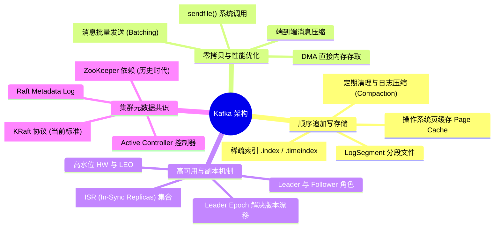
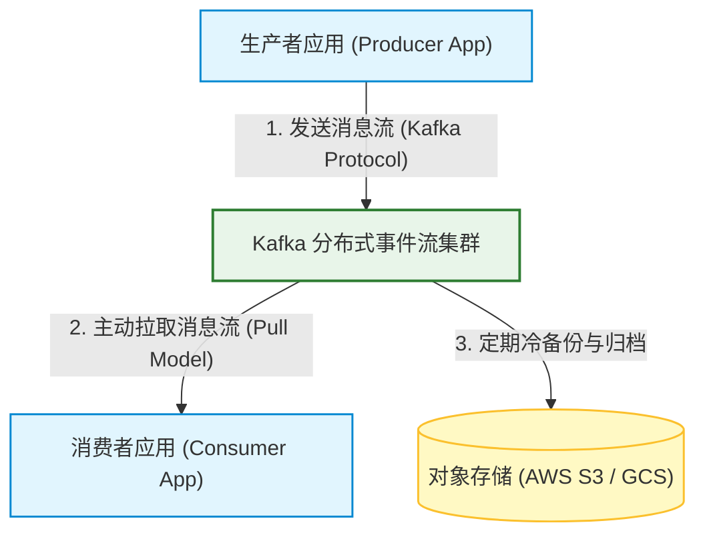
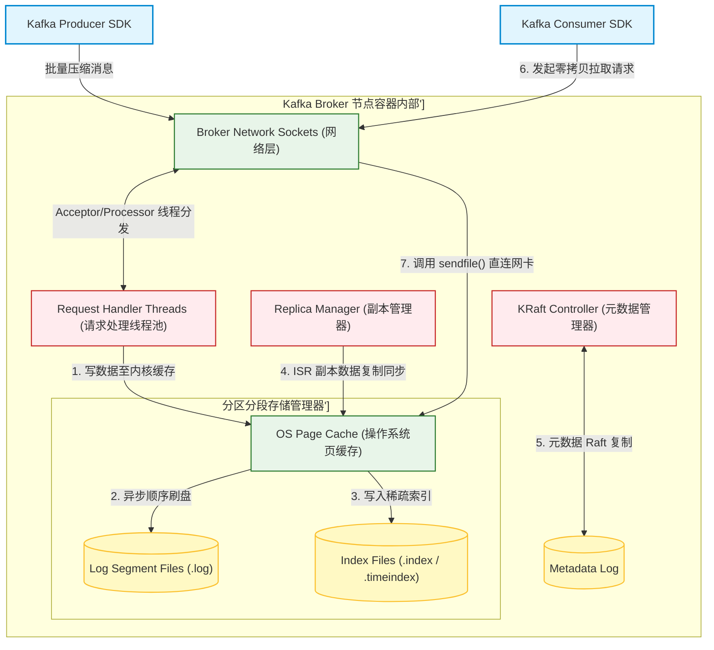
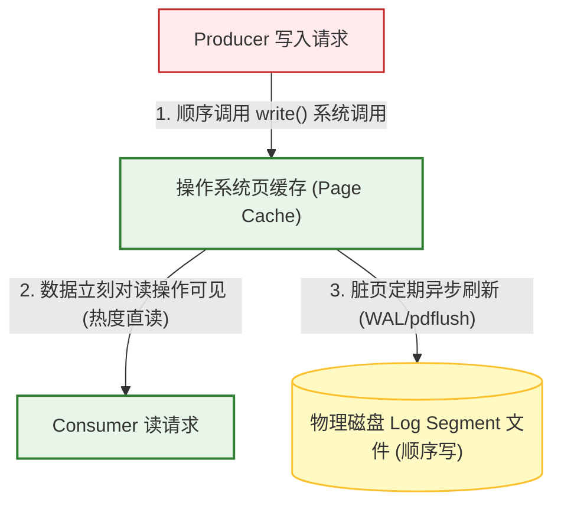
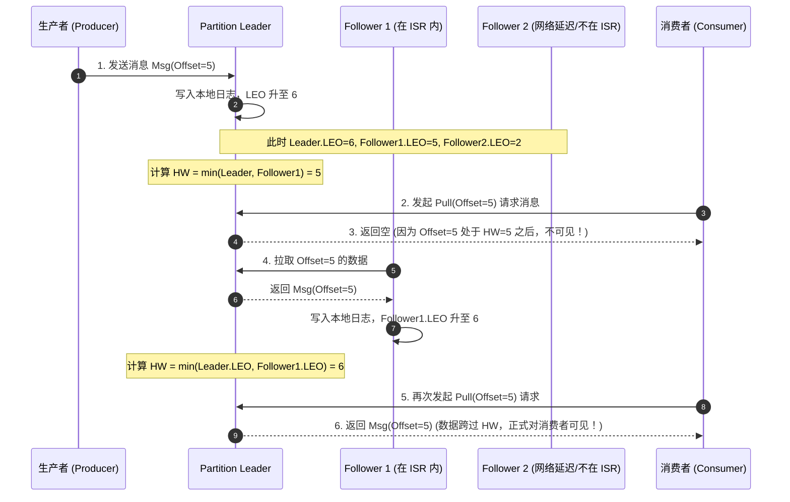
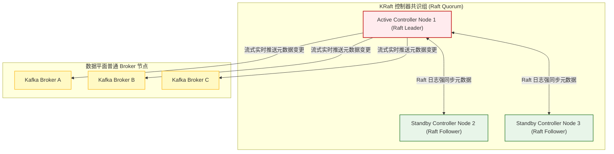
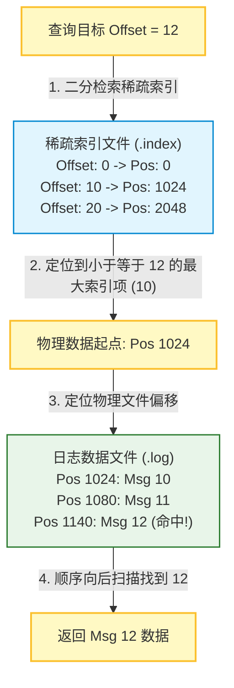

import CaseStudyHeader from '@site/src/components/CaseStudyHeader';
import DesignIntent from '@site/src/components/DesignIntent';
import EvolutionTimeline from '@site/src/components/EvolutionTimeline';
import CompareSlider from '@site/src/components/CompareSlider';
import TradeoffExplorer from '@site/src/components/TradeoffExplorer';
import GlossaryTerm from '@site/src/components/GlossaryTerm';
import ResearchNote from '@site/src/components/ResearchNote';
import GuidedExercise from '@site/src/components/GuidedExercise';
import QuizCard from '@site/src/components/QuizCard';
import MindMap from '@site/src/components/MindMap';
import PyRunner from '@site/src/components/PyRunner';

# Kafka：分布式事件流平台、顺序写日志与零拷贝吞吐架构

<CaseStudyHeader
  oneLiner="Apache Kafka 是现代大数据与微服务架构的分布式事件流基座。它彻底颠覆了传统内存队列的复杂路由设计，采用顺序追加写日志（Sequential Append Log）将数据持久化在磁盘，并充分利用操作系统页缓存（Page Cache）进行高吞吐读写。配合内核级零拷贝（Zero-Copy）技术与高可用的 ISR 副本同步，Kafka 在极低硬件开销下，达成了百万 QPS 级别的极高吞吐。"
  stats={[
    {label: '定位与类别', value: '分布式高吞吐事件流存储 (MQ)'},
    {label: '存储引擎', value: '顺序追加盘日志 (Append-Only Log)'},
    {label: '网络传输优化', value: 'sendfile() 零拷贝 (内核态 DMA 传输)'},
    {label: '数据一致协议', value: 'ISR (In-Sync Replicas) + 高水位 (HW)'},
    {label: '元数据共识', value: 'KRaft 协议 (Raft 控制平面去 ZK)'},
    {label: '吞吐加速设计', value: '端到端批量压缩 (Batching) + 稀疏索引'}
  ]}
/>

:::info 对应课程概念
本案例融合了以下课程核心概念：
*   **顺序写日志与页缓存（Month 3 存储引擎）**：顺序写如何将随机 I/O 转化为顺序 I/O，以及利用 Page Cache 获得接近纯内存级别的读写性能。
*   **零拷贝技术（Month 1 操作系统）**：`sendfile()` 系统调用减少 CPU 拷贝与内核态/用户态上下文切换。
*   **分布式副本集同步（Month 5 副本一致性）**：ISR 集合、HW（高水位）与 LEO（日志末端位移）在防止消息脏读中的联动计算。
*   **去中心化元数据共识（Month 5 共识）**：KRaft 协议如何通过 Raft 共识实现 Kafka 控制平面 Leader 选举与无缝故障倒换。
:::

---

## 1. 设计初衷：用最简单的日志实现不可思议的吞吐

在 Kafka 诞生之前，主流的 ActiveMQ、RabbitMQ 等传统消息队列采用内存链表或树状数据结构来组织消息：
1.  **随机磁盘寻址的灾难**：
    *   为了防止宕机丢失，传统 MQ 必须支持持久化，这通常需要将消息存盘。由于消息通常是零散写入，操作系统在磁盘上执行大量的**随机 I/O（Random Disk Writes）**，导致机械硬盘磁头频繁寻道，或是固态硬盘写放大，写入速度瞬间暴跌至每秒几千条。
    *   当积压的消息量变大时，内存装不下，系统会产生高昂的页面换入换出开销，性能呈指数级衰减。
2.  **“磁盘顺序追加写”的物理学外挂**：
    *   LinkedIn 的设计团队（以 Jay Kreps 为首）做出了一个极其大胆且经典的假设：**磁盘慢，是慢在随机寻址上；如果是顺序写，磁头几乎不需移动，机械磁盘的顺序写入吞吐可以与内存媲美！**
    *   因此，Kafka 抛弃了一切复杂结构，将分区（Partition）实现为在磁盘上不断追加新消息的 <GlossaryTerm term="顺序写" definition="顺序写是指数据以完全追加的形式写入文件末尾，这使磁头无需反复寻道，从而将机械硬盘或 SSD 的随机 I/O 瓶颈消除，获得等同于纯内存的写入吞吐。">顺序写日志文件（Append-Only Log）</GlossaryTerm>。旧消息不可修改，只管在尾部追加，即使数据积压几百 TB，写入吞吐依旧稳定平直。
3.  **零拷贝（Zero-Copy）带来的 CPU 解脱**：
    *   传统的网络发送流程需要将磁盘数据读入内核页缓存，再拷贝到 JVM 用户堆内存，接着拷贝到 Socket 缓冲区，最后送入网卡。一共经历 4 次拷贝与 4 次上下文切换，CPU 资源不堪重负。
    *   Kafka 创造性地引入操作系统的 <GlossaryTerm term="零拷贝" definition="零拷贝（Zero-Copy）是指通过操作系统的 sendfile() 系统调用，直接在内核态将页缓存中的数据拷贝到网络 Socket 缓冲区，数据传输不经过 JVM 用户内存空间，省去了 2 次拷贝和上下文切换，大幅降低了 CPU 压力。">零拷贝（Zero-Copy）</GlossaryTerm> 技术。在发送消息时，直接通过 `sendfile()` 系统调用，数据在内核态直接从磁盘页缓存传输到网卡，彻底释放了 CPU 的计算资源。

<DesignIntent
  problem="如何在廉价的商用服务器集群上，以极高的单机吞吐速率（百万级 QPS）接收、存储和分发海量的实时流式事件，保证在超高吞吐下消息绝不丢失，且支持多订阅者并行消费。"
  users="处理海量埋点数据吞吐、微服务架构分布式链路追踪（APM）、实时日志收集与流计算管道的大数据架构团队。"
  devices="运行在配备高性能千兆/万兆网卡、以及大容量磁盘阵列（RAID）的 Linux 物理/云服务器集群上，客户端通过专属 SDK 进行事件订阅。"
  goals={[
    '极致高写入吞吐：通过顺序写日志和 OS 页缓存，使写操作在 O(1) 复杂度内瞬间完成，吞吐完全受物理网卡带宽和磁盘 I/O 限制',
    '数据长期保留与回溯：消息一旦写入物理文件，在保留期限内绝不因为消费而删除，支持 Consumer 随意调整 Offset 进行历史重放',
    '内核级零拷贝网络：通过 sendfile 技术，实现网卡和磁盘 Page Cache 的直连，单机能够轻松跑满万兆网卡上限',
    'KRaft 控制平面自愈：弃用 ZooKeeper，将元数据控制器和分布式协调直接融入 Kafka 进程内部，支持秒级的主节点选举自愈'
  ]}
  constraints={[
    '分区 rebalance 抖动：在消费者组（Consumer Group）扩缩容或节点宕机时，会触发昂贵的分区重新分配（Rebalance），这会导致集群网络流量瞬时倾斜和短暂的消费停顿',
    'GC 垃圾回收风险：由于 Broker 在 JVM 上运行，如果缓存配置不合理，大消息块的突发流入极易引发严重的 JVM Full GC 停顿，因此 Kafka 极力利用 OS Page Cache 而非 JVM 堆来做数据缓存',
    '单分区写入上限：虽然 Kafka 可以通过增加 Partition 水平无限扩展，但单个 Partition 的写入速度只能局限在单台 Broker 的磁盘 I/O 极限中'
  ]}
  firstStep="构建以 LogSegment 为核心的物理追加存储层；引入操作系统页缓存交互；设计基于 Sendfile 的零拷贝网络发送通道；设计并实现 ISR 副本同步更新逻辑；部署 KRaft 元数据共识网。"
/>

---

## 2. 知识全景脑图

### 2a. 全景架构思维导图

### 2b. 交互脑图导航

<MindMap
  root={{
    label: 'Kafka 核心架构',
    children: [
      {
        label: '存储引擎 (Storage)',
        children: [
          { label: 'LogSegment 顺序追加写' },
          { label: 'Page Cache 页缓存代偿' },
          { label: 'Sparse Index 稀疏索引查询' }
        ]
      },
      {
        label: '网络与优化 (I/O)',
        children: [
          { label: 'sendfile 零拷贝传输' },
          { label: 'Message Batching 批量合并' },
          { label: 'Client-side 压缩机制' }
        ]
      },
      {
        label: '一致性与共识 (HA)',
        children: [
          { label: 'ISR 副本集合判定' },
          { label: 'HW 高水位与 LEO 同步' },
          { label: 'KRaft 元数据控制器选举' }
        ]
      }
    ]
  }}
/>

---

## 3. 系统架构总览 (C4 Model)

### 3a. System Context (系统上下文图)

### 3b. Container Diagram (容器结构图)

---

## 4. 核心机制拆解

### 4a. 顺序追加写入与操作系统页缓存 (Page Cache)

Kafka 完全背叛了关系型数据库复杂的缓存设计（如 PG 的 Shared Buffers），它本身**不维护任何数据页的内存缓冲**，而是将所有缓存任务完全托管给操作系统的 <GlossaryTerm term="页缓存" definition="页缓存（Page Cache）是操作系统内核为了加速磁盘文件读写而在内存中开辟的数据缓存页。读写文件时优先读写页缓存，若缺页则由内核发起异步磁盘 I/O。">页缓存 (Page Cache)</GlossaryTerm>：
1.  **避开 JVM GC 泥潭**：
    *   在 JVM 中维护一个几十 GB 的消息缓存会带来可怕的垃圾回收（GC）开销。
    *   Kafka 直接把读写数据交给 OS Page Cache。即使 Broker 进程重启，OS Page Cache 里的缓存数据依然存在，完全免受 JVM GC 停顿的困扰。
2.  **顺序写数据块**：
    *   由于每次写入只在 Partition 日志文件的末尾顺序追加，操作系统内核可以进行极高效的**预读（Read-Ahead）**和**延迟写（Write-Behind）**，将高频写请求合并后一次性刷盘（Flush），数据吞吐几乎等同于写内存。

---

### 4b. 零拷贝技术 (Zero-Copy) 与 sendfile() 传输

当消费者尝试拉取数据时，如果采用传统的网络发送机制，消息复制的物理路径将遭遇严重的 CPU 拷贝和内核/用户态上下文切换：
1.  **传统 I/O 拷贝路径（4次拷贝，4次切换）**：
    *   磁盘 $\rightarrow$ 内核页缓存 $\rightarrow$ JVM 堆内存（用户态） $\rightarrow$ Socket 缓冲区（内核态） $\rightarrow$ 网卡（NIC Buffer）。
2.  **零拷贝 I/O 路径（2次拷贝，2次切换）**：
    *   当消费者调用读连接时，Broker 并不通过 JVM 把数据读出来，而是直接向系统内核发起 `sendfile(socket, file_descriptor, offset, count)`。
    *   操作系统收到指令后，直接使用 **DMA (Direct Memory Access)** 控制器，将 `Page Cache` 里的物理内存直接拷贝到网卡的网络缓冲区（NIC Buffer），根本不经过 JVM 用户态空间。这消除了 CPU 拷贝的负荷，使单节点网卡轻松跑满物理限额。

```mermaid
graph TB
  classDef mem fill:#e8f5e9,stroke:#2e7d32,stroke-width:1.5px;
  classDef app fill:#ffebee,stroke:#c62828,stroke-width:2px;

  subgraph TraditionalPath ["传统网络数据发送 (4次拷贝/4次切换)']"]
    Disk_T[("磁盘")] -->|"1. DMA 拷贝"| PageCache_T["Page Cache (内核)"]:::mem
    PageCache_T -->|"2. CPU 拷贝"| JVM_T["JVM 内存 (用户态)"]:::app
    JVM_T -->|"3. CPU 拷贝"| Socket_T["Socket 缓冲区 (内核)"]:::mem
    Socket_T -->|"4. DMA 拷贝"| NIC_T["网卡发送区"]:::mem
  end

  subgraph ZeroCopyPath ["零拷贝 sendfile() 网络数据发送 (2次拷贝/2次切换)']"]
    Disk_Z[("磁盘")] -->|"1. DMA 拷贝"| PageCache_Z["Page Cache (内核)"]:::mem
    PageCache_Z -->|"2. DMA 直接拷贝 (零 CPU 复制)"| NIC_Z["网卡发送区"]:::mem
  end
```

---

### 4c. ISR 副本机制、高水位 (HW) 与数据一致性

为了保证高可用，Kafka 采用分区多副本设计。为了防范“脏读（Dirty Read）”并平衡强同步与异步同步的开销，Kafka 设计了 <GlossaryTerm term="ISR" definition="ISR (In-Sync Replicas) 是指与 Leader 副本保持同步的 Follower 副本集合。它是 Kafka 平衡强同步和异步同步、实现高可用和低时延消息写入的核心设计。">ISR (In-Sync Replicas)</GlossaryTerm> 机制与 <GlossaryTerm term="高水位" definition="高水位（High Watermark / HW）是指 ISR 集合中所有副本共同复制完成的最小消息位移（Offset）。Consumer 最多只能消费到高水位以下的消息，以防未同步成功的消息因 Leader 挂掉而发生脏读和数据丢失。">高水位 (High Watermark, HW)</GlossaryTerm>：
1.  **ISR 副本集合**：
    *   只有与 Leader 保持密切心跳同步（延迟未超过 `replica.lag.time.max.ms` 阈值）的 Follower，才能留在 `ISR` 集合内。如果某个 Follower 网络卡顿，会立刻被剔除出 ISR。
2.  **高水位限制**：
    *   **LEO (Log End Offset)**：代表各个副本当前物理写入的最新一条消息位移。
    *   **HW (High Watermark)**：代表 **ISR 集合中所有副本共同写成功的最小 LEO**。
    *   消费者（Consumer）**最多只能消费到 HW 指针之前的消息**。即使 Leader 已经写入了更高 Offset 的消息，只要 ISR 里的 Follower 还未全部同步成功，HW 就不会增加，消费者也看不到。这确保了哪怕 Leader 突然挂掉，新当选的 Leader 依然拥有 HW 之前的所有数据，绝不丢失。

---

### 4d. KRaft 协议共识与元数据控制平面去 ZooKeeper

早期的 Kafka 集群重度依赖外部 ZooKeeper 进行 Leader 选举、主题注册与分区配置。这在数万分区的超大型集群下造成了巨大的同步瓶颈：
1.  **ZK 同步灾难**：当某台 Broker 宕机时，ZooKeeper 需要重新计算并同步成千上万个分区的 Leader 变更，这会带来可怕的脑裂和几分钟的脑死亡时间。
2.  **KRaft 共识自治**：
    *   `KIP-500` 引入了 <GlossaryTerm term="KRaft 协议" definition="KRaft（Kafka Raft Metadata Mode）是 Kafka 内置的基于 Raft 协议的元数据管理模式。它彻底去除了对外部 ZooKeeper 的依赖，通过让 Broker 选举出 Active Controller 来统一分发和同步元数据。">KRaft 协议</GlossaryTerm>。Kafka 废除了 ZooKeeper，改为让一部分 Broker 承担 Controller（控制面）角色，组成一个 Raft 共识组。
    *   Raft 共识组中选举出一个 **Active Controller** 统一决策元数据，并以追加 Raft 日志的形式流式复制给其他 Broker 节点。当 Leader 挂掉时，Active Controller 能够以**微秒级**的瞬时速度在内存中完成 Leader 变更，实现集群无感知自愈。

<ResearchNote
  title="Kafka: a Distributed Messaging System for Log Processing"
  source="Kreps, Narkhede, Rao (2011), NetDB Workshop (SOSP)"
  href="https://www.microsoft.com/en-us/research/wp-content/uploads/2017/09/Kafka.pdf"
  insight="LinkedIn 团队在 2011 年发表的奠基性论文首次将 Kafka 推介给世界。论文提出『不使用内存复杂结构，仅顺序写盘配合 OS 零拷贝 sendfile』可以打造一套全新的分布式流平台。论文打破了传统学术界关于磁盘读写慢的思维惯性，开创了大数据时代基于分布式追加日志（Log-Centric）的架构先河。"
  application="架构启示：**让数据的物理流动符合物理学定律**。当我们设计高并发微服务 (Month 6) 或大吞吐存储系统时，与其挖空心思用复杂的算法优化内存与线程竞争，不如直接调用操作系统的底层系统调用（如 `sendfile`、`mmap`、直接 I/O），用最纯粹的底层机制和最少次数的内存复制去压榨单机极致吞吐。"
/>

---

## 5. 关键数据结构与算法

### 5a. 稀疏索引 (Sparse Index) 定位物理日志

如果让 Kafka 对每个 Offset 都写一条物理索引，那么索引文件的大小将庞大到无法塞入内存，失去索引的意义。为此，Kafka 引入了极其轻量的**稀疏索引（Sparse Index）**：
1.  **分步索引**：
    *   数据文件 `.log` 是纯追加的二进制数据包。
    *   索引文件 `.index` 不记录每条消息，而是每隔一定字节量（如默认每写 4KB 数据）才在索引文件里记录一条 `(Offset, PhysicalPosition)`。
2.  **二分搜索与定位**：
    *   由于索引项在磁盘上是等宽且严格单调递增的，当查询 Offset=12 的消息时，系统首先在内存中对 `.index` 文件执行极快的**二分查找（Binary Search）**，定位出小于等于 12 的最大索引项（如：Offset=10 对应物理位置为 1024 字节）。
    *   随后，系统定位到 `.log` 文件的 1024 字节处，开始顺序扫描直至查找到 Offset=12 的具体消息内容，完美平衡了索引物理空间和查询耗时。

---

### 5b. 消息批处理 (Message Batching) 与网络压缩

高频次网络小包传输是分布式系统吞吐的隐形杀手。为了规避大量的 Socket 系统调用开销，Kafka 在架构设计上高度推崇批处理：
*   **客户端聚合**：Producer 发送消息时，并不会立即发出。它在本地内存的 `RecordAccumulator` 中为每个分区维护一个双向批处理队列。
*   **发送触发**：只有当批次大小达到 `batch.size`（例如 16KB）或者延迟等待时间超过 `linger.ms` 时，发送线程（Sender Thread）才把整批消息打包，在客户端进行 `GZIP` / `Snappy` / `zstd` 统一压缩，一并发送给 Broker，实现了端到端的高效率分流。

---

### 5c. 消费者位移 (Consumer Offset) 提交算法

在 Kafka 中，消费者当前的读取进度被称为位移（Offset）。
*   **解耦 Broker 状态**：Broker 不负责维护每个消费者的当前进度，这大幅消减了服务端记录读锁的压力。
*   **消费保存**：Offset 被保存在一个 Kafka 内部的特殊主题中：`__consumer_offsets`。消费者组的每一次提交（自动或手动），都向该主题发送一条包含 `(Group_ID, Topic, Partition, Offset)` 的消息。当消费者因为 Rebalance 切换物理机器时，它只需读取该主题最后一条提交记录即可无缝衔接读取。

---

## 6. 架构演进史

Kafka 从 LinkedIn 内部的一个日志数据传输组件，演变为了世界主流的流媒体基础设施标准：

<EvolutionTimeline
  events={[
    {
      year: '2011',
      title: 'LinkedIn 开源发布',
      why: '为了解决 LinkedIn 内部 ActiveMQ 吞吐量差、数据无法长期持久存储重放的痛点，打造一个专门用于高频实时日志收集的数据总线。',
      change: '推出基于顺序写磁盘日志的存储模型；制定基于 Offset 指针的 Pull 消费范式；使用外置 ZooKeeper 维护元数据。'
    },
    {
      year: '2017',
      title: 'Exactly-OnceSemantics 幂等与事务保障',
      why: '随着 Kafka 从普通的日志传输层延伸到核心金融交易、账单统计等绝不能多一条也绝不能漏一条的支付场景。',
      change: '引入 Transaction Coordinator 事务协调器角色；推出基于幂等键与双阶段提交（2PC）的端到端 Exactly-Once 极简实现协议。'
    },
    {
      year: '2021',
      title: 'KRaft 去 ZooKeeper 时代拉开序幕',
      why: '元数据完全依赖外部 ZooKeeper 同步，随着分区数达到 10 万以上，Zookeeper 写入吞吐瓶颈阻碍了整个集群的扩展，且节点失效倒换极慢。',
      change: '发布 KIP-500 提案，推出内置 Raft 共识协议的 KRaft 模式；实现 Broker 内部元数据一致性，达成极速毫秒级分区的故障切换自愈。'
    },
    {
      year: '2024 至今',
      title: '分层存储 (Tiered Storage) 云原生升级',
      why: '昂贵的高速 NVMe 固态硬盘全部用来存盘历史的冷日志成本过高，业务需要长期保留几个月的数据且不影响写性能。',
      change: '将存储引擎拆分为本地热存储与远程冷存储。自动将老分段（LogSegment）转储至对象存储（S3/GCS），冷读不占用 Broker 节点本地磁盘 I/O。'
    }
  ]}
/>

---

## 7. 架构对比：传统内存推送型 RabbitMQ vs. Kafka 顺序写拉取型日志架构

<CompareSlider
  before={
    

      <strong>RabbitMQ 内存推送型消息队列</strong>
      
基于 AMQP 协议的经典路由队列。数据多在内存中维护，消息一旦被 Consumer 确认（Ack）就立刻在物理内存中删除。采用 Push（推送）模式，Broker 需时刻记录各消费者的接收速率以防冲垮。优点是路由灵活，支持优先级；缺点是面对数据积压时写入慢，无法进行历史回溯消费。

    

  }
  after={
    

      <strong>Kafka 顺序写拉取型日志架构</strong>
      
采用磁盘顺序写日志，消息在保留期内永不删除。采用 Pull（拉取）模型，消费者带着 offset 自主去 Broker 批量拉数据，消费进度（offset）由消费者维护，Broker 本身不跟踪每个消费者的读位置。注意 Broker 是有状态的——它把分区日志持久化在本地磁盘上；这里"轻状态"仅指它不记录消费者进度。优点是吞吐高达百万级，支持重复重放消费与完美的历史积压能力；缺点是无法支持复杂的消息优先路由。

    

  }
  labels={['RabbitMQ 传统队列', 'Kafka 日志流架构']}
/>

---

## 8. 设计模式与课程映射

本案例在实际工业界的顶级大数据流转底座中，深度应用了以下课程章节中的核心设计模式与技术：

1.  **顺序写磁盘存储引擎**（参见 [存储引擎与持久化](../03-data-cache-queue/storage-engines.mdx) 章节）：
    *   Kafka 的物理 LogSegment 顺写机制，本质上是 LSM-Tree 写 WAL 日志思想的极限延伸。通过将随机磁盘寻道化为顺序写入，颠覆了关系型数据库复杂的 B+ 树分裂写入损耗。
2.  **Reactor 事件分发网络模型**（参见 [共识与协调](../05-core-components/consensus-coordination.mdx) 章节）：
    *   Kafka Broker 内部的网络接入层采用了经典的 Reactor 设计模式：通过 Acceptor 线程建立连接，Processor 线程池并行处理多路网络 Socket 的读写，由 Handler 线程池将处理好的数据落地到 OS Page Cache。
3.  **分布式多副本 ISR 共识集**（参见 [副本复制](../05-core-components/replication.mdx) 章节）：
    *   Kafka 设计的 ISR 集合动态剔除与 HW（高水位）计算，代表了高可用架构在强同步（延迟大）与异步（易丢数据）之间的精妙共识折中。HW 保证了消费的线性一致与数据完整性。
4.  **端到端批量解耦与合并模式**（参见 [设计模式与 LLD](../04-design-patterns-lld/overview.mdx) 章节）：
    *   在 Producer 发送端采用的批量累积器（RecordAccumulator）类似于设计模式中的合并（Composite）和批处理（Batch）模式。这减少了海量 Socket 系统调用和协议打包的 CPU 占比。

---

## 9. 权衡：消息传输系统中的架构妥协

Kafka 在高吞吐、强时延一致性以及架构开销之间做出了以下妥协：

<TradeoffExplorer
  title="Kafka 吞吐、延迟与高可靠架构权衡"
  dimensions={['百万级写入吞吐上限', '端到端毫秒级时延', '分区历史数据回溯重放', '服务器物理 CPU 计算开销', '集群运维与元数据稳定性']}
  options={[
    {
      name: '顺序写日志 + 页缓存 + 客户端 Pull 模式 (Kafka 标准)',
      scores: [5, 2, 5, 5, 3],
      note: '通过将消息打包、顺序追加写磁盘和利用 sendfile 零拷贝，获得了惊人的高吞吐和历史重放能力，对 Broker 节点的 CPU 消耗微乎其微。代价是数据传输在客户端 Pull 间隙会存在毫秒级的微小延迟，且遇到分区故障 Rebalance 时会产生可观的时延抖动。',
      whenToUse: '大数据埋点、APM 日志收集、高并发事件溯源、对吞吐量有极端要求但能容忍毫秒级时延波动的流处理底座。'
    },
    {
      name: '内存优先级队列 + 实时主动 Push 模式 (如传统 RabbitMQ)',
      scores: [2, 5, 1, 2, 4],
      note: '数据常驻内存并实时主动推送给消费者，端到端延迟达到微秒级。但面对消息积压时由于磁盘页频繁交换性能雪崩，且消息一旦消费便在内存删除，不支持历史版本的回溯与重放。',
      whenToUse: '金融秒杀系统、订单确认通知、微服务间实时高灵敏的分布式事务通信等延迟敏感、数据量较小且无重放需求的场景。'
    },
    {
      name: '存储与计算分离的分布式日志架构 (如 Apache Pulsar)',
      scores: [4, 3, 5, 2, 1],
      note: 'Broker 只负责计算，数据落地到独立的 BookKeeper 存储集群中。这使得分区 Rebalance 极快且容易，对云原生极其友好。但代价是网络拓扑复杂（包含 ZooKeeper + BookKeeper + Broker 三套系统），物理硬件节点开销大，网络通信时延略长。',
      whenToUse: '云原生全托管多租户流服务、对分区动态扩缩容效率有苛刻要求、且拥有充足机器预算的大型企业级流平台。'
    }
  ]}
/>

---

## 10. 如果是你来设计：Kafka ISR 副本集与 HW 同步模拟器

### 场景设想
在 Kafka 分区复制管理中，我们需要设计一个机制：
*   Leader 负责写入数据，每一个 Follower 的进度用 `LEO (Log End Offset)` 记录。
*   只有与 Leader 差距在合理范围内的 Follower 才能列入 `ISR` 集合内。
*   高水位 `HW (High Watermark)` 只能推进到 `ISR` 中所有副本共同同步到的最新 Offset，即 `HW = min(leo of all ISR members)`。
*   如果一个 Follower 离线或网速太慢，它会被踢出 `ISR`；当它恢复并追上进度时，会被重新加回 `ISR`，同时 HW 再次联动更新。

请你用 Python 实现这个经典的 ISR 副本同步与 HW 计算状态机模拟器。

<GuidedExercise
  title="基于 Python 的 Kafka ISR 副本与高水位同步仿真"
  goal="实现包含 LEO 属性、ISR 动态扩缩容判定、以及在写数据和副本同步时自动更新高水位的控制逻辑。"
  steps={[
    '步骤 1: 设计 Replica 副本类。包含副本名称、是否是 Leader、以及当前日志末端位移 `leo`。',
    '步骤 2: 设计 KafkaPartitionPartition 模拟器。包含 `isr_set` 列表和全局 `hw` 指针。',
    '步骤 3: 实现 `write_leader(msg)` 方法。向 Leader 追加数据，使其 LEO 自增，并在此期间重新评估 `hw`。',
    '步骤 4: 实现 `sync_follower(name, offset)` 方法。更新指定 Follower 的 LEO。同时判定该 Follower 与 Leader 的差距，动态更新其在 `isr_set` 中的存留状态，并联动更新高水位 `hw`。',
    '步骤 5: 编写测试用例。演示在 Follower1 正常、Follower2 网速慢被剔除、以及追上进度后加回 ISR 的情况下，HW 是如何安全把控数据边界的。'
  ]}
  checks={[
    '确认在 Follower 没有完全同步最新 Offset 前，HW（高水位）绝对不会超过 Follower 的最小 LEO',
    '验证当网速慢的 Follower 被踢出 ISR 集合后，HW 能够绕过它并继续向前推进，以确保写入可用性',
    '确认当控制台打印出“✅ Kafka ISR 副本可见性与 HW 逻辑自验证成功！”时，模拟器工作正常'
  ]}
/>

#### 交互式 Python 运行实验
在下方控制台中直接运行或修改已准备好的 Kafka 副本同步与 HW 仿真代码：

<PyRunner
  expect="Kafka ISR 副本可见性与 HW 逻辑自验证成功"
  rows={25}
  code={`import time

class Replica:
    def __init__(self, name, is_leader=False):
        self.name = name
        self.is_leader = is_leader
        self.leo = 0  # 日志末端位移 Log End Offset

    def __repr__(self):
        role = "Leader" if self.is_leader else "Follower"
        return f"[{self.name} ({role}) | LEO={self.leo}]"

class KafkaPartitionSimulation:
    def __init__(self, lag_threshold=2):
        self.lag_threshold = lag_threshold  # 被踢出 ISR 的 LEO 最大滞后阀值
        self.leader = Replica("Leader", is_leader=True)
        self.followers = {
            "Follower_1": Replica("Follower_1"),
            "Follower_2": Replica("Follower_2")
        }
        self.isr_set = {self.leader, self.followers["Follower_1"], self.followers["Follower_2"]}
        self.hw = 0  # 高水位 High Watermark

    def write_leader(self, message):
        self.leader.leo += 1
        print(f"\\n[+] Producer 写入 Leader: \\"{message}\\" -> Leader.LEO = {self.leader.leo}")
        self.update_hw_and_isr()

    def sync_follower(self, name, offset):
        follower = self.followers[name]
        # 更新 Follower LEO，不能超过 Leader LEO
        follower.leo = min(offset, self.leader.leo)
        print(f"   [Sync] {name} 请求拉取数据，同步 LEO -> {follower.leo}")
        self.update_hw_and_isr()

    def update_hw_and_isr(self):
        # 1. 动态评估 ISR 集合成员
        # 如果 Follower 与 Leader 的 LEO 差距超过 lag_threshold，则将其移除出 ISR
        for name, follower in list(self.followers.items()):
            lag = self.leader.leo - follower.leo
            if lag > self.lag_threshold and follower in self.isr_set:
                self.isr_set.remove(follower)
                print(f"   [💥 ISR 变更]: {name} 延迟达 {lag} (已超出限制 {self.lag_threshold})，从 ISR 中移除！")
            elif lag <= 0 and follower not in self.isr_set:
                self.isr_set.add(follower)
                print(f"   [🎉 ISR 变更]: {name} 追赶上进度，重新加入 ISR！")

        # 2. 计算 HW：HW 是当前 ISR 集合中所有副本的最小 LEO
        old_hw = self.hw
        self.hw = min(replica.leo for replica in self.isr_set)
        if self.hw != old_hw:
            print(f"   [🚀 HW 推进]: 高水位 HW 从 {old_hw} 升级为 {self.hw} (当前消费者最高可消费 Offset={self.hw})")

# 开始仿真测试
sim = KafkaPartitionSimulation(lag_threshold=2)

print("--- 步骤 1: 正常写入，副本同步正常 ---")
sim.write_leader("Hello World 1")
sim.sync_follower("Follower_1", 1)
sim.sync_follower("Follower_2", 1)  # 两个副本均写完 1，HW 应该推进到 1

print("\\n--- 步骤 2: Follower_2 离线，Leader 持续写入新数据 ---")
sim.write_leader("Hello World 2")
sim.write_leader("Hello World 3")
sim.sync_follower("Follower_1", 3)  # Follower 1 保持同步，同步到 3

# 此时 Follower 2 没动静，仍为 1。Leader LEO 为 3，差距=2。触发 Rebalance/ISR 变更前写入
sim.write_leader("Hello World 4")   # Leader 升到 4，Follower 2 仍为 1，差距为 3，超出阀值！

print("\\n--- 步骤 3: 触发副本同步，检验 ISR 动态剔除与 HW 继续推进 ---")
# 顺带同步会触发评估
sim.sync_follower("Follower_1", 4)

# 验证此时的 HW：因为 Follower 2 被踢出，ISR 只有 Leader 和 Follower 1，它们的最小 LEO 是 4。
# 所以 HW 应该推进到 4，没有因为 Follower 2 卡死而受阻！
print(f"当前高水位 HW = {sim.hw} (预期为 4)")
hw_after_kick = sim.hw

print("\\n--- 步骤 4: Follower_2 重新上线，开始追赶进度 ---")
sim.sync_follower("Follower_2", 2)
sim.sync_follower("Follower_2", 4) # 追上 Leader (4)，重新加回 ISR

# 最终验证
if hw_after_kick == 4 and sim.hw == 4 and sim.followers["Follower_2"] in sim.isr_set:
    print("\\n[✅ 验证成功]: Kafka ISR 副本可见性与 HW 逻辑自验证成功！")
else:
    print("\\n[❌ 验证失败]")
`}
/>

---

## 11. 常见误解

### 误解 1：磁盘读写慢是硬件死结，所以把消息写入磁盘的 Kafka 吞吐性能必然极差
*   **澄清**：这一直是对磁盘 I/O 的成见。
    1.  磁盘读写慢，主要是慢在磁头寻道的随机操作上（随机 I/O 会在机械磁盘磁道定位时产生大量物理旋转延迟）。
    2.  如果是**顺序写入（Sequential Write）**，由于磁头几乎在同个磁道连续运行，其写入吞吐不仅远远甩开随机写入几个数量级，甚至可以直接等同于物理内存的内存写速度。
    3.  Kafka 通过将分区实现为仅能追加（Append-Only）的数据日志文件，充分利用了顺序写的这一物理特性，避开了常规 RDBMS 复杂的索引页修改开销。

### 误解 2：有了 KRaft 模式后，可以同时运行多个 Active Controller 来实现控制平面的 Master-Master 多活写入
*   **澄清**：这是完全错误的。
    1.  KRaft 共识组虽然由多个 Controller 节点组成，但其底层完全基于 **Raft 强一致共识协议**。
    2.  根据 Raft 协议，集群在同一时刻**必须且只能有一个** Active Controller (Raft Leader) 具有决断权。其他的 Standby Controllers (Raft Followers) 仅负责同步 Raft 提案并维护元数据副本。
    3.  多活写入是分布式共识协议无法承受之重（容易导致脑裂和配置混乱）。KRaft 的唯一优势是提升了元数据多副本下的可用性：一旦 Active Controller 挂掉， standby 节点能在毫秒级内自动选举并接管状态，避免了传统 Zookeeper 重新分配分区 Leader 时产生长时间阻塞。

### 误解 3：只要创建足够多的分区（Partition），Kafka 集群的整体读写吞吐就能够无限水平扩展
*   **澄清**：并非如此。分区并不是越多越好，在单机上盲目创建过多分区会产生显著的反作用：
    1.  **物理文件膨胀与随机 I/O 回归**：每个 Partition 对应操作系统上的一个物理文件夹和至少两个物理文件（`.log`、`.index`）。当一台物理 Broker 承载了数万个 Partition 时，顺序写入就会在大量物理文件间频繁交替进行，操作系统内核在刷盘时不得不进行高频的随机磁头寻道，导致**顺序写退化为随机写**。
    2.  **文件句柄耗尽**：过多分区会瞬间耗尽操作系统的物理文件描述符（FD）限额，导致 Broker 直接触发句柄耗尽崩溃。一般建议单台物理 Broker 上的分区总数限制在几千个以内。

---

## 12. 知识自测

<QuizCard
  questions={[
    {
      q: '在 Kafka 的零拷贝技术中，通过 sendfile() 发送消息时，数据在操作系统内部的数据复制物理路径是怎样的？',
      options: [
        'A. 物理磁盘 -> 内核 Page Cache -> JVM 堆内存空间 -> 操作系统 Socket Buffer -> 网卡发送',
        'B. 物理磁盘 -> 内核 Page Cache -> 直接写入网卡缓冲区 (不经过 JVM 用户态空间拷贝)',
        'C. 生产者内存 -> 操作系统内核虚拟内存 -> 消费者用户内存 -> 磁盘持久',
        'D. 利用了 Java 内置的 Serializer 将消息通过线程间管道传递给 Socket'
      ],
      answer: 1,
      explain: '零拷贝 sendfile() 的核心价值是彻底绕过用户态。它告诉内核直接将 Page Cache 中的页数据拷贝到网络 NIC Buffer，不需要复制一份到 JVM 的用户态中去，省去了 CPU 参与内存复制的昂贵开销，并削减了上下文切换的时延。'
    },
    {
      q: '关于 Kafka 中高水位（High Watermark, HW）与日志末端位移（Log End Offset, LEO）之间的关系与在可见性中的作用，以下叙述正确的是哪一项？',
      options: [
        'A. LEO 决定了消费者最高能拉取的消息位置，HW 则用来限制 Leader 追加数据的写入速率',
        'B. HW 指针是由 Zookeeper 定期写入的，代表了集群中最慢那个 Broker 的绝对物理位移',
        'C. LEO 代表各副本最新写入的消息偏移量；HW 代表 ISR 集合中所有副本共同写成功的最小 LEO。消费者最多只能读取到 HW 之前的已提交消息，以防 Leader 宕机引发脏读',
        'D. 如果 Follower 的 LEO 大于 Leader 的 LEO，系统会自动判定发生脑裂，强行将该 Follower 删除'
      ],
      answer: 2,
      explain: '这是 Kafka 保障强一致性读写的重要防线。HW 限制了消费端可见。只有当 ISR 内的所有健康 Follower 均拉取并写成功了某条消息后，Leader 才会推进高水位（HW）。这就排除了“只有 Leader 写成功、Follower 还没存盘，消费者读取该消息后 Leader 瞬间挂掉，导致数据永久丢失并产生脏读”的致命场景。'
    },
    {
      q: '在 Kafka 2.8 之后逐步引入的 KRaft 元数据管理模式中，它主要是为了解决 ZooKeeper 模式下的什么痛点？',
      options: [
        'A. 解决 Java 虚拟机运行过慢的局限，改为用 C++ 编写控制器',
        'B. 提升消息体的压缩效率，使得网络包能比 ZK 时代小 50%',
        'C. 消除 ZooKeeper 作为外部第三方协调器在超多分区（几十万级）时由于 Leader 选举与元数据更新漫长导致的集群“脑死亡”瓶颈，利用内置 Raft 共识实现毫秒级的控制器选举与流式元数据复制自愈',
        'D. 强制限制每个消费者只能使用 2PC 二阶段提交提交位移'
      ],
      answer: 2,
      explain: 'KRaft 模式去除了 ZooKeeper。在 ZooKeeper 模式下，当某台 Broker 崩溃时，Kafka 需要依赖 ZK 重新选举 Leader 并把配置通知到所有节点，这在万级分区规模下极其漫长。KRaft 通过将元数据以 Raft 强共识日志流的形式在 Kafka Controller 间复制，使得选举在毫秒内就能完成，极大增强了集群在高并发和超多分区下的弹性。'
    }
  ]}
/>

---

## 来源清单

*   [Kreps, Narkhede, Rao (2011), Kafka: a Distributed Messaging System for Log Processing (NetDB/SOSP)](https://www.microsoft.com/en-us/research/wp-content/uploads/2017/09/Kafka.pdf)
*   [Apache Kafka KIP-500: Replace ZooKeeper with a Self-Managed Metadata Quorum (KRaft Design Specs)](https://cwiki.apache.org/confluence/display/KAFKA/KIP-500%3A+Replace+ZooKeeper+with+a+Self-Managed+Metadata+Quorum)
*   [LinkedIn Engineering Blog: Log-centric data pipelines and Kafka zero-copy performance](https://engineering.linkedin.com/blog/2015/09/integrating-kafka-linkedin-architecture)
*   [Apache Kafka Official Documentation: Section 5 - Storage Design & Page Cache Optimization](https://kafka.apache.org/documentation/#design)