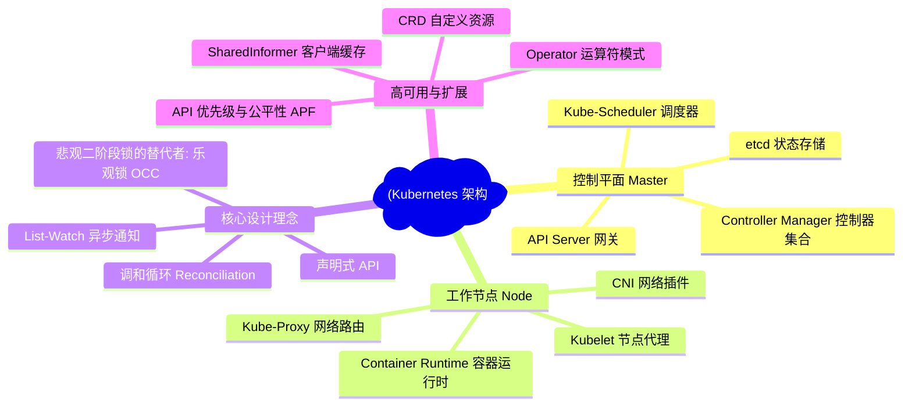
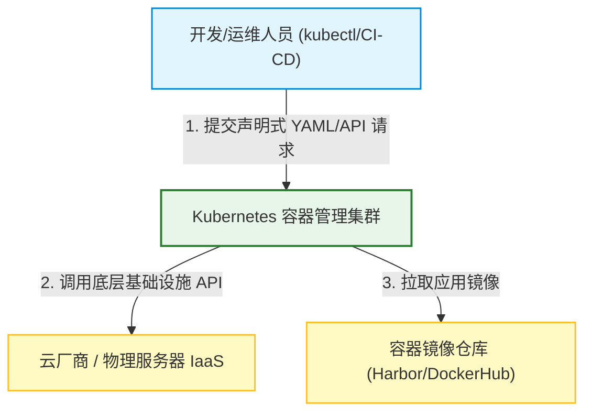
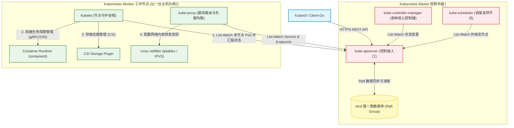
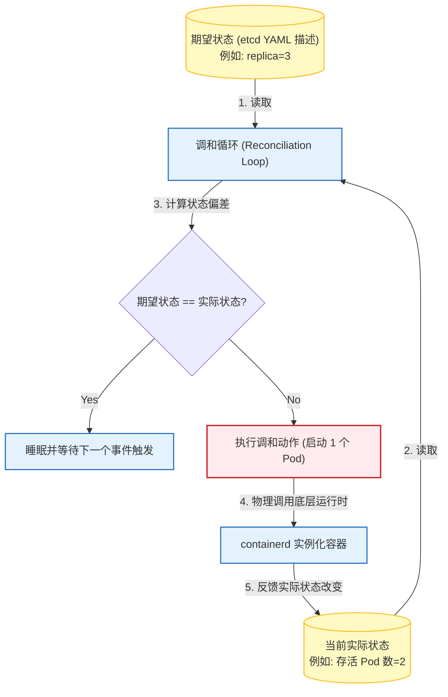
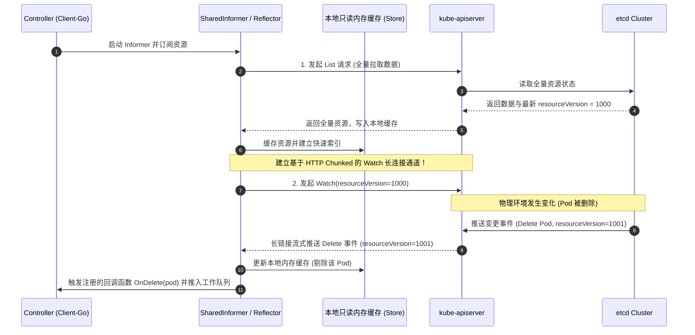
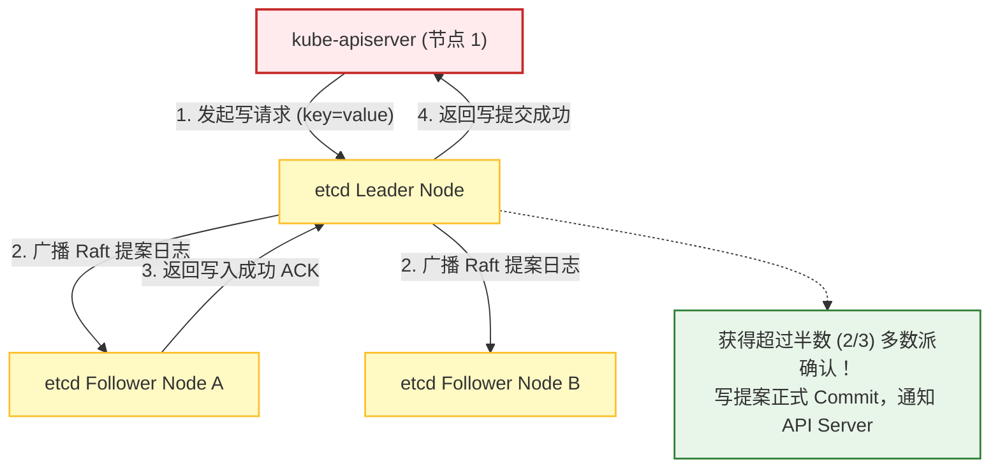
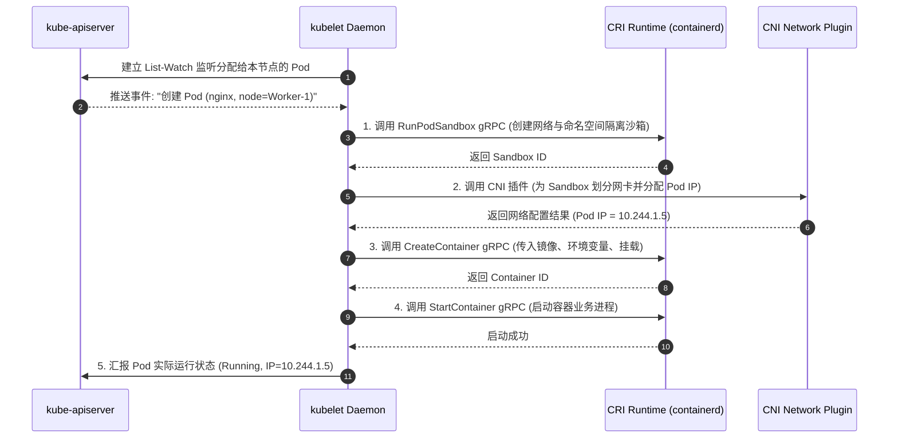
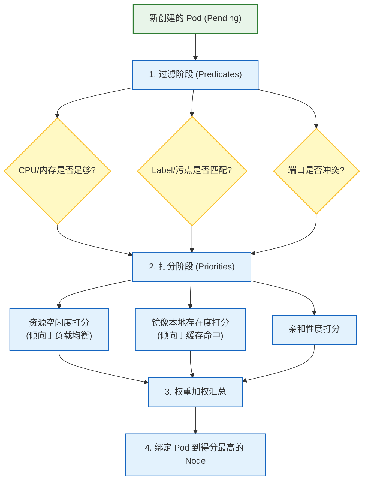

import CaseStudyHeader from '@site/src/components/CaseStudyHeader';
import DesignIntent from '@site/src/components/DesignIntent';
import EvolutionTimeline from '@site/src/components/EvolutionTimeline';
import CompareSlider from '@site/src/components/CompareSlider';
import TradeoffExplorer from '@site/src/components/TradeoffExplorer';
import GlossaryTerm from '@site/src/components/GlossaryTerm';
import ResearchNote from '@site/src/components/ResearchNote';
import GuidedExercise from '@site/src/components/GuidedExercise';
import QuizCard from '@site/src/components/QuizCard';
import MindMap from '@site/src/components/MindMap';
import PyRunner from '@site/src/components/PyRunner';

# Kubernetes：云原生操作系统、声明式 API 与控制器调和架构

<CaseStudyHeader
  oneLiner="Kubernetes 是分布式容器编排的事实标准与云原生时代的『操作系统』。它彻底抛弃了传统命令式运维，通过声明式 API 描述系统状态，并利用 etcd 实现高可用状态共识。底层的控制器管理器、调度器与 Kubelet 节点代理共同构建了无休止的『调和循环』，在松耦合的微服务拓扑中，实现了自动化弹性扩缩容与自愈防线。"
  stats={[
    {label: '开发语言', value: 'Go (完全静态编译)'},
    {label: '核心状态数据库', value: 'etcd (基于 Raft 共识协议)'},
    {label: '状态更新模式', value: 'List-Watch 长连接监听'},
    {label: '并发控制机制', value: '乐观并发控制 (resourceVersion)'},
    {label: '容器解耦标准', value: 'CRI (Container Runtime Interface)'},
    {label: '网络抽象模型', value: '扁平 CNI (Container Network Interface)'}
  ]}
/>

:::info 对应课程概念
本案例融合了以下课程核心概念：
*   **分布式共识与状态存储（Month 5/12）**：etcd 在控制平面状态多副本同步中的 Raft 强一致性实现。
*   **声明式设计与调和循环（Month 6 云原生）**：理解『期望状态』与『实际状态』之间的持续调和（Reconciliation）与自愈。
*   **分布式事件驱动架构（Month 3 消息队列）**：利用 List-Watch 机制构建非轮询、零时延的状态变更事件传递管道。
*   **限流与熔断保护（Month 5 稳定性）**：API Server 如何通过 Flow Schema 和 APF 对海量控制器并发请求进行分级限流。
:::

---

## 1. 设计初衷：从 Borg/Omega 到云原生标准

在 Kubernetes 诞生之前，大规模容器管理的现状面临着严峻的运维效率与弹性挑战：
1.  **物理机时代的命令式泥潭**：
    *   早期的运维严重依赖脚本和命令式工具（如 Ansible, Puppet 或手写 Shell）。运维人员必须明确指挥系统“先登录这台机器，再拉取镜像，然后启动这个端口，最后如果失败就发邮件”。
    *   这种方式极易由于网络抖动、进程异常或硬件瞬时故障引发严重的“状态漂移（State Drift）”——配置写了一半，机器宕机，导致整个集群状态支连破碎且难以自动重构。
2.  **Google 内部 Borg/Omega 系统的开源涅槃**：
    *   Google 内部运行了多年的 Borg 与 Omega 容器资源管理系统，累积了深厚的架构经验。他们发现：系统应该只需向用户提供一个统一的接口去声明“**我想要 5 个健康的 Nginx 容器运行着**”，而把“如何达到并维持这 5 个容器健康”的具体执行过程，全权委托给数据库和后台异步的自治控制器。
3.  **声明式 API 与解耦至上**：
    *   为了打破传统单体集群管理系统的扩展瓶颈，Kubernetes 设计了一套完全以 **API Server** 为中枢、**etcd** 为唯一可信状态源、以及大量微服务化的**控制器（Controllers）**异步订阅事件的松耦合架构。
    *   这种设计允许任何第三方开发者通过自定义资源（CRD）无缝扩展 Kubernetes，使其成为不仅能调度容器，还能调度虚拟机、数据库甚至机器学习工作流的万能分布式控制平面。

<DesignIntent
  problem="如何在成千上万台物理/虚拟服务器上，以安全、可靠、高扩展、完全声明式的方式编排 PB 级业务容器负载，提供零停机的水平自动扩缩、动态服务发现与自主故障恢复。"
  users="全球范围的大中型企业平台架构团队、DevOps 运维团队、以及云原生应用开发工程师。"
  devices="运行在由 API Server、etcd、Controller Manager 和 Scheduler 组成的控制平面物理/云主机，以及运行了 Kubelet 代理的成百上千个工作节点上。"
  goals={[
    '声明式自愈机制：容器、网络和存储的状态由各种独立的控制器持续监听，发生异常时自动拉起、重建或剔除，无需人工介入',
    '高可用共享状态：利用 etcd Raft 强一致多副本同步，保证集群核心元数据哪怕遭遇半数节点宕机也绝不丢失',
    '完全解耦的插件化生态：通过 CRI、CNI、CSI 抽象接口与底层容器、网络、存储供应商解耦，允许自由替换具体实现',
    '无痛滚动更新：支持 Deployment 级别的滚动升级与回滚，自动控制最大受损和最大溢出实例数'
  ]}
  constraints={[
    'etcd 性能瓶颈：由于 etcd 强一致写的物理限制，单个 K8s 集群的节点规模通常限制在 5000 台以内，API 调用必须进行极其严格的降级与限流',
    '网络复杂性：CNI 必须为每个 Pod 分配一个在集群范围内可直接通信的扁平 IP 地址，这增加了跨数据中心或混合云环境下的路由配置难度',
    '控制平面事件压力：海量 Pod 启停会带来高强度的 watch 事件风暴，要求客户端具备 SharedInformer 级别的本地缓存与合并队列设计'
  ]}
  firstStep="构建以声明式 schema 定义的 API Server 核心网关；实现 etcd Raft 副本同步；编写核心 Deployment 调和控制器；在工作节点安装 Kubelet 和容器运行时接入管道。"
/>

---

## 2. 知识全景脑图

### 2a. 全景架构思维导图

### 2b. 交互脑图导航

<MindMap
  root={{
    label: 'Kubernetes 核心架构',
    children: [
      {
        label: '控制平面 (Control Plane)',
        children: [
          { label: 'kube-apiserver: 唯一状态交互入口' },
          { label: 'etcd: Raft 强一致多版本键值存储' },
          { label: 'kube-scheduler: 调度与拓扑打分' },
          { label: 'kube-controller-manager: 调和循环执行器' }
        ]
      },
      {
        label: '数据平面 (Data Plane)',
        children: [
          { label: 'kubelet: 节点生命周期看门狗' },
          { label: 'kube-proxy: 服务发现与四层负载均衡' },
          { label: 'CRI / CNI / CSI: 插件化标准化接口' }
        ]
      },
      {
        label: '核心驱动机制',
        children: [
          { label: '声明式 API 与 YAML 状态描述' },
          { label: 'List-Watch 异步事件通知' },
          { label: 'resourceVersion 乐观并发锁' },
          { label: 'SharedInformer 事件分发与合并缓存' }
        ]
      }
    ]
  }}
/>

---

## 3. 系统架构总览 (C4 Model)

### 3a. System Context (系统上下文图)

### 3b. Container Diagram (容器结构图)

---

## 4. 核心机制拆解

### 4a. 声明式 API 与控制器调和循环 (Reconciliation Loop)

在 Kubernetes 中，所有的操作都是异步且基于最终一致性的：
1.  **状态对比**：控制器是一个死循环：`Reconcile(desiredState, actualState)`。
2.  **状态逼近**：如果发现 `desiredState` 与 `actualState` 存在不匹配，控制器会计算差值，向底层数据平面或网络发送控制命令，直至两者完全相等，随后进入下一次睡眠等待状态。
3.  **最终一致性**：由于外界环境异常可能随时破坏 actualState（如物理节点被拔掉网线），调和循环会源源不断地发现偏差，并持续纠偏。

---

### 4b. 高效的 List-Watch 机制与 SharedInformer 缓存

如果让成百上千个组件频繁轮询 API Server，API Server 的 CPU 和网络带宽会立刻瘫痪。Kubernetes 基于 <GlossaryTerm term="List-Watch 机制" definition="Kubernetes 中客户端与 API Server 通信的机制。List 阶段获取资源的全部最新数据，Watch 阶段通过 HTTP 长连接（Chunked Transfer Encoding）持续监听资源的变化事件，避免了频繁轮询。">List-Watch 机制</GlossaryTerm> 实现了极佳的事件通知效率：
1.  **List 阶段**：控制器启动时，向 API Server 发起一次全量查询，获取所有资源的最新状态。
2.  **Watch 阶段**：客户端带着获取到的 `resourceVersion` 向 API Server 发起 Watch 监控请求。API Server 通过 HTTP 长连接（Chunked Transfer Encoding）保持连接，当 etcd 中发生资源修改时，API Server 会将增量变更事件立刻推送给订阅的客户端。
3.  **SharedInformer**：为了让同一进程内的多个组件只建立一条 Watch 通道并共享内存，Kubernetes 引入了 <GlossaryTerm term="SharedInformer" definition="Kubernetes 客户端库中的缓存与事件分发组件。它监听特定资源类型的事件，并在本地维护一份只读的数据缓存，多个控制器可以共享同一个 SharedInformer 缓存，大幅降低了 API Server 的压力。">SharedInformer</GlossaryTerm>。它在本地维护只读的内存缓存，并通过双向索引（Indexer）分发给控制器的消费队列，彻底避免了客户端重复建立 HTTP 链路对服务端的压迫。

---

### 4c. etcd 状态存储、Raft 共识与悲观/乐观锁并发

<GlossaryTerm term="etcd" definition="Kubernetes 集群的共享状态存储，基于 Raft 一致性协议的分布式键值数据库。它负责保存所有集群元数据与期望状态，具备强一致性和高可用性。">etcd</GlossaryTerm> 是 Kubernetes 架构中唯一的强一致性数据存盘点，所有的状态转换本质上都对应着 etcd 中键值对的写入：
1.  **无状态的 API Server**：API Server 本身不保存任何状态，它仅仅是 etcd 的“守门员”和路由网关。所有数据写入必须通过 API Server 进行校验、转换后才能落地到 etcd。
2.  **Raft 副本复制**：etcd 采用 Raft 协议保证集群多成员下的数据共识。当 API Server 向 etcd 发起写入时，Leader 必须将该事务追加到 Raft Log 并复制给 Quorum 多数派节点，保证了即使 Master 节点局部断网或故障，状态也具有极高的抗灾抗丢失性。
3.  **乐观并发控制 (OCC)**：不同于传统数据库使用悲观排他锁，Kubernetes 在资源写入时使用 <GlossaryTerm term="乐观锁" definition="通过资源版本号 (resourceVersion) 规避并发冲突的机制。API Server 在写入资源前会校验提交的版本是否与 etcd 中当前最新版本一致，若不一致则拒绝写入并提示冲突，由客户端重试。">乐观锁 (Optimistic Concurrency Control, OCC)</GlossaryTerm> 进行并发校验。每条记录均有单调递增的 `resourceVersion`，若两个控制器同时尝试修改同一个 Pod，只有版本号校验通过的写入会被执行，另一个则会收到 `StatusConflict` 报错并主动发起重试。

---

### 4d. Kubelet 节点代理与容器运行时接口 (CRI)

Kubelet 是运行在每台工作节点上的“看门狗”，它通过声明式指令驱动底层容器运转：
1.  **PodSpec 驱动**：Kubelet 并不关心网络是谁配置的，也不关心调度决策。它唯一的工作是监听分配到本节点的 PodSpec 期望描述，然后向底层调用以让容器跑起来。
2.  **容器解耦 (CRI)**：早期 Kubelet 硬编码集成了 Docker。为了实现容器引擎解耦，Kubernetes 提出了 <GlossaryTerm term="容器运行时接口 (CRI)" definition="Kubernetes 定义的节点代理 Kubelet 与底层容器运行时（如 containerd、CRI-O）之间的 gRPC 协议标准，用于解耦特定的容器实现细节。">容器运行时接口 (Container Runtime Interface, CRI)</GlossaryTerm>，将容器管理、镜像拉取和元数据获取拆解为一系列 gRPC 方法。
3.  **运行容器**：当 Kubelet 收到创建 Pod 的事件后，通过 CRI 调用 Containerd / CRI-O 发起 `RunPodSandbox`，并在沙箱内部执行 `CreateContainer`、`StartContainer`，最终驱动底层容器就绪。

<ResearchNote
  title="Large-scale cluster management at Google with Borg"
  source="Verma et al. (2015), Proceedings of the European Conference on Computer Systems (EuroSys)"
  href="https://research.google/pubs/large-scale-cluster-management-at-google-with-borg/"
  insight="这篇经典文献揭示了 Google 内部运行数十万作业的 Borg 系统架构细节。Borg 证明了『声明式配置』与『基于调和循环的自我修复能力』是超大规模基础设施管理的唯一出路。Kubernetes 正是 Borg 经验在开源社区的重构再现，修复了 Borg 在配置文件组织、单主节点内存容量以及硬编码集成 Docker 等方面的历史局限。"
  application="架构启示：**拒绝过度集中设计，采用松耦合控制器**。在规划超大型云平台 (Month 11) 或大规模并发微服务 (Month 6) 时，避免编写一个『知道所有逻辑的超级大脑』，而要像 K8s 一样把逻辑拆成多个针对单一职责的调和控制器，利用消息总线和一致性存储异步联动。"
/>

---

## 5. 关键数据结构与算法

### 5a. 乐观锁与 Resource Version

为了避免分布式环境下的覆盖写丢失（Lost Update），Kubernetes 对所有 API 写入实施了乐观锁并发控制：
*   **物理存储**：在 etcd 中，所有键的变更都会有一个单调递增的修改版本号 `ModRevision`。
*   **API 呈现**：API Server 会将此修改版本号通过 Metadata 中的 `resourceVersion` 返回给客户端。
*   **并发拦截**：当客户端尝试使用 `Update` 方法修改资源时，必须在 Payload 中包含原有的 `resourceVersion`。如果该版本号小于 etcd 中的当前最新版本，代表在此期间有其他组件抢先做出了修改，API Server 会返回 HTTP 409 Conflict 状态码拦截该请求。

---

### 5b. etcd MVCC 与 B+树/BoltDB 存储架构

etcd 的高性能只读读取和多版本快照能够完美支撑 K8s 的 List-Watch 机制，这得益于其精妙的双层存储设计：
1.  **内存层 B-Tree**：内存中维护了一个 B-Tree 索引，它将用户请求的逻辑 Key（例如 `/registry/pods/default/nginx`）映射到 etcd 的 Revision 结构体。
2.  **磁盘层 BoltDB (B+树)**：底层的物理存储引擎（BoltDB / bbolt）是一个基于 B+ 树的单文件键值数据库。在 BoltDB 中，键是单调递增的 `Revision`，值是包含用户 Key、Value 以及元数据的二进制数据包。
3.  **快照读实现**：正因为 BoltDB 是以 Revision 为键物理排序的，只读事务只需要带着 Revision 就可以直接在 B+ 树上执行范围扫描（Range Scan），这让获取任意历史快照点的数据变得极快且完全不影响当前的写事务。

---

### 5c. Kube-scheduler 的过滤 (Predicates) 与打分 (Priorities) 算法

kube-scheduler 的核心职责是为新创建的 Pod 选择一个最合适的物理 Node。这是一个典型的两阶段工作流：
1.  **过滤阶段 (Predicates / Filtering)**：
    *   调度器会遍历所有注册的工作节点，运行一系列过滤算法（如：检查 Node 的 CPU/内存剩余资源是否满足 Pod 声明、Pod 声明的 HostPort 是否冲突、NodeSelector 标签是否匹配、Tolerations 是否容忍污点等）。
    *   被淘汰的 Node 将直接被剔除，留下候选 Node 列表。
2.  **打分阶段 (Priorities / Scoring)**：
    *   对通过过滤的 Node 进行打分（0-100分）。打分算法包括：`LeastRequestedPriority`（倾向于空闲资源多的节点以实现负载均衡）、`ImageLocalityPriority`（倾向于已经本地下载了所需镜像的节点以缩短拉取时延）、`NodeAffinityPriority`（满足亲和性配置的打高分）等。
    *   最后，调度器将各个打分项乘以权重后求和，得分最高的 Node 胜出，并将其写入 Pod 的 `spec.nodeName` 属性中（即 Binding 过程）。

---

## 6. 架构演进史

Kubernetes 从一个玩具容器编排系统，一步步退火、抽象，演进为全球云原生操作系统：

<EvolutionTimeline
  events={[
    {
      year: '2014',
      title: '开源发布与 Borg 概念重构',
      why: 'Google 决定通过开源手段击败其他的容器编排竞争对手，将内部 Borg 的最佳实践共享出来以抢占云原生制高点。',
      change: '提出 Pod、Service、Label 核心抽象；引入单一 etcd 作为状态库；此时系统与 Docker 底层运行时存在强绑定。'
    },
    {
      year: '2016-2018',
      title: '容器战争终结与接口标准化 (CRI/CNI/CSI)',
      why: '生态内部不同供应商（Docker、CoreOS、RedHat）各自利益冲突，且硬编码网络和存储阻碍了社区贡献，社区强烈要求与 Docker 解耦。',
      change: '推出 Custom Resource Definition (CRD) 允许用户自定义资源；制定 CRI、CNI、CSI 三大接口规范，彻底将 Docker 退化为普通的底层运行时，确立了绝对的行业共识。'
    },
    {
      year: '2020 至今',
      title: 'Docker 弃用与云原生边缘化/GitOps 浪潮',
      why: 'Docker 复杂的单体守护进程架构严重冗余且不直接兼容 CRI 规范，且容器应用延伸至边缘设备与跨云平台。',
      change: '彻底废弃 dockershim 兼容层，转向超轻量 containerd Direct 模式；推动 K3s 边缘架构及以 ArgoCD 为代表的声明式声明同步 (GitOps)。'
    }
  ]}
/>

---

## 7. 架构对比：传统命令式部署脚本 vs. Kubernetes 声明式调和架构

<CompareSlider
  before={
    

      <strong>传统命令式部署脚本 (Ansible / Shell)</strong>
      
依靠人工编写的步骤指令对服务器进行操作。如果在执行中途某台机器突然网络中断或磁盘写满，运维系统无法得知错误是在哪个中间状态发生的，更无法自动修复；每次系统升级需要手动编写复杂的清理、替换与回滚逻辑，故障率随节点数呈几何增长。

    

  }
  after={
    

      <strong>Kubernetes 声明式调和架构 (YAML + Controller)</strong>
      
用户在 YAML 里描述集群的终态，无需指示过程。系统控制器异步执行无休止的“调和循环”：一旦 Pod 因硬件损坏下线，ReplicaSet 控制器会自动发现 `actual &lt; desired`，并异步命令 kube-scheduler 找新节点，再由 kubelet 拉起新容器，实现完全自愈。

    

  }
  labels={['传统命令式部署', 'K8s 声明式调和']}
/>

---

## 8. 设计模式与课程映射

本案例在实际工业界的云原生底座中，深度应用了以下课程章节中的核心设计模式与技术：

1.  **分布式共识与状态一致性**（参见 [共识与协调](../05-core-components/consensus-coordination.mdx) 章节）：
    *   Kubernetes 控制平面的高可用和强一致全赖于底层部署的 etcd 集群。通过 Raft 协议在多个 etcd 实例间实时同步日志，从而避免了“双脑问题”，为整个上层调度提供了坚如磐石的状态底座。
2.  **异步事件驱动与消息订阅**（参见 [消息队列](../03-data-cache-queue/message-queues.mdx) 章节）：
    *   Kubernetes 控制器不使用轮询，而是通过 API Server 提供的 List-Watch HTTP 长连接进行资源变更事件的实时消费。这类似于发布-订阅设计模式，将复杂的 API Server 与各种独立的控制器组件解耦，避免了控制平面的接口雪崩。
3.  **悲观锁与乐观锁并发冲突规避**（参见 [事务与隔离级别](../03-data-cache-queue/transactions-isolation.mdx) 章节）：
    *   K8s 内部所有的更新操作都带有一个全局唯一的 `resourceVersion`。这种乐观锁并发控制 (OCC) 的设计，省去了跨网络申请悲观分布式排他锁（2PL）的高昂时延开销，非常适合以读为主、写冲突概率较低的集群管理业务特征。
4.  **高并发限流保护与背压控制**（参见 [限流熔断](../05-core-components/rate-limiting.mdx) 章节）：
    *   API Server 作为整个集群的流量总闸，内置了 APF（API Priority and Fairness）限流算法。它根据请求的优先级（如主控制器的系统请求 > 用户的普通查询请求）对流量进行分流和优先级排队保护，确保即便有突发的 Watch 风暴，核心自愈逻辑也不会因过载而瘫痪。

---

## 9. 权衡：编排系统中的架构妥协

Kubernetes 在复杂性、控制平面开销以及易用性之间做出了取舍：

<TradeoffExplorer
  title="Kubernetes 编排一致性、扩展度与系统复杂性权衡"
  dimensions={['声明式自愈与故障自适应', '控制平面资源内存开销', '集群扩展度与第三方定制能力', '网络扁平互联通信时延', '运维与研发心智复杂度']}
  options={[
    {
      name: '完全声明式控制平面 + 独立控制器架构 (Kubernetes 默认)',
      scores: [5, 2, 5, 3, 1],
      note: '通过将控制逻辑解耦到各个控制器中，获得了无与伦比的扩展度（CRD/Operator）和极佳的自愈能力。代价是系统组件多而繁杂，本地缓存（SharedInformer）占用了可观的客户端内存，且扁平网络（CNI）可能带来微小的跨机物理封包时延，运维门槛高得惊人。',
      whenToUse: '超大规模容器化应用部署、跨地域混合云编排、具有深度定制化需求（例如服务网格、数据库算子）的企业级中台。'
    },
    {
      name: '轻量化紧耦合命令式编排 (如 Docker Swarm)',
      scores: [3, 5, 2, 5, 5],
      note: '组件合一，运行时直接内置编排模块。不依赖复杂的 List-Watch 机制和 etcd 外部组件，部署极快，单节点资源占用接近于零。但在高并发网络分割下自愈机制不稳定，缺乏开放的生态接口（无 CRD），难以支撑复杂的多租户和自定义控制资源。',
      whenToUse: '中小型企业单机房物理集群、边缘单节点设备、研发测试环境下的快速容器调度。'
    },
    {
      name: '强一致集中式调度大脑 (类似 Borg / 早期 Mesos 架构)',
      scores: [4, 1, 3, 4, 2],
      note: '调度器拥有至高无上的决断权，直接与每台机器通信以执行命令式启动。单次调度延迟非常低，吞吐量极大。但核心致命点是“单点过载”严重，一旦主节点内存溢出宕机，整个集群立刻失联瘫痪，很难容忍高度异构且快速变更的业务场景。',
      whenToUse: '极大规模超算任务（如万卡 GPU 训练、大数据批处理）等调度要求极高、但业务模型单一且不需要复杂微服务网络控制的底层基座。'
    }
  ]}
/>

---

## 10. 如果是你来设计：控制器的声明式调和循环模拟器

### 场景设想
在 Kubernetes 系统的副本控制器（ReplicaSet Controller）中，核心任务是保持 Pod 副本数始终贴近期望值：
*   期望状态由用户通过 API 指定为 `desired_replicas`。
*   控制器启动后，会不断运行调和循环（Reconciliation Loop）。
*   在每一轮调和中，控制器会扫描当前存活的 `actual_replicas` 列表，如果发现数量偏少（如容器异常退出），它会主动拉起新容器；如果数量偏多（如用户执行了缩容），它会优雅终止多余的容器。
*   同时，本实验仿真了一个不稳定的数据平面：在后台，随时会有 Pod 因为“网络抖动”或“内存溢出 (OOM)”等物理随机故障而崩溃挂掉。

请你用 Python 实现这个经典的声明式控制器调和循环模拟器。

<GuidedExercise
  title="基于 Python 的 K8s 副本调和循环与节点自愈仿真"
  goal="实现一个能够自主监听状态偏离、通过调和循环启动/停止容器，并能应对随机 Pod 物理故障的声明式控制器模型。"
  steps={[
    '步骤 1: 设计 Pod 类代表物理容器。每个 Pod 具有唯一的 ID 和当前状态（如 "Running", "Pending"）。',
    '步骤 2: 设计 ReplicaSetController。核心是 `reconcile()` 方法。它调用当前节点实际运行状态，与 `desired_replicas` 对比，并在必要时调用 `create_pod()` 或 `delete_pod()`。',
    '步骤 3: 在仿真主循环中，周期性触发 Pod 随机崩溃（模拟 OOM 杀死容器），随后观察 ReplicaSetController 在下一轮调和循环中，如何无人工干预地自动识别并补充新副本。',
    '步骤 4: 运行模拟测试。当最终能够应对副本变动、物理宕机并稳定实现“期望与实际等价一致”时，验证通过。'
  ]}
  checks={[
    '确认不执行调和动作时，崩溃的 Pod 无法自愈重构',
    '验证启动调和控制器后，无论 Pod 怎么异常挂掉，系统实际运行副本数能快速收敛归于期望值',
    '确认在控制台输出“调和成功，期望数=实际数”字样'
  ]}
/>

#### 交互式 Python 运行实验
在下方控制台中直接运行或修改已准备好的 K8s 控制器仿真代码：

<PyRunner
  expect="调和成功，期望数=实际数"
  rows={22}
  code={`import time
import random
import uuid

class Pod:
    def __init__(self, name):
        self.pod_id = str(uuid.uuid4())[:8]
        self.name = f"{name}-{self.pod_id}"
        self.status = "Running"

    def __repr__(self):
        return f"[{self.name} | {self.status}]"

class ReplicaSetController:
    def __init__(self, name, desired_replicas=3):
        self.name = name
        self.desired_replicas = desired_replicas
        self.active_pods = []  # 数据平面实际运行的 Pod 列表

    def create_pod(self):
        new_pod = Pod(self.name)
        self.active_pods.append(new_pod)
        print(f"   [+] 调和动作: 创建新 Pod {new_pod.name}")

    def delete_pod(self, pod):
        self.active_pods.remove(pod)
        print(f"   [-] 调和动作: 终止并清理 Pod {pod.name}")

    def reconcile(self):
        print(f"\\n--- 启动 {self.name} 控制器调和循环 ---")
        
        # 1. 过滤获取当前健康的运行中 Pod
        running_pods = [p for p in self.active_pods if p.status == "Running"]
        actual_count = len(running_pods)
        print(f"   期望副本数: {self.desired_replicas} | 实际运行数: {actual_count}")
        print(f"   当前运行列表: {running_pods}")

        # 2. 对比期望与实际，执行纠偏动作
        if actual_count < self.desired_replicas:
            diff = self.desired_replicas - actual_count
            print(f"   发现状态偏差: 缺少 {diff} 个副本，启动补充")
            for _ in range(diff):
                self.create_pod()
        elif actual_count > self.desired_replicas:
            diff = actual_count - self.desired_replicas
            print(f"   发现状态偏差: 多余 {diff} 个副本，优雅移除")
            for _ in range(diff):
                # 优先删除最晚创建的 Pod
                self.delete_pod(running_pods.pop())
        else:
            print("   [✅] 期望状态 == 实际状态。系统处于平稳态，无需纠偏。")

# 开始仿真测试
controller = ReplicaSetController("nginx-service", desired_replicas=3)

# 第一轮调和：此时没有任何 Pod 运行，应自动补充 3 个
controller.reconcile()

# 模拟平稳运行了一段时间
time.sleep(0.5)

# 仿真物理环境：其中一个容器突发故障 (OOM 崩溃)
crashed_pod = controller.active_pods[random.randint(0, 2)]
print(f"\\n[💥 物理故障]: 容器 {crashed_pod.name} 遭遇内存溢出 OOM 崩溃挂掉！")
crashed_pod.status = "Failed"  # 状态变为失败

# 再次触发调和循环：控制器应该自动检测到 Failed 状态的 Pod 并重新拉起一个健康的 Pod
controller.reconcile()

# 模拟用户动态扩容：将期望副本数改到 5
print("\\n[⚙️ 用户操作]: 动态扩容 nginx-service 期望副本数 -> 5")
controller.desired_replicas = 5
controller.reconcile()

# 模拟用户动态缩容：将期望副本数缩减到 2
print("\\n[⚙️ 用户操作]: 动态缩容 nginx-service 期望副本数 -> 2")
controller.desired_replicas = 2
controller.reconcile()

# 最终验证
final_running = [p for p in controller.active_pods if p.status == "Running"]
if len(final_running) == 2:
    print("\\n[✅ 验证成功]: 调和成功，期望数=实际数")
else:
    print("\\n[❌ 验证失败]")
`}
/>

---

## 11. 常见误解

### 误解 1：Kubernetes 极其复杂，小型应用也应该直接上 K8s 进行管理
*   **澄清**：这是典型的“拿大炮轰蚊子”。Kubernetes 庞大的组件网格（API Server, etcd, 控制器, 调度器）和网络叠加层（CNI）本身就会占用非常可观的 CPU 与内存开销。对于只有几台云服务器、且业务简单的初创团队，使用 Kubernetes 会大幅推高运维和学习门槛。简单的命令式工具、Docker Swarm 或全托管的 Serverless 平台才是中小型应用早期的最佳选择。

### 误解 2：etcd 写入速度慢，是因为 Kubernetes 的代码写得太臃肿
*   **澄清**：etcd 写入受限是由其底层分布式共识原理决定的。etcd 作为一个基于 Raft 强一致性协议的分布式键值库，为了保证“即使遇到断电，提交的数据也绝不丢失”，它的每次写操作都必须经过磁盘的顺序写入追加（WAL 刷盘），并通过跨网络的三机多数派（Quorum）确认。这种串行持久化机制注定了其单 key 写性能无法与 Redis 这种纯内存且异步刷盘的 KV 缓存同日而语，与 K8s 的代码实现无关。这也是为什么 K8s 内部在设计上极力避免频繁写入，而是大量使用 Informer 本地缓存的原因。

### 误解 3：Kube-scheduler 必须在 Master 节点上直接物理操作容器的创建与挂载
*   **澄清**：这是完全错误的。Kube-scheduler 的分工非常纯粹，它本身**不具备任何容器底层的控制权限**。它的唯一产出是把计算出的节点名称绑定到 Pod 结构体中（即 `pod.spec.nodeName = "node-A"`），然后将这一决定以元数据更新的方式写回到 API Server 中。具体创建容器、挂载云盘和拉取镜像的重体力活，全权由运行在对应工作节点上的 **kubelet** 监听到事件后，通过 CRI 本地发起命令完成。

---

## 12. 知识自测

<QuizCard
  questions={[
    {
      q: '在 Kubernetes 控制器与 API Server 通信中，List-Watch 机制的 Watch 阶段为什么不需要使用频繁轮询（Polling）就能做到低时延状态变更响应？',
      options: [
        'A. Watch 阶段基于 HTTP 长连接（Chunked Transfer Encoding）保持与服务端的连接，API Server 在 etcd 发生变更时会流式增量向客户端推送事件，实现了极低的时延和高网络效率',
        'B. 控制器直接向 etcd 暴露了 TCP 连接，绕过 API Server 进行即时事件消费',
        'C. API Server 周期性（每隔 100 毫秒）强行向客户端发送广播数据包，不论是否有状态变化',
        'D. 客户端利用了手机移动端的短消息推送（SMS）协议进行状态分发'
      ],
      answer: 0,
      explain: '这是 List-Watch 机制精妙之处。它利用了 HTTP Chunked 长连接。客户端只需在启动时 List 一次，随后便可以通过保持的长链接流式监听 API Server 的增量写入推送，完美兼顾了实时性与服务端的低开销。'
    },
    {
      q: '当两个不同的 ReplicaSet 控制器在同一时刻尝试更新同一个 Pod 的副本状态时，Kubernetes API Server 是如何防止“写覆盖丢失”（Lost Update）以确保并发写入安全的？',
      options: [
        'A. 通过在 etcd 层面使用二阶段排他锁，强行将该 Pod 的所属键锁定 5 分钟，直至事务结束',
        'B. API Server 内部维护资源版本号 resourceVersion。当写入请求提交的版本号与数据库当前最新版本不符时，会判定发生并发冲突，拦截并返回 HTTP 409 错误，由客户端捕获后进行乐观重试',
        'C. 调度器会直接强制杀死其中一个控制器的进程，确保只有一个控制器存活',
        'D. 采取“最后写入获胜”（LWW）策略，无条件使用最新时间戳的覆盖写冲掉旧版本数据'
      ],
      answer: 1,
      explain: 'Kubernetes 使用乐观锁（OCC）来处理并发写入。每个资源对象都包含一个单调递增的 resourceVersion。当进行更新操作时，API Server 会比对提交的 resourceVersion 是否与 etcd 中的最新版本一致。如果不一致则说明有人捷足先登，API Server 会拒绝此操作并报错 409 Conflict，由客户端通过 client-go 库自动进行退避重试，从而避免了高昂的分布式排他锁开销。'
    },
    {
      q: '以下关于 Kubernetes 控制平面各组件职责的划分，叙述正确的是哪一项？',
      options: [
        'A. kube-scheduler 负责在物理机上挂载网络和拉取镜像，kube-controller-manager 负责解析 YAML 并写入 etcd，Kubelet 负责把 Pod 绑定到节点名',
        'B. API Server 负责将实际容器运行起来，etcd 负责调度，Kubelet 作为协调器运行在 Master 节点',
        'C. kube-scheduler 仅负责从候选节点中进行过滤与打分以做出调度决策，并将决策节点写入 Pod spec 中；真正的物理容器拉起与挂载则由对应工作节点上的 kubelet 监听到事件后执行',
        'D. etcd 负责提供负载均衡和流量分发规则，API Server 负责周期性清空节点内存'
      ],
      answer: 2,
      explain: 'Kubernetes 实现了极其完美的控制与执行分离。kube-scheduler 的职责是只动口不动手，仅在 API Server 层面修改 Pod 的 spec.nodeName。而真正把容器拉起、把网络配好、把云盘挂载的体力劳动，则由分配到的那个 Node 上的 Kubelet 节点守护进程去拉底层运行时和 CNI/CSI 完成。'
    }
  ]}
/>

---

## 来源清单

*   [Verma et al. (2015), Large-scale cluster management at Google with Borg (EuroSys)](https://research.google/pubs/large-scale-cluster-management-at-google-with-borg/)
*   [Burns et al. (2016), Borg, Omega, and Kubernetes (ACM Queue)](https://queue.acm.org/detail.cfm?id=2898444)
*   [Kubernetes Design Docs: API Server List-Watch and SharedInformer Pattern](https://github.com/kubernetes/community/blob/master/contributors/devel/sig-architecture/api-conventions.md)
*   [etcd Documentation: Raft Consensus and MVCC Storage Engine](https://etcd.io/docs/v3.5/learning/)