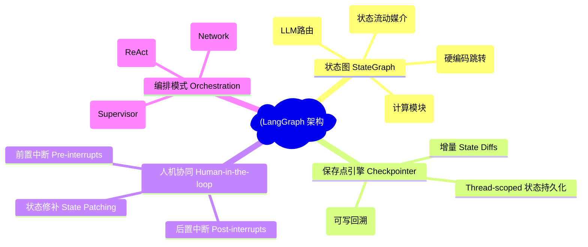
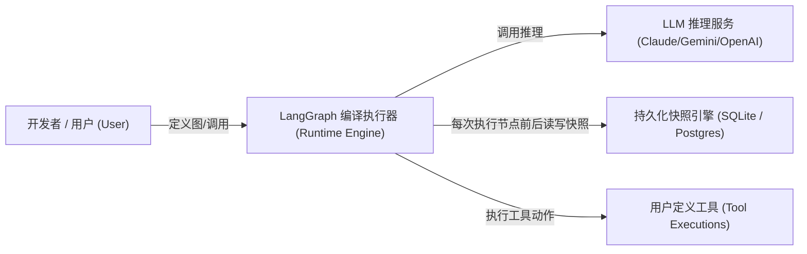
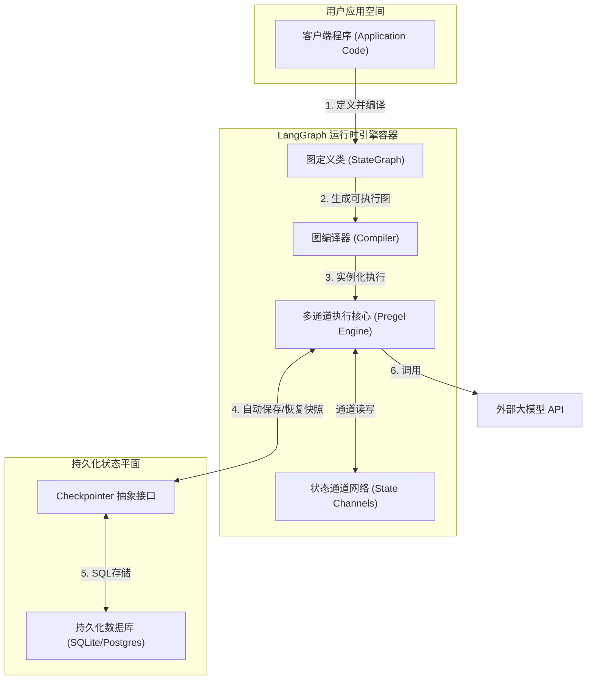
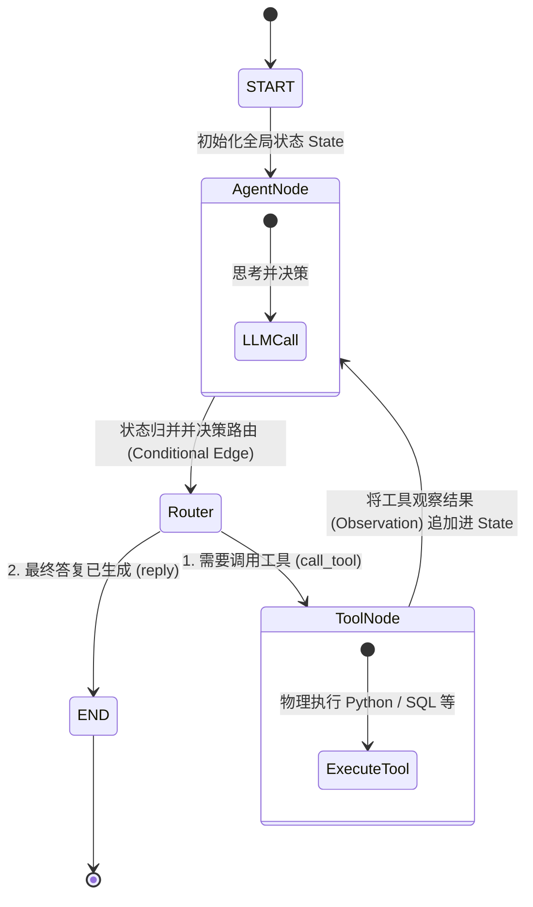
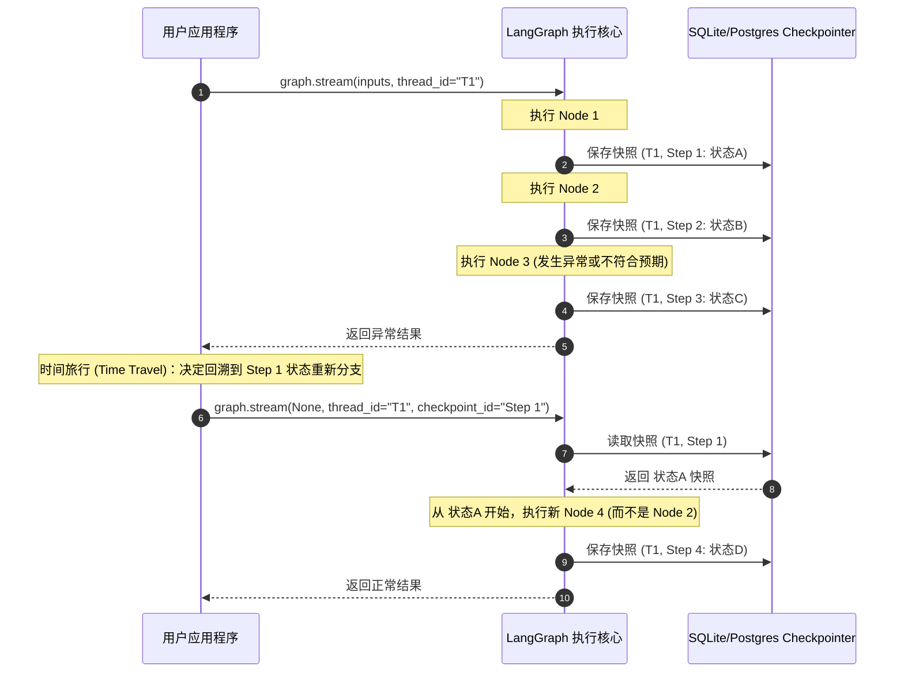
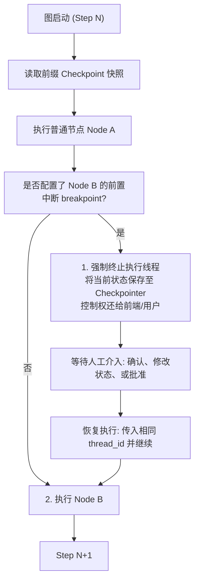
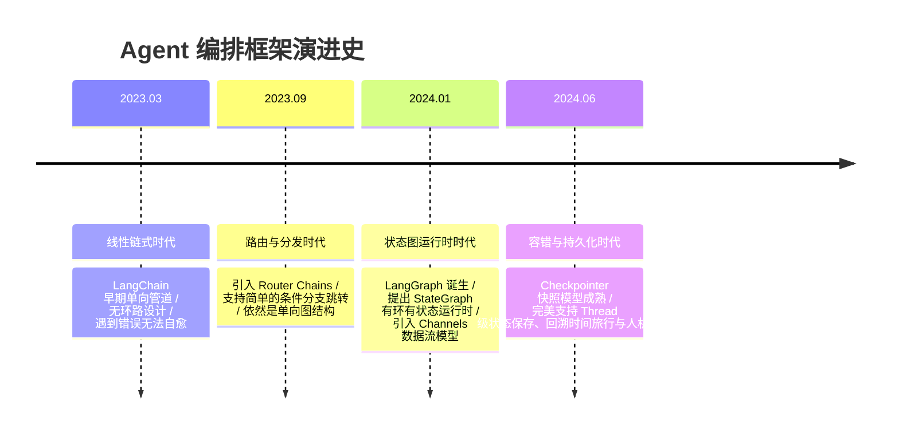

import CaseStudyHeader from '@site/src/components/CaseStudyHeader';
import DesignIntent from '@site/src/components/DesignIntent';
import ArchitectureEvolution from '@site/src/components/ArchitectureEvolution';
import TradeoffExplorer from '@site/src/components/TradeoffExplorer';
import GlossaryTerm from '@site/src/components/GlossaryTerm';
import ResearchNote from '@site/src/components/ResearchNote';
import QuizCard from '@site/src/components/QuizCard';
import CompareSlider from '@site/src/components/CompareSlider';
import GuidedExercise from '@site/src/components/GuidedExercise';

# LangGraph：基于状态图的智能体编排与容错架构

<CaseStudyHeader
  oneLiner="LangGraph 突破了传统 AI 框架线性有向无环图（DAG）的限制，将智能体应用抽象为包含『节点、边、条件边与全局状态』的状态图，并通过内置的 Checkpointer 机制实现了状态版本的秒级持久化、回溯（时间旅行）与安全的人机协同。"
  stats={[
    {label: '发布时间', value: '2024 年'},
    {label: '核心抽象', value: 'StateGraph (有环图结构)'},
    {label: '状态持久化', value: 'Thread Checkpointer (SQLite/Postgres)'},
    {label: '协同机制', value: 'Human-in-the-loop (状态中断与补丁)'},
    {label: '核心并发控制', value: '读写合并与并发通道 (Channels)'}
  ]}
/>

:::info 对应课程概念
本案例横跨 [Month 9 Agent 智能体架构](../agent-architectures/agent-loop-basics)、[Month 4 设计模式](../design-patterns-lld/patterns-through-change)、[Month 3 队列与高并发](../data-cache-queue/cache-queues-idempotency)。它完美展示了如何将底层的状态机设计模式与分布式事务保存点结合，构建出一个具备“高容错、可重入”的生产级 Agent 操作系统。
:::

## 1. 设计初衷：从“线性管道”到“可控的自主循环”

第一代大模型编排工具（如 LangChain 早期版、LlamaIndex 早期版）是为**有向无环图（DAG）**设计的。它们非常适合做 RAG（读取文档 -> 拼接 Prompt -> 调用大模型 -> 格式化输出）。

但真正的智能体（Agent）行为是**有环路、自主循环**的。例如在经典的 ReAct 模式中，大模型需要不断自我循环：思考 -> 调用工具 -> 观察执行结果 -> 再次思考。普通的 DAG 框架无法应对这种无限循环和复杂的中间状态管理，极易在循环时发生状态丢失或陷入死循环。

<DesignIntent
  problem="构建一个能支持复杂『循环图』运行、状态统一共享、能在任意节点触发『人机干预中断（Interrupts）』并能无损恢复与回溯状态版本（时间旅行）的智能体运行时框架。"
  users="AI 系统架构师、智能体（Agent）应用开发者，需要构建具备高可靠性、多 Agent 复杂协作逻辑的工业级生产系统。"
  devices="运行于本地服务器、微服务容器或 Serverless 节点的 Python/JavaScript 运行时引擎，绑定外部高可靠存储介质。"
  goals={[
    '支持有环图流转（Cyclic Graphs）：天然编排包含“反馈纠错”、“多次重试”与“人机确认”的闭环状态流。',
    '基于单状态树的共享流动（State-Sharing）：所有节点在执行时共享并增量更新一个全局 State 字典，无需复杂的参数传递。',
    '人机协同中断（Human-in-the-loop）：支持图在特定动作前静默挂起（Breakpoints），等待人工审批或强行修改状态后再恢复执行。',
    '状态时间旅行（Time Travel）：系统自动为每一次状态变迁留痕并编号，开发者能够直接拉起历史快照，强行从历史某个分支重新执行。'
  ]}
  constraints={[
    '大模型循环生成的成本与死循环风险：图流转必须具有强力的循环深度阈值限制与超时熔断控制。',
    '长对话状态序列累积：状态树可能随着对话轮数的推进急剧变大，必须设计高效的序列化与增量 Diff 归并方案。',
    '高并发多线程读写状态：当多个 Agent 节点同时并发执行时，State Checkpointer 必须实现事务级别的读写隔离（如读写通道 Channels 的并发合并）。'
  ]}
  firstStep="基于图论建立 StateGraph 核心类，分离 Node（计算动作）与 Edge（控制路由）；实现基于 Thread 标识符的 Checkpointer 接口，在每次节点执行前后持久化状态快照；设计 Interrupt 重入逻辑，允许从保存点安全拉起状态。"
/>

## 2. 系统功能全景

以下是 LangGraph 的核心抽象与功能模块全景图：

---

## 3. 架构总览

LangGraph 的运行依赖状态图声明、编译执行器与快照引擎三者的紧密交互：

### 3a. 系统上下文图 (System Context)

### 3b. 容器架构图 (Container)

---

## 4. 核心机制拆解

### 4a. 有环状态图 (StateGraph & State Channels)

LangGraph 内部采用多通道（Channels）系统（灵感源于数据流编程 Pregel 算法）来维护状态。全局 State 声明为一个结构化的字典（Schema）。
当节点 `Node A` 执行完后，它返回的键值会对全局 State 执行 **Reducer 归并操作**（例如：若是 `messages` 列表则追加，若是普通值则覆盖）。

条件边（Conditional Edges）允许在节点执行完后，通过一个路由函数（Router Function，通常是大模型工具调用判断）动态决定下一步跳转到哪个节点。

### 4b. 快照持久化与时间旅行 (Checkpointer & Time Travel)

每个会话（Thread）的执行历史均被 Checkpointer 引擎以版本号链条形式精准记录。
状态保存点的数据结构包含 `thread_id`、`checkpoint_id`（通常是图执行的 Step ID）以及当时的全量状态 `channel_values`。

通过读取历史 `checkpoint_id`，系统可以回溯至任意历史时刻的状态：

### 4c. 人机协作中断机制 (Human-in-the-loop via Breakpoints)

在敏感节点（如数据库写操作、执行付款、删除文件）前，系统架构必须支持安全挂起。
LangGraph 通过 **前置中断（Pre-interrupt）** 与 **后置中断（Post-interrupt）** 实现这一能力。

---

## 5. 架构演进史

从无状态管道到强一致性有环状态机，Agent 编排框架经历了解耦演进：

---

## 6. 架构对比

### 线性 DAG 编排模型 vs LangGraph 状态图编排模型

<CompareSlider
  before={
    

      <strong>传统有向无环图 (DAG) 编排</strong>
      

        数据沿着固定管道单向流动。不支持节点循环执行，无法在工具出错时让 AI 循环重试或重新思考，且中间步骤状态需要人工硬编码透传，难以构建多轮复杂交互。
      

    

  }
  after={
    

      <strong>LangGraph 状态图 (StateGraph) 编排</strong>
      

        支持有环路结构，Node 执行完后可通过条件边再次路由回自身或其它节点。所有节点自动共享全局状态字典，且随时可从任何 Checkpoint 进行状态重入或中断拦截。
      

    

  }
  labels={['线性单向 DAG', '有环图状态机']}
/>

---

## 7. 核心决策的取舍

状态图引擎的架构取舍主要围绕**状态持久化一致性与性能开销**展开：

<TradeoffExplorer
  title="状态快照持久化介质取舍"
  dimensions={['并发读写性能', '状态防丢可靠性', '回溯检索速度', '运维与存储开销', '事务与强一致性控制']}
  options={[
    {
      name: '纯内存持久化 (Memory Checkpointer)',
      scores: [5, 1, 5, 5, 2],
      note: '状态全在内存，读写速度极快（微秒级）。但一旦容器重启，所有用户的对话快照和历史全部丢失，只适用于本地调试或测试。',
      whenToUse: '开发测试环境或完全无状态的超高频轻量级会话。'
    },
    {
      name: '关系型数据库持久化 (Sqlite / PostgreSQL WAL 模式)',
      scores: [3, 5, 4, 3, 5],
      note: '利用强事务隔离与 WAL 日志，状态防丢性能好。支持复杂 SQL 跨会话查找。但每次节点流转均会触发数据库 IO 写入。',
      whenToUse: '生产环境中，对数据可靠性、人机审批流、跨天会话有强诉求的商业场景。'
    },
    {
      name: '键值内存持久化 (Redis Checkpointer)',
      scores: [4, 3, 3, 2, 3],
      note: '兼顾速度与持久化，支持集群水平扩展。但需要维护外部 Redis 集群，且弱化了 SQL 关联复杂分析的能力。',
      whenToUse: '高并发、大用户量、需要将会话状态在分布式多服务节点间共享的生产场景。'
    }
  ]}
/>

---

## 8. 实践指引：实现一个简易的状态图编译器与运行器

为了深入理解 StateGraph 及 Checkpointer 的运行机制，我们需要设计一个包含节点、边和路由器的微型有状态执行引擎。

在 `labs/month09/mini_graph/` 目录下（或在下方练习中），实现一个可以用 Python 运行的简易状态图执行核心。

<GuidedExercise
  title="练习指引：编写一个微型有环状态图执行引擎"
  goal="构建一个 StateGraph 类，允许添加 Nodes、Edges，并在执行过程中将节点返回的结果归并到全局 state 中，支持通过 ThreadID 暂存状态。"
  hints={[
    'StateGraph 内部使用字典存储 `nodes: dict[str, callable]`。',
    '编译后的 `compile()` 方法返回一个可执行的 Runner 实例。',
    'Runner 运行时维护一个 `state: dict`，调用节点后用 `state.update(node_output)` 归并状态。',
    '利用线程局部变量或简单字典作为 Checkpointer，每次 Step 后写入 `checkpoints[thread_id][step] = state.copy()`。'
  ]}
  steps={[
    '编写 `StateGraph` 类定义，支持 `add_node(name, func)` 和 `add_edge(from_node, to_node)`。',
    '实现 `add_conditional_edges(from_node, router_func, path_map)` 处理条件跳转。',
    '实现带 Checkpointer 快照存储的 `stream(inputs, thread_id)` 执行循环。',
    '编写测试用例，模拟 ReAct 循环：AgentNode 生成计算指令 -> 路由决策 -> ToolNode 执行 -> 返回 AgentNode -> 达到终止状态结束。'
  ]}
  checks={[
    '如果图陷入死循环，你的引擎能够通过设置 `max_iterations=10` 触发安全中断。',
    '在任意步骤后，你能够通过调用 `runner.get_state(thread_id, step)` 获得历史状态副本并无损恢复。'
  ]}
/>

---

## 9. 知识自测

完成自测以检验你对有环状态图、状态归并、快照持久化和中断交互的架构理解：

<QuizCard
  questions={[
    {
      q: '在 LangGraph 中，全局状态（State）是如何在各个 Node 之间进行安全流动和合并的？',
      options: [
        'A. 各个 Node 之间通过全局共享内存或物理全局变量直接暴力覆盖修改',
        'B. 各个 Node 不共享任何数据，所有数据必须作为参数显式地在边（Edges）上进行强参数绑定传递',
        'C. 状态图定义了一个统一的 State 结构，每个 Node 接收当前的 State，并只返回它所修改或新增的增量键值对，由图运行引擎根据定义好的 Reducer 函数（如列表追加或字段覆盖）将增量安全归并入全局 State',
        'D. 状态数据会自动在每次节点执行后序列化为 JSON 并上传到云端 Vector DB 进行重排匹配'
      ],
      answer: 2,
      explain: 'LangGraph 引入了 Channels 数据流编程思想。各个 Node 被设计为纯函数或只负责状态更新的动作。Node 接收全局 State 的只读副本，执行完计算后返回增量的 key-value 变化（例如 `{"messages": [new_msg]}`），引擎捕获这些返回值，并根据 State 声明中该 Key 绑定的 Reducer 规则（比如追加到列表）合并入全局状态，实现了解耦和线程安全。'
    },
    {
      q: '快照保存点（Checkpointer）在实现“人机协同中断（Human-in-the-loop）”和“时间旅行（Time Travel）”时起到了什么关键作用？',
      options: [
        'A. 仅仅用于生成开发阶段的日志，不参与图的运行时控制',
        'B. 每次图在节点执行前，Checkpointer 会强制锁定全部节点，阻碍并发运行',
        'C. 它是图运行时的“数据库事务保存点”，图引擎在每个 Node 执行前后会自动持久化 State 的快照。在中断时，引擎直接暂停执行并把当前快照版本存入 Checkpointer；在时间旅行时，引擎可以直接基于历史的 ThreadID 与 CheckpointID 重新拉起快照状态，形成新分支重新向下执行',
        'D. 用于自动将用户的敏感数据进行脱敏和物理抹除'
      ],
      answer: 2,
      explain: 'Checkpointer 是 LangGraph 实现容错与互动的技术核心。有了快照保存点，运行时的状态可以被“版本化”。在需要人工干预时，图可以直接被“杀死”或挂起，状态完整保留在数据库中；当人工批准或注入新数据后，直接传入相同 ThreadID 就能从最新的 Checkpoint 快速恢复重入。同样，拉取旧的 CheckpointID 即可回到过去（时间旅行）重新运行新逻辑。'
    },
    {
      q: '如果要构建一个可以部署在公有云、支持上万名用户并发调用多 Agent 的商业 SaaS 系统，你应该选择哪种 Checkpointer 持久化介质？',
      options: [
        'A. 纯内存快照 (Memory Checkpointer)，因为读写速度最快',
        'B. 外部高可靠的关系型数据库（如 PostgreSQL WAL 模式）或集群分布式键值库（如 Redis），因为它们支持真正的跨进程高可用、数据防丢失和跨服务实例的状态同步',
        'C. 本地单文件 SQLite 锁模式，这样不需要购买任何服务器',
        'D. 每次都把状态写入本地物理文件系统的 TXT 日志文件中'
      ],
      answer: 1,
      explain: '纯内存持久化（Memory Checkpointer）无法跨进程、跨实例共享，且容器意外重启数据即全失，不能用于多实例生产部署；单机 SQLite 面对高并发并发写入时极易发生锁冲突（Database locked）。商业级高并发多租户 SaaS 必须依靠独立的高可靠网络存储（如 PostgreSQL 或集群版 Redis）来支撑快照持久化，保证无状态 API 网关与后端容器可以动态伸缩。'
    }
  ]}
/>

## 来源

- [LangGraph 官方设计白皮书与有环图运行时文档](https://langchain-ai.github.io/langgraph/)
- [Pregel: A System for Large-Scale Graph Processing (Malewicz et al., SIGMOD '10)](https://dl.acm.org/doi/10.1145/1807167.1807184)
- [LangGraph Server & Cloud Orchestration deployment architectures](https://github.com/langchain-ai/langgraph-example)
- [Enterprise Agentic Workflows: State machines, checkpoints and human approval design patterns](https://www.anthropic.com/research/swe-bench-agent)