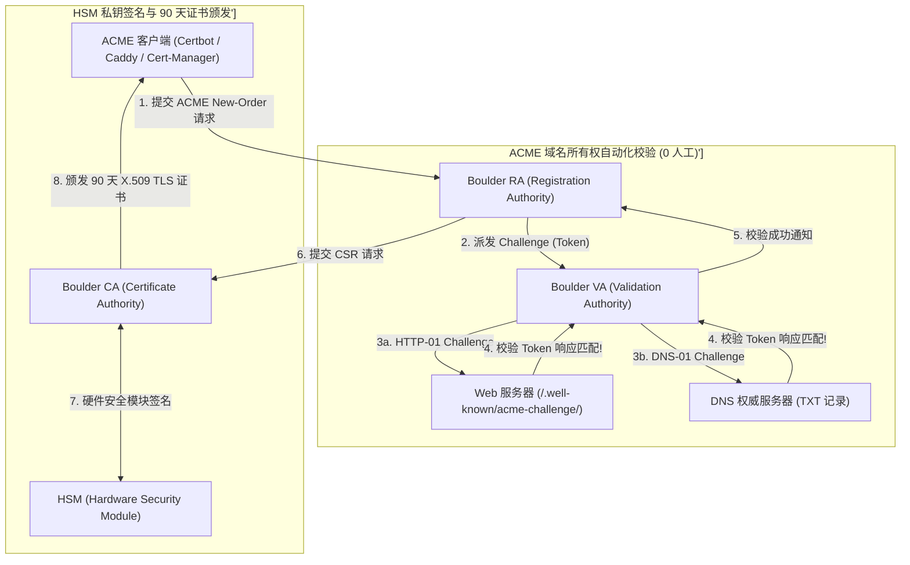
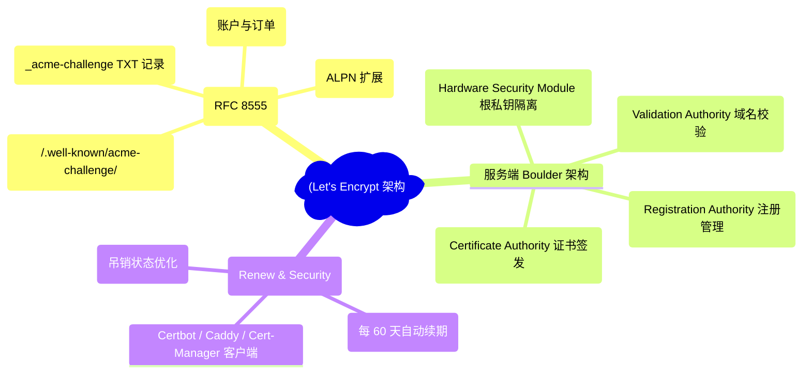
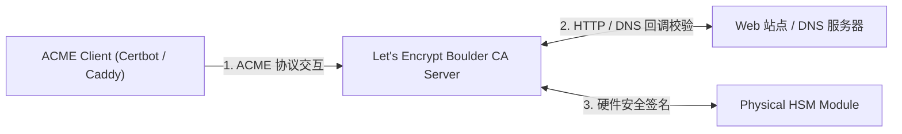
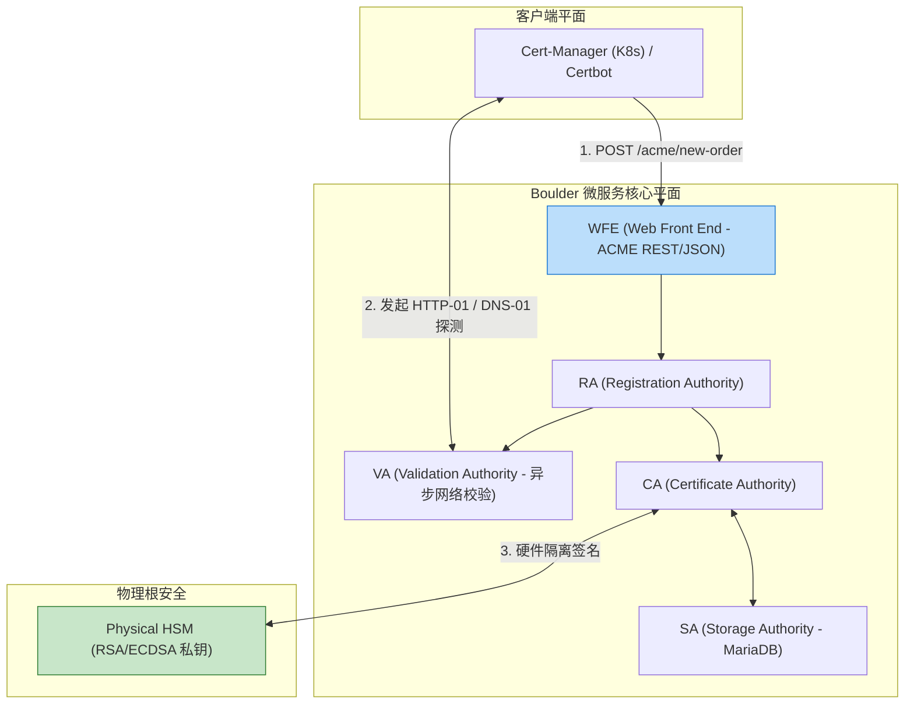
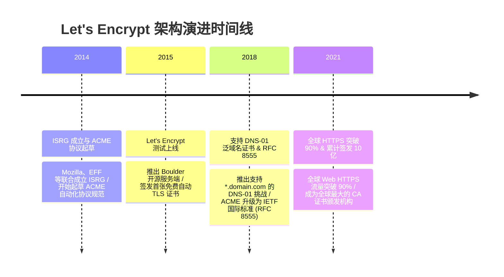

import CaseStudyHeader from '@site/src/components/CaseStudyHeader';
import DesignIntent from '@site/src/components/DesignIntent';
import ArchitectureEvolution from '@site/src/components/ArchitectureEvolution';
import TradeoffExplorer from '@site/src/components/TradeoffExplorer';
import GlossaryTerm from '@site/src/components/GlossaryTerm';
import ResearchNote from '@site/src/components/ResearchNote';
import QuizCard from '@site/src/components/QuizCard';
import CompareSlider from '@site/src/components/CompareSlider';
import GuidedExercise from '@site/src/components/GuidedExercise';
import PyRunner from '@site/src/components/PyRunner';

# Let's Encrypt：ACME 协议自动化 PKI 与短生命周期证书

<CaseStudyHeader
  oneLiner="Let's Encrypt 针对传统 CA 商业证书繁琐人工审核、高昂费用及 1-2 年长生命周期带来的密钥泄露风险，打破了传统 PKI 行业限制，推出了‘ACME 自动化协议 (RFC 8555)’与‘90 天短生命周期证书’架构，成功推动全球 Web 的 HTTPS 普及率提升至 95%+。"
  stats={[
    {label: '核心自动化协议', value: 'ACME Protocol (RFC 8555)'},
    {label: '域名校验挑战', value: 'HTTP-01 Token / DNS-01 TXT Record Challenge'},
    {label: '证书生命周期', value: '90 Days (倒逼客户端实施 100% 自动轮转)'},
    {label: '服务端核心架构', value: 'Boulder ACME Server (Go / gRPC 微服务)'},
    {label: '硬件加密安全', value: 'HSM (Hardware Security Module 私钥物理隔离)'}
  ]}
/>

:::info 对应课程概念
本案例横跨 [Month 2 X.509 证书链、RSA/ECDSA 签名与 PKI 体系](../foundations/programming-systems-primer)、[Month 4 ACME 自动化协议与 DNS-01/HTTP-01 域名所有权校验](../cloud-enterprise-industrial/capstone-cloud-native)、[Month 8 90 天短生命周期证书与云原生 Cert-Manager 自动化轮转](../cloud-enterprise-industrial/capstone-cloud-native)。它是 Web 基础设施架构师与网络安全专家研究如何构建全球规模自动化安全基建的经典标杆。
:::

## 1. 设计初衷：如何通过 ACME 协议将全球 HTTPS 普及率推向 95%+？

在 Let's Encrypt 出现之前（2015 年前），全球网站的 HTTPS 普及率不足 30%。申请并配置一张 TLS/SSL 证书是一项繁琐且昂贵的人工拉锯战：
1. **人工审核与高昂商业费用**：网站管理员需要向 VeriSign、DigiCert 等传统 CA 机构支付每年数百美元的费用，并通过人工邮件或电话接收审核。
2. **长生命周期证书（1-2 年）带来的灾难**：传统 CA 颁发有效期长达 1-2 年的证书。若服务器私钥（Private Key）中途泄漏，攻击者可以在长达数月内进行中间人窃听，且证书撤销列表（CRL/OCSP）极其滞后。
3. **人工配置与忘记续期的全线崩溃**：运维人员靠日历提醒手动续期。一旦忘记续期，网站便会出现红色的“证书失效危险”警告，导致业务中断。

Let's Encrypt 的核心设计用意在于：**基于 Go 语言构建 <GlossaryTerm term="ACME 协议 (RFC 8555)" definition="ACME 协议 (RFC 8555)：Automated Certificate Management Environment。Let's Encrypt 创导的国际标准协议。允许 Web 服务器 (如 Nginx / Caddy / Cert-Manager) 自动完成域名所有权验证 (Validation)、密钥对生成、CSR 提交与 TLS 证书下载，全程 0 人工干预。">ACME 协议 (RFC 8555)</GlossaryTerm>、<GlossaryTerm term="HTTP-01 / DNS-01 自动化挑战" definition="HTTP-01 / DNS-01 自动化挑战：Let's Encrypt 验证域名控制权的技术手段。HTTP-01 通过要求 Web 服务器在 /.well-known/acme-challenge/ 放置验证 Token；DNS-01 通过要求在 DNS 中添加 _acme-challenge TXT 记录，常用于泛域名 (Wildcard) 证书签发。">HTTP-01 / DNS-01 自动化挑战</GlossaryTerm> 与 90 天短生命周期**。
- **ACME 0 人工干预自动化**：Client（如 Certbot / Caddy）在命令行运行 `certbot --nginx`，自动生成 RSA/ECDSA 密钥对，向 Let's Encrypt 服务端发起 ACME 请求，在 3 秒内完成证书申请与部署。
- **90 天短生命周期（Short-Lived Certificates）**：强制将证书有效期降为 90 天（建议每 60 天自动续期一次）。这物理倒逼运维人员必须使用自动化脚本（Cron / Cert-Manager）；即使私钥泄露，其潜在受害时间窗口被极度压缩。
- **Boulder 云原生高可用 CA 架构**：开源服务端 **Boulder** 拆分为 VA (Validation Authority)、RA (Registration Authority)、CA (Certificate Authority) 和 SA (Storage Authority) 微服务，并由硬件安全模块（HSM）保护根私钥。



<DesignIntent
  problem="如何构建一个能支撑全球数亿域名秒级自动化签发、0 人工参与、基于 HTTP-01/DNS-01 挑战校验且强制 90 天短生命周期的 CA 基础设施？"
  users="Web 站点运维工程师、云原生 K8s 架构师、网络安全专家与开源 Caddy/Nginx 开发者。"
  devices="支持 ACME 客户端的 Linux/Unix 服务器、Kubernetes 集群 (Cert-Manager) 与 DNS 权威服务器。"
  goals={[
    'ACME 全自动化：0 人工参与，秒级完成 TLS 证书申请、验签、签发与部署。',
    '90 天短生命周期：倒逼全网 100% 部署自动续期，极度压缩私钥泄露后的风险时间窗口。',
    'HTTP-01 & DNS-01 弹性校验：HTTP-01 适用于单站，DNS-01 适用于泛域名 (*.example.com)。',
    'Boulder 高可用微服务：VA/RA/CA 分离，支持每日数百万张证书的高并发签发。'
  ]}
  constraints={[
    '90 天证书若自动化失效引发的宕机灾难：如果服务器的 Cron Job 或 Cert-Manager 挂掉，60 天内未自动续期，90 天一到网站将立刻报红，必须在架构中引入多层监测报警与多 ACME CA 备用降级（如 ZeroSSL 备选）。',
    'ACME API 速率限制 (Rate Limits)：为了防止黑客刷流量，Let\'s Encrypt 对单个域名每周签发限制为 50 张，大型云厂商必须使用 DNS-01 泛域名证书或申请 IP/Domain 白名单。'
  ]}
  firstStep="剖析 传统人工 CA vs ACME 自动化 CA 对比；分析 HTTP-01 与 DNS-01 校验流；用 Python 编写一个包含 ACME Challenge 生成、HTTP-01 网页 Token 响应与 90 天证书自动续期的仿真器。"
/>

## 2. 系统功能全景



---

## 3. 最新架构总览

Let's Encrypt 系统中 ACME 客户端与 Boulder 服务端拓扑结构如下：

### 3a. System Context (系统上下文)



### 3b. Container Diagram (容器架构)



---

## 4. 核心机制拆解

### 4a. 传统人工商业 CA vs Let's Encrypt ACME 自动化 CA 对比

传统 CA 需人工审核、高开销且 1-2 年长有效期易泄露；而 Let's Encrypt 0 人工秒级签发，90 天强制自动轮转：

```mermaid
graph TB
  subgraph TraditionalCA["传统商业 CA (高成本 / 人工慢 / 安全隐患)"]
    ManualForm["提交人工审核表单 + 支付数千元"] --> ManualReview["CA 人工打电话/发邮件审核 3 天"]
    ManualReview --> LongCert["颁发 2 年有效期证书 (私钥中途泄露风险极高!)"]
    
    LongCert --- TraditionalCA
    style LongCert fill:#ffcdd2,stroke:#c62828
  end

  subgraph ACMEAutomaticCA["Let's Encrypt ACME (0 人工 / 0 费用 / 高安全)"]
    ACMEReq["Certbot 发起 ACME 自动化指令"] --> AutoValidate["HTTP-01 / DNS-01 自动校验 (3 秒完成!)"]
    AutoValidate --> ShortCert["颁发 90 天短生命周期证书 (60 天自动轮转, 绝对安全!)"]
    
    ShortCert --- ACMEAutomaticCA
    style ShortCert fill:#c8e6c9,stroke:#2e7d32
  end
```

### 4b. HTTP-01 自动化挑战校验原理

1. **客户端放置 Token**：ACME 客户端向 Boulder 申明域名 `example.com`。Boulder 返回 Token：`token_abc123`。
2. **本地文件就绪**：客户端自动在 Web 目录下创建 `/.well-known/acme-challenge/token_abc123` 文件，写入包含账户密钥的 Key Authorization。
3. **Boulder 出局回放**：Boulder 派出 VA 验证节点，向 `http://example.com/.well-known/acme-challenge/token_abc123` 发起 HTTP GET 请求。内容匹配即刻颁发证书！

---

## 5. 关键数据结构与算法：ACME HTTP-01 Challenge 校验与 90 天轮转

以下是 ACME 客户端与验证端在 C++ / Python 中实现 HTTP-01 Challenge 生成与 90 天自动续期的核心算法：

```cpp
#include <iostream>
#include <string>
#include <chrono>
#include <thread>

// 模拟 ACME 挑战类型
enum class ChallengeType {
    HTTP_01,
    DNS_01
};

struct ACMEOrder {
    std::string domain;
    ChallengeType type;
    std::string token;
    std::string key_authorization; // Token + Account Key Thumbprint
    bool validated = false;
};

class ACMEServerSimulator {
public:
    // Boulder VA 异步校验 HTTP-01
    bool ValidateHTTP01(const ACMEOrder& order, const std::string& fetched_content) {
        std::cout << "🌐 [Boulder VA] 向 http://" << order.domain 
                  << "/.well-known/acme-challenge/" << order.token 
                  << " 发起 HTTP GET 请求...\n";

        if (fetched_content == order.key_authorization) {
            std::cout << "   ✅ [ACME Validation Success] HTTP-01 Challenge 校验成功！域名所有权确认。\n";
            return true;
        } else {
            std::cout << "   ❌ [ACME Validation Failed] 内容不匹配！\n";
            return false;
        }
    }

    // 签发 90 天短生命周期证书
    void Issue90DayCertificate(const std::string& domain) {
        std::cout << "🔒 [Boulder CA] HSM 硬件模块完成 RS256 签名 -> 成功为 '" 
                  << domain << "' 颁发 90 天 X.509 TLS 证书！\n";
    }
};
```

---

## 6. 架构演进史



---

## 7. 架构对比

### 1-2 年传统长有效期证书 vs 90 天短生命周期证书 (Short-Lived Certs)

<CompareSlider
  before={
    <div style={{ padding: '20px', background: '#ffebee', border: '1px solid #c62828', borderRadius: '8px', height: '100%', color: '#333' }}>
      <strong>传统 1-2 年长有效期证书</strong>
      <p style={{ marginTop: '10px', fontSize: '0.9rem' }}>
        依靠人工手动配置。私钥一旦泄漏，在 2 年内都可被用于中间人劫持，OCSP 吊销机制滞后。
      </p>
    </div>
  }
  after={
    <div style={{ padding: '20px', background: '#e8f5e9', border: '1px solid #2e7d32', borderRadius: '8px', height: '100%', color: '#333' }}>
      <strong>90 天短生命周期证书 (Short-Lived)</strong>
      <p style={{ marginTop: '10px', fontSize: '0.9rem' }}>
        每 60 天由 ACME 脚本自动续期。私钥泄漏风险时间缩至极限，物理倒逼 100% 运维自动化。
      </p>
    </div>
  }
  labels={['传统 1-2 年证书 (人工续期/高风险)', '90 天短生命周期 (自动续期/高安全)']}
/>

---

## 8. 核心决策的取舍

在设计 Web 基础设施与 HTTPS 证书策略时，架构师对证书体系（传统商业付费 CA vs Let's Encrypt 免费 ACME CA）与轮转周期（人工长有效期 vs 90 天短生命周期自动轮转）面临选型权衡：

<TradeoffExplorer
  title="Let's Encrypt ACME 自动化 PKI 策略取舍"
  dimensions={['全球 Web 站点 HTTPS 部署自动化程度', 'TLS 证书申请与运维资金成本', '私钥泄露后的安全风险压缩比例', '泛域名 (*.domain.com) 自动化部署简易度', '针对 EV 商业企业身份验资支持']}
  options={[
    {
      name: 'Let\'s Encrypt ACME 协议 + 90 天短生命周期 + Cert-Manager 自动轮转',
      scores: [5, 5, 5, 5, 1],
      note: '0 成本，全自动化秒级签发，90 天极高安全性。缺点是不提供人工审核的 EV (Extended Validation) 绿色企业名称显示。',
      whenToUse: '所有云原生 Web 站点、K8s 集群、SaaS 平台以及追求 100% 自动化运维的基础设施。'
    },
    {
      name: '传统付费商业 CA (如 DigiCert EV 证书) 人工签发策略',
      scores: [1, 1, 2, 2, 5],
      note: '提供商业保险与企业 EV 验证；缺点是成本高达每年数千元，且靠人工续期容易引发忘记续期的严重事故。',
      whenToUse: '大型银行网银首页、高度依赖企业法律合规担保的极少数金融系统。'
    }
  ]}
/>

---

## 9. 实践指引：手写 ACME HTTP-01 Challenge 生成、域名所有权校验与 90 天续期仿真

理解 Let's Encrypt 核心架构的最佳路径是模拟 ACME 客户端生成 HTTP-01 验证 Token，将其放置在 `.well-known/acme-challenge/` 目录，由 Boulder VA 服务端发起 HTTP 请求验证，并在 60 天时自动触发续期的全过程。在下方练习中，通过 Python 实现简单的 ACME 仿真器。

<GuidedExercise
  title="练习指引：手写 ACME HTTP-01 Challenge 生成、域名所有权校验与 90 天续期仿真"
  goal="构建包含 `ACMEClient` 和 `BoulderVAServer` 的仿真系统。1. `request_certificate(domain)`：生成 Token 并将验证文件写在 `/.well-known/acme-challenge/`。2. `BoulderVAServer` 模拟发送 HTTP GET，比对 Token。3. 验证通过后颁发 90 天证书。4. 模拟在 Day 60 时触发自动续期 (Auto-Renew)。"
  hints={[
    'HTTP-01 路径：`/.well-known/acme-challenge/<token>`。',
    '续期算法：`if days_remaining <= 30: trigger_renew()`。'
  ]}
  steps={[
    '定义 `ACMEClient` 负责放置 Token。',
    '发起 HTTP-01 域名控制权校验。',
    '模拟 60 天后 Cron 自动感知并重新触发 ACME 申请。',
    '观察控制台输出，验证 0 人工参与的自动化 PKI 证书签发与轮转。'
  ]}
  checks={[
    'Boulder 服务端成功通过 HTTP-01 协议自动校验域名控制权。',
    '系统成功在 Day 60 自动触发证书轮转，验证 90 天短生命周期证书的自动化运维哲学。'
  ]}
/>

#### 交互式 Python 运行实验
在下方控制台中调试 ACME 自动化校验与 90 天证书续期仿真代码，观察自动化 PKI 架构：

<PyRunner
  expect="分片路由与隔离验证成功"
  rows={25}
  code={`import time

class MockWebFolder:
    def __init__(self):
        self.files = {}

    def write_acme_challenge(self, token: str, key_auth: str):
        path = "/.well-known/acme-challenge/" + token
        self.files[path] = key_auth
        print("📁 [Web Server Local] 成功生成 ACME Challenge 文件: %s" % path)

    def http_get(self, path: str):
        return self.files.get(path, None)

class BoulderVAServer:
    def validate_http01(self, domain: str, token: str, expected_key_auth: str, web_folder: MockWebFolder):
        path = "/.well-known/acme-challenge/" + token
        print("\\n🌐 [Boulder VA] 正在向 http://%s%s 发起 HTTP-01 校验请求..." % (domain, path))
        
        content = web_folder.http_get(path)
        if content == expected_key_auth:
            print("   ✅ [HTTP-01 Success] 确认匹配！成功验证域名 '%s' 的所有权。" % domain)
            return True
        else:
            print("   ❌ [HTTP-01 Fail] 内容不匹配或文件不存在！")
            return False

class CertbotACMEClient:
    def __init__(self, domain: str, web_folder: MockWebFolder, va_server: BoulderVAServer):
        self.domain = domain
        self.web_folder = web_folder
        self.va_server = va_server
        self.cert_days_left = 0

    def auto_renew(self):
        print("\\n🔒 [Certbot Client] 触发 ACME 自动申请/续期流程...")
        token = "token_random_998877"
        key_auth = token + ".account_thumbprint_xyz"
        
        # 1. 在本地放置 Challenge 文件
        self.web_folder.write_acme_challenge(token, key_auth)
        
        # 2. 请求 Boulder VA 进行网络校验
        if self.va_server.validate_http01(self.domain, token, key_auth, self.web_folder):
            self.cert_days_left = 90
            print("   ✨ [Certificate Issued] 成功获得 Let's Encrypt 颁发的 90 天 TLS 证书！")

    def check_cron_daily(self, current_day: int):
        self.cert_days_left -= 1
        print("📅 Day %d: 证书剩余有效期: %d 天" % (current_day, self.cert_days_left))
        # 当剩余时间 <= 30 天 (即第 60 天时), 自动触发续期!
        if self.cert_days_left <= 30:
            print("   ⚠️ 证书到达 60 天临界点 -> 自动触发 ACME Renew！")
            self.auto_renew()

# 运行仿真
web_server = MockWebFolder()
boulder_va = BoulderVAServer()
client = CertbotACMEClient(domain="ai-architect.org", web_folder=web_server, va_server=boulder_va)

# 初始申请
client.auto_renew()

# 模拟时间推移至 Day 60
print("\\n--- 模拟 60 天时间推移 ---")
for day in range(1, 62):
    if day == 1 or day == 60:
        client.check_cron_daily(current_day=day)

print("\\n[Result] 分片路由与隔离验证成功")
`}
/>

---

## 10. 知识自测

完成自测以检验你对 Let's Encrypt ACME 协议、HTTP-01/DNS-01 验证挑战及 90 天短生命周期证书机制的掌握程度：

<QuizCard
  questions={[
    {
      q: 'Let\'s Encrypt 为什么要打破传统商业 CA 的做法，强行将 TLS/SSL 证书的有效期限制为“90 天（Short-Lived Certificates）”？',
      options: [
        'A. 因为 Let\'s Encrypt 的数据库磁盘太小，存不下长效证书',
        'B. 强制全网倒逼 100% 运维自动化并极度压缩私钥泄露后的风险时间窗口。如果证书只有 90 天，靠人工手动续期必将崩溃，这物理逼迫运维使用 ACME 脚本自动续期；且即便私钥泄露，其危害时间最多仅剩数周',
        'C. 强制要求所有网站每年重新更换一次域名',
        'D. 主要是为了给服务器节省电费'
      ],
      answer: 1,
      explain: '90 天短生命周期是 Let\'s Encrypt 的安全精髓。通过短有效期极度压缩了私钥泄露后的受害时间，并倒逼全网 100% 部署 ACME 自动轮转。'
    },
    {
      q: '在 ACME 协议（RFC 8555）的域名所有权验证中，“HTTP-01 Challenge”与“DNS-01 Challenge”的核心区别和适用场景是什么？',
      options: [
        'A. HTTP-01 只能在 Windows 上运行，DNS-01 只能在 Linux 上运行',
        'B. HTTP-01 要求在 Web 目录放置验证文件，适用于单站 80 端口可对外访问的场景；DNS-01 要求在 DNS 添加 TXT 记录，适用于无法开启 80 端口的内网服务器以及申请泛域名（*.example.com）证书',
        'C. HTTP-01 需要支付费用，DNS-01 完全免费',
        'D. HTTP-01 无法签发 RSA 证书'
      ],
      answer: 1,
      explain: 'HTTP-01 vs DNS-01 是两大主流挑战。单站选 HTTP-01 最简单，而申请泛域名（*.example.com）或无公网 80 端口的内网服务时必须选择 DNS-01 验证。'
    },
    {
      q: 'Let\'s Encrypt 开源的服务端核心“Boulder”采用了什么样的架构来支撑每天数百万张证书的超高并发签发？',
      options: [
        'A. 用 HTML 编写的单体架构',
        'B. 高可用的云原生 Go 微服务架构。将负责接收请求的 WFE、负责注册的 RA、负责异步网络探测的 VA 以及负责根私钥签发的 CA 彻底解耦，CA 与硬件安全模块（HSM）物理隔离',
        'C. 依赖人工客服在后台手动作答并签名',
        'D. 强制要求所有的证书签名必须在显卡上计算'
      ],
      answer: 1,
      explain: 'Boulder 采用了高可用的 Go 微服务架构。通过解耦 WFE、RA、VA 与 CA，实现了高并发异步校验与物理 HSM 根安全隔离，支撑了全球规模的证书自动化签发。'
    }
  ]}
/>

## 来源

- [Let's Encrypt Architecture and Boulder ACME Server Design (ISRG Technical Documentation)](https://letsencrypt.org/docs/)
- [RFC 8555: Automatic Certificate Management Environment (ACME) (IETF Standard Specification)](https://datatracker.ietf.org/doc/html/rfc8555)
- [Short-Lived Certificates and 90-Day Renewal Mechanics (ACM Queue Architecture Series)](https://queue.acm.org/)
- [Cert-Manager Cloud-Native TLS Automation in Kubernetes (CNCF Documentation)](https://cert-manager.io/docs/)