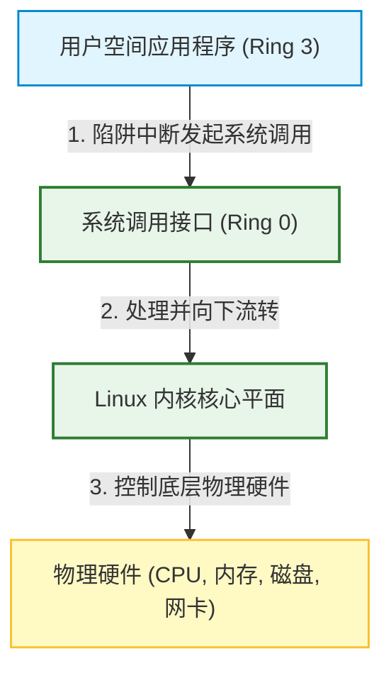
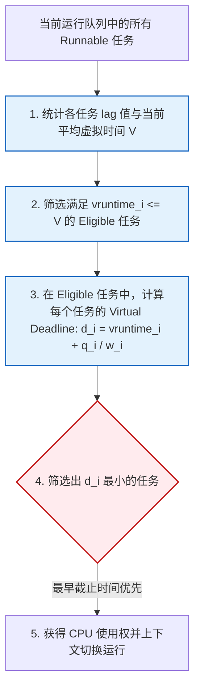
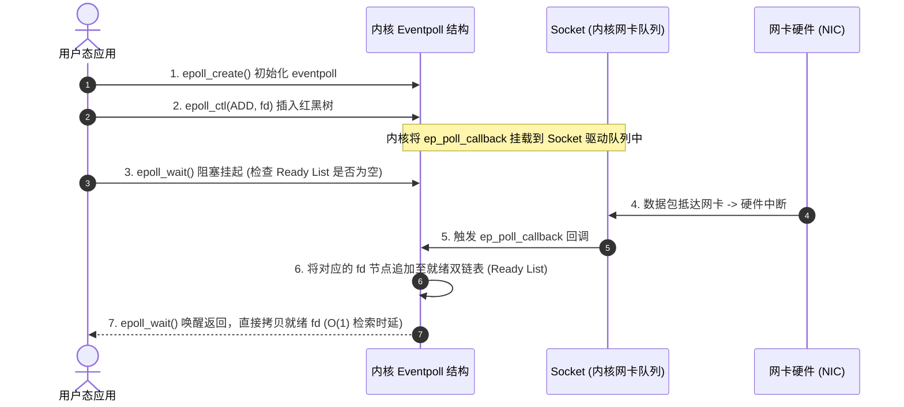

import CaseStudyHeader from '@site/src/components/CaseStudyHeader';
import DesignIntent from '@site/src/components/DesignIntent';
import EvolutionTimeline from '@site/src/components/EvolutionTimeline';
import CompareSlider from '@site/src/components/CompareSlider';
import TradeoffExplorer from '@site/src/components/TradeoffExplorer';
import GlossaryTerm from '@site/src/components/GlossaryTerm';
import ResearchNote from '@site/src/components/ResearchNote';
import GuidedExercise from '@site/src/components/GuidedExercise';
import QuizCard from '@site/src/components/QuizCard';
import MindMap from '@site/src/components/MindMap';

# Linux 内核：宏内核架构、进程调度 CFS/EEVDF、虚拟文件系统与 epoll 高发并发 I/O 机制

<CaseStudyHeader
  oneLiner="Linux 内核作为现代云原生服务与边缘计算的基石，代表了单体宏内核（Monolithic Kernel）设计的巅峰。它采用模块化动态加载机制平衡了高性能与可扩展性，通过『虚拟文件系统（VFS）』屏蔽了异构存储介质，调度系统完成了从『基于虚拟运行时间的 CFS』向『带时延保证的 EEVDF』演进，并利用基于红黑树与双向就绪链表的 epoll 实现了 O(1) 的大规模异步高并发 I/O 驱动。"
  stats={[
    {label: '内核架构', value: '单体宏内核 (Modular Monolithic)'},
    {label: 'CPU 调度器', value: 'CFS 演进至 EEVDF (Linux 6.6+)'},
    {label: 'I/O 多路复用', value: 'epoll (红黑树 + 双向就绪链表)'},
    {label: '文件系统抽象', value: 'VFS (Superblock, Inode, Dentry)'},
    {label: '上下文切换开销', value: '纳秒级 (取决于 CPU/TLB 刷新)'},
    {label: '并发承载力', value: '数十万并发网络 Socket 描述符'}
  ]}
/>

:::info 对应课程概念
本案例融合了以下课程核心概念：
*   **高并发网络 I/O 吞吐模型（Month 3/12）**：深度解剖 I/O 多路复用机制，epoll 与传统 select/poll 在大并发下的性能分水岭。
*   **公平资源分配与无锁化算法（Month 5）**：如何利用红黑树与虚拟时钟分配 CPU 算力资源，并减少内核态锁竞争。
*   **内核-用户态边界与虚拟化（Month 8/12）**：系统调用（System Call）的上下文切换过程、内存态隔离（Ring 0 vs. Ring 3）及缺页中断开销。
:::

---

## 1. 设计初衷：追求极致性能的 Unix 单体演进

操作系统的核心任务是管理硬件资源（CPU、内存、磁盘、网卡），并为用户态程序提供安全高效的抽象。在内核设计上，学术界与工业界曾引发著名的“微内核与宏内核之争”：
1.  **宏内核（Monolithic Kernel）的极致效率**：Linux 选择了宏内核路线。进程调度、内存管理、虚拟文件系统、网络协议栈及所有的设备驱动均运行在相同的**内核特权空间（Ring 0）**。这避免了微内核（如早期的 Mach）在各个独立服务之间进行高频进程间通信（IPC）的内存拷贝与上下文切换开销，实现了极致的系统调用性能。
2.  **CFS 的公平调度与 EEVDF 的低延迟控制**：
    *   **CFS（完全公平调度器）**：将任务调度抽象为平衡红黑树，根据虚拟执行时间（vruntime）决定优先级，消除了老旧 O(1) 调度器的启发式硬编码规则。
    *   **EEVDF（最早符合条件虚拟截止时间优先）**：在 Linux 6.6 合并，用于替换 CFS。它额外引入了 lag（延迟差值）和截止时间（Deadline）计算，保证了交互式/短周期任务（如音频、桌面渲染、高频网络包响应）在获得公平 CPU 份额的同时，能被以极短时延优先调度。
3.  **大并发 I/O 屏障（C10K 难题）**：传统的 `select` 与 `poll` 在监听 Socket 时，每次调用都需要将 FD 列表从用户态拷贝到内核态，且在内核中必须进行 $O(N)$ 的遍历。当并发连接达到数万时，CPU 将全被轮询打满。`epoll` 通过在内核维护红黑树并关联网络硬件中断的回调链表，将检索时间缩短至 $O(1)$，消除了系统调用的无效拷贝。

<DesignIntent
  problem="如何在保持单体内核极高性能的同时，提供对百种物理设备的高弹性模块化动态挂载，保障数十个 CPU 核心对数十万并发进程的公平且低延迟调度，并攻克高并发 Socket 事件检索的 CPU 过载关卡。"
  users="全球运行 Linux 的服务器集群、嵌入式边缘设备、Android 移动终端、以及云原生微服务平台。"
  devices="支持从单核 ARM 芯片到包含数千 CPU 核心、数 TB 内存的超大规模 NUMA 服务器。"
  goals={[
    '系统调用纳秒级响应：在 Ring 3 与 Ring 0 上下文切换时实现尽可能小的指令与寄存器拷贝开销',
    'EEVDF 延迟上限控制：通过 Deadline 算法将高优任务的实时调度时延限制在毫秒级内',
    'VFS 磁盘访问零感知：不论底层是 EXT4、XFS 还是网络文件系统 NFS，提供完全统一的文件系统抽象层与缓存机制',
    'epoll 万级网络处理：消灭每次轮询对 FD 队列的重复拷贝，使事件响应速度与并发连接总数 N 解耦'
  ]}
  constraints={[
    '单体内核故障隔离差：由于内核态共享地址空间，任一模块（如三方驱动）发生内存段错误都会导致 Kernel Panic 宕机',
    '锁竞争与 NUMA 限制：多核下由于自旋锁（Spinlock）和内存一致性开销，调度红黑树频繁调整会遇到锁瓶颈',
    'TLB 刷新损耗：每次从用户态陷入内核态，如果发生进程页表切换，TLB 缓存失效会引入显著的内存寻址开销'
  ]}
  firstStep="设计系统调用接口（System Call Interface）；基于虚拟运行时间红黑树与 Eligible/Deadline 条件构建调度核心；在内核分配 dentry 与 inode 缓存；在 epoll 底层设计基于中断处理的 callback 就绪队列机制。"
/>

---

## 2. 知识全景脑图

<MindMap
  root={{
    label: 'Linux 内核核心架构',
    children: [
      {
        label: '宏内核基础 (Base)',
        children: [
          { label: 'Ring 0 / Ring 3 空间划分' },
          { label: '系统调用陷阱 (sys_call)' },
          { label: '动态内核模块 (LKM)' }
        ]
      },
      {
        label: 'CPU 调度 (Scheduler)',
        children: [
          { label: 'CFS 虚拟时间红黑树' },
          { label: 'EEVDF lag 延迟校准' },
          { label: 'Eligible 判定与截止时间' }
        ]
      },
      {
        label: '虚拟文件系统 (VFS)',
        children: [
          { label: 'Superblock 挂载元数据' },
          { label: 'Inode 索引节点与 Dentry 缓存' },
          { label: 'Page Cache 页高速缓存' }
        ]
      },
      {
        label: '网络/IO (Multiplexing)',
        children: [
          { label: 'epoll_create 红黑树初始化' },
          { label: 'epoll_ctl 监听与软中断 callback' },
          { label: 'epoll_wait 双向就绪链表读取' }
        ]
      }
    ]
  }}
/>

---

## 3. 系统架构总览 (C4 Model)

以下是 Linux 内核三平面协同与空间隔离 C4 Context 与 Container 拓扑。

### 3a. System Context (系统上下文图)



### 3b. Container Diagram (容器结构图)

```mermaid
graph TB
    classDef client fill:#e1f5fe,stroke:#0288d1,stroke-width:2px;
    classDef serve fill:#e8f5e9,stroke:#2e7d32,stroke-width:1.5px;
    classDef physical fill:#ffebee,stroke:#c62828,stroke-width:1.5px;

    subgraph UserSpace [用户空间 (Ring 3 / 非特权模式)]
        AppProcess["应用进程 (如 Nginx, MySQL)"]:::client
        Glibc["C 标准库 (glibc)"]:::client
        
        AppProcess --> Glibc
    end

    Glibc -->|触发 0x80 或 syscall 指令| SCI_Interface["System Call Interface (SCI)"]:::serve

    subgraph KernelSpaceMonolith [Linux 内核空间 (Ring 0 / 宏内核特权内存域)]
        SCI_Interface --> Scheduler["EEVDF CPU 调度器<br/>(分配 CPU 时间片)"]:::serve
        SCI_Interface --> VFS["虚拟文件系统 (VFS)<br/>(管理 Superblock/Inode)"]:::serve
        SCI_Interface --> NetworkStack["网络子系统与 epoll<br/>(基于网卡中断就绪队列)"]:::serve
        
        Scheduler --> MemMan["MMU 内存管理与虚拟地址映射"]:::serve
    end

    VFS -->|通过 Block IO| DiskPhys["SSD / 物理硬盘"]:::physical
    NetworkStack -->|通过网卡驱动| NicPhys["NIC / 物理网卡"]:::physical
```

---

## 4. 核心机制拆解

### 4a. 进程调度演进：从 CFS 到 EEVDF

CPU 调度器的目标是让多个任务感觉自己在独占 CPU：
*   **CFS 的设计理念**：CFS 引入了虚拟执行时间（vruntime）。每次调度时，CFS 从红黑树的左下角选出当前 `vruntime` 最小的任务运行。任务运行时，其 `vruntime` 随着物理运行时间增加而增大，并在重新排入红黑树时被移向右侧。CFS 实现了极致的“公平份额”，但它无法处理“在小周期内，任务何时能获得响应”的延迟上限问题。
*   **EEVDF（Earliest Eligible Virtual Deadline First）机制**：
    *   **Eligible（合规/有资格）**：如果一个任务的虚拟运行时 $vruntime_i \le V$（$V$ 为所有活动任务的平均虚拟运行时），说明该任务之前被分配的 CPU 时间片偏少（处于 lag > 0 的状态），当前有资格参与调度。
    *   **Virtual Deadline（虚拟截止时间）**：在所有“有资格（Eligible）”的任务中，EEVDF 选择虚拟截止时间 $d_i$ 最早的任务优先运行。虚拟截止时间越早，代表该任务越迫切需要被处理。这在数学上提供了确定的延迟上限控制。



---

### 4b. 虚拟文件系统 (VFS) 架构

VFS 允许用户进程使用统一的系统调用（如 `read()`, `write()`）访问全然不同的物理介质：
1.  **四级核心对象**：
    *   **Superblock（超级块）**：描述整个挂载的文件系统，包括块大小、文件系统类型及元数据指针。
    *   **Inode（索引节点）**：代表物理磁盘上的唯一文件，存储文件的大小、权限、物理块索引。Inode 不保存文件名。
    *   **Dentry（目录项）**：将文件名与 Inode 进行绑定。由于从磁盘解析路径（如 `/usr/bin/python`）非常缓慢，内核在内存中维护了一个 Dentry 缓存（dentry cache），加速二次路径查找。
    *   **File（文件对象）**：代表进程已打开的文件实例。关联了文件偏移量、打开标志及指向 Dentry 的指针。
2.  **Page Cache（页高速缓存）**：所有的读写默认通过 Page Cache 进行。当应用发起 `read` 时，内核先在 Page Cache 中查找，若未命中则发起底层块 I/O 读取磁盘并填充 Cache；当发起 `write` 时，数据写入 Cache 页即返回，由内核线程 `pdflush` 异步刷盘。


---

### 4c. epoll 异步事件驱动 I/O 机制

epoll 用以彻底解决并发网络编程中的轮询效率问题：
1.  **epoll_create**：在内核分配一个 `eventpoll` 结构。该结构包含一棵**红黑树（Interest List）**和一个**双向就绪链表（Ready List）**。
2.  **epoll_ctl**：将要监听的 Socket 文件描述符以红黑树节点 `struct epitem` 形式插入到红黑树中。这使得添加、删除、修改监听 FD 的复杂度保持在 $O(\log N)$。同时，内核向该 Socket 的网卡等待队列中挂载一个回调函数 `ep_poll_callback`。
3.  **中断驱动与就绪链表**：当网卡接收到数据包时，触发硬件 CPU 中断，系统调用 Socket 的等待队列回调，执行 `ep_poll_callback`。此函数将该 Socket 关联的 `epitem` 物理追加到 `eventpoll` 的**就绪链表（Ready List）**中。
4.  **epoll_wait**：用户态线程调用 `epoll_wait` 时，内核不需要扫描任何红黑树，仅仅检查就绪链表是否为空。如果不为空，则将就绪链表中的数据拷贝到用户态传入的数组中，并在 $O(1)$ 时间内返回，消除了无意义的无效 FD 轮询。



<ResearchNote
  title="CFS 与 EEVDF 调度理论的突破性演进"
  source="Peter Hoon (1995), Earliest Eligible Virtual Deadline First Scheduling Algorithm"
  href="https://learn.microsoft.com/en-us/research/publication/earliest-eligible-virtual-deadline-first-scheduling-algorithm/"
  insight="Peter Hoon 首次提出了 EEVDF 调度理论。传统的 CFS（或类似的公平调度算法）虽然在宏观时间尺度上做到了绝对公平，但因其只在乎“任务是否拿到了足够时间”，缺乏对微观任务抢占时间响应的刚性约束。EEVDF 通过引入 Lag（任务实拿时间与应拿时间的差额值）和虚拟截止时间，不仅消除了传统调度器的大量启发式凑数规则，而且证明了可以同时实现『比例公平分配』与『实时时延保障』。"
  application="架构启示：设计分布式系统或单机内核时，**“公平份额”与“延迟控制”往往存在互斥**。例如在高并发网关中，如果只对客户端请求做加权轮询，某些大文件下载会推迟短交互请求的排队响应。引入 EEVDF 的 Lag + Deadline 隔离思想，能在不损害整体公平性的前提下，为关键交互路径提供低延迟保障。这也契合了课程 Month 5 与 Month 12 大规模微服务调度设计。"
/>

---

## 5. 关键数据结构与算法

### 5a. EEVDF 调度 Deadline 算法

在 EEVDF 中，当调度器需要选出下一个运行的进程时，它遵循以下两步走算法：

1.  **Eligible 筛选条件**：
    活动进程 $i$ 的虚拟运行时 $vruntime_i$ 必须小于当前队列的全局虚拟运行时 $V$：
    $$vruntime_i \le V$$
    这保证了进程 $i$ 至少有资格运行（没有超前占满算力）。

2.  **Deadline 计算公式**：
    在所有符合 Eligible 条件的进程中，选择虚拟截止时间 $d_i$ 最小的任务：
    $$d_i = vruntime_i + q_i / w_i$$
    *   $vruntime_i$: 进程 $i$ 的当前虚拟运行时。
    *   $q_i$: 进程 $i$ 声明的单次调度时间量子（Time Quantum，通常根据 nice 值折算）。
    *   $w_i$: 进程 $i$ 的权重（Priority Weight）。

---

### 5b. epoll 核心结构节点 `struct epitem`

内核中，每个被 `epoll` 监听的文件描述符都对应一个 `epitem` 结构，它被同时挂载在红黑树和就绪双链表中：

```c
struct epitem {
    struct rb_node rbn;          /* 红黑树节点 (用于快速查找/挂载监听 FD) */
    struct list_head rdllink;    /* 双向链表节点 (用于挂载到 eventpoll 的 Ready List) */
    struct epoll_filefd ffd;     /* 监听的文件描述符及 file 结构指针 */
    struct eventpoll *ep;        /* 指向所属的 eventpoll 主结构 */
    struct epoll_event event;    /* 用户注册的监听事件 (EPOLLIN/EPOLLOUT 等) */
};
```

当网卡中断发生时，内核正是通过 `rdllink` 将该 `epitem` 链入 `eventpoll` 的就绪头结点中，实现高效率状态分发。

---

## 6. 架构演进史

Linux 内核核心子系统的演化过程，是开源协同解决高并发、多核计算瓶颈的奋斗史：

<EvolutionTimeline
  events={[
    {
      year: '1991',
      title: 'Linux 0.01 宏内核起步',
      why: '林纳斯·托瓦兹（Linus Torvalds）为了在 Intel 386 上运行 Unix 类系统，使用单体架构编写了极简的宏内核，任务调度仅支持 64 个固定进程槽位轮询。',
      change: '推出最早的 Ring 3/Ring 0 特权切换，不支持动态加载模块，仅支持简单的进程表调度。'
    },
    {
      year: '2007',
      title: 'CFS 红黑树调度器诞生 (2.6.23)',
      why: '多核多任务服务器成为主流，旧的 O(1) 调度器内部使用了大量的启发式规则与 Magic Number 判定，导致交互式桌面程序与高频网络进程常被误判为非交互，响应卡顿明显。',
      change: '引入完全公平调度器 (CFS)，废除多级优先级队列，全面改用基于虚拟运行时间 (vruntime) 排序的红黑树结构。'
    },
    {
      year: '2023',
      title: 'EEVDF 调度器与 Linux 6.6 合并',
      why: 'CFS 在多核、游戏、实时音频及高频微服务网关等高吞吐时延敏感型场景下，由于其“只管长期公平，不管短期延迟”的缺陷，使得任务经常被晚调度几毫秒，造成音频爆音或网络请求尾部延迟。',
      change: '合入 EEVDF 调度器，引入 Lag 与虚拟截止时间 (Deadline) 优先级分配，在保障算力公平前提下实现了极优的微观调度响应延迟。'
    }
  ]}
/>

---

## 7. 架构对比：宏内核 (Linux) vs. 微内核 (seL4 / Mach)

<CompareSlider
  before={
    <div style={{ padding: '20px', background: '#ffebee', border: '1px solid #c62828', borderRadius: '8px', height: '100%', color: '#333' }}>
      <strong>宏内核架构 (Monolithic Kernel)</strong>
      <p style={{ marginTop: '10px', fontSize: '0.9rem' }}>所有系统服务（VFS、网络栈、硬件驱动）全跑在 Ring 0 特权地址空间。系统调用调用直接通过函数指针寻址，零跨空间内存拷贝，性能无敌。缺点是存在“单点崩溃风险”，任何一个有 Bug 的内核态驱动都可以引发整机 Kernel Panic 挂掉。</p>
    </div>
  }
  after={
    <div style={{ padding: '20px', background: '#e8f5e9', border: '1px solid #2e7d32', borderRadius: '8px', height: '100%', color: '#333' }}>
      <strong>微内核架构 (Microkernel)</strong>
      <p style={{ marginTop: '10px', fontSize: '0.9rem' }}>Ring 0 仅保留最核心的进程调度、虚拟内存和基础中断。文件系统、网卡驱动均作为独立的 Ring 3 用户态进程运行。如果驱动崩溃，内核直接重启该驱动即可，安全性极高。但缺点是每次文件读写、发包都需要经历数次跨地址空间的 IPC 拷贝与切换，性能损耗很大。</p>
    </div>
  }
  labels={['宏内核 (高性能第一线)', '微内核 (高安全物理隔离)']}
/>

---

## 8. 权衡：内核层核心技术的关键权衡

Linux 在调度策略和 I/O 模型上经历了多次痛苦的系统级抉择：

<TradeoffExplorer
  title="Linux 内核调度与多路复用设计权衡"
  dimensions={['高并发 IO 吞吐量', '任务调度微观低延迟', '系统服务安全性隔离', '内存和 CPU 额外开销', '代码维护与驱动开发难度']}
  options={[
    {
      name: '宏内核 + epoll 硬件中断就绪流',
      scores: [5, 4, 2, 5, 2],
      note: '所有的 Socket 状态保存在 Ring 0 eventpoll 结构中，网卡中断通过回调函数直接推送到 Ready List。这提供了极高的高并发 I/O 吞吐和极低的数据拷贝损耗。代价是需要承受内核态进程直接读写内存的安全隐患，且网络协议栈代码开发难度极大。',
      whenToUse: '高并发、高网络吞吐的云基础设施与高频网络代理服务。'
    },
    {
      name: '微内核架构 (L4 系 / 鸿蒙内核等)',
      scores: [3, 3, 5, 2, 3],
      note: '网络栈与物理网卡驱动运行在 Ring 3 沙箱中，即使网卡发生内核段错误，也不会影响操作系统的生命周期。但在大并发网络吞吐下，由于 Ring 3 进程间高频进行共享内存切换，吞吐量比宏内核低 15%-30%。',
      whenToUse: '对安全性要求严苛的车载中控、医疗监控硬件、智能网联终端设备。'
    },
    {
      name: '传统 select / poll 多路复用',
      scores: [2, 1, 4, 4, 5],
      note: '每次轮询将全部 FD 数组拷贝到内核，内核通过 $O(N)$ 遍历筛选就绪事件。对于连接数少（<1000）的轻量系统，开发及其简单，不需要红黑树等复杂结构。但在高连接数下会带来巨大的系统级性能衰退。',
      whenToUse: '并发连接数极低、系统不需要红黑树等复杂结构的早旧嵌入式设备。'
    }
  ]}
/>

---

## 9. 如果是你来设计：用 Python 模拟完全公平调度器 (CFS)

### 场景设想
在 Linux 调度器 CFS 的核心部分，系统利用红黑树对当前就绪的所有任务按 `vruntime` 排序。
为了让大家直观地体验虚拟时钟推进与公平调度的关系：
*   假设当前有 3 个就绪任务 `Task A` (权重 $w=1.0$), `Task B` (权重 $w=2.0$, nice值更低，优先级更高), `Task C` (权重 $w=0.5$, nice值高，优先级低)。
*   系统分配一个绝对的时间片（Time slice，如 `10` 毫秒），每次运行当前 `vruntime` 最小的任务。
*   任务运行后，更新其虚拟运行时：
    $$vruntime_new = vruntime_old + PhysicalTime / w$$

请你用 Python 编写一段核心模拟器，重现这个公平调度的虚拟时间变化与抢占流程。

<GuidedExercise
  title="基于 Python 的 CFS 虚拟时间调度模拟与抢占校验"
  goal="设计任务数据项结构，使用堆（Heap/PriorityQueue）模拟红黑树的最小 vruntime 检索，并运行多轮调度，验证权重大的任务获得了更多的物理运行时间，且大家的 vruntime 始终能保持“趋同”。"
  steps={[
    '步骤 1: 设计 Task 数据类。包含任务名 `name`、权重 `weight`、物理已运行时间 `cpu_time` 以及 `vruntime`（初始值为 0.0）。',
    '步骤 2: 建立就绪队列 Heap。使用 Python 的 `heapq` 模块管理就绪任务，每次通过 `heappop` 弹出 `vruntime` 最小的任务。',
    '步骤 3: 模拟运行推进。设定固定物理调度片 `delta_p = 5` ms。取出当前 vruntime 最小的任务运行一个 `delta_p`。',
    '步骤 4: 更新 vruntime。计算新增虚拟运行时 `delta_v = delta_p / weight`。更新该任务的 vruntime，将其重新 `heappush` 放入堆中。',
    '步骤 5: 运行 10 轮循环。打印每一轮执行的任务名称、物理时间与各进程的 vruntime 状态。最终验证各任务拿到的总物理时间与其权重成正比关系。'
  ]}
  checks={[
    '确认每次调度被选中的都是 vruntime 最小的那个任务 (CFS 核心逻辑)',
    '验证运行结束后，权重较大的 Task B 获得的物理运行时间多于 A，A 多于 C',
    '确认各个任务的 vruntime 在数轮交替后，数据线非常接近，达成完全公平收敛'
  ]}
/>

---

## 10. 知识自测

<QuizCard
  questions={[
    {
      q: 'Linux 操作系统在 6.6 版本合入 EEVDF 调度器以取代 CFS，其核心要解决的问题是什么？',
      options: [
        'A. 为了支持大于 2TB 的磁盘分区格式',
        'B. CFS 只关注任务的长周期算力公平性，缺乏微观的时延上限约束。在音频播放、高频微服务网关等对实时响应要求高的场景中，容易发生任务晚调度几毫秒而引起的爆音或尾部延迟。EEVDF 通过引入虚拟截止时间解决了这问题',
        'C. 强制要求所有进程必须用 2D 仿射变换矩阵重新计算物理坐标',
        'D. 杜绝了 root 用户在 Ring 0 特权级下被恶意越狱的可能性'
      ],
      answer: 1,
      explain: 'CFS 是典型的“份额驱动”调度器。尽管长期公平，但短周期的交互式任务在需要运行的一瞬间，其 vruntime 可能并不比后台跑了很久的批处理任务小，从而无法立即抢占，产生微秒/毫秒级时延。EEVDF 依靠 Eligible 准入和 Deadline 排序，保障了时延上限。'
    },
    {
      q: '在 Linux 虚拟文件系统 (VFS) 架构中，代表物理文件元数据、但不包含文件名称的数据结构是：',
      options: [
        'A. struct file',
        'B. struct super_block',
        'C. struct inode',
        'D. struct dentry'
      ],
      answer: 2,
      explain: 'inode（索引节点）是物理文件的唯一载体，存储文件大小、物理块索引、修改权限等。文件名是由 dentry（目录项）记录并指向对应 inode 的。这允许一个 inode 拥有多个不同文件名的硬链接（Hard Link）。'
    },
    {
      q: '为什么在大规模高并发 Socket 监听场景下，epoll 的性能远胜传统的 select 与 poll？',
      options: [
        'A. 因为 epoll 使用了硬件级的 Microkernel 用户态安全隔离网关',
        'B. 因为 epoll 通过在内核中维护一棵红黑树记录要监听的 fd，避免了每次系统调用重复拷贝 fd 列表；并且与网卡硬件中断关联了 callback，就绪 fd 会自动链入就绪双链表，epoll_wait 能在 O(1) 时间内仅针对就绪 fd 响应返回，效率与连接总数 N 无关',
        'C. epoll 强制要求所有连接必须以 Paxos 协议强一致落盘',
        'D. epoll 会在网络包积压时强制调用 LMK (Low Memory Killer) 杀掉非活跃进程'
      ],
      answer: 1,
      explain: 'select/poll 的致命缺陷是 O(N) 的线性轮询和每次调用的全量内存拷贝。当连接数极多但活跃连接很少时，CPU 绝大部分开销被无意义的空闲轮询和上下文拷贝占满。epoll 用红黑树解决了查找/增删开销，用就绪链表配合网卡中断事件触发，实现了高效的事件分发。'
    }
  ]}
/>

---

## 来源清单

*   [Torvalds (1991), Notes on the Linux kernel design philosophy](https://www.kernel.org/doc/html/latest/admin-guide/index.html)
*   [Peter Hoon (1995), Earliest Eligible Virtual Deadline First Scheduling Algorithm](https://learn.microsoft.com/en-us/research/publication/earliest-eligible-virtual-deadline-first-scheduling-algorithm/)
*   [Zijlstra (2023), Linux EEVDF Scheduler Implementation patches](https://lore.kernel.org/lkml/20230306120542.493910540@infradead.org/)
*   [Linux Virtual File System (VFS) Kernel Docs](https://www.kernel.org/doc/html/latest/filesystems/vfs.html)
*   [Daniel Bovet (2005), Understanding the Linux Kernel (3rd Edition)](https://www.oreilly.com/library/view/understanding-the-linux/0596005652/)
