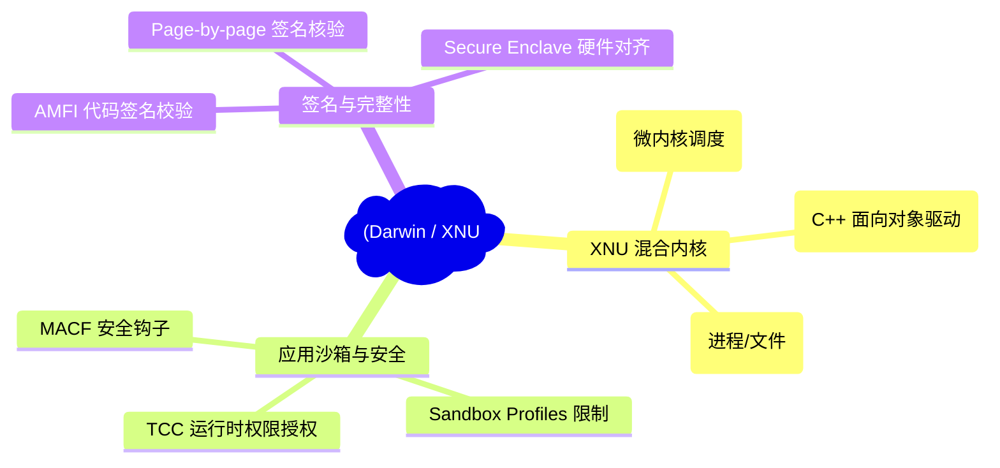
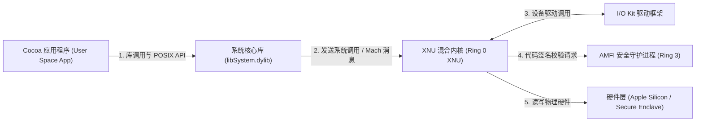
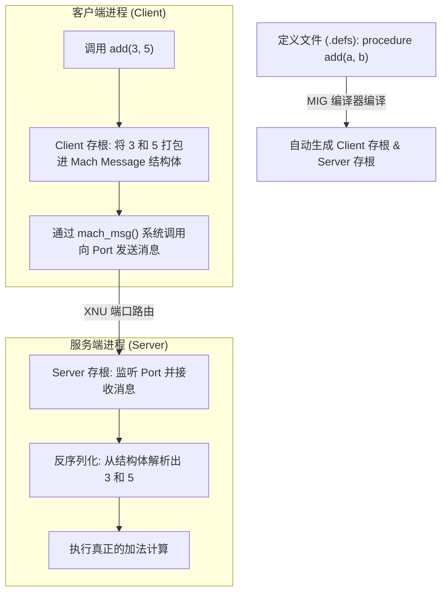
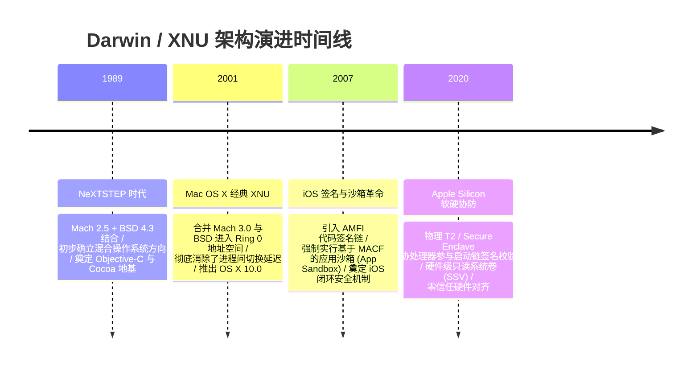

import CaseStudyHeader from '@site/src/components/CaseStudyHeader';
import DesignIntent from '@site/src/components/DesignIntent';
import ArchitectureEvolution from '@site/src/components/ArchitectureEvolution';
import TradeoffExplorer from '@site/src/components/TradeoffExplorer';
import GlossaryTerm from '@site/src/components/GlossaryTerm';
import ResearchNote from '@site/src/components/ResearchNote';
import QuizCard from '@site/src/components/QuizCard';
import CompareSlider from '@site/src/components/CompareSlider';
import GuidedExercise from '@site/src/components/GuidedExercise';
import PyRunner from '@site/src/components/PyRunner';

# macOS / Darwin：XNU 混合内核与安全沙箱签名链架构

<CaseStudyHeader
  oneLiner="macOS 与 iOS 依托 XNU 混合内核架构，将 Mach 的微内核消息调度灵活性与 BSD 的 POSIX 强健性熔炼于同一个地址空间；并依托硬件级安全芯片与 MACF 强制授权链，打造了面向海量消费级设备的闭环零信任签名与沙箱安全底座。"
  stats={[
    {label: '核心内核', value: 'XNU (Mach + BSD 混合内核)'},
    {label: '安全框架', value: 'MACF (强制访问控制框架)'},
    {label: '代码验证', value: 'AMFI (代码签名链检测)'},
    {label: 'IPC 引擎', value: 'Mach Messages & MIG 编译器'},
    {label: '驱动模型', value: 'I/O Kit (C++ 面向对象驱动)'}
  ]}
/>

:::info 对应课程概念
本案例横跨 [Month 1 操作系统设计哲学与进程通信](../foundations/programming-systems-primer)、[Month 4 低阶设计 (LLD) 与微内核模式](../foundations/programming-systems-primer)、[Month 6 云原生容器与代码沙箱沙盒](../cloud-enterprise-industrial/capstone-cloud-native)。它向高级架构师展示了如何通过将“微内核”的抽象与“宏内核”的进程空间共享结合，既解决了性能死角，又依靠底层内核钩子（Hooks）构筑起绝对防御的安全闭环。
:::

## 1. 设计初衷：微内核的现代复活与硬核防守

在苹果的 Darwin 操作系统（支撑 macOS、iOS、watchOS 等）中，核心的内核被称为 **<GlossaryTerm term="XNU" definition="XNU：X is Not Unix，苹果操作系统的混合内核。它将 Mach 微内核和 BSD 操作系统组件整合进同一个 Ring 0 内核地址空间中，消除了进程间 IPC 频繁跨空间切换的瓶颈。">XNU</GlossaryTerm>**。它与 Linux 或 Windows 的架构设计截然不同，代表了操作系统演进的另一个极高维度。

在设计上面临三大硬核挑战：
1. **微内核的 IPC 性能深渊**：XNU 底层引入了 **<GlossaryTerm term="Mach 微内核" definition="Mach 微内核：XNU 的最底层微核心。负责线程/进程调度、底层虚拟内存管理（Mach VM）、虚拟内存页调入调出、以及基于 Port 端口的消息传递（IPC）机制。">Mach 微内核</GlossaryTerm>**，它视一切为“消息与端口（Ports）”。然而，如果完全按照学术界纯微内核做法，文件系统、网络栈均作为 Ring 3 服务运行，每一次 I/O 读写都会导致多次频繁的上下文切换。XNU 必须解决这一性能深渊。
2. **零信任的代码签名链核验**：作为全球数十亿移动设备的基础，系统必须保证任何运行的第三方 App 均不能被篡改，且不能越权读取其他 App 的沙盒数据。这需要构建高度自动化、内核级的签名链校验与**应用沙箱（App Sandbox）**。
3. **驱动开发的野指针防护**：在传统 C 语言内核中，一个显卡或摄像头驱动的崩溃极易造成整机崩溃。XNU 需要设计一种面向对象、防内存溢出的现代驱动模型。

通过重塑 Mach 结构并将 BSD 融合入 Ring 0，苹果构建了如今坚不可摧的 Darwin 帝国。

<DesignIntent
  problem="如何设计一个既符合 POSIX 标准、图形与 I/O 响应极快，又具备极高微内核隔离特异性，且受严密应用沙箱与代码签名链防护的操作系统架构？"
  users="全球数十亿苹果生态的用户与开发者，要求系统零蓝屏卡顿，应用内购与个人隐私数据得到最严密物理隔离保护。"
  devices="支持 ARM 架构（Apple Silicon M 系列及 A 系列）与 Intel 架构的 Mac 电脑、iPhone 手机、iPad 以及可穿戴设备。"
  goals={[
    'XNU 混合内核并存设计：将 Mach 微内核负责线程调度、BSD 负责 UNIX 兼容，统一封装进 Ring 0 内核空间以消除 IPC 损耗。',
    '基于 MACF 的应用沙箱：部署 MACF 框架拦截任意 Ring 0 级系统调用，校验 Sandbox Profile 授权规则。',
    'AMFI 代码签名链验证：联合物理 T2/Secure Enclave 硬件芯片，在页面调入物理内存时（Page In）强制进行代码哈希签名验证。',
    'I/O Kit 驱动模型：使用受限 C++ 子集构建面向对象驱动框架，利用强类型和内存引用计数防范物理溢出。'
  ]}
  constraints={[
    '混合内核带来的内核代码膨胀：由于 Mach 和 BSD 都挤在 Ring 0 中，内核漏洞引发的崩溃风险增高，必须通过严格的 MACF 钩子限制内核内部的动作。',
    '应用冷启动签名校验开销：每次加载 App 都会触发高频加密计算，需要通过 Page-by-Page 懒加载哈希校准优化启动耗时。'
  ]}
  firstStep="将 Mach IPC Ports 与 BSD 进程标识（PID）进行一对一结构映射；在底层搭建 MACF 过滤引擎钩子；实现 MIG 编译器以自动生成跨域 IPC 存根代码。"
/>

## 2. 系统功能全景

以下是 Darwin 操作系统与 XNU 内核技术构成的全景图：



---

## 3. 最新架构总览

Darwin 操作系统的架构分为用户态应用框架、XNU 核心内核以及底层的硬件硬件层：

### 3a. System Context (系统上下文)



### 3b. Container Diagram (容器架构)

```mermaid
graph TB
  subgraph UserMode["用户空间 (User Mode - Ring 3)"]
    CocoaApp["用户 App (沙箱保护)"]
    LibSystem["System 动态库 (libSystem.dylib)"]
    Launchd["系统总控进程 (launchd)"]
    TCCD["权限控制服务 (tccd)"]
  end

  subgraph KernelMode["XNU 内核空间 (Ring 0 Kernel)"]
    subgraph MachSubsystem["Mach 最底层内核 (Mach Core)"]
      MachVM["Mach 虚拟内存"]
      Scheduler["多核调度器 (Threads)"]
      IPC["IPC 端口路由 (Ports)"]
    end
    
    subgraph BSDSubsystem["BSD UNIX 层 (POSIX Interface)"]
      VFS["虚拟文件系统 (VFS)"]
      NetworkStack["BSD 网络协议栈"]
      MACF["MACF 安全决策框架 (Mandatory Access Control)"]
    end

    IOKitLib["I/O Kit("C++ 驱动容器")"]
    AMFIKernel["AMFI 内核验证器"]
  end

  subgraph HardwareSpace["物理硬件层"]
    SecureEnclave["安全协处理器 (Secure Enclave)"]
    MainCPU["Apple Silicon 主 CPU"]
  end

  CocoaApp -->|封装调用| LibSystem
  LibSystem -->|POSIX Syscalls / Mach Trap| MACF
  MACF -->|策略拦截| AMFIKernel
  MACF --> BSDSubsystem
  
  BSDSubsystem <-->|桥接依赖| MachSubsystem
  IOKitLib <--> MachSubsystem
  
  AMFIKernel <-->|物理信任对齐| SecureEnclave
  MachSubsystem <--> MainCPU
  TCCD <-->|IPC 授权对齐| CocoaApp
  Launchd -->|加载与拉起| CocoaApp
```

---

## 4. 核心机制拆解

### 4a. XNU 混合内核内幕：Mach 与 BSD 的一体化融合

在 XNU 诞生前，Mach 3.0 因为将所有的 Unix 功能放在用户态服务（User-space servers）中，导致任何系统调用都要在用户态与内核态之间进行 4 次上下文切换，速度慢得无法商用。

苹果的解决方案是：**混合内核（Hybrid Kernel）**。它将 Mach 微内核与 BSD 系统整体合并，塞入同一个 Ring 0 内核地址空间中：
1. **Mach VM 与 BSD 映射**：Mach 负责最底层的物理页面分配、虚拟内存映射（Mach VM）以及微线程调度；BSD 负责上层包装，将 Mach 的 Thread 包装为 POSIX 规范的 Process（进程），向应用提供标准的 POSIX 系统调用（如 `fork`、`exec`、`open`）。
2. **消除上下文切换**：因为它们运行在同一个 Ring 0 地址空间，BSD 层调用 Mach 功能时，仅仅是一次普通的 C 语言函数指针调用，无需发生 CPU 的保护模式切换，消除了消息传递的延迟。

```mermaid
graph TD
  UserApp["1. 用户 App (Ring 3)"] -->|2. 发起 POSIX 系统调用: open('/data.txt')| BSD["3. BSD 层 (Ring 0)"]
  BSD -->|4. 直接函数调用 (无特权切换)| MachVM["4. Mach VM (Ring 0 内存定位)"]
  MachVM -->|5. 分配物理页框| Disk["5. 底层 I/O 驱动 (Ring 0)"]
```

### 4b. 强制访问控制框架 MACF 与 AMFI 应用沙箱机制

苹果操作系统的安全生命线由两大部分构成：
1. **MACF（Mandatory Access Control Framework）**：位于 XNU 内核中。它在每一个敏感系统调用（如读写文件、网络发包、挂载驱动）的关键路径上部署了“钩子（Hooks）”。当应用试图执行操作时，内核钩子会强行暂停当前线程，将请求导向安全决策引擎。
2. **AMFI（Apple Mobile File Integrity）与沙箱（App Sandbox）**：
   - 当应用启动时，AMFI 校验该程序的代码签名（Signature）是否由苹果受信任根证书签署。
   - 读取该应用的 Sandbox Profile（声明式权限列表，如禁止访问 `/Users` 目录，禁止开启网络）。
   - 将这些约束转化为 MACF 的拦截规则。一旦应用行为越界，MACF 钩子立刻拒绝并终止进程。

```mermaid
graph TD
  App["沙箱 App"] -->|1. 触发系统调用: write('/etc/hosts')| Syscall["Ring 0 系统调用入口"]
  Syscall -->|2. 强行暂停，导入安全评估| MACFHook["MACF 安全拦截钩子"]
  MACFHook -->|3. 查询沙箱规则配置| SandboxProfile{"Sandbox Profile 是否允许写入该路径?"}
  
  SandboxProfile -->|否| Block["4a. 拒绝写入，抛出 Permission Denied，触发安全告警"]
  SandboxProfile -->|是| Execute["4b. 通过校验，将操作下发给 VFS 执行写入"]
```

### 4c. Mach IPC 与 MIG (Mach Interface Generator) 机制

在微内核底座上，进程间通信（IPC）是数据传输的支柱。Mach IPC 依靠单向的端口（Ports）进行消息传递。

为了降低程序员手工拼装 Mach Message 结构体的痛苦，苹果设计了 **<GlossaryTerm term="MIG (Mach Interface Generator)" definition="Mach Interface Generator：MIG，一种 RPC 存根代码编译器。它接受接口定义文件（.defs），自动生成序列化（Marshalling）和反序列化代码，将复杂的 C 语言函数调用翻译为 Mach IPC 消息传递，降低微内核通信门槛。">MIG 编译器</GlossaryTerm>**：
1. **存根生成**：开发者只需在定义文件（`.defs`）中声明接口方法。
2. **序列化（Marshalling）**：MIG 编译器自动生成客户端与服务端的 C 代码存根，自动将参数打包成 Mach 消息，投递到目标 Port，并在接收端自动解码还原为函数调用，实现了类似微服务 RPC 的本地内核级穿透。



---

## 5. 关键数据结构与算法：Mach 消息体结构

在 Mach 微内核最底层，所有的系统交互都可以抽象为 Mach Message 结构。

### Mach Message 结构定义
其底层的消息体结构（在 `<mach/message.h>` 中定义）非常紧凑：
```c
typedef struct {
    mach_msg_bits_t       msgh_bits;        // 消息控制位 (是否包含 OOL 描述符等)
    mach_msg_size_t       msgh_size;        // 消息体总字节数
    mach_port_t           msgh_remote_port; // 目的端口 (消息发送去哪)
    mach_port_t           msgh_local_port;  // 源端口 (用于接收回复的 Port)
    mach_port_name_t      msgh_voucher_port;// 凭证端口
    mach_msg_id_t         msgh_id;          // 消息 ID (用于 MIG 分发识别)
} mach_msg_header_t;
```

*设计用意*：
- 依靠此紧凑的消息头，Mach 微内核能够实现内存零拷贝的 Out-of-Line（OOL）大数据传输 —— 通过将指针指向共享内存区域，直接操纵虚拟内存页的所有权（Page ownership transfer），在 Ring 0 内完成了海量数据的高效跨进程速递。

---

## 6. 架构演进史

Darwin 经历了从微内核重构到混合内核，再到软硬一体安全对齐的演进过程：



---

## 7. 架构对比

### 纯 Mach 微内核模式 (Mach 3.0 时代) vs XNU 混合内核模式 (Darwin 时代)

<CompareSlider
  before={
    <div style={{ padding: '20px', background: '#ffebee', border: '1px solid #c62828', borderRadius: '8px', height: '100%', color: '#333' }}>
      <strong>纯 Mach 微内核模式 (NeXTSTEP 前期)</strong>
      <p style={{ marginTop: '10px', fontSize: '0.9rem' }}>
        所有的 UNIX 系统服务（VFS, 网络栈）均作为用户态的独立服务（Daemon）执行。应用程序进行文件读取时，需要通过 Mach 消息在用户空间与内核空间反复进行 4 次上下文切换，速度缓慢，无法满足复杂多媒体图形处理的需要。
      </p>
    </div>
  }
  after={
    <div style={{ padding: '20px', background: '#e8f5e9', border: '1px solid #2e7d32', borderRadius: '8px', height: '100%', color: '#333' }}>
      <strong>XNU 混合内核模式 (现代 macOS)</strong>
      <p style={{ marginTop: '10px', fontSize: '0.9rem' }}>
        将最核心的 Mach 调度模块与成熟的 BSD 框架整体嵌入 Ring 0 内核地址空间中。上层 BSD 对 Mach 的底层调用直接退化为同一进程内的 C 语言函数跳转。消灭了上下文切换开销，保持了卓越的高速 I/O 与渲染性能。
      </p>
    </div>
  }
  labels={['纯微内核模式', 'XNU 混合内核模式']}
/>

---

## 8. 核心决策的取舍

在设计操作系统扩展安全策略时，架构师必须在定制灵活性与系统封闭安全性之间做抉择：

<TradeoffExplorer
  title="操作系统内核安全控制策略取舍"
  dimensions={['防止恶意软件运行能力', '开发及商业软件接入灵活度', '系统级调试与底层黑客修改空间', '运行期性能开销', '驱动程序的开发门槛']}
  options={[
    {
      name: '强制签名与 MACF 沙箱结合 (AMFI + Sandbox - 苹果模式)',
      scores: [5, 2, 1, 4, 3],
      note: '任何未通过 Apple 官方签名的应用默认无法运行；运行期由内核 MACF 钩子实时根据 Sandbox Profile 拦截越权行为。系统安全性冠绝全球，恶意软件几乎无法立足。但缺点是极度封闭，开发者必须购买开发者证书，系统底层黑客调试困难。',
      whenToUse: '面向全球数亿普通消费级用户、金融及隐私资产极度敏感的移动智能终端。'
    },
    {
      name: '用户权限自主管理模式 (POSIX rwxrwxrwx - 传统 Linux 模式)',
      scores: [2, 5, 5, 5, 5],
      note: '依靠传统的用户 ID 与文件权限位进行权限隔离。极度开放自由，用户拥有绝对的 Root 根控制权，可自由编译、动态注入任何内核模块。但代价是对于小白用户而言极易被植入木马，一旦获取 Root，整机数据瞬间全部泄露。',
      whenToUse: '极客开发机、云端多租户 Linux 服务器、对系统底层修改深度依赖的专业级环境。'
    },
    {
      name: '完全物理隔离沙箱容器模式 (Docker/Hyper-V VM)',
      scores: [5, 4, 1, 1, 2],
      note: '使用完全的虚拟化或 Namespace 容器隔离每个应用。隔离性无懈可击。但对于桌面系统而言，这会导致极高内存浪费与难以接受的启动延迟，且应用之间进行跨窗口剪贴板拷贝等互操作（Interoperability）极难实现。',
      whenToUse: '云端不受信任多租户代码托管、SaaS 函数计算（FaaS）、测试隔离沙盘。'
    }
  ]}
/>

---

## 9. 实践指引：实现一个带策略过滤的简易 MACF 沙箱拦截器

理解 macOS 沙箱工作原理的最佳方式是在用户态写一个模拟的 MACF 钩子过滤器。它将读取应用的 Sandbox Profile，在调用虚拟系统接口时进行前缀检测与拦截。

<GuidedExercise
  title="练习指引：编写一个基于 MACF 钩子的沙箱策略评估器"
  goal="构建微型沙箱过滤器。定义 Sandbox Profile 限制文件读写路径，并在模拟的 `open_file` 与 `send_network` 动作被触发时执行强审计验证，对于非法路径抛出特异性违规警告。"
  hints={[
    '沙箱配置文件可用 Python 对象存储，包含 `allowed_paths`（前缀路径列表）以及 `allow_network`（布尔值）两个策略元数据。',
    '路径规范化：使用 Python 的 `os.path.normpath` 整理测试路径，防止黑客通过相对路径（如 `/tmp/../../etc/hosts`）绕过沙箱边界进行目录穿越攻击（Path Traversal）。'
  ]}
  steps={[
    '创建 `SandboxProfile` 策略配置类，声明特异性读写和网络限制。',
    '编写 `MACFSandboxInterceptor` 拦截引擎，注册 Profile。',
    '实现 `check_file_access(path, mode)` 方法，执行前缀匹配判定与目录穿越检测。',
    '设计 `check_network_access(host, port)`，阻止未授权连接。',
    '运行各种测试用例验证拦截的有效性。'
  ]}
  checks={[
    '向沙箱许可的 `/tmp` 路径写文件能够成功通过。',
    '尝试访问敏感目录 `/Users/Alice/passwords.txt` 遭到沙箱拒绝。',
    '在防目录穿越测试中，恶意路径 `/tmp/../etc/hosts` 被安全识别并实施了拦截阻断。'
  ]}
/>

#### 交互式 Python 运行实验
在下方控制台中调试准备好的 MACF 拦截仿真代码，尝试修改沙箱配置文件或者输入防穿透测试用例，观察安全日志：

<PyRunner
  expect="分片路由与隔离验证成功"
  rows={25}
  code={`import os

class SandboxProfile:
    def __init__(self, allowed_paths=None, allow_network=False):
        # 允许访问的目录前缀列表，空代表禁止所有
        self.allowed_paths = allowed_paths or []
        self.allow_network = allow_network

class MACFSandboxInterceptor:
    def __init__(self, profile: SandboxProfile):
        self.profile = profile
        
    def check_file_access(self, target_path: str, mode: str) -> bool:
        print(f"[MACF Hook] 拦截到进程请求文件访问: path = '{target_path}', mode = '{mode}'")
        
        # 1. 核心安全防御：规范化路径以防范目录穿越攻击 (Path Traversal)
        # 例如将 '/tmp/../etc/hosts' 转换为 '/etc/hosts'
        normalized_target = os.path.normpath(target_path)
        
        if target_path != normalized_target:
            print(f"   ⚠️ 警告：检测到目录穿越参数！已规范化路径为: '{normalized_target}'")
            
        # 2. 扫描前缀匹配白名单
        for allowed_dir in self.profile.allowed_paths:
            normalized_allowed = os.path.normpath(allowed_dir)
            # 添加尾部斜线，确保前缀匹配边界清晰
            prefix = normalized_allowed if normalized_allowed.endswith(os.sep) else normalized_allowed + os.sep
            test_path = normalized_target if normalized_target.endswith(os.sep) else normalized_target + os.sep
            
            if test_path.startswith(prefix) or normalized_target == normalized_allowed:
                print(f"   -> [AMFI/Sandbox] 通过：匹配沙箱允许前缀 '{allowed_dir}'")
                return True
                
        print(f"   -> ❌ [Sandbox Violation] 越权阻止！路径 '{target_path}' 试图脱离沙箱监控边界！")
        return False
        
    def check_network_access(self, host: str, port: int) -> bool:
        print(f"[MACF Hook] 拦截到进程请求网络发包: host = '{host}', port = {port}")
        if self.profile.allow_network:
            print("   -> [AMFI/Sandbox] 通过：该沙箱授权了网络发包访问权限")
            return True
        print("   -> ❌ [Sandbox Violation] 越权阻止！沙箱已锁死该应用的网络发包口")
        return False

# 1. 初始化一个高强度沙箱策略：仅允许读写 /tmp 与 /Users/Shared 目录，禁止网络
secure_profile = SandboxProfile(
    allowed_paths=["/tmp", "/Users/Shared/AppSpace"],
    allow_network=False
)
sandbox_engine = MACFSandboxInterceptor(secure_profile)

print("--- 测试 1: 写入合规的缓存文件 ---")
sandbox_engine.check_file_access("/tmp/logs/session.log", "write")

print("\n--- 测试 2: 试图越权读取系统密码文件 (应被阻断) ---")
sandbox_engine.check_file_access("/etc/passwd", "read")

print("\n--- 测试 3: 恶意的目录穿越攻击 (试图通过 /tmp 穿越到 /etc，应被规范化后阻断) ---")
sandbox_engine.check_file_access("/tmp/../etc/hosts", "write")

print("\n--- 测试 4: 试图发起 HTTPS 请求 (应被网络控制策略阻断) ---")
sandbox_engine.check_network_access("api.apple.com", 443)
`}
/>

---

## 10. 知识自测

完成自测以检验你对 XNU 混合内核、Mach VM、MIG 编译器、MACF 沙箱以及 AMFI 代码签名链的掌握程度：

<QuizCard
  questions={[
    {
      q: '在苹果的 XNU 混合内核中，将 Mach 与 BSD 的底层组件全部塞入同一个 Ring 0 地址空间的主要目的是什么？',
      options: [
        'A. 为了方便同时编写 Java 和 Swift 的内核代码',
        'B. 彻底消除微内核架构在用户态进程之间频繁消息传递（IPC）以及上下文保护模式切换所带来的高昂性能开销，同时保留 Mach 现代调度与 BSD 成熟兼容层的逻辑长处',
        'C. 为了彻底不再支持任何第三方的 USB 硬件设备连接',
        'D. 仅仅是为了对内核代码的大小进行强制压缩'
      ],
      answer: 1,
      explain: '这是苹果合并内核的核心动因。在同一个 Ring 0 特权空间里，Mach 调度、内存管理器与 BSD 虚拟文件系统、网络协议栈之间的数据通信不再需要跨越特权隔离边界，极大地挽救了 Mach 微内核的性能死穴。'
    },
    {
      q: 'MIG（Mach Interface Generator）编译器在 Mach IPC 消息通信流中，充当了什么样的工程角色？',
      options: [
        'A. 类似于微服务 RPC 框架中的存根（Stub）编译器，负责将普通的 C 函数接口声明自动编译出序列化（Marshalling）和反序列化存根，以方便进程间直接投递 Mach Message 结构体而无需手动编解码',
        'B. 负责将 C 语言的代码转换为高效的 OpenGL 图形渲染指令',
        'C. 作为一个网络爬虫工具，扫描外部的 API 接口',
        'D. 对内核中的所有显卡驱动代码进行垃圾回收'
      ],
      answer: 0,
      explain: 'MIG 是 Mach 微内核的便利编译工具。它接收 `.defs` 文件，自动帮开发者处理了 mach_msg() 参数打包解包这种极其枯燥且容易出错的 C 语言结构体封装，充当了“内核级 RPC”的角色。'
    },
    {
      q: 'AMFI（Apple Mobile File Integrity）与 MACF 内核钩子是如何协同实现苹果应用沙箱（App Sandbox）强制限制的？',
      options: [
        'A. AMFI 负责下载沙箱，而 MACF 负责将沙箱压缩成 zip 包',
        'B. 它们强迫用户必须每小时输入一次 Apple ID 密码来重置系统权限',
        'C. 当应用启动时，AMFI 校验其合法的 App 代码签名，提取 Sandbox Profile 中的限制策略并注册到 XNU 的 MACF 钩子；当应用触发文件、网络等敏感系统调用时，MACF 钩子强行暂停线程，判定该请求是否越界并执行安全熔断',
        'D. 仅仅是为了让应用的图标在桌面上看起来更加美观'
      ],
      answer: 2,
      explain: '这是苹果安全底座的黄金组合。AMFI 在加载期验证应用的身份与数字签名真实性并载入规则，MACF 负责在运行期部署的内核 Hook 拦截点执行规则过滤，构筑了不可逾越的零信任应用防护围墙。'
    }
  ]}
/>

## 来源

- [Mac OS X Internals: A Systems Approach (Amit Singh)](https://www.amazon.com/OS-Internals-Systems-Approach-Paperback/dp/B010WELHJS)
- [Apple Mobile File Integrity (AMFI) and MACF Security Hook Framework (Apple Developer Library)](https://developer.apple.com/documentation/security)
- [Mach Messages and MIG Interface compiler rules in macOS Kernel Construction](https://www.gnu.org/software/hurd/gnumach-doc/Mach-Interface-Generator.html)
- [Kernel Extension (Kext) sandbox containment and drivers in I/O Kit](https://developer.apple.com/library/archive/documentation/DeviceDrivers/Conceptual/IOKitFundamentals/Introduction/Introduction.html)