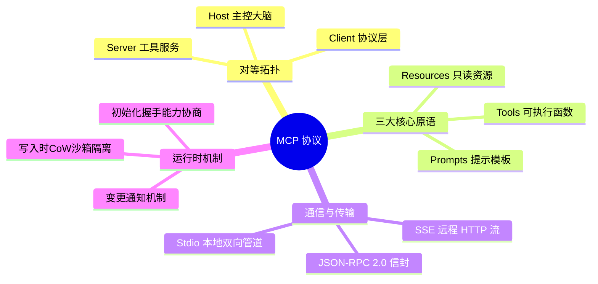
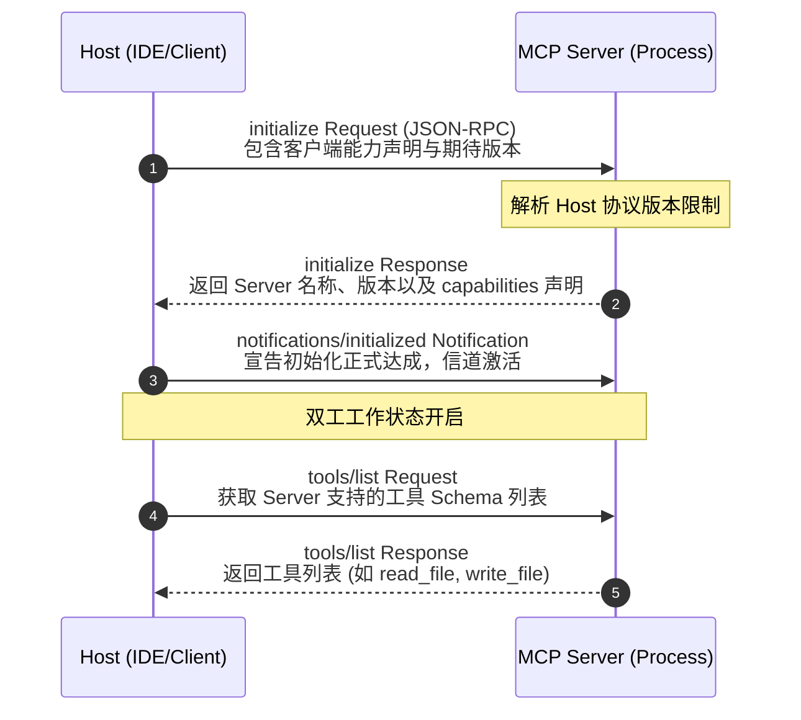
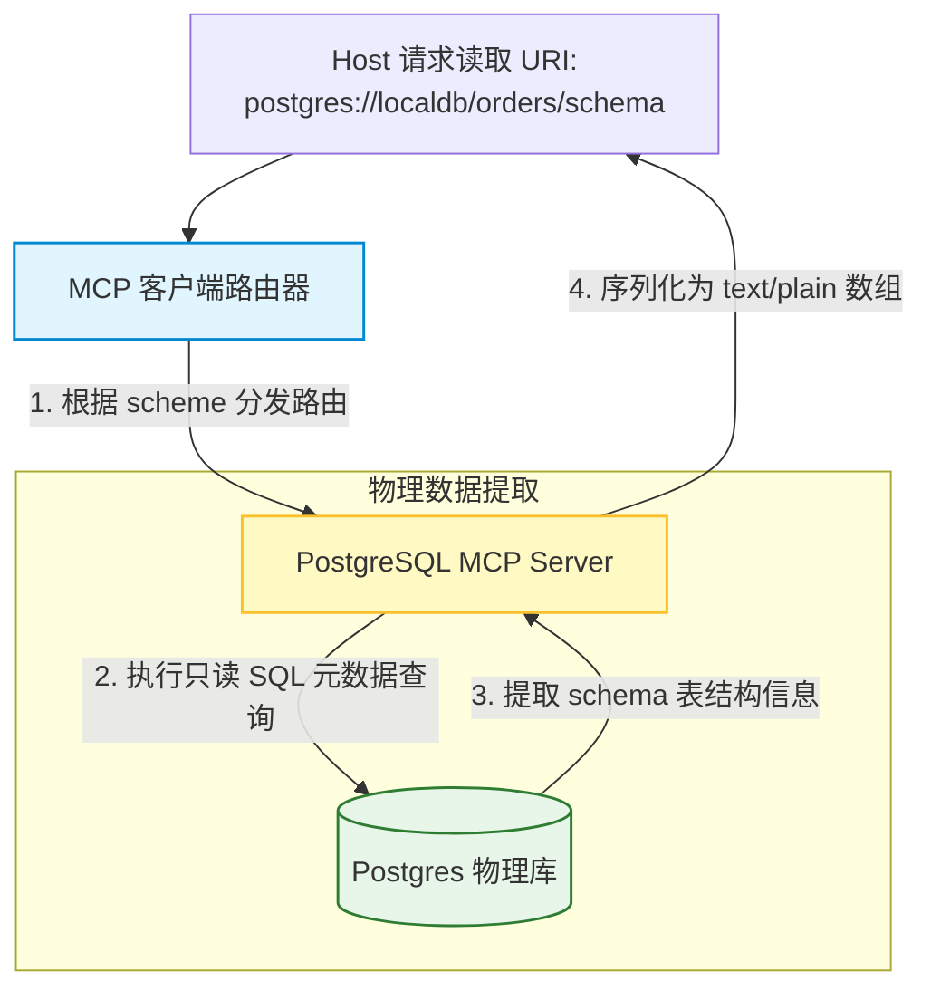
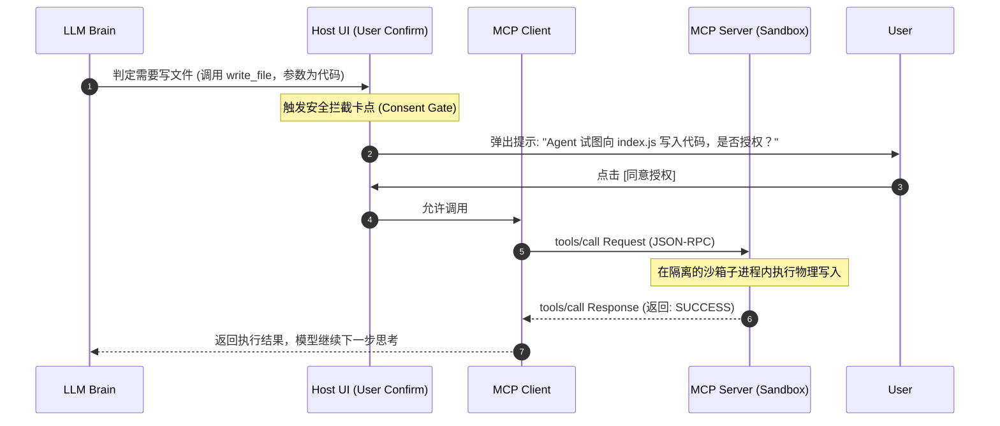
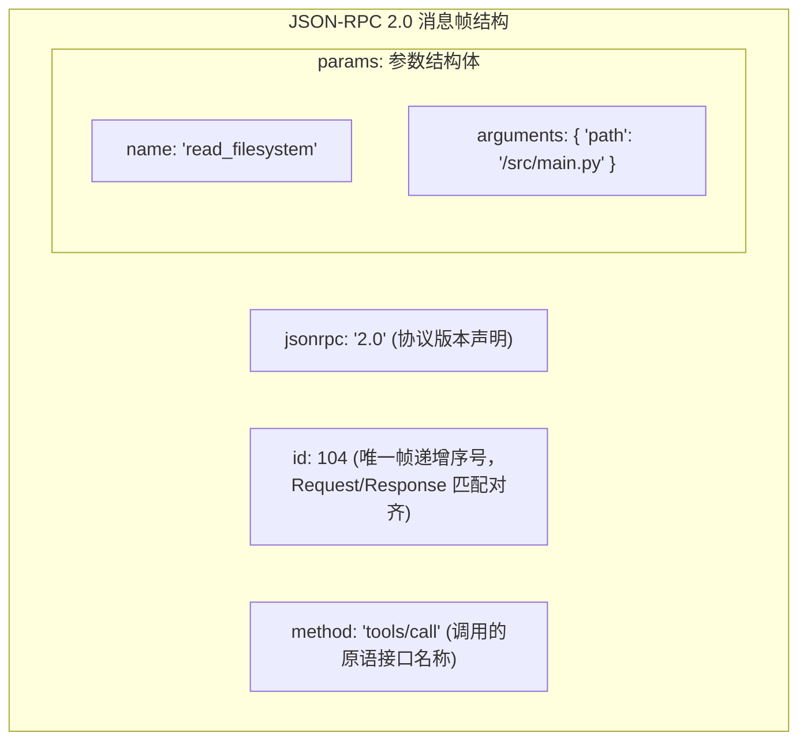

import CaseStudyHeader from '@site/src/components/CaseStudyHeader';
import DesignIntent from '@site/src/components/DesignIntent';
import EvolutionTimeline from '@site/src/components/EvolutionTimeline';
import CompareSlider from '@site/src/components/CompareSlider';
import TradeoffExplorer from '@site/src/components/TradeoffExplorer';
import GlossaryTerm from '@site/src/components/GlossaryTerm';
import ResearchNote from '@site/src/components/ResearchNote';
import GuidedExercise from '@site/src/components/GuidedExercise';
import QuizCard from '@site/src/components/QuizCard';
import MindMap from '@site/src/components/MindMap';
import PyRunner from '@site/src/components/PyRunner';

# MCP 协议：模型上下文协议、Host-Server-Client 双向解耦与 USB 物理层风格生态

<CaseStudyHeader
  oneLiner="MCP (Model Context Protocol / 模型上下文协议) 是 AI 智能体时代解决模型与外部工具/上下文割裂的革命性开源标准。借鉴 IDE 编译器设计中的语言服务器协议 (LSP) 以及硬件通信中的 USB 总线协议，MCP 确立了 Host (主控客户端) 与 Server (工具服务器) 之间标准化、双向解耦的 JSON-RPC 2.0 对接规范。通过消除传统 AI 集成中点对点（Ad-hoc）的胶水代码，MCP 实现了任何模型客户端即插即用任意本地或云端工具，并提供了资源寻址、提示词注入与安全沙箱执行的统一框架。"
  stats={[
    {label: '定位与类别', value: '大语言模型 (LLM) 与外部数据/工具解耦的上下文通信标准'},
    {label: '网络与传输层', value: 'JSON-RPC 2.0 (Stdio 双工管道 / HTTP SSE 异步长连)'},
    {label: '核心角色拓扑', value: 'Host (主控端/IDE) + Client (RPC 客户端) + Server (工具端)'},
    {label: '三大原语对象', value: 'Resources (只读资源) / Prompts (模板注入) / Tools (函数执行)'},
    {label: '运行时特性', value: '运行时动态发现 (Dynamic Discovery) + 双向能力协商'},
    {label: '安全隔离机制', value: '宿主主动鉴权 + 独立沙箱子进程隔离与生命周期管理'}
  ]}
/>

:::info 对应课程概念
本案例融合了以下课程核心概念：
*   **RPC 通信协议与序列化（Month 1 系统基础）**：MCP 协议采用经典的 JSON-RPC 2.0 帧进行消息封装，是分布式通信中远程过程调用与消息流控的标杆。
*   **动态插件与热插拔设计（Month 1 软件架构）**：Host 通过 Stdio / SSE 在运行时动态发现 Server 的 Schema 能力，应用了软件解耦与模块化设计。
*   **安全沙箱与进程通信（Month 1 操作系统）**：Host 将每个 MCP Server 作为独立沙箱子进程拉起，通过标准输入输出（Stdio）进行物理通信，是多进程隔离的实践。
*   **上下文缓存与数据路由（Month 3 数据获取）**：Resources 只读原语定义了基于 URI Scheme 的统一寻址，是分布式资源路由与上下文分块加载的设计。
:::

---

## 1. 设计初衷：终结 Agent 开发中的“接口胶水地狱”

在大语言模型（LLM）向自主智能体（Agent）演进的过程中，模型需要频繁接入外部世界（如读取文件、查询数据库、运行代码、发送 Slack 消息）。然而，以往的工具链开发面临严重的“兼容灾难”：
1.  **点对点绑定的胶水代码**：
    *   在早期的 AI 应用中，如果想让 Claude 读取一个 Postgres 数据库，开发人员必须使用特定的 LangChain 语法编写一套 Postgres Tool。
    *   如果第二天改用 OpenAI 的官方 SDK，这套代码就必须重写为 OpenAI 的 Function Calling 格式。
    *   如果有 N 个不同的模型客户端（如 Cursor、Claude Desktop、Dify、自己写的 Agent），需要连接 M 个外部工具（如 Postgres、GitHub、Docker、文件系统），开发人员必须编写并在物理上维护 `N * M` 种不同的接口转换胶水层。
2.  **“USB 物理总线”的工程启示**：
    *   这与 20 年前计算机外部设备对接的混乱状态完全一致：当时鼠标、键盘、打印机各有其专用的插槽和通信协议，直到 USB 协议问世，用统一的物理接口和握手原语规范了所有外设，实现了即插即用。
    *   软件领域也有相同的成功案例：微软提出的 LSP（Language Server Protocol / 语言服务器协议）将“编辑器”与“语言编译器”解耦，使任何编辑器（VS Code、Neovim）都可以通过标准 JSON-RPC 接入任何语言的语法解析服务。
3.  **MCP 的横空出世**：
    *   Anthropic 开源的 **MCP（Model Context Protocol）** 正是 AI 工具集成领域的 “USB 协议”。
    *   它将系统彻底划分为三个角色：
        *   **Host（主控端）**：决策大脑，负责承载 LLM 并且在宿主环境控制用户的安全授权（如 IDE 或是智能体框架）。
        *   **Client（客户端）**：嵌入在 Host 内部的协议驱动器，负责与 Server 建立 JSON-RPC 信道。
        *   **Server（工具服务器）**：独立的低耦合进程，专门暴露自己的 Resources、Prompts 与 Tools。
    *   任何 Host 只要实现了 MCP Client 驱动，就可以通过标准 Stdio 管道或 SSE 网络即插即用任何开发者编写的 MCP Server，将集成成本由 `N * M` 暴跌为 `N + M` 的线形规模。

<DesignIntent
  problem="如何设计一套能够解耦大模型客户端与层出不穷外部数据源及工具、支持运行时动态能力发现、同时能在本地和远程分布式环境下提供统一安全控制的上下文传输标准协议。"
  users="AI Agent 开发者、IDE 厂商（如 VS Code、Cursor 开发者）、提供大模型工具服务的 SaaS 厂商，以及致力于构建无主单点耦合 AI 生态的系统架构师。"
  devices="Host 应用程序拉起的本地沙箱子进程（通过标准输入输出 Stdio 进行物理双向管道通信），或者通过 HTTP / Server-Sent Events (SSE) 协议连接的远程边缘微服务。"
  goals={[
    '架构解耦化：彻底废除模型专有的工具胶水代码，将工具接入成本由几何级（N*M）降为线形级（N+M）',
    '即插即用（Plug-and-Play）：Host 与 Server 之间通过 initialize 握手，在运行时动态发现对方的资源与工具 Schema，无需重启应用',
    '安全沙箱隔离：Server 作为独立的 OS 子进程运行，Host 可以精细卡点过滤工具调用请求，提供提示词级别的用户授权确认（Confirmation Required）',
    '三种原语高度规范：统一定义只读数据源（Resources）、引导模板（Prompts）以及动作执行器（Tools），满足 Agent 运行的完整闭环'
  ]}
  constraints={[
    '本地进程通信的 I/O 损耗：在 Stdio 通道下，大容量数据（如读取 10MB 的源代码文件）需要经过频繁的 JSON 序列化与反序列化，容易在 I/O 管道上形成拥堵，需要优化分块传输',
    '远程 SSE 状态丢失：相较于本地双向 Stdio，远程 HTTP 传输采用 Server-Sent Events（单向推送）配合客户端 POST 请求模拟双工，在网络抖动时需建立高容错的 Session 保持机制',
    '安全控制的动态妥协：当 Agent 自动链式调用 Tools 时，过于严苛的权限确认会破坏自动化流体验，而完全放开则会面临勒索软件或数据泄露风险，必须在协议层提供非对称的声明机制'
  ]}
  firstStep="规范 JSON-RPC 2.0 请求、响应与通知信封；设计本地 Stdio 双工进程管道读写管理器；实现 Host 宿主主动拦截与授权卡点；制定基于 JSON Schema 的工具验证器。"
/>

---

## 2. 知识全景脑图

### 2a. 全景协议思维导图



### 2b. 交互协议导航

<MindMap
  root={{
    label: 'MCP 协议栈',
    children: [
      {
        label: '拓扑模型 (Topology)',
        children: [
          { label: '主控端 Host (如 IDE)' },
          { label: '对等驱动 Client' },
          { label: '独立工具 Server' }
        ]
      },
      {
        label: '三大原语 (Primitives)',
        children: [
          { label: '只读数据 Resources' },
          { label: '引导提示 Prompts' },
          { label: '动作执行 Tools' }
        ]
      },
      {
        label: '传输机制 (Transport)',
        children: [
          { label: '本地 Stdio 双工管道' },
          { label: '远程 SSE / HTTP Post' },
          { label: 'JSON-RPC 2.0 标准信封' }
        ]
      }
    ]
  }}
/>

---

## 3. 系统网络拓扑 (C4 Model)

### 3a. System Context (系统上下文图)

```mermaid
graph TB
  classDef host fill:#e8f5e9,stroke:#2e7d32,stroke-width:2px;
  classDef server fill:#ffebee,stroke:#c62828,stroke-width:1.5px;
  classDef model fill:#e1f5fe,stroke:#0288d1,stroke-width:1.5px;

  User["开发者 / IDE 用户"] -->|1. 操作编辑器或发送指令| IdeHost["IDE 主控端 (Host, 如 Cursor/Claude)"]:::host
  
  IdeHost <-->|2. 请求推理与工具参数填充| LlmService["三方大模型 API (Model, 如 Claude 3.5)"]:::model
  
  subgraph LocalSystem [本地宿主安全边界]
    IdeHost <-->|3. 标准输入输出 (Stdio) 管道通信 (MCP)| LocalMcpServer["本地文件系统 MCP Server"]:::server
  end
  
  subgraph RemoteNetwork [企业外部网络]
    IdeHost <-->|4. 远程 HTTP SSE 双工长连接 (MCP)| RemoteMcpServer["GitHub 远程控制 MCP Server"]:::server
  end
```

### 3b. Container Diagram (容器结构图)

```mermaid
graph TB
  classDef client fill:#e1f5fe,stroke:#0288d1,stroke-width:1.5px;
  classDef conn fill:#fff9c4,stroke:#fbc02d,stroke-width:1.5px;
  classDef server fill:#ffebee,stroke:#c62828,stroke-width:1.5px;
  classDef app fill:#e8f5e9,stroke:#2e7d32,stroke-width:2px;

  subgraph IdeHostContainer [Host 应用程序内部容器]
    IdeApp["Host 业务逻辑 (如 IDE 编辑器核心)"]:::app -->|1. 控制生命周期| ClientManager["MCP 客户端生命周期管理器"]:::app
    
    ClientManager <-->|2. 挂载物理驱动| StdioClient["Stdio 传输驱动器"]:::client
    ClientManager <-->|2. 挂载物理驱动| SseClient["SSE 传输驱动器"]:::client
  end

  subgraph OSProcessBoundary [操作系统独立子进程]
    StdioClient <-->|3. JSON-RPC (stdin/stdout)| LocalServerProcess["MCP 本地 Server (Node.js/Python 进程)"]:::server
    
    LocalServerProcess -->|4. 调用操作系统接口| LocalFile[("本地工作区文件")]
  end

  subgraph RemoteServerContainer [远程云端容器]
    SseClient <-->|5. JSON-RPC (HTTP SSE / POST)| SseServerEndpoint["SSE 远程服务端监听器"]:::conn
    SseServerEndpoint <-->|6. 执行逻辑| CloudMcpServer["MCP 远程云端 Server"]:::server
  end
```

---

## 4. 核心机制拆解

### 4a. Host-Server-Client 双向解耦模型与 USB 物理层风格总线

MCP 协议的设计哲学类似于硬件领域的 USB 总线设计，其核心是实现“模型逻辑”与“物理工具环境”的**物理级解耦**：
1.  **Host 作为总线插槽（Hub）**：
    *   Host（主控端）是一个承载者，它提供 MCP Client 的标准插槽。对于它来说，所有接入的外部工具都是一具具没有灵魂的“黑盒” Server。
2.  **Server 作为标准外设（USB Device）**：
    *   每个 MCP Server 拥有独立的运行环境。比如，一个负责运行 shell 命令的 Server 可以单独封锁在一个 Docker 容器内；一个读取数据库的 Server 只拥有只读的 DSN 连接配置。
3.  **对等解耦路由**：
    *   模型（Model）并不直接接触 MCP Server，它们之间唯一的纽带是 Host 传递的 **JSON 声明 Schema**。
    *   模型读出 Prompt 后决定“我需要调用工具 X，参数是 Y”；Host 收到该声明后，翻译为标准的 JSON-RPC 工具调用帧投递给工具 Server。工具 Server 执行完后将纯文本结果交还给 Host，Host 再喂给模型。
    *   这实现了完美的权限隔离——外部工具根本无法随意污染或侵入模型所在的宿主主进程。

```mermaid
graph LR
  classDef host fill:#e8f5e9,stroke:#2e7d32,stroke-width:1.5px;
  classDef server fill:#ffebee,stroke:#c62828,stroke-width:1.5px;
  classDef model fill:#e1f5fe,stroke:#0288d1,stroke-width:1.5px;

  Model["大模型 (Model Brain)"]:::model <-->|1. 仅交互语义参数 (Text/Schema)| HostHub["Host 宿主主控网关 (Client 驱动区)"]:::host
  
  subgraph StandardBus [MCP USB-like 协议总线]
    HostHub <-->|2. Stdio 物理通道 1| LocalServer["文件管理 Server"]:::server
    HostHub <-->|2. Stdio 物理通道 2| DatabaseServer["SQL 查询 Server"]:::server
    HostHub <-->|2. SSE 网络通道 3| RemoteSlackServer["Slack 推送 Server"]:::server
  end
```

---

### 4b. JSON-RPC 协议通道与运行时初始化握手

Host 启动一个 MCP Server 时，会在物理 Stdio/SSE 连接建立的瞬间执行**初始化握手协议**以交换彼此的能力（Capabilities）：
1.  **`initialize` 阶段**：
    *   Host 向 Server 发送 `initialize` 请求，携带 Host 自身的客户端信息以及它所期待的协议版本。
    *   Server 回复自身的名称、版本，以及它能够提供的核心能力 Schema（如是否支持只读 `resources`、是否提供模板 `prompts`、是否支持动作 `tools`，以及是否支持变更通知 `listChanged`）。
2.  **`initialized` 确认**：
    *   Host 确认能力对齐无误后，发送一条 `notifications/initialized` 异步通知给 Server，正式激活双工信道。
    *   从此，双方可以随时发起请求。比如，Server 在本地文件发生变动时，可以主动向 Host 发送 `notifications/resources/list_changed` 通知，触发 Host 在 IDE 侧动态刷图。



---

### 4c. Resources 资源只读模型与 URI 语义寻址

在 MCP 中，**Resources** 代表了一切可供大模型读取的“只读数据上下文”（如本地源文件、数据库 Schemas、静态 API 文档）：
1.  **URI 寻址路由**：
    *   每个 Resource 都被抽象为一个类似于网页 URL 的唯一标识符。
    *   例如：`file:///workspace/src/index.js`（本地代码资源）或 `postgres://database/table/orders/schema`（数据库架构资源）。
2.  **获取与检索机制**：
    *   **资源发现**：Host 发送 `resources/list` 请求，Server 返回当前可读的所有资源列表及各自的 MIME 类别。
    *   **资源读取**：Host 发送 `resources/read`（带上资源 URI），Server 将内容打包成 `text` 或者是 `blob`（如果是二进制文件）装在 JSON-RPC 响应体里返回。这与传统的关系库读取完美解耦。



---

### 4d. Tools 动态工具调用与沙箱权限校验

与只读的 Resources 不同，**Tools** 代表了“具有副作用的可执行操作”（如写入文件、调用三方支付 API、执行 terminal 命令）：
1.  **能力暴露声明**：
    *   Server 通过 `tools/list` 接口，以标准的 **JSON Schema** 格式向 Host 宣告每个 Tool 的入参格式与强制约束限制。
2.  **Host 宿主安全拦截卡点（Consent Gate）**：
    *   当模型做出调用决策并发送 `tools/call` 请求时，Host 会在物理发送给 Server 之前**卡点拦截**，并在 UI 侧弹出醒目的警告窗向用户求证：“检测到 Agent 试图调用 Tool X 执行修改动作，是否放行？”
3.  **沙箱隔离执行**：
    *   用户同意后，请求才会物理发往 Server。Server 作为一个被局限在独立操作系统账户（甚至 Docker 容器）内的沙箱子进程运行。执行完毕后，Server 将执行日志或标准输出封装返回，完美防止了任意恶意代码穿透宿主系统。



---

## 5. 关键数据结构与算法

### 5a. JSON-RPC 2.0 消息信封字段格式

MCP 在 Stdio/SSE 通道中流转的所有消息帧，均强制封装在标准的 JSON-RPC 2.0 协议信封中：


*   **jsonrpc**：值必须为固定的 `"2.0"`。
*   **id**：对于 Request 和 Response，这是一个递增的唯一整数（或 UUID 字符串），用于在多路异步通信中将响应与发出时的请求准确配对；而对于只负责单向投递通知的 Notification 消息，`id` 必须留空或省略。
*   **method**：接口原语名称，例如 `resources/read`、`prompts/get`、`tools/call` 等。
*   **params / result / error**：标准负载字段，封装了详细的请求参数或返回的具体结果。

---

### 5b. Capabilities 动态能力协商机制

在运行时初始化握手（`initialize`）过程中，Client 和 Server 必须相互投递一份能力集描述 JSON，称为能力协商矩阵。
*   **能力集 JSON 格式规范**：
    ```json
    {
      "capabilities": {
        "resources": { "subscribe": true, "listChanged": true },
        "prompts": { "listChanged": false },
        "tools": { "listChanged": true }
      }
    }
    ```
    通过比对该能力矩阵，Host 能够在内存中立刻裁定是否为当前 Server 开启“自动订阅资源变更通知”或者是“动态刷新工具箱 Schema”的监听线程，实现了接口逻辑的强适应性。

---

### 5c. Stdio 异步双工与流式边界校验

当 MCP 使用本地标准 I/O（Stdio）通信时，Host 和子进程 Server 必须高并发地向 `stdin` 和 `stdout` 读写流中灌入数据。
*   **流式行终止符（New-line Boundary）**：
    *   因为 Node.js / Python 的 I/O 流是流式的，为了防止粘包和半包现象，MCP 规定 **每个完整的 JSON-RPC 消息包必须以一个换行符（`\n`）作为结束边界标志**。
    *   异步读取算法（Buffer Scanner）在接收到字节流时，必须在内存中以 `\n` 进行滑动窗口切片，切出合法的完整 JSON 字符串后，再交付给底层 JSON 解释器反序列化，防止反序列化抛错引发死锁。

---

## 6. 架构演进史

MCP 协议虽然年轻，但它迅速演进为了 AI 智能体生态最瞩目的底座标准：

<EvolutionTimeline
  events={[
    {
      year: '2023',
      title: '点对点硬编码 Function Calling 乱局',
      why: '各大模型厂商（OpenAI, Anthropic, Google）相继推出模型侧函数调用功能，但格式各不相同，Agent 框架接入外部工具面临庞大的碎片化重构。',
      change: '各个大模型服务库（如 LangChain, LlamaIndex）依靠编写海量的硬编码工具转换层（Glue Code）艰难适配，代码库臃肿难维护。'
    },
    {
      year: '2024 年 11 月',
      title: 'Anthropic 正式开源 Model Context Protocol v1',
      why: '为了彻底打破大模型与上下文、本地资源之间的接口鸿沟，Anthropic 借鉴微软 LSP 的思路，研发并推出了开源的 MCP 协议。',
      change: '定义了标准的 Host-Server 对等连接协议，开源了支持 TypeScript 与 Python 的双重 SDK，并将 Stdio 和 SSE 作为标准传输规范，发布即引发开源社区震动。'
    },
    {
      year: '2025 年初',
      title: 'IDE 厂商巨头接入与本地生态爆发',
      why: 'Cursor、Claude Desktop、VS Code 等主流模型编辑器在实际开发中需要极速接入本地 Git、Postgres、Docker 以及终端控制。',
      change: '各大主流 Host（客户端）全面原生支持配置外部 MCP 接口；GitHub、PostgreSQL、Docker 官方相继发布针对 MCP Server 的标准化容器镜像，即插即用生态基本建立。'
    },
    {
      year: '2025 至今',
      title: '去中心化 Agent 联邦与多模态管道升级',
      why: '随着自主智能体（Autonomous Agents）在全球级生产环境落地，本地 Stdio 子进程的模式无法满足分布式云原生协作需求；同时，多模态（图像、音频）交互资源日益增多。',
      change: '支持通过安全的 HTTPS / SSE 双向 Session 进行动态云端寻址；在协议层扩展对二进制媒体文件（MIME image/webp, audio/wav）的原生序列化流式封装，形成了万物皆可 MCP 的新格局。'
    }
  ]}
/>

---

## 7. 架构对比：传统的 Coupled Function Calling (紧耦合函数调用) vs. MCP 插件生态 (USB-like Bus)

<CompareSlider
  before={
    <div style={{ padding: '20px', background: '#ffebee', border: '1px solid #c62828', borderRadius: '8px', height: '100%', color: '#333' }}>
      <strong>紧耦合函数调用 (Coupled Function Calling)</strong>
      <p style={{ marginTop: '10px', fontSize: '0.9rem' }}>每次新增一个工具，都需要用特定模型的 SDK 重写一遍适配胶水代码。如果有 3 个模型编辑器（Cursor, VS Code, Claude）和 4 个工具，需要维护 12 份硬编码转换。一旦模型接口微调或工具变动，整个应用面临级联崩溃灾难。</p>
    </div>
  }
  after={
    <div style={{ padding: '20px', background: '#e8f5e9', border: '1px solid #2e7d32', borderRadius: '8px', height: '100%', color: '#333' }}>
      <strong>标准化 MCP 生态 (Model Context Protocol)</strong>
      <p style={{ marginTop: '10px', fontSize: '0.9rem' }}>Host 统一挂载符合 MCP 驱动的客户端。无论工具是本地子进程还是远程服务，只要符合标准 JSON-RPC 2.0，即可像插拔 USB 设备一样实现零侵入热插拔。不仅把维护开销降到了线形，还天生具备子进程沙箱隔离的安全底座。</p>
    </div>
  }
  labels={['紧耦合函数调用', '标准化 MCP 插件生态']}
/>

---

## 8. 设计模式与课程映射

MCP 协议架构在实际设计与交互原语中，深度应用了以下课程章节中的经典设计模式与分布式协议：

1.  **RPC 远程过程调用模式**（参见 [系统与网络通信](../01-foundations/programming-systems-primer.mdx) 章节）：
    *   MCP 基于轻量级 JSON-RPC 2.0 规范，通过唯一的 `id` 实现多路异步应答对齐，是经典的 RPC 模式与消息序列化的教科书式工业实践。
2.  **插件与微内核解耦模式**（参见 [模块与契约](../01-foundations/modules-and-contracts.mdx) 章节）：
    *   Host 充当微内核（Microkernel），Server 充当外部插件模块，它们之间没有任何物理依赖，仅靠数据 Schema 契约在运行时进行生命周期管理，达成了极致的解耦。
3.  **统一资源寻址映射模式**（参见 [存储与索引](../03-data-cache-queue/indexing.mdx) 章节）：
    *   Resources 原语通过 URI Scheme 表达数据实体（如 `postgres://...`），将任意多源数据库/文件系统的数据，映射为全局统一格式的数据源检索树，与索引寻址完美映射。
4.  **代理安全控制网关模式**（参见 [负载均衡与安全](../05-core-components/load-balancing.mdx) 章节）：
    *   Host 依靠 Consent Gate 拦截 Tools 调用并向用户申请二次鉴权，是典型的“安全反向代理网关（Reverse Proxy Gateway）”，保护了底层操作系统的完整性。

---

## 9. 权衡：模型连接层协议的选择

MCP 协议在极简对接、通信性能开销以及安全性控制方面做出了以下妥协：

<TradeoffExplorer
  title="MCP 协议性能、扩展性与安全权衡"
  dimensions={['工具即插即用扩展率', 'I/O 通信序列化效率', '沙箱子进程安全隔离度', '远程跨网断线自愈力', '多模态多媒体数据吞吐度']}
  options={[
    {
      name: 'Model Context Protocol (MCP 模式)',
      scores: [5, 3, 5, 3, 3],
      note: '通过 Host-Server 的双向解耦与标准的 JSON-RPC 原语，达成了近乎完美的即插即用扩展能力，且物理子进程隔离赋予了极高的安全防线。缺点是频繁的 JSON Stdio 序列化在处理超大文本时会有 CPU 损耗，且远程长连在网络抖动时其 SSE 长连接重建机制存在轻微时延，多模态大文件的传输效率一般。',
      whenToUse: 'IDE 模型工具接入、Agent 流程自动化、需要严格进程权限防线与多源异构上下文快速拼装的复杂智能体工程。'
    },
    {
      name: '模型原生硬编码 Function Calling (紧耦合模式)',
      scores: [2, 5, 2, 5, 4],
      note: '因为数据不需要经过任何中间协议层的翻译或二次格式化，模型直接吐出本厂预期的 JSON 参数并直接执行对应代码，I/O 序列化开销为零，性能顶级。但缺点是缺乏标准的子进程沙箱防线，且任意工具与模型厂商 API 死锁，难以实现多模型自适应切换。',
      whenToUse: '极简的单模型单工具测试、不需要考虑未来平台迁移或热插拔扩建的封闭式局域网边缘 AI 演示。'
    },
    {
      name: 'Agent 大统一框架 SDK 包装 (LangChain Tool/LlamaIndex 模式)',
      scores: [4, 2, 3, 4, 3],
      note: '提供了极度庞大、开箱即用的生态类库和多层封装组件。然而，由于这些类库在物理上全部运行在 Host 主进程的同一个内存空间内，一个 Bug 就能导致 Host 内存溢出挂掉，且强依赖庞大的第三方依赖库（Dependency Hell），版本冲突率极高。',
      whenToUse: '企业级全栈 Agent 原型搭建、偏爱使用一体化 Python SDK 大包统筹、且不需要在多种非 Python 客户端（如 Claude Desktop）之间跨语言复用工具的业务。'
    }
  ]}
/>

---

## 10. 如果是你来设计：用 Python 仿真一个符合 MCP 规范的标准 JSON-RPC 2.0 服务器

### 场景设想
为了真正理解 MCP 协议的工作原理，我们需要脱离复杂的 SDK：
*   **物理模拟 Stdio 通道**：
    *   在现实中，Host 往 Server 的标准输入 `sys.stdin` 写入 JSON-RPC 字符串；Server 处理完后，将响应打印到标准输出 `sys.stdout`。
*   **我们要实现一个基础的 MCP Server**，它支持三个核心协议帧动作：
    1.  `initialize`（初始化握手）：交换 capabilities，声明我们支持 `tools` 和 `resources`。
    2.  `resources/list`（资源列表）：返回一个 mock 的代码文件资源 `file:///workspace/app.py`。
    3.  `tools/call`（工具调用）：
        *   支持调用一个名为 `calculate_hash` 的工具，计算传入字符串的简单校验和（MD5 风格模拟）。
*   我们的仿真器要解析 Host 送进来的 JSON-RPC 请求，做出状态校验，并返回 100% 符合 JSON-RPC 2.0 标准规范的响应帧。

请你用 Python 实现这套经典的 MCP Server 仿真引擎。

<GuidedExercise
  title="基于 Python 的符合 MCP 标准的 JSON-RPC 服务器仿真"
  goal="实现 MCP initialize 握手、只读资源查询、以及函数执行 Tools 响应，理解 JSON-RPC 信道打包边界。"
  steps={[
    '步骤 1: 编写 JSON-RPC 消息解析器，能够验证 incoming 字符串是否包含 `jsonrpc: 2.0`、是否有递增的 `id`，以及提取对应的 `method`。',
    '步骤 2: 实现 `handle_initialize` 动作。当收到 `initialize` 请求时，返回含有 capabilities（tools, resources）的正确响应信封。',
    '步骤 3: 实现 `handle_resources_list` 动作。声明当前工作空间中含有一个可读资源，标识其 URI 为 `file:///workspace/app.py`。',
    '步骤 4: 实现 `handle_tools_call` 动作。解析 Host 送来的参数，如果是 `calculate_hash` 工具，计算其传入参数 `text` 的字符长度作为哈希摘要并格式化返回。',
    '步骤 5: 依次模拟 Host 送入的“初始化”、“获取资源列表”、“执行计算工具”三道物理输入包，物理比对并验证 Server 的 stdout 输出包是否完全符合 JSON-RPC 格式。'
  ]}
  checks={[
    '确认在收到 `initialize` 请求时，返回了包含 capabilities 声明的 JSON 响应',
    '验证当调用 `calculate_hash` 工具时，成功返回了计算后的特征值结果',
    '确认当控制台打印出“✅ MCP JSON-RPC 仿真服务器自验证成功！”字样时，协议解析正常'
  ]}
/>

#### 交互式 Python 运行实验
在下方控制台中直接运行或修改已准备好的 MCP 协议信箱与动作仿真代码：

<PyRunner
  expect="MCP JSON-RPC 仿真服务器自验证成功"
  rows={25}
  code={`import json

class McpServerSimulator:
    def __init__(self):
        self.initialized = False
        # 声明 Server 的能力
        self.capabilities = {
            "resources": {"listChanged": True},
            "tools": {"listChanged": False}
        }

    def process_message(self, request_str):
        # 1. 解析 JSON 并进行 JSON-RPC 规范验证
        try:
            req = json.loads(request_str)
        except Exception:
            return json.dumps({"jsonrpc": "2.0", "error": {"code": -32700, "message": "Parse error"}, "id": None})

        # 检查必须字段
        if req.get("jsonrpc") != "2.0" or "method" not in req or "id" not in req:
            return json.dumps({"jsonrpc": "2.0", "error": {"code": -32600, "message": "Invalid Request"}, "id": req.get("id")})

        method = req["method"]
        msg_id = req["id"]
        params = req.get("params", {})

        # 2. 状态机分发路由
        if method == "initialize":
            return self.handle_initialize(msg_id, params)
        
        # 必须完成初始化后才能调用其它接口
        if not self.initialized:
            return json.dumps({"jsonrpc": "2.0", "error": {"code": -32002, "message": "Server not initialized"}, "id": msg_id})

        if method == "resources/list":
            return self.handle_resources_list(msg_id)
        elif method == "tools/call":
            return self.handle_tools_call(msg_id, params)
        else:
            return json.dumps({"jsonrpc": "2.0", "error": {"code": -32601, "message": "Method not found"}, "id": msg_id})

    def handle_initialize(self, msg_id, params):
        self.initialized = True
        response = {
            "jsonrpc": "2.0",
            "id": msg_id,
            "result": {
                "protocolVersion": "2024-11-05",
                "capabilities": self.capabilities,
                "serverInfo": {
                    "name": "mock-mcp-server",
                    "version": "1.0.0"
                }
            }
        }
        return json.dumps(response)

    def handle_resources_list(self, msg_id):
        response = {
            "jsonrpc": "2.0",
            "id": msg_id,
            "result": {
                "resources": [
                    {
                        "uri": "file:///workspace/app.py",
                        "name": "Workspace Main Entry File",
                        "mimeType": "text/x-python"
                    }
                ]
            }
        }
        return json.dumps(response)

    def handle_tools_call(self, msg_id, params):
        tool_name = params.get("name")
        args = params.get("arguments", {})

        if tool_name == "calculate_hash":
            text = args.get("text", "")
            # 仿真极简 Hash 校验: 计算字符总长度拼装成特征指纹
            result_hash = f"LEN_{len(text)}_MOCK_MD5"
            response = {
                "jsonrpc": "2.0",
                "id": msg_id,
                "result": {
                    "content": [
                        {
                            "type": "text",
                            "text": f"Successfully calculated hash: {result_hash}"
                        }
                    ]
                }
            }
            return json.dumps(response)
        else:
            return json.dumps({"jsonrpc": "2.0", "error": {"code": -32602, "message": "Invalid params"}, "id": msg_id})

# 协议自验证过程
server = McpServerSimulator()

print("--- 步骤 1: 模拟 Host 发送 initialize 建立协议握手 ---")
init_req = '{"jsonrpc": "2.0", "method": "initialize", "id": 1, "params": {"clientInfo": {"name": "cursor-client"}}}'
init_resp = json.loads(server.process_message(init_req))
print(f"  握手响应内容: {init_resp}")

print("\\n--- 步骤 2: 模拟 Host 查询 Server 只读 Resources 资源集 ---")
list_req = '{"jsonrpc": "2.0", "method": "resources/list", "id": 2}'
list_resp = json.loads(server.process_message(list_req))
print(f"  发现的资源列表: {list_resp['result']['resources']}")

print("\\n--- 步骤 3: 模拟 Host 触发 Tools 调用 (calculate_hash) ---")
tool_req = '{"jsonrpc": "2.0", "method": "tools/call", "id": 3, "params": {"name": "calculate_hash", "arguments": {"text": "hello antigravity"}}}'
tool_resp = json.loads(server.process_message(tool_req))
print(f"  工具执行输出: {tool_resp['result']['content'][0]['text']}")

# 自验证判定
# 1. 初始化握手返回协议版本 2024-11-05
# 2. 资源集返回 URI file:///workspace/app.py
# 3. 工具执行输出中必须包含字符串长度 "LEN_17"
if (init_resp["result"]["protocolVersion"] == "2024-11-05" and 
    list_resp["result"]["resources"][0]["uri"] == "file:///workspace/app.py" and 
    "LEN_17" in tool_resp["result"]["content"][0]["text"]):
    print("\\n[✅ 验证成功]: MCP JSON-RPC 仿真服务器自验证成功！")
else:
    print("\\n[❌ 验证失败]")
`}
/>

---

## 11. 常见误解

### 误解 1：MCP 协议是用来在本地或者云端运行大语言模型（LLM）推理计算的，就像 Ollama 一样
*   **澄清**：这是对协议边界的根本误判。
    1.  MCP 协议**自身绝对不负责运行大语言模型推理**。它只是大模型与外界世界的一座“网桥通信协议”。
    2.  大语言模型的权重加载、前向传播、文本生成等大脑决策工作，依然运行在 Host（主控端）连通的底层大模型服务商（如 OpenAI, Anthropic）或者本地的推理引擎（如 vLLM, Ollama）上。
    3.  MCP 的全部职责在于：将“大脑”判定出需要执行的工具动作（如执行 SQL），以格式化的 JSON-RPC 传递给真正存放数据的 Server。它充当的是**总线物理接口**的角色，而非算力核本身。

### 误解 2：MCP 本地 Stdio（标准输入输出）和远程 SSE（服务发送事件）的传输性能完全一致，可以无缝替换
*   **澄清**：两者在物理运行、吞吐上限以及网络延迟上有极大的架构差距。
    1.  **本地 Stdio 管道**：基于 OS 内存缓冲双工，没有网络传输物理损耗，延迟低于 1 毫秒。然而，所有数据均运行在本地，一旦需要传输大型多模态文件（如 4K 图像或视频片段），Stdio 的高频文本序列化会占满 CPU 单核，引发 Host 编辑器卡顿。
    2.  **远程 SSE 管道**：基于 HTTP 协议，网络包跨越机房面临毫秒级的物理传输时延，且由于 HTTP SSE 协议是**单向推送协议**，Server 往 Client 发通知很简单，但 Client 往 Server 发请求（如调用 Tools）必须额外封装并发起独立的 `HTTP POST` 请求，这会带来极高的握手重连开销。
    3.  因此，在实际架构中，本地开发工具（如 IDE）优先选择 Stdio；而跨机房联邦 Agent 协调必须选用 SSE，并为大型资源文件建立独立的 Out-of-band（带外）流式文件下载链路，不可直接塞在 JSON-RPC 字符串中。

### 误解 3：只要我们配置了符合 MCP 协议的 Tool，大模型在生成回复时就能 100% 保证调用顺序和执行的逻辑正确性
*   **澄清**：这忽视了大模型概率生成与 Tool Use 循环的“幻觉与不确定性”。
    1.  MCP 协议只负责提供**传输数据格式的标准化约束（Schema Validation）**。至于大模型是否会漏掉某个必填参数、是否在不该调用工具时瞎调用、或者在工具报错 500 后陷入无限循环的重试陷阱，MCP 协议本身根本无法干预和掌控。
    2.  这些“决策逻辑”和“异常处理”完全依赖于 Host（主控端）内部的 Agent 循环框架（如 LangChain 编排器或者是 IDE 内部的重试保护计数限流器）以及大模型自身对 JSON Schema 的遵从度（Instruction Following）。
    3.  协议是规范的，但调用大脑是概率性的。因此，Host 侧必须建立健全的“动作重试上限防护罩（Token Budget Gate）”，防止模型在遇到 MCP 错误后无限瞎试打爆 API 账户。

---

## 12. 知识自测

<QuizCard
  questions={[
    {
      q: '在 MCP 协议的 Host-Server-Client 拓扑结构中，Host（主控端，如 IDE/Claude Desktop）和独立 Server 之间进行初始化能力协商（Capability Negotiation）的请求方法名称是什么？',
      options: [
        'A. `connect_usb_bus`',
        'B. `initialize`',
        'C. `git/clone`',
        'D. `get_page_table`'
      ],
      answer: 1,
      explain: '这是握手机制的核心协议接口。当连接建立时，客户端（Host）必须向服务端发送 `initialize` 请求来宣告各自支持的版本和能力，完成双向握手后才能开启后续的 Tools/Resources 原语交互。'
    },
    {
      q: '在 MCP 协议的三大核心原语中，Resources 和 Tools 存在着明显的物理特征与安全边界划分。下列关于它们的表述中，哪一个是正确的？',
      options: [
        'A. Resources 只能运行在 GPU 显存内部，而 Tools 只能用 Python 编写',
        'B. Resources 代表了对外部数据上下文的“只读数据源”（如文件、元数据），由 Host 主动路由拉取，通常安全无副作用；而 Tools 代表了“具备副作用的动作执行器”（如删除文件、执行命令），在执行时 Host 必须实施用户主动授权（Consent Gate）以保安全',
        'C. Tools 代表了纯只读的提示词模板，而 Resources 专门负责执行 terminal 指令',
        'D. 它们没有任何区别，只是命名上的拼写不同'
      ],
      answer: 1,
      explain: '这是 MCP 安全机制的核心。只读的 Resources（如文件内容）可以直接加载，而可能带来破坏副作用的 Tools（如修改/删除）必须经过 Host 卡点拦截并显示弹窗供用户手动确认（Consent Gate），以防外部 Server 提权作恶。'
    },
    {
      q: '在 Stdio 通道中，为了防止粘包和半包现象、让异步 I/O 流的 Buffer 扫描器能够快速准确地切分出每个独立的 JSON-RPC 消息包，MCP 协议制定了什么样的包边界标识符？',
      options: [
        'A. 使用 4 个反引号 ```` 作为卡点',
        'B. 使用 0xDEADBEEF 十六进制魔数作为开头',
        'C. 强制要求每个完整的 JSON-RPC 消息包必须以一个换行符（`\\n`）作为结束边界标志',
        'D. 协议帧不需要任何边界，完全依赖 TCP 层的强一致性'
      ],
      answer: 2,
      explain: '这是本地 Stdio 传输流的控制细节。由于 Stdio 数据是通过字节流异步灌入的，新旧包极易粘在一起，MCP 通过规范 `\\n` 换行符让 Server 和 Client 在内存中滑动扫描，提取出合法的完整 JSON 包后再进行反序列化。'
    }
  ]}
/>

---

## 来源清单

*   [Model Context Protocol Specifications (Anthropic MCP Official Portal & SDK Specs)](https://modelcontextprotocol.io/)
*   [Language Server Protocol (LSP) Reference Guide: Standardizing compiler & editor RPC interfaces (Microsoft Research)](https://microsoft.github.io/language-server-protocol/)
*   [JSON-RPC 2.0 Specification: Lightweight remote procedure call protocol standard](https://www.jsonrpc.org/specification)
*   [Node.js Child Process & Standard I/O streams security isolation practices (Node.js API Documentation)](https://nodejs.org/api/child_process.html)
