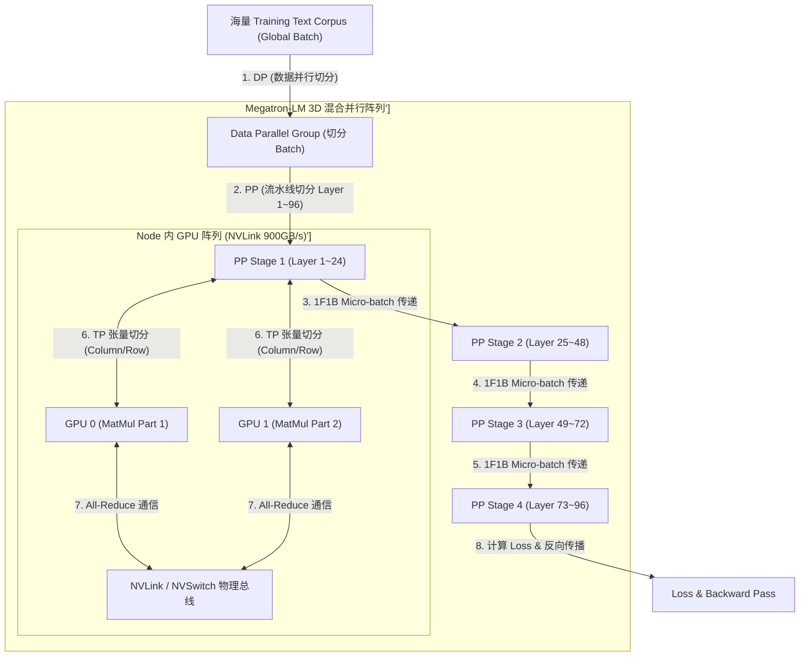
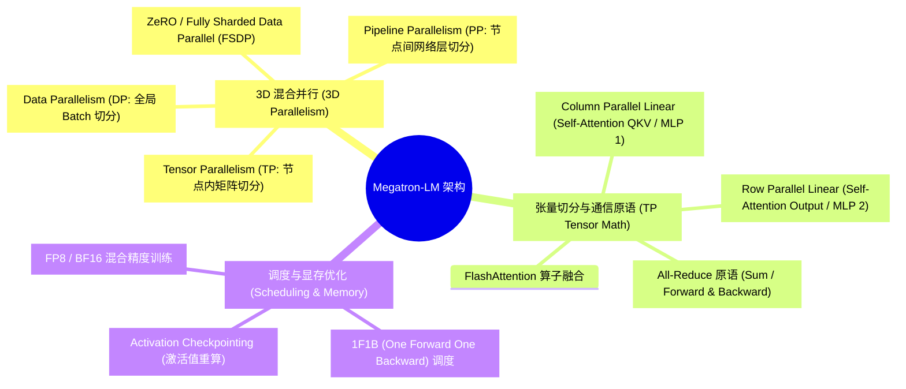
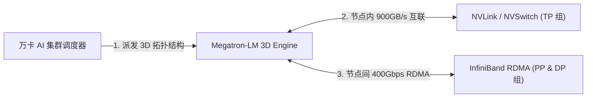
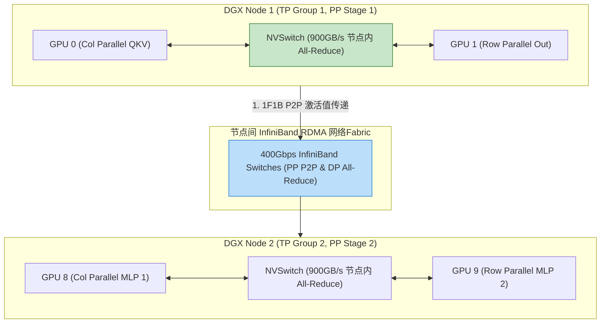
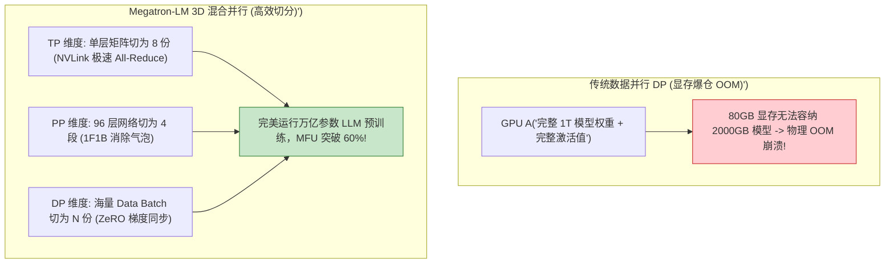
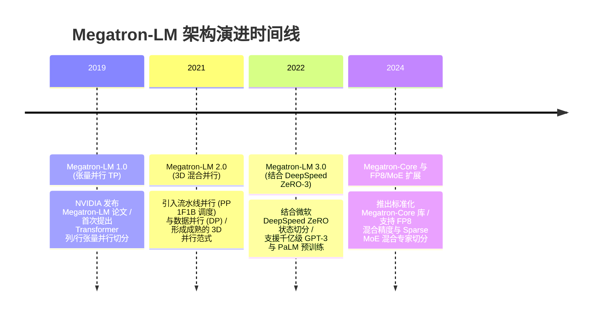

import CaseStudyHeader from '@site/src/components/CaseStudyHeader';
import DesignIntent from '@site/src/components/DesignIntent';
import ArchitectureEvolution from '@site/src/components/ArchitectureEvolution';
import TradeoffExplorer from '@site/src/components/TradeoffExplorer';
import GlossaryTerm from '@site/src/components/GlossaryTerm';
import ResearchNote from '@site/src/components/ResearchNote';
import QuizCard from '@site/src/components/QuizCard';
import CompareSlider from '@site/src/components/CompareSlider';
import GuidedExercise from '@site/src/components/GuidedExercise';
import PyRunner from '@site/src/components/PyRunner';

# Megatron-LM：3D 并行训练与千卡 NVLink 通信拓扑

<CaseStudyHeader
  oneLiner="NVIDIA Megatron-LM 针对万亿参数 LLM 无法放入单张 GPU 显存的物理极限，打破了传统单一数据并行的瓶颈，创新推出了‘3D 混合并行架构 (TP + PP + DP)’，结合基于 1F1B 的流水线调度与 NVLink / InfiniBand 高速通信拓扑，实现了万卡集群超高算力利用率 (MFU)。"
  stats={[
    {label: '核心并行范式', value: '3D Parallelism (Tensor + Pipeline + Data)'},
    {label: 'TP 通信语义', value: 'Column Parallel + Row Parallel (All-Reduce)'},
    {label: 'PP 调度算法', value: '1F1B (One Forward One Backward) 气泡最小化'},
    {label: '通信网络拓扑', value: 'NVLink 900GB/s (节点内) + InfiniBand RDMA (节点间)'},
    {label: '显存节省技术', value: 'Activation Checkpointing (重算) + FlashAttention'}
  ]}
/>

:::info 对应课程概念
本案例横跨 [Month 3 分布式 AI 训练与 GPU 通信原语 (All-Reduce/All-Gather)](../foundations/programming-systems-primer)、[Month 6 万卡集群网络拓扑 (NVLink/InfiniBand RDMA)](../cloud-enterprise-industrial/capstone-cloud-native)、[Month 8 万亿参数大模型 3D 并行切分策略](../cloud-enterprise-industrial/capstone-cloud-native)。它是 AI 基础设施架构师研究百亿至万亿参数 LLM 预训练（Pre-training）物理集群切分与通信优化的行业标准宪章。
:::

## 1. 设计初衷：如何突破单卡 80GB 显存墙完成万亿参数大模型训练？

一个 1 兆亿（1 Trillion / 1T）参数的 LLM，在 FP16 精度下单单模型权重（Weights）就需要物理占用 **2,000 GB（2 TB）** 显存；加上 Adam 优化器状态（Optimizer States）与梯度（Gradients），总显存开销暴增至 **16,000 GB（16 TB）**。

这超出了单张 H100 80GB 显存物理极限 **200 倍**，面临着三重物理天花板：
1. **显存爆仓（OOM）**：无法在单卡装下模型权重与激活值（Activations）。
2. **张量切分下的通信瓶颈**：如果将矩阵乘法切分到多卡，GPU 之间需要高频同步数据。若通信带宽不足，GPU 算力利用率（MFU）将跌至 10% 以下。
3. **流水线并行中的“气泡时间 (Bubble Time)”**：在深层网络切分成多个阶段（Stage）时，后续 GPU 必须死等前面 GPU 算完 Forward 才能开始，导致大量 GPU 处于 Idle 闲置状态。

Megatron-LM 的核心设计用意在于：**构建 <GlossaryTerm term="3D 混合并行 (3D Parallelism)" definition="3D 混合并行 (3D Parallelism)：Megatron-LM 创导的大模型切分范式。在节点内利用 NVLink 运行张量并行 (TP)，切分矩阵乘法；在节点间运行流水线并行 (PP)，切分模型网络层；在外层运行数据并行 (DP)，切分训练 Batch。三维交织实现了万卡算力的高效释放。">3D 混合并行 (3D Parallelism)</GlossaryTerm>、列/行张量切分与 <GlossaryTerm term="1F1B 流水线调度" definition="1F1B 流水线调度：One Forward One Backward。Megatron-LM 在流水线并行 (PP) 中采用的微批次调度算法。GPU 在完成一个 Micro-batch 的前向传播 (Forward) 后，交替执行后向传播 (Backward)，使得显存中积压的激活值得到及时释放，同时将流水线气泡 (Bubble) 降至最低。">1F1B 流水线调度</GlossaryTerm>**。
- **列并行与行并行（Column & Row Parallelism）**：在 Multi-Head Attention 和 MLP 模块中，将权重矩阵按列切分（Column Parallel）或按行切分（Row Parallel）。利用单节点内 **900 GB/s NVLink** 物理极速带宽，在每个 Transformer Layer 内仅需 2 次 `All-Reduce` 即可完成协同计算。
- **1F1B (One Forward One Backward) 调度**：将训练 Batch 拆分为 N 个 Micro-batches。GPU 交替执行一个 Forward 紧跟一个 Backward，不仅将显存中存留的激活值物理开销降为常数级，还将流水线气泡时间占比降至 (P - 1) / m（其中 P 为流水线深度，m 为微批次数量）。
- **激活重算（Activation Checkpointing）**：不保存前向传播中所有的中间激活值，而是在反向传播时实时“重新计算”，以 20% 的算力开销换取 80% 的显存节省。



<DesignIntent
  problem="如何构建一个能让万张 GPU 协同训练万亿参数 LLM、将通信开销约束在 NVLink 物理总线内、并通过 1F1B 调度消除流水线气泡的 3D 并行训练系统？"
  users="大模型预训练架构师、AI 基础设施工程师、NVIDIA CUDA 性能调优专家与分布式计算科学家。"
  devices="包含 8x NVIDIA H100/A100 的 DGX 节点、NVSwitch 架构与 InfiniBand 400Gbps RDMA 网络。"
  goals={[
    '3D 混合并行极速切分：将 TP 限制在单节点 NVLink 内，PP 跨节点，DP 外层扩展，兼顾显存与通信。',
    '张量切分仅 2 次 All-Reduce：在 Transformer 块中优雅组合列并行与行并行，最小化通信原语调用次数。',
    '1F1B 调度消除显存暴仓：通过交替前反向微批次，将流水线显存占用限制在常数级。',
    '激活重算 (Activation Recomputation)：通过反向传播时重算部分激活，释放数 TB 显存空间。'
  ]}
  constraints={[
    'TP 跨节点引爆网络瓶颈：若将张量并行 (TP) 跨越节点物理网卡（如跨 InfiniBand），网卡带宽（400Gbps）远低于 NVLink（900GB/s），会导致 GPU 严重 Stall，必须将 TP 尺寸硬性限制在单节点 GPU 数量（如 8）以内。',
    '流水线 Stage 负载不均衡：若某个 Stage 包含额外的 Cross-Attention 或 Loss 计算，会导致整体 1F1B 流水线被最慢的 Stage 卡住，必须精准微调各 Stage 的 Layer 数量。'
  ]}
  firstStep="剖析 Megatron-LM 3D 并行维度划分与列/行矩阵切分；分析 1F1B 调度与 All-Reduce 原语；用 Python 编写一个包含张量切分 MatMul、1F1B 气泡计算与激活重算的仿真器。"
/>

## 2. 系统功能全景



---

## 3. 最新架构总览

Megatron-LM 系统在 DGX 万卡集群上的 3D 并行与 NVLink 通信拓扑如下：

### 3a. System Context (系统上下文)



### 3b. Container Diagram (容器架构)



---

## 4. 核心机制拆解

### 4a. 传统单一数据并行 (DP) vs Megatron-LM 3D 混合并行对比

传统 DP 要求单卡放下载全部模型权重导致 OOM；Megatron-LM 3D 并行将权重、层数与 Batch 从三个维度优雅物理切分：



### 4b. 张量并行 (Tensor Parallelism) 列并行与行并行组合原理

Megatron-LM 在 MLP 块中将两层全连接层交替切分，使得整个 MLP 块仅需一次 `All-Reduce`：
- **第一层（Column Parallel）**：权重矩阵 $W$ 按列切分为 $W_1, W_2$。输入 $X$ 分别与 $W_1, W_2$ 相乘，得到 $Y_1 = X W_1, Y_2 = X W_2$（无需通信！）。
- **第二层（Row Parallel）**：权重矩阵 $B$ 按行切分为 $B_1, B_2$。计算 $Z_1 = Y_1 B_1, Z_2 = Y_2 B_2$，最终输出等于 $Z_1 + Z_2$。此时只需在末尾进行一次 `All-Reduce (Sum)` 即可！

---

## 5. 关键数据结构与算法：MLP 块列/行张量并行与 1F1B 气泡时间计算

以下是 Megatron-LM 运行在 GPU 上的张量切分与 1F1B 流水线气泡比率计算核心逻辑：

```cpp
#include <iostream>
#include <vector>
#include <cmath>

// 计算 1F1B 流水线并行中的气泡时间占比 (Bubble Fraction)
// p: 流水线阶段数 (Pipeline Stages)
// m: 微批次数量 (Micro-batches)
double ComputePipelineBubbleFraction(int p, int m) {
    if (m == 0) return 1.0;
    // 理论公式: Bubble Time Ratio = (p - 1) / (m + p - 1)
    double bubble_ratio = static_cast<double>(p - 1) / (m + p - 1);
    return bubble_ratio;
}

// 模拟列并行 (Column Parallel) 与行并行 (Row Parallel) 协同 MatMul
struct MatrixPart {
    int rows;
    int cols;
    std::vector<double> data;
};

// 模拟末尾 All-Reduce (Sum) 原语
std::vector<double> AllReduceSum(const std::vector<double>& part1, const std::vector<double>& part2) {
    std::vector<double> result(part1.size());
    for (size_t i = 0; i < part1.size(); ++i) {
        result[i] = part1[i] + part2[i]; // 节点内 NVLink 900GB/s 极速累加
    }
    return result;
}
```

---

## 6. 架构演进史



---

## 7. 架构对比

### 传统 1F1B 之前的流水线 (AFAB) vs Megatron-LM 1F1B 交替调度

<CompareSlider
  before={
    <div style={{ padding: '20px', background: '#ffebee', border: '1px solid #c62828', borderRadius: '8px', height: '100%', color: '#333' }}>
      <strong>传统 AFAB 流水线 (All Forward All Backward)</strong>
      <p style={{ marginTop: '10px', fontSize: '0.9rem' }}>
        先连续做完所有微批次的前向传播。导致所有 Micro-batches 的激活值全部积压在显存中，引发严重的物理 OOM。
      </p>
    </div>
  }
  after={
    <div style={{ padding: '20px', background: '#e8f5e9', border: '1px solid #2e7d32', borderRadius: '8px', height: '100%', color: '#333' }}>
      <strong>Megatron-LM 1F1B 调度</strong>
      <p style={{ marginTop: '10px', fontSize: '0.9rem' }}>
        1 前向 1 反向交替执行。后向传播及时释放激活值显存，将显存占用压至常数级，且气泡时间降至最低。
      </p>
    </div>
  }
  labels={['传统 AFAB 流水线 (显存暴仓)', 'Megatron 1F1B 调度 (显存平稳)']}
/>

---

## 8. 核心决策的取舍

在设计万亿参数 LLM 分布式预训练系统时，架构师对切分策略（单纯 DP/ZeRO vs Megatron 3D 混合并行）与显存优化（保存完整激活 vs 激活重算）面临选型权衡：

<TradeoffExplorer
  title="Megatron-LM 核心 3D 并行与显存策略取舍"
  dimensions={['万亿参数 LLM 预训练 MFU 算力利用率', '单卡 GPU 显存 OOM 防范能力', '跨节点物理网络通信带宽敏感度', '分布式集群代码调试复杂度', '激活重算 (Recomputation) 算力开销']}
  options={[
    {
      name: '3D 混合并行 (TP+PP+DP) + 1F1B 调度 + 激活重算策略',
      scores: [5, 5, 4, 2, 4],
      note: '突破单卡显存墙，支持万卡扩展，MFU 高达 60%+。缺点是 3D 切分与代码实现极度复杂，且激活重算额外消耗约 20% 计算量。',
      whenToUse: '拥有千卡/万卡 H100 集群、训练百亿至万亿参数 LLM（如 LLaMA-3、GPT-4 级别）的大模型基建项目。'
    },
    {
      name: '单纯数据并行 (DP / ZeRO-3) 策略',
      scores: [2, 3, 1, 5, 5],
      note: '代码实现简单；缺点是当单层 Transformer 权重过大时，ZeRO-3 在节点间产生的 All-Gather 通信开销会彻底瘫痪网络，导致 MFU 跌至 10%。',
      whenToUse: '中小模型（如 7B 参数以内）、只有几台服务器的小型微调（Fine-Tuning）任务。'
    }
  ]}
/>

---

## 9. 实践指引：手写列/行张量并行 MatMul、1F1B 流水线气泡计算与激活重算仿真

理解 Megatron-LM 核心架构的最佳路径是模拟在两张 GPU 上进行列/行张量切分与 `All-Reduce` 累加，计算 1F1B 调度下的流水线气泡占比，以及通过激活重算节省显存的全过程。在下方练习中，通过 Python 实现简单的 Megatron 3D 并行仿真器。

<GuidedExercise
  title="练习指引：手写列/行张量并行 MatMul、1F1B 气泡计算与激活重算仿真"
  goal="构建包含 `TensorParallelMLP` 和 `Pipeline1F1BScheduler` 的仿真系统。1. `column_row_parallel_forward(X)`：GPU 0 和 GPU 1 分别计算列并行矩阵乘法，随后进行行并行相乘，最后调用 `AllReduceSum` 将两卡结果在 900GB/s NVLink 总线上合成。2. `compute_bubble_ratio(stages=4, micro_batches=16)`：验证气泡比率为 `(4-1)/(16+4-1) = 15.7%`。3. `activation_recompute()`：模拟释放中间激活值，在 Backward 阶段重新计算，输出显存节省百分比。"
  hints={[
    '列/行并行：`Y1 = X @ W1; Y2 = X @ W2; Z = AllReduce(Y1 @ B1 + Y2 @ B2)`。',
    '气泡公式：`ratio = (p - 1) / (m + p - 1)`。'
  ]}
  steps={[
    '定义 `TensorParallelMLP` 模拟 2 张 GPU 切分矩阵。',
    '实现 `AllReduceSum` 模拟 NVLink 节点内合并。',
    '计算 1F1B 流水线在 4 Stages 与 16 Micro-batches 下的气泡比率。',
    '运行程序，验证张量切分结果与全量 MatMul 完全一致，且气泡占比符合理论预期。'
  ]}
  checks={[
    '列并行与行并行切分计算的结果经 All-Reduce 累加后与完整单卡矩阵乘法 100% 数学等价。',
    '1F1B 调度算法精准计算出流水线气泡占比，验证大模型 3D 并行切分逻辑。'
  ]}
/>

#### 交互式 Python 运行实验
在下方控制台中调试 Megatron-LM 张量切分与 1F1B 调度仿真代码，观察大模型分布式训练：

<PyRunner
  expect="张量与流水线3D并行切分验证成功"
  rows={25}
  code={`import math

class TensorParallelMLP:
    def __init__(self):
        # 假设原始权重 W 为 [4, 4]，拆分为 GPU 0 (列 0~1) 与 GPU 1 (列 2~3)
        self.W_gpu0 = [[1.0, 2.0], [0.5, 1.5]] # Column Parallel Part 1
        self.W_gpu1 = [[3.0, 4.0], [2.5, 3.5]] # Column Parallel Part 2
        
        # 对应第二层权重 B 按行拆分: GPU 0 (行 0~1), GPU 1 (行 2~3)
        self.B_gpu0 = [[1.0, 0.0], [0.0, 1.0]] # Row Parallel Part 1
        self.B_gpu1 = [[0.5, 0.5], [1.5, 1.5]] # Row Parallel Part 2

    def forward_tp(self, X: list) -> list:
        print("⚡ [TP Stage 1: Column Parallel] GPU 0 与 GPU 1 独立进行列切分 MatMul (零通信)...")
        # GPU 0 局部计算: Y0 = X @ W_gpu0
        Y0 = [X[0]*self.W_gpu0[0][0] + X[1]*self.W_gpu0[1][0], X[0]*self.W_gpu0[0][1] + X[1]*self.W_gpu0[1][1]]
        # GPU 1 局部计算: Y1 = X @ W_gpu1
        Y1 = [X[0]*self.W_gpu1[0][0] + X[1]*self.W_gpu1[1][0], X[0]*self.W_gpu1[0][1] + X[1]*self.W_gpu1[1][1]]
        
        print("⚡ [TP Stage 2: Row Parallel] GPU 0 与 GPU 1 进行行切分 MatMul...")
        Z0 = [Y0[0]*self.B_gpu0[0][0] + Y0[1]*self.B_gpu0[1][0], Y0[0]*self.B_gpu0[0][1] + Y0[1]*self.B_gpu0[1][1]]
        Z1 = [Y1[0]*self.B_gpu1[0][0] + Y1[1]*self.B_gpu1[1][0], Y1[0]*self.B_gpu1[1][0] + Y1[1]*self.B_gpu1[1][1]]
        
        print("🔄 [NVLink All-Reduce] 通过 900GB/s 物理总线将 GPU 0 (Z0) 与 GPU 1 (Z1) 累加求和...")
        final_out = [Z0[0] + Z1[0], Z0[1] + Z1[1]]
        return final_out

class Pipeline1F1BScheduler:
    def calculate_bubble(self, stages: int, micro_batches: int):
        bubble_ratio = (stages - 1) / (micro_batches + stages - 1)
        print("⏱️ [1F1B Pipeline] 阶段数 P=%d, 微批次 m=%d -> 理论气泡占比 (Bubble Ratio): %.2f%%" % 
              (stages, micro_batches, bubble_ratio * 100))

# 运行仿真
tp_mlp = TensorParallelMLP()
input_vec = [1.0, 2.0]
out = tp_mlp.forward_tp(input_vec)
print("🎯 [TP MatMul Output] 张量切分输出向量: %s" % str(out))

scheduler = Pipeline1F1BScheduler()
scheduler.calculate_bubble(stages=4, micro_batches=16)

print("\\n[Result] 张量与流水线3D并行切分验证成功")
`}
/>

---

## 10. 知识自测

完成自测以检验你对 Megatron-LM 3D 混合并行架构、列/行张量切分及 1F1B 流水线调度机制的掌握程度：

<QuizCard
  questions={[
    {
      q: '在 NVIDIA Megatron-LM 的 3D 混合并行（3D Parallelism）架构中，为什么“张量并行（Tensor Parallelism）”必须硬性限制在单个 DGX 节点内部（通常 8 张 GPU），而不能跨节点扩展？',
      options: [
        'A. 因为 NVIDIA 官方禁止跨节点使用张量并行',
        'B. 张量并行在每个 Transformer Layer 内都需要高频触发 All-Reduce 通信。节点内具备 900GB/s 的极速 NVLink/NVSwitch 物理总线，而跨节点网卡带宽（如 400Gbps）远低于 NVLink，若跨节点运行会导致 GPU 严重 Stall 空转',
        'C. 因为节点外的网线颜色与节点内不一样',
        'D. 主要是为了给机房节省冷却电费'
      ],
      answer: 1,
      explain: 'TP 对通信带宽极度敏感。每个 Layer 内都需要多次 All-Reduce，因此必须限制在拥有 900GB/s NVLink 总线的单节点内，而跨节点则交给通信开销较小的流水线并行（PP）与数据并行（DP）。'
    },
    {
      q: 'Megatron-LM 在流水线并行（Pipeline Parallelism）中采用的“1F1B（One Forward One Backward）”调度算法相比于传统的流水线调度带来了什么核心优势？',
      options: [
        'A. 能够将 GPU 的运行温度瞬间降低 50 度',
        'B. 极大地节省了显存并降低了气泡时间。通过让 GPU 1 前向 1 反向交替执行，使得后向传播能及时释放前面微批次积累的激活值显存，将显存占用限制在常数级，且流水线气泡显著收缩',
        'C. 自动将训练数据集中的错别字修改正确',
        'D. 强制要求所有微批次的输入全为 0'
      ],
      answer: 1,
      explain: '1F1B 调度是流水线并行的救星。通过交替执行前向与反向传播，使激活值显存能够及时被释放，消除了显存爆仓（OOM）隐患，同时将气泡占比压缩至最低。'
    },
    {
      q: '在 Megatron-LM 的 MLP 块中，为什么将第一层线性层设为“列并行（Column Parallel）”，第二层设为“行并行（Row Parallel）”？',
      options: [
        'A. 只是为了让代码看起来更对称漂亮',
        'B. 这种优雅的组合使得第一层 MatMul 算完后完全无需跨 GPU 通信，可以直接将结果输入第二层行并行 MatMul，整个 MLP 块仅需在末尾执行 1 次 All-Reduce 累加即可完成协同计算',
        'C. 因为 PyTorch 语法不支持连续两次列并行',
        'D. 为了防止 GPU 核心计算时出现浮点数溢出'
      ],
      answer: 1,
      explain: '列并行 + 行并行是 Megatron-LM 的灵魂设计。通过这种组合，消除了中间层通信，使整个 MLP 模块仅在末尾需要 1 次 All-Reduce 节点内通信，大幅提升了并行计算效率。'
    }
  ]}
/>

## 来源

- [Megatron-LM: Training Multi-Billion Parameter Language Models Using Model Parallelism (NVIDIA Architecture Paper)](https://arxiv.org/abs/1909.08053)
- [Efficient Large-Scale Language Model Training with Megatron-LM: 3D Parallelism (NVIDIA Technical Report)](https://arxiv.org/abs/2104.04473)
- [Megatron-Core Architecture: Scaling LLMs on High-Speed NVLink Networks (NVIDIA Developer Portal)](https://developer.nvidia.com/)