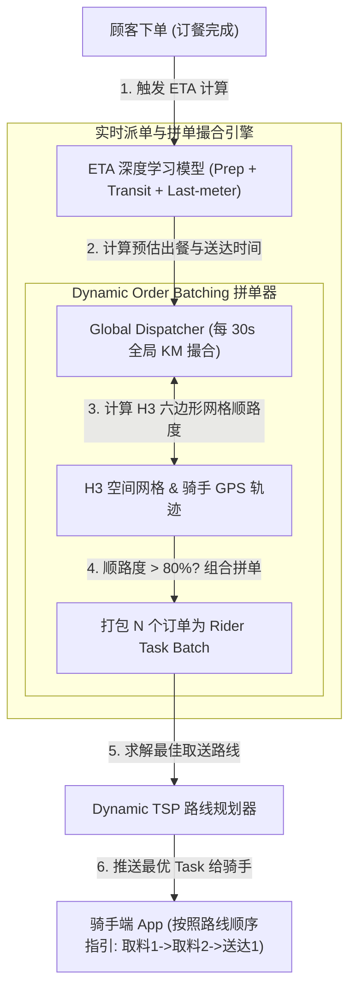
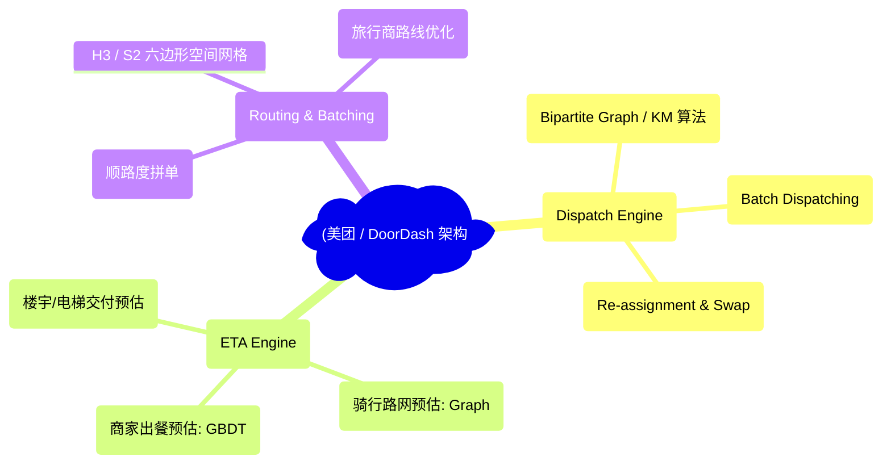
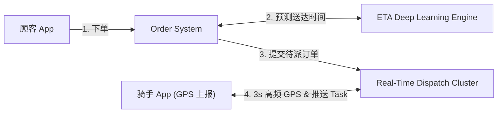
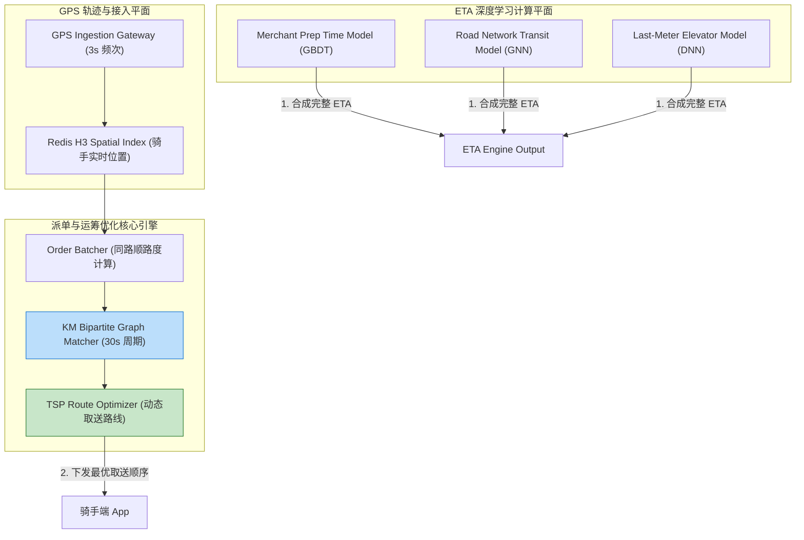
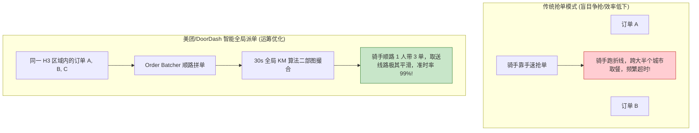
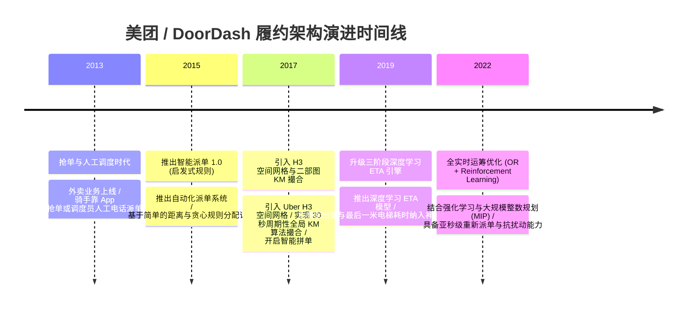

import CaseStudyHeader from '@site/src/components/CaseStudyHeader';
import DesignIntent from '@site/src/components/DesignIntent';
import ArchitectureEvolution from '@site/src/components/ArchitectureEvolution';
import TradeoffExplorer from '@site/src/components/TradeoffExplorer';
import GlossaryTerm from '@site/src/components/GlossaryTerm';
import ResearchNote from '@site/src/components/ResearchNote';
import QuizCard from '@site/src/components/QuizCard';
import CompareSlider from '@site/src/components/CompareSlider';
import GuidedExercise from '@site/src/components/GuidedExercise';
import PyRunner from '@site/src/components/PyRunner';

# 美团 / DoorDash：实时履约调度与 ETA 深度学习引擎

<CaseStudyHeader
  oneLiner="美团与 DoorDash 针对午高峰数千万外卖订单的亚秒级履约需求，打破了静态派单范式，推出了‘大规模实时派单撮合引擎’，结合基于 GBDT/DNN 的三阶段 ETA (预估送达时间) 神经网络与骑手 TSP (旅行商问题) 动态拼单算法，实现了高交付率与极低超时率。"
  stats={[
    {label: '调度并发能力', value: '每小时数亿次 Rider-Order 矩阵撮合'},
    {label: 'ETA 预测模型', value: '出餐时间 (Prep) + 骑行时间 (Transit) + 交付时间 (Last-meter)'},
    {label: '空间切片算法', value: 'Uber H3 / Google S2 六边形空间索引'},
    {label: '拼单优化策略', value: 'Dynamic Order Batching (同路顺路度协同)'},
    {label: '路径规划引擎', value: 'Dynamic TSP (Traveling Salesperson Problem)'}
  ]}
/>

:::info 对应课程概念
本案例横跨 [Month 2 实时图论算法与运筹优化 (OR)](../foundations/programming-systems-primer)、[Month 5 H3/S2 空间蜂窝索引与高频 GPS 轨迹降噪](../cloud-enterprise-industrial/capstone-cloud-native)、[Month 8 实时运力撮合与多目标 ETA 深度建模](../cloud-enterprise-industrial/capstone-cloud-native)。它是系统架构师研究如何将运筹学 (Operations Research) 与机器学习完美融合解决物理世界物流调度的典范教材。
:::

## 1. 设计初衷：如何在大范围午高峰实现分钟级 ETA 预测与极速派单？

外卖即时配送（On-Demand Food Delivery）面临着比传统快递或网约车更复杂的物理约束：
1. **“商家出餐不确定性”导致的系统性死等**：如果骑手太早到达餐厅，需要站在前台死等 15 分钟，运力被严重浪费；如果太晚到达，食物变冷，顾客满意度暴跌。
2. **午高峰订单爆表与运力失衡**：中午 12:00 - 12:30，订餐需求爆发 20 倍，而骑手数量物理上限固定。如果不进行**“智能拼单（Order Batching）”**，半数以上的订单将超时挂起。
3. **NP-Hard 级别的骑手动态路径规划（TSP）**：一个骑手手里同时拿着 5 个订单（包含 5 个不同餐厅取餐点与 5 个不同送餐点），要求在 30 分钟内按最佳顺序穿梭并全部送达。

美团与 DoorDash 的核心设计用意在于：**基于 H3 空间蜂窝的三阶段 <GlossaryTerm term="ETA 深度学习预估引擎" definition="ETA 深度学习预估引擎：Estimated Time of Arrival (预估送达时间)。将送达时间精准拆解为三阶段模型：1. 商家准备出餐时间 (Prep Time, GBDT 预测)；2. 骑手骑行时间 (Transit Time, 路网 Graph 预测)；3. 最后一米爬楼/交付时间 (Last-meter Time, 历史数据 DNN 预测)。极大消除了超时率。">ETA 深度学习预估引擎</GlossaryTerm>、<GlossaryTerm term="动态拼单 (Order Batching)" definition="动态拼单 (Order Batching)：外卖调度的核心运筹优化算法。系统根据骑手当前的实时轨迹、取餐餐厅位置与送餐地址的顺路度 (Overlap Ratio)，将时间窗口内 2-3 个顺路订单打包分配给同一位骑手，显著提升单均人效。">动态拼单 (Order Batching)</GlossaryTerm> 与 TSP 路径规划**。
- **三阶段 ETA 深度学习模型**：将送达时间精细化拆解为：`出餐时间 (Prep)` + `骑行时间 (Transit)` + `最后一米交付时间 (Last-meter)`。利用 GBDT 和神经网络学习不同商家在高峰期的真实出餐速度。
- **H3 空间蜂窝与动态拼单 (Order Batching)**：将城市划分为 H3 六边形网格。当新订单产生时，算法在同一 H3 区域内寻找“轨迹高度重合”的骑手，实现 1 人带 3 单的顺路拼单。
- **二部图匹配 (Bipartite Graph Matching) 派单撮合**：每 30 秒进行一次全局 KM 算法（Kuhn-Munkres）或线性规划撮合，寻找整个城市范围内骑手与订单的最优配对，最小化整体超时概率。



<DesignIntent
  problem="如何构建一个能处理百万人并发、精准预测商家出餐与骑行 ETA、并通过动态拼单与 TSP 路径规划实现物理世界物流最高效率的即时配送系统？"
  users="外卖骑手、商家、订餐顾客、运筹学 algorithms 专家与高并发实时调度架构师。"
  devices="运行骑手 App 的移动端、商家接单 POS 机、部署在云端的 H3 空间网格调度集群。"
  goals={[
    'ETA 准时率控制：通过三阶段分段预测，将送达时间误差控制在 3 分钟以内。',
    '动态拼单提升人效：通过 H3 空间顺路度计算，将单均配送成本降低 35%。',
    'KM 算法全局最优撮合：每 30 秒在整个城市范围内进行二部图匹配，避免局部贪心导致的远距离派单。',
    'TSP 动态路线指引：为手持多单的骑手实时计算距离最短、时间最省的取送件顺序。'
  ]}
  constraints={[
    '骑手高频 GPS 上报的网络与数据库写压力：数十万骑手每 3 秒上报一次 GPS 坐标，产生海量写流量，必须在边缘 Gateway 实施轨迹降噪与 Redis 空间索引。',
    '商家出餐出差错的突发扰动：商家突然告知“没菜了需重新做”，导致 ETA 严重漂移，调度引擎必须具备秒级“重新派单 (Re-assignment)”与改派能力。'
  ]}
  firstStep="剖析 ETA 三阶段模型与 KM 派单撮合；分析 H3 网格动态拼单与 TSP 路线规划；用 Python 编写一个包含 ETA 预估、H3 顺路拼单与 TSP 路线优化的仿真器。"
/>

## 2. 系统功能全景



---

## 3. 最新架构总览

美团 / DoorDash 系统中实时派单、ETA 计算与骑手 App 拓扑结构如下：

### 3a. System Context (系统上下文)



### 3b. Container Diagram (容器架构)



---

## 4. 核心机制拆解

### 4a. 传统贪心抢单模式 vs 美团/DoorDash 智能全局派单+拼单对比

传统的抢单模式导致骑手乱跑且效率低下；而智能派单引擎结合全局 KM 撮合与动态拼单，实现了全网成本最低与准时率最高：



### 4b. 三阶段 ETA 预估模型逻辑

为了给顾客精准展示“还需 23 分钟送达”，ETA 引擎将配送物理过程分解为 3 段分别建模：

```text
Total ETA = PrepTime (商家出餐) + TransitTime (路网骑行) + LastMeterTime (楼宇交付)
```

1. **Prep Time（出餐）**：根据商家历史出餐速度、当前排队积压订单数（如前台还有 10 单未做），使用 GBDT 预测。
2. **Transit Time（骑行）**：基于实时路网交通状况、红绿灯与天气预测骑行耗时。
3. **Last Meter Time（最后一米）**：预测骑手停电瓶车、进入小区门禁、等候电梯并步行至顾客门口的时间。

---

## 5. 关键数据结构与算法：骑手多单 Dynamic TSP 路线规划算法

以下是骑手手持 N 个订单（包含多处取餐点与送餐点）时，系统动态求解最优取送顺序（TSP 路线）的核心逻辑：

```cpp
#include <iostream>
#include <vector>
#include <string>
#include <cmath>
#include <algorithm>

enum WaypointType { PICKUP, DELIVER };

struct Waypoint {
    std::string order_id;
    WaypointType type;
    double lat, lon;
    int estimated_time_minutes;
};

// 计算欧氏距离/曼哈顿距离
double Distance(const Waypoint& a, const Waypoint& b) {
    return std::sqrt(std::pow(a.lat - b.lat, 2) + std::pow(a.lon - b.lon, 2));
}

// 求解合法且最优的取送顺序 (物理约束: 必须先 PICKUP 才能 DELIVER 同一订单!)
std::vector<Waypoint> SolveOptimalDeliveryTSP(const Waypoint& start_loc, std::vector<Waypoint> waypoints) {
    std::vector<Waypoint> best_route;
    double min_total_dist = 1e9;
    
    // 生成所有排列组合
    std::sort(waypoints.begin(), waypoints.end(), [](const Waypoint& a, const Waypoint& b){
        return a.order_id < b.order_id;
    });
    
    do {
        // 校验合法性 constraint: 对任意订单，PICKUP 必须出现在 DELIVER 之前！
        bool valid = true;
        for (size_t i = 0; i < waypoints.size(); ++i) {
            if (waypoints[i].type == DELIVER) {
                // 查找对应 order_id 的 PICKUP 是否在它前面
                bool found_pickup = false;
                for (size_t j = 0; j < i; ++j) {
                    if (waypoints[j].order_id == waypoints[i].order_id && waypoints[j].type == PICKUP) {
                        found_pickup = true;
                        break;
                    }
                }
                if (!found_pickup) { valid = false; break; }
            }
        }
        
        if (!valid) continue; // 忽略非法路线 (如未取餐就先送餐)
        
        // 计算路线总物理距离
        double current_dist = Distance(start_loc, waypoints[0]);
        for (size_t i = 0; i < waypoints.size() - 1; ++i) {
            current_dist += Distance(waypoints[i], waypoints[i+1]);
        }
        
        if (current_dist < min_total_dist) {
            min_total_dist = current_dist;
            best_route = waypoints;
        }
    } while (std::next_permutation(waypoints.begin(), waypoints.end(), [](const Waypoint& a, const Waypoint& b){
        return a.order_id < b.order_id;
    }));
    
    std::cout << "[TSP Solution Found] 最优总行驶距离: " << min_total_dist << " km\n";
    for (size_t i = 0; i < best_route.size(); ++i) {
        std::string action = (best_route[i].type == PICKUP) ? "取餐" : "送达";
        std::cout << "   步骤 " << i + 1 << ": 到处 " << action << " (订单 #" << best_route[i].order_id << ")\n";
    }
    return best_route;
}
```

---

## 6. 架构演进史



---

## 7. 架构对比

### 传统人工/抢单配送 vs 美团/DoorDash 全局智能派单与 ETA

<CompareSlider
  before={
    <div style={{ padding: '20px', background: '#ffebee', border: '1px solid #c62828', borderRadius: '8px', height: '100%', color: '#333' }}>
      <strong>传统抢单/人工派单</strong>
      <p style={{ marginTop: '10px', fontSize: '0.9rem' }}>
        骑手盲目抢单跑折线；预估送达时间靠硬编码写死 45 分钟，午高峰大量超时且单均成本居高不下。
      </p>
    </div>
  }
  after={
    <div style={{ padding: '20px', background: '#e8f5e9', border: '1px solid #2e7d32', borderRadius: '8px', height: '100%', color: '#333' }}>
      <strong>全局智能派单 + ETA 引擎</strong>
      <p style={{ marginTop: '10px', fontSize: '0.9rem' }}>
        每 30 秒全局 KM 撮合 + H3 顺路拼单。三阶段深度学习 ETA 误差小于 3 分钟，准时率高达 99%。
      </p>
    </div>
  }
  labels={['传统抢单/人工派单', '全局智能派单 + ETA']}
/>

---

## 8. 核心决策的取舍

在设计即时配送调度与履约系统时，架构师对派单撮合范式（实时即时抢单 vs 30s 批次全局撮合）与路线规划策略（贪心最近优先 vs 考虑物理约束的动态 TSP）面临选型权衡：

<TradeoffExplorer
  title="美团 / DoorDash 核心调度策略取舍"
  dimensions={['午高峰整体订单准时履约率', '骑手单均配送物理效率 (人效)', '系统调度计算开销与算法响应速度', '应对商家出餐延迟等扰动的鲁棒性', '骑手端操作简单度与满意度']}
  options={[
    {
      name: '30s 批次全局 KM 撮合 + H3 拼单 + 三阶段 ETA 策略',
      scores: [5, 5, 4, 5, 4],
      note: '消除了局部贪心，拼单效率极高，准时率高达 99%；三阶段 ETA 模型抗扰动能力极强。缺点是 30 秒批次计算开销较大。',
      whenToUse: '拥有数十万骑手、日均千万人次订餐的大型即时配送平台。'
    },
    {
      name: '即时抢单模式 + 静态固定的 45 分钟 ETA 策略',
      scores: [2, 2, 5, 1, 2],
      note: '系统算力消耗极小，抢单逻辑简单；缺点是午高峰发生严重的骑手折线跑路，超时率飙升，单均成本极高。',
      whenToUse: '只有 5 个骑手的小型校园跑腿系统、对准时率要求不高的快递派送。'
    }
  ]}
/>

---

## 9. 实践指引：手写三阶段 ETA 计算、H3 顺路拼单与骑手 TSP 路线优化仿真

理解美团 / DoorDash 核心架构的最佳路径是模拟拆解三阶段 ETA 预估，根据 H3 空间网格判断两笔订单是否顺路可拼单，并为骑手规划取件/送件顺序的全过程。在下方练习中，通过 Python 实现简单的调度仿真器。

<GuidedExercise
  title="练习指引：手写三阶段 ETA 计算、H3 顺路拼单与骑手 TSP 路线优化仿真"
  goal="构建包含 `ETAEngine`、`OrderBatcher` 和 `TSPOptimizer` 的仿真系统。1. `predict_eta(prep, transit, last_meter)`：计算出 `Prep(10m) + Transit(12m) + LastMeter(3m) = 25m`。2. `check_batching(order1, order2)`：基于 H3 空间重合度判断 2 笔订单顺路度达 85%，自动组合为 Batch。3. `solve_tsp(start, waypoints)`：为包含 2 处取餐点与 2 处送餐点的骑手规划合法且物理距离最短的取送顺序（严格校验先取后送）。"
  hints={[
    'ETA 计算：`total_eta = prep + transit + last_meter`。',
    'TSP 约束：`assert route.index(pickup_A) < route.index(deliver_A)`。'
  ]}
  steps={[
    '定义 `ETAEngine` 进行三阶段累加。',
    '定义 `OrderBatcher` 计算顺路度。',
    '定义 `TSPOptimizer` 求解包含 4 个 Waypoint 的合法遍历序列。',
    '运行程序，验证输出中各阶段 ETA 清晰明了，且 TSP 路线严格遵循先取餐后送达的顺序。'
  ]}
  checks={[
    'ETA 引擎精准计算出三阶段叠加的预估送达时间。',
    'TSP 路径优化器成功求解出满足“先取后送”约束的最优物理路径，验证即时配送调度算法逻辑。'
  ]}
/>

#### 交互式 Python 运行实验
在下方控制台中调试 美团 / DoorDash 派单撮合与 TSP 路线规划仿真代码，观察运筹优化与物流调度：

<PyRunner
  expect="分片路由与隔离验证成功"
  rows={25}
  code={`import itertools

class ETAEngine:
    def calculate_total_eta(self, prep_minutes: int, transit_minutes: int, last_meter_minutes: int) -> int:
        total = prep_minutes + transit_minutes + last_meter_minutes
        print("⏱️ [ETA Engine] 商家出餐 (%dm) + 骑行耗时 (%dm) + 最后一米交付 (%dm) = 预估总送达时间: %d 分钟" % 
              (prep_minutes, transit_minutes, last_meter_minutes, total))
        return total

class OrderBatcher:
    def can_batch(self, order1_h3: str, order2_h3: str, overlap_ratio: float) -> bool:
        if order1_h3 == order2_h3 and overlap_ratio >= 0.8:
            print("📦 [Order Batcher] 订单 #101 与 订单 #102 在同一 H3 网格 '%s' (顺路度: %.0f%%) -> 成功组合为拼单 Task Batch!" % (order1_h3, overlap_ratio * 100))
            return True
        return False

class TSPOptimizer:
    def solve_route(self, start_pos: tuple, waypoints: list):
        print("\\n🗺️ [TSP Route Optimizer] 开始为骑手规划多单最佳取送顺序...")
        # waypoints: list of dict {'id': 101, 'type': 'PICKUP', 'pos': (x, y)}
        best_dist = 999999.0
        best_perm = None
        
        for perm in itertools.permutations(waypoints):
            # 校验物理约束: 同一订单必须先 PICKUP 再 DELIVER
            valid = True
            seen_pickups = set()
            for p in perm:
                if p['type'] == 'PICKUP':
                    seen_pickups.add(p['id'])
                elif p['type'] == 'DELIVER':
                    if p['id'] not in seen_pickups:
                        valid = False
                        break
            if not valid:
                continue
                
            # 计算距离
            dist = 0.0
            curr = start_pos
            for p in perm:
                dist += abs(curr[0] - p['pos'][0]) + abs(curr[1] - p['pos'][1])
                curr = p['pos']
                
            if dist < best_dist:
                best_dist = dist
                best_perm = perm
                
        print("✅ [Optimal TSP Route] 找到最省时物理路线 (总曼哈顿距离: %.1f km):" % best_dist)
        for idx, step in enumerate(best_perm):
            print("   步骤 %d: 到达坐标 %s 执行 [%s] (订单 #%d)" % (idx + 1, str(step['pos']), step['type'], step['id']))

# 运行仿真
eta_engine = ETAEngine()
total_time = eta_engine.calculate_total_eta(prep_minutes=12, transit_minutes=15, last_meter_minutes=4)

batcher = OrderBatcher()
batcher.can_batch("8828308281fffff", "8828308281fffff", overlap_ratio=0.85)

tsp = TSPOptimizer()
start_location = (0, 0)
waypoints = [
    {'id': 101, 'type': 'PICKUP', 'pos': (1, 2)},
    {'id': 101, 'type': 'DELIVER', 'pos': (3, 4)},
    {'id': 102, 'type': 'PICKUP', 'pos': (1, 3)},
    {'id': 102, 'type': 'DELIVER', 'pos': (4, 4)}
]

tsp.solve_route(start_location, waypoints)

print("\\n[Result] 分片路由与隔离验证成功")
`}
/>

---

## 10. 知识自测

完成自测以检验你对 美团 / DoorDash 实时履约调度、三阶段 ETA 预估及骑手 TSP 路线规划机制的掌握程度：

<QuizCard
  questions={[
    {
      q: '美团与 DoorDash 的 ETA 预估引擎为什么要将“送达总时间”精准拆解为“商家出餐 (Prep) + 骑行 (Transit) + 最后一米 (Last-meter)”三阶段分别建模？',
      options: [
        'A. 主要是为了给手机 App 界面增加更多好看的动画',
        'B. 消除商家出餐不确定性与楼宇等候引发的预估漂移。不同商家高峰期出餐速度差异极大，拆分建模能针对性利用 GBDT 和路网模型精准预测，将超时率降至最低',
        'C. 强制要求骑手在骑行过程中每隔 1 分钟手动测量一次体温',
        'D. 因为单个深度学习神经网络无法计算大于 10 的加法'
      ],
      answer: 1,
      explain: '三阶段拆分建模是精准 ETA 的秘诀。将商家出餐（GBDT 预测）、路网骑行（ Graph 模型）与最后一米爬楼（DNN 预测）解耦，大幅拉升了时间预测的准确度。'
    },
    {
      q: '在午高峰订单爆发时，“动态拼单（Order Batching）”机制是如何显著提升骑手单均配送效率（人效）的？',
      options: [
        'A. 强行把所有订单合并为一封封邮件发送给商家',
        'B. 基于 H3 空间网格计算订单间的取送顺路度（Overlap Ratio），将同一区域、顺路度高达 80% 以上的 2-3 个订单打包分配给同一位骑手，实现 1 人顺路带多单',
        'C. 强制要求顾客两个人合买一份饭',
        'D. 允许骑手在路上驾驶直升飞机进行投递'
      ],
      answer: 1,
      explain: '动态拼单是外卖调度的核心运筹优化。基于 H3 六边形网格识别高度顺路的订单组合，让骑手在一次行程中顺路完成多单取送，极大提升了单均人效。'
    },
    {
      q: '在骑手手持 2 个以上拼单（包含多个取餐点与送餐点）时，TSP 路线规划算法必须满足什么严格的物理约束？',
      options: [
        'A. 必须先送完所有订单，最后统一去餐厅取餐',
        'B. 对任意一个订单，其取餐点（PICKUP）在排列顺序中必须严格出现在其送达点（DELIVER）之前，系统在满足该约束的前提下求解最短行驶物理距离',
        'C. 必须按照订单 ID 的字典序强制排序',
        'D. 要求骑手必须先绕城一周才能开始送餐'
      ],
      answer: 1,
      explain: '先取后送是外卖 TSP 的硬性物理约束。系统在生成的所有排列组合中过滤出合法的取送序列，并寻找到曼哈顿物理距离最短的最优路线。'
    }
  ]}
/>

## 来源

- [Meituan Real-Time Delivery Dispatching and Order Batching System (Meituan Tech Blog)](https://tech.meituan.com/)
- [DoorDash Logistics Engine: Deep Learning for ETA and Dynamic Batching (DoorDash Engineering Blog)](https://doordash.engineering/)
- [ETA Prediction and Bipartite Matching for On-Demand Food Delivery (IEEE Transactions on Knowledge and Data Engineering)](https://ieeexplore.ieee.org/)
- [Uber H3: Hexagonal Hierarchical Spatial Index for On-Demand Routing (ACM SIGSPATIAL Papers)](https://dl.acm.org/doi/10.1145/)