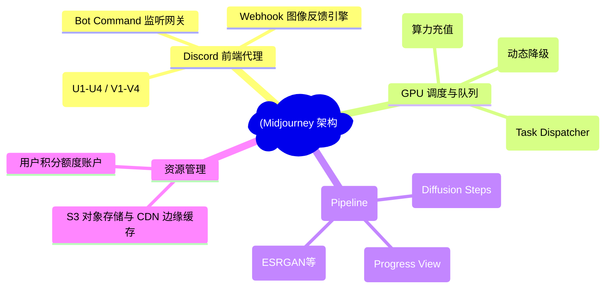
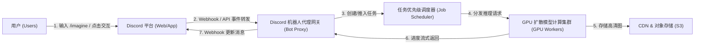
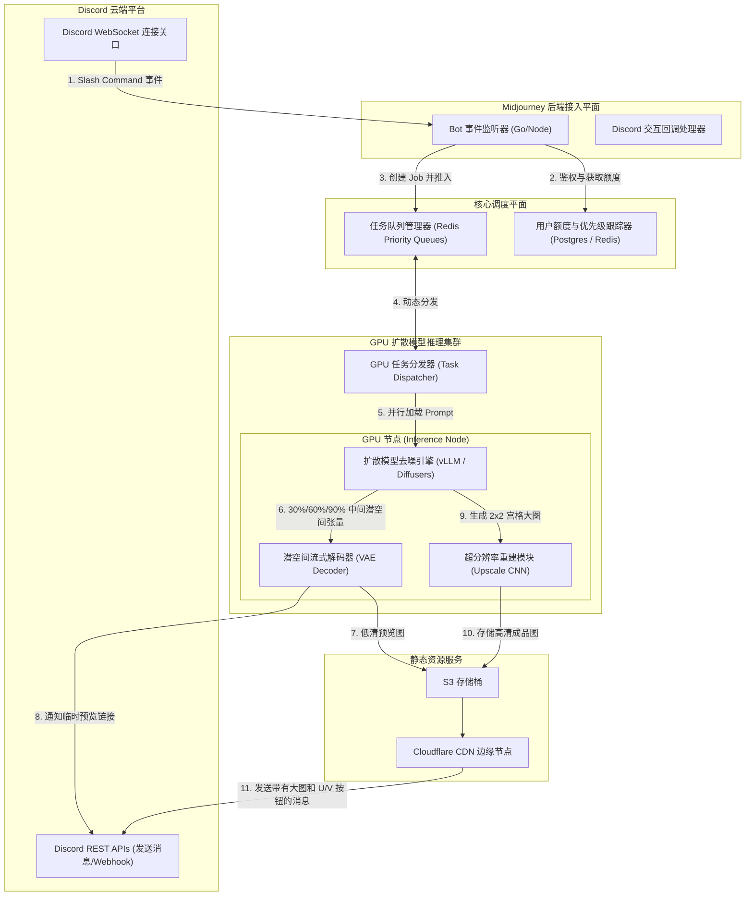
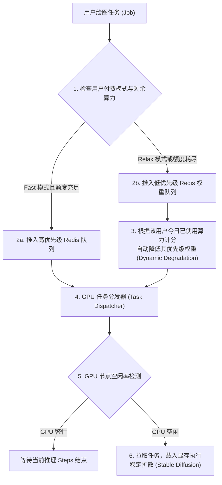
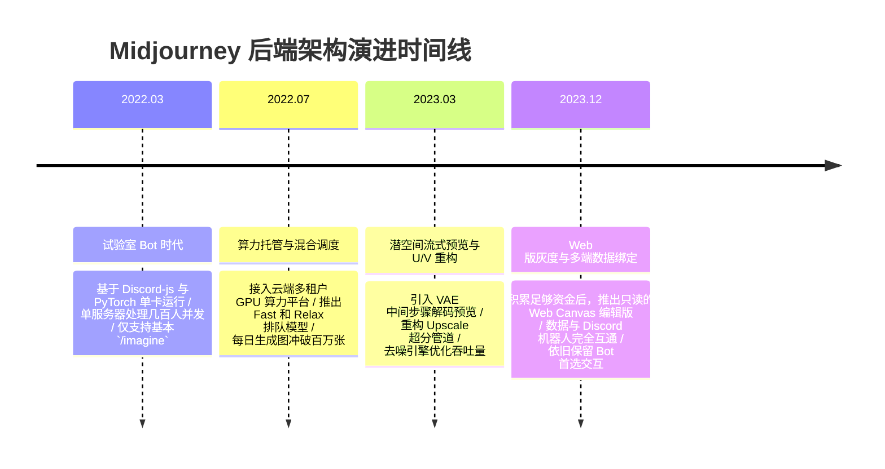

import CaseStudyHeader from '@site/src/components/CaseStudyHeader';
import DesignIntent from '@site/src/components/DesignIntent';
import ArchitectureEvolution from '@site/src/components/ArchitectureEvolution';
import TradeoffExplorer from '@site/src/components/TradeoffExplorer';
import GlossaryTerm from '@site/src/components/GlossaryTerm';
import ResearchNote from '@site/src/components/ResearchNote';
import QuizCard from '@site/src/components/QuizCard';
import CompareSlider from '@site/src/components/CompareSlider';
import GuidedExercise from '@site/src/components/GuidedExercise';

# Midjourney：扩散模型推理与 Discord 前端取舍架构

<CaseStudyHeader
  oneLiner="Midjourney 创造性地放弃了传统的 Web 独立客户端开发，全量绑定 Discord 机器人的富文本交互，将研发力量倾斜于高并发 GPU 优先级调度队列与定制扩散模型（Diffusion Model）的超分辨率多阶段渲染流水线。"
  stats={[
    {label: '发布时间', value: '2022 年'},
    {label: '前端模式', value: 'Discord Bot 专属代理门哨'},
    {label: '调度机制', value: '优先级队列与 Fast / Relax 动态权重'},
    {label: '后端核心', value: 'PyTorch / GPU 算力集群调度'},
    {label: '核心处理流', value: '2x2 宫格预览 + U1-U4 超分重建'}
  ]}
/>

:::info 对应课程概念
本案例横跨 [Month 3 高并发缓存与队列](../data-cache-queue/cache-queues-idempotency)、[Month 5 API 网关与网关路由](../core-components/api-gateway)、[Month 10 经典架构演进](./overview.mdx)。它生动展示了架构设计中“最小可行性产品（MVP）”与“聚焦核心壁垒（算法推理与调度）”的经典工程决策。
:::

## 1. 设计初衷：用“别人的前端”跑自己的 AI

在 Midjourney 诞生之初，DALL-E 2 和 Stable Diffusion 正掀起第一波 AI 绘画热潮。大多数团队都在紧锣密鼓地开发复杂的 Web 交互画布、用户注册付费系统、以及图片画板图层。

Midjourney 团队选择了一条极其另类的路线：**完全不写前端网页，直接将 Discord 当作自己的应用前端**。用户的所有指令（如 `/imagine`）通过 Discord 的 Slash Command 发送；生成过程中的进度图片通过 Discord 的 Webhook 实时回发；图片的精细化放大（Upscale）和变体（Variation）全部映射为 Discord 的交互按钮。这使得仅有 11 个人的核心团队能够避开庞杂的前端和用户体系构建，将全部精力投入到最核心的 **GPU 并发调度算法与模型微调**上。

<DesignIntent
  problem="在有限的团队规模（11人）和极高流量冲击下，快速构建一套支持千万人在线、毫秒级交互反馈、且能高效管理数百张卡进行扩散模型（Diffusion）异步推理的生成系统。"
  users="全球艺术家、创意工作者、设计师、以及数千万 AI 绘图爱好者，要求能以最简单的交互进行生成、变体与精修。"
  devices="支持 Discord 客户端的任意终端（PC、移动端、网页版），通过 Discord WebSocket 网关与 Midjourney 后端建立通信。"
  goals={[
    '零前端快速迭代：通过 Discord Bot 接管用户所有的输入意图，将按钮交互映射为任务图（DAG）的边关系变化。',
    'Fast/Relax 优先级算力路由：设计差异化的任务排队系统。Fast 模式消耗用户购买的算力积分，任务享有最高 GPU 推理优先级；Relax 模式自动降级，在 GPU 物理空闲时以公平分配（Fair-share）算法排队执行。',
    '流式百分比预览（Progress Streaming）：扩散模型去噪通常需要 20~50 个 Steps。系统必须在去噪周期的 30%、60% 阶段提取中间潜空间图像（Latent Space Decoded），流式合成低清预览，通过 Discord 网页反馈给用户以减缓等待焦虑。',
    '超分辨率（Upscale）重建管道：将 2x2 的宫格预览图片切分，支持对选中的子图进行快速二阶超分辨率卷积神经网络（CNN）推理渲染。'
  ]}
  constraints={[
    'Discord 接口的严格流控（Rate Limit）：Discord 对机器人消息的并发频率有严苛限制，必须设计缓冲池防止被 Discord 封禁。',
    'GPU 推理显存的极值抖动：Stable Diffusion 及其变体的推理计算极其消耗显存，需要对长短 Prompt 文本和多尺寸输出做物理显存池化管理。',
    '数据存储与 CDN 带宽开销：每天产生数千万张高清图片，传统的中心化存储会带来高昂的网络出网带宽（Egress）费用，必须与 CDN 边缘网络强力绑定。'
  ]}
  firstStep="开发 Discord Gateway Proxy 监听 bot commands；构建本地任务管理网关，将 `/imagine` 命令解析为带有优先级权重的 Job 结构体；建立基于 Redis 队列的 GPU 动态分发系统。"
/>

## 2. 系统功能全景

以下是 Midjourney 系统的轻量级前端与 GPU 调度计算全景图：



---

## 3. 架构总览

Midjourney 将 Discord 平台作为它的外包表现层，通过网关代理桥接后端的 GPU 调度平面：

### 3a. 系统上下文图 (System Context)



### 3b. 容器架构图 (Container)



---

## 4. 核心机制拆解

### 4a. 零前端的 Discord 交互映射设计

Midjourney 的天才之处在于，用极低的软件工程成本完成了复杂的 UI 闭环。
它将所有复杂的画板功能**全部映射为了 Discord 的消息组件与交互协议**：

```
+-----------------------------------------------------------+
| [用户输入]: /imagine prompt: a red cat in cyber punk style|
+-----------------------------------------------------------+
                             |
                             v (约 45 秒扩散去噪推理)
+-----------------------------------------------------------+
| [返回消息]: (显示 2x2 宫格图片，分辨率 512x512)            |
|                                                           |
|       +-------------------+-------------------+           |
|       |                   |                   |           |
|       |      图 1 (U1)     |      图 2 (U2)     |           |
|       |                   |                   |           |
|       +-------------------+-------------------+           |
|       |                   |                   |           |
|       |      图 3 (U3)     |      图 4 (U4)     |           |
|       |                   |                   |           |
|       +-------------------+-------------------+           |
|                                                           |
|   [U1]  [U2]  [U3]  [U4]   <-- 点击放大选中的子图 (Upscale)   |
|   [V1]  [V2]  [V3]  [V4]   <-- 点击基于选中子图做微调 (Variation) |
+-----------------------------------------------------------+
```

当用户点击 `[U1]` 时：
1. Discord 触发 Interaction Callback，向 Midjourney 回传：`job_id: 82928, action: upscale_1`。
2. 调度层捕获后，无需重新跑整个 Diffusion Steps，而是直接从缓存中或 S3 拉取 `图1` 对应在 VAE 潜空间（Latent Space）中的降噪特征，仅将该子特征切片送入 **Super-Resolution（超分辨率）CNN** 推理，在数秒内输出单张 1024x1024 高清大图。

### 4b. Fast / Relax 动态优先级调度队列

扩散模型推理极其消耗 GPU 周期（通常单张 A100 需要执行 3-8 秒）。为了保证商业化运行，系统设计了 **Fast 和 Relax 混合排队系统**：

- **Fast 模式（高优先级）**：用户直接使用购买的 Fast GPU Hours（付费时间）。
  - 任务被推入 `Redis Priority Queue` 的高优先级通道，调度程序以 `Shortest Job First + Fair-share` 路由，几乎不排队直接进入 GPU 空闲线程。
- **Relax 模式（低优先级）**：用户的 Fast 时间已耗尽，可以使用免费的 Relax 模式无限量画图。
  - 任务进入低优先级通道。系统维护一个由**用户当天使用量（Credit Used）**决定的权重池。使用量越低，权重相对越高；如果用户今天已经画了 100 张图，其后续任务的优先级会自动滑落至尾部，只有在算力集群有空余物理显卡时，才由 GPU 节点捡取执行。



### 4c. 图像去噪潜空间的流式解码预览 (VAE Decoding Stream)

在使用扩散模型生成图片时，如果等最后一步（第 30 步）去噪完成才向用户展示，用户需要面对长达近 1 分钟的“完全黑屏”。

为了改善体验，Midjourney 引入了**潜空间（Latent Space）中间解码器**。
- Stable Diffusion 的核心计算都在低维度的 Latent Space 中进行（如 64x64 矩阵）。
- 每次去噪 10 个 Steps，系统的 VAE Decoder（变分自编码解码器）可以对当前的中间 Latent Tensor 进行一次轻量级的前向推理，恢复出一张色彩微模糊的 512x512 预览图。
- 机器人网关调用 Discord API 更新消息组件，将图片 URL 替换为临时的中间低清预览，让用户在界面上看到图片从“彩色噪声像素点”一步步变清晰的“极具艺术感的渐进过程”。

---

## 5. 架构演进史

Midjourney 从一个简单的 Discord 实验项目快速成为生成式 AI 领域的超级独角兽：



---

## 6. 架构对比

### 经典网页端绘图（DALL-E / Canva）vs Midjourney 机器人模式

<CompareSlider
  before={
    <div style={{ padding: '20px', background: '#ffebee', border: '1px solid #c62828', borderRadius: '8px', height: '100%', color: '#333' }}>
      <strong>传统 Web Canvas 绘图客户端</strong>
      <p style={{ marginTop: '10px', fontSize: '0.9rem' }}>
        需要开发庞大的 Web 图层渲染系统、用户体系、手机 APP 适配、在线客服及独立支付网关。前端开发开销巨大，迭代周期长，需要大量前端开发人员，对小团队是极大的资源分散。
      </p>
    </div>
  }
  after={
    <div style={{ padding: '20px', background: '#e8f5e9', border: '1px solid #2e7d32', borderRadius: '8px', height: '100%', color: '#333' }}>
      <strong>Midjourney 机器人模式 (Bot-First)</strong>
      <p style={{ marginTop: '10px', fontSize: '0.9rem' }}>
        几乎没有前端。交互、用户状态、渲染载体全部托管给 Discord 平台。团队集中精力在 GPU 调度器和 Diffusion 算法调优。借由 Discord 本身的病毒式传播特性，以极低的成本获得爆发性增长。
      </p>
    </div>
  }
  labels={['传统 Web UI', 'Discord 机器人 UI']}
/>

---

## 7. 核心决策的取舍

完全寄生于第三方平台（如 Discord）是一次极具代表性的架构取舍：

<TradeoffExplorer
  title="客户端前端集成策略取舍"
  dimensions={['前端开发与维护成本', '自主控制度与交互自定义', '冷启动用户增长速度', '平台风控与流控 (Rate Limit)', '企业数据合规性']}
  options={[
    {
      name: '完全依赖 Discord / Slack Bot 作为首选前端',
      scores: [5, 1, 5, 2, 2],
      note: '前端开发成本降为零，能利用 Discord 的社交属性引爆用户增长。但交互深度受制于平台组件，面临严格的速率限制，且存在平台封禁的巨大风险。',
      whenToUse: '极小团队在验证算法壁垒时的冷启动阶段、高社交化交互型 AI 应用（如群组共创）。'
    },
    {
      name: '自建 Web Canvas / 独立桌面与移动 App',
      scores: [1, 5, 2, 5, 5],
      note: '拥有 100% 的自主控制权，支持极其细致的图层、交互拖拽和高级微调。但研发成本高昂，多端同步复杂，获客成本高。',
      whenToUse: '拥有充足研发资金的大型成熟 AI 绘画平台、专业级的创作与图像编辑套件。'
    },
    {
      name: 'API 纯接口 SaaS 输出 (仅提供推理 SDK)',
      scores: [4, 1, 2, 4, 4],
      note: '完全省去客户端和大部分运营，专注于推理优化。但缺乏 direct to consumer (D2C) 品牌影响力，完全依赖第三方开发者集成。',
      whenToUse: '纯算力提供商、底层模型技术输出方。'
    }
  ]}
/>

---

## 8. 实践指引：实现一个简易的扩散任务优先级调度调度器

在 GPU 推理场景中，合理的优先级队列与动态分发是提升集群利用率、保障付费用户 TTFT 的基石。

在 `labs/month03/gpu_priority_scheduler/` 目录下（或在下方练习中），实现一个可以管理多 GPU 设备的 Fast/Relax 双队列调度模拟器。

<GuidedExercise
  title="练习指引：写一个 GPU 推理任务双队列调度器"
  goal="用 Python 编写一个高并发的 GPU 推理任务分发器，管理 2 个模拟 GPU 设备，支持将任务划分为 Fast（高优先）和 Relax（低优先）模式，并在 GPU 空闲时执行调度分发。"
  hints={[
    '你可以使用 Python 的 `queue.PriorityQueue` 或双重 `queue.Queue` 来做物理队列隔离。',
    'GPU 设备可以用线程或执行槽（Slot）模拟。利用 `threading.Semaphore` 限制最大并发计算数。',
    '实现动态权重退化：在低优先级队列中，用户今日已运行次数 `used_count` 越大，其任务排序越靠后。'
  ]}
  steps={[
    '定义 `GPUInferenceJob` 结构，包含 `job_id`, `user_id`, `priority_type` (fast/relax), `prompt` 和 `used_count`。',
    '实现 `GPUScheduler` 分发类，初始化 GPU 设备插槽。',
    '编写 `submit_job(job)` 方法，根据模式和用户的 `used_count` 将任务路由进相应的通道。',
    '编写后台分发守护线程，循环监测 GPU 空闲情况，优先从 Fast 队列拉取；若 Fast 为空，则从 Relax 队列按 `used_count` 最小优先规则拉取。',
    '编写单元测试，模拟 10 个并发请求，验证 Fast 任务即使晚提交，也能被 GPU 提前调度执行。'
  ]}
  checks={[
    '当有 Fast 任务排队时，任何新提交的 Relax 任务都必须等待其执行完毕。',
    'Relax 队列中，今天生成次数少（used_count 低）的用户提交的任务，被优先于高频用量的 Relax 任务调度。'
  ]}
/>

---

## 9. 知识自测

完成自测以检验你对轻量前端 bot 代理、GPU 任务调度与扩散模型超分渲染的理解：

<QuizCard
  questions={[
    {
      q: 'Midjourney 为什么选择 Discord 机器人作为其首要的前端交互媒介，而不是自己开发一个 Web 网页？在系统架构上这省去了什么庞杂的工作？',
      options: [
        'A. 因为 Discord 运行速度比 Web 网页快 100 倍',
        'B. 因为这样可以免去开发和维护独立的 Web 前端界面、适配多端（PC/iOS/Android）屏幕、开发和管理独立的账号体系与付费通道；系统可以直接复用 Discord 的社群网络、消息分发机制与第三方按钮回调协议，从而将极度有限的人力倾斜于核心算法调度',
        'C. 因为 Discord 官方免费为 Midjourney 提供所有的 GPU 显卡',
        'D. 因为 Stable Diffusion 只能运行在 Discord 的服务器内，不能运行在公有云上'
      ],
      answer: 1,
      explain: '完全绑定 Discord 让 Midjourney 避开了前端工程的泥潭。这不仅免去了复杂的 UI 开发工作，还极其精妙地白嫖了 Discord 的长连接网络和第三方界面渲染。团队在架构上只需要维护一个高性能的 Bot Proxy，接管 Slash Command 交互，其余繁重的前端渲染、用户状态机更新、图片流式载入，全部转包给了 Discord 客户端本身。'
    },
    {
      q: '在 Midjourney 的 Fast/Relax 调度机制中，Relax（低优先级）队列中使用的“公平分配（Fair-share）”算法是如何根据用户当日用量（used_count）进行动态调度的？',
      options: [
        'A. 当用户的 Fast 算力耗尽后，系统直接禁止其今天继续画图',
        'B. 系统会对 Relax 队列中用户的 used_count 进行实时打分。今日已绘图数较少（used_count 较低）的用户，其新提交的任务在低优先级通道中享有更高的排序；而今日已经消耗巨大算力（used_count 很高）的用户，其任务会被排在 Relax 队列的尾部，只有在系统整体 GPU 有物理闲置时才会被分发执行',
        'C. 无论使用多少，所有的 Relax 任务都在同一毫秒内随机抢占 GPU',
        'D. 强制将使用量过高的用户的电脑网卡进行物理限速'
      ],
      answer: 1,
      explain: '这是典型的“防超限与动态权重降级”策略。在 Relax 队列中，如果不做限制，少数高频脚本或用户会占满所有的 GPU 计算周期，导致普通免费或轻度用户长时间处于等待状态。通过根据 user_id 今日已消费算力进行优先级倒数排序，系统能自动在多租户间进行公平调度，最大化了用户满意度和集群的有效资源利用率。'
    },
    {
      q: '在扩散模型绘图过程中，Midjourney 发送 2x2 宫格预览图之后，提供 [U1-U4] (Upscale) 按钮的核心架构意义是什么？',
      options: [
        'A. 为了干扰用户的选择，让用户必须点击多次',
        'B. 为了节省极其昂贵的 GPU 推理开销。因为直接生成一张 1024x1024 高清大图的去噪计算量和显存开销非常庞大。系统通过先快速生成 2x2 宫格的 512x512 低清大图作为预览（仅消耗 1 次常规 Diffusion GPU 周期），在用户明确选中某张（如点击 U1）后，再针对性地对选中的子潜空间张量做超分辨率渲染，极大降低了集群的平均算力负载与首图延迟',
        'C. 为了防止生成的图片体积太大导致网络带宽崩溃',
        'D. 为了证明系统能够将四张图片粘在一起'
      ],
      answer: 1,
      explain: '这是一种极其高效的“多阶段按需渲染”设计（Month 3）。直接生成高分辨率图的算力开销是指数级膨胀的。通过 2x2 网格提供预览，用户能快速淘汰不合心意的产物（这部分废图占了 70% 以上）。只有用户点击 U1-U4 确定想要某张图时，系统才会动用 GPU 资源针对性执行超分辨率重组（Super-Resolution）渲染，极大地节省了整体 GPU 算力资源，并避免了大部分无意义的高清图计算和存储浪费。'
    }
  ]}
/>

## 来源

- [Midjourney Documentation and official server architecture blog](https://docs.midjourney.com/)
- [Stable Diffusion: High-Resolution Image Synthesis with Latent Diffusion Models (Rombach et al., CVPR '22)](https://arxiv.org/abs/2112.10752)
- [Discord Developer Portal: Slash Commands and Interaction callback lifecycles](https://discord.com/developers/docs/interactions/application-commands)
- [ESRGAN: Enhanced Super-Resolution Generative Adversarial Networks (Wang et al., ECCV '18)](https://arxiv.org/abs/1809.00219)