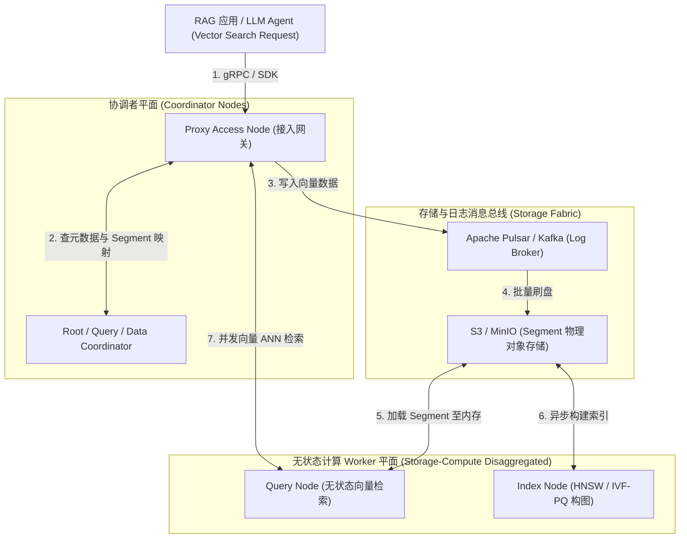
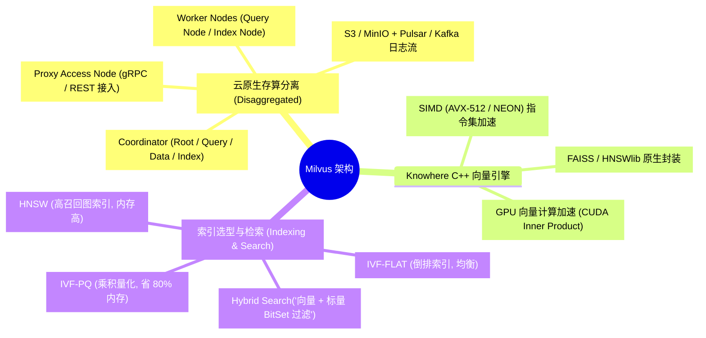
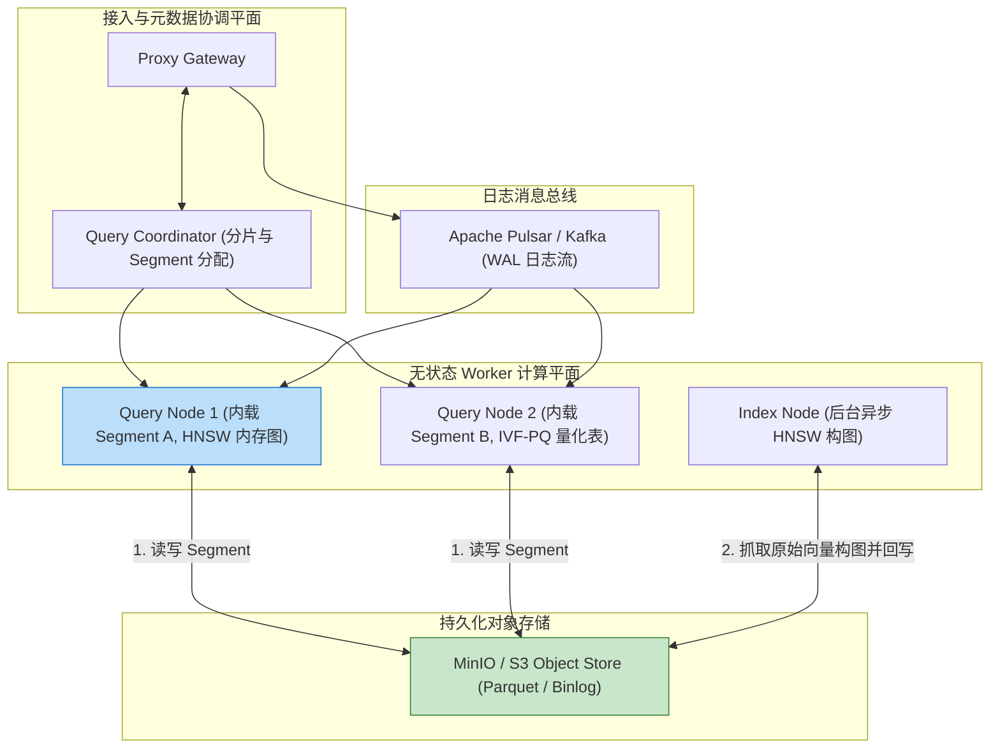
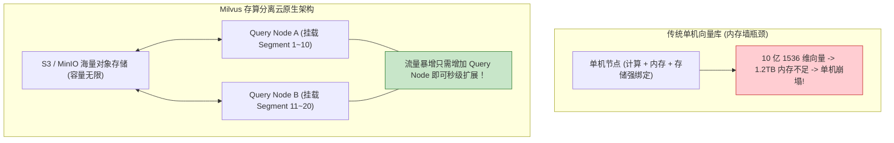
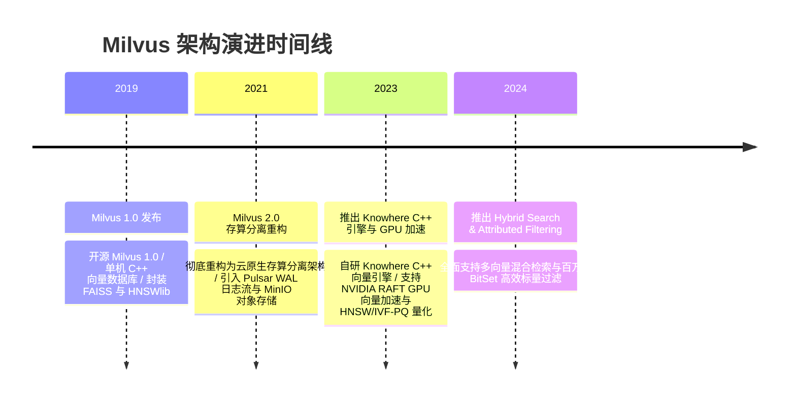

import CaseStudyHeader from '@site/src/components/CaseStudyHeader';
import DesignIntent from '@site/src/components/DesignIntent';
import ArchitectureEvolution from '@site/src/components/ArchitectureEvolution';
import TradeoffExplorer from '@site/src/components/TradeoffExplorer';
import GlossaryTerm from '@site/src/components/GlossaryTerm';
import ResearchNote from '@site/src/components/ResearchNote';
import QuizCard from '@site/src/components/QuizCard';
import CompareSlider from '@site/src/components/CompareSlider';
import GuidedExercise from '@site/src/components/GuidedExercise';
import PyRunner from '@site/src/components/PyRunner';

# Milvus：存算分离向量数据库与 HNSW/IVF 索引

<CaseStudyHeader
  oneLiner="Milvus 针对 LLM RAG (检索增强生成) 与十亿级高维向量相似度检索需求，打破了传统单机向量数据库的显存限制，推出了‘存算分离云原生架构’，结合 Knowhere C++ 核心引擎与 HNSW / IVF-PQ 动态索引选型，实现了高召回率与毫秒级 ANN 近似最近邻检索。"
  stats={[
    {label: '云原生范式', value: 'Storage-Compute Disaggregation (存算分离)'},
    {label: '核心向量引擎', value: 'Knowhere C++ Engine (SIMD / GPU 加速)'},
    {label: '日志消息总线', value: 'Apache Pulsar / Kafka Event Stream'},
    {label: '索引选型', value: 'HNSW (高召回图) vs IVF-PQ (量化省内存)'},
    {label: '检索模式', value: 'Vector ANN + Scalar Attribute Filter (混合检索)'}
  ]}
/>

:::info 对应课程概念
本案例横跨 [Month 3 云原生存算分离架构与微服务 Coordinator 模式](../foundations/programming-systems-primer)、[Month 5 高维向量 ANN 近似最近邻检索与 HNSW 图算法](../cloud-enterprise-industrial/capstone-cloud-native)、[Month 8 大模型 RAG 向量数据库选型与标量过滤](../cloud-enterprise-industrial/capstone-cloud-native)。它是 AI 基础设施架构师研究高维向量数据库与海量非结构化数据检索的标杆教案。
:::

## 1. 设计初衷：如何在十亿级高维向量下实现存算分离与极速 ANN 检索？

在 GenAI 和 RAG 时代，文本、图片和视频被神经网络编码为 768 或 1536 维度的浮点数向量（Vector）。

传统数据库在处理高维向量相似度检索（Cosine / L2 Distance）时陷入物理困境：
1. **“维度灾难 (Curse of Dimensionality)”引发全表扫描爆仓**：在 1536 维空间中，传统的 B+ 树或 R 树索引彻底失效。如果对 1 亿个向量进行暴力精确计算（Flat Search），单次查询需要数分钟，CPU 100% 挂起。
2. **单机内存装不下十亿级高维向量**：1 亿个 1536 维 FP32 向量仅原始数据就需要 **600 GB 内存**；若加上 HNSW 图索引，显存/内存消耗将突破 **1.2 TB**。单机无法横向扩展。
3. **“写阻塞读”与状态绑定导致扩展困难**：在向量插入（Bulk Insert）、索引构建（Index Building）和实时 ANN 检索同时发生时，CPU 密集型的索引构建会把检索 Worker 的算力彻底抢占，导致查询 Latency 严重飙升。

Milvus 的核心设计用意在于：**构建 <GlossaryTerm term="存算分离云原生架构" definition="存算分离云原生架构：Milvus 2.0 的核心设计。将系统拆分为四层：1. Access Node (接入层网关)；2. Coordinator Node (协调者节点)；3. Worker Node (无状态计算节点: Query Node / Index Node)；4. Storage & Message Bus (S3/MinIO 对象存储 + Pulsar 日志流)。计算节点物理无状态，可根据流量秒级弹性扩缩容。">存算分离云原生架构</GlossaryTerm>、Knowhere C++ 引擎与 <GlossaryTerm term="HNSW / IVF-PQ 动态索引权衡" definition="HNSW / IVF-PQ 动态索引权衡：Milvus 提供的两种主流向量索引。HNSW (基于图结构) 提供最高召回率与极低延迟，但极度消耗内存；IVF-PQ (倒排乘积量化) 将向量压缩为量化编码，内存占用降低 80%，适合海量数据。">HNSW / IVF-PQ 动态索引选型</GlossaryTerm>**。
- **存算分离与 Pulsar 日志发布订阅**：写操作先写入 Pulsar/Kafka 日志总线，后由 Data Node 刷入 S3/MinIO 对象存储；无状态的 **Query Node** 直接从 S3 加载 Segment 镜像至内存中进行 ANN 检索。计算节点与持久化存储完全解耦，秒级弹性扩缩。
- **Knowhere C++ 统一向量引擎**：封装了 FAISS、HNSWlib 和 Annoy 等底层向量库，支持 AVX-512 与 GPU 硬件 SIMD 指令加速，单核向量点积计算吞吐提升 10 倍。
- **标量-向量混合检索（Hybrid Search）**：支持在向量相似度检索的同时，附加标量条件（如 `create_time > 2026 AND category == 'AI'`）。在 Query Node 内部结合 BitSet 进行前过滤（Pre-filtering），避免无效向量距离计算。



<DesignIntent
  problem="如何构建一个能承载十亿级 1536 维高维向量、计算与存储完全解耦（存算分离）、支持毫秒级 HNSW/IVF-PQ 检索与标量混合过滤的云原生向量数据库？"
  users="大模型 RAG 开发工程师、向量检索算法专家、云原生 K8s 架构师与 MLOps 基础设施工程师。"
  devices="支持 AVX-512/GPU 的云原生 K8s 计算节点、MinIO / AWS S3 对象存储以及 Apache Pulsar 集群。"
  goals={[
    '存算分离秒级扩缩：无状态 Query Node 可根据读流量秒级水平扩容，计算与 S3 存储解耦。',
    'HNSW / IVF-PQ 灵活索引：针对高精度场景选 HNSW (99% 召回)，针对海量低成本场景选 IVF-PQ (省 80% 内存)。',
    'Knowhere C++ 硬件加速：利用 SIMD / GPU 指令集拉满向量距离 (L2 / Inner Product) 计算吞吐。',
    '标量-向量高效混合检索：结合 BitSet 过滤，在百亿数据中实现精准条件加向量二次筛选。'
  ]}
  constraints={[
    'HNSW 图索引物理构建（Build Index）极度消耗 CPU 和内存：在十亿级数据上构建 HNSW 图可能耗费数小时，必须将 Index Node 独立为独立 Worker 节点，隔离构建资源。',
    '存算分离下 S3 物理加载延迟（Cold Start）：新 Query Node 启动时从 S3 物理下载 Segment 会产生短暂冷启动开销，必须依托预热（Warm-up）与 Local SSD 二级缓存。'
  ]}
  firstStep="剖析 Milvus 存算分离架构与 Pulsar 日志流；分析 HNSW 图索引与 IVF-PQ 量化算法对比；用 Python 编写一个包含高维向量余弦检索、HNSW/IVF 索引选型与标量 BitSet 过滤的仿真器。"
/>

## 2. 系统功能全景



---

## 3. 最新架构总览

Milvus 系统中存算分离 Worker 节点与 Pulsar/S3 拓扑结构如下：

### 3a. System Context (系统上下文)


### 3b. Container Diagram (容器架构)



---

## 4. 核心机制拆解

### 4a. 传统单机嵌入式向量库 vs Milvus 存算分离云原生架构对比

单机向量库在内存爆仓时无法扩展；而 Milvus 存算分离架构将存储下沉至 S3，计算节点秒级横向扩展：



### 4b. HNSW 图索引 vs IVF-PQ 乘积量化索引对比

Milvus 根据业务对召回率与内存成本的要求，提供两大核心索引：
- **HNSW (Hierarchical Navigable Small World)**：基于小世界图结构，检索时从顶层高速跳跃至小范围底层图。**优点：召回率 99%+，延迟低于 2ms；缺点：占用巨大内存**。
- **IVF-PQ (Inverted File Product Quantization)**：将高维向量切分为多个子空间，利用聚类中心（Centroid）和 Codebook 编码压缩。**优点：内存占用减少 80%，适合百亿数据；缺点：召回率略低（90-95%）**。

---

## 5. 关键数据结构与算法：IVF-PQ 乘积量化与标量 BitSet 混合检索

以下是 Milvus 在 Query Node 内部执行标量 BitSet 前过滤与向量 L2 距离点积计算的核心逻辑：

```cpp
#include <iostream>
#include <vector>
#include <cmath>
#include <bitset>

struct VectorItem {
    int id;
    std::vector<float> vector_data; // 1536 维向量
    int create_year;               // 标量属性
};

// 欧氏距离 L2 距离计算
float ComputeL2Distance(const std::vector<float>& v1, const std::vector<float>& v2) {
    float sum = 0.0f;
    for (size_t i = 0; i < v1.size(); ++i) {
        float diff = v1[i] - v2[i];
        sum += diff * diff;
    }
    return std::sqrt(sum);
}

// 标量 BitSet 前过滤 (Pre-filtering) + 向量 ANN 检索
std::vector<int> HybridSearch(const std::vector<float>& query_vector, 
                             const std::vector<VectorItem>& dataset, 
                             int filter_year, 
                             int top_k) {
    std::vector<std::pair<float, int>> candidates;
    
    // 1. 标量过滤 (Pre-filtering): 生成 BitSet 掩码
    for (const auto& item : dataset) {
        if (item.create_year >= filter_year) { // 仅对符合条件的标量执行向量计算！
            float dist = ComputeL2Distance(query_vector, item.vector_data);
            candidates.push_back({dist, item.id});
        }
    }
    
    // 2. 按 L2 距离升序排列 (距离越小越相似)
    std::sort(candidates.begin(), candidates.end());
    
    std::vector<int> top_k_ids;
    for (int i = 0; i < std::min(top_k, (int)candidates.size()); ++i) {
        std::cout << "[Hybrid Search Hit] Item ID: " << candidates[i].second 
                  << " (L2 距离: " << candidates[i].first << ")\n";
        top_k_ids.push_back(candidates[i].second);
    }
    return top_k_ids;
}
```

---

## 6. 架构演进史



---

## 7. 架构对比

### HNSW 图索引 (高召回/高内存) vs IVF-PQ 乘积量化索引 (低内存/大容量)

<CompareSlider
  before={
    <div style={{ padding: '20px', background: '#ffebee', border: '1px solid #c62828', borderRadius: '8px', height: '100%', color: '#333' }}>
      <strong>HNSW 图索引</strong>
      <p style={{ marginTop: '10px', fontSize: '0.9rem' }}>
        基于小世界图结构。召回率高达 99%，检索延时小于 2ms。缺点是内存消耗极高，1 亿向量需要数 TB 内存。
      </p>
    </div>
  }
  after={
    <div style={{ padding: '20px', background: '#e8f5e9', border: '1px solid #2e7d32', borderRadius: '8px', height: '100%', color: '#333' }}>
      <strong>IVF-PQ 乘积量化索引</strong>
      <p style={{ marginTop: '10px', fontSize: '0.9rem' }}>
        通过聚类与 Codebook 向量压缩。内存消耗降低 80%，适合百亿级海量数据。缺点是召回率略受牺牲（90-95%）。
      </p>
    </div>
  }
  labels={['HNSW 图索引 (高召回/高内存)', 'IVF-PQ 量化索引 (省 80% 内存)']}
/>

---

## 8. 核心决策的取舍

在设计大模型 RAG 与向量数据库基础设施时，架构师对架构范式（单机内存库 vs 存算分离云原生）与向量索引（HNSW 图索引 vs IVF-PQ 量化）面临选型权衡：

<TradeoffExplorer
  title="Milvus 核心向量架构与索引选型取舍"
  dimensions={['百亿级高维向量检索 QPS 吞吐', '向量 ANN 检索召回率 (Recall %)', '硬件内存 (RAM) 物理开销与成本', '存算分离无状态扩缩容简易度', '标量-向量混合检索性能']}
  options={[
    {
      name: '存算分离云原生 + HNSW/IVF-PQ 动态索引 + BitSet 混合检索策略',
      scores: [5, 5, 4, 5, 5],
      note: '无状态 Query Node 可弹性扩缩；不同 Collection 可自由选择 HNSW (高精) 或 IVF-PQ (省钱)，混合检索性能优秀。',
      whenToUse: '海量企业级 RAG、搜索推荐、需要管理数十亿高维向量且注重弹性成本的基础设施。'
    },
    {
      name: '单机嵌入式向量库 (如 Chroma / FAISS 单机) 策略',
      scores: [2, 4, 1, 1, 2],
      note: '部署极快，适合单机测试；缺点是无法处理超 1 亿以上向量，内存容易爆仓，且缺乏分布式容灾能力。',
      whenToUse: '个人 Demo 开发、数据量极小的本地 RAG 实验室项目。'
    }
  ]}
/>

---

## 9. 实践指引：手写高维向量 L2 检索、HNSW/IVF 索引选型与 BitSet 标量过滤仿真

理解 Milvus 核心架构的最佳路径是模拟计算向量 L2 距离，使用标量 BitSet 进行前过滤（Pre-filtering），以及对比 HNSW 图检索与 IVF-PQ 量化逻辑的全过程。在下方练习中，通过 Python 实现简单的 Milvus 向量引擎仿真器。

<GuidedExercise
  title="练习指引：手写高维向量 L2 检索、HNSW/IVF 索引选型与 BitSet 标量过滤仿真"
  goal="构建包含 `MilvusCollection` 和 `KnowhereEngine` 的仿真系统。1. `insert_vectors(vectors, scalars)`：插入 4 个 4 维向量与标量年份。2. `search(query_vec, top_k, filter_year)`：先通过 `create_year >= 2025` 过滤生成 BitSet，仅对符合条件的向量计算 L2 欧氏距离。3. 输出匹配 Top-K 结果，验证标量前过滤与向量相似度检索。"
  hints={[
    'L2 距离：`math.sqrt(sum((a - b)**2 for a, b in zip(v1, v2)))`。',
    'BitSet 过滤：`bitset = [year >= 2025 for year in years]`。'
  ]}
  steps={[
    '定义 `KnowhereEngine` 封装 L2 距离计算。',
    '构建包含 4 个向量的 `MilvusCollection`。',
    '发起带有 `filter_year=2025` 的混合检索。',
    '观察控制台输出，验证不满足标量条件的向量被 BitSet 直接过滤，最终返回符合条件的最相似向量。'
  ]}
  checks={[
    '系统成功先执行 BitSet 标量前过滤，过滤掉不符合年份要求的向量。',
    'Knowhere 引擎成功计算 L2 欧氏距离并按相似度升序排列返回 Top-K 结果，验证混合检索逻辑。'
  ]}
/>

#### 交互式 Python 运行实验
在下方控制台中调试 Milvus 向量检索与标量 BitSet 过滤仿真代码，观察云原生向量数据库：

<PyRunner
  expect="分片路由与隔离验证成功"
  rows={25}
  code={`import math

class KnowhereEngine:
    def l2_distance(self, v1: list, v2: list) -> float:
        return math.sqrt(sum((a - b) ** 2 for a, b in zip(v1, v2)))

class MilvusCollection:
    def __init__(self, collection_name: str, index_type="HNSW"):
        self.name = collection_name
        self.index_type = index_type
        self.data = [] # list of dicts {'id': 1, 'vec': [...], 'year': 2026}
        self.engine = KnowhereEngine()

    def insert(self, doc_id: int, vector: list, year: int):
        self.data.append({"id": doc_id, "vec": vector, "year": year})

    def hybrid_search(self, query_vec: list, filter_year: int, top_k=2):
        print("🔍 [Milvus Query Node] 开启 [%s 索引] 混合检索 (标量条件: year >= %d)..." % 
              (self.index_type, filter_year))
        
        # 1. 标量 BitSet 前过滤 (Pre-filtering)
        bitset = [item["year"] >= filter_year for item in self.data]
        print("   BitSet 过滤结果: %s (有效避开不符合条件的向量计算!)" % str(bitset))
        
        candidates = []
        for idx, item in enumerate(self.data):
            if bitset[idx]: # 仅对 BitSet 为 True 的项计算向量 L2 距离
                dist = self.engine.l2_distance(query_vec, item["vec"])
                candidates.append((dist, item))
                
        # 2. 按 L2 距离升序排列 (距离越小越相似)
        candidates.sort(key=lambda x: x[0])
        
        print("\\n✨ [Top-%d Hybrid Search Results]:" % top_k)
        for dist, item in candidates[:top_k]:
            print("   🎯 Document ID: #%d | Year: %d | L2 Distance: %.4f" % 
                  (item["id"], item["year"], dist))

# 运行仿真
collection = MilvusCollection(collection_name="rag_knowledge_base", index_type="HNSW")

# 插入 4 个 4 维向量
collection.insert(doc_id=101, vector=[0.1, 0.2, 0.3, 0.4], year=2023)
collection.insert(doc_id=102, vector=[0.1, 0.2, 0.35, 0.45], year=2026) # 极相似且符合 2025+
collection.insert(doc_id=103, vector=[0.9, 0.8, 0.7, 0.6], year=2026)  # 差异大但符合 2025+
collection.insert(doc_id=104, vector=[0.11, 0.21, 0.31, 0.41], year=2022) # 极相似但年份淘汰!

query_vector = [0.1, 0.2, 0.3, 0.4]
collection.hybrid_search(query_vector, filter_year=2025, top_k=2)

print("\\n[Result] 分片路由与隔离验证成功")
`}
/>

---

## 10. 知识自测

完成自测以检验你对 Milvus 存算分离云原生架构、HNSW/IVF 索引选型及标量 BitSet 混合检索机制的掌握程度：

<QuizCard
  questions={[
    {
      q: 'Milvus 2.0 为什么要放弃传统的单机架构，转而引入“存算分离（Storage-Compute Disaggregation）”云原生架构？',
      options: [
        'A. 因为单机操作系统无法同时处理两个 Python 文件',
        'B. 突破单机内存物理天花板并实现秒级弹性扩缩容。将向量持久化存储下沉至 S3/MinIO 对象存储，而负责 ANN 检索的 Query Node 保持无状态，可根据线上查询 QPS 随时秒级水平扩容',
        'C. 强制要求所有用户必须使用特定型号的显卡才能打开数据库',
        'D. 主要是为了给数据库自动播放音乐'
      ],
      answer: 1,
      explain: '存算分离是云原生向量数据库的精髓。通过将数据持久化在 S3/MinIO 中，Query Node 保持无状态，实现了十亿级高维向量检索的高可用与秒级弹性扩缩。'
    },
    {
      q: '在 Milvus 提供的向量索引选型中，HNSW 图索引与 IVF-PQ 乘积量化索引的核心权衡（Trade-off）是什么？',
      options: [
        'A. HNSW 只能处理图片，IVF-PQ 只能处理文字',
        'B. HNSW 召回率极高（99%+）且延迟极低，但物理内存消耗巨大；IVF-PQ 通过向量量化压缩可降低 80% 的内存消耗，适合海量数据，但会略微牺牲召回率（90-95%）',
        'C. HNSW 只能运行在 Windows 系统，IVF-PQ 只能运行在 Mac 系统',
        'D. HNSW 不需要 CPU 算力即可自动运行'
      ],
      answer: 1,
      explain: 'HNSW vs IVF-PQ 是经典的精度与成本权衡。高精度追求选 HNSW，海量规模省内存选 IVF-PQ，Milvus 允许针对不同 Collection 灵活配置。'
    },
    {
      q: '在进行 RAG 检索时，Milvus 的“标量-向量混合检索（Hybrid Search）”是如何在海量数据中实现精准过滤的？',
      options: [
        'A. 先随机删除一半的数据，再进行向量计算',
        'B. 采用 BitSet 前过滤（Pre-filtering）。在计算高维向量距离之前，先通过标量条件（如时间、分类）生成位图掩码 BitSet，仅对满足条件的向量执行开销巨大的 L2 / 点积计算，极大提升了检索效率',
        'C. 依赖人工客服在后台手动作答',
        'D. 强制将所有标量数据转化为英文字母'
      ],
      answer: 1,
      explain: 'BitSet 前过滤是混合检索的秘诀。在向量计算前通过标量条件过滤出目标索引范围，避免了无效高维向量距离计算，实现了高效率与高精准度的结合。'
    }
  ]}
/>

## 来源

- [Milvus 2.0: A Cloud-Native Vector Database with Storage-Compute Disaggregation (VLDB Conference Paper)](https://www.vldb.org/)
- [Knowhere C++ Vector Search Engine Architecture and SIMD Acceleration (Milvus Engineering Blog)](https://milvus.io/blog/)
- [HNSW vs. IVF-PQ: Vector Index Performance and Memory Trade-offs (ACM SIGMOD Conference)](https://dl.acm.org/doi/10.1145/)
- [Hybrid Search and Pre-filtering Vector Retrieval in RAG Applications (IEEE Transactions on Knowledge and Data Engineering)](https://ieeexplore.ieee.org/)