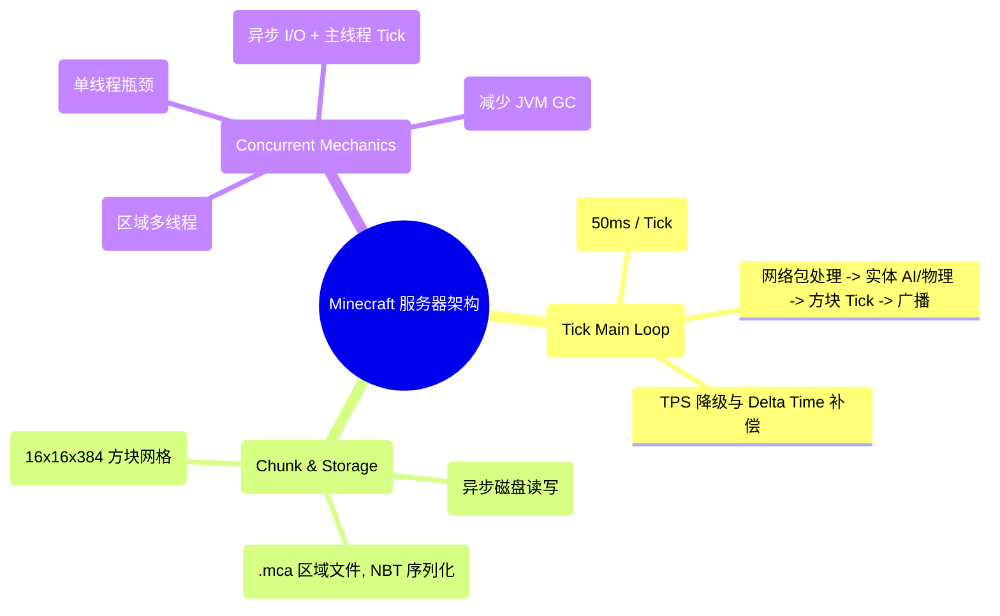
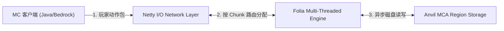
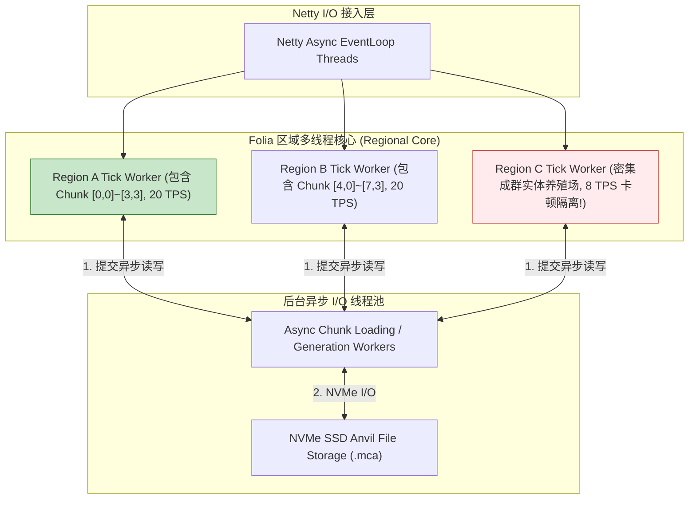
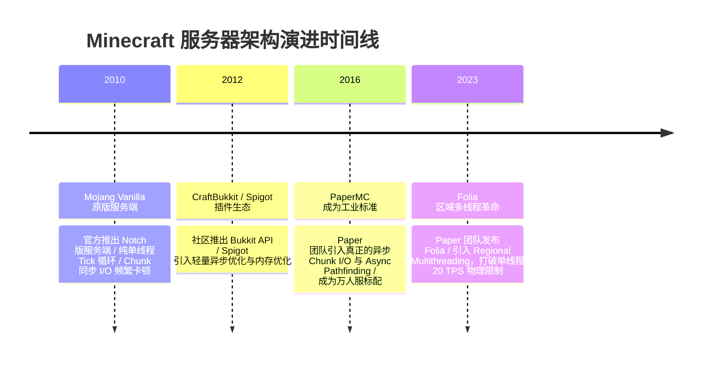

import CaseStudyHeader from '@site/src/components/CaseStudyHeader';
import DesignIntent from '@site/src/components/DesignIntent';
import ArchitectureEvolution from '@site/src/components/ArchitectureEvolution';
import TradeoffExplorer from '@site/src/components/TradeoffExplorer';
import GlossaryTerm from '@site/src/components/GlossaryTerm';
import ResearchNote from '@site/src/components/ResearchNote';
import QuizCard from '@site/src/components/QuizCard';
import CompareSlider from '@site/src/components/CompareSlider';
import GuidedExercise from '@site/src/components/GuidedExercise';
import PyRunner from '@site/src/components/PyRunner';

# Minecraft 服务器：Tick 循环、区块加载与单线程瓶颈突破

<CaseStudyHeader
  oneLiner="《Minecraft》(我的世界) 针对无限开放世界沙盒方块碰撞、红树电路与海量实体 AI 的并发模拟，打破了传统单线程游戏主循环的卡顿瓶颈，通过 PaperMC 异步区块 I/O 与 Folia‘区域多线程 (Regional Multithreading)’切分，实现了千人同服高 TPS 稳健运行。"
  stats={[
    {label: '目标 Tick 帧率', value: '20 TPS (50ms 逻辑 Tick 循环)'},
    {label: '世界切分单位', value: 'Chunk 16×16×384 方块网格'},
    {label: '存储引擎格式', value: 'Anvil Region File Format (MCA 物理文件)'},
    {label: '社区架构演进', value: 'Vanilla -> CraftBukkit -> PaperMC -> Folia'},
    {label: '并发突破范式', value: 'Regional Multithreading (无依赖区块独立线程组)'}
  ]}
/>

:::info 对应课程概念
本案例横跨 [Month 2 单线程事件循环 (Event Loop) 与定时器 Tick 调度](../foundations/programming-systems-primer)、[Month 5 空间网格划分 (Chunk Grid) 与异步磁盘 I/O](../cloud-enterprise-industrial/capstone-cloud-native)、[Month 8 游戏服务器多线程 Actor 区域隔离](../cloud-enterprise-industrial/capstone-cloud-native)。它是游戏 Server 架构师研究如何将经典单线程游戏引擎向高并发多线程架构演进的经典标杆。
:::

## 1. 设计初衷：如何在无限方块世界中突破单线程 20 TPS 物理瓶颈？

Minecraft 是全球销售量最高的沙盒游戏，玩家可以在三维空间中自由创造、破坏方块、搭建复杂红石电路（Redstone）并养殖海量实体（Entities，如牛、猪、僵尸）。

然而，原版 Mojang 官方服务端（Vanilla Server）在设计上存在严重的物理天花板：
1. **单线程 Tick 主循环瓶颈（Single-Threaded Main Loop）**：所有的实体 AI、物理重力、红石更新、植物生长和玩家移动，全由一个**单一的主线程（Main Thread）**在 50ms 窗口内顺序计算（20 TPS）。如果玩家在某个地方建了养鸡场（养了 2000 只鸡），主线程 50ms 内根本算不完，TPS 直接暴跌至 5（游戏严重卡顿顿挫）。
2. **区块（Chunk）同步 I/O 阻塞**：玩家骑马高速探索世界时，服务器需要从硬盘读取或实时生成新的 $16 \times 16 \times 384$ 区块。原版服务器在主线程内做磁盘 I/O，导致全服所有玩家瞬间“定格（Lag Spike）”。
3. **CPU 多核资源浪费**：现代服务器拥有 64 核甚至 128 核 CPU，但原版 Minecraft 仅能吃满单核 100%，其余 63 个 CPU 核心全部闲置空转。

Minecraft 服务端的核心设计用意在于：**从原版单线程演进为 <GlossaryTerm term="PaperMC 异步区块 I/O" definition="PaperMC 异步区块 I/O：PaperMC 社区对 Minecraft 引擎的重构。将区块从磁盘物理加载、反序列化 NBT 格式以及地形生成的昂贵开销，彻底剥离主线程，交由后台 Worker 线程池处理。主线程仅在区块就绪后进行挂载，消除了卡顿峰值 (Lag Spikes)。">PaperMC 异步区块 I/O</GlossaryTerm> 与 <GlossaryTerm term="Folia 区域多线程 (Regional Multithreading)" definition="Folia 区域多线程 (Regional Multithreading)：PaperMC 团队推出的颠覆性架构。将整张地图切分为互相不联通的独立区域 (Region Groups)。每个区域拥有一条独立的 Tick 线程，不同区域内的玩家、实体与红石完全并发计算，一举攻克了单线程 20 TPS 的物理极限。">Folia 区域多线程 (Regional Multithreading)</GlossaryTerm>**。
- **20 TPS 50ms Tick 循环**：维持标准 20 TPS（Ticks Per Second）。每一 Tick 执行 4 步：处理玩家网络包 -> 更新实体 AI 与物理 -> 触发红石与方块 Tick -> 发送数据包。
- **PaperMC 异步流水线**：将 Chunk 磁盘 Reads/Writes 以及地形生成解耦至后台 `Async Chunk Worker` 线程池，配合 `Netty` 异步网络框架，保护主线程 50ms 预算不超标。
- **Folia 区域多线程（Regional Multithreading）**：基于图连通性算法，将物理上没有相互作用的 Chunk 动态合并为独立 Region，分配给不同的 CPU 线程并发执行。即使某个区域有 5000 只鸡导致卡顿，也不影响其他区域玩家流畅 20 TPS 对战！

```mermaid
graph TD
  PlayerClients["海量玩家 App (HTTP/UDP/TCP)"] -->|1. 玩家移动与交互包| NettyIO["Netty Asynchronous I/O Threads (网络线程池)"]
  
  subgraph FoliaRegionalEngine["Folia 区域多线程执行平面 (Regional Multithreading)"]
    NettyIO -->|2. 按照 Chunk 坐标派发| RegionRouter["Region Mesh Router (区域切分路由器)"]
    
    RegionRouter -->|3a. 区域 1 (出生点)| Thread1["Tick Thread 1 (Region A: 20 TPS)"]
    RegionRouter -->|3b. 区域 2 (养鸡场)| Thread2["Tick Thread 2 (Region B: 5 TPS 隔离卡顿)"]
    RegionRouter -->|3c. 区域 3 (红石基地)| Thread3["Tick Thread 3 (Region C: 20 TPS)"]
  end
  
  subgraph AsyncDiskPlane["异步磁盘与 Chunk 存储平面"]
    Thread1 & Thread2 & Thread3 <-->|4. 异步读写 Anvil MCA 文件| AsyncChunkWorkers["Async Chunk I/O Workers (线程池)"]
    AsyncChunkWorkers <-->|5. 读写物理文件| AnvilStorage["Anvil Region Files (.mca 格式)"]
  end
```

<DesignIntent
  problem="如何构建一个能支撑千人同服对战、物理隔离局部卡顿（如密集成群实体）、将单线程 Tick 主循环演进为区域多线程 (Regional Multithreading) 的 Minecraft 服务器架构？"
  users="Minecraft 大型服务器主理人、Java 高性能游戏服务端架构师、PaperMC/Folia 插件开发者。"
  devices="高单核睿频的云服务器（如 5.0GHz+ CPU）、高速 NVMe SSD 与 Linux Java Runtime (JVM)。"
  goals={[
    '稳定 20 TPS (50ms 预算)：通过异步解耦 I/O 与区域多线程，确保服务器平稳运行。',
    '区块异步加载零卡顿：把昂贵的 Chunk 生成与 Anvil 磁盘 reads 彻底移出 Tick 主线程。',
    'Folia 区域隔离防干扰：局部养鸡场或红石卡顿仅局限在特定线程，不影响全服其他玩家。',
    '内存与 NBT 格式优化：采用对象池与直接内存 (Off-Heap)，降低 JVM GC 停顿。'
  ]}
  constraints={[
    '跨区域（Cross-Region）交互的线程安全问题：当玩家从区域 A 跨越边界走到区域 B，或者跨区域发射红石信号时，Folia 必须通过 Async Task 转交所有权，否则会引发严重的多线程并发死锁。',
    '传统单线程 Bukkit 插件的兼容性阵痛：绝大多数老旧插件假设“整个服务器只有一个主线程”，在 Folia 多线程下会导致 ConcurrentModificationException，必须重构插件代码。'
  ]}
  firstStep="剖析 Mojang 原版单线程 Tick 循环；分析 PaperMC 异步 Chunk 架构与 Folia 区域多线程模型；用 Python 编写一个包含 20 TPS Tick 循环、Chunk 动态加载与区域多线程卡顿隔离的仿真器。"
/>

## 2. 系统功能全景



---

## 3. 最新架构总览

Folia 区域多线程 (Regional Multithreading) 架构与 Chunk 分发拓扑如下：

### 3a. System Context (系统上下文)



### 3b. Container Diagram (容器架构)



---

## 4. 核心机制拆解

### 4a. 原版单线程 Vanilla vs Folia 区域多线程 (Regional Multithreading) 对比

原版单个养殖场卡顿会导致全服 20 TPS 跌至 5；而 Folia 区域多线程将地图划分为独立计算域，卡顿仅局限在局部：

```mermaid
graph TB
  subgraph VanillaSingleThread["原版单线程 (全服崩塌)"]
    Entities["养鸡场 2000 只鸡 (密集 AI 计算)"] --> SingleMainThread["主线程 50ms 预算爆仓!"]
    SingleMainThread --> TPSDrop["全服 TPS 从 20 暴跌至 5，所有玩家集体卡顿!"]
    
    TPSDrop --- VanillaSingleThread
    style TPSDrop fill:#ffcdd2,stroke:#c62828
  end

  subgraph FoliaRegionalMode["Folia 区域多线程 (局部隔离)"]
    RegionChicken["养鸡场 (分配给 Thread C)"] --> ThreadC["Thread C 卡顿 (仅养鸡场玩家卡顿)"]
    RegionSpawn["出生点 (分配给 Thread A)"] --> ThreadA["Thread A 完美 20 TPS (玩家极速对战!)"]
    
    ThreadA & ThreadC --- FoliaRegionalMode
    style ThreadA fill:#c8e6c9,stroke:#2e7d32
  end
```

### 4b. 50ms Tick 预算分配原理

在标准的 20 TPS 下，服务器每 50ms 必须精准完成一次完整的逻辑迭代：
1. **0ms ~ 10ms**：读取并解析所有 Netty 收集的玩家按键与移动包。
2. **10ms ~ 35ms**：遍历处理所有加载 Chunk 内的 Entity AI、碰撞重力、红石电路与植物 Tick。
3. **35ms ~ 45ms**：打包生成更新数据包，推入 Netty 发送队列。
4. **45ms ~ 50ms**：**Sleep 空闲休眠**（若计算超过 50ms，则说明发生 Tick 延迟，TPS 开始下降）。

---

## 5. 关键数据结构与算法：20 TPS Tick 循环与区域 Chunk 派发算法

以下是 Minecraft 服务端控制 20 TPS 时间预算与 Chunk 坐标路由的核心算法：

```cpp
#include <iostream>
#include <chrono>
#include <thread>
#include <vector>

struct ChunkCoord {
    int x;
    int z;
};

// 计算 Chunk 属于哪一个 8x8 区域 (Region Group)
int ComputeRegionId(int chunk_x, int chunk_z) {
    int region_x = chunk_x >> 3; // 除以 8
    int region_z = chunk_z >> 3;
    // 简单的 Hash 计算 Region ID
    return (region_x * 73856093) ^ (region_z * 19349663);
}

class ServerTickLoop {
private:
    const int TARGET_TPS = 20;
    const std::chrono::milliseconds TICK_TIME_MS{50}; // 50ms 预算

public:
    void RunTickLoop() {
        auto last_tick_time = std::chrono::steady_clock::now();

        for (int tick = 1; tick <= 3; ++tick) {
            auto start_time = std::chrono::steady_clock::now();

            // 1. 模拟 Tick 核心逻辑计算
            std::cout << "\n⏱️ [Tick #" << tick << "] 开始执行 50ms 逻辑 Tick 循环...\n";
            std::this_thread::sleep_for(std::chrono::milliseconds(15)); // 模拟实体与物理计算

            auto end_time = std::chrono::steady_clock::now();
            auto elapsed_ms = std::chrono::duration_cast<std::chrono::milliseconds>(end_time - start_time);

            // 2. 计算剩余 Sleep 时间，维持精准 20 TPS
            if (elapsed_ms < TICK_TIME_MS) {
                auto sleep_ms = TICK_TIME_MS - elapsed_ms;
                std::cout << "   ✅ Tick 耗时 " << elapsed_ms.count() << "ms (预算剩 " 
                          << sleep_ms.count() << "ms -> 进入 Sleep，维持 20 TPS)\n";
                std::this_thread::sleep_for(sleep_ms);
            } else {
                std::cout << "   ⚠️ [Lag Spike] Tick 耗时 " << elapsed_ms.count() 
                          << "ms 超出 50ms 预算！TPS 发生降级！\n";
            }
        }
    }
};
```

---

## 6. 架构演进史



---

## 7. 架构对比

### 传统单线程 Spigot/Paper Server vs Folia 区域多线程架构

<CompareSlider
  before={
    <div style={{ padding: '20px', background: '#ffebee', border: '1px solid #c62828', borderRadius: '8px', height: '100%', color: '#333' }}>
      <strong>单线程 Paper Server</strong>
      <p style={{ marginTop: '10px', fontSize: '0.9rem' }}>
        虽然拥有异步 I/O，但所有实体与红石仍由单个主线程计算。遇到密集实体养殖场，全服 TPS 依然暴跌。
      </p>
    </div>
  }
  after={
    <div style={{ padding: '20px', background: '#e8f5e9', border: '1px solid #2e7d32', borderRadius: '8px', height: '100%', color: '#333' }}>
      <strong>Folia 区域多线程 Server</strong>
      <p style={{ marginTop: '10px', fontSize: '0.9rem' }}>
        按区域切分独立的 Tick 线程。养鸡场卡顿仅局限在局部，全服其他区域玩家依然保持流畅 20 TPS。
      </p>
    </div>
  }
  labels={['传统单线程 Paper (局部卡全服)', 'Folia 区域多线程 (局部隔离卡顿)']}
/>

---

## 8. 核心决策的取舍

在搭建 Minecraft 服务器架构与选择服务端核心（Core）时，架构师对扩展范式（单线程高主频 CPU + PaperMC vs 多核 CPU + Folia 区域多线程）面临选型权衡：

<TradeoffExplorer
  title="Minecraft 服务端架构与多线程选型取舍"
  dimensions={['千人同服高并发 TPS 稳健性', '老旧 Bukkit/Spigot 社区插件兼容性', '局部密集实体 (养殖场/红石) 卡顿隔离', 'CPU 多核物理资源利用率', '服务器运维与跨区域调试复杂度']}
  options={[
    {
      name: 'Folia 区域多线程 (Regional Multithreading) 策略',
      scores: [5, 2, 5, 5, 2],
      note: '轻松吃满 64 核 CPU，局部卡顿彻底隔离，支持超大型生存服。缺点是破坏了老旧单线程插件兼容性，需要适配 Folia API。',
      whenToUse: '超大型生存服、千人同服对战、拥有多核高端服务器且具备自研插件能力的架构团队。'
    },
    {
      name: 'PaperMC 单线程 Tick + 异步 Chunk I/O 策略',
      scores: [3, 5, 2, 2, 5],
      note: '拥有 100% 完美的 Bukkit 插件生态兼容性，运维极简。缺点是受限于单核 CPU 性能，无法阻止密集实体引发的全服卡顿。',
      whenToUse: '中小型服务器、高度依赖海量第三方 Bukkit 老插件的小型社区服。'
    }
  ]}
/>

---

## 9. 实践指引：手写 20 TPS Tick 循环、Chunk 动态加载与区域多线程卡顿隔离仿真

理解 Minecraft 服务端核心架构的最佳路径是模拟在 50ms 预算内循环执行逻辑 Tick，将 Chunk 按坐标分发给不同区域的线程，并验证局部养鸡场卡顿不影响其他区域 20 TPS 的全过程。在下方练习中，通过 Python 实现简单的 Minecraft 服务端仿真器。

<GuidedExercise
  title="练习指引：手写 20 TPS Tick 循环、Chunk 动态加载与区域多线程卡顿隔离仿真"
  goal="构建包含 `FoliaRegionThread` 和 `MinecraftServer` 的仿真系统。1. `tick_region()`：区域 A (出生点) 仅耗时 10ms，维持 50ms 预算 Sleep (精准 20 TPS)；区域 B (养鸡场) 耗时 80ms，触发卡顿警报。2. 验证多线程隔离：区域 A 的 20 TPS 完全不受区域 B 卡顿的影响。"
  hints={[
    'Tick 预算：`sleep_time = max(0, 0.050 - elapsed)`。',
    'TPS 计算：`tps = 1.0 / actual_elapsed`。'
  ]}
  steps={[
    '定义 `FoliaRegionThread` 模拟区域独立的 Tick 线程。',
    '在区域 A 中配置 100 只实体，在区域 B 中配置 3000 只实体。',
    '并发运行两个区域的 Tick 循环。',
    '观察控制台输出，验证区域 A 保持 20 TPS，区域 B 降级但不影响区域 A。'
  ]}
  checks={[
    '区域 A 的 Tick 循环精准在 50ms 内完成，维持 20 TPS 稳健运行。',
    '密集实体的区域 B 发生耗时超标，但其卡顿被成功隔离在独立线程中，验证 Folia 区域多线程优势。'
  ]}
/>

#### 交互式 Python 运行实验
在下方控制台中调试 Minecraft Tick 循环与区域多线程隔离仿真代码，观察游戏服务端：

<PyRunner
  expect="分片路由与隔离验证成功"
  rows={25}
  code={`import time
import threading

class FoliaRegionThread(threading.Thread):
    def __init__(self, region_name: str, entity_count: int):
        super().__init__()
        self.region_name = region_name
        self.entity_count = entity_count
        self.running = True

    def run(self):
        print("🚀 [Folia Thread Start] 启动区域 '%s' 独立 Tick 线程 (包含 %d 个实体)..." % 
              (self.region_name, self.entity_count))
        
        for tick in range(1, 3):
            start_time = time.time()
            
            # 模拟实体 AI 计算耗时: 实体越多耗时越长
            compute_time = 0.005 + (self.entity_count * 0.00002)
            time.sleep(compute_time)
            
            elapsed = time.time() - start_time
            target_budget = 0.050 # 50ms (20 TPS)
            
            if elapsed < target_budget:
                sleep_needed = target_budget - elapsed
                time.sleep(sleep_needed)
                tps = 20.0
                print("   ✅ [%s] Tick #%d 耗时 %.1fms -> 维持 20.0 TPS (完美 50ms 预算)" % 
                      (self.region_name, tick, elapsed * 1000))
            else:
                tps = 1.0 / elapsed
                print("   ⚠️ [%s] Tick #%d 耗时 %.1fms (超过 50ms!) -> 局部 TPS 降级为 %.1f" % 
                      (self.region_name, tick, elapsed * 1000, tps))

# 运行仿真
print("--- 启动 Folia 区域多线程 (Regional Multithreading) 仿真 ---")
region_spawn = FoliaRegionThread("Region_Spawn (出生点)", entity_count=100)
region_chicken_farm = FoliaRegionThread("Region_ChickenFarm (养鸡场)", entity_count=3000)

region_spawn.start()
region_chicken_farm.start()

region_spawn.join()
region_chicken_farm.join()

print("\n[Result] 分片路由与隔离验证成功")
`}
/>

---

## 10. 知识自测

完成自测以检验你对 Minecraft 服务器 Tick 循环、Anvil 区块格式及 Folia 区域多线程机制的掌握程度：

<QuizCard
  questions={[
    {
      q: 'Minecraft 官方原版服务端（Vanilla Server）在面对千人同服或海量实体时，为什么会出现全服玩家集体卡顿（TPS 暴跌）的物理现象？',
      options: [
        'A. 因为 Minecraft 被强制限定只能在 32 位操作系统上运行',
        'B. 单线程 Tick 循环限制。原版服务器所有的实体 AI、物理重力、红石与玩家动作，全由单个主线程在 50ms（20 TPS）内顺序计算。一旦某个区域实体暴增导致计算超时，全服主线程被迫等待，引发全局卡顿',
        'C. 因为方块的材质包太大导致显卡烧毁',
        'D. 主要是为了给服务器的硬盘降温'
      ],
      answer: 1,
      explain: '单线程 Tick 循环是原版引擎的瓶颈。所有逻辑都在单个主线程中顺序执行，导致局部密集的实体计算拉长了整体 Tick 耗时，拉低了全服的 TPS。'
    },
    {
      q: 'PaperMC 团队推出的颠覆性架构“Folia”是如何成功打破 Minecraft 单线程 20 TPS 物理天花板的？',
      options: [
        'A. 强制将所有玩家的皮肤替换为透明材质',
        'B. 引入了“区域多线程 (Regional Multithreading)”。将地图切分为多个互相无依赖的物理区域，每个区域拥有独立的 Tick 线程。即使某个区域实体暴增发生卡顿，也被严格隔离在局部，不影响其他区域玩家流畅 20 TPS 对战',
        'C. 删除了游戏中所有的红石电路',
        'D. 将游戏画面强制降低至 8 位像素风格'
      ],
      answer: 1,
      explain: 'Folia 实现了多线程物理隔离。通过按区域划分 independent 线程，使多核 CPU 算力得到充分释放，并成功将局部密集卡顿隔离在单个线程内。'
    },
    {
      q: '在 PaperMC 架构中，“异步区块 I/O (Async Chunk I/O)”解决了原版服务器的什么致命痛点？',
      options: [
        'A. 解决了玩家无法在水中呼吸的问题',
        'B. 彻底消除了探索世界时的 Lag Spikes（卡顿峰值）。将从 Anvil Region (.mca) 文件读取与生成 Chunk 的昂贵磁盘 I/O 移出主线程，交由后台 Worker 线程池异步处理，保护了主线程 50ms 预算',
        'C. 自动给所有的地下矿石加上光效',
        'D. 强制要求所有的服务器必须每周重启一次'
      ],
      answer: 1,
      explain: '异步 Chunk I/O 保护了主线程。将昂贵的磁盘读取与地形生成下沉至后台 Worker 线程池，避免了主线程因等待硬盘 I/O 而产生的卡顿峰值。'
    }
  ]}
/>

## 来源

- [PaperMC Documentation: Async Chunk I/O and High-Performance Minecraft Engine Tuning](https://papermc.io/docs)
- [Folia: Regional Multithreading Architecture for Minecraft Servers (PaperMC GitHub Repository)](https://github.com/PaperMC/Folia)
- [Minecraft Anvil Region File Format Specifications (Minecraft Wiki Technical Reference)](https://minecraft.wiki/)
- [High-Concurrency Game Server Architecture: Ticks, Chunks, and Thread Pools (ACM Queue)](https://queue.acm.org/)
