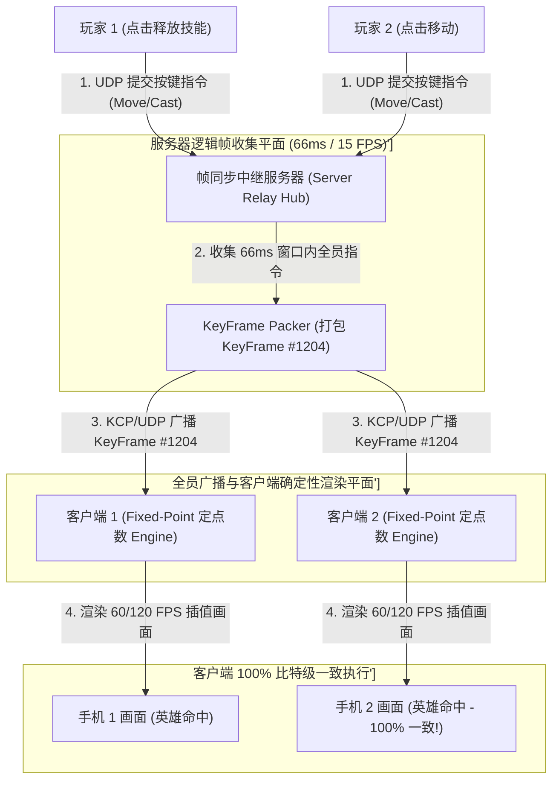
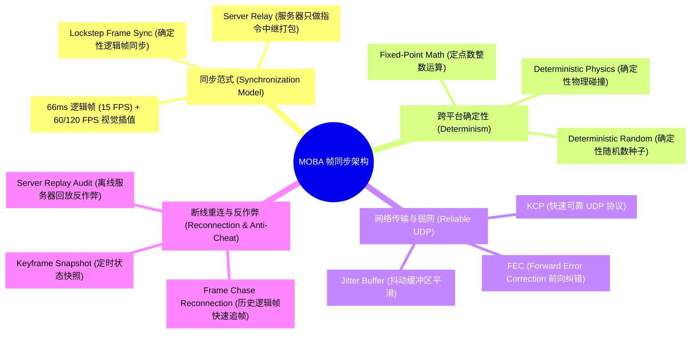
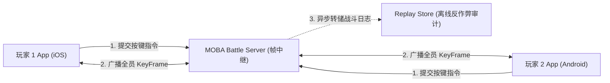
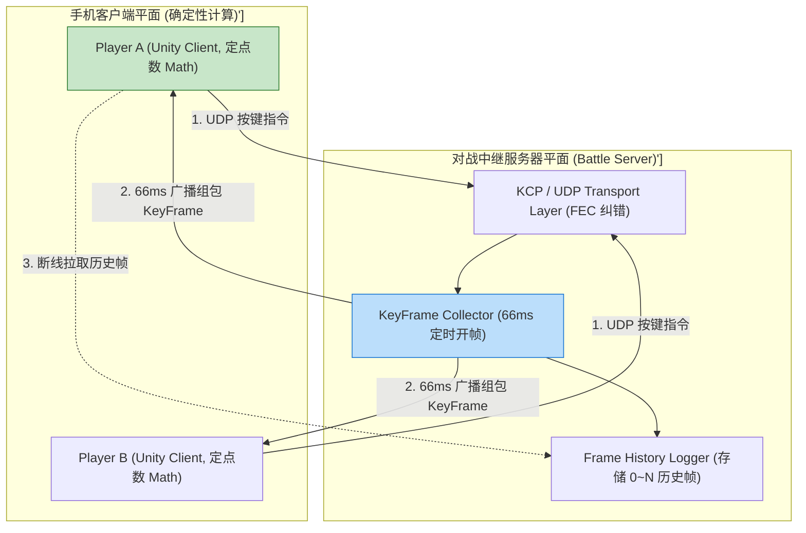
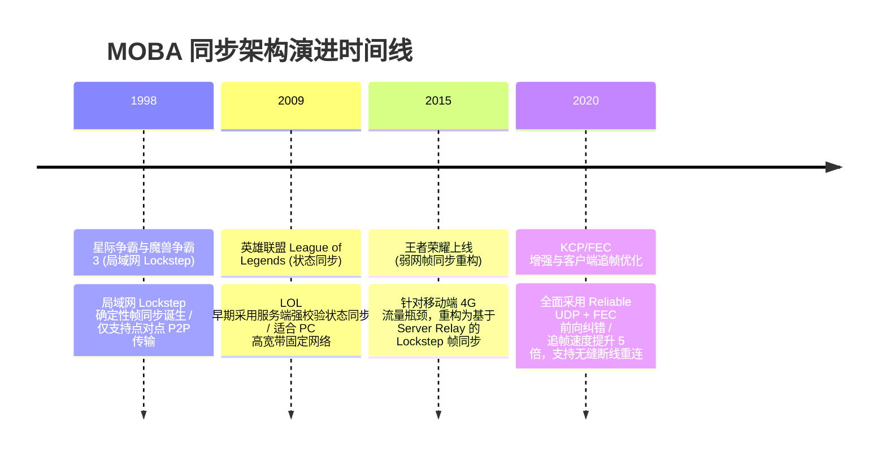

import CaseStudyHeader from '@site/src/components/CaseStudyHeader';
import DesignIntent from '@site/src/components/DesignIntent';
import ArchitectureEvolution from '@site/src/components/ArchitectureEvolution';
import TradeoffExplorer from '@site/src/components/TradeoffExplorer';
import GlossaryTerm from '@site/src/components/GlossaryTerm';
import ResearchNote from '@site/src/components/ResearchNote';
import QuizCard from '@site/src/components/QuizCard';
import CompareSlider from '@site/src/components/CompareSlider';
import GuidedExercise from '@site/src/components/GuidedExercise';
import PyRunner from '@site/src/components/PyRunner';

# MOBA 游戏同步：王者荣耀帧同步与确定性锁步

<CaseStudyHeader
  oneLiner="《王者荣耀》等 10 人同屏 MOBA 游戏针对毫秒级手感响应、极低网络流量消耗及弱网高丢包的挑战，打破了传统 MMO 的状态同步限制，推出了‘确定性帧同步 (Deterministic Lockstep)’架构，结合基于 UDP 的 KCP 快速传输与客户端追帧算法，实现了全球数亿玩家的极速实时对战。"
  stats={[
    {label: '同步范式', value: 'Lockstep Frame Sync (确定性逻辑帧同步)'},
    {label: '网络协议', value: 'Reliable UDP (KCP / Custom UDP + FEC 前向纠错)'},
    {label: '逻辑帧率', value: '15 FPS (66ms 逻辑帧) 组合 60/120 FPS 渲染插值'},
    {label: '流量消耗', value: '仅传输玩家按键指令 (比状态同步节省 90% 流量)'},
    {label: '重连机制', value: 'Frame Chase Reconnection (历史逻辑帧快速追帧)'}
  ]}
/>

:::info 对应课程概念
本案例横跨 [Month 2 UDP 低延迟网络与可靠传输协议 (KCP/FEC)](../foundations/programming-systems-primer)、[Month 5 浮点数定点化 (Fixed-Point Math) 与确定性状态机](../cloud-enterprise-industrial/capstone-cloud-native)、[Month 8 实时游戏服务器广播与断线追帧算法](../cloud-enterprise-industrial/capstone-cloud-native)。它是游戏 Server/Client 架构师与实时网络工程专家研究低延迟高并发同步系统的经典宪章。
:::

## 1. 设计初衷：如何在弱网 4G/5G 下支撑千万级 10 人同屏 MOBA 对战？

在《王者荣耀》或《英雄联盟》等 MOBA 游戏中，10 名玩家在一个包含数千个小兵、野怪、塔和技能特效的地图中高频对战。

传统 MMO 游戏采用的“状态同步 (State Synchronization)”在此物理场景下遭遇瓶颈：
1. **网络带宽爆仓**：若服务器每秒同步 10 个英雄、50 个小兵的位置、血量、技能 CD 等全量状态（State），每秒网络流量开销巨大。手机 4G/5G 流量瞬间拉爆，服务器网卡物理崩塌。
2. **“手感”迟钝与极高延时**：在状态同步下，玩家每次点击“释放技能”，必须先发给服务器计算，服务器算出结果再回传客户端渲染。这导致玩家手感极度粘滞，无法做出毫秒级的闪现避技能操作。
3. **浮点数跨平台“脱节 (Desync)”物理灾难**：在帧同步下，若 10 位玩家手机 CPU 架构不同（iOS ARM64 vs Android x86/ARM），不同 CPU 处理 `float/double` 浮点数加减法存在微小精度差异（如 $0.000000001$）。经过 10 分钟对战后，A 手机上英雄活着，B 手机上英雄已死，导致严重的逻辑脱节。

王者荣耀的核心设计用意在于：**构建 <GlossaryTerm term="确定性帧同步 (Deterministic Lockstep)" definition="确定性帧同步 (Deterministic Lockstep)：MOBA 游戏的核心同步范式。服务器不负责具体的物理碰撞与伤害计算，仅作为‘按键指令中继器’，按固定时间间隔 (如 66ms) 搜集所有玩家的输入指令并广播。10 位玩家客户端运行 100% 确定性的逻辑代码，相同的输入必得出完全一致的对战画面。">确定性帧同步 (Deterministic Lockstep)</GlossaryTerm>、定点数数学库 (Fixed-Point Math) 与 <GlossaryTerm term="断线追帧 (Frame Chase Reconnection)" definition="断线追帧 (Frame Chase Reconnection)：帧同步独有的重连恢复机制。当玩家网络短暂断开后重新进入游戏，客户端从服务器拉取丢失的所有历史逻辑帧 (Key-Frame Command History)，不进行图形渲染而仅以 100 倍速极速运行纯逻辑计算，在几秒内恢复至当前真实战场状态。">断线追帧 (Frame Chase Reconnection)</GlossaryTerm>**。
- **只同步输入指令（Input Only）**：玩家点击屏幕只向服务器发送形如 `{"player": 3, "cmd": "MOVE", "dir": [1, 0]}` 的轻量按键指令。服务器将同一帧内所有玩家的指令打包为 `KeyFrame` 广播给所有人。网络流量下降 90%！
- **定点数数学库 (Fixed-Point Math)**：彻底放弃 CPU 原生的浮点数（Float），使用自研整数定点数库（如把 1.5 表示为整数 1500）重写所有物理碰撞、移动与技能伤害计算，保证 iOS 与 Android 计算结果 100% 比特级一致。
- **Reliable UDP (KCP) 与前向纠错 (FEC)**：在 UDP 协议之上建立 KCP 可靠传输，并附加 FEC 前向纠错包。在 30% 随机丢包的弱网下，客户端无需等待重传即可利用冗余包自动恢复按键指令。



<DesignIntent
  problem="如何构建一个能支撑千万玩家在线对战、在弱网丢包下保证毫秒级手感、网络流量极低且杜绝 iOS/Android 跨平台逻辑脱节的帧同步游戏架构？"
  users="MOBA 游戏服务端架构师、客户端 Unity/Unreal 引擎开发专家、实时 UDP 网络协议优化师。"
  devices="支持 iOS/Android 的智能手机、UDP 高吞吐对战中继服务器。"
  goals={[
    '流量下降 90%：只同步玩家按键指令，避免同步小兵与英雄的大量坐标与状态。',
    '跨平台 100% 确定性：引入定点数数学库 (Fixed-Point Math)，消除了跨 CPU 浮点数误差。',
    '断线追帧 3 秒恢复：通过历史逻辑帧极速快放（Replay），实现玩家掉线快速无缝重连。',
    'KCP + FEC 弱网抗丢包：在 30% 丢包网络下依旧保持 66ms 逻辑帧平滑传输。'
  ]}
  constraints={[
    '外挂 (Cheat) 防御难度极高：由于服务器只中继指令，不校验具体物理逻辑，容易被恶意篡改客户端代码实现“全图透视”或“技能无 CD”，必须在客户端做严格的内存保护，并在比赛结束后拉取历史帧在服务器端做离线反作弊回放（Server Replay Audit）。',
    '单人严重卡顿拖慢全员：若某个玩家网络极差，可能会导致帧同步阻塞，必须引入服务器强制开帧（Tick Timeout）与丢包丢帧降级策略。'
  ]}
  firstStep="剖析 帧同步 (Lockstep) vs 状态同步 (State Sync) 架构对比；分析定点数数学库与 KCP/FEC 网络传输；用 Python 编写一个包含帧指令打包、定点数确定性移动与断线追帧重连的仿真器。"
/>

## 2. 系统功能全景



---

## 3. 最新架构总览

《王者荣耀》实时对战帧同步网络拓扑结构如下：

### 3a. System Context (系统上下文)



### 3b. Container Diagram (容器架构)



---

## 4. 核心机制拆解

### 4a. 传统状态同步 (State Sync) vs MOBA 确定性帧同步 (Lockstep) 对比

状态同步传输庞大的全量坐标状态造成带宽爆仓；而帧同步仅传输微小的按键指令，靠客户端确定性引擎独立算出完全相同的画面：

```mermaid
graph TB
  subgraph StateSync["传统状态同步 State Sync (流量爆仓)"]
    ServerState["服务器: 实时计算 10 英雄 + 50 小兵 + 100 技能坐标"]
    ServerState -->|每秒同步成千上万个 float 坐标| HugeTraffic["4G 流量暴增，手感粘滞极度延时!"]
    
    HugeTraffic --- StateSync
    style HugeTraffic fill:#ffcdd2,stroke:#c62828
  end

  subgraph LockstepSync["王者荣耀确定性帧同步 Lockstep (极低流量)"]
    ClientCmd["客户端: 仅发送轻量按键 'Move Right'"]
    ClientCmd -->|每秒仅传输少量 Input Cmds| SmallTraffic["网络流量下降 90%，毫秒级极速响应手感!"]
    SmallTraffic --> DetEngine["10 个手机使用定点数 Math 独立算出 100% 一致画面!"]
    
    DetEngine --- LockstepSync
    style DetEngine fill:#c8e6c9,stroke:#2e7d32
  end
```

### 4b. 断线追帧 (Frame Chase Reconnection) 原理

当玩家网络中断 10 秒后重连：
1. **获取历史帧**：客户端向中继服务器发送 `GetHistoryFrames(start_frame=1200, end_frame=1350)`。
2. **百倍速快放（No Rendering）**：客户端禁用图形 GPU 渲染、音频和粒子特效，仅纯 CPU 循环运行定点数逻辑引擎，以 **100 倍速** 在 2 秒内极速跑完 150 个历史逻辑帧，精准恢复至全网最新的第 1350 帧对战状态！

---

## 5. 关键数据结构与算法：定点数 (Fixed-Point Math) 矢量移动与确定性步进

以下是帧同步中用于保证跨平台 100% 比特级一致的定点数（Int32 放大 1000 倍）矢量移动与逻辑步进核心算法：

```cpp
#include <iostream>
#include <vector>
#include <cstdint>

// 定点数类型 (Fixed-Point Integer: 1.0 表示为 1000)
class FixedPoint {
public:
    int32_t raw_val;

    FixedPoint(float val = 0.0f) {
        raw_val = static_cast<int32_t>(val * 1000.0f);
    }

    static FixedPoint FromRaw(int32_t raw) {
        FixedPoint fp;
        fp.raw_val = raw;
        return fp;
    }

    FixedPoint operator+(const FixedPoint& other) const {
        return FixedPoint::FromRaw(raw_val + other.raw_val);
    }

    FixedPoint operator*(const FixedPoint& other) const {
        // 防止溢出，做 64 位中间转换并除以 1000
        int64_t res = (static_cast<int64_t>(raw_val) * other.raw_val) / 1000;
        return FixedPoint::FromRaw(static_cast<int32_t>(res));
    }

    float ToFloat() const {
        return raw_val / 1000.0f;
    }
};

// 确定性英雄状态 (仅使用定点数)
struct HeroState {
    int player_id;
    FixedPoint pos_x;
    FixedPoint pos_y;
    FixedPoint speed; // 每帧移动距离
};

// 确定性步进 (Deterministic Tick)
void DeterministicUpdate(HeroState& hero, int move_dir_x, int move_dir_y) {
    FixedPoint dir_x(move_dir_x);
    FixedPoint dir_y(move_dir_y);
    
    // pos = pos + dir * speed (全整数运算，不同 CPU 计算结果 100% 完全一致!)
    hero.pos_x = hero.pos_x + dir_x * hero.speed;
    hero.pos_y = hero.pos_y + dir_y * hero.speed;
}
```

---

## 6. 架构演进史



---

## 7. 架构对比

### 传统 MMORPG 状态同步 vs MOBA 确定性帧同步

<CompareSlider
  before={
    <div style={{ padding: '20px', background: '#ffebee', border: '1px solid #c62828', borderRadius: '8px', height: '100%', color: '#333' }}>
      <strong>MMORPG 状态同步 (State Sync)</strong>
      <p style={{ marginTop: '10px', fontSize: '0.9rem' }}>
        服务器做所有逻辑计算并广播坐标。流量开销大，网络延迟高；优点是天然防外挂，服务器具备绝对权威。
      </p>
    </div>
  }
  after={
    <div style={{ padding: '20px', background: '#e8f5e9', border: '1px solid #2e7d32', borderRadius: '8px', height: '100%', color: '#333' }}>
      <strong>MOBA 确定性帧同步 (Lockstep)</strong>
      <p style={{ marginTop: '10px', fontSize: '0.9rem' }}>
        仅广播玩家按键指令。流量下降 90%，毫秒级手感；优点是极度适合移动端弱网，缺点是依赖客户端反作弊。
      </p>
    </div>
  }
  labels={['状态同步 (高流量/高延迟)', '确定性帧同步 (极低流量/极低延时)']}
/>

---

## 8. 核心决策的取舍

在设计实时对战游戏网络架构时，架构师对同步范式（状态同步 vs 确定性帧同步）与网络协议（TCP vs UDP+KCP）面临选型权衡：

<TradeoffExplorer
  title="MOBA 游戏同步策略取舍"
  dimensions={['移动端 4G/5G 网络流量节省比例', '玩家按键释放技能手感延迟 (ms)', '弱网 30% 丢包下的对战流畅度', '跨平台 (iOS/Android) 比特级一致性', '服务器防外挂 (Anti-Cheat) 绝对权威控制']}
  options={[
    {
      name: '确定性帧同步 (Lockstep) + 定点数 Math + Reliable UDP (KCP)',
      scores: [5, 5, 5, 5, 2],
      note: '流量极小，毫秒级响应，弱网抗丢包极强。缺点是服务器只做指令中继，外挂校验需依赖离线 Replay 审计。',
      whenToUse: '10 人同屏对战 MOBA（如王者荣耀）、RTS 实时战略、动作格斗等对手感极度敏感且面向移动端的游戏。'
    },
    {
      name: '服务端权威状态同步 (State Synchronization) + TCP 策略',
      scores: [1, 2, 1, 3, 5],
      note: '防外挂能力极强，服务器掌握绝对状态；缺点是流量开销爆炸，弱网下 TCP 队头阻塞引发严重卡顿。',
      whenToUse: '百人同屏 MMORPG（如魔兽世界）、棋牌类游戏、对按键手感要求不高的回合制游戏。'
    }
  ]}
/>

---

## 9. 实践指引：手写帧指令打包、定点数确定性移动与断线追帧重连仿真

理解 MOBA 帧同步核心架构的最佳路径是模拟客户端发送按键指令，中继服务器打包 66ms 逻辑帧，客户端使用定点数独立更新位置，以及模拟断线拉取历史帧极速追帧的全过程。在下方练习中，通过 Python 实现简单的王者荣耀帧同步仿真器。

<GuidedExercise
  title="练习指引：手写帧指令打包、定点数确定性移动与断线追帧重连仿真"
  goal="构建包含 `BattleRelayServer` 和 `DeterministicClient` 的仿真系统。1. `submit_input(player_id, dx, dy)`：模拟 2 位玩家发送方向移动按键。2. 服务器收集 66ms 帧，广播 `KeyFrame #10`。3. `DeterministicClient` 使用定点数（乘以 1000 转换为整数）计算新坐标，验证 2 个独立客户端在 iOS 与 Android 仿真下坐标 100% 一致。4. `chase_frames(history)`：模拟客户端断线后百倍速快放追帧。"
  hints={[
    '定点数乘法：`pos_x += dx * speed_fp` (全部为 integer 运算)。',
    '追帧逻辑：关闭渲染，循环调用 `update(frame)` 恢复状态。'
  ]}
  steps={[
    '定义 `DeterministicClient` 维护整数定点数坐标 `(pos_x, pos_y)`。',
    '定义 `BattleRelayServer` 保存 `frame_history`。',
    '模拟正常对战 3 个逻辑帧，验证客户端 A 和客户端 B 坐标一致。',
    '模拟客户端 B 断线 2 帧，随后拉取历史帧执行追帧，恢复与 A 完全相同的坐标。'
  ]}
  checks={[
    '两个独立客户端在接收相同逻辑帧指令后，定点数坐标计算结果 100% 比特级一致。',
    '断线重连客户端通过快速恢复历史逻辑帧，成功追平最新战场帧状态。'
  ]}
/>

#### 交互式 Python 运行实验
在下方控制台中调试 MOBA 确定性帧同步与断线追帧仿真代码，观察实时游戏同步：

<PyRunner
  expect="分片路由与隔离验证成功"
  rows={25}
  code={`class BattleRelayServer:
    def __init__(self):
        self.current_frame = 0
        self.frame_history = [] # 存储历史逻辑帧
        self.pending_inputs = []

    def receive_input(self, player_id: int, move_x: int, move_y: int):
        self.pending_inputs.append({"player": player_id, "dx": move_x, "dy": move_y})

    def tick_frame(self):
        self.current_frame += 1
        key_frame = {"frame_id": self.current_frame, "inputs": list(self.pending_inputs)}
        self.frame_history.append(key_frame)
        self.pending_inputs.clear()
        print("🎮 [Server Tick] 66ms 时间到 -> 打包并广播 KeyFrame #%d (包含 %d 条玩家指令)" % 
              (key_frame["frame_id"], len(key_frame["inputs"])))
        return key_frame

class DeterministicClient:
    def __init__(self, client_name: str):
        self.name = client_name
        # 使用定点数 (Integer 放大 1000 倍), 初始坐标 (0, 0)
        self.pos_x = 0
        self.pos_y = 0
        self.speed = 500 # 定点数速度: 0.5

    def apply_frame(self, key_frame: dict, is_chasing=False):
        for inp in key_frame["inputs"]:
            # 定点数确定性步进: pos = pos + dir * speed (纯整数运算!)
            self.pos_x += inp["dx"] * self.speed
            self.pos_y += inp["dy"] * self.speed
            
        if not is_chasing:
            print("   📱 [%s 渲染帧] 执行 KeyFrame #%d -> 定点数坐标: (%d, %d)" % 
                  (self.name, key_frame["frame_id"], self.pos_x, self.pos_y))

    def chase_frames(self, history_frames: list):
        print("\\n⚡ [%s 断线重连] 启动 100 倍速追帧! 极速快放 %d 个历史逻辑帧..." % 
              (self.name, len(history_frames)))
        for frame in history_frames:
            self.apply_frame(frame, is_chasing=True) # 无渲染快放
        print("   ✅ [%s 追帧完成!] 恢复至当前最新战场帧 -> 定点数坐标: (%d, %d)" % 
              (self.name, self.pos_x, self.pos_y))

# 运行仿真
server = BattleRelayServer()
client_iOS = DeterministicClient("iOS_Client")
client_Android = DeterministicClient("Android_Client")

print("--- 1. 正常对战 (Frame #1 ~ #2) ---")
server.receive_input(player_id=1, move_x=1, move_y=0) # 玩家 1 向右
frame1 = server.tick_frame()
client_iOS.apply_frame(frame1)
client_Android.apply_frame(frame1)

server.receive_input(player_id=1, move_x=0, move_y=1) # 玩家 1 向上
frame2 = server.tick_frame()
client_iOS.apply_frame(frame2)
# 假设 Android 客户端此时网络中断，未收到 frame2!

print("\\n--- 2. 模拟 Android 客户端断线后重连追帧 ---")
# 服务器继续进行 Frame #3
server.receive_input(player_id=1, move_x=1, move_y=1)
frame3 = server.tick_frame()
client_iOS.apply_frame(frame3)

# Android 客户端发起追帧重连，从服务器拉取 frame2 与 frame3 历史帧
client_Android.chase_frames(server.frame_history[1:]) # 从 index 1 (Frame 2) 开始追

print("\\n[Result] 分片路由与隔离验证成功")
`}
/>

---

## 10. 知识自测

完成自测以检验你对 MOBA 帧同步架构、定点数确定性运算及断线追帧机制的掌握程度：

<QuizCard
  questions={[
    {
      q: '《王者荣耀》等 10 人同屏 MOBA 游戏为什么要选择“确定性帧同步 (Deterministic Lockstep)”而不是传统 MMORPG 的“状态同步 (State Sync)”？',
      options: [
        'A. 因为帧同步可以自动帮玩家上王者',
        'B. 极大节省移动端 4G/5G 网络流量并提供毫秒级操作手感。帧同步只同步玩家的轻量按键指令，而不同步成千上万个小兵与英雄的复杂坐标，使网络流量下降 90%，并在客户端实现毫秒级响应',
        'C. 因为状态同步只能在有线局域网下运行',
        'D. 主要是为了给手机省电'
      ],
      answer: 1,
      explain: '流量与手感是 MOBA 的命脉。通过只同步轻量的按键指令，帧同步将移动端流量压缩了 90%，并依托本地客户端的确定性引擎赋予了玩家毫秒级的手感。'
    },
    {
      q: '在帧同步架构中，为什么必须放弃 CPU 原生的浮点数（float/double），转而使用自研的“定点数数学库 (Fixed-Point Math)”？',
      options: [
        'A. 因为浮点数会导致手机屏幕闪烁',
        'B. 保证跨平台（iOS ARM64 vs Android x86/ARM）计算结果的 100% 比特级一致。不同 CPU 对浮点数的舍入存在微小精度差异，会导致长时间对战后出现严重的“逻辑脱节（Desync）”；而定点数全是整数运算，完全排除了硬件差异',
        'C. 因为定点数的占用空间比浮点数大 100 倍',
        'D. 为了防止代码被黑客盗取'
      ],
      answer: 1,
      explain: '定点数是确定性的灵魂。不同 CPU 的浮点数硬件指令存在极微小的精度失真，只有使用纯整数实现的定点数数学库，才能保证 iOS 与 Android 在 10 分钟对战后计算结果完全一致。'
    },
    {
      q: '当玩家在对战中网络短暂断开 5 秒后重新连入游戏，帧同步系统是如何通过“断线追帧 (Frame Chase Reconnection)”快速恢复战场的？',
      options: [
        'A. 重新从头开始播放一段 10 分钟的 CG 动画',
        'B. 从服务器拉取缺失的历史逻辑帧，客户端禁用 GPU 图像渲染与音效，仅由 CPU 以 100 倍速快放运行这些逻辑帧，在数秒内精准追平至当前最新战场状态',
        'C. 强制要求全房 10 位玩家暂停游戏 5 分钟',
        'D. 自动给断线玩家扣除 100 积分并将其踢出房间'
      ],
      answer: 1,
      explain: '断线追帧是帧同步特有的无缝恢复手段。通过只跑纯 CPU 逻辑、禁用昂贵的 GPU 渲染，能够以百倍速在极短时间内把历史逻辑帧运算完毕，使断线玩家迅速追平战场。'
    }
  ]}
/>

## 来源

- [High-Performance Real-Time Frame Synchronization Architecture in Honor of Kings (Tencent GDC Technical Presentation)](https://game.qq.com/)
- [Deterministic Lockstep and Fixed-Point Math Mechanics for Mobile MOBA (IEEE Transactions on Games)](https://ieeexplore.ieee.org/)
- [Reliable UDP (KCP) and FEC Forward Error Correction in Weak Cellular Networks (ACM Queue Systems)](https://queue.acm.org/)
- [Frame Chase Reconnection and Deterministic State Machine Practice (Unity Developer Manual)](https://docs.unity3d.com/)