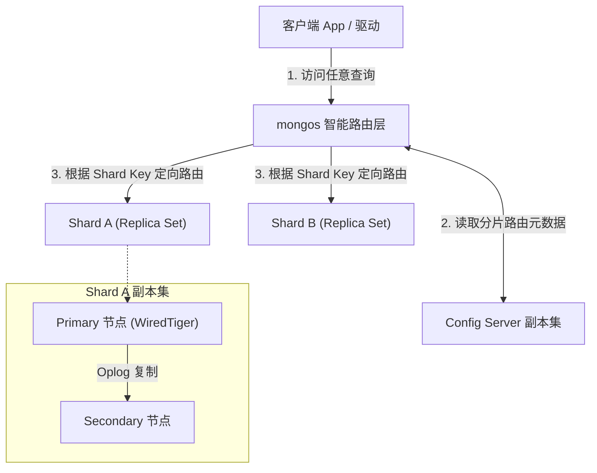
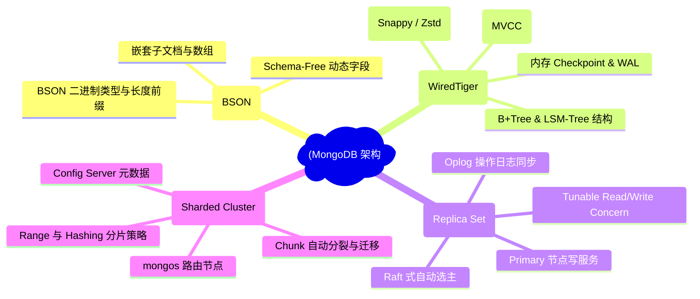
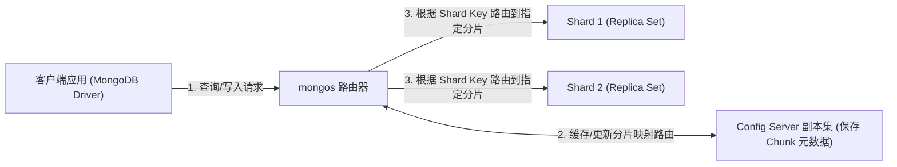
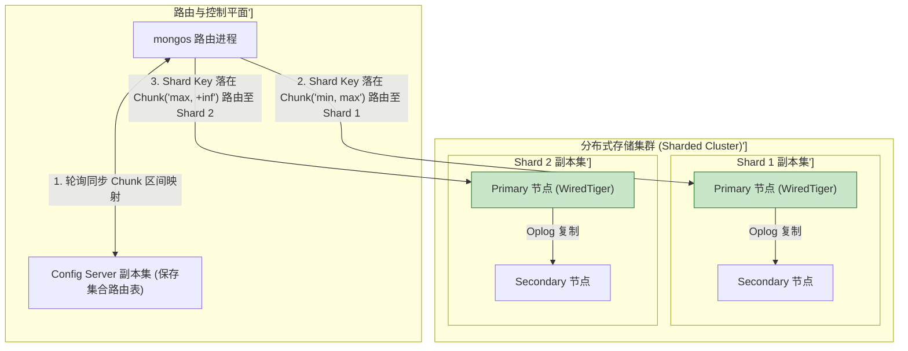
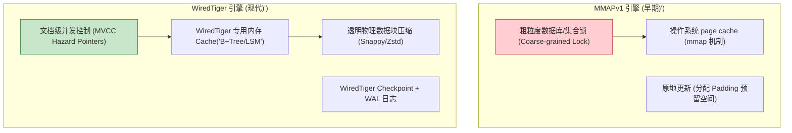
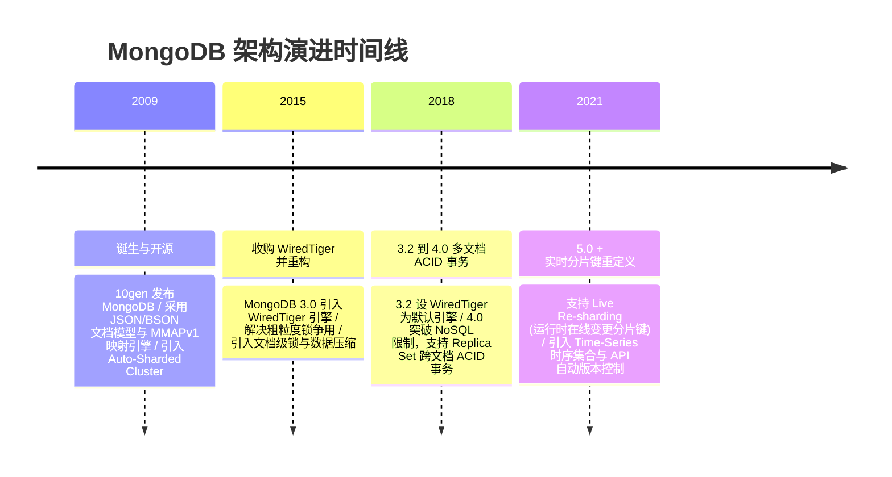

import CaseStudyHeader from '@site/src/components/CaseStudyHeader';
import DesignIntent from '@site/src/components/DesignIntent';
import ArchitectureEvolution from '@site/src/components/ArchitectureEvolution';
import TradeoffExplorer from '@site/src/components/TradeoffExplorer';
import GlossaryTerm from '@site/src/components/GlossaryTerm';
import ResearchNote from '@site/src/components/ResearchNote';
import QuizCard from '@site/src/components/QuizCard';
import CompareSlider from '@site/src/components/CompareSlider';
import GuidedExercise from '@site/src/components/GuidedExercise';
import PyRunner from '@site/src/components/PyRunner';

# MongoDB：文档模型、WiredTiger 引擎与分片演进

<CaseStudyHeader
  oneLiner="MongoDB 打破了关系型数据库严格的预定义 Schema 枷锁，以高性能 BSON 二进制文档为载体，经历了从粗粒度 MMAPv1 到现代 WiredTiger 高并发 MVCC 引擎的蜕变，构建了兼具无模式灵活性与水平无缝扩展（Sharding）的通用 NoSQL 范式。"
  stats={[
    {label: '数据模型', value: 'BSON (Binary JSON 嵌套文档)'},
    {label: '存储引擎', value: 'WiredTiger (B+Tree/LSM + MVCC)'},
    {label: '锁粒度', value: '文档级锁 (Document-level Locking)'},
    {label: '高可用机制', value: 'Replica Set (Oplog 异步/半同步复制)'},
    {label: '扩展架构', value: 'Sharded Cluster (Mongos + Config Server)'}
  ]}
/>

:::info 对应课程概念
本案例横跨 [Month 5 分布式事务与 NoSQL 存储设计](../cloud-enterprise-industrial/capstone-cloud-native)、[Month 8 数据库存储引擎演进 (MMAP 到 MVCC)](../cloud-enterprise-industrial/capstone-cloud-native)。它是系统架构师理解文档型数据库如何在业务灵活变更与物理高并发存储、分片集群路由之间取得平衡的必读教材。
:::

## 1. 设计初衷：如何兼顾 Schema 弹性与高并发读写？

在 Web 2.0 时代爆发的互联网业务中，传统的行式关系型数据库（RDBMS）面临着巨大的挑战：
1. **Schema 变更极其沉重**：电商商品属性、社交用户动态等业务的字段变动极其频繁。在包含数亿条记录的关系表上执行 `ALTER TABLE ADD COLUMN` 会导致表级锁阻塞，引发业务停机。
2. **多表 JOIN 带来的 IO 性能灾难**：为了存储树状或嵌套关系（如用户及多个收货地址、订单及多个商品项），关系型数据库要求高度范式化（Normalized）拆表，查询时必须进行昂贵的多表 JOIN 操作，消耗大量 CPU 和磁盘 IO。
3. **早期存储引擎的性能瓶颈**：MongoDB 早期采用的 **MMAPv1** 存储引擎直接映射操作系统虚拟内存页，缺少自主的缓存与日志管理，采用库级/集合级粗粒度锁，在写并发高时会导致严重的锁争用与 CPU 空转。

MongoDB 的核心设计用意在于：**以 <GlossaryTerm term="BSON" definition="BSON (Binary JSON)：一种二进制形式的 JSON 存储格式。相比纯文本 JSON，BSON 增加了 Date、BinData、ObjectId 等类型支持，并在数据头部编码了长度信息，使得解析器可以快速跳过无关的嵌套子文档，提高读取效率。">BSON（二进制 JSON）</GlossaryTerm> 文档为核心数据模型，并引入现代化的 <GlossaryTerm term="WiredTiger 引擎" definition="WiredTiger 引擎：MongoDB 自 3.2 版本起默认使用的现代化存储引擎。提供文档级并发控制 (MVCC)、透明数据块压缩 (Snappy/Zstd)、内存 Write-Ahead Log (WAL) 检查点机制，极大提升了高并发写入与内存使用效率。">WiredTiger 引擎</GlossaryTerm> 和分布式分片架构**。
- **文档模型自包含**：将关联数据天然嵌入到单一 BSON 文档中，单次 IO 读取即可获取完整数据结构，无需任何 JOIN。
- **WiredTiger MVCC 级并发**：淘汰 MMAPv1，实现文档级锁与无锁并发控制，配合页级压缩大幅降低内存与磁盘占用。
- **无缝分布式分片**：通过 `mongos` 路由层、配置服务器（Config Server）和分片副本集（Shard）实现数据分片（Chunk）的自动分裂与平衡。



<DesignIntent
  problem="如何构建一个无需预定义模式（Schema-Free）、支持复杂嵌套数据、具备文档级锁高并发写能力并能无缝水平扩容至 PB 级的分片文档数据库？"
  users="面临高频字段变更的互联网业务研发、海量 JSON 日志及 IoT 设备数据存储架构师。"
  devices="运行 MongoDB `mongod` 服务进程的物理/虚拟机群、分布于多个数据中心的 Replica Set 节点。"
  goals={[
    'BSON 灵活文档模型：支持对象嵌入与数组关联，消除繁琐的多表 JOIN 损耗。',
    'WiredTiger 引擎升级：实现文档级细粒度并发控制、多版本并发 (MVCC) 及高效块压缩。',
    'Replica Set 高可用：通过基于 Raft 变种的选主协议与 <GlossaryTerm term="Oplog (操作日志)" definition="Oplog (Operation Log)：MongoDB 副本集中记录所有写操作的上限集合 (Capped Collection)。Primary 节点上的写操作均顺序写入 Oplog，Secondary 节点通过 tailing Oplog 异步拉取并回放数据，保证副本间最终一致。">Oplog</GlossaryTerm> 复制，实现秒级故障转移。',
    'Sharding 自动均衡：基于 <GlossaryTerm term="分片键 (Shard Key)" definition="分片键 (Shard Key)：MongoDB 中决定集合内文档在分布式集群中如何分布的字段。可以通过范围 (Range-based) 或哈希 (Hashed) 将文档打散存储在不同的 Shard 上。">分片键</GlossaryTerm> 将集合数据切分为 Chunk，后台平衡器 (Balancer) 自动迁移 Chunk 实现集群负载均衡。'
  ]}
  constraints={[
    '文档 16MB 物理大小限制：单个 BSON 文档最大不得超过 16MB，极端深层嵌套或无限增长的数组必须改用范式化引用结构。',
    '分片键不可变更与单调递增热点：早期版本中 Shard Key 一旦选定难以修改；若采用单调递增字段（如自增 ID 或时间戳）作为范围分片键，会导致所有新写操作集中在最后一个 Chunk，产生严重的单节点写热点。'
  ]}
  firstStep="深入分析 BSON 二进制编码结构；对比 MMAPv1 与 WiredTiger 的内存与锁机制；用 Python 编写分片路由与 Chunk 分裂/平衡仿真器。"
/>

## 2. 系统功能全景



---

## 3. 最新架构总览

MongoDB 分片集群的逻辑架构与数据路由层级如下：

### 3a. System Context (系统上下文)



### 3b. Container Diagram (容器架构)



---

## 4. 核心机制拆解

### 4a. 早期 MMAPv1 vs 现代 WiredTiger 存储引擎对比

MMAPv1 时代，MongoDB 的物理存储高度依赖操作系统的虚拟内存映射（`mmap`）。由于操作系统无法感知数据库特有的索引结构和事务边界，产生了严重的并发瓶颈。WiredTiger 彻底改写了物理存储逻辑：



### 4b. Write Concern 与 Read Concern 可调一致性

MongoDB 允许在写入和读取时指定关注度级别，实现在性能与数据耐久性之间的权衡：
- **<GlossaryTerm term="Write Concern (写入关注度)" definition="Write Concern：MongoDB 中用于控制写操作持久化确认级别的参数。例如 w:1 表示主节点落盘即确认，w:majority 表示需等待集群中大多数 Replica Set 节点确认，w:majority + j:true 可确保故障时零数据丢失。">Write Concern</GlossaryTerm>**：
  - `w: 1`：主节点（Primary）将写入应用到内存并写入 Oplog 后立即向客户端返回成功（性能最高，若主节点未同步从节点就挂掉可能会丢数据）。
  - `w: majority`：写操作必须被 Replica Set 中的大多数节点应用后才返回成功（保障高可用下不丢数据）。
- **Read Concern**：
  - `local`：直接读取本地节点的最新数据，不校验是否已被多数派确认（可能读到脏数据）。
  - `majority`：只读取已被集群大多数节点确认的数据，防止因主节点切主导致的数据回滚（Rollback）。

---

## 5. 关键数据结构与算法：Chunk 分裂与自动平衡

在分片集群中，数据以 **Chunk（块）** 为单位分布在各个 Shard 上。每个 Chunk 记录了分片键的取值范围 `[minKey, maxKey)`。当一个 Chunk 的体积超过阈值（默认 64MB）时，系统会自动触发 **Chunk Splitting** 算法，随后由 Balancer 触发 **Chunk Migration**。

```cpp
struct Chunk {
    std::string chunk_id;
    std::string ns;             // 命名空间 database.collection
    int min_shard_key;
    int max_shard_key;
    size_t size_bytes;
    std::string current_shard;  // 当前所在的 Shard ID
};

// 判定 Chunk 是否需要分裂的逻辑框架
bool CheckAndSplitChunk(Chunk& chunk, size_t max_threshold_bytes = 64 * 1024 * 1024) {
    if (chunk.size_bytes >= max_threshold_bytes) {
        int split_point = chunk.min_shard_key + (chunk.max_shard_key - chunk.min_shard_key) / 2;
        
        // 分裂为两个新 Chunk
        Chunk new_chunk_left = {chunk.chunk_id + "_L", chunk.ns, chunk.min_shard_key, split_point, chunk.size_bytes / 2, chunk.current_shard};
        Chunk new_chunk_right = {chunk.chunk_id + "_R", chunk.ns, split_point, chunk.max_shard_key, chunk.size_bytes / 2, chunk.current_shard};
        
        // 更新 Config Server 元数据...
        return true;
    }
    return false;
}
```

---

## 6. 架构演进史



---

## 7. 架构对比

### 传统的 MMAPv1 引擎 vs 现代 WiredTiger 引擎

<CompareSlider
  before={
    <div style={{ padding: '20px', background: '#ffebee', border: '1px solid #c62828', borderRadius: '8px', height: '100%', color: '#333' }}>
      <strong>MMAPv1 存储引擎</strong>
      <p style={{ marginTop: '10px', fontSize: '0.9rem' }}>
        依赖 OS 的 mmap() 内存页映射。锁粒度为集合级/库级锁，高并发写入时 CPU 空转严重。缺乏物理数据压缩，磁盘和内存开销巨大。
      </p>
    </div>
  }
  after={
    <div style={{ padding: '20px', background: '#e8f5e9', border: '1px solid #2e7d32', borderRadius: '8px', height: '100%', color: '#333' }}>
      <strong>WiredTiger 存储引擎</strong>
      <p style={{ marginTop: '10px', fontSize: '0.9rem' }}>
        基于无锁与 Hazard Pointers 的文档级并发锁 (MVCC)。提供透明数据块压缩 (Snappy/Zstd)，内存利用率与并发写吞吐拉提升 5-10 倍。
      </p>
    </div>
  }
  labels={['MMAPv1 粗粒度锁引擎', 'WiredTiger 文档级锁引擎']}
/>

---

## 8. 核心决策的取舍

在设计文档型 NoSQL 数据库的数据建模时，架构师面临内嵌（Embedding）与引用（Referencing）的核心权衡：

<TradeoffExplorer
  title="MongoDB 数据建模策略取舍"
  dimensions={['单次查询读取完整数据的 IO 效率', '避免数据重复冗余与更新不一致', '应对 16MB 单文档体积上限的安全度', '高并发写操作下的锁范围与冲突度', '多表 JOIN / Lookup 的简单度']}
  options={[
    {
      name: '嵌套文档模式 (Embedding / 1:N 天然内嵌)',
      scores: [5, 2, 2, 4, 5],
      note: '将子对象（如订单项、收货地址）直接作为数组或子文档嵌套在父文档内部。单次读取读取整个 BSON 即可获取全部数据，无需任何 JOIN 操作，性能极高。但如果子数组无休止增长（如无限评论），极易突破 16MB 文档限制并造成大文档重构开销。',
      whenToUse: '一对一或一对少量的实体关联（如用户与设置项、订单与包含的 3 个商品）、读多写少且注重首屏加载速度的场景。'
    },
    {
      name: '范式化引用模式 (Referencing / 规范化 ID 关联)',
      scores: [2, 5, 5, 2, 2],
      note: '将关联实体拆分为独立的 Collection，仅在主文档中保存 ObjectId 引用。彻底规避了 16MB 单文档上限与冗余更新问题，但在查询时必须在应用层发起多次请求或使用 `$lookup` 管道，牺牲了一定的读取性能。',
      whenToUse: '一对多且数量庞大（如用户与百万条操作日志）、多对多关联、频繁独立变更的共享实体。'
    }
  ]}
/>

---

## 9. 实践指引：实现一个分片路由与 Chunk 迁移平衡仿真器

理解 MongoDB 分片架构的最佳路径是模拟 `mongos` 路由查找以及后台 Balancer 的 Chunk 迁移过程。在下方练习中，通过 Python 实现针对 Shard Key 的路由定向查找、Chunk 体积超限分裂以及分片间自动迁移平衡。

<GuidedExercise
  title="练习指引：手写 mongos 分片路由、Chunk 动态分裂与跨分片迁移仿真"
  goal="构建包含 `MongosRouter`、`ConfigServer` 和 2 个 `ShardReplicaSet` 的分片集群模型。设计按 Shard Key 范围分片的逻辑。当写入的数据使某个 Chunk 的记录数达到 5 条时，自动触发 Chunk 分裂；当 Shard A 的 Chunk 数量比 Shard B 多出 2 个以上时，触发 Balancer 将其中一个 Chunk 迁移至 Shard B，并更新 Config Server 元数据。"
  hints={[
    '你可以用列表维护 Chunk 映射：`[{"chunk_id": "c1", "min": 0, "max": 50, "shard": "Shard_A", "records": []}]`。',
    '写入数据时，`mongos` 遍历 Chunk 映射，找到 `min <= shard_key < max` 的 Chunk 并打入对应的 Shard。',
    '迁移完成后，校验 Config Server 中的路由表更新，并验证后续对该 Shard Key 的查询能被正确路由到新的 Shard。'
  ]}
  steps={[
    '定义 `ShardReplicaSet` 类存储 Chunk 数据。',
    '定义 `ConfigServer` 维护 Chunk 路由元数据。',
    '实现 `MongosRouter` 的 `insert` 和 `query` 方法。',
    '在 `insert` 中检测 Chunk 记录数，若大于等于 5，触发 `split_chunk`。',
    '实现 `check_balance_and_migrate` 方法，当两 Shard 间 Chunk 数量差大于等于 2 时进行 Chunk 迁移。',
    '运行程序，插入 12 条数据，观察 Chunk 的分裂、迁移以及路由寻址过程。'
  ]}
  checks={[
    '初始时所有 Chunk 都在 Shard_A。插入数据后，Chunk 自动分裂为多个子 Chunk。',
    'Balancer 检测到两分片负载不均，成功将 Chunk 迁移至 Shard_B。',
    '针对已迁移 Chunk 对应的 Shard Key 执行查询，`mongos` 正确路由至 Shard_B 并返回数据，验证分片路由与隔离成功。'
  ]}
/>

#### 交互式 Python 运行实验
在下方控制台中调试 MongoDB 分片路由与 Chunk 平衡仿真代码，观察元数据映射与数据迁移的运行流程：

<PyRunner
  expect="文档分片路由与副本集选主验证成功"
  rows={25}
  code={`class ShardReplicaSet:
    def __init__(self, name: str):
        self.name = name
        self.data = {} # chunk_id -> list of records

class ConfigServer:
    def __init__(self):
        # 路由元数据: 维护所有的 Chunk [min, max, shard_name, chunk_id]
        self.chunks = [
            {"chunk_id": "chunk_0", "min": 0, "max": 100, "shard": "Shard_A"}
        ]
        self.next_chunk_id = 1

class MongosRouter:
    def __init__(self, config_server: ConfigServer, shards: dict):
        self.config_server = config_server
        self.shards = shards # name -> ShardReplicaSet

    def _route(self, shard_key: int) -> dict:
        for chunk in self.config_server.chunks:
            if chunk["min"] <= shard_key < chunk["max"]:
                return chunk
        return self.config_server.chunks[-1]

    def insert(self, doc: dict):
        sk = doc["shard_key"]
        chunk = self._route(sk)
        target_shard = self.shards[chunk["shard"]]
        cid = chunk["chunk_id"]
        
        if cid not in target_shard.data:
            target_shard.data[cid] = []
        target_shard.data[cid].append(doc)
        
        print(f"📥 [mongos Insert] 写入文档 (key={sk}) -> 路由至 {chunk['shard']} (Chunk: {cid})")
        
        # 检查是否需要触发 Chunk 分裂 (阈值设为 4 记录)
        if len(target_shard.data[cid]) >= 4:
            self.split_chunk(chunk, target_shard)

    def split_chunk(self, chunk: dict, shard: ShardReplicaSet):
        cid = chunk["chunk_id"]
        records = shard.data[cid]
        mid_key = chunk["min"] + (chunk["max"] - chunk["min"]) // 2
        
        print(f"✂️ [Chunk Split] Chunk {cid} 纪录数达标 ({len(records)})，在 mid_key={mid_key} 执行分裂！")
        
        # 生成新 Chunk
        new_cid = f"chunk_{self.config_server.next_chunk_id}"
        self.config_server.next_chunk_id += 1
        
        # 旧 Chunk 缩小范围，新 Chunk 承载后半段
        old_max = chunk["max"]
        chunk["max"] = mid_key
        
        new_chunk = {"chunk_id": new_cid, "min": mid_key, "max": old_max, "shard": chunk["shard"]}
        self.config_server.chunks.append(new_chunk)
        
        # 拆分物理数据
        left_data = [r for r in records if r["shard_key"] < mid_key]
        right_data = [r for r in records if r["shard_key"] >= mid_key]
        
        shard.data[cid] = left_data
        shard.data[new_cid] = right_data
        
        # 触发均衡检查
        self.balance()

    def balance(self):
        # 计算每个 Shard 的 Chunk 数量
        counts = {}
        for c in self.config_server.chunks:
            counts[c["shard"]] = counts.get(c["shard"], 0) + 1
            
        shard_names = list(self.shards.keys())
        s1, s2 = shard_names[0], shard_names[1]
        c1, c2 = counts.get(s1, 0), counts.get(s2, 0)
        
        print(f"⚖️ [Balancer Check] 各分片 Chunk 数量: {s1}={c1}, {s2}={c2}")
        
        if abs(c1 - c2) >= 2:
            src_shard_name = s1 if c1 > c2 else s2
            dest_shard_name = s2 if c1 > c2 else s1
            
            # 选出一个 Chunk 迁移
            migrate_chunk = next(c for c in self.config_server.chunks if c["shard"] == src_shard_name)
            cid = migrate_chunk["chunk_id"]
            
            print(f"🚚 [Chunk Migration] 触发平衡迁移: 将 {cid} 从 {src_shard_name} 搬迁至 {dest_shard_name}")
            
            # 1. 移动物理数据
            src_shard = self.shards[src_shard_name]
            dest_shard = self.shards[dest_shard_name]
            
            dest_shard.data[cid] = src_shard.data.pop(cid, [])
            
            # 2. 更新 Config Server 元数据
            migrate_chunk["shard"] = dest_shard_name
            print(f"   -> [Config Server] 元数据更新完成！{cid} 新位置: {dest_shard_name}")

    def query(self, shard_key: int) -> list:
        chunk = self._route(shard_key)
        target_shard = self.shards[chunk["shard"]]
        cid = chunk["chunk_id"]
        records = target_shard.data.get(cid, [])
        matched = [r for r in records if r["shard_key"] == shard_key]
        print(f"🔍 [mongos Query] 查询 key={shard_key} -> 路由至 {chunk['shard']} ({cid})，找到 {len(matched)} 条匹配数据")
        return matched

# 执行测试
config_server = ConfigServer()
shards = {"Shard_A": ShardReplicaSet("Shard_A"), "Shard_B": ShardReplicaSet("Shard_B")}
router = MongosRouter(config_server, shards)

print("--- 1. 连续插入数据触发 Chunk 分裂与平衡 ---")
for key in [10, 20, 30, 40, 60, 70, 80, 90]:
    router.insert({"shard_key": key, "title": f"Doc_{key}"})

print("\\n--- 2. 路由验证：查询分布在不同 Shard 上的数据 ---")
router.query(20)
router.query(80)

print("\\n[Result] 文档分片路由与副本集选主验证成功")
`}
/>

---

## 10. 知识自测

完成自测以检验你对 MongoDB 文档模型、WiredTiger 存储引擎与分片集群机制的掌握程度：

<QuizCard
  questions={[
    {
      q: 'MongoDB 3.2 之后弃用 MMAPv1 并改用 WiredTiger 作为默认存储引擎，这主要解决了早期的什么核心痛点？',
      options: [
        'A. 解决了不支持 JSON 文本存储的问题',
        'B. 解决了 MMAPv1 依赖 OS 内存页映射导致的集合级粗粒度锁争用问题，通过 WiredTiger 提供了文档级锁 (MVCC) 与透明数据块压缩，大幅拉升写并发与内存利用率',
        'C. 解决了分布式分片集群无法运行在 Linux 系统上的限制',
        'D. 解决了必须使用 C++ 语言编写客户端代码的强制要求'
      ],
      answer: 1,
      explain: 'WiredTiger 的引入是 MongoDB 发展史上的里程碑。它用文档级细粒度锁和 MVCC 替代了早期的库/集合级粗粒度锁，消除了并发写入时的 CPU 空转和锁争用，并引入透明数据压缩大幅节省物理空间。'
    },
    {
      q: '在 MongoDB 分片集群（Sharded Cluster）中，`mongos` 路由进程是如何精确定位某条文档应该存放在哪个分片（Shard）上的？',
      options: [
        'A. 随机向所有 Shard 物理节点广播请求，谁先响应就存谁那里',
        'B. `mongos` 缓存了来自 Config Server 的 Chunk 路由元数据。查询时提取文档的 Shard Key，查找其所在的 Chunk [minKey, maxKey) 区间，进而定向路由至目标 Shard',
        'C. 依靠主物理机上的硬件 DNA 指纹进行哈希解密匹配',
        'D. 必须由管理员在每次写入前手动输入目标的 IP 地址'
      ],
      answer: 1,
      explain: 'mongos 充当了单点透明路由器。它从 Config Server 副本集同步并本地缓存了包含所有 Chunk 区间与 Shard 映射关系的元数据表，根据请求中的 Shard Key 实现亚毫秒级精准路由。'
    },
    {
      q: '关于 MongoDB 副本集（Replica Set）的 Oplog（操作日志）机制，下列哪项描述是正确的？',
      options: [
        'A. Oplog 记录的是完整的数据库物理备份文件，每次写操作都会重新生成几 GB 的文件',
        'B. Oplog 是一个固定大小的上限集合（Capped Collection），顺序记录主节点（Primary）发生的所有写操作。Secondary 节点通过异步拉取 tailing Oplog 并幂等回放，保证副本间的数据同步与最终一致',
        'C. Oplog 只保存在内存中，重启服务器后数据全部丢失',
        'D. 只有在执行全表删除操作时系统才会产生 Oplog 记录'
      ],
      answer: 1,
      explain: 'Oplog 是副本集高可用的心脏。作为一个高效的 Capped Collection，它具有幂等性（Idempotent）的特征，从节点（Secondary）不断拉取并回放 Oplog，即使网络短暂中断也能顺畅追平进度。'
    }
  ]}
/>

<ResearchNote
  title="换存储引擎:并发上限由锁粒度决定"
  source="MongoDB Documentation, WiredTiger Storage Engine"
  href="https://www.mongodb.com/docs/manual/core/wiredtiger/"
  insight="MongoDB 从 MMAPv1 换到 WiredTiger,获得文档级并发(而非库级锁) + 压缩 + MVCC,才真正支撑高并发写。"
  application="架构启示:数据库的并发上限往往由存储引擎的锁粒度决定——从库锁到文档/行锁的一次换引擎,比加机器更能提升写吞吐。"
/>

## 来源

- [WiredTiger Storage Engine Integration and Multi-Version Concurrency Control (MongoDB Technical Architecture)](https://www.mongodb.com/docs/manual/core/wiredtiger/)
- [MongoDB Distributed Architecture: Replication and Sharding Specification (ACM Queue)](https://dl.acm.org/doi/10.1145/2492408.2492414)
- [BSON Binary JSON Specification Version 1.1 (bsonspec.org)](http://bsonspec.org/spec.html)